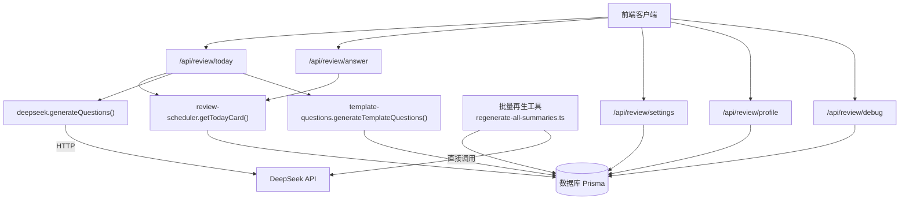
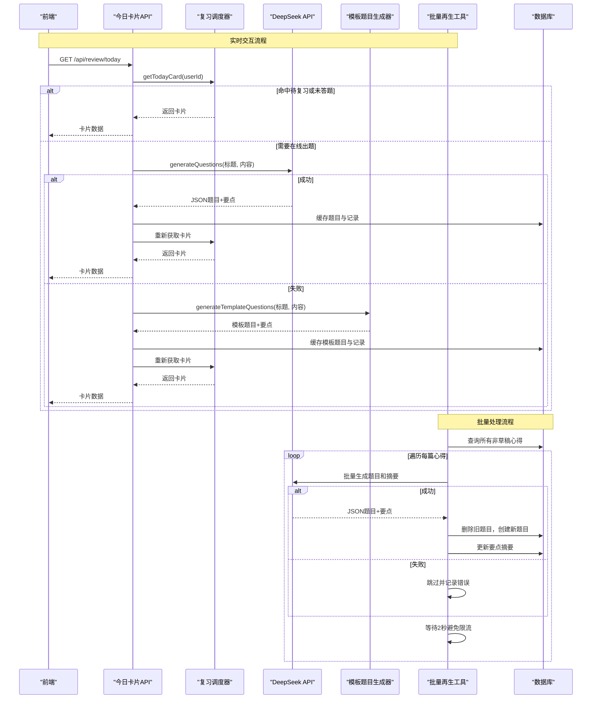
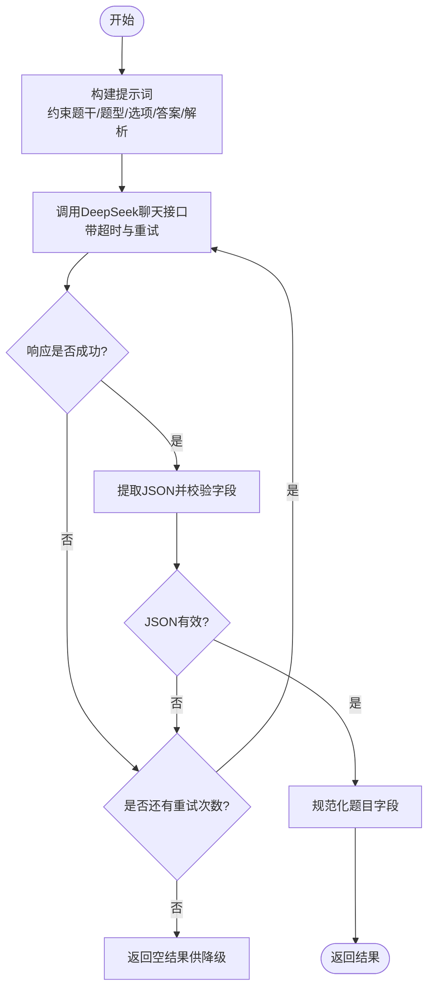
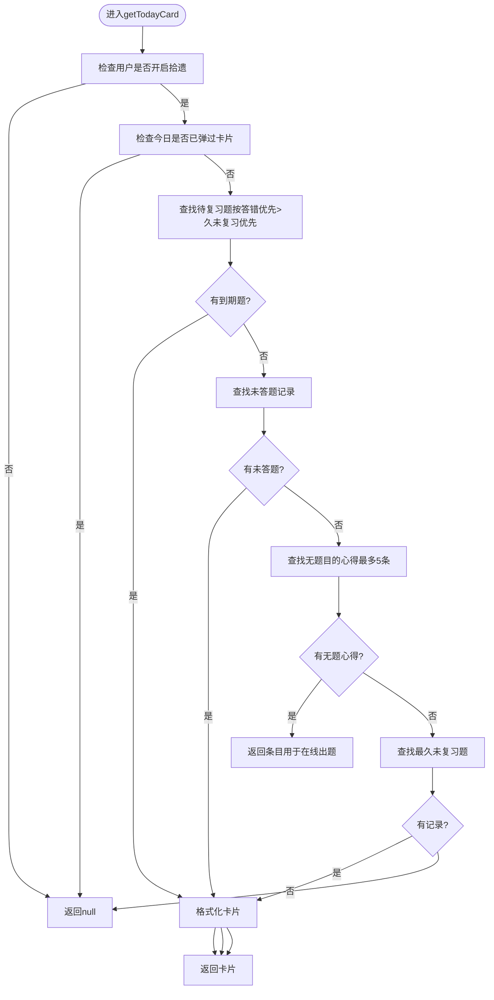
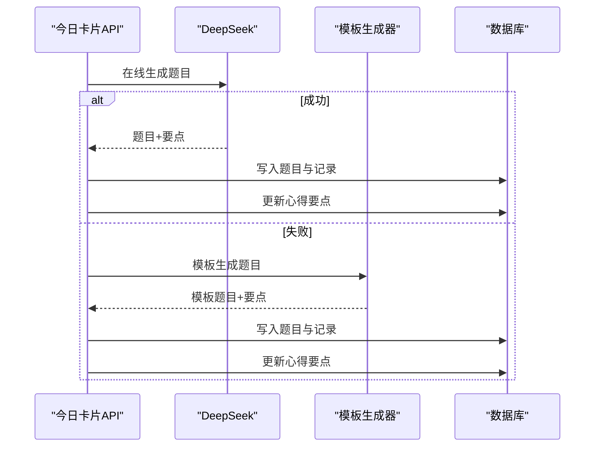
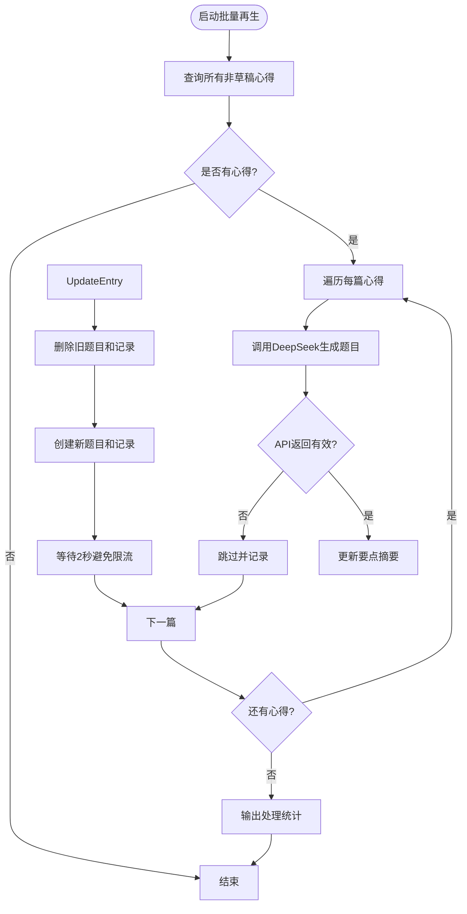
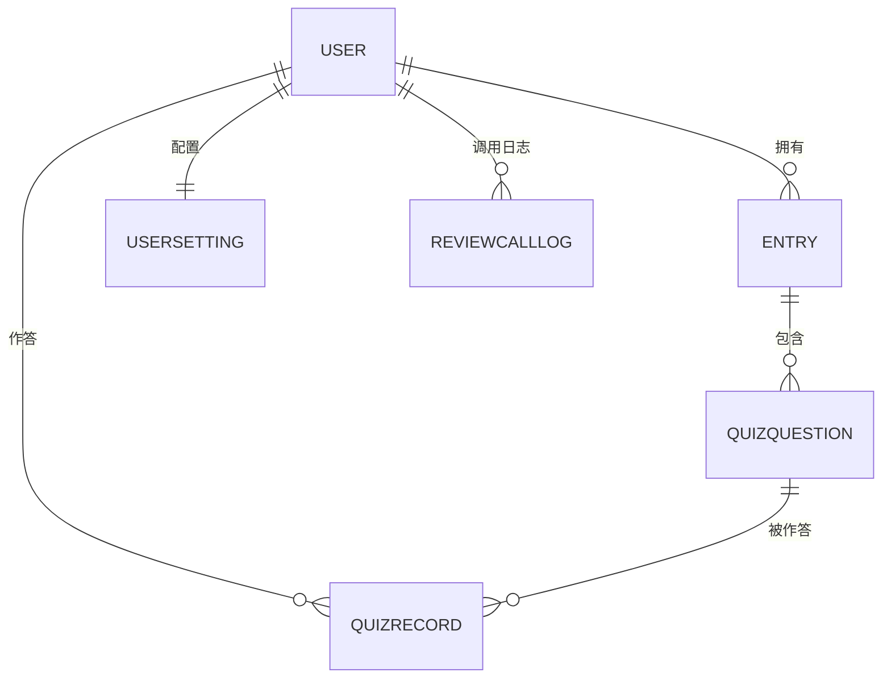
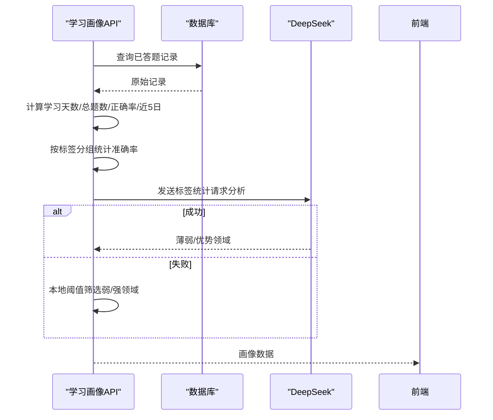
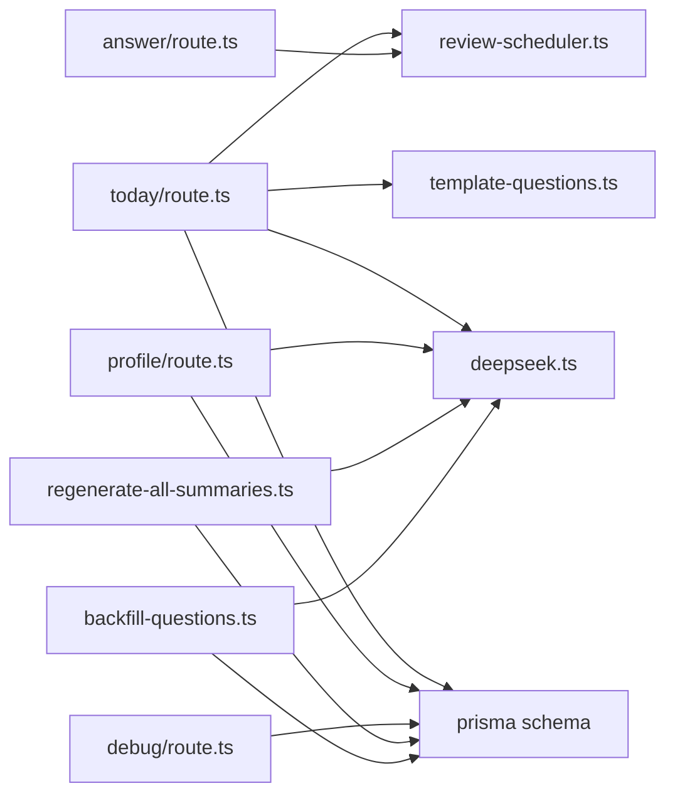

# AI复习系统

<cite>
**本文引用的文件**   
- [lib/deepseek.ts](file://lib/deepseek.ts)
- [lib/review-scheduler.ts](file://lib/review-scheduler.ts)
- [lib/template-questions.ts](file://lib/template-questions.ts)
- [app/api/review/today/route.ts](file://app/api/review/today/route.ts)
- [app/api/review/answer/route.ts](file://app/api/review/answer/route.ts)
- [app/api/review/settings/route.ts](file://app/api/review/settings/route.ts)
- [app/api/review/profile/route.ts](file://app/api/review/profile/route.ts)
- [app/api/review/debug/route.ts](file://app/api/review/debug/route.ts)
- [scripts/regenerate-all-summaries.ts](file://scripts/regenerate-all-summaries.ts)
- [scripts/backfill-questions.ts](file://scripts/backfill-questions.ts)
- [prisma/schema.prisma](file://prisma/schema.prisma)
</cite>

## 更新摘要
**变更内容**   
- 新增AI内容批量再生工具章节，详细介绍regenerate-all-summaries.ts脚本的功能和实现
- 更新API调用频率限制与成本控制策略，增加批量处理相关的优化建议
- 扩展错误处理与重试机制，涵盖批量处理的特殊场景
- 完善性能与成本优化章节，包含批量处理的缓存和限流策略
- 更新故障排查指南，增加批量处理相关的调试方法

## 目录
1. [简介](#简介)
2. [项目结构](#项目结构)
3. [核心组件](#核心组件)
4. [架构总览](#架构总览)
5. [详细组件分析](#详细组件分析)
6. [依赖关系分析](#依赖关系分析)
7. [性能与成本优化](#性能与成本优化)
8. [故障排查指南](#故障排查指南)
9. [结论](#结论)
10. [附录](#附录)

## 简介
本技术文档面向"心芽"的AI复习系统，系统性阐述以下能力：
- DeepSeek API集成与智能题目生成流程（含重试、超时、降级）
- 间隔重复算法实现（记忆曲线计算、复习计划调度）
- AI题目自动生成流水线（内容提取、问题生成、答案校验）
- **新增：AI内容批量再生工具（支持自定义API URL回退）**
- 答题记录存储结构与进度追踪机制
- 错误处理与重试策略
- API调用频率限制与成本控制策略
- 复习效果评估与改进机制
- AI服务监控与调试工具使用方法

## 项目结构
本项目采用Next.js App Router组织API路由，结合Prisma数据模型与本地库函数完成复习调度、AI题目生成与学习画像分析。关键路径包括：
- 复习卡片获取与在线出题：/api/review/today
- 提交答案与更新复习计划：/api/review/answer
- 设置开关与门槛控制：/api/review/settings
- 学习画像与分析：/api/review/profile
- 调试与统计：/api/review/debug
- **新增：批量内容再生工具：scripts/regenerate-all-summaries.ts**
- 数据模型定义：prisma/schema.prisma
- 核心逻辑库：lib/review-scheduler.ts、lib/deepseek.ts、lib/template-questions.ts

图表来源
- [app/api/review/today/route.ts:43-123](file://app/api/review/today/route.ts#L43-L123)
- [app/api/review/answer/route.ts:5-30](file://app/api/review/answer/route.ts#L5-L30)
- [app/api/review/settings/route.ts:5-62](file://app/api/review/settings/route.ts#L5-L62)
- [app/api/review/profile/route.ts:79-179](file://app/api/review/profile/route.ts#L79-L179)
- [app/api/review/debug/route.ts:5-68](file://app/api/review/debug/route.ts#L5-L68)
- [scripts/regenerate-all-summaries.ts:78-179](file://scripts/regenerate-all-summaries.ts#L78-L179)
- [lib/review-scheduler.ts:44-144](file://lib/review-scheduler.ts#L44-L144)
- [lib/deepseek.ts:17-115](file://lib/deepseek.ts#L17-L115)
- [lib/template-questions.ts:35-66](file://lib/template-questions.ts#L35-L66)
- [prisma/schema.prisma:150-209](file://prisma/schema.prisma#L150-L209)

章节来源
- [app/api/review/today/route.ts:43-123](file://app/api/review/today/route.ts#L43-L123)
- [scripts/regenerate-all-summaries.ts:78-179](file://scripts/regenerate-all-summaries.ts#L78-L179)
- [lib/review-scheduler.ts:44-144](file://lib/review-scheduler.ts#L44-L144)
- [lib/deepseek.ts:17-115](file://lib/deepseek.ts#L17-L115)
- [lib/template-questions.ts:35-66](file://lib/template-questions.ts#L35-L66)
- [prisma/schema.prisma:150-209](file://prisma/schema.prisma#L150-L209)

## 核心组件
- 复习调度器（review-scheduler）
  - 今日卡片选择：优先待复习题，其次未答题记录，再回退到无题目的心得触发在线出题，最后取最久未复习题
  - 答案提交与复习间隔计算：基于连续正确次数指数增长，答错重置为1天
  - 日志记录：记录每次调用步骤、成功与否、题目数量，并清理旧日志
- DeepSeek集成（deepseek）
  - 在线题目生成：构造提示词，调用DeepSeek聊天接口，解析JSON结果，包含题型自适应、选项与答案校验
  - 超时与重试：请求级超时与最大重试次数，失败返回空结果供降级使用
- 模板题目生成（template-questions）
  - 要点总结：从标题与正文提取首句或标题拼接，限制长度
  - 模板题目：核心主题单选、内容理解判断等基础题，作为离线兜底
- **新增：批量内容再生工具（regenerate-all-summaries.ts）**
  - 批量处理：遍历所有非草稿心得，重新生成AI摘要和测验题目
  - API配置：支持自定义base URL回退，增强部署灵活性
  - 速率控制：请求间2秒延迟，避免API限流
  - 错误处理：完善的异常捕获和跳过机制
- 数据模型（schema.prisma）
  - Entry、QuizQuestion、QuizRecord、UserSetting、ReviewCallLog等实体及索引设计

章节来源
- [lib/review-scheduler.ts:44-225](file://lib/review-scheduler.ts#L44-L225)
- [lib/deepseek.ts:17-115](file://lib/deepseek.ts#L17-L115)
- [lib/template-questions.ts:12-66](file://lib/template-questions.ts#L12-L66)
- [scripts/regenerate-all-summaries.ts:1-179](file://scripts/regenerate-all-summaries.ts#L1-179)
- [prisma/schema.prisma:150-209](file://prisma/schema.prisma#L150-L209)

## 架构总览
系统围绕"复习卡片"为核心对象，串联"出题—答题—复习计划—画像分析—监控调试"闭环。**新增批量再生工具提供历史内容AI化升级能力**。

图表来源
- [app/api/review/today/route.ts:43-123](file://app/api/review/today/route.ts#L43-L123)
- [scripts/regenerate-all-summaries.ts:78-179](file://scripts/regenerate-all-summaries.ts#L78-L179)
- [lib/review-scheduler.ts:44-144](file://lib/review-scheduler.ts#L44-L144)
- [lib/deepseek.ts:17-115](file://lib/deepseek.ts#L17-L115)
- [lib/template-questions.ts:35-66](file://lib/template-questions.ts#L35-L66)
- [prisma/schema.prisma:150-209](file://prisma/schema.prisma#L150-L209)

## 详细组件分析

### DeepSeek API集成与智能题目生成
- 目标
  - 根据心得标题与内容，自动产出结构化题目（单选/多选/判断），附带解析与要点总结
- 关键流程
  - 构建提示词，限定题干长度、题型适配规则、选项数量、答案格式与解析要求
  - 发起HTTP请求，设置超时与重试；对响应进行JSON提取与字段校验
  - 将生成的题目持久化，并创建初始答题记录（首次复习间隔为1天）
- 容错与降级
  - 网络异常或超时：记录错误并继续重试；全部失败后返回空结果
  - 非JSON响应：尝试正则提取；失败则重试
  - 业务层降级：在线失败时回退到模板题目生成
- 输出结构
  - keyPoints：1-2句要点总结
  - questions：数组，包含question/type/options/answer/explanation

图表来源
- [lib/deepseek.ts:17-115](file://lib/deepseek.ts#L17-L115)

章节来源
- [lib/deepseek.ts:17-115](file://lib/deepseek.ts#L17-L115)
- [app/api/review/today/route.ts:56-99](file://app/api/review/today/route.ts#L56-L99)

### 间隔重复算法与复习计划调度
- 卡片选择优先级
  - 已开启拾遗且当日未弹出卡片
  - 优先待复习题（nextReviewAt<=当前时间），按"答错优先 > 久未复习优先"排序
  - 若无待复习题，优先展示已有题目但未答题的记录
  - 若仍无，则挑选最新的心得触发在线出题
  - 最终兜底：所有心得均有题目时，取最久未复习题
- 复习间隔计算
  - 连续答对：streak递增，下次复习天数=2^streak（1→2→4→8…）
  - 答错：streak重置为0，下次复习天数=1
- 状态更新
  - 更新correct、userAnswer、answerCount、answeredAt、nextReviewAt、streak
  - 记录调用日志（步骤、成功与否、题目数量），并清理旧日志

图表来源
- [lib/review-scheduler.ts:44-144](file://lib/review-scheduler.ts#L44-L144)

章节来源
- [lib/review-scheduler.ts:44-225](file://lib/review-scheduler.ts#L44-L225)

### AI题目自动生成流程（内容提取、问题生成、答案验证）
- 入口
  - 今日卡片接口检测到需要出题时，先尝试在线生成；失败则回退模板
- 在线生成
  - 调用DeepSeek生成结构化题目与要点，成功后写入题目表与答题记录
- 模板生成
  - 当在线失败时，使用模板生成器产出基础题目与要点，同样持久化
- 要点保存
  - 无论在线还是模板，均将keyPoints回写到对应心得，便于后续复用

图表来源
- [app/api/review/today/route.ts:56-99](file://app/api/review/today/route.ts#L56-L99)
- [lib/deepseek.ts:17-115](file://lib/deepseek.ts#L17-L115)
- [lib/template-questions.ts:35-66](file://lib/template-questions.ts#L35-L66)
- [prisma/schema.prisma:150-209](file://prisma/schema.prisma#L150-L209)

章节来源
- [app/api/review/today/route.ts:56-99](file://app/api/review/today/route.ts#L56-L99)
- [lib/template-questions.ts:12-66](file://lib/template-questions.ts#L12-L66)

### AI内容批量再生工具
**新增功能**：提供历史内容的AI化升级能力，支持批量重新生成摘要和题目。

- 核心特性
  - 批量处理：遍历所有非草稿心得，按创建时间顺序处理
  - API配置：支持自定义DEEPSEEK_BASE_URL环境变量，实现API地址回退
  - 速率控制：每篇心得处理间隔2秒，避免触发API限流
  - 智能题型检测：根据内容特征自动选择最适合的题目类型
  - 错误隔离：单篇失败不影响其他心得处理，支持跳过和重试

- 处理流程
  - 查询所有isDraft=false的心得记录
  - 对每篇心得调用generateQuestions生成题目和摘要
  - 删除旧的题目和答题记录，确保数据一致性
  - 创建新的题目记录和初始答题记录
  - 更新心得的keyPoints字段
  - 记录处理统计信息（成功、失败、跳过数量）

- 错误处理策略
  - API返回空结果：跳过该心得，继续处理下一篇
  - 网络异常或超时：捕获异常并记录错误信息
  - 数据库操作失败：事务性更新，保证数据完整性
  - 批量完成：输出详细的处理统计报告

图表来源
- [scripts/regenerate-all-summaries.ts:78-179](file://scripts/regenerate-all-summaries.ts#L78-L179)

章节来源
- [scripts/regenerate-all-summaries.ts:1-179](file://scripts/regenerate-all-summaries.ts#L1-179)

### 答题记录存储结构与进度追踪
- 核心实体
  - QuizQuestion：题目元数据（题干、类型、选项、答案、解析、角度）
  - QuizRecord：用户答题记录（是否正确、用户答案、答题次数、回答时间、下次复习时间、连续正确次数）
  - UserSetting：复习开关、最近卡片日期、最近题目ID
  - ReviewCallLog：调用日志（步骤、成功、题目数、错误信息）
- 索引与查询
  - 针对userId与nextReviewAt建立索引，提升待复习题检索效率
  - 通过聚合与分组统计近N日表现与标签维度准确率
- 进度追踪
  - 学习天数（去重日期）、总答题次数、总体正确率、近5日每日正确/总数、薄弱/优势领域

图表来源
- [prisma/schema.prisma:10-209](file://prisma/schema.prisma#L10-L209)

章节来源
- [prisma/schema.prisma:150-209](file://prisma/schema.prisma#L150-L209)
- [app/api/review/profile/route.ts:79-179](file://app/api/review/profile/route.ts#L79-L179)

### 复习效果评估与改进机制
- 指标
  - 学习天数、总答题次数、总体正确率、近5日趋势
- 标签维度分析
  - 按标签分组统计正确/总数与准确率
- AI辅助诊断
  - 调用DeepSeek对标签准确率进行分析，输出薄弱与优势领域（支持降级到本地阈值筛选）
- 改进建议
  - 针对薄弱领域增加相关心得与题目密度
  - 利用优势领域巩固与拓展

图表来源
- [app/api/review/profile/route.ts:79-179](file://app/api/review/profile/route.ts#L79-L179)

章节来源
- [app/api/review/profile/route.ts:79-179](file://app/api/review/profile/route.ts#L79-L179)

### 错误处理与重试机制
- 在线出题
  - 请求级超时（秒级），最大重试次数可配；失败记录错误并继续重试
  - 非JSON响应或字段不合法：视为失败并继续重试
  - 全部失败后返回空结果，由业务层触发模板降级
- 答案提交
  - 参数校验缺失返回400；题目不存在返回404；其他异常返回500
- 日志与清理
  - 每次调用记录步骤、成功与否、题目数量与错误信息；保留最近若干条并清理旧日志
- **新增：批量处理错误处理**
  - 单篇心得处理失败不影响整体批量任务执行
  - 支持跳过失败的条目，继续处理剩余内容
  - 详细的错误日志记录，便于问题定位和重试

章节来源
- [lib/deepseek.ts:52-115](file://lib/deepseek.ts#L52-L115)
- [app/api/review/answer/route.ts:5-30](file://app/api/review/answer/route.ts#L5-L30)
- [lib/review-scheduler.ts:5-29](file://lib/review-scheduler.ts#L5-L29)
- [scripts/regenerate-all-summaries.ts:168-172](file://scripts/regenerate-all-summaries.ts#L168-L172)

### API调用频率限制与成本控制策略
- 当前实现
  - 单次请求超时控制，避免长时间占用资源
  - 在线失败时立即降级至模板，减少不必要的二次调用
  - **新增：批量处理速率控制，每篇心得间隔2秒避免API限流**
- 建议增强
  - 在应用层增加令牌桶/滑动窗口限流，限制单位时间内对DeepSeek的请求量
  - 引入缓存键（如entryId+内容摘要哈希）避免重复生成相同题目
  - 批量生成与异步队列：后台任务集中生成题目，降低峰值压力
  - 成本监控：统计每次调用的token消耗（可从响应头或返回体中获取），设定预算告警
  - **新增：批量处理优化**
    - 实现断点续传功能，支持中断后从失败位置继续
    - 添加并发控制，支持多进程并行处理大量内容
    - 实现智能重试机制，对临时性错误进行指数退避重试

[本节为通用指导，无需代码来源]

## 依赖关系分析
- 模块耦合
  - today路由依赖review-scheduler、deepseek、template-questions与prisma
  - answer路由依赖review-scheduler
  - profile路由依赖prisma与deepseek（可选）
  - debug路由仅依赖prisma
  - **新增：批量再生工具独立运行，直接依赖prisma和deepseek**
- 外部依赖
  - DeepSeek HTTP API（chat/completions）
  - PostgreSQL（通过Prisma驱动）

图表来源
- [app/api/review/today/route.ts:43-123](file://app/api/review/today/route.ts#L43-L123)
- [app/api/review/answer/route.ts:5-30](file://app/api/review/answer/route.ts#L5-L30)
- [app/api/review/profile/route.ts:79-179](file://app/api/review/profile/route.ts#L79-L179)
- [app/api/review/debug/route.ts:5-68](file://app/api/review/debug/route.ts#L5-L68)
- [scripts/regenerate-all-summaries.ts:1-179](file://scripts/regenerate-all-summaries.ts#L1-179)
- [scripts/backfill-questions.ts:1-200](file://scripts/backfill-questions.ts#L1-200)
- [lib/review-scheduler.ts:44-225](file://lib/review-scheduler.ts#L44-L225)
- [lib/deepseek.ts:17-115](file://lib/deepseek.ts#L17-L115)
- [lib/template-questions.ts:35-66](file://lib/template-questions.ts#L35-L66)
- [prisma/schema.prisma:150-209](file://prisma/schema.prisma#L150-L209)

章节来源
- [app/api/review/today/route.ts:43-123](file://app/api/review/today/route.ts#L43-L123)
- [scripts/regenerate-all-summaries.ts:1-179](file://scripts/regenerate-all-summaries.ts#L1-179)
- [scripts/backfill-questions.ts:1-200](file://scripts/backfill-questions.ts#L1-200)
- [lib/review-scheduler.ts:44-225](file://lib/review-scheduler.ts#L44-L225)
- [lib/deepseek.ts:17-115](file://lib/deepseek.ts#L17-L115)
- [lib/template-questions.ts:35-66](file://lib/template-questions.ts#L35-L66)
- [prisma/schema.prisma:150-209](file://prisma/schema.prisma#L150-L209)

## 性能与成本优化
- 查询优化
  - 充分利用userId与nextReviewAt索引，避免全表扫描
  - 分页与限制top N（如仅取最近5条心得）
- 生成优化
  - 对在线生成结果做缓存（按entryId与内容摘要），避免重复调用
  - 控制max_tokens与temperature，平衡质量与成本
  - **新增：批量处理优化**
    - 实现智能批大小控制，根据API响应时间动态调整批次大小
    - 添加内存池管理，避免大量对象同时驻留内存
    - 实现增量处理，只处理有变化的内容
- 降级与容灾
  - 在线失败快速回退模板，保障用户体验
  - 对AI分析接口设置短超时与本地阈值兜底
  - **新增：批量处理容灾**
    - 实现检查点机制，支持中断恢复
    - 添加健康检查，监控API服务可用性
    - 实现优雅降级，在API不可用时使用本地模板

[本节为通用指导，无需代码来源]

## 故障排查指南
- 常见问题定位
  - 未登录：检查认证中间件与请求头
  - 参数不完整：检查提交答案的questionId与answer字段
  - 题目不存在：确认questionId是否属于当前用户
  - 获取卡片失败：查看日志中的错误堆栈与调用步骤
- 调试工具
  - 使用调试接口查看记录总数、answerCount分布、按日汇总与样例记录
  - 对比profile接口与直接SQL统计，定位差异原因
- 日志分析
  - 关注ReviewCallLog的step字段（online-retry、template-fallback、cache-hit等）
  - 观察errorMsg与questionCount，评估生成成功率与题目数量
- **新增：批量处理故障排查**
  - 检查DEEPSEEK_API_KEY和DEEPSEEK_BASE_URL环境变量配置
  - 查看批量处理日志中的成功、失败、跳过统计
  - 监控API响应时间和错误率，识别限流问题
  - 验证数据库连接和权限，确保批量写入操作正常

章节来源
- [app/api/review/answer/route.ts:5-30](file://app/api/review/answer/route.ts#L5-L30)
- [app/api/review/debug/route.ts:5-68](file://app/api/review/debug/route.ts#L5-L68)
- [lib/review-scheduler.ts:5-29](file://lib/review-scheduler.ts#L5-L29)
- [scripts/regenerate-all-summaries.ts:11-15](file://scripts/regenerate-all-summaries.ts#L11-L15)

## 结论
本系统以"复习卡片"为中心，结合DeepSeek智能出题与模板降级，实现了稳定的间隔重复复习体验。**新增的批量再生工具为系统提供了强大的历史内容AI化升级能力**，支持自定义API配置、速率控制和完善的错误处理。通过清晰的调度策略、完善的错误处理与日志体系，以及可扩展的数据模型，系统在可用性与可维护性方面具备良好基础。后续可在限流、缓存、异步生成与成本监控等方面进一步增强，以提升稳定性与经济性。

## 附录
- 环境配置
  - 需配置DEEPSEEK_API_KEY环境变量以启用在线出题与分析功能
  - **新增：可选配置DEEPSEEK_BASE_URL环境变量以自定义API地址**
- 扩展建议
  - 增加多模型切换与A/B测试
  - 引入更精细的间隔重复策略（如SM-2或FSRS）
  - 完善可视化看板与告警机制
  - **新增：批量处理扩展**
    - 实现Web界面管理批量任务
    - 添加任务队列和进度监控
    - 支持定时任务和事件触发
    - 集成消息通知和报告生成