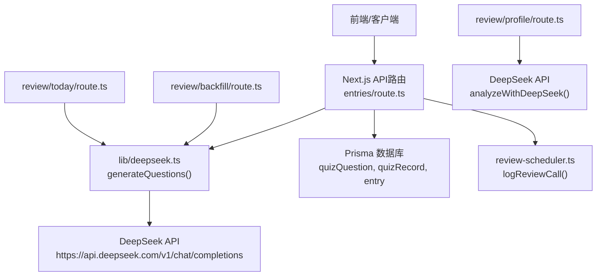
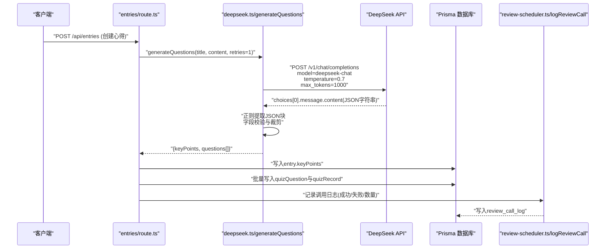
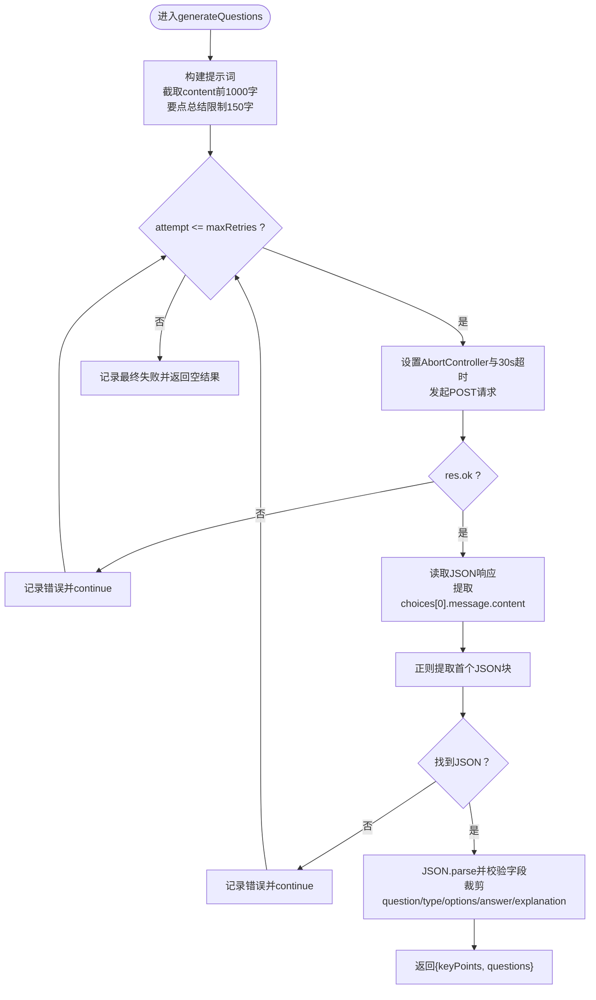
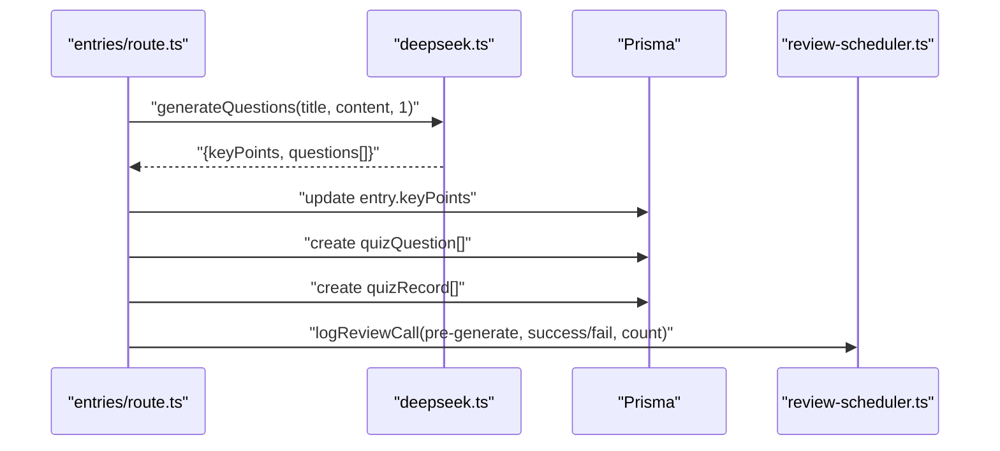
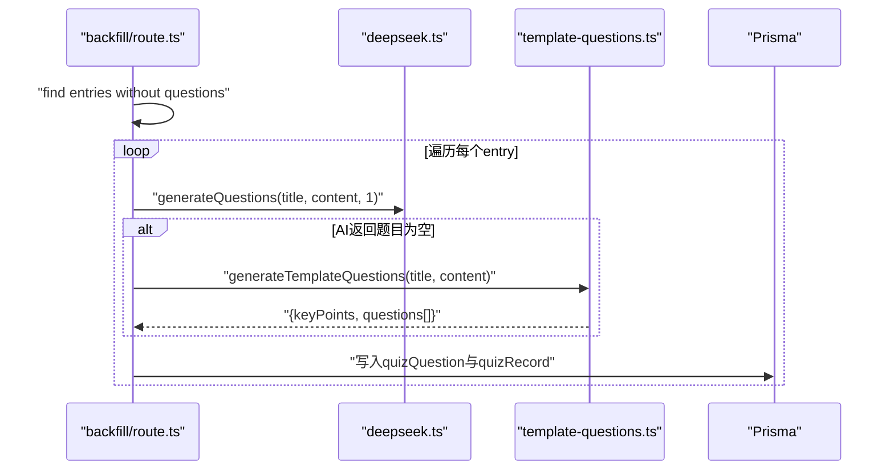
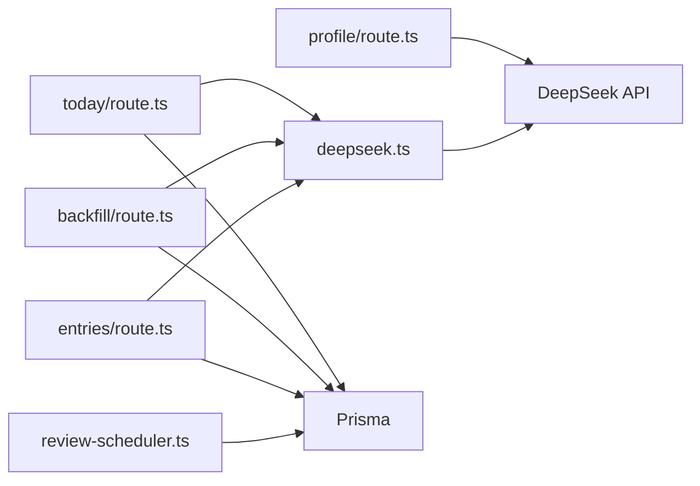

# DeepSeek API集成

<cite>
**本文引用的文件**   
- [lib/deepseek.ts](file://lib/deepseek.ts)
- [app/api/entries/route.ts](file://app/api/entries/route.ts)
- [app/api/review/backfill/route.ts](file://app/api/review/backfill/route.ts)
- [app/api/review/today/route.ts](file://app/api/review/today/route.ts)
- [app/api/review/profile/route.ts](file://app/api/review/profile/route.ts)
- [lib/review-scheduler.ts](file://lib/review-scheduler.ts)
- [prisma/schema.prisma](file://prisma/schema.prisma)
</cite>

## 更新摘要
**所做更改**   
- 更新了AI内容生成增强功能 - 将生成要点总结的提示词长度从100字增加到150字
- 改进了用户心得内容的综合摘要能力
- 更新了相关配置参数和性能优化策略

## 目录
1. [简介](#简介)
2. [项目结构](#项目结构)
3. [核心组件](#核心组件)
4. [架构总览](#架构总览)
5. [详细组件分析](#详细组件分析)
6. [依赖关系分析](#依赖关系分析)
7. [性能与成本优化](#性能与成本优化)
8. [故障排查指南](#故障排查指南)
9. [结论](#结论)
10. [附录](#附录)

## 简介
本技术文档聚焦于DeepSeek API集成模块，围绕generateQuestions函数的实现原理、API调用流程、请求参数配置、响应数据处理、错误处理机制（网络超时、API限制、重试策略）、JSON格式解析与内容提取逻辑、温度参数与最大token数调优策略、API密钥管理与安全配置最佳实践、性能监控与调试工具使用方法，以及成本控制策略和调用频率限制方案进行系统性说明。目标是帮助开发者快速理解并稳定扩展该模块。

## 项目结构
DeepSeek API集成主要位于服务端Next.js API路由中，核心封装在lib/deepseek.ts，并在多个业务入口中被调用：
- 生成题目：lib/deepseek.ts中的generateQuestions函数
- 前置生成：app/api/entries/route.ts中的preGenerateQuestions
- 批量补全：app/api/review/backfill/route.ts
- 今日复习触发：app/api/review/today/route.ts
- 学习画像分析：app/api/review/profile/route.ts（独立调用DeepSeek）
- 调用日志：lib/review-scheduler.ts中的logReviewCall，持久化到数据库

图表来源
- [lib/deepseek.ts:17-114](file://lib/deepseek.ts#L17-L114)
- [app/api/entries/route.ts:109-162](file://app/api/entries/route.ts#L109-L162)
- [app/api/review/backfill/route.ts:1-75](file://app/api/review/backfill/route.ts#L1-L75)
- [app/api/review/today/route.ts:1-80](file://app/api/review/today/route.ts#L1-L80)
- [app/api/review/profile/route.ts:1-77](file://app/api/review/profile/route.ts#L1-L77)
- [lib/review-scheduler.ts:1-29](file://lib/review-scheduler.ts#L1-L29)

章节来源
- [lib/deepseek.ts:17-114](file://lib/deepseek.ts#L17-L114)
- [app/api/entries/route.ts:109-162](file://app/api/entries/route.ts#L109-L162)
- [app/api/review/backfill/route.ts:1-75](file://app/api/review/backfill/route.ts#L1-L75)
- [app/api/review/today/route.ts:1-80](file://app/api/review/today/route.ts#L1-L80)
- [app/api/review/profile/route.ts:1-77](file://app/api/review/profile/route.ts#L1-L77)
- [lib/review-scheduler.ts:1-29](file://lib/review-scheduler.ts#L1-L29)

## 核心组件
- generateQuestions(entryTitle, entryContent, maxRetries=1): 基于用户心得标题与内容，构造提示词，调用DeepSeek聊天接口，返回结构化结果（要点总结与题目列表）。
- preGenerateQuestions(userId, entryId, title, content): 在创建心得后异步或同步触发题目预生成，保存要点与题目，记录调用日志。
- analyzeWithDeepSeek(tagStats): 在学习画像分析中调用DeepSeek，输出薄弱与优势领域。

关键职责划分
- lib/deepseek.ts：封装DeepSeek调用、超时控制、重试、JSON提取与数据校验。
- app/api/*：业务编排、鉴权、数据库读写、降级策略与日志记录。
- lib/review-scheduler.ts：统一记录调用日志，清理旧日志，避免无限增长。

章节来源
- [lib/deepseek.ts:17-114](file://lib/deepseek.ts#L17-L114)
- [app/api/entries/route.ts:109-162](file://app/api/entries/route.ts#L109-L162)
- [app/api/review/profile/route.ts:15-77](file://app/api/review/profile/route.ts#L15-L77)

## 架构总览
下图展示了从业务入口到DeepSeek API的完整调用链路与数据落库过程。

图表来源
- [app/api/entries/route.ts:109-162](file://app/api/entries/route.ts#L109-L162)
- [lib/deepseek.ts:17-114](file://lib/deepseek.ts#L17-L114)
- [lib/review-scheduler.ts:1-29](file://lib/review-scheduler.ts#L1-L29)

## 详细组件分析

### generateQuestions函数实现原理
- 输入参数
  - entryTitle: 心得标题
  - entryContent: 心得正文（截取前1000字符用于提示词）
  - maxRetries: 最大重试次数（默认1次）
- 提示词构建
  - 要求题干长度≤30字
  - 题型自动适配：概念辨析→单选，关系匹配→多选，对比→判断
  - 选项数量：单选/多选4个，判断题2个
  - 答案使用索引表示
  - **已更新** 同时生成要点总结（keyPoints），限定1-2句，**150字以内**（从100字提升）
  - 强制返回JSON，不包含其他文本
- API调用
  - URL: https://api.deepseek.com/v1/chat/completions
  - 模型: deepseek-chat
  - 消息: user角色，包含提示词
  - temperature: 0.7
  - max_tokens: 1000
  - 超时控制: AbortController + setTimeout 30秒
- 响应处理
  - 检查HTTP状态码，非ok则记录错误并继续重试
  - 解析data.choices[0].message.content
  - 使用正则提取第一个JSON块
  - JSON.parse后对questions数组做类型与边界校验：
    - question截断至30字
    - type限定为single/multiple/truefalse之一，否则回退为single
    - options限制最多4个
    - answer保证为数组，缺省为[0]
    - explanation保留为空串时不报错
  - 返回{ keyPoints, questions }
- 错误处理与重试
  - 捕获网络异常、JSON解析异常、API错误等
  - 每次尝试记录错误信息
  - 全部重试失败后返回空结果{ keyPoints: "", questions: [] }

图表来源
- [lib/deepseek.ts:17-114](file://lib/deepseek.ts#L17-L114)

章节来源
- [lib/deepseek.ts:17-114](file://lib/deepseek.ts#L17-L114)

### 前置生成流程（entries/route.ts）
- 触发时机：创建心得后，调用preGenerateQuestions
- 步骤
  - 调用generateQuestions获取题目与要点
  - 更新entry.keyPoints
  - 若题目数量>0，批量写入quizQuestion与quizRecord，并设置下次复习时间为次日
  - 记录调用日志（成功/失败及题目数量）
- 降级策略：当前未在此处直接降级到模板，但backfill流程中包含模板降级

图表来源
- [app/api/entries/route.ts:109-162](file://app/api/entries/route.ts#L109-L162)
- [lib/review-scheduler.ts:1-29](file://lib/review-scheduler.ts#L1-L29)

章节来源
- [app/api/entries/route.ts:109-162](file://app/api/entries/route.ts#L109-L162)

### 批量补全流程（review/backfill/route.ts）
- 目标：为所有尚未出题的心得补生成题目
- 步骤
  - 查询无题目的心得列表
  - 逐个调用generateQuestions
  - 保存AI生成的要点
  - 若AI返回题目为空，降级到模板生成器
  - 将题目写入数据库并初始化复习记录
  - 记录调用日志

图表来源
- [app/api/review/backfill/route.ts:1-75](file://app/api/review/backfill/route.ts#L1-L75)

章节来源
- [app/api/review/backfill/route.ts:1-75](file://app/api/review/backfill/route.ts#L1-L75)

### 今日复习触发（review/today/route.ts）
- 功能：根据调度策略选择今日卡片，若无题目则在线生成
- 调用generateQuestions以补充缺失的题目，并记录日志

章节来源
- [app/api/review/today/route.ts:1-80](file://app/api/review/today/route.ts#L1-L80)

### 学习画像分析（review/profile/route.ts）
- 独立调用DeepSeek进行标签维度分析
- 使用更低的temperature（0.3）与较小的max_tokens（500）
- 失败时本地计算弱项与强项作为降级

章节来源
- [app/api/review/profile/route.ts:15-77](file://app/api/review/profile/route.ts#L15-L77)

## 依赖关系分析
- 外部依赖
  - DeepSeek API：chat completions接口
  - Prisma ORM：读写数据库
- 内部依赖
  - review-scheduler.ts：统一记录调用日志
  - template-questions.ts：当AI生成失败时的降级方案
- 耦合与内聚
  - deepseek.ts高内聚，专注于API调用与数据清洗
  - 各API路由低耦合，仅通过函数调用与日志记录交互

图表来源
- [lib/deepseek.ts:17-114](file://lib/deepseek.ts#L17-L114)
- [app/api/entries/route.ts:109-162](file://app/api/entries/route.ts#L109-L162)
- [app/api/review/backfill/route.ts:1-75](file://app/api/review/backfill/route.ts#L1-L75)
- [app/api/review/today/route.ts:1-80](file://app/api/review/today/route.ts#L1-L80)
- [app/api/review/profile/route.ts:15-77](file://app/api/review/profile/route.ts#L15-L77)
- [lib/review-scheduler.ts:1-29](file://lib/review-scheduler.ts#L1-L29)

章节来源
- [lib/deepseek.ts:17-114](file://lib/deepseek.ts#L17-L114)
- [app/api/entries/route.ts:109-162](file://app/api/entries/route.ts#L109-L162)
- [app/api/review/backfill/route.ts:1-75](file://app/api/review/backfill/route.ts#L1-L75)
- [app/api/review/today/route.ts:1-80](file://app/api/review/today/route.ts#L1-L80)
- [app/api/review/profile/route.ts:15-77](file://app/api/review/profile/route.ts#L15-L77)
- [lib/review-scheduler.ts:1-29](file://lib/review-scheduler.ts#L1-L29)

## 性能与成本优化
- 超时控制
  - 使用AbortController与setTimeout实现30秒超时，避免长时间阻塞
- 重试策略
  - 支持可配置的重试次数，默认1次；适用于临时性网络波动或API限流
- 提示词长度控制
  - 截取content前1000字，降低token消耗与响应时间
- **已更新** 参数调优
  - temperature=0.7：平衡创造性与稳定性，适合题目生成
  - max_tokens=1000：满足题目与解析的输出需求
  - **要点总结字数限制提升至150字**：提供更全面的用户心得摘要
  - 画像分析使用temperature=0.3与max_tokens=500：提高确定性并降低成本
- 降级策略
  - 当AI返回空题目时，回退到模板生成器，保障用户体验
- 日志与监控
  - 统一记录调用日志，便于追踪成功率、失败原因与题目数量
- 建议优化
  - 引入指数退避重试（如1s、2s、4s）以降低瞬时拥塞
  - 增加并发上限与队列控制，避免短时间内大量请求导致限流
  - 缓存热点内容的生成结果，减少重复调用
  - 对超长内容采用分段摘要后再提问，进一步节省token

章节来源
- [lib/deepseek.ts:17-114](file://lib/deepseek.ts#L17-L114)
- [app/api/review/backfill/route.ts:1-75](file://app/api/review/backfill/route.ts#L1-L75)
- [app/api/review/profile/route.ts:15-77](file://app/api/review/profile/route.ts#L15-L77)
- [lib/review-scheduler.ts:1-29](file://lib/review-scheduler.ts#L1-L29)

## 故障排查指南
- 常见问题定位
  - API错误：检查HTTP状态码与错误日志，确认认证与配额
  - 无JSON响应：查看正则提取是否命中，必要时调整提示词约束
  - 超时：确认网络状况与服务端负载，适当提升超时阈值
  - 空题目：启用模板降级，检查提示词质量与内容长度
- 日志查询
  - 使用review_call_log表筛选step="pre-generate"/"online-retry"/"template-fallback"
  - 关注success字段与errorMsg，结合createdAt排序定位问题
- 调试建议
  - 在开发环境开启Prisma日志，观察SQL执行
  - 打印请求体与响应体片段（脱敏），辅助定位提示词问题
  - 针对特定entryID复现问题，缩小范围

章节来源
- [lib/review-scheduler.ts:1-29](file://lib/review-scheduler.ts#L1-L29)
- [prisma/schema.prisma:196-209](file://prisma/schema.prisma#L196-L209)

## 结论
DeepSeek API集成模块通过清晰的职责划分与稳健的错误处理机制，实现了高质量题目自动生成与学习画像分析。generateQuestions函数在保证稳定性的同时兼顾了成本与性能，配合降级策略与日志监控，形成了可靠的端到端链路。**最新的150字要点总结限制为用户提供了更全面的心得摘要能力**。后续可通过指数退避、并发控制、缓存与分段摘要等手段进一步优化体验与成本。

## 附录

### API密钥管理与安全配置最佳实践
- 环境变量管理
  - 使用process.env.DEEPSEEK_API_KEY注入密钥，避免硬编码
  - 生产环境通过部署平台的安全变量注入，禁止提交到版本库
- 最小权限原则
  - 为不同环境分配独立的API Key，限制额度与IP白名单
- 传输安全
  - 始终使用HTTPS访问API
- 审计与轮换
  - 定期轮换密钥，结合日志监控异常调用

章节来源
- [lib/deepseek.ts:1-2](file://lib/deepseek.ts#L1-L2)
- [app/api/review/profile/route.ts:5-6](file://app/api/review/profile/route.ts#L5-L6)

### 温度参数与最大token数调优策略
- 温度参数
  - 题目生成：0.7，平衡多样性与准确性
  - 画像分析：0.3，强调确定性与一致性
- 最大token数
  - 题目生成：1000，覆盖题目与解析
  - 画像分析：500，精简输出，降低成本
- **已更新** 提示词约束
  - 明确输出结构与长度限制，减少无效输出与解析失败
  - **要点总结限制从100字提升至150字**，提供更详细的用户心得摘要

章节来源
- [lib/deepseek.ts:67-69](file://lib/deepseek.ts#L67-L69)
- [app/api/review/profile/route.ts:49-51](file://app/api/review/profile/route.ts#L49-L51)

### 成本控制策略与调用频率限制
- 成本控制
  - 缩短提示词长度（截取前1000字）
  - 合理设置max_tokens
  - 使用模板降级减少不必要的API调用
  - **150字要点总结限制**：在提供全面摘要的同时控制token消耗
- 频率限制
  - 建议在网关层或应用层实现令牌桶/滑动窗口限流
  - 结合日志统计QPS，动态调整并发与重试间隔
  - 对热点内容进行结果缓存，避免重复生成

章节来源
- [lib/deepseek.ts:22-25](file://lib/deepseek.ts#L22-L25)
- [lib/review-scheduler.ts:1-29](file://lib/review-scheduler.ts#L1-L29)