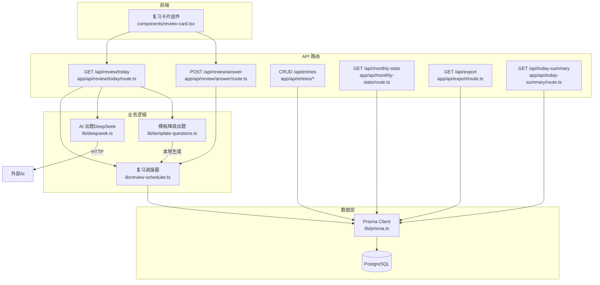
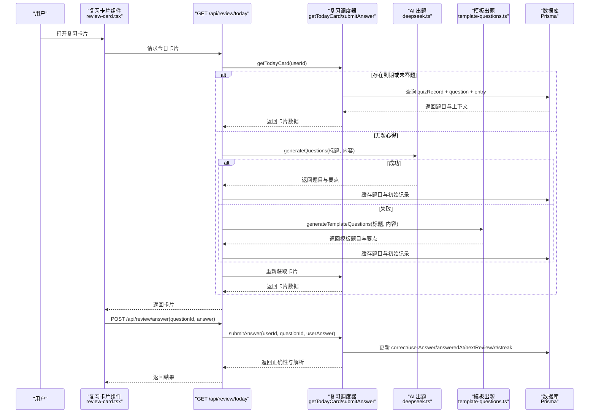
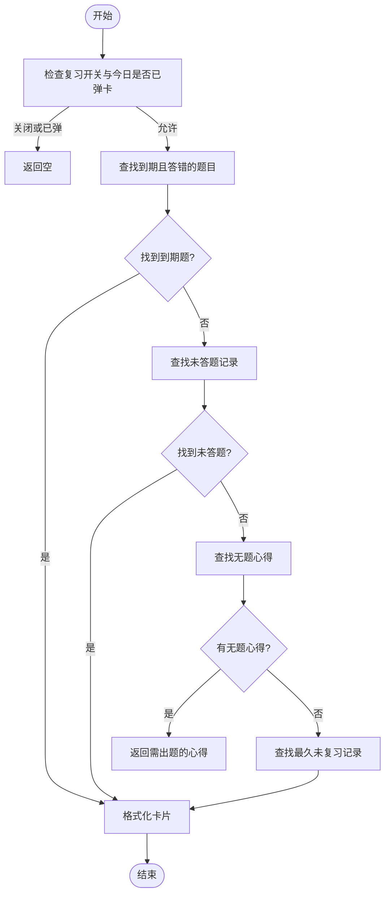
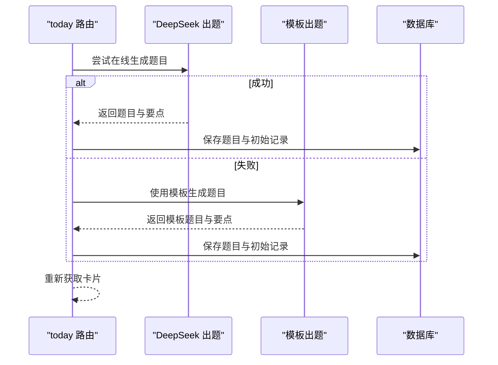
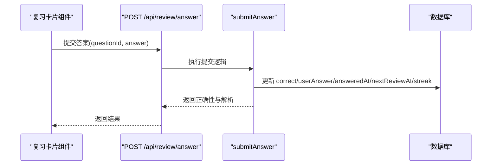
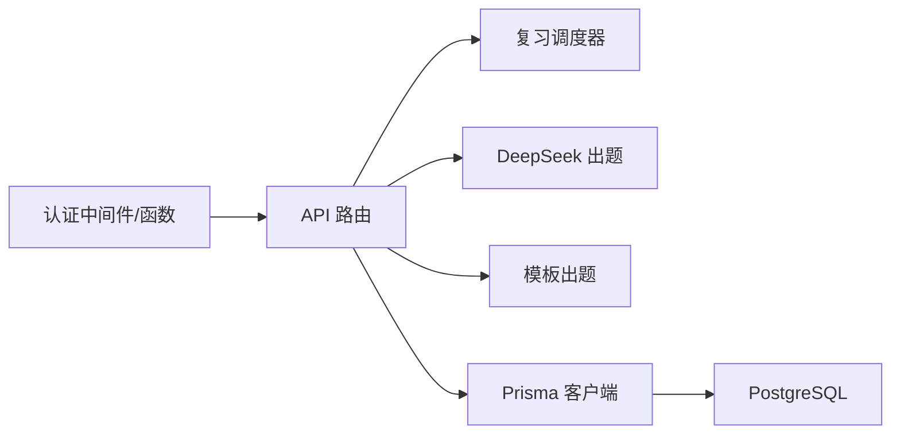

# 答题记录系统

<cite>
**本文引用的文件**
- [prisma/schema.prisma](file://prisma/schema.prisma)
- [lib/prisma.ts](file://lib/prisma.ts)
- [app/api/entries/route.ts](file://app/api/entries/route.ts)
- [app/api/entries/[id]/route.ts](file://app/api/entries/[id]/route.ts)
- [app/api/review/today/route.ts](file://app/api/review/today/route.ts)
- [app/api/review/answer/route.ts](file://app/api/review/answer/route.ts)
- [lib/review-scheduler.ts](file://lib/review-scheduler.ts)
- [lib/deepseek.ts](file://lib/deepseek.ts)
- [lib/template-questions.ts](file://lib/template-questions.ts)
- [app/api/monthly-stats/route.ts](file://app/api/monthly-stats/route.ts)
- [app/api/export/route.ts](file://app/api/export/route.ts)
- [app/api/today-summary/route.ts](file://app/api/today-summary/route.ts)
- [components/review-card.tsx](file://components/review-card.tsx)
- [types/index.ts](file://types/index.ts)
</cite>

## 目录
1. [简介](#简介)
2. [项目结构](#项目结构)
3. [核心组件](#核心组件)
4. [架构总览](#架构总览)
5. [详细组件分析](#详细组件分析)
6. [依赖关系分析](#依赖关系分析)
7. [性能与大数据优化](#性能与大数据优化)
8. [防作弊与数据完整性](#防作弊与数据完整性)
9. [异常检测与用户反馈](#异常检测与用户反馈)
10. [导出与分析工具使用指南](#导出与分析工具使用指南)
11. [故障排查](#故障排查)
12. [结论](#结论)

## 简介
本技术文档围绕“答题记录系统”的数据模型、实时计算、历史查询与统计、防作弊机制、异常检测与反馈收集，以及大数据量下的查询优化策略进行全面说明。系统基于 Next.js API Routes 与 Prisma ORM，结合外部 AI 生成题目与模板降级方案，实现从心得到题目的自动生成、复习调度、答题提交与结果反馈的完整闭环。

## 项目结构
- 数据层：Prisma Schema 定义用户、心得、标签、题目、答题记录、设置与调用日志等实体及索引。
- 服务层：Next.js API Routes 提供心得 CRUD、今日卡片获取、答案提交、月度统计、导出等能力。
- 业务逻辑：复习调度器负责选择待复习题目、计算下次复习时间、更新答题记录；AI 出题与模板降级在独立模块中实现。
- 前端交互：复习卡片组件封装了展示、作答、回看与跳转原文等交互流程。



图表来源
- [app/api/review/today/route.ts:43-123](file://app/api/review/today/route.ts#L43-L123)
- [app/api/review/answer/route.ts:5-30](file://app/api/review/answer/route.ts#L5-L30)
- [lib/review-scheduler.ts:44-225](file://lib/review-scheduler.ts#L44-L225)
- [lib/deepseek.ts:17-115](file://lib/deepseek.ts#L17-L115)
- [lib/template-questions.ts:35-66](file://lib/template-questions.ts#L35-L66)
- [lib/prisma.ts:1-14](file://lib/prisma.ts#L1-L14)

章节来源
- [prisma/schema.prisma:1-209](file://prisma/schema.prisma#L1-L209)
- [lib/prisma.ts:1-14](file://lib/prisma.ts#L1-L14)
- [app/api/entries/route.ts:1-163](file://app/api/entries/route.ts#L1-L163)
- [app/api/entries/[id]/route.ts:1-95](file://app/api/entries/[id]/route.ts#L1-L95)
- [app/api/review/today/route.ts:1-123](file://app/api/review/today/route.ts#L1-L123)
- [app/api/review/answer/route.ts:1-30](file://app/api/review/answer/route.ts#L1-L30)
- [lib/review-scheduler.ts:1-225](file://lib/review-scheduler.ts#L1-L225)
- [lib/deepseek.ts:1-115](file://lib/deepseek.ts#L1-L115)
- [lib/template-questions.ts:1-66](file://lib/template-questions.ts#L1-L66)
- [app/api/monthly-stats/route.ts:1-96](file://app/api/monthly-stats/route.ts#L1-L96)
- [app/api/export/route.ts:1-29](file://app/api/export/route.ts#L1-L29)
- [app/api/today-summary/route.ts:1-118](file://app/api/today-summary/route.ts#L1-L118)
- [components/review-card.tsx:1-321](file://components/review-card.tsx#L1-L321)
- [types/index.ts:1-48](file://types/index.ts#L1-L48)

## 核心组件
- 数据模型与索引
  - 用户、心得、标签、分享、洞察报告、成长日志、邮件令牌、魔法链接、题目、答题记录、用户设置、复习调用日志等实体。
  - 关键索引：按用户+复习时间、用户+题目、用户+创建时间等，支撑高效查询与排序。
- 复习调度器
  - 今日卡片选择：优先答错且到期题，其次未答题记录，再兜底无题心得触发出题，最后取最久未复习题。
  - 答案提交：判定正确性、累计回答次数、记录作答时间、计算下次复习间隔与连续正确次数。
- AI 出题与模板降级
  - DeepSeek 在线生成题目与要点总结，具备超时与重试控制；失败时回退至模板题目生成。
- 统计与导出
  - 月度统计：按北京时间聚合每日心得数量并标注今天。
  - 导出接口：返回非草稿心得及其标签、心情、时间等字段。
  - 今日速览：并行查询当日/本周/全部心得，计算连续天数与最长连续。

章节来源
- [prisma/schema.prisma:150-209](file://prisma/schema.prisma#L150-L209)
- [lib/review-scheduler.ts:44-225](file://lib/review-scheduler.ts#L44-L225)
- [lib/deepseek.ts:17-115](file://lib/deepseek.ts#L17-L115)
- [lib/template-questions.ts:12-66](file://lib/template-questions.ts#L12-L66)
- [app/api/monthly-stats/route.ts:22-96](file://app/api/monthly-stats/route.ts#L22-L96)
- [app/api/export/route.ts:5-29](file://app/api/export/route.ts#L5-L29)
- [app/api/today-summary/route.ts:50-118](file://app/api/today-summary/route.ts#L50-L118)

## 架构总览
系统采用前后端分离的 API 模式：前端通过复习卡片组件发起请求，后端路由调用调度器与出题模块，最终持久化到数据库。



图表来源
- [components/review-card.tsx:32-48](file://components/review-card.tsx#L32-L48)
- [app/api/review/today/route.ts:43-123](file://app/api/review/today/route.ts#L43-L123)
- [app/api/review/answer/route.ts:5-30](file://app/api/review/answer/route.ts#L5-L30)
- [lib/review-scheduler.ts:44-225](file://lib/review-scheduler.ts#L44-L225)
- [lib/deepseek.ts:17-115](file://lib/deepseek.ts#L17-L115)
- [lib/template-questions.ts:35-66](file://lib/template-questions.ts#L35-L66)

## 详细组件分析

### 数据模型与存储设计
- 用户与设置
  - UserSetting 维护复习开关、最近卡片日期与最近题目ID，用于控制每日弹窗与跳过逻辑。
- 心得与题目
  - Entry 关联 QuizQuestion，QuizQuestion 包含题干、题型、选项、答案与解析，支持角度顺序。
- 答题记录
  - QuizRecord 记录用户答案、正确性、回答次数、作答时间、下次复习时间与连续正确次数。
- 索引与约束
  - 针对 userId+nextReviewAt、userId+questionId、userId+createdAt 等建立索引，提升查询效率。
  - 唯一约束与级联删除保证数据一致性。

```mermaid
erDiagram
USER {
string id PK
string email UK
boolean isVerified
string theme
boolean onboardDone
int openTimes
datetime createdAt
datetime updatedAt
}
ENTRY {
string id PK
string userId FK
string title
text content
string keyPoints
string mood
datetime recordTime
boolean isTop
boolean isFavorite
boolean isDraft
datetime createdAt
datetime updatedAt
}
TAG {
string id PK
string userId FK
string name
boolean isDefault
datetime createdAt
}
QUIZ_QUESTION {
string id PK
string entryId FK
string question
string type
json options
json answer
string explanation
int angle
datetime createdAt
}
QUIZ_RECORD {
string id PK
string userId FK
string questionId FK
string entryId FK
boolean correct
json userAnswer
int answerCount
datetime answeredAt
datetime nextReviewAt
int streak
}
USER_SETTING {
string id PK
string userId FK UK
boolean reviewEnabled
string lastCardDate
string lastQuestionId
}
REVIEW_CALL_LOG {
string id PK
string userId FK
string entryId FK
string step
boolean success
int questionCount
string errorMsg
datetime createdAt
}
USER ||--o{ ENTRY : "拥有"
USER ||--o{ TAG : "拥有"
USER ||--o{ QUIZ_RECORD : "答题"
USER ||--|| USER_SETTING : "设置"
ENTRY ||--o{ QUIZ_QUESTION : "包含"
QUIZ_QUESTION ||--o{ QUIZ_RECORD : "被答题"
USER ||--o{ REVIEW_CALL_LOG : "调用日志"
```

图表来源
- [prisma/schema.prisma:10-209](file://prisma/schema.prisma#L10-L209)

章节来源
- [prisma/schema.prisma:10-209](file://prisma/schema.prisma#L10-L209)

### 复习调度与答题效果实时计算
- 今日卡片选择策略
  - 优先级：到期且答错 > 久未复习 > 未答题记录 > 无题心得触发出题 > 最久未复习。
- 答案判定与记忆巩固度
  - 正确性：比较用户答案与标准答案集合是否一致。
  - 连续正确次数（streak）：答对递增，答错重置为0。
  - 下次复习间隔：答对按指数增长（1→2→4→8…），答错重置为1天。
  - 作答时间：记录 answeredAt，便于后续反应时间分析。
- 复习调用日志
  - 记录步骤（预生成、缓存命中、在线重试、模板降级）、成功与否、题目数与错误信息，保留最近30条。



图表来源
- [lib/review-scheduler.ts:44-144](file://lib/review-scheduler.ts#L44-L144)

章节来源
- [lib/review-scheduler.ts:44-225](file://lib/review-scheduler.ts#L44-L225)

### 题目生成与降级策略
- 在线生成（DeepSeek）
  - 提示词要求输出 JSON，包含要点与题目数组；具备30秒超时与最多一次重试。
  - 成功后写入题目与要点，并初始化答题记录。
- 模板降级
  - 当在线生成失败或返回空时，使用模板生成基础题目与要点，确保用户体验不中断。
- 要点总结
  - 优先使用 AI 生成的要点，若无则用模板方法提取首句或标题组合，控制在100字以内。



图表来源
- [app/api/review/today/route.ts:56-103](file://app/api/review/today/route.ts#L56-L103)
- [lib/deepseek.ts:17-115](file://lib/deepseek.ts#L17-L115)
- [lib/template-questions.ts:35-66](file://lib/template-questions.ts#L35-L66)

章节来源
- [app/api/review/today/route.ts:1-123](file://app/api/review/today/route.ts#L1-L123)
- [lib/deepseek.ts:1-115](file://lib/deepseek.ts#L1-L115)
- [lib/template-questions.ts:1-66](file://lib/template-questions.ts#L1-L66)

### 答案提交与结果反馈
- 提交流程
  - 校验参数后调用调度器的提交函数，更新答题记录并返回正确性、解析与下次复习间隔。
- 前端交互
  - 支持单选、多选、判断三种题型；提交后显示结果与解析，并提供回看与查看原文入口。



图表来源
- [app/api/review/answer/route.ts:5-30](file://app/api/review/answer/route.ts#L5-L30)
- [lib/review-scheduler.ts:164-215](file://lib/review-scheduler.ts#L164-L215)
- [components/review-card.tsx:32-48](file://components/review-card.tsx#L32-L48)

章节来源
- [app/api/review/answer/route.ts:1-30](file://app/api/review/answer/route.ts#L1-L30)
- [lib/review-scheduler.ts:164-215](file://lib/review-scheduler.ts#L164-L215)
- [components/review-card.tsx:1-321](file://components/review-card.tsx#L1-L321)

### 心得管理与异步预生成
- 心得列表与详情
  - 支持搜索、收藏、标签过滤、时间范围筛选与分页；返回纯文本预览。
- 异步预生成
  - 创建非草稿心得后，后台异步触发题目生成与初始记录创建，不阻塞响应。
  - 若生成失败，记录调用日志以便追踪。

章节来源
- [app/api/entries/route.ts:1-163](file://app/api/entries/route.ts#L1-L163)
- [app/api/entries/[id]/route.ts:1-95](file://app/api/entries/[id]/route.ts#L1-L95)

### 统计分析与个性化报告
- 月度统计
  - 按北京时间聚合当月每日心得数量，标注今天，返回月份标签与总数。
- 今日速览
  - 并行查询当日、本周与全部心得，计算连续天数与历史最长连续，返回最近一条心得标题。
- 个性化报告
  - InsightReport 实体支持按类型与周期存储 JSON 内容，可用于生成个性化学习报告。

章节来源
- [app/api/monthly-stats/route.ts:22-96](file://app/api/monthly-stats/route.ts#L22-L96)
- [app/api/today-summary/route.ts:50-118](file://app/api/today-summary/route.ts#L50-L118)
- [prisma/schema.prisma:97-110](file://prisma/schema.prisma#L97-L110)

## 依赖关系分析
- 模块耦合
  - API 路由依赖认证与 Prisma 客户端；复习路由依赖调度器与出题模块；导出与统计直接访问数据库。
- 外部依赖
  - DeepSeek API 作为外部服务，具备超时与重试；模板出题为本地降级方案。
- 潜在循环依赖
  - 当前结构清晰，未见循环导入；Prisma 客户端全局单例避免重复实例化。



图表来源
- [lib/prisma.ts:1-14](file://lib/prisma.ts#L1-L14)
- [app/api/review/today/route.ts:1-123](file://app/api/review/today/route.ts#L1-L123)
- [app/api/review/answer/route.ts:1-30](file://app/api/review/answer/route.ts#L1-L30)
- [lib/review-scheduler.ts:1-225](file://lib/review-scheduler.ts#L1-L225)
- [lib/deepseek.ts:1-115](file://lib/deepseek.ts#L1-L115)
- [lib/template-questions.ts:1-66](file://lib/template-questions.ts#L1-L66)

章节来源
- [lib/prisma.ts:1-14](file://lib/prisma.ts#L1-L14)
- [app/api/review/today/route.ts:1-123](file://app/api/review/today/route.ts#L1-L123)
- [app/api/review/answer/route.ts:1-30](file://app/api/review/answer/route.ts#L1-L30)
- [lib/review-scheduler.ts:1-225](file://lib/review-scheduler.ts#L1-L225)
- [lib/deepseek.ts:1-115](file://lib/deepseek.ts#L1-L115)
- [lib/template-questions.ts:1-66](file://lib/template-questions.ts#L1-L66)

## 性能与大数据优化
- 索引策略
  - 针对高频查询条件建立复合索引：用户+复习时间、用户+题目、用户+创建时间、用户+标签等。
- 查询优化
  - 使用 select 仅返回必要字段；分页限制上限防止大结果集；并行查询减少总耗时。
- 连接池与日志
  - Prisma 客户端全局单例复用连接；开发环境开启 query/error/warn 日志，生产仅 error。
- 建议扩展
  - 对 large dataset 场景可考虑分区表（按用户或时间）、物化视图（统计指标）、读写分离与缓存层（Redis）。

章节来源
- [prisma/schema.prisma:51-55](file://prisma/schema.prisma#L51-L55)
- [prisma/schema.prisma:182-184](file://prisma/schema.prisma#L182-L184)
- [lib/prisma.ts:7-14](file://lib/prisma.ts#L7-L14)
- [app/api/today-summary/route.ts:58-64](file://app/api/today-summary/route.ts#L58-L64)

## 防作弊与数据完整性
- 身份鉴权
  - 所有受保护路由均通过 getCurrentUserId 校验，未登录返回 401。
- 幂等与原子更新
  - 答案提交使用增量更新与时间戳，避免并发覆盖；nextReviewAt 与 streak 由服务端统一计算。
- 审计与追溯
  - ReviewCallLog 记录每次出题步骤与结果，便于问题定位与质量评估。
- 数据一致性
  - 级联删除保证关联数据清理；唯一约束与外键关系保障引用完整性。

章节来源
- [app/api/entries/route.ts:8-10](file://app/api/entries/route.ts#L8-L10)
- [app/api/review/today/route.ts:44-48](file://app/api/review/today/route.ts#L44-L48)
- [app/api/review/answer/route.ts:6-10](file://app/api/review/answer/route.ts#L6-L10)
- [lib/review-scheduler.ts:5-29](file://lib/review-scheduler.ts#L5-L29)
- [prisma/schema.prisma:47-55](file://prisma/schema.prisma#L47-L55)
- [prisma/schema.prisma:179-184](file://prisma/schema.prisma#L179-L184)

## 异常检测与用户反馈
- 异常检测
  - 在线出题失败与空结果会触发模板降级，并记录调用日志；超时与网络错误会被捕获并打印。
- 用户反馈
  - 复习卡片提供“回看题目与选项”、“查看原文”与“关闭”操作，便于用户纠错与回溯。
- 建议增强
  - 增加用户侧反馈按钮（如“题目不准确”），将反馈写入独立表并纳入审核队列。

章节来源
- [lib/deepseek.ts:76-114](file://lib/deepseek.ts#L76-L114)
- [app/api/review/today/route.ts:78-94](file://app/api/review/today/route.ts#L78-L94)
- [components/review-card.tsx:184-260](file://components/review-card.tsx#L184-L260)

## 导出与分析工具使用指南
- 导出接口
  - GET /api/export：返回当前用户非草稿心得列表，包含标题、内容、标签、心情、记录时间与置顶/收藏标记。
- 使用方法
  - 前端调用该接口获取数据后，可转换为 CSV/Excel 进行离线分析；也可结合月度统计与今日速览数据进行趋势可视化。
- 注意事项
  - 数据量较大时建议分页或分批导出；敏感字段可按需脱敏。

章节来源
- [app/api/export/route.ts:5-29](file://app/api/export/route.ts#L5-L29)
- [app/api/monthly-stats/route.ts:22-96](file://app/api/monthly-stats/route.ts#L22-L96)
- [app/api/today-summary/route.ts:50-118](file://app/api/today-summary/route.ts#L50-L118)

## 故障排查
- 常见问题
  - 未登录：检查认证中间件与 token 传递。
  - 题目为空：确认在线出题是否成功，查看调用日志与降级路径。
  - 卡片不弹出：检查用户设置中的复习开关与 lastCardDate。
- 定位手段
  - 查看 ReviewCallLog 的步骤与错误信息；核对数据库索引是否存在；在生产环境关注 Prisma 错误日志。

章节来源
- [app/api/review/today/route.ts:118-122](file://app/api/review/today/route.ts#L118-L122)
- [lib/review-scheduler.ts:5-29](file://lib/review-scheduler.ts#L5-L29)
- [lib/prisma.ts:7-14](file://lib/prisma.ts#L7-L14)

## 结论
本系统以清晰的数据模型与稳健的调度算法为核心，结合 AI 出题与模板降级，实现了从心得到复习的全链路自动化。通过合理的索引设计与并行查询，系统在大数据量下仍保持良好性能。未来可在反馈收集、个性化报告与更细粒度的行为分析方面持续演进，以提升学习效果与用户体验。