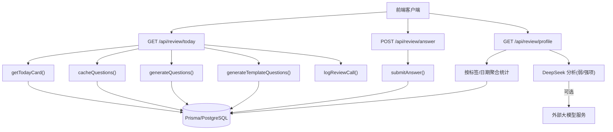
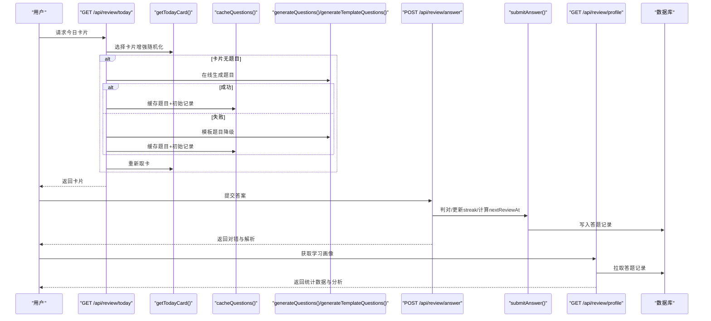
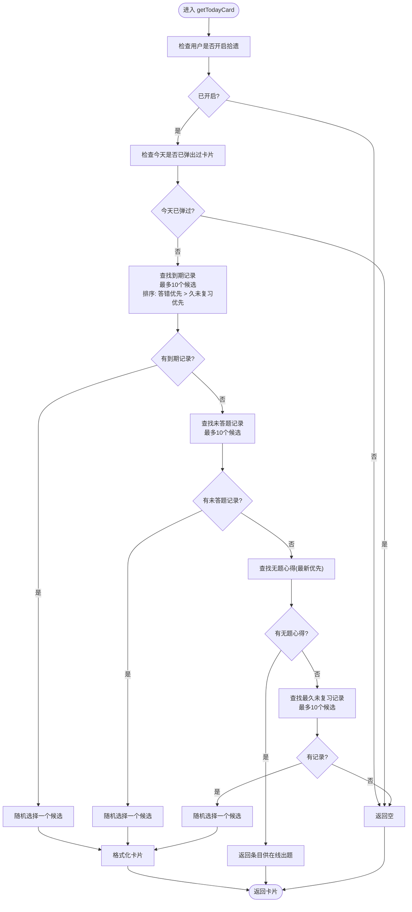
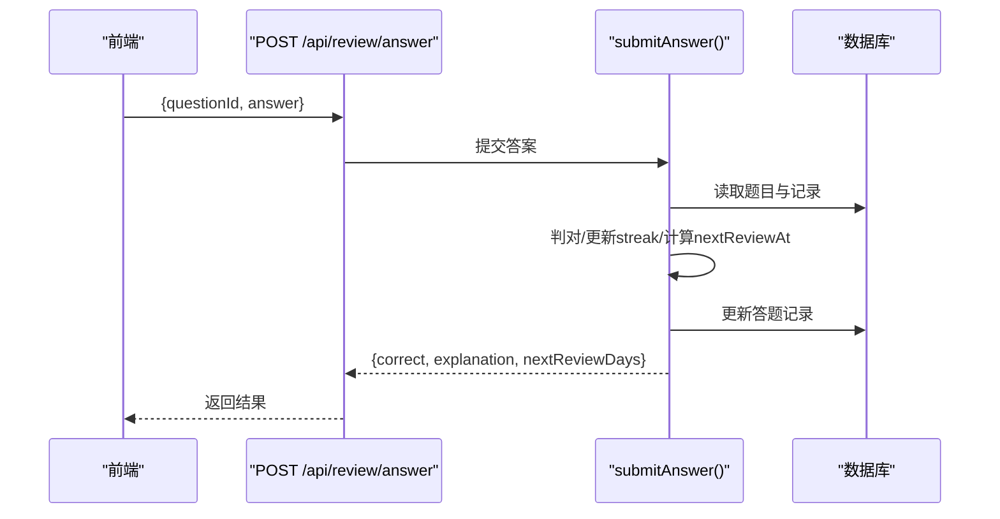
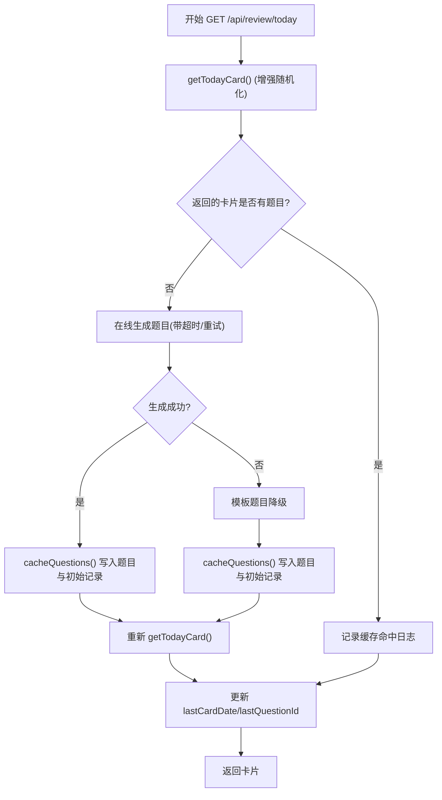
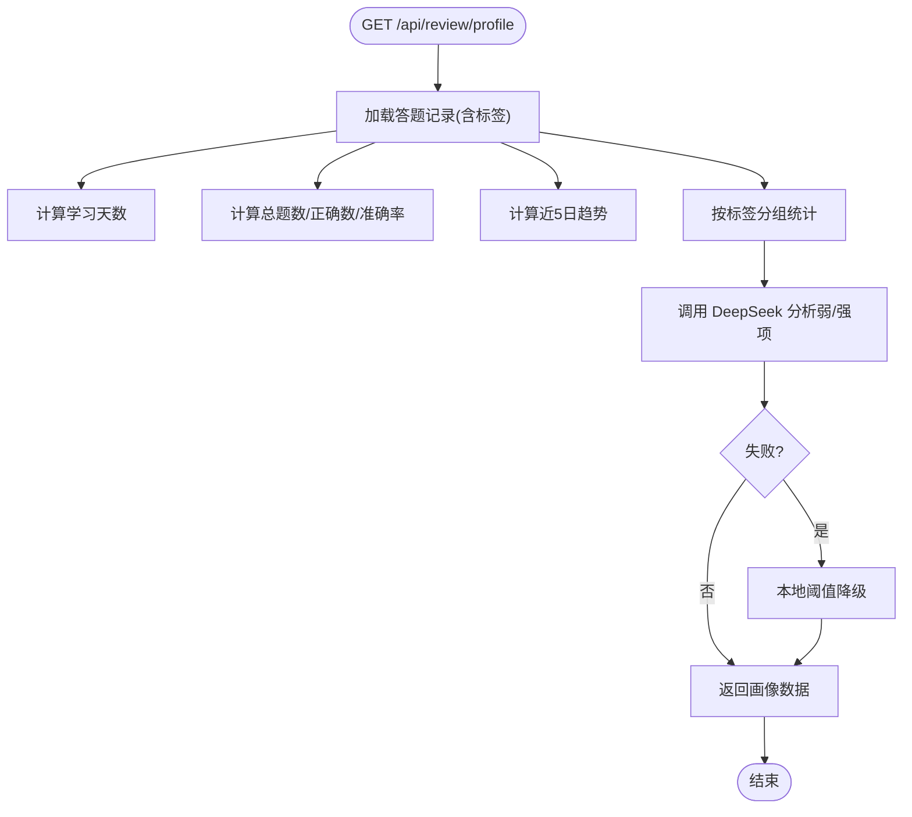
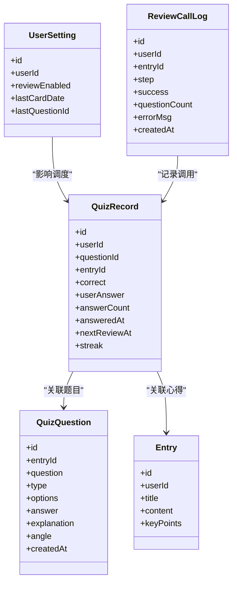

# 间隔重复算法

<cite>
**本文引用的文件**   
- [lib/review-scheduler.ts](file://lib/review-scheduler.ts)
- [app/api/review/today/route.ts](file://app/api/review/today/route.ts)
- [app/api/review/answer/route.ts](file://app/api/review/answer/route.ts)
- [app/api/review/profile/route.ts](file://app/api/review/profile/route.ts)
- [lib/template-questions.ts](file://lib/template-questions.ts)
- [prisma/schema.prisma](file://prisma/schema.prisma)
- [doc/新芽dev-framework.md](file://doc/新芽dev-framework.md)
</cite>

## 更新摘要
**变更内容**   
- 增强了复习调度器的随机化机制，防止连续推送同一来源的问题
- 改进了候选问题选择策略，从findFirst改为findMany获取最多10个候选
- 实现了三种场景下的随机选择：到期问题、未复习问题和最久未复习问题
- 优化了用户体验，避免用户短时间内反复遇到相同知识点的问题

## 目录
1. [简介](#简介)
2. [项目结构](#项目结构)
3. [核心组件](#核心组件)
4. [架构总览](#架构总览)
5. [详细组件分析](#详细组件分析)
6. [依赖关系分析](#依赖关系分析)
7. [性能与大数据优化](#性能与大数据优化)
8. [参数调优与效果评估](#参数调优与效果评估)
9. [可扩展性与自定义规则](#可扩展性与自定义规则)
10. [故障排查指南](#故障排查指南)
11. [结论](#结论)

## 简介
本技术文档围绕"间隔重复"复习系统，系统性阐述：
- 艾宾浩斯记忆曲线的数学模型与当前实现原理
- 复习计划调度器的算法逻辑（记忆强度、下次复习时间预测、难度调整）
- 答题记录的数据结构与状态管理（正确率统计、遗忘曲线追踪）
- 自适应学习机制（基于用户表现动态调整题目难度与复习频率）
- 算法参数调优指南与效果评估方法
- 性能优化策略与大数据量下的查询优化方案
- 可扩展性与自定义规则配置方法

## 项目结构
本项目采用 Next.js API Routes + Prisma 数据层。间隔重复相关代码主要分布在以下位置：
- 调度与提交答案核心逻辑：lib/review-scheduler.ts
- 今日卡片获取与题目生成流程：app/api/review/today/route.ts
- 答案提交接口：app/api/review/answer/route.ts
- 学习画像与薄弱/优势领域分析：app/api/review/profile/route.ts
- 模板题目与要点生成（降级方案）：lib/template-questions.ts
- 数据库模型定义：prisma/schema.prisma
- 需求与API设计说明：doc/新芽dev-framework.md

图表来源
- [app/api/review/today/route.ts:1-123](file://app/api/review/today/route.ts#L1-L123)
- [app/api/review/answer/route.ts:1-30](file://app/api/review/answer/route.ts#L1-L30)
- [app/api/review/profile/route.ts:1-179](file://app/api/review/profile/route.ts#L1-L179)
- [lib/review-scheduler.ts:1-232](file://lib/review-scheduler.ts#L1-L232)
- [lib/template-questions.ts:1-66](file://lib/template-questions.ts#L1-L66)
- [prisma/schema.prisma:150-209](file://prisma/schema.prisma#L150-L209)

章节来源
- [doc/新芽dev-framework.md:203-222](file://doc/新芽dev-framework.md#L203-L222)
- [prisma/schema.prisma:150-209](file://prisma/schema.prisma#L150-L209)

## 核心组件
- 调度器（lib/review-scheduler.ts）
  - getTodayCard(userId): 选择今日待复习卡片，优先级为"已到期且答错优先 > 久未复习优先 > 未答题记录优先 > 无题心得触发在线出题 > 最久未复习"，新增随机化机制防止连续推送同一来源问题
  - submitAnswer(userId, questionId, userAnswer): 判定对错、更新 streak、计算下次复习时间并落库
  - logReviewCall(...): 记录调用日志并清理旧日志
- 今日卡片接口（app/api/review/today/route.ts）
  - 若返回"无题心得"，则尝试在线生成题目；失败则回退到模板题目；完成后重新取卡
  - 缓存命中时记录日志
- 答案提交接口（app/api/review/answer/route.ts）
  - 校验参数后调用 submitAnswer，返回结果或错误
- 学习画像接口（app/api/review/profile/route.ts）
  - 聚合答题记录，计算学习天数、总题数、准确率、近5日趋势、按标签分组准确率
  - 调用 DeepSeek 分析薄弱/掌握领域，失败时本地阈值降级
- 模板题目生成（lib/template-questions.ts）
  - generateKeyPoints(): 从标题与内容提取要点摘要
  - generateTemplateQuestions(): 生成基础题型（单选/判断），用于离线降级

章节来源
- [lib/review-scheduler.ts:44-162](file://lib/review-scheduler.ts#L44-L162)
- [lib/review-scheduler.ts:164-215](file://lib/review-scheduler.ts#L164-L215)
- [app/api/review/today/route.ts:43-123](file://app/api/review/today/route.ts#L43-L123)
- [app/api/review/answer/route.ts:5-29](file://app/api/review/answer/route.ts#L5-L29)
- [app/api/review/profile/route.ts:79-178](file://app/api/review/profile/route.ts#L79-L178)
- [lib/template-questions.ts:12-65](file://lib/template-questions.ts#L12-L65)

## 架构总览
整体流程分为"选题—作答—调度更新—画像分析"四个阶段：
- 选题：根据用户设置与答题记录，选择今日卡片；若无题则触发题目生成（在线或模板）
- 作答：比对用户答案与标准答案，更新 streak 与 nextReviewAt
- 调度更新：基于指数增长策略计算下次复习间隔
- 画像分析：汇总历史答题数据，输出薄弱/优势领域与近期趋势

图表来源
- [app/api/review/today/route.ts:43-123](file://app/api/review/today/route.ts#L43-L123)
- [lib/review-scheduler.ts:44-162](file://lib/review-scheduler.ts#L44-162)
- [lib/review-scheduler.ts:164-215](file://lib/review-scheduler.ts#L164-L215)
- [app/api/review/answer/route.ts:5-29](file://app/api/review/answer/route.ts#L5-L29)
- [app/api/review/profile/route.ts:79-178](file://app/api/review/profile/route.ts#L79-L178)

## 详细组件分析

### 调度器与复习策略（lib/review-scheduler.ts）
- 记忆强度与复习间隔
  - 使用连续答对次数 streak 作为记忆强度的代理指标
  - 下次复习间隔采用指数增长：nextReviewDays = 2^streak（1→2→4→8…）
  - 答错时重置 streak=0，并将下次复习间隔设为1天
- **更新** 卡片选择优先级与随机化机制
  - 已到期且答错的记录优先，但不再固定选择第一个，而是从最多10个候选中随机选择
  - 其次按 nextReviewAt 升序（最久未复习优先），同样支持随机选择
  - 若无到期记录，优先选择"已有题目但未答题"的记录，随机化避免重复
  - 若仍无，则返回"尚未出题的心得"以触发题目生成
  - 兜底选择所有记录中"最久未复习"的一条，支持随机化
- **新增** 随机化防重机制
  - 每个场景下都使用 findMany 获取最多10个候选问题
  - 通过 Math.random() 随机选择其中一个，有效防止连续推送同一来源的问题
  - 提升用户体验，避免短时间内反复遇到相同知识点的题目
- 日志与可观测性
  - logReviewCall 记录步骤、成功与否、题目数量，并保留最近30条

图表来源
- [lib/review-scheduler.ts:44-144](file://lib/review-scheduler.ts#L44-L144)

章节来源
- [lib/review-scheduler.ts:44-162](file://lib/review-scheduler.ts#L44-L162)
- [lib/review-scheduler.ts:164-215](file://lib/review-scheduler.ts#L164-L215)

### 答案提交与状态更新（app/api/review/answer/route.ts + lib/review-scheduler.ts）
- 参数校验与鉴权
- 调用 submitAnswer 进行判对与状态更新
- 返回结果包含是否正确、解析与下次复习间隔

图表来源
- [app/api/review/answer/route.ts:5-29](file://app/api/review/answer/route.ts#L5-L29)
- [lib/review-scheduler.ts:164-215](file://lib/review-scheduler.ts#L164-L215)

章节来源
- [app/api/review/answer/route.ts:5-29](file://app/api/review/answer/route.ts#L5-L29)
- [lib/review-scheduler.ts:164-215](file://lib/review-scheduler.ts#L164-L215)

### 今日卡片与题目生成（app/api/review/today/route.ts）
- 若 getTodayCard 返回"无题心得"，则：
  - 先尝试在线生成题目（带超时与重试）
  - 失败则回退到模板题目生成
  - 将生成的题目与初始答题记录缓存入库
  - 再次调用 getTodayCard 获取最终卡片
- 缓存命中时记录日志

图表来源
- [app/api/review/today/route.ts:43-123](file://app/api/review/today/route.ts#L43-L123)
- [lib/review-scheduler.ts:44-144](file://lib/review-scheduler.ts#L44-L144)

章节来源
- [app/api/review/today/route.ts:43-123](file://app/api/review/today/route.ts#L43-L123)

### 学习画像与薄弱/优势领域（app/api/review/profile/route.ts）
- 统计维度
  - 学习天数（去重 answeredAt 日期）
  - 总答题次数与正确次数
  - 近5日每日正确/总数
  - 按标签分组的正确/总数/准确率
- 分析方式
  - 优先调用 DeepSeek 进行弱/强项分析
  - 失败时本地阈值降级（低于60%为薄弱，高于80%为掌握良好）

图表来源
- [app/api/review/profile/route.ts:79-178](file://app/api/review/profile/route.ts#L79-L178)

章节来源
- [app/api/review/profile/route.ts:79-178](file://app/api/review/profile/route.ts#L79-L178)

### 模板题目与要点生成（lib/template-questions.ts）
- generateKeyPoints：从标题与正文提取要点摘要（去除HTML、控制长度）
- generateTemplateQuestions：生成基础题型（单选/判断），用于离线降级

章节来源
- [lib/template-questions.ts:12-65](file://lib/template-questions.ts#L12-L65)

## 依赖关系分析
- 模块耦合
  - today/route.ts 依赖 review-scheduler.ts 的 getTodayCard 与 logReviewCall，以及 template-questions.ts 的模板生成
  - answer/route.ts 依赖 review-scheduler.ts 的 submitAnswer
  - profile/route.ts 依赖 prisma 查询与 DeepSeek 分析
- 数据模型
  - QuizRecord 维护 correct、userAnswer、answerCount、answeredAt、nextReviewAt、streak
  - UserSetting 维护 reviewEnabled、lastCardDate、lastQuestionId
  - ReviewCallLog 记录调度调用日志
- 索引与查询
  - quizRecords 表针对 userId+nextReviewAt 建立索引，提升到期记录查询效率
  - 其他常用查询路径在 schema 中定义了必要索引

图表来源
- [prisma/schema.prisma:150-209](file://prisma/schema.prisma#L150-L209)

章节来源
- [prisma/schema.prisma:150-209](file://prisma/schema.prisma#L150-L209)

## 性能与大数据优化
- 查询优化
  - 利用现有索引 userId+nextReviewAt 加速到期记录筛选
  - 对于高频读场景，建议增加覆盖索引（如 userId+correct+nextReviewAt）以减少回表
  - **更新** 随机化机制的性能考虑：findMany 获取多个候选比 findFirst 稍慢，但提升了用户体验
- 批量写入
  - cacheQuestions 循环插入题目与记录，建议在数据量大时使用事务或批量写入减少往返
- 日志清理
  - logReviewCall 每次写入后清理旧日志，避免 ReviewCallLog 无限增长
- 外部依赖容错
  - 在线生成题目具备超时与重试；失败自动降级模板题目
  - 学习画像 DeepSeek 调用失败时本地阈值降级，保证可用性
- 分页与限流
  - 当用户数据规模较大时，考虑对画像统计接口引入分页或增量计算（例如按周/月预聚合）

[本节为通用性能建议，不直接分析具体文件]

## 参数调优与效果评估
- 关键参数
  - 指数增长基数：当前实现为 2^streak，可通过替换幂函数或分段函数调节复习间隔增长速率
  - 答错重置间隔：当前固定为1天，可按知识点难度或用户历史表现动态调整
  - 卡片选择权重：答错优先与久未复习优先的相对权重可调
  - **新增** 随机化候选数量：当前设置为10个候选，可根据用户需求调整
- 评估指标
  - 短期：次日/三日/七日留存复习率、平均答题时长、首次正确率
  - 长期：按月/季度准确率趋势、薄弱领域改善速度、复习间隔分布
  - **新增** 用户体验指标：连续遇到相同知识点的频率、用户满意度评分
- 实验方法
  - A/B 测试不同增长基数与重置策略
  - 分层抽样对比不同知识领域（标签）的表现差异
  - 结合学习画像中的弱/强项变化评估干预效果
  - **新增** 测试随机化效果：对比有无随机化的用户行为差异

[本节为通用调优与评估建议，不直接分析具体文件]

## 可扩展性与自定义规则
- 规则抽象
  - 可将"选择优先级""间隔增长函数""答错重置策略"抽取为可配置规则对象
  - 通过环境变量或配置表注入，支持运行时切换
  - **新增** 随机化策略可配置：候选数量、随机种子、防重策略等
- 扩展点
  - 新增评分维度（如答题耗时、选项分布）参与难度与间隔计算
  - 接入更多题目源（多模型生成、题库导入）并在 today/route.ts 中编排
  - 学习画像分析可接入多种策略（本地阈值、模型分析、混合）
  - **新增** 智能随机化：基于用户历史行为模式优化随机选择策略
- 配置示例（概念）
  - 增长函数：f(streak) = base^(streak) 或分段线性
  - 重置策略：resetInterval = f(difficulty, recentAccuracy)
  - 选择权重：w_wrong, w_age 可调
  - **新增** 随机化配置：candidateCount=10, randomSeed, antiRepeatStrategy

[本节为概念性扩展建议，不直接分析具体文件]

## 故障排查指南
- 今日卡片为空
  - 检查用户设置是否开启拾遗与 lastCardDate 是否被跳过
  - 确认是否存在到期记录或未答题记录
  - 若无题，检查在线生成是否成功，失败则查看模板降级是否生效
- 答案提交失败
  - 校验 questionId 与 answer 参数完整性
  - 确认记录存在且题目答案格式匹配
- 学习画像异常
  - 检查答题记录是否齐全（answeredAt 非空）
  - 若 DeepSeek 调用失败，确认降级逻辑是否返回合理结果
- 日志过多或过少
  - 检查 logReviewCall 的 step 分类与清理策略是否符合预期
- **新增** 随机化相关问题
  - 检查 findMany 查询是否返回足够的候选记录
  - 验证随机选择逻辑是否正确执行
  - 监控用户反馈是否仍存在重复问题推送的情况

章节来源
- [lib/review-scheduler.ts:5-29](file://lib/review-scheduler.ts#L5-L29)
- [app/api/review/today/route.ts:43-123](file://app/api/review/today/route.ts#L43-L123)
- [app/api/review/answer/route.ts:5-29](file://app/api/review/answer/route.ts#L5-L29)
- [app/api/review/profile/route.ts:79-178](file://app/api/review/profile/route.ts#L79-L178)

## 结论
本间隔重复系统以简洁而有效的指数增长策略驱动复习间隔，配合"答错优先、久未复习优先"的选择策略，形成稳定的复习节奏。**最新更新**通过增强随机化机制，有效解决了连续推送同一来源问题的用户体验问题。系统现在能够在三个关键场景中（到期问题、未复习问题、最久未复习问题）都提供多样化的候选池，并通过随机选择确保用户不会在短时间内反复遇到相同的知识点。

通过在线生成与模板降级的组合方案，保障在无题场景下的可用性；学习画像提供薄弱/优势领域的洞察，辅助后续个性化调优。未来可在增长函数、重置策略与选择权重上进一步抽象与配置化，并结合更丰富的用户行为信号实现更精细的自适应学习。随机化机制的引入为系统的智能化发展奠定了重要基础。