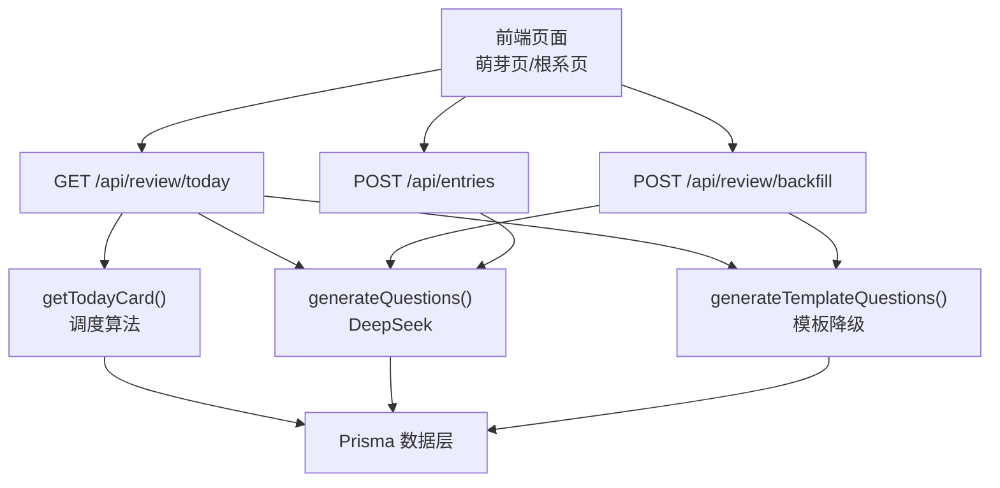
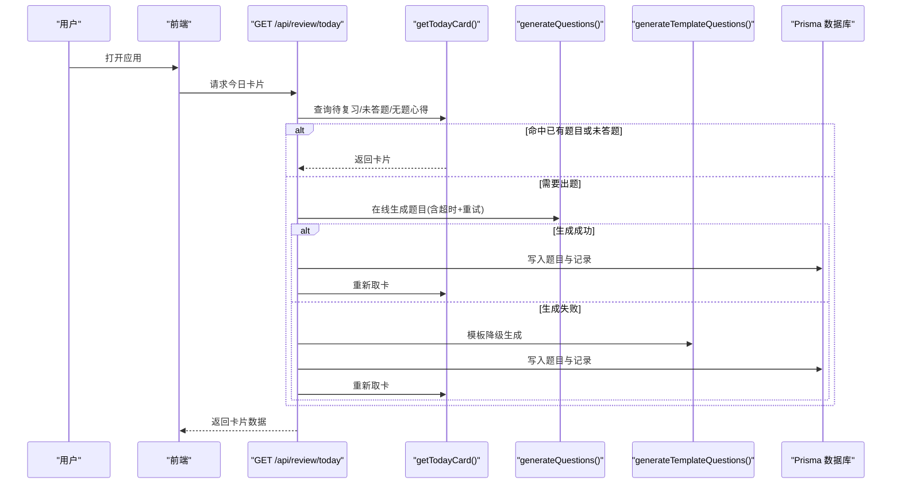
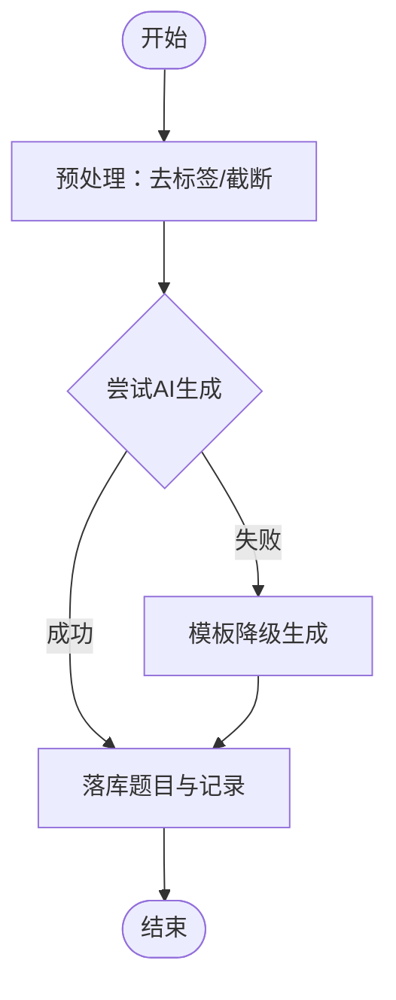
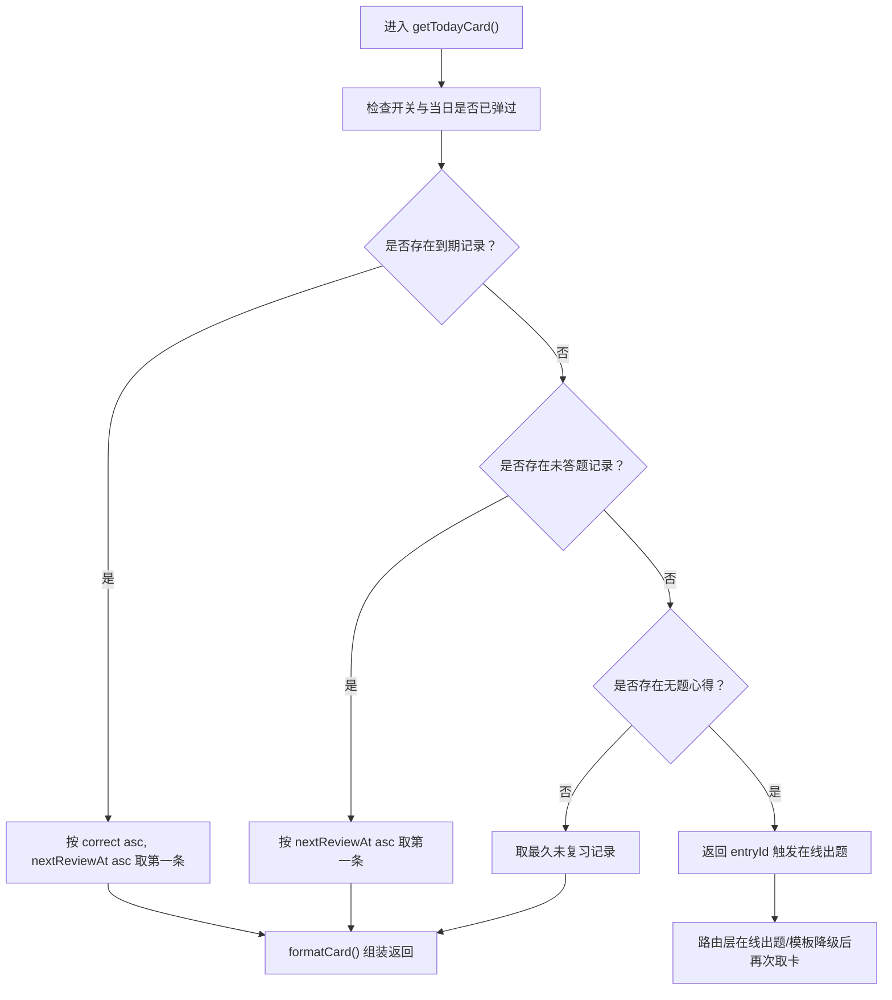
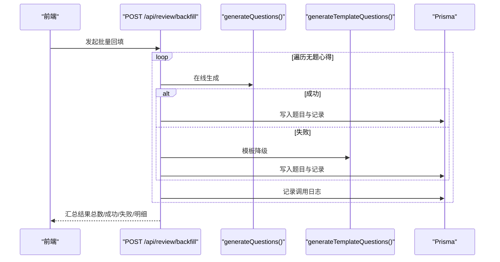
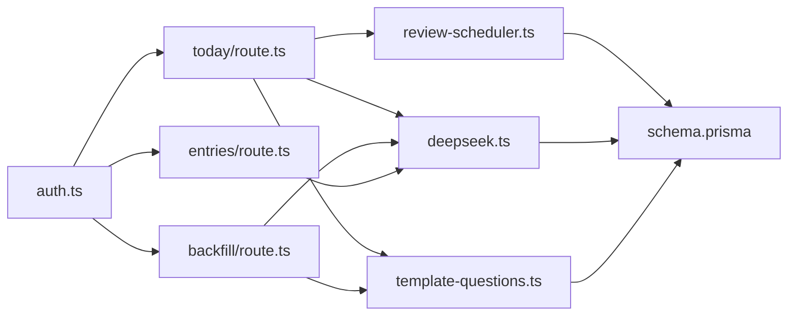

# 题目生成工作流

<cite>
**本文引用的文件**   
- [deepseek.ts](file://lib/deepseek.ts)
- [template-questions.ts](file://lib/template-questions.ts)
- [review-scheduler.ts](file://lib/review-scheduler.ts)
- [route.ts（今日卡片）](file://app/api/review/today/route.ts)
- [route.ts（批量回填）](file://app/api/review/backfill/route.ts)
- [route.ts（条目创建与预生成）](file://app\api\entries\route.ts)
- [schema.prisma](file://prisma/schema.prisma)
- [auth.ts](file://lib/auth.ts)
- [新芽dev-framework.md](file://doc/新芽dev-framework.md)
</cite>

## 目录
1. [引言](#引言)
2. [项目结构](#项目结构)
3. [核心组件](#核心组件)
4. [架构总览](#架构总览)
5. [详细组件分析](#详细组件分析)
6. [依赖关系分析](#依赖关系分析)
7. [性能与缓存优化](#性能与缓存优化)
8. [监控与故障恢复](#监控与故障恢复)
9. [A/B测试与效果对比](#ab测试与效果对比)
10. [结论](#结论)

## 引言
本技术文档围绕“AI题目生成工作流”展开，覆盖从心得内容到题目的完整转换流程、今日复习题目的获取逻辑、批量回填的实现策略、题目质量评估机制、缓存与性能优化、监控与故障恢复，以及A/B测试框架与效果对比分析方法。目标是帮助开发者快速理解系统设计与实现细节，并在后续迭代中高效扩展与优化。

## 项目结构
该工作流由前端触发、后端API编排、调度器决策、AI生成与模板降级、数据库持久化等模块协同完成。关键路径包括：
- 心得保存时异步预生成题目
- 每日首次打开时获取“今日卡片”，必要时在线出题或回退模板
- 批量回填历史无题心得
- 答题后更新复习间隔与学习画像

图表来源
- [route.ts（今日卡片）:43-123](file://app/api/review/today/route.ts#L43-L123)
- [route.ts（批量回填）:8-114](file://app/api/review/backfill/route.ts#L8-L114)
- [route.ts（条目创建与预生成）:66-163](file://app/api/entries/route.ts#L66-L163)
- [review-scheduler.ts:44-144](file://lib/review-scheduler.ts#L44-L144)
- [deepseek.ts:17-115](file://lib/deepseek.ts#L17-L115)
- [template-questions.ts:35-66](file://lib/template-questions.ts#L35-L66)

章节来源
- [新芽dev-framework.md:140-222](file://doc/新芽dev-framework.md#L140-L222)

## 核心组件
- AI题目生成器：封装对外部大模型的调用、超时重试、JSON解析与结果规范化。
- 模板降级器：当AI不可用时，基于标题与内容长度生成基础题目与要点总结。
- 复习调度器：决定“今日卡片”的候选范围与优先级，并维护答题记录与下次复习时间。
- 今日卡片API：协调调度器、AI与模板，确保用户每次请求都能得到可答题目。
- 批量回填API：对历史无题心得进行批处理生成与入库。
- 条目预生成：在心得保存成功后异步触发AI出题，避免阻塞响应。
- 认证与鉴权：统一从Cookie提取当前用户ID，保障接口安全。
- 数据模型：定义Entry、QuizQuestion、QuizRecord、UserSetting、ReviewCallLog等实体及索引。

章节来源
- [deepseek.ts:17-115](file://lib/deepseek.ts#L17-L115)
- [template-questions.ts:12-66](file://lib/template-questions.ts#L12-L66)
- [review-scheduler.ts:44-225](file://lib/review-scheduler.ts#L44-L225)
- [route.ts（今日卡片）:43-123](file://app/api/review/today/route.ts#L43-L123)
- [route.ts（批量回填）:8-114](file://app/api/review/backfill/route.ts#L8-L114)
- [route.ts（条目创建与预生成）:66-163](file://app/api/entries/route.ts#L66-L163)
- [auth.ts:33-43](file://lib/auth.ts#L33-L43)
- [schema.prisma:150-209](file://prisma/schema.prisma#L150-L209)

## 架构总览
下图展示了从用户操作到题目落库的全链路交互，包含在线生成与模板降级的分支路径。

图表来源
- [route.ts（今日卡片）:43-123](file://app/api/review/today/route.ts#L43-L123)
- [review-scheduler.ts:44-144](file://lib/review-scheduler.ts#L44-L144)
- [deepseek.ts:17-115](file://lib/deepseek.ts#L17-L115)
- [template-questions.ts:35-66](file://lib/template-questions.ts#L35-L66)

## 详细组件分析

### 文本预处理与关键信息提取
- 输入来源：Entry.title与Entry.content（富文本HTML）。
- 预处理策略：
  - 去除HTML标签与多余空白，保留纯文本用于摘要与长度判断。
  - 截取前1000字符作为AI提示词上下文，控制成本与时延。
- 关键信息提取：
  - 模板侧通过首句抽取与标题截断生成100字以内要点。
  - AI侧通过Prompt要求以教师视角输出1-2句要点总结。

章节来源
- [template-questions.ts:12-33](file://lib/template-questions.ts#L12-L33)
- [deepseek.ts:22-50](file://lib/deepseek.ts#L22-L50)

### 智能问题生成（AI与模板）
- AI生成：
  - 使用外部模型生成单选/多选/判断题，附带选项、答案索引与解析。
  - 内置30秒超时与最多1次重试；失败时返回空列表供降级。
- 模板降级：
  - 生成“核心主题”单选与“篇幅判断”判断题，保证可用性。
  - 同时产出要点总结，便于卡片展示。

图表来源
- [deepseek.ts:54-115](file://lib/deepseek.ts#L54-L115)
- [template-questions.ts:35-66](file://lib/template-questions.ts#L35-L66)
- [route.ts（今日卡片）:56-99](file://app/api/review/today/route.ts#L56-L99)

章节来源
- [deepseek.ts:17-115](file://lib/deepseek.ts#L17-L115)
- [template-questions.ts:35-66](file://lib/template-questions.ts#L35-L66)
- [route.ts（今日卡片）:56-99](file://app/api/review/today/route.ts#L56-L99)

### 今日复习题目的获取逻辑（优先级排序、难度匹配、时间安排）
- 优先级顺序：
  1) 已到期且答错的优先（correct=false）
  2) 到期但久未复习的优先（nextReviewAt最小）
  3) 已有题目但未作答的记录（answeredAt为空）
  4) 尚无题目的心得（触发在线生成）
  5) 所有心得均有题目时，选择最久未复习的一条
- 难度匹配：
  - 当前未显式引入难度字段，采用“答错优先 + 久未复习优先”近似体现薄弱点强化。
- 时间安排：
  - 答对：连续正确次数streak递增，下次复习间隔按指数增长（1→2→4→8…）。
  - 答错：streak重置为0，间隔固定为1天。
  - 跳过：仅标记当天不再弹出，不改变间隔。

图表来源
- [review-scheduler.ts:44-144](file://lib/review-scheduler.ts#L44-L144)
- [route.ts（今日卡片）:52-99](file://app/api/review/today/route.ts#L52-L99)

章节来源
- [review-scheduler.ts:44-225](file://lib/review-scheduler.ts#L44-L225)
- [route.ts（今日卡片）:43-123](file://app/api/review/today/route.ts#L43-L123)

### 批量回填功能（历史数据分析与渐进式生成）
- 目标：为所有尚未出题的心得补生成题目与记录。
- 策略：
  - 遍历无题心得，逐个尝试AI生成；失败则模板降级。
  - 逐条落库题目与初始记录（nextReviewAt=次日），并记录调用日志。
- 渐进式建议（可选增强）：
  - 增加并发度限制与队列，避免瞬时大量AI调用。
  - 支持分页与断点续跑，结合ReviewCallLog统计成功率与耗时。

图表来源
- [route.ts（批量回填）:8-114](file://app/api/review/backfill/route.ts#L8-L114)
- [deepseek.ts:17-115](file://lib/deepseek.ts#L17-L115)
- [template-questions.ts:35-66](file://lib/template-questions.ts#L35-L66)

章节来源
- [route.ts（批量回填）:8-114](file://app/api/review/backfill/route.ts#L8-L114)

### 题目质量评估机制（相关性评分与多样性保证）
- 相关性：
  - Prompt约束题干≤30字、解析引用原文重点，降低无关性。
  - 模板侧以标题为核心构造选项，提升主题一致性。
- 多样性：
  - 题型自动适配（概念辨析→单选，关系匹配→多选，对比→判断）。
  - 同一知识点角度编号angle递增，便于同知识多角考查。
- 可扩展指标（建议）：
  - 基于标签维度计算准确率分布，识别薄弱领域。
  - 对AI输出做结构化校验（类型、选项数量、答案索引合法性）。

章节来源
- [deepseek.ts:22-50](file://lib/deepseek.ts#L22-L50)
- [template-questions.ts:35-66](file://lib/template-questions.ts#L35-L66)
- [schema.prisma:150-165](file://prisma/schema.prisma#L150-L165)

### 缓存策略与性能优化（避免重复AI调用）
- 题目缓存：
  - 生成的题目与答题记录直接落库，后续复用，避免重复AI调用。
- 预生成：
  - 心得保存成功后异步触发AI出题，不阻塞主响应。
- 超时与重试：
  - AI调用设置30秒超时与最多1次重试，防止长尾延迟。
- 日志限流：
  - ReviewCallLog仅保留最近30条，减少存储膨胀。

章节来源
- [route.ts（条目创建与预生成）:96-163](file://app/api/entries/route.ts#L96-L163)
- [deepseek.ts:54-115](file://lib/deepseek.ts#L54-L115)
- [review-scheduler.ts:5-29](file://lib/review-scheduler.ts#L5-L29)

### 工作流监控与故障恢复
- 监控：
  - ReviewCallLog记录步骤（pre-generate、cache-hit、online-retry、template-fallback）、成功与否、题目数量与错误信息。
- 故障恢复：
  - AI失败自动降级模板；学习画像接口也具备本地计算降级。
  - 超时中断与异常捕获，保证服务稳定性。

章节来源
- [review-scheduler.ts:5-29](file://lib/review-scheduler.ts#L5-L29)
- [route.ts（今日卡片）:73-99](file://app/api/review/today/route.ts#L73-L99)
- [route.ts（批量回填）:37-59](file://app/api/review/backfill/route.ts#L37-L59)

## 依赖关系分析
- 组件耦合：
  - 今日卡片API强依赖调度器与AI/模板；批量回填与预生成共享AI/模板能力。
  - 调度器依赖数据库模型与用户设置。
- 外部依赖：
  - DeepSeek API（网络I/O，需超时与重试）。
  - Prisma客户端（PostgreSQL）。
- 潜在循环依赖：
  - 当前未见循环导入；各模块职责清晰。

图表来源
- [auth.ts:33-43](file://lib/auth.ts#L33-L43)
- [route.ts（今日卡片）:1-123](file://app/api/review/today/route.ts#L1-L123)
- [route.ts（批量回填）:1-114](file://app/api/review/backfill/route.ts#L1-L114)
- [route.ts（条目创建与预生成）:1-163](file://app/api/entries/route.ts#L1-L163)
- [review-scheduler.ts:1-225](file://lib/review-scheduler.ts#L1-L225)
- [deepseek.ts:1-115](file://lib/deepseek.ts#L1-L115)
- [template-questions.ts:1-66](file://lib/template-questions.ts#L1-L66)
- [schema.prisma:1-209](file://prisma/schema.prisma#L1-L209)

章节来源
- [schema.prisma:150-209](file://prisma/schema.prisma#L150-L209)

## 性能与缓存优化
- 并发与限流：
  - 批量回填建议引入任务队列与并发上限，避免API限流与数据库压力。
- 缓存命中：
  - 今日卡片API在命中已有题目时仅记录日志，零AI开销。
- 超时与重试：
  - 统一超时阈值与重试次数，避免雪崩。
- 索引优化：
  - 针对userId、nextReviewAt建立索引，加速调度查询。

[本节为通用指导，无需代码来源]

## 监控与故障恢复
- 监控指标：
  - 生成成功率、平均耗时、降级比例、超时次数。
  - 通过ReviewCallLog聚合分析。
- 告警与自愈：
  - 当连续失败超过阈值时，触发告警并切换至模板模式。
  - 学习画像接口具备本地计算降级，保障可用。

章节来源
- [review-scheduler.ts:5-29](file://lib/review-scheduler.ts#L5-L29)
- [route.ts（今日卡片）:73-99](file://app/api/review/today/route.ts#L73-L99)
- [route.ts（批量回填）:37-59](file://app/api/review/backfill/route.ts#L37-L59)

## A/B测试与效果对比
- 实验设计：
  - 分组：对照组（模板为主） vs 实验组（AI优先+模板降级）。
  - 指标：题目相关度（人工抽检）、答题正确率、复习间隔变化、用户留存。
- 实施要点：
  - 在路由层根据用户特征或随机分流，记录实验标识。
  - 将实验标识写入ReviewCallLog或新增字段，便于回溯。
- 分析方法：
  - 按周粒度对比两组指标差异，显著性检验（如t检验或Mann-Whitney）。
  - 结合标签维度分析薄弱领域改善情况。

[本节为方法论说明，无需代码来源]

## 结论
本工作流以“在线生成优先、模板降级兜底”的策略，在保证用户体验的同时兼顾成本与稳定性。通过调度器的优先级规则与间隔算法，有效强化薄弱知识点；借助预生成与批量回填，逐步完善题库资产。配合完善的监控与降级机制，系统具备良好的可观测性与鲁棒性。未来可在并发控制、质量评估与A/B测试方面持续深化，进一步提升题目质量与学习效果。