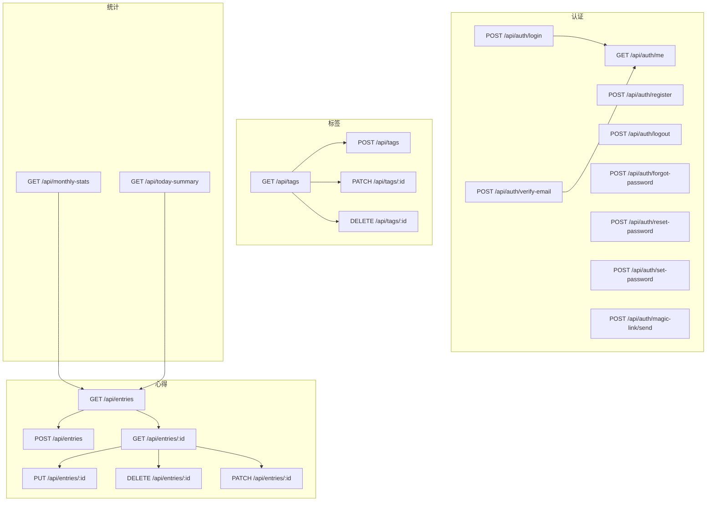
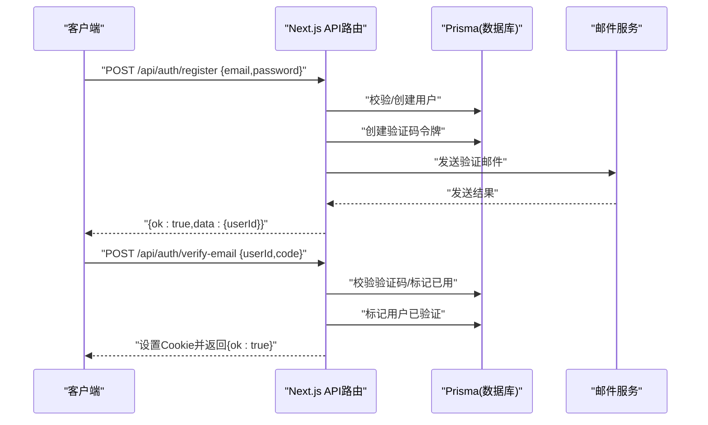
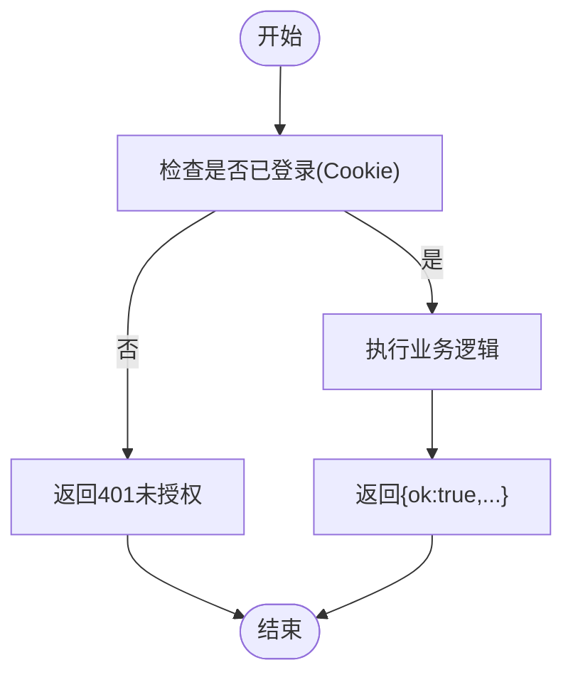
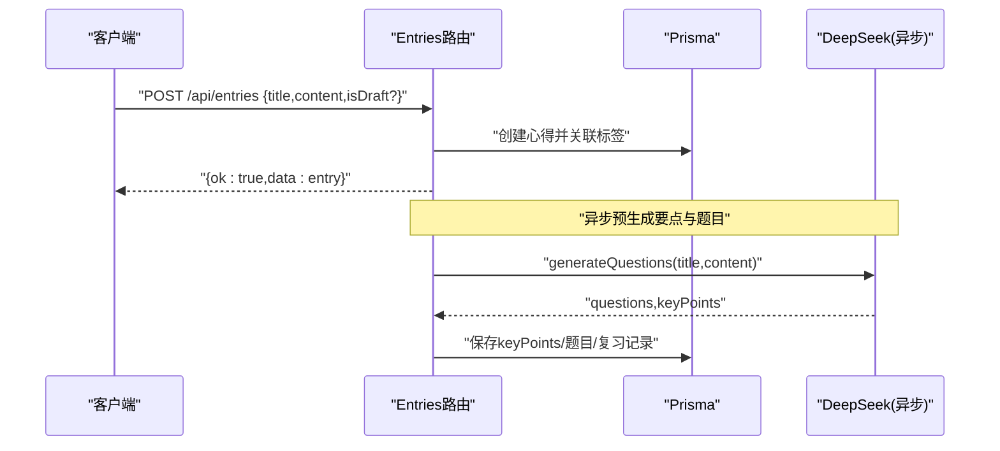
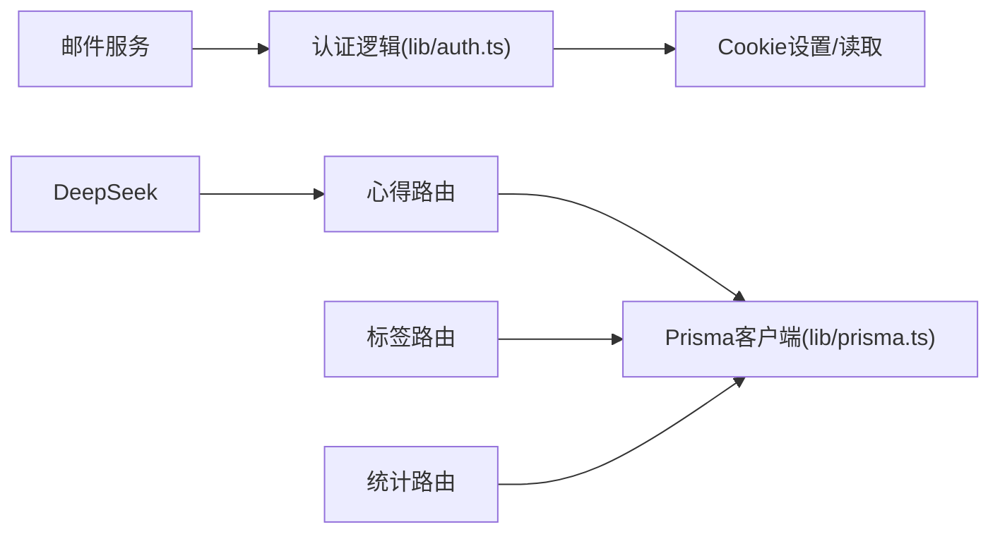

# API接口文档

<cite>
**本文引用的文件**   
- [app/api/auth/login/route.ts](file://app/api/auth/login/route.ts)
- [app/api/auth/register/route.ts](file://app/api/auth/register/route.ts)
- [app/api/auth/me/route.ts](file://app/api/auth/me/route.ts)
- [app/api/auth/logout/route.ts](file://app/api/auth/logout/route.ts)
- [app/api/auth/forgot-password/route.ts](file://app/api/auth/forgot-password/route.ts)
- [app/api/auth/reset-password/route.ts](file://app/api/auth/reset-password/route.ts)
- [app/api/auth/set-password/route.ts](file://app/api/auth/set-password/route.ts)
- [app/api/auth/verify-email/route.ts](file://app/api/auth/verify-email/route.ts)
- [app/api/auth/magic-link/send/route.ts](file://app/api/auth/magic-link/send/route.ts)
- [app/api/entries/route.ts](file://app/api/entries/route.ts)
- [app/api/entries/[id]/route.ts](file://app/api/entries/[id]/route.ts)
- [app/api/tags/route.ts](file://app/api/tags/route.ts)
- [app/api/tags/[id]/route.ts](file://app/api/tags/[id]/route.ts)
- [app/api/monthly-stats/route.ts](file://app/api/monthly-stats/route.ts)
- [app/api/today-summary/route.ts](file://app/api/today-summary/route.ts)
- [lib/auth.ts](file://lib/auth.ts)
- [lib/prisma.ts](file://lib/prisma.ts)
</cite>

## 目录
1. [简介](#简介)
2. [项目结构](#项目结构)
3. [核心组件](#核心组件)
4. [架构总览](#架构总览)
5. [详细组件分析](#详细组件分析)
6. [依赖分析](#依赖分析)
7. [性能考虑](#性能考虑)
8. [故障排查指南](#故障排查指南)
9. [结论](#结论)
10. [附录](#附录)

## 简介
本文件为心芽项目的完整API接口参考，覆盖认证、心得管理、标签管理、统计分析等模块。所有端点均为RESTful风格，采用JSON请求与响应体，统一使用HTTP状态码表达成功与失败。认证通过服务端签发并设置Cookie进行会话管理。

## 项目结构
后端API基于Next.js App Router实现，路由位于 app/api 目录下，按功能域划分：
- 认证相关：auth/*
- 心得管理：entries/*
- 标签管理：tags/*
- 统计分析：monthly-stats, today-summary

图表来源
- [app/api/auth/login/route.ts:1-39](file://app/api/auth/login/route.ts#L1-L39)
- [app/api/auth/register/route.ts:1-56](file://app/api/auth/register/route.ts#L1-L56)
- [app/api/auth/me/route.ts:1-18](file://app/api/auth/me/route.ts#L1-L18)
- [app/api/auth/logout/route.ts:1-10](file://app/api/auth/logout/route.ts#L1-L10)
- [app/api/auth/forgot-password/route.ts:1-34](file://app/api/auth/forgot-password/route.ts#L1-L34)
- [app/api/auth/reset-password/route.ts:1-31](file://app/api/auth/reset-password/route.ts#L1-L31)
- [app/api/auth/set-password/route.ts:1-27](file://app/api/auth/set-password/route.ts#L1-L27)
- [app/api/auth/verify-email/route.ts:1-38](file://app/api/auth/verify-email/route.ts#L1-L38)
- [app/api/auth/magic-link/send/route.ts:1-47](file://app/api/auth/magic-link/send/route.ts#L1-L47)
- [app/api/entries/route.ts:1-163](file://app/api/entries/route.ts#L1-L163)
- [app/api/entries/[id]/route.ts:1-95](file://app/api/entries/[id]/route.ts#L1-L95)
- [app/api/tags/route.ts:1-46](file://app/api/tags/route.ts#L1-L46)
- [app/api/tags/[id]/route.ts:1-62](file://app/api/tags/[id]/route.ts#L1-L62)
- [app/api/monthly-stats/route.ts:1-96](file://app/api/monthly-stats/route.ts#L1-L96)
- [app/api/today-summary/route.ts:1-118](file://app/api/today-summary/route.ts#L1-L118)

章节来源
- [app/api/auth/login/route.ts:1-39](file://app/api/auth/login/route.ts#L1-L39)
- [app/api/auth/register/route.ts:1-56](file://app/api/auth/register/route.ts#L1-L56)
- [app/api/auth/me/route.ts:1-18](file://app/api/auth/me/route.ts#L1-L18)
- [app/api/auth/logout/route.ts:1-10](file://app/api/auth/logout/route.ts#L1-L10)
- [app/api/auth/forgot-password/route.ts:1-34](file://app/api/auth/forgot-password/route.ts#L1-L34)
- [app/api/auth/reset-password/route.ts:1-31](file://app/api/auth/reset-password/route.ts#L1-L31)
- [app/api/auth/set-password/route.ts:1-27](file://app/api/auth/set-password/route.ts#L1-L27)
- [app/api/auth/verify-email/route.ts:1-38](file://app/api/auth/verify-email/route.ts#L1-L38)
- [app/api/auth/magic-link/send/route.ts:1-47](file://app/api/auth/magic-link/send/route.ts#L1-L47)
- [app/api/entries/route.ts:1-163](file://app/api/entries/route.ts#L1-L163)
- [app/api/entries/[id]/route.ts:1-95](file://app/api/entries/[id]/route.ts#L1-L95)
- [app/api/tags/route.ts:1-46](file://app/api/tags/route.ts#L1-L46)
- [app/api/tags/[id]/route.ts:1-62](file://app/api/tags/[id]/route.ts#L1-L62)
- [app/api/monthly-stats/route.ts:1-96](file://app/api/monthly-stats/route.ts#L1-L96)
- [app/api/today-summary/route.ts:1-118](file://app/api/today-summary/route.ts#L1-L118)

## 核心组件
- 认证与会话
  - 登录、注册、邮箱验证、密码重置、魔法链接登录、登出、当前用户信息获取。
  - 会话通过服务端设置Cookie完成，后续受保护接口需携带该Cookie。
- 心得管理
  - 提供列表查询（支持搜索、收藏筛选、标签筛选、时间范围、分页）、创建、详情、更新、删除、部分更新（置顶/收藏）。
  - 非草稿条目在创建后异步触发AI生成复习题目与要点（不阻塞响应）。
- 标签管理
  - 列出、新建、重命名、删除；删除前自动将仅关联被删标签的心得补上默认标签。
- 统计分析
  - 月度统计：按北京时间的月维度统计每日记录数。
  - 今日汇总：今日/本周数量、连续打卡天数、最长连续、最近一条心得标题。

章节来源
- [app/api/auth/login/route.ts:1-39](file://app/api/auth/login/route.ts#L1-L39)
- [app/api/auth/register/route.ts:1-56](file://app/api/auth/register/route.ts#L1-L56)
- [app/api/auth/verify-email/route.ts:1-38](file://app/api/auth/verify-email/route.ts#L1-L38)
- [app/api/auth/forgot-password/route.ts:1-34](file://app/api/auth/forgot-password/route.ts#L1-L34)
- [app/api/auth/reset-password/route.ts:1-31](file://app/api/auth/reset-password/route.ts#L1-L31)
- [app/api/auth/set-password/route.ts:1-27](file://app/api/auth/set-password/route.ts#L1-L27)
- [app/api/auth/magic-link/send/route.ts:1-47](file://app/api/auth/magic-link/send/route.ts#L1-L47)
- [app/api/entries/route.ts:1-163](file://app/api/entries/route.ts#L1-L163)
- [app/api/entries/[id]/route.ts:1-95](file://app/api/entries/[id]/route.ts#L1-L95)
- [app/api/tags/route.ts:1-46](file://app/api/tags/route.ts#L1-L46)
- [app/api/tags/[id]/route.ts:1-62](file://app/api/tags/[id]/route.ts#L1-L62)
- [app/api/monthly-stats/route.ts:1-96](file://app/api/monthly-stats/route.ts#L1-L96)
- [app/api/today-summary/route.ts:1-118](file://app/api/today-summary/route.ts#L1-L118)

## 架构总览
整体采用“前端页面 + Next.js API路由 + Prisma ORM”的分层结构。认证中间逻辑集中在 lib/auth.ts，数据库访问通过 lib/prisma.ts 提供的客户端实例。

图表来源
- [app/api/auth/register/route.ts:1-56](file://app/api/auth/register/route.ts#L1-L56)
- [app/api/auth/verify-email/route.ts:1-38](file://app/api/auth/verify-email/route.ts#L1-L38)
- [lib/prisma.ts:1-200](file://lib/prisma.ts#L1-L200)

## 详细组件分析

### 认证模块
- 通用说明
  - 受保护接口需在请求中携带由登录或验证成功后设置的Cookie。
  - 统一响应格式包含 ok 字段表示业务成功与否，错误时附带 error 字段。
  - 时间戳统一使用ISO字符串。

- POST /api/auth/login
  - 功能：邮箱+密码登录，成功后设置Cookie并返回用户初始化信息。
  - 请求体：{ email, password }
  - 响应：
    - 成功：{ ok: true, data: { onboardDone, theme } }
    - 未验证：{ ok: false, error, userId, needVerify }
    - 失败：{ ok: false, error }
  - 状态码：200/400/401/500

- POST /api/auth/register
  - 功能：注册账号，自动生成默认标签“随笔”，发送邮箱验证码。
  - 请求体：{ email, password }
  - 响应：{ ok: true/false, data?: { userId }, error? }
  - 状态码：200/400/500

- POST /api/auth/verify-email
  - 功能：邮箱验证码校验，通过后自动登录并设置Cookie。
  - 请求体：{ userId, code }
  - 响应：{ ok: true/false, error? }
  - 状态码：200/400/500

- POST /api/auth/forgot-password
  - 功能：发送密码重置邮件（含一次性token），对不存在或未验证的邮箱也返回成功以避免枚举。
  - 请求体：{ email }
  - 响应：{ ok: true/false, error? }
  - 状态码：200/400/500

- POST /api/auth/reset-password
  - 功能：使用重置token设置新密码，token使用后失效。
  - 请求体：{ token, password }
  - 响应：{ ok: true/false, error? }
  - 状态码：200/400/500

- POST /api/auth/set-password
  - 功能：已登录用户设置密码。
  - 请求体：{ password }
  - 响应：{ ok: true/false, error? }
  - 状态码：200/400/401/500

- GET /api/auth/me
  - 功能：获取当前用户基本信息。
  - 响应：{ ok: true/false, data?: { id, email, theme, onboardDone, openTimes } }
  - 状态码：200/401

- POST /api/auth/logout
  - 功能：清除登录Cookie。
  - 响应：{ ok: true }
  - 状态码：200

- POST /api/auth/magic-link/send
  - 功能：发送一次性魔法链接到邮箱，用于免密登录/注册。
  - 请求体：{ email }
  - 响应：{ ok: true/false, data?: { email }, error? }
  - 状态码：200/400/500

图表来源
- [app/api/auth/me/route.ts:1-18](file://app/api/auth/me/route.ts#L1-L18)
- [app/api/auth/set-password/route.ts:1-27](file://app/api/auth/set-password/route.ts#L1-L27)

章节来源
- [app/api/auth/login/route.ts:1-39](file://app/api/auth/login/route.ts#L1-L39)
- [app/api/auth/register/route.ts:1-56](file://app/api/auth/register/route.ts#L1-L56)
- [app/api/auth/verify-email/route.ts:1-38](file://app/api/auth/verify-email/route.ts#L1-L38)
- [app/api/auth/forgot-password/route.ts:1-34](file://app/api/auth/forgot-password/route.ts#L1-L34)
- [app/api/auth/reset-password/route.ts:1-31](file://app/api/auth/reset-password/route.ts#L1-L31)
- [app/api/auth/set-password/route.ts:1-27](file://app/api/auth/set-password/route.ts#L1-L27)
- [app/api/auth/me/route.ts:1-18](file://app/api/auth/me/route.ts#L1-L18)
- [app/api/auth/logout/route.ts:1-10](file://app/api/auth/logout/route.ts#L1-L10)
- [app/api/auth/magic-link/send/route.ts:1-47](file://app/api/auth/magic-link/send/route.ts#L1-L47)

### 心得管理模块
- GET /api/entries
  - 功能：分页查询心得列表，支持搜索、收藏筛选、标签筛选、日期范围过滤。
  - 查询参数：
    - search: 关键词（模糊匹配标题/内容）
    - favorite: true/false
    - tagId: 标签ID
    - from/to: ISO日期范围（包含from，不包含to次日）
    - page: 页码，默认1
    - limit: 每页条数，默认20，最大1000
  - 响应：{ ok: true, data: { entries[], total, page, limit } }
  - 状态码：200/401

- POST /api/entries
  - 功能：创建心得，若未指定标签则自动关联默认标签。
  - 请求体：{ title, content?, mood?, tagIds?[], isDraft? }
  - 响应：{ ok: true, data: entry }
  - 状态码：200/400/401
  - 备注：非草稿且存在内容时，会异步触发AI生成要点与复习题目（不阻塞响应）。

- GET /api/entries/:id
  - 功能：获取单条心得详情。
  - 路径参数：id
  - 响应：{ ok: true, data: { ...entry fields } }
  - 状态码：200/401/404

- PUT /api/entries/:id
  - 功能：编辑心得（全量更新）。
  - 请求体：同创建字段。
  - 响应：{ ok: true, data: entry }
  - 状态码：200/400/401

- DELETE /api/entries/:id
  - 功能：删除心得。
  - 响应：{ ok: true }
  - 状态码：200/401

- PATCH /api/entries/:id
  - 功能：部分更新（仅允许 isTop、isFavorite）。
  - 请求体：{ isTop?: boolean, isFavorite?: boolean }
  - 响应：{ ok: true, data: entry }
  - 状态码：200/401

图表来源
- [app/api/entries/route.ts:1-163](file://app/api/entries/route.ts#L1-L163)

章节来源
- [app/api/entries/route.ts:1-163](file://app/api/entries/route.ts#L1-L163)
- [app/api/entries/[id]/route.ts:1-95](file://app/api/entries/[id]/route.ts#L1-L95)

### 标签管理模块
- GET /api/tags
  - 功能：列出当前用户的所有标签，附带每条标签关联的心得数量。
  - 响应：{ ok: true, data: [{ id, name, isDefault, entryCount }] }
  - 状态码：200/401

- POST /api/tags
  - 功能：新建标签（名称去空白，长度限制，唯一性校验）。
  - 请求体：{ name }
  - 响应：{ ok: true, data: tag }
  - 状态码：200/400/401

- PATCH /api/tags/:id
  - 功能：重命名标签（唯一性校验）。
  - 请求体：{ name }
  - 响应：{ ok: true, data: updatedTag }
  - 状态码：200/400/401/404

- DELETE /api/tags/:id
  - 功能：删除标签；若存在仅关联该标签的心得，先为其补上默认标签。
  - 响应：{ ok: true }
  - 状态码：200/400/401/404

章节来源
- [app/api/tags/route.ts:1-46](file://app/api/tags/route.ts#L1-L46)
- [app/api/tags/[id]/route.ts:1-62](file://app/api/tags/[id]/route.ts#L1-L62)

### 统计分析模块
- GET /api/monthly-stats
  - 功能：按月统计非草稿心得数量（北京时间）。
  - 查询参数：year, month（可选，默认当前年/月）
  - 响应：{ ok: true, data: { year, month, label, days[], total } }
    - days: 每日对象 { day, count, isToday }
  - 状态码：200/401

- GET /api/today-summary
  - 功能：今日汇总（今日/本周数量、连续打卡、最长连续、最近一条标题）。
  - 响应：{ ok: true, data: { todayCount, weekCount, streak, maxStreak, lastEntry } }
  - 状态码：200/401

章节来源
- [app/api/monthly-stats/route.ts:1-96](file://app/api/monthly-stats/route.ts#L1-L96)
- [app/api/today-summary/route.ts:1-118](file://app/api/today-summary/route.ts#L1-L118)

## 依赖分析
- 认证与会话
  - 登录/验证成功后通过 Cookie 设置JWT令牌，后续受保护接口通过读取当前用户ID进行鉴权。
- 数据访问
  - 所有持久化操作均通过 Prisma 客户端执行，遵循用户隔离策略（userId）。
- 外部集成
  - 邮件服务：用于发送验证码、重置链接、魔法链接。
  - DeepSeek：异步生成复习题目与要点（不阻塞主流程）。

图表来源
- [lib/auth.ts:1-200](file://lib/auth.ts#L1-L200)
- [lib/prisma.ts:1-200](file://lib/prisma.ts#L1-L200)
- [app/api/entries/route.ts:1-163](file://app/api/entries/route.ts#L1-L163)

章节来源
- [lib/auth.ts:1-200](file://lib/auth.ts#L1-L200)
- [lib/prisma.ts:1-200](file://lib/prisma.ts#L1-L200)
- [app/api/entries/route.ts:1-163](file://app/api/entries/route.ts#L1-L163)

## 性能考虑
- 列表查询
  - 使用分页参数 page/limit 控制返回量，limit上限为1000，避免大结果集。
  - 多条件组合查询通过Prisma where子句高效过滤。
- 并发查询
  - 统计类接口使用并行查询减少RT（如 today-summary）。
- 异步处理
  - 心得创建后的AI生成任务异步执行，不阻塞响应。
- 索引建议
  - 建议在 user_id、record_time、is_draft、is_favorite、is_top 等常用过滤字段建立索引以提升查询性能。

[本节为通用指导，无需代码引用]

## 故障排查指南
- 常见错误码
  - 400：请求参数缺失或校验失败（如空字段、格式错误、重复资源）。
  - 401：未登录或凭证无效。
  - 404：资源不存在。
  - 500：服务器内部错误。
- 定位步骤
  - 确认是否携带有效Cookie（登录/验证成功后设置）。
  - 检查请求体字段是否符合规范（必填、长度、格式）。
  - 查看服务端日志输出（各路由均有 try/catch 与 console.error）。
  - 对于邮箱相关接口，检查邮件服务配置与域名白名单。
- 典型问题
  - 登录返回需要验证：请先完成邮箱验证。
  - 标签删除失败：默认标签不可删除；确保存在默认标签以回填关联关系。
  - 统计异常：确认时区与日期边界计算（接口内已按北京时间处理）。

章节来源
- [app/api/auth/login/route.ts:1-39](file://app/api/auth/login/route.ts#L1-L39)
- [app/api/auth/register/route.ts:1-56](file://app/api/auth/register/route.ts#L1-L56)
- [app/api/auth/verify-email/route.ts:1-38](file://app/api/auth/verify-email/route.ts#L1-L38)
- [app/api/auth/forgot-password/route.ts:1-34](file://app/api/auth/forgot-password/route.ts#L1-L34)
- [app/api/auth/reset-password/route.ts:1-31](file://app/api/auth/reset-password/route.ts#L1-L31)
- [app/api/auth/set-password/route.ts:1-27](file://app/api/auth/set-password/route.ts#L1-L27)
- [app/api/entries/route.ts:1-163](file://app/api/entries/route.ts#L1-L163)
- [app/api/entries/[id]/route.ts:1-95](file://app/api/entries/[id]/route.ts#L1-L95)
- [app/api/tags/route.ts:1-46](file://app/api/tags/route.ts#L1-L46)
- [app/api/tags/[id]/route.ts:1-62](file://app/api/tags/[id]/route.ts#L1-L62)
- [app/api/monthly-stats/route.ts:1-96](file://app/api/monthly-stats/route.ts#L1-L96)
- [app/api/today-summary/route.ts:1-118](file://app/api/today-summary/route.ts#L1-L118)

## 结论
本API文档覆盖了心芽项目的核心能力：认证与会话、心得CRUD与检索、标签管理、统计分析。接口设计遵循RESTful约定，统一错误响应格式，并通过Cookie进行会话管理。建议在客户端侧做好重试、缓存与错误提示，同时关注分页与限流策略以保证稳定性。

[本节为总结性内容，无需代码引用]

## 附录

### 统一响应格式
- 成功：{ ok: true, data?: any }
- 失败：{ ok: false, error: string }

### 认证与令牌管理
- 令牌载体：服务端签发的Cookie。
- 生命周期：随登录/验证成功设置，登出时清除。
- 安全建议：
  - 始终通过HTTPS调用。
  - 不要在前端存储敏感信息于localStorage。
  - 定期刷新页面或重新登录以确保会话有效。

### 版本控制与兼容性
- 当前未显式引入URL版本前缀（如 /v1）。
- 向后兼容策略建议：
  - 新增字段保持可选，避免破坏现有客户端。
  - 废弃字段保留一段时间并提供迁移指引。
  - 重大变更通过新版本路由发布（例如 /v2/...）。

### 客户端示例与最佳实践
- 登录流程
  - 调用 POST /api/auth/login，成功后浏览器自动携带Cookie。
  - 随后调用 GET /api/auth/me 校验会话有效性。
- 注册与验证
  - 调用 POST /api/auth/register 后，根据返回的 userId 调用 POST /api/auth/verify-email 完成验证并自动登录。
- 密码管理
  - 忘记密码：POST /api/auth/forgot-password -> 点击邮件中的重置链接 -> POST /api/auth/reset-password。
  - 已登录设置密码：POST /api/auth/set-password。
- 魔法链接
  - 发送：POST /api/auth/magic-link/send，点击链接完成登录/注册。
- 心得操作
  - 列表：GET /api/entries?search=&favorite=&tagId=&from=&to=&page=&limit=
  - 创建：POST /api/entries
  - 详情/编辑/删除/部分更新：GET/PUT/DELETE/PATCH /api/entries/:id
- 标签操作
  - 列表/新建：GET/POST /api/tags
  - 重命名/删除：PATCH/DELETE /api/tags/:id
- 统计
  - 月度：GET /api/monthly-stats?year=&month=
  - 今日汇总：GET /api/today-summary

[本节为通用指导，无需代码引用]