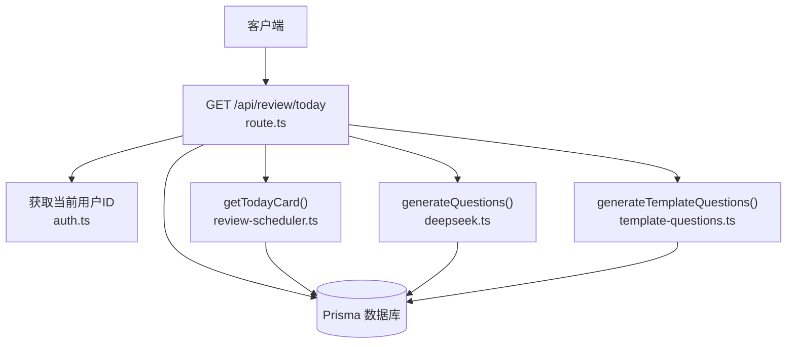
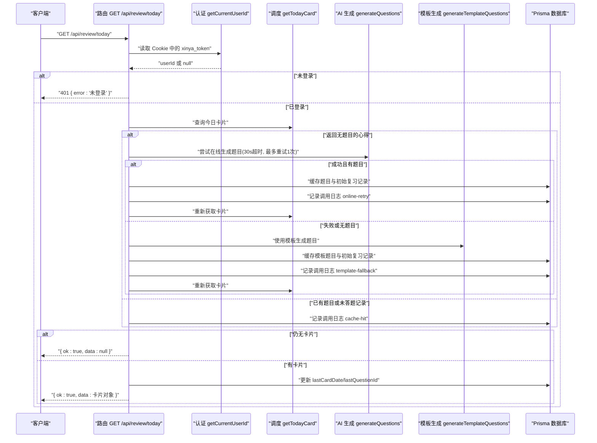
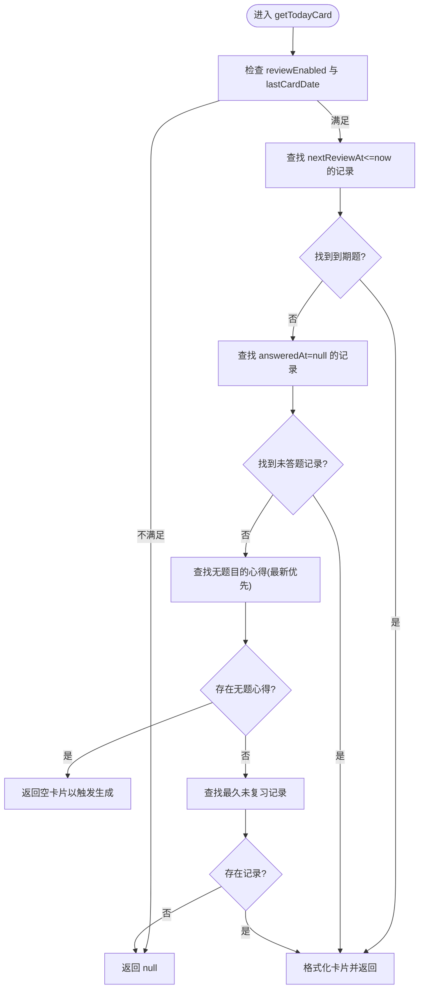
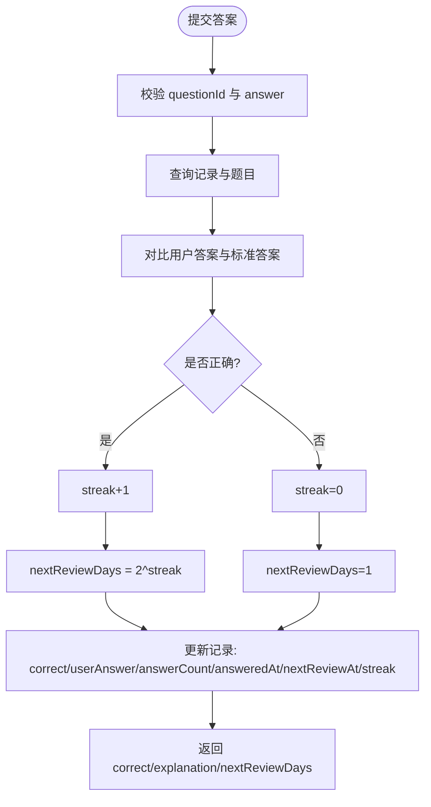
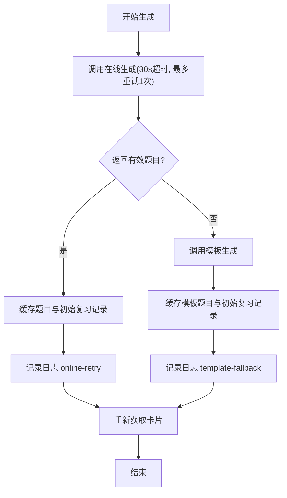
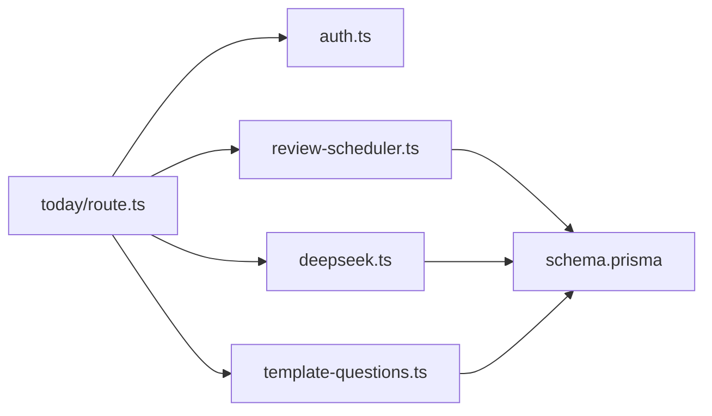

# 今日卡片接口

<cite>
**本文引用的文件**
- [app/api/review/today/route.ts](file://app/api/review/today/route.ts)
- [lib/review-scheduler.ts](file://lib/review-scheduler.ts)
- [lib/deepseek.ts](file://lib/deepseek.ts)
- [lib/template-questions.ts](file://lib/template-questions.ts)
- [lib/auth.ts](file://lib/auth.ts)
- [prisma/schema.prisma](file://prisma/schema.prisma)
- [types/index.ts](file://types/index.ts)
- [app/api/review/settings/route.ts](file://app/api/review/settings/route.ts)
- [app/api/review/answer/route.ts](file://app/api/review/answer/route.ts)
</cite>

## 目录
1. [简介](#简介)
2. [项目结构](#项目结构)
3. [核心组件](#核心组件)
4. [架构总览](#架构总览)
5. [详细组件分析](#详细组件分析)
6. [依赖关系分析](#依赖关系分析)
7. [性能与缓存策略](#性能与缓存策略)
8. [故障排查指南](#故障排查指南)
9. [结论](#结论)
10. [附录：API 规范](#附录api-规范)

## 简介
本文件为心芽项目的“今日复习卡片”接口提供完整的技术文档，聚焦于 GET /api/review/today 的请求参数、响应格式、认证要求，并深入解释间隔重复算法如何决定每日复习题目、AI 题目生成流程（含在线失败降级到模板）、题目缓存策略与性能优化方案。文末附带完整的请求示例、响应数据结构、错误码说明及关联接口参考。

## 项目结构
该接口位于 Next.js App Router 的 API 路由中，核心逻辑由调度器、AI 生成器与模板降级模块协作完成，数据持久化通过 Prisma 模型管理。

图表来源
- [app/api/review/today/route.ts:43-122](file://app/api/review/today/route.ts#L43-L122)
- [lib/auth.ts:33-43](file://lib/auth.ts#L33-L43)
- [lib/review-scheduler.ts:44-144](file://lib/review-scheduler.ts#L44-L144)
- [lib/deepseek.ts:17-114](file://lib/deepseek.ts#L17-L114)
- [lib/template-questions.ts:35-65](file://lib/template-questions.ts#L35-L65)

章节来源
- [app/api/review/today/route.ts:1-123](file://app/api/review/today/route.ts#L1-L123)
- [lib/review-scheduler.ts:1-225](file://lib/review-scheduler.ts#L1-L225)
- [lib/deepseek.ts:1-115](file://lib/deepseek.ts#L1-L115)
- [lib/template-questions.ts:1-66](file://lib/template-questions.ts#L1-L66)
- [lib/auth.ts:1-56](file://lib/auth.ts#L1-L56)
- [prisma/schema.prisma:150-209](file://prisma/schema.prisma#L150-L209)

## 核心组件
- 认证与鉴权：从 Cookie 中解析 JWT，提取 userId；未登录返回 401。
- 调度器：按间隔重复策略选择待复习题目或无题心得，构造今日卡片。
- AI 生成：调用外部大模型生成题目与要点总结，具备超时与重试机制。
- 模板降级：当 AI 生成失败时，基于标题与内容生成基础题目与要点。
- 缓存写入：将生成的题目与初始复习记录持久化，便于后续调度命中。
- 设置开关：用户可开启/关闭复习功能，且需满足最低心得数量限制。

章节来源
- [lib/auth.ts:33-43](file://lib/auth.ts#L33-L43)
- [lib/review-scheduler.ts:44-144](file://lib/review-scheduler.ts#L44-L144)
- [lib/deepseek.ts:17-114](file://lib/deepseek.ts#L17-L114)
- [lib/template-questions.ts:35-65](file://lib/template-questions.ts#L35-L65)
- [app/api/review/today/route.ts:8-41](file://app/api/review/today/route.ts#L8-L41)
- [app/api/review/settings/route.ts:28-61](file://app/api/review/settings/route.ts#L28-L61)

## 架构总览
下图展示了 GET /api/review/today 的端到端流程，包括认证、调度、AI 生成与模板降级、结果缓存与日志记录。

图表来源
- [app/api/review/today/route.ts:43-122](file://app/api/review/today/route.ts#L43-L122)
- [lib/review-scheduler.ts:44-144](file://lib/review-scheduler.ts#L44-L144)
- [lib/deepseek.ts:17-114](file://lib/deepseek.ts#L17-L114)
- [lib/template-questions.ts:35-65](file://lib/template-questions.ts#L35-L65)

## 详细组件分析

### 认证与鉴权
- 认证方式：Cookie 携带名为 xinya_token 的 JWT。
- 校验流程：从 Cookie 中取 token，验证签名后返回 userId；若缺失或无效则视为未登录。
- 未登录处理：直接返回 401 状态码与错误信息。

章节来源
- [lib/auth.ts:33-43](file://lib/auth.ts#L33-L43)
- [app/api/review/today/route.ts:44-48](file://app/api/review/today/route.ts#L44-L48)

### 间隔重复调度算法
调度目标：在每天首次访问时，为用户挑选一道合适的复习题或提示生成新题。

调度优先级（由高到低）：
1. 检查是否已开启复习功能且今天尚未弹出过卡片。
2. 查找待复习题目：nextReviewAt <= 当前时间，优先答错记录，其次久未复习。
3. 若无到期题，查找已有题目但未作答的记录，按 nextReviewAt 升序。
4. 若均无，则返回一个“无题目的心得”，触发在线生成或模板降级。
5. 全部心得均有题目时，返回最久未复习的题目。

关键规则：
- 答错优先：correct=false 的记录排在前面。
- 久未复习优先：nextReviewAt 更早的记录优先。
- 每日一次：通过 lastCardDate 控制同一天只弹一次。

图表来源
- [lib/review-scheduler.ts:44-144](file://lib/review-scheduler.ts#L44-L144)

章节来源
- [lib/review-scheduler.ts:44-144](file://lib/review-scheduler.ts#L44-L144)

### 复习周期计算与提交答案
- 正确：连续正确次数 streak+1，下次复习间隔=2^streak 天（指数增长）。
- 错误：streak 重置为 0，下次复习间隔=1 天。
- 提交答案接口会更新答题记录、下次复习时间与连续正确次数。

图表来源
- [lib/review-scheduler.ts:164-215](file://lib/review-scheduler.ts#L164-L215)
- [app/api/review/answer/route.ts:5-29](file://app/api/review/answer/route.ts#L5-L29)

章节来源
- [lib/review-scheduler.ts:164-215](file://lib/review-scheduler.ts#L164-L215)
- [app/api/review/answer/route.ts:5-29](file://app/api/review/answer/route.ts#L5-L29)

### AI 题目生成与模板降级
- 在线生成：
  - 调用外部 API，带 30 秒超时与最多 1 次重试。
  - 解析返回 JSON，抽取 keyPoints 与 questions 列表，并进行字段规范化。
  - 成功后持久化题目与初始复习记录，并记录日志 online-retry。
- 模板降级：
  - 当在线生成失败或返回为空时，使用模板生成器基于标题与内容生成基础题目与要点。
  - 同样持久化并记录日志 template-fallback。
- 要点保存：
  - 无论在线还是模板生成，都会将 keyPoints 回写到对应心得记录。

图表来源
- [app/api/review/today/route.ts:55-99](file://app/api/review/today/route.ts#L55-L99)
- [lib/deepseek.ts:17-114](file://lib/deepseek.ts#L17-L114)
- [lib/template-questions.ts:35-65](file://lib/template-questions.ts#L35-L65)

章节来源
- [app/api/review/today/route.ts:55-99](file://app/api/review/today/route.ts#L55-L99)
- [lib/deepseek.ts:17-114](file://lib/deepseek.ts#L17-L114)
- [lib/template-questions.ts:35-65](file://lib/template-questions.ts#L35-L65)

### 题目缓存策略
- 触发时机：当调度器返回“无题目的心得”时，先尝试在线生成，失败则走模板降级。
- 缓存内容：
  - 题目表 QuizQuestion：题干、题型、选项、答案、解析、角度等。
  - 复习记录表 QuizRecord：用户维度绑定题目与心得，初始 correct=false，nextReviewAt=明天，streak=0。
- 目的：避免每次访问都进行 AI 调用，提升稳定性与性能。

章节来源
- [app/api/review/today/route.ts:8-41](file://app/api/review/today/route.ts#L8-L41)
- [prisma/schema.prisma:150-184](file://prisma/schema.prisma#L150-L184)

### 用户设置与开关
- 获取设置：返回是否开启复习以及心得总数。
- 更新设置：
  - 开启复习需累计心得≥20条，否则返回 400。
  - 从关闭变为开启时，会重置 lastCardDate，以便立即生效。

章节来源
- [app/api/review/settings/route.ts:5-26](file://app/api/review/settings/route.ts#L5-L26)
- [app/api/review/settings/route.ts:28-61](file://app/api/review/settings/route.ts#L28-L61)

## 依赖关系分析
- 路由层依赖认证、调度器、AI 生成器、模板生成器与数据库。
- 调度器依赖数据库模型与模板要点生成。
- AI 生成器依赖环境变量配置的外部 API。
- 模板生成器仅依赖字符串处理与业务规则。

图表来源
- [app/api/review/today/route.ts:1-123](file://app/api/review/today/route.ts#L1-L123)
- [lib/review-scheduler.ts:1-225](file://lib/review-scheduler.ts#L1-L225)
- [lib/deepseek.ts:1-115](file://lib/deepseek.ts#L1-L115)
- [lib/template-questions.ts:1-66](file://lib/template-questions.ts#L1-L66)
- [prisma/schema.prisma:150-209](file://prisma/schema.prisma#L150-L209)

章节来源
- [app/api/review/today/route.ts:1-123](file://app/api/review/today/route.ts#L1-L123)
- [lib/review-scheduler.ts:1-225](file://lib/review-scheduler.ts#L1-L225)
- [lib/deepseek.ts:1-115](file://lib/deepseek.ts#L1-L115)
- [lib/template-questions.ts:1-66](file://lib/template-questions.ts#L1-L66)
- [prisma/schema.prisma:150-209](file://prisma/schema.prisma#L150-L209)

## 性能与缓存策略
- 每日限弹：通过 lastCardDate 确保同一天只返回一次卡片，减少重复计算。
- 题目预生成：对无题心得采用在线生成+模板降级，并将结果持久化，后续直接命中。
- 调度优先级：答错优先与久未复习优先，提高复习效率。
- 日志清理：保留最近 30 条调用日志，避免日志膨胀影响查询性能。
- 建议优化：
  - 对 AI 生成结果增加短期内存缓存（如 Redis），降低并发时的重复调用。
  - 批量写入题目与记录时使用事务，保证一致性。
  - 为高频查询字段建立索引（已存在部分索引，可按需补充）。

[本节为通用性能建议，无需具体文件引用]

## 故障排查指南
- 401 未登录：检查 Cookie 中是否存在有效的 xinya_token。
- 400 参数不完整：提交答案时需包含 questionId 与 answer。
- 404 题目不存在：提交的 questionId 不属于当前用户或已被删除。
- 500 服务器错误：查看服务端日志，关注 AI 调用异常、数据库连接问题。
- 复习未生效：确认用户设置 reviewEnabled=true，且心得数≥20；若刚开启，lastCardDate 会被重置。

章节来源
- [app/api/review/today/route.ts:44-48](file://app/api/review/today/route.ts#L44-L48)
- [app/api/review/answer/route.ts:14-22](file://app/api/review/answer/route.ts#L14-L22)
- [app/api/review/settings/route.ts:38-40](file://app/api/review/settings/route.ts#L38-L40)

## 结论
GET /api/review/today 通过“认证→调度→生成→缓存→返回”的链路，结合间隔重复算法与 AI 题目生成，为用户提供稳定高效的每日复习体验。在线生成失败时自动降级到模板，保障可用性；通过每日限弹与题目预生成，兼顾性能与用户体验。

[本节为总结性内容，无需具体文件引用]

## 附录：API 规范

### 接口定义
- 方法：GET
- 路径：/api/review/today
- 认证：需要 Cookie 中包含 xinya_token（JWT）
- 请求参数：无（用户身份由 Cookie 提供）
- 响应体：统一 ApiResponse 结构

#### 成功响应
- 状态码：200
- 响应体：{ ok: true, data: 卡片对象 | null }
- 卡片对象字段：
  - entryId: string
  - entryTitle: string
  - conceptName: string
  - keyPoints: string
  - questionId: string
  - question: string
  - type: "single" | "multiple" | "truefalse"
  - options: string[]
  - answer: number[]
  - explanation: string

#### 未登录
- 状态码：401
- 响应体：{ error: "未登录" }

#### 无卡片
- 状态码：200
- 响应体：{ ok: true, data: null }

#### 服务器错误
- 状态码：500
- 响应体：{ error: "获取卡片失败" }

章节来源
- [app/api/review/today/route.ts:43-122](file://app/api/review/today/route.ts#L43-L122)
- [types/index.ts:42-47](file://types/index.ts#L42-L47)

### 相关接口参考

#### 提交答案
- 方法：POST
- 路径：/api/review/answer
- 认证：需要 Cookie 中包含 xinya_token
- 请求体：{ questionId: string, answer: number[] }
- 成功响应：{ ok: true, data: { correct: boolean, explanation: string, nextReviewDays: number } }
- 错误：
  - 400：参数不完整
  - 404：题目不存在
  - 500：提交答案失败

章节来源
- [app/api/review/answer/route.ts:5-29](file://app/api/review/answer/route.ts#L5-L29)
- [lib/review-scheduler.ts:164-215](file://lib/review-scheduler.ts#L164-L215)

#### 复习设置
- 方法：GET / PATCH /api/review/settings
- 认证：需要 Cookie 中包含 xinya_token
- GET 响应：{ ok: true, data: { reviewEnabled: boolean, entryCount: number } }
- PATCH 请求体：{ reviewEnabled: boolean }
- 错误：
  - 400：累计心得不足 20 条无法开启
  - 500：更新设置失败

章节来源
- [app/api/review/settings/route.ts:5-26](file://app/api/review/settings/route.ts#L5-L26)
- [app/api/review/settings/route.ts:28-61](file://app/api/review/settings/route.ts#L28-L61)

### 数据模型概览（与今日卡片相关）
- Entry：心得条目，包含标题、内容与可选要点。
- QuizQuestion：题目，包含题干、题型、选项、答案与解析。
- QuizRecord：用户答题记录，包含正确性、下次复习时间、连续正确次数等。
- UserSetting：用户复习设置，包含开关与最后弹出日期。
- ReviewCallLog：调用日志，用于追踪生成与缓存命中情况。

章节来源
- [prisma/schema.prisma:33-55](file://prisma/schema.prisma#L33-L55)
- [prisma/schema.prisma:150-184](file://prisma/schema.prisma#L150-L184)
- [prisma/schema.prisma:186-194](file://prisma/schema.prisma#L186-L194)
- [prisma/schema.prisma:196-209](file://prisma/schema.prisma#L196-L209)