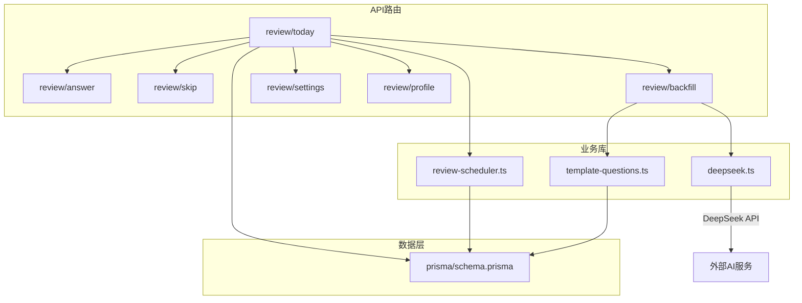
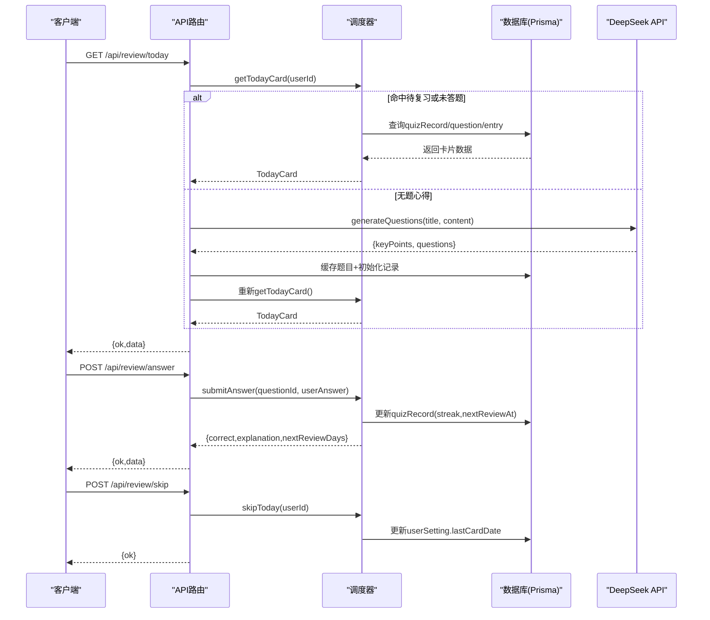
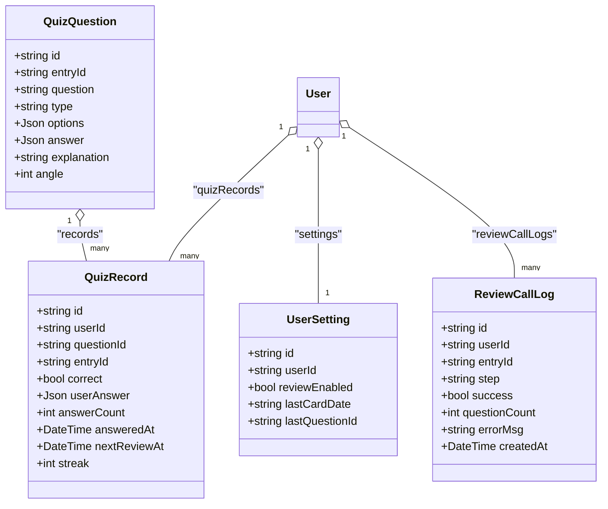

# 复习系统API

<cite>
**本文引用的文件**   
- [app/api/review/today/route.ts](file://app/api/review/today/route.ts)
- [app/api/review/answer/route.ts](file://app/api/review/answer/route.ts)
- [app/api/review/skip/route.ts](file://app/api/review/skip/route.ts)
- [app/api/review/backfill/route.ts](file://app/api/review/backfill/route.ts)
- [app/api/review/settings/route.ts](file://app/api/review/settings/route.ts)
- [app/api/review/profile/route.ts](file://app/api/review/profile/route.ts)
- [lib/review-scheduler.ts](file://lib/review-scheduler.ts)
- [lib/deepseek.ts](file://lib/deepseek.ts)
- [lib/template-questions.ts](file://lib/template-questions.ts)
- [prisma/schema.prisma](file://prisma/schema.prisma)
- [lib/auth.ts](file://lib/auth.ts)
</cite>

## 目录
1. [简介](#简介)
2. [项目结构](#项目结构)
3. [核心组件](#核心组件)
4. [架构总览](#架构总览)
5. [详细接口说明](#详细接口说明)
6. [依赖关系分析](#依赖关系分析)
7. [性能与可靠性](#性能与可靠性)
8. [故障排查指南](#故障排查指南)
9. [结论](#结论)

## 简介
本文件为心芽项目的AI复习系统提供完整的API接口文档，覆盖以下能力：
- 复习题目的获取、答题提交、跳过题目、题目填充（补生成）
- 间隔重复算法的实现原理与题目调度策略
- 复习进度追踪与学习档案管理
- AI题目生成的配置选项与质量控制机制
- 复习设置管理与用户偏好配置
- 复习数据统计与分析相关接口
- 错误处理与重试机制

## 项目结构
复习系统采用Next.js API Routes组织后端接口，核心逻辑集中在lib层，数据模型由Prisma管理。

图表来源
- [app/api/review/today/route.ts:1-123](file://app/api/review/today/route.ts#L1-L123)
- [app/api/review/answer/route.ts:1-30](file://app/api/review/answer/route.ts#L1-L30)
- [app/api/review/skip/route.ts:1-20](file://app/api/review/skip/route.ts#L1-L20)
- [app/api/review/backfill/route.ts:1-114](file://app/api/review/backfill/route.ts#L1-L114)
- [app/api/review/settings/route.ts:1-62](file://app/api/review/settings/route.ts#L1-L62)
- [app/api/review/profile/route.ts:1-179](file://app/api/review/profile/route.ts#L1-L179)
- [lib/review-scheduler.ts:1-225](file://lib/review-scheduler.ts#L1-L225)
- [lib/deepseek.ts:1-115](file://lib/deepseek.ts#L1-L115)
- [lib/template-questions.ts:1-66](file://lib/template-questions.ts#L1-L66)
- [prisma/schema.prisma:1-209](file://prisma/schema.prisma#L1-L209)

章节来源
- [app/api/review/today/route.ts:1-123](file://app/api/review/today/route.ts#L1-L123)
- [lib/review-scheduler.ts:1-225](file://lib/review-scheduler.ts#L1-L225)
- [prisma/schema.prisma:1-209](file://prisma/schema.prisma#L1-L209)

## 核心组件
- 调度器（review-scheduler.ts）
  - 今日卡片选择：优先待复习题 > 未答题记录 > 无题心得触发在线出题 > 最久未复习题
  - 答案提交：判定正确性、更新连续答对次数、计算下次复习时间
  - 跳过今日：标记lastCardDate避免当日再次弹出
- AI题目生成（deepseek.ts）
  - 调用DeepSeek生成结构化题目JSON，包含题干、题型、选项、答案、解析与要点总结
  - 内置超时控制与最多一次重试
- 模板降级（template-questions.ts）
  - DeepSeek失败时自动生成基础题目与要点摘要
- 认证鉴权（auth.ts）
  - 从Cookie中解析JWT并返回当前用户ID

章节来源
- [lib/review-scheduler.ts:44-225](file://lib/review-scheduler.ts#L44-L225)
- [lib/deepseek.ts:17-115](file://lib/deepseek.ts#L17-L115)
- [lib/template-questions.ts:12-66](file://lib/template-questions.ts#L12-L66)
- [lib/auth.ts:33-43](file://lib/auth.ts#L33-L43)

## 架构总览
复习系统的数据流与交互如下：

图表来源
- [app/api/review/today/route.ts:43-122](file://app/api/review/today/route.ts#L43-L122)
- [app/api/review/answer/route.ts:5-29](file://app/api/review/answer/route.ts#L5-L29)
- [app/api/review/skip/route.ts:5-19](file://app/api/review/skip/route.ts#L5-L19)
- [lib/review-scheduler.ts:44-225](file://lib/review-scheduler.ts#L44-L225)
- [lib/deepseek.ts:17-115](file://lib/deepseek.ts#L17-L115)

## 详细接口说明

### 通用约定
- 鉴权：所有接口通过Cookie中的JWT识别用户，未登录返回401
- 响应格式：统一使用{ ok?: boolean; data?; error? }结构
- 状态码：成功200；参数错误400；未登录401；资源不存在404；服务器错误500

章节来源
- [lib/auth.ts:33-43](file://lib/auth.ts#L33-L43)

### 获取今日复习卡片
- 方法路径：GET /api/review/today
- 鉴权：需要
- 请求体：无
- 响应字段：
  - data.entryId：心得ID
  - data.entryTitle：心得标题
  - data.conceptName：概念名（同标题）
  - data.keyPoints：要点总结（AI或模板生成）
  - data.questionId：题目ID（若无题则为空串）
  - data.question：题干
  - data.type：题型 single/multiple/truefalse
  - data.options：选项数组
  - data.answer：正确答案索引数组
  - data.explanation：解析
- 行为说明：
  - 若用户关闭复习开关或今日已弹过卡片，返回data为null
  - 若存在待复习或未答题目，直接返回
  - 若无题心得，先尝试在线生成题目，失败则降级到模板题目，随后重新取卡
  - 成功后更新userSetting.lastCardDate与lastQuestionId
- 错误码：
  - 401：未登录
  - 500：获取卡片失败

章节来源
- [app/api/review/today/route.ts:43-122](file://app/api/review/today/route.ts#L43-L122)
- [lib/review-scheduler.ts:44-144](file://lib/review-scheduler.ts#L44-L144)
- [lib/deepseek.ts:17-115](file://lib/deepseek.ts#L17-L115)
- [lib/template-questions.ts:35-66](file://lib/template-questions.ts#L35-L66)

### 提交答案
- 方法路径：POST /api/review/answer
- 鉴权：需要
- 请求体：
  - questionId：题目ID
  - answer：用户答案索引数组
- 响应字段：
  - data.correct：是否正确
  - data.explanation：解析
  - data.nextReviewDays：下次复习间隔天数
- 间隔重复算法：
  - 正确：streak+1，nextReviewDays=2^streak（指数退避）
  - 错误：streak重置为0，nextReviewDays=1
- 错误码：
  - 400：参数不完整
  - 404：题目不存在
  - 500：提交答案失败

章节来源
- [app/api/review/answer/route.ts:5-29](file://app/api/review/answer/route.ts#L5-L29)
- [lib/review-scheduler.ts:164-215](file://lib/review-scheduler.ts#L164-L215)

### 跳过今日
- 方法路径：POST /api/review/skip
- 鉴权：需要
- 请求体：无
- 响应：{ ok: true }
- 行为：将userSetting.lastCardDate设为今天，避免当日再次弹出卡片
- 错误码：
  - 500：跳过失败

章节来源
- [app/api/review/skip/route.ts:5-19](file://app/api/review/skip/route.ts#L5-L19)
- [lib/review-scheduler.ts:217-225](file://lib/review-scheduler.ts#L217-L225)

### 题目填充（批量补生成）
- 方法路径：POST /api/review/backfill
- 鉴权：需要
- 请求体：无
- 响应字段：
  - total：未发现题目的心得总数
  - success：成功数量
  - failed：失败数量
  - results：每项结果包含entryId、title、status、questionCount
- 行为说明：
  - 遍历用户所有“尚无题目”的心得
  - 优先调用DeepSeek生成，失败则降级模板
  - 将题目与初始复习记录写入数据库，并记录调用日志
- 错误码：
  - 401：未登录
  - 500：补生成失败

章节来源
- [app/api/review/backfill/route.ts:8-113](file://app/api/review/backfill/route.ts#L8-L113)
- [lib/deepseek.ts:17-115](file://lib/deepseek.ts#L17-L115)
- [lib/template-questions.ts:35-66](file://lib/template-questions.ts#L35-L66)

### 复习设置
- 方法路径：
  - GET /api/review/settings
  - PATCH /api/review/settings
- 鉴权：需要
- GET响应字段：
  - data.reviewEnabled：是否开启复习
  - data.entryCount：累计心得数
- PATCH请求体：
  - reviewEnabled：布尔值
- PATCH校验：
  - 开启复习需累计心得≥20条，否则返回400
  - 从关闭变为开启时，会重置lastCardDate以立即生效
- 错误码：
  - 400：条件不满足
  - 500：更新设置失败

章节来源
- [app/api/review/settings/route.ts:5-61](file://app/api/review/settings/route.ts#L5-L61)

### 学习画像（档案）
- 方法路径：GET /api/review/profile
- 鉴权：需要
- 响应字段：
  - data.daysStudied：学习天数（按去重日期）
  - data.totalQuestions：总答题次数
  - data.accuracy：总体正确率（百分比）
  - data.recentDays：近5日每日答题统计
  - data.weakAreas：薄弱领域（准确率<60%的标签，最多5个）
  - data.strongAreas：掌握良好领域（准确率>80%的标签，最多5个）
- 行为说明：
  - 基于已答题记录聚合统计
  - 调用DeepSeek进行标签维度分析，失败则回退本地规则
- 错误码：
  - 500：获取学习画像失败

章节来源
- [app/api/review/profile/route.ts:79-178](file://app/api/review/profile/route.ts#L79-L178)
- [lib/review-scheduler.ts:5-29](file://lib/review-scheduler.ts#L5-L29)

## 依赖关系分析

图表来源
- [prisma/schema.prisma:150-209](file://prisma/schema.prisma#L150-L209)

章节来源
- [prisma/schema.prisma:150-209](file://prisma/schema.prisma#L150-L209)

## 性能与可靠性

- 间隔重复算法
  - 正确回答：连续答对次数streak递增，下次复习间隔按2^streak天增长
  - 错误回答：streak归零，次日即复习
  - 优先级：待复习题优先于未答题记录；无题心得触发在线生成后重新取卡
- 并发与超时
  - DeepSeek调用设置30秒超时，最多重试1次
  - 学习画像分析调用设置15秒超时，失败回退本地规则
- 数据一致性
  - 生成题目后同步创建初始复习记录，确保可被调度器发现
  - 调用日志保留最近30条，便于问题回溯
- 建议优化
  - 对高频读操作增加缓存（如Redis）以降低数据库压力
  - 批量补生成可增加限流与分页，避免长时间占用
  - 对DeepSeek响应做更严格的Schema校验与容错

章节来源
- [lib/review-scheduler.ts:164-215](file://lib/review-scheduler.ts#L164-L215)
- [lib/deepseek.ts:54-115](file://lib/deepseek.ts#L54-L115)
- [app/api/review/profile/route.ts:15-77](file://app/api/review/profile/route.ts#L15-L77)
- [lib/review-scheduler.ts:5-29](file://lib/review-scheduler.ts#L5-L29)

## 故障排查指南

- 常见错误与定位
  - 401未登录：检查Cookie中xinya_token是否存在且有效
  - 400参数不完整：确认提交答案的请求体包含questionId与answer
  - 404题目不存在：确认questionId属于当前用户且存在
  - 500服务器错误：查看服务端日志中的[Review*]前缀信息
- 关键日志点
  - 获取卡片：[ReviewToday]
  - 提交答案：[ReviewAnswer]
  - 跳过今日：[ReviewSkip]
  - 补生成：[Backfill]
  - 学习画像：[ReviewProfile]
  - 调度器：[Scheduler]
- 重试与降级
  - DeepSeek在线生成失败自动降级模板题目
  - 学习画像分析失败回退本地阈值规则
- 数据验证
  - 开启复习需累计心得≥20条，否则PATCH返回400

章节来源
- [app/api/review/today/route.ts:118-122](file://app/api/review/today/route.ts#L118-L122)
- [app/api/review/answer/route.ts:25-29](file://app/api/review/answer/route.ts#L25-L29)
- [app/api/review/skip/route.ts:15-19](file://app/api/review/skip/route.ts#L15-L19)
- [app/api/review/backfill/route.ts:109-113](file://app/api/review/backfill/route.ts#L109-L113)
- [app/api/review/settings/route.ts:38-40](file://app/api/review/settings/route.ts#L38-L40)
- [lib/deepseek.ts:76-115](file://lib/deepseek.ts#L76-L115)
- [app/api/review/profile/route.ts:70-77](file://app/api/review/profile/route.ts#L70-L77)

## 结论
复习系统通过清晰的API分层与稳健的调度策略，实现了“在线生成+模板降级”的题目供给链路，结合指数退避的间隔重复算法，为用户提供高效、个性化的复习体验。同时，完善的日志与错误处理保障了系统的可观测性与稳定性。后续可在缓存、限流与数据校验方面持续优化，进一步提升性能与鲁棒性。