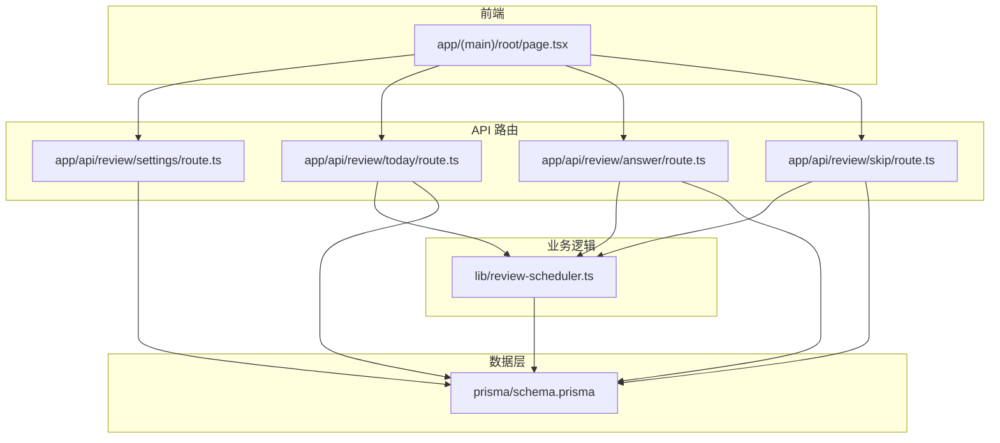
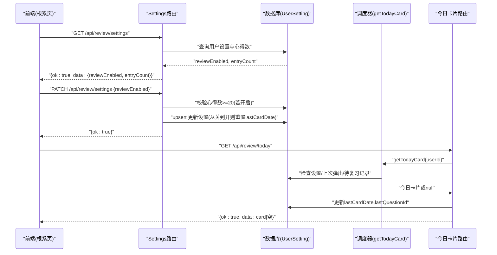
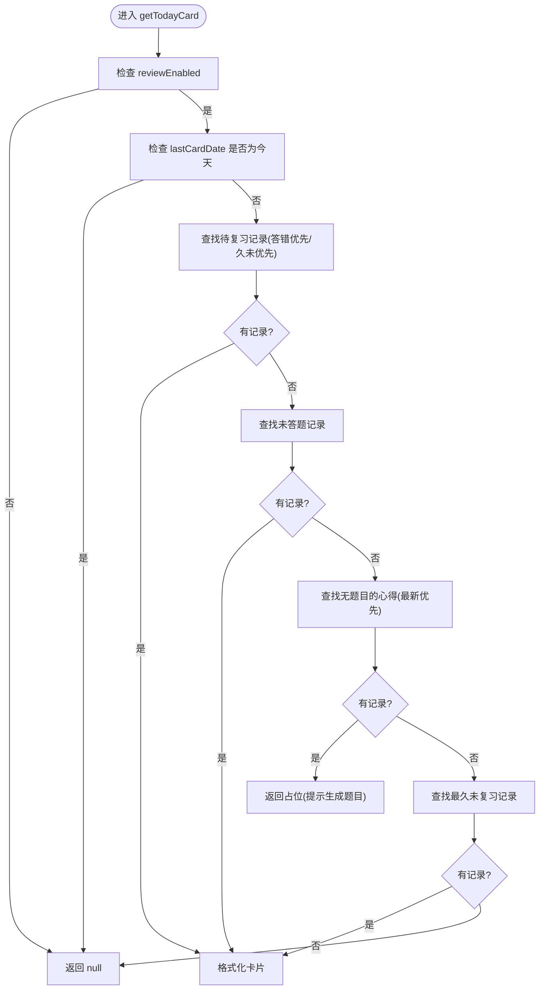
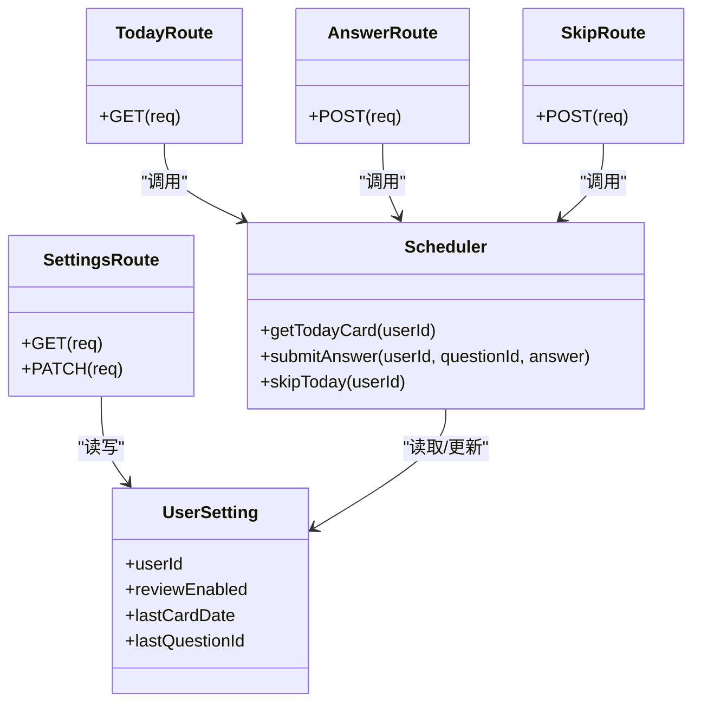

# 复习设置接口

<cite>
**本文引用的文件**
- [app/api/review/settings/route.ts](file://app/api/review/settings/route.ts)
- [prisma/schema.prisma](file://prisma/schema.prisma)
- [lib/review-scheduler.ts](file://lib/review-scheduler.ts)
- [app/api/review/today/route.ts](file://app/api/review/today/route.ts)
- [app/api/review/answer/route.ts](file://app/api/review/answer/route.ts)
- [app/api/review/skip/route.ts](file://app/api/review/skip/route.ts)
- [app/(main)/root/page.tsx](file://app/(main)/root/page.tsx)
- [doc/新芽dev-framework.md](file://doc/新芽dev-framework.md)
</cite>

## 目录
1. [简介](#简介)
2. [项目结构](#项目结构)
3. [核心组件](#核心组件)
4. [架构总览](#架构总览)
5. [详细组件分析](#详细组件分析)
6. [依赖关系分析](#依赖关系分析)
7. [性能与扩展性](#性能与扩展性)
8. [故障排查指南](#故障排查指南)
9. [结论](#结论)
10. [附录：数据模型与字段说明](#附录数据模型与字段说明)

## 简介
本文件为心芽项目的“复习设置”相关 API 文档，聚焦用户复习偏好配置的读取与更新能力。当前实现提供以下能力：
- 获取用户的复习开关状态与累计心得数量
- 开启或关闭复习功能（拾遗）
- 从关闭到开启时的策略：重置卡片日期标记，确保首次弹出正常触发
- 与“今日卡片”、“答题”、“跳过”等流程的联动机制

注意：当前版本未暴露每日题目数量、难度级别、复习间隔等细粒度参数；这些参数在调度算法中采用固定策略，后续可按需扩展。

## 项目结构
与复习设置相关的后端路由位于 Next.js App Router 下，数据模型定义于 Prisma Schema，调度逻辑集中在库文件中，前端在根系页提供入口并调用相应接口。

图表来源
- [app/(main)/root/page.tsx](file://app/(main)/root/page.tsx)
- [app/api/review/settings/route.ts](file://app/api/review/settings/route.ts)
- [app/api/review/today/route.ts](file://app/api/review/today/route.ts)
- [app/api/review/answer/route.ts](file://app/api/review/answer/route.ts)
- [app/api/review/skip/route.ts](file://app/api/review/skip/route.ts)
- [lib/review-scheduler.ts](file://lib/review-scheduler.ts)
- [prisma/schema.prisma](file://prisma/schema.prisma)

章节来源
- [app/api/review/settings/route.ts:1-62](file://app/api/review/settings/route.ts#L1-L62)
- [prisma/schema.prisma:186-194](file://prisma/schema.prisma#L186-L194)
- [lib/review-scheduler.ts:44-144](file://lib/review-scheduler.ts#L44-L144)
- [app/(main)/root/page.tsx:268-283](file://app/(main)/root/page.tsx#L268-L283)

## 核心组件
- 复习设置接口
  - GET /api/review/settings：返回 reviewEnabled 与 entryCount
  - PATCH /api/review/settings：根据请求体中的 reviewEnabled 进行开启/关闭，包含前置校验与状态变更副作用
- 调度器
  - getTodayCard：依据用户设置、上次弹出日期、待复习记录等计算今日卡片
  - submitAnswer：提交答案，按连续答对次数指数递增下次复习间隔
  - skipToday：标记今天已跳过，避免重复弹出
- 数据模型
  - UserSetting：存储用户复习开关、上次弹出日期、上次题目ID等

章节来源
- [app/api/review/settings/route.ts:5-26](file://app/api/review/settings/route.ts#L5-L26)
- [app/api/review/settings/route.ts:28-61](file://app/api/review/settings/route.ts#L28-L61)
- [lib/review-scheduler.ts:44-144](file://lib/review-scheduler.ts#L44-L144)
- [lib/review-scheduler.ts:164-225](file://lib/review-scheduler.ts#L164-L225)
- [prisma/schema.prisma:186-194](file://prisma/schema.prisma#L186-L194)

## 架构总览
复习设置作为控制面，影响调度器的行为。当用户开启复习后，getTodayCard 会参与选择今日卡片；答题与跳过操作会更新调度状态，进而影响后续复习计划。

图表来源
- [app/api/review/settings/route.ts:5-61](file://app/api/review/settings/route.ts#L5-L61)
- [app/api/review/today/route.ts:43-122](file://app/api/review/today/route.ts#L43-L122)
- [lib/review-scheduler.ts:44-144](file://lib/review-scheduler.ts#L44-L144)
- [prisma/schema.prisma:186-194](file://prisma/schema.prisma#L186-L194)

## 详细组件分析

### 复习设置接口规范
- 获取设置
  - 方法：GET
  - 路径：/api/review/settings
  - 鉴权：需要登录态
  - 响应体字段：
    - ok: boolean
    - data.reviewEnabled: boolean（默认 false）
    - data.entryCount: number（用户累计心得数）
  - 错误码：
    - 401：未登录
    - 500：服务器异常
- 更新设置
  - 方法：PATCH
  - 路径：/api/review/settings
  - 请求体：{ reviewEnabled: boolean }
  - 规则：
    - 若开启且累计心得不足 20 条，返回 400 错误
    - 若从关闭变为开启，将 lastCardDate 置空，以便次日重新弹出
  - 响应体：
    - ok: boolean
  - 错误码：
    - 401：未登录
    - 400：不满足开启条件
    - 500：服务器异常

章节来源
- [app/api/review/settings/route.ts:5-26](file://app/api/review/settings/route.ts#L5-L26)
- [app/api/review/settings/route.ts:28-61](file://app/api/review/settings/route.ts#L28-L61)

### 可配置项与默认值管理
- 当前暴露的可配置项
  - reviewEnabled：是否开启复习（拾遗）
- 默认值
  - reviewEnabled 默认 false
  - lastCardDate 初始为空，用于控制“每天仅弹一次”
- 验证规则
  - 开启前校验：累计心得数 >= 20
- 默认值与校验位置
  - 默认值来源于数据库模型默认值
  - 校验逻辑在服务端执行，防止绕过前端限制

章节来源
- [prisma/schema.prisma:186-194](file://prisma/schema.prisma#L186-L194)
- [app/api/review/settings/route.ts:35-40](file://app/api/review/settings/route.ts#L35-L40)

### 设置变更对复习计划的影响与同步机制
- 从关闭到开启
  - 服务端会将 lastCardDate 置空，确保次日能再次弹出卡片
- 日常使用
  - 今日卡片接口会在成功返回卡片后写入 lastCardDate 与 lastQuestionId，保证当天不再重复弹出
  - 跳过接口也会写入 lastCardDate，达到“今天不再弹出”的效果
- 调度策略（当前固定）
  - 优先选择待复习题（nextReviewAt <= now），按“答错优先、久未复习优先”排序
  - 若无待复习题，优先展示已有题目但未作答的记录
  - 若仍无，则选择尚未出题的心得，在线生成题目或回退模板题目
  - 答题后按连续答对次数指数增长下次复习间隔（1→2→4→8…），答错重置为 1 天

图表来源
- [lib/review-scheduler.ts:44-144](file://lib/review-scheduler.ts#L44-L144)

章节来源
- [lib/review-scheduler.ts:44-144](file://lib/review-scheduler.ts#L44-L144)
- [app/api/review/today/route.ts:109-116](file://app/api/review/today/route.ts#L109-L116)
- [lib/review-scheduler.ts:217-225](file://lib/review-scheduler.ts#L217-L225)

### 设置导入导出与批量配置管理
- 现状
  - 当前未提供复习设置的导入/导出接口
  - 现有导出接口针对“心得内容”，不包含复习设置
- 建议方案（供后续扩展）
  - 新增导出：/api/review/settings/export，返回当前用户的复习设置快照
  - 新增导入：/api/review/settings/import，支持批量覆盖多个用户的设置（管理员场景）
  - 增加版本号字段以支持迁移与兼容处理

章节来源
- [app/api/export/route.ts:1-29](file://app/api/export/route.ts#L1-L29)

### 设置版本兼容性与迁移策略
- 现状
  - 当前未引入设置版本字段与迁移逻辑
- 建议策略（供后续扩展）
  - 在 UserSetting 中增加 version 字段，标识设置结构版本
  - 服务启动时执行迁移脚本，将旧版本设置升级到最新版本
  - 导入/导出携带 version，便于跨环境迁移与回滚

章节来源
- [prisma/schema.prisma:186-194](file://prisma/schema.prisma#L186-L194)

## 依赖关系分析
- 路由层依赖认证与数据库客户端
- 调度器依赖数据库与模板/生成工具
- 前端通过根页面发起设置与复习相关请求

图表来源
- [app/api/review/settings/route.ts:1-62](file://app/api/review/settings/route.ts#L1-L62)
- [app/api/review/today/route.ts:1-123](file://app/api/review/today/route.ts#L1-L123)
- [app/api/review/answer/route.ts:1-30](file://app/api/review/answer/route.ts#L1-L30)
- [app/api/review/skip/route.ts:1-20](file://app/api/review/skip/route.ts#L1-L20)
- [lib/review-scheduler.ts:1-225](file://lib/review-scheduler.ts#L1-L225)
- [prisma/schema.prisma:186-194](file://prisma/schema.prisma#L186-L194)

章节来源
- [app/api/review/settings/route.ts:1-62](file://app/api/review/settings/route.ts#L1-L62)
- [lib/review-scheduler.ts:1-225](file://lib/review-scheduler.ts#L1-L225)
- [prisma/schema.prisma:186-194](file://prisma/schema.prisma#L186-L194)

## 性能与扩展性
- 性能要点
  - 设置接口仅涉及少量读/写，延迟低
  - 今日卡片接口可能触发 AI 生成或模板生成，存在网络与计算开销，已内置降级策略
- 可扩展点
  - 在 UserSetting 中增加更多偏好字段（如每日题目数量、难度级别、复习间隔等）
  - 在调度器中引入基于偏好的动态间隔策略
  - 增加设置版本与迁移机制，保障向后兼容

[本节为通用指导，无需具体文件引用]

## 故障排查指南
- 常见错误
  - 401 未登录：确认请求携带有效会话
  - 400 心得不足：累计心得少于 20 条无法开启复习
  - 500 服务器异常：查看服务端日志定位具体原因
- 定位步骤
  - 检查设置接口返回的 reviewEnabled 与 entryCount
  - 观察今日卡片接口是否因 lastCardDate 导致当天不再弹出
  - 核对答题后 nextReviewAt 是否符合预期（连续答对应指数增长）

章节来源
- [app/api/review/settings/route.ts:22-25](file://app/api/review/settings/route.ts#L22-L25)
- [app/api/review/settings/route.ts:38-40](file://app/api/review/settings/route.ts#L38-L40)
- [app/api/review/today/route.ts:118-121](file://app/api/review/today/route.ts#L118-L121)
- [lib/review-scheduler.ts:186-196](file://lib/review-scheduler.ts#L186-L196)

## 结论
当前复习设置接口提供了最小可用的控制面：开启/关闭复习、获取状态与心得数量，并通过 lastCardDate 控制每日弹出频率。调度策略采用固定规则，具备良好稳定性。后续可在保持兼容的前提下，逐步引入更丰富的偏好配置与版本迁移机制。

[本节为总结，无需具体文件引用]

## 附录：数据模型与字段说明
- UserSetting
  - userId：用户唯一标识
  - reviewEnabled：是否开启复习（默认 false）
  - lastCardDate：上次弹出日期（字符串，用于“每天一次”控制）
  - lastQuestionId：上次题目ID（用于追踪最近一次题目）

章节来源
- [prisma/schema.prisma:186-194](file://prisma/schema.prisma#L186-L194)