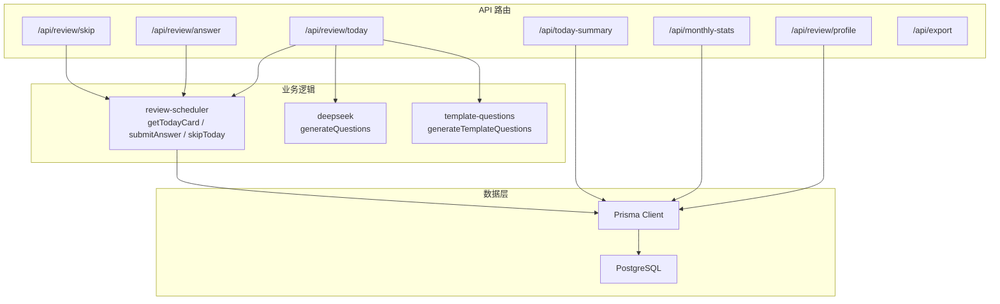
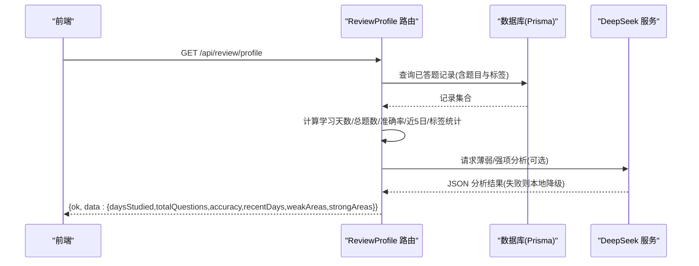
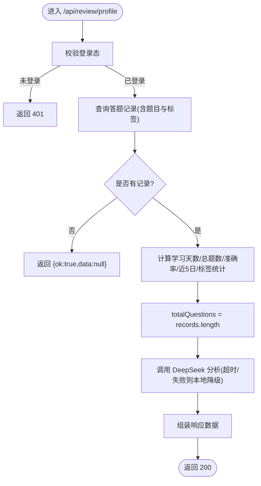
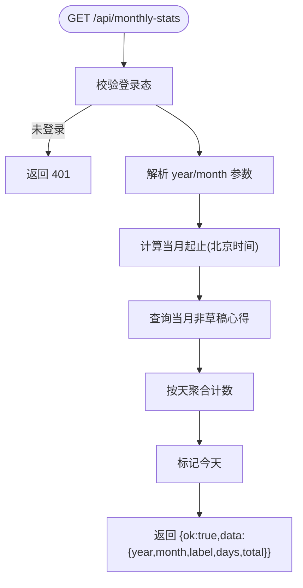
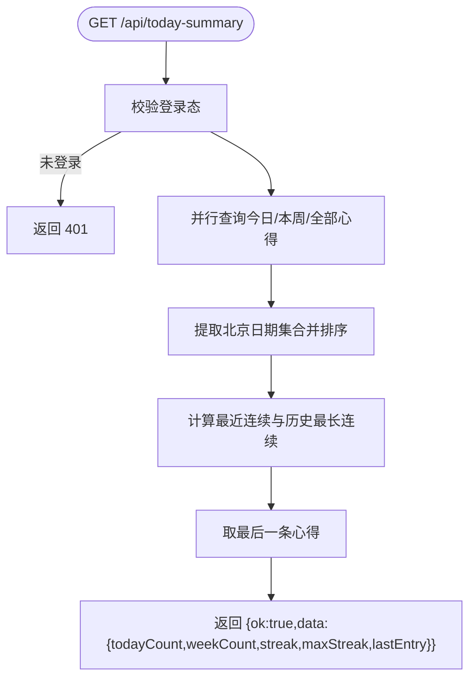
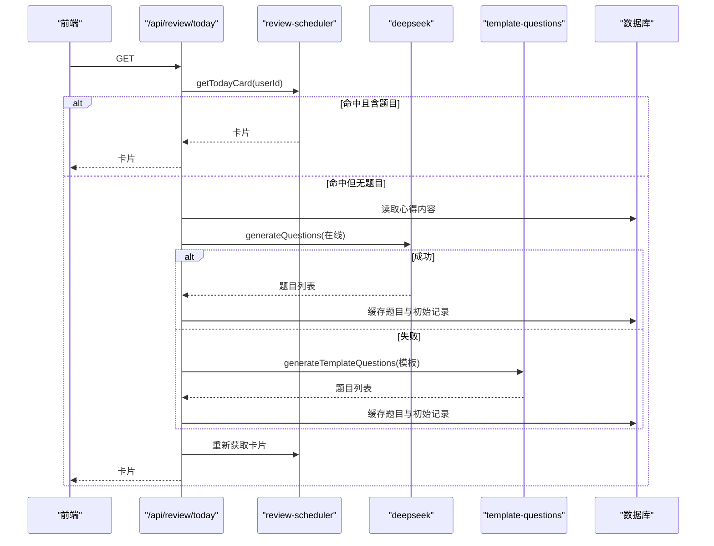
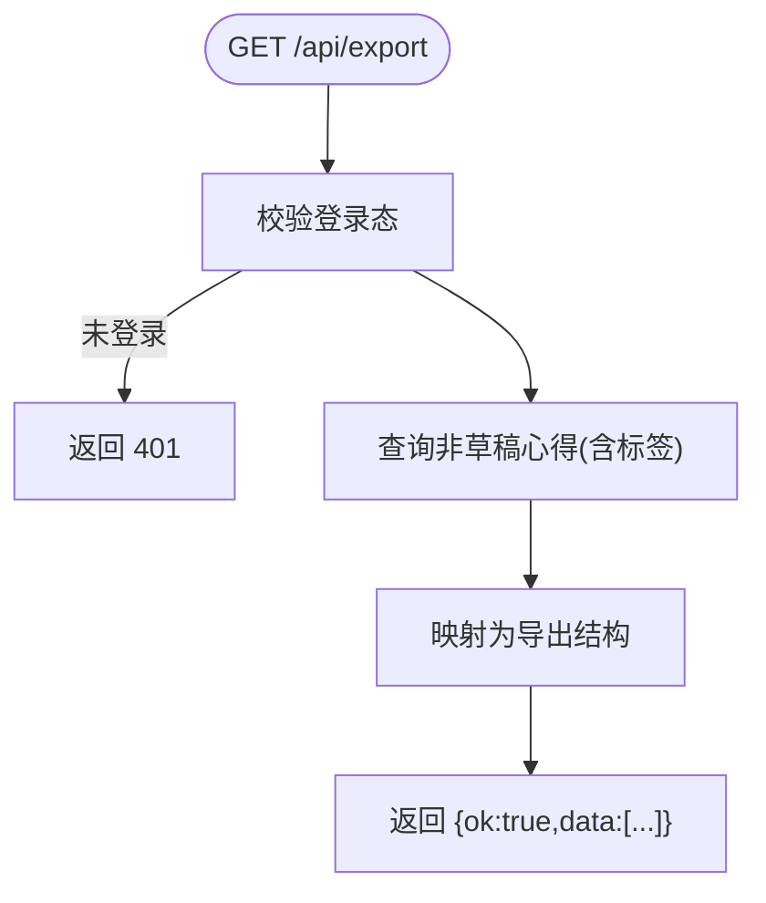
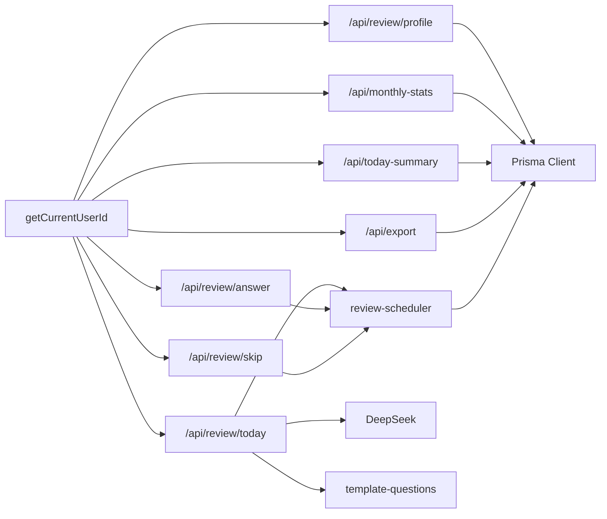

# 学习档案接口

<cite>
**本文引用的文件**
- [app/api/review/profile/route.ts](file://app/api/review/profile/route.ts)
- [app/api/monthly-stats/route.ts](file://app/api/monthly-stats/route.ts)
- [app/api/today-summary/route.ts](file://app/api/today-summary/route.ts)
- [app/api/export/route.ts](file://app/api/export/route.ts)
- [app/api/review/today/route.ts](file://app/api/review/today/route.ts)
- [app/api/review/answer/route.ts](file://app/api/review/answer/route.ts)
- [app/api/review/skip/route.ts](file://app/api/review/skip/route.ts)
- [prisma/schema.prisma](file://prisma/schema.prisma)
</cite>

## 更新摘要
**变更内容**   
- 修正了准确率指标中的总题数计算方式，从累加单个答案计数改为使用 records.length
- 更新了学习画像接口的数据处理逻辑说明
- 保持了整体文档结构和一致性

## 目录
1. [简介](#简介)
2. [项目结构](#项目结构)
3. [核心组件](#核心组件)
4. [架构总览](#架构总览)
5. [详细组件分析](#详细组件分析)
6. [依赖分析](#依赖分析)
7. [性能考虑](#性能考虑)
8. [故障排查指南](#故障排查指南)
9. [结论](#结论)
10. [附录：数据模型与字段说明](#附录数据模型与字段说明)

## 简介
本文件为心芽项目的"学习档案"相关接口的完整文档，覆盖以下能力：
- 用户学习数据的获取与管理：学习统计、进度追踪、能力分析
- 学习档案数据结构：答题历史、正确率统计、学习时长等关键指标
- 学习成就系统与等级评定机制（基于连续打卡与累计学习行为）
- 数据可视化接口与图表数据格式
- 学习报告生成与数据导出功能

## 项目结构
学习档案相关的后端路由集中在 Next.js App Router 的 API 目录下，主要涉及：
- 学习画像与分析：/api/review/profile
- 月度统计：/api/monthly-stats
- 今日概览与连续天数：/api/today-summary
- 复习卡片与答题流程：/api/review/today、/api/review/answer、/api/review/skip
- 数据导出：/api/export



图示来源
- [app/api/review/profile/route.ts:1-179](file://app/api/review/profile/route.ts#L1-L179)
- [app/api/monthly-stats/route.ts:1-96](file://app/api/monthly-stats/route.ts#L1-L96)
- [app/api/today-summary/route.ts:1-118](file://app/api/today-summary/route.ts#L1-L118)
- [app/api/review/today/route.ts:1-123](file://app/api/review/today/route.ts#L1-L123)
- [app/api/review/answer/route.ts:1-30](file://app/api/review/answer/route.ts#L1-L30)
- [app/api/review/skip/route.ts:1-20](file://app/api/review/skip/route.ts#L1-L20)
- [app/api/export/route.ts:1-29](file://app/api/export/route.ts#L1-L29)

章节来源
- [app/api/review/profile/route.ts:1-179](file://app/api/review/profile/route.ts#L1-L179)
- [app/api/monthly-stats/route.ts:1-96](file://app/api/monthly-stats/route.ts#L1-L96)
- [app/api/today-summary/route.ts:1-118](file://app/api/today-summary/route.ts#L1-L118)
- [app/api/review/today/route.ts:1-123](file://app/api/review/today/route.ts#L1-L123)
- [app/api/review/answer/route.ts:1-30](file://app/api/review/answer/route.ts#L1-L30)
- [app/api/review/skip/route.ts:1-20](file://app/api/review/skip/route.ts#L1-L20)
- [app/api/export/route.ts:1-29](file://app/api/export/route.ts#L1-L29)

## 核心组件
- 学习画像与分析（/api/review/profile）
  - 聚合答题记录，计算学习天数、总题数、准确率
  - 按标签分组统计薄弱/掌握良好领域，支持在线分析与本地降级
- 月度统计（/api/monthly-stats）
  - 按北京时间统计当月每日心得数量，用于日历热力图
- 今日概览（/api/today-summary）
  - 返回今日/本周计数、最近连续天数、最长连续天数、最后一条心得
- 复习卡片与答题（/api/review/today、/api/review/answer、/api/review/skip）
  - 获取当日复习卡片；若无题目则触发AI或模板出题并缓存
  - 提交答案更新答题记录与下次复习时间
  - 跳过当日复习
- 数据导出（/api/export）
  - 导出非草稿心得及标签信息，供前端生成 Markdown 下载

章节来源
- [app/api/review/profile/route.ts:1-179](file://app/api/review/profile/route.ts#L1-L179)
- [app/api/monthly-stats/route.ts:1-96](file://app/api/monthly-stats/route.ts#L1-L96)
- [app/api/today-summary/route.ts:1-118](file://app/api/today-summary/route.ts#L1-L118)
- [app/api/review/today/route.ts:1-123](file://app/api/review/today/route.ts#L1-L123)
- [app/api/review/answer/route.ts:1-30](file://app/api/review/answer/route.ts#L1-L30)
- [app/api/review/skip/route.ts:1-20](file://app/api/review/skip/route.ts#L1-L20)
- [app/api/export/route.ts:1-29](file://app/api/export/route.ts#L1-L29)

## 架构总览
学习档案接口采用分层设计：
- 表现层：Next.js Route Handler 暴露 RESTful 接口
- 业务层：复习调度器、AI 出题、模板出题、统计计算
- 数据层：Prisma ORM 访问 PostgreSQL



图示来源
- [app/api/review/profile/route.ts:1-179](file://app/api/review/profile/route.ts#L1-L179)

## 详细组件分析

### 学习画像与分析接口
- 端点
  - GET /api/review/profile
- 鉴权
  - 需要登录态，未登录返回 401
- 响应体
  - ok: boolean
  - data: null | {
      daysStudied: number,
      totalQuestions: number,
      accuracy: number,
      recentDays: { date: string; correct: number; total: number }[],
      weakAreas: { tag: string; accuracy: number; count: number }[],
      strongAreas: { tag: string; accuracy: number; count: number }[]
    }
- 处理逻辑
  - 聚合所有 answeredAt 不为空的答题记录
  - 计算学习天数（去重日期）、总题数、整体准确率
  - **更新** 总题数计算方式：使用 records.length 确保统计一致性，而非累加单个答案计数
  - 统计近5日每日答题情况（按北京时间）
  - 按标签分组统计正确/总数/准确率
  - 调用 DeepSeek 进行薄弱/强项分析，失败时回退到本地阈值规则（薄弱<60%，强项≥80%）
- 错误码
  - 401 未登录
  - 500 服务端异常



图示来源
- [app/api/review/profile/route.ts:1-179](file://app/api/review/profile/route.ts#L1-L179)

章节来源
- [app/api/review/profile/route.ts:1-179](file://app/api/review/profile/route.ts#L1-L179)

### 月度统计接口
- 端点
  - GET /api/monthly-stats?year=&month=
- 鉴权
  - 需要登录态，未登录返回 401
- 参数
  - year: 数字，默认当前年
  - month: 数字，默认当前月
- 响应体
  - ok: boolean
  - data: {
      year: number,
      month: number,
      label: string,
      days: { day: number; count: number; isToday: boolean }[],
      total: number
    }
- 处理逻辑
  - 使用北京时间计算当月起止边界
  - 查询当月非草稿心得，按天聚合计数
  - 标记今天
- 错误码
  - 401 未登录



图示来源
- [app/api/monthly-stats/route.ts:1-96](file://app/api/monthly-stats/route.ts#L1-L96)

章节来源
- [app/api/monthly-stats/route.ts:1-96](file://app/api/monthly-stats/route.ts#L1-L96)

### 今日概览接口
- 端点
  - GET /api/today-summary
- 鉴权
  - 需要登录态，未登录返回 401
- 响应体
  - ok: boolean
  - data: {
      todayCount: number,
      weekCount: number,
      streak: number,
      maxStreak: number,
      lastEntry: { title: string } | null
    }
- 处理逻辑
  - 并行查询今日/本周/全部非草稿心得
  - 基于北京日期计算最近连续天数与历史最长连续天数
  - 返回最后一条心得标题
- 错误码
  - 401 未登录



图示来源
- [app/api/today-summary/route.ts:1-118](file://app/api/today-summary/route.ts#L1-L118)

章节来源
- [app/api/today-summary/route.ts:1-118](file://app/api/today-summary/route.ts#L1-L118)

### 复习卡片与答题流程
- 获取今日卡片
  - GET /api/review/today
  - 若命中缓存直接返回；若无题目则尝试在线生成，失败则回退模板生成，并将题目与初始记录写入数据库
  - 返回卡片对象（包含 entryId、questionId 等）
- 提交答案
  - POST /api/review/answer
  - 入参：{ questionId, answer }
  - 根据答案判定正误，更新答题记录与下次复习时间
- 跳过今日
  - POST /api/review/skip
  - 记录跳过操作，推进日程



图示来源
- [app/api/review/today/route.ts:1-123](file://app/api/review/today/route.ts#L1-L123)

章节来源
- [app/api/review/today/route.ts:1-123](file://app/api/review/today/route.ts#L1-L123)
- [app/api/review/answer/route.ts:1-30](file://app/api/review/answer/route.ts#L1-L30)
- [app/api/review/skip/route.ts:1-20](file://app/api/review/skip/route.ts#L1-L20)

### 数据导出接口
- 端点
  - GET /api/export
- 鉴权
  - 需要登录态，未登录返回 401
- 响应体
  - ok: boolean
  - data: Array<{
      id: string,
      title: string,
      content: string,
      tags: string[],
      mood: string?,
      recordTime: string,
      createdAt: string,
      isTop: boolean,
      isFavorite: boolean
    }>
- 用途
  - 前端可据此生成 Markdown 并触发下载



图示来源
- [app/api/export/route.ts:1-29](file://app/api/export/route.ts#L1-L29)

章节来源
- [app/api/export/route.ts:1-29](file://app/api/export/route.ts#L1-L29)

## 依赖分析
- 认证依赖
  - 各接口通过 getCurrentUserId 校验登录态
- 数据依赖
  - Prisma Client 统一访问数据库
- 外部依赖
  - DeepSeek 在线分析（学习画像）
  - 模板出题（复习卡片）



图示来源
- [app/api/review/profile/route.ts:1-179](file://app/api/review/profile/route.ts#L1-L179)
- [app/api/monthly-stats/route.ts:1-96](file://app/api/monthly-stats/route.ts#L1-L96)
- [app/api/today-summary/route.ts:1-118](file://app/api/today-summary/route.ts#L1-L118)
- [app/api/export/route.ts:1-29](file://app/api/export/route.ts#L1-L29)
- [app/api/review/today/route.ts:1-123](file://app/api/review/today/route.ts#L1-L123)
- [app/api/review/answer/route.ts:1-30](file://app/api/review/answer/route.ts#L1-L30)
- [app/api/review/skip/route.ts:1-20](file://app/api/review/skip/route.ts#L1-L20)

章节来源
- [app/api/review/profile/route.ts:1-179](file://app/api/review/profile/route.ts#L1-L179)
- [app/api/monthly-stats/route.ts:1-96](file://app/api/monthly-stats/route.ts#L1-L96)
- [app/api/today-summary/route.ts:1-118](file://app/api/today-summary/route.ts#L1-L118)
- [app/api/export/route.ts:1-29](file://app/api/export/route.ts#L1-L29)
- [app/api/review/today/route.ts:1-123](file://app/api/review/today/route.ts#L1-L123)
- [app/api/review/answer/route.ts:1-30](file://app/api/review/answer/route.ts#L1-L30)
- [app/api/review/skip/route.ts:1-20](file://app/api/review/skip/route.ts#L1-L20)

## 性能考虑
- 并发查询
  - 今日概览接口对多条件查询使用并行执行，降低端到端延迟
- 时间边界
  - 月度统计与今日概览均基于北京时间计算起止边界，避免跨日误差
- 降级策略
  - 学习画像分析在外部服务不可用时自动降级至本地规则，保障可用性
- 索引优化
  - 答题记录与心得表具备常用查询索引，提升聚合与过滤效率

[本节为通用指导，不直接分析具体文件]

## 故障排查指南
- 401 未登录
  - 检查客户端是否携带有效会话/令牌
- 学习画像为空
  - 确认存在 answeredAt 不为空的答题记录
  - 若外部分析失败，将回退本地规则，仍会返回弱/强项列表
- 月度统计为 0
  - 确认所选月份是否存在非草稿心得
  - 检查北京时间边界计算是否正确
- 复习卡片为空
  - 可能尚未生成题目，查看是否触发了在线/模板出题流程
  - 检查日志中是否出现缓存命中或生成失败的回退路径
- **新增** 准确率计算异常
  - 确认总题数计算使用 records.length 而非累加答案计数
  - 检查答题记录的数据完整性

章节来源
- [app/api/review/profile/route.ts:1-179](file://app/api/review/profile/route.ts#L1-L179)
- [app/api/monthly-stats/route.ts:1-96](file://app/api/monthly-stats/route.ts#L1-L96)
- [app/api/today-summary/route.ts:1-118](file://app/api/today-summary/route.ts#L1-L118)
- [app/api/review/today/route.ts:1-123](file://app/api/review/today/route.ts#L1-L123)

## 结论
学习档案接口围绕"画像—统计—复习—导出"形成闭环：
- 画像接口提供多维能力分析与趋势概览
- 月度与今日统计支撑可视化与成就展示
- 复习卡片与答题流程驱动持续学习与间隔重复
- 导出接口便于个人复盘与知识沉淀

[本节为总结性内容，不直接分析具体文件]

## 附录：数据模型与字段说明
- 用户与设置
  - User：用户基本信息与关联关系
  - UserSetting：复习开关、上次卡片日期与题目ID
- 心得与标签
  - Entry：心得条目，含标题、内容、要点、情绪、置顶/收藏/草稿标记、记录时间
  - Tag：标签，唯一约束于用户+名称
- 复习与答题
  - QuizQuestion：题目定义（题干、类型、选项、答案、解析、角度）
  - QuizRecord：答题记录（正误、回答次数、作答时间、下次复习时间、连续正确次数）
- 其他
  - InsightReport/AiInsight/GrowthLog/Share/MagicLink/EmailToken/ReviewCallLog：洞察、成长、分享、邮件、调用日志等

```mermaid
erDiagram
USER {
string id PK
string email UK
boolean isVerified
string theme
boolean onboardDone
int openTimes
datetime createdAt
datetime updatedAt
}
ENTRY {
string id PK
string userId FK
string title
text content
string keyPoints
string mood
datetime recordTime
boolean isTop
boolean isFavorite
boolean isDraft
datetime createdAt
datetime updatedAt
}
TAG {
string id PK
string userId FK
string name
boolean isDefault
datetime createdAt
}
QUIZ_QUESTION {
string id PK
string entryId FK
string question
string type
json options
json answer
string explanation
int angle
datetime createdAt
}
QUIZ_RECORD {
string id PK
string userId FK
string questionId FK
string entryId FK
boolean correct
json userAnswer
int answerCount
datetime answeredAt
datetime nextReviewAt
int streak
}
USER_SETTING {
string id PK
string userId FK UK
boolean reviewEnabled
string lastCardDate
string lastQuestionId
}
USER ||--o{ ENTRY : "拥有"
USER ||--o{ TAG : "拥有"
USER ||--o{ QUIZ_RECORD : "答题"
ENTRY ||--o{ QUIZ_QUESTION : "包含题目"
ENTRY ||--o{ TAG : "标签关联"
USER ||--|| USER_SETTING : "设置"
```

图示来源
- [prisma/schema.prisma:10-209](file://prisma/schema.prisma#L10-L209)

章节来源
- [prisma/schema.prisma:10-209](file://prisma/schema.prisma#L10-L209)