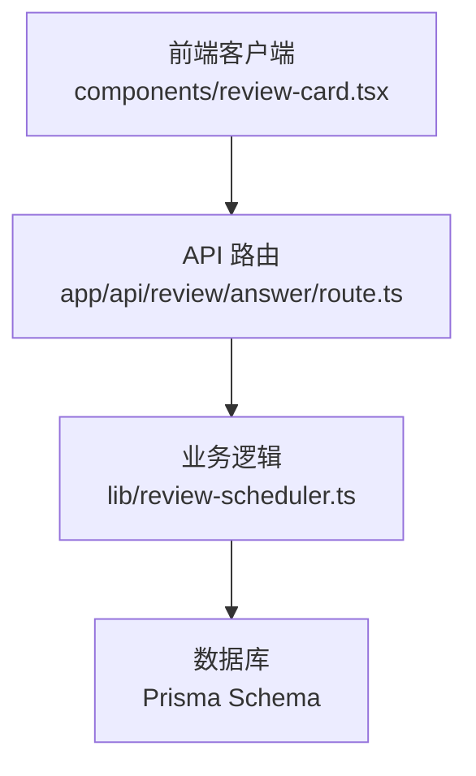
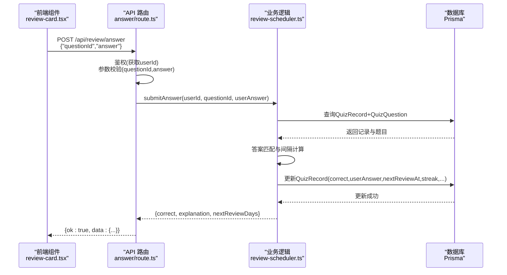
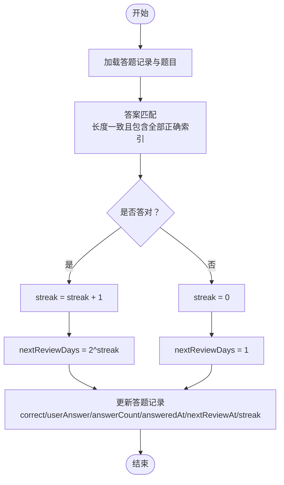
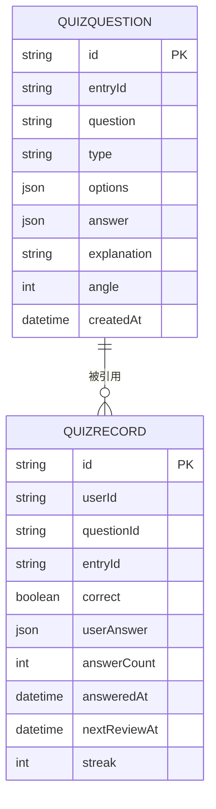
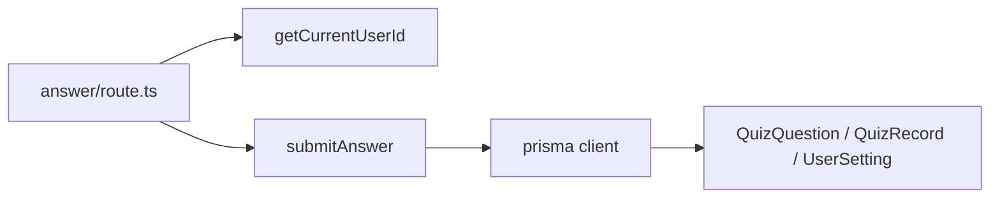

# 答题提交接口

<cite>
**本文引用的文件**
- [app/api/review/answer/route.ts](file://app/api/review/answer/route.ts)
- [lib/review-scheduler.ts](file://lib/review-scheduler.ts)
- [prisma/schema.prisma](file://prisma/schema.prisma)
- [components/review-card.tsx](file://components/review-card.tsx)
- [doc/新芽dev-framework.md](file://doc/新芽dev-framework.md)
</cite>

## 目录
1. [简介](#简介)
2. [项目结构](#项目结构)
3. [核心组件](#核心组件)
4. [架构总览](#架构总览)
5. [详细组件分析](#详细组件分析)
6. [依赖关系分析](#依赖关系分析)
7. [性能考量](#性能考量)
8. [故障排查指南](#故障排查指南)
9. [结论](#结论)
10. [附录](#附录)

## 简介
本文件为心芽项目的“答题提交接口”提供完整 API 文档，覆盖以下要点：
- 接口定义与请求参数、验证规则、响应格式
- 答题结果处理逻辑：正确答案判断、学习进度更新、间隔重复算法调整
- 不同题型的评分机制与答案匹配规则
- 答题记录的存储结构与历史追踪能力
- 完整的请求示例、响应数据结构与错误处理方案

## 项目结构
该接口位于 Next.js App Router 的 API 路由中，采用“路由层薄封装 + 业务逻辑库”的分层设计：
- 路由层：负责鉴权、参数校验、调用业务函数并返回统一 JSON 响应
- 业务层：实现题目查找、答案判定、复习间隔计算与记录更新
- 数据层：通过 Prisma 操作数据库模型（题目、答题记录、用户设置等）

图表来源
- [app/api/review/answer/route.ts:1-30](file://app/api/review/answer/route.ts#L1-L30)
- [lib/review-scheduler.ts:164-215](file://lib/review-scheduler.ts#L164-L215)
- [prisma/schema.prisma:150-184](file://prisma/schema.prisma#L150-L184)

章节来源
- [app/api/review/answer/route.ts:1-30](file://app/api/review/answer/route.ts#L1-L30)
- [lib/review-scheduler.ts:164-215](file://lib/review-scheduler.ts#L164-L215)
- [prisma/schema.prisma:150-184](file://prisma/schema.prisma#L150-L184)

## 核心组件
- 路由处理器：POST /api/review/answer
  - 鉴权：获取当前登录用户 ID
  - 参数校验：检查 questionId 与 answer 是否完整
  - 业务调用：提交答案并获取处理结果
  - 响应包装：统一返回 { ok, data } 或错误对象
- 业务逻辑：submitAnswer
  - 查询对应答题记录及题目
  - 判定答案正确性（按题型索引集合比较）
  - 计算下次复习间隔与连续答对次数
  - 更新答题记录并返回结果摘要

章节来源
- [app/api/review/answer/route.ts:5-29](file://app/api/review/answer/route.ts#L5-L29)
- [lib/review-scheduler.ts:164-215](file://lib/review-scheduler.ts#L164-L215)

## 架构总览
下图展示了从前端到后端再到数据库的完整调用链，以及关键的数据流转。

图表来源
- [components/review-card.tsx:32-48](file://components/review-card.tsx#L32-L48)
- [app/api/review/answer/route.ts:5-29](file://app/api/review/answer/route.ts#L5-L29)
- [lib/review-scheduler.ts:164-215](file://lib/review-scheduler.ts#L164-L215)
- [prisma/schema.prisma:150-184](file://prisma/schema.prisma#L150-L184)

## 详细组件分析

### 接口定义与参数
- 方法：POST
- 路径：/api/review/answer
- 请求头：Content-Type: application/json
- 请求体字段：
  - questionId: string，必填，待作答的题目ID
  - answer: number[]，必填，用户选择的选项索引数组
- 鉴权：需要已登录用户上下文（由路由内部获取 userId）

章节来源
- [app/api/review/answer/route.ts:12-16](file://app/api/review/answer/route.ts#L12-L16)
- [components/review-card.tsx:36-40](file://components/review-card.tsx#L36-L40)

### 验证规则
- 未登录：返回 401，错误信息提示未登录
- 参数不完整（缺少 questionId 或 answer）：返回 400，错误信息提示参数不完整
- 题目不存在（根据 userId 和 questionId 查不到记录）：返回 404，错误信息提示题目不存在
- 其他异常：返回 500，错误信息提示提交答案失败

章节来源
- [app/api/review/answer/route.ts:7-16](file://app/api/review/answer/route.ts#L7-L16)
- [app/api/review/answer/route.ts:20-28](file://app/api/review/answer/route.ts#L20-L28)

### 响应格式
- 成功响应：
  - 状态码：200
  - 响应体：{ ok: true, data: { correct: boolean; explanation: string; nextReviewDays: number } }
- 失败响应：
  - 状态码：400/401/404/500
  - 响应体：{ error: string }

章节来源
- [app/api/review/answer/route.ts:24-28](file://app/api/review/answer/route.ts#L24-L28)
- [lib/review-scheduler.ts:210-214](file://lib/review-scheduler.ts#L210-L214)

### 正确答案判断与评分机制
- 数据来源：题目表中的 answer 字段为正确答案索引数组；用户提交的 answer 为用户选择索引数组
- 匹配规则：
  - 长度一致且每个正确答案索引都包含在用户答案中即判为正确
  - 该规则适用于所有题型（单选、多选、判断题），因为题型以索引表示，答案均以索引数组存储
- 说明：
  - 若题目类型为单选或多选，前端会限制用户选择数量与交互方式，但服务端仅做索引集合一致性校验
  - 若用户答案多于正确答案（多选了错误项），则判错

章节来源
- [lib/review-scheduler.ts:176-180](file://lib/review-scheduler.ts#L176-L180)
- [prisma/schema.prisma:154-156](file://prisma/schema.prisma#L154-L156)
- [components/review-card.tsx:55-64](file://components/review-card.tsx#L55-L64)

### 学习进度更新与间隔重复算法
- 连续答对次数（streak）：
  - 答对：streak = streak + 1
  - 答错：streak = 0
- 下次复习间隔（nextReviewDays）：
  - 答对：nextReviewDays = 2^streak（指数增长：1→2→4→8…）
  - 答错：nextReviewDays = 1（重置为次日复习）
- 下次复习时间（nextReviewAt）：
  - 基于当前日期加上 nextReviewDays 天
- 记录更新字段：
  - correct：本次是否正确
  - userAnswer：用户答案快照
  - answerCount：累计答题次数自增
  - answeredAt：本次答题时间
  - nextReviewAt：下次复习时间
  - streak：连续答对次数

图表来源
- [lib/review-scheduler.ts:176-208](file://lib/review-scheduler.ts#L176-L208)

章节来源
- [lib/review-scheduler.ts:182-208](file://lib/review-scheduler.ts#L182-L208)

### 答题记录的存储结构与历史追踪
- 题目模型（QuizQuestion）：
  - 关键字段：id、entryId、question、type、options、answer、explanation、angle、createdAt
  - 关系：关联 Entry，被 QuizRecord 引用
- 答题记录模型（QuizRecord）：
  - 关键字段：id、userId、questionId、entryId、correct、userAnswer、answerCount、answeredAt、nextReviewAt、streak
  - 关系：关联 User 与 QuizQuestion
- 历史追踪：
  - 每次答题都会更新一条记录，保留 userAnswer 快照与 answeredAt 时间戳
  - 可通过 answeredAt 去重统计学习天数，结合 answerCount 统计总答题次数
  - 支持按 answeredAt 排序查看历史记录

图表来源
- [prisma/schema.prisma:150-184](file://prisma/schema.prisma#L150-L184)

章节来源
- [prisma/schema.prisma:150-184](file://prisma/schema.prisma#L150-L184)
- [doc/新芽dev-framework.md:163-201](file://doc/新芽dev-framework.md#L163-L201)

### 前端交互与调用示例
- 前端组件在用户点击提交时，向 /api/review/answer 发送 POST 请求，携带 questionId 与 selectedAnswer（number[]）
- 成功后根据返回的 correct 与 explanation 展示反馈

章节来源
- [components/review-card.tsx:32-48](file://components/review-card.tsx#L32-L48)

## 依赖关系分析
- 路由层依赖：
  - 鉴权工具：getCurrentUserId
  - 业务函数：submitAnswer
- 业务层依赖：
  - Prisma 客户端：读写数据库
  - 模板生成器：用于生成知识点摘要（非本题直接相关）
- 数据层依赖：
  - QuizQuestion、QuizRecord、UserSetting 等模型

图表来源
- [app/api/review/answer/route.ts:1-4](file://app/api/review/answer/route.ts#L1-L4)
- [lib/review-scheduler.ts:1-2](file://lib/review-scheduler.ts#L1-L2)
- [prisma/schema.prisma:150-184](file://prisma/schema.prisma#L150-L184)

章节来源
- [app/api/review/answer/route.ts:1-4](file://app/api/review/answer/route.ts#L1-L4)
- [lib/review-scheduler.ts:1-2](file://lib/review-scheduler.ts#L1-L2)

## 性能考量
- 单次提交只涉及一次题目与记录的查询与一次记录更新，复杂度低
- 建议：
  - 确保数据库索引有效（已有 userId、questionId、nextReviewAt 索引）
  - 避免在前端频繁重复提交同一题目（可加防抖或提交后禁用按钮）
  - 批量场景下考虑事务与批处理（当前接口为单条提交）

[本节为通用指导，不直接分析具体文件]

## 故障排查指南
- 401 未登录：检查会话与鉴权中间件配置，确认 getCurrentUserId 能正常返回用户 ID
- 400 参数不完整：检查前端请求体是否包含 questionId 与 answer，且类型正确（answer 为 number[]）
- 404 题目不存在：确认 questionId 属于当前用户，且存在对应的 QuizRecord
- 500 提交答案失败：查看服务端日志，定位数据库连接或 Prisma 执行异常

章节来源
- [app/api/review/answer/route.ts:7-16](file://app/api/review/answer/route.ts#L7-L16)
- [app/api/review/answer/route.ts:20-28](file://app/api/review/answer/route.ts#L20-L28)

## 结论
POST /api/review/answer 接口实现了统一的答题提交流程：鉴权与参数校验、答案匹配、间隔重复算法更新与记录持久化。其设计简洁清晰，便于扩展更多题型与更复杂的评分策略。通过完善的记录字段与索引，系统具备良好的历史追踪与调度能力。

[本节为总结，不直接分析具体文件]

## 附录

### 请求示例
- 请求方法：POST
- 请求路径：/api/review/answer
- 请求头：Content-Type: application/json
- 请求体示例：
  - {"questionId": "题目ID", "answer": [0]}
  - {"questionId": "题目ID", "answer": [0, 2]}

章节来源
- [components/review-card.tsx:36-40](file://components/review-card.tsx#L36-L40)

### 响应数据结构
- 成功：
  - { ok: true, data: { correct: boolean, explanation: string, nextReviewDays: number } }
- 失败：
  - { error: string }

章节来源
- [app/api/review/answer/route.ts:24-28](file://app/api/review/answer/route.ts#L24-L28)
- [lib/review-scheduler.ts:210-214](file://lib/review-scheduler.ts#L210-L214)

### 错误码与含义
- 401：未登录
- 400：参数不完整
- 404：题目不存在
- 500：提交答案失败

章节来源
- [app/api/review/answer/route.ts:7-16](file://app/api/review/answer/route.ts#L7-L16)
- [app/api/review/answer/route.ts:20-28](file://app/api/review/answer/route.ts#L20-L28)