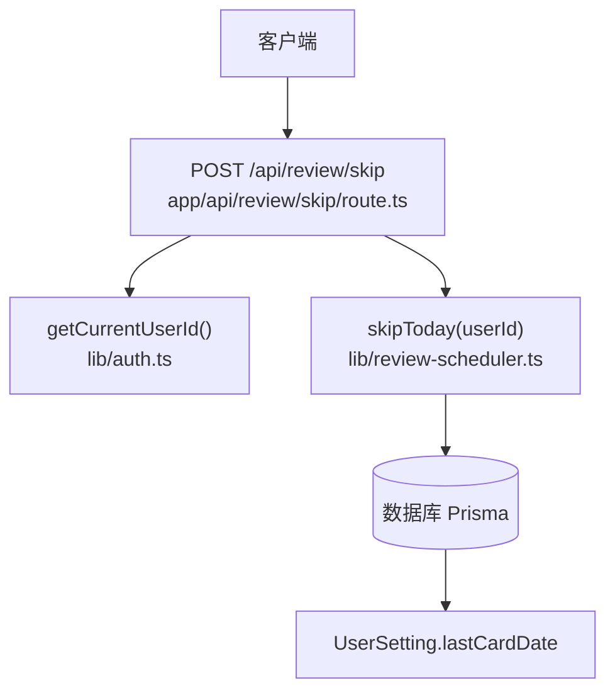
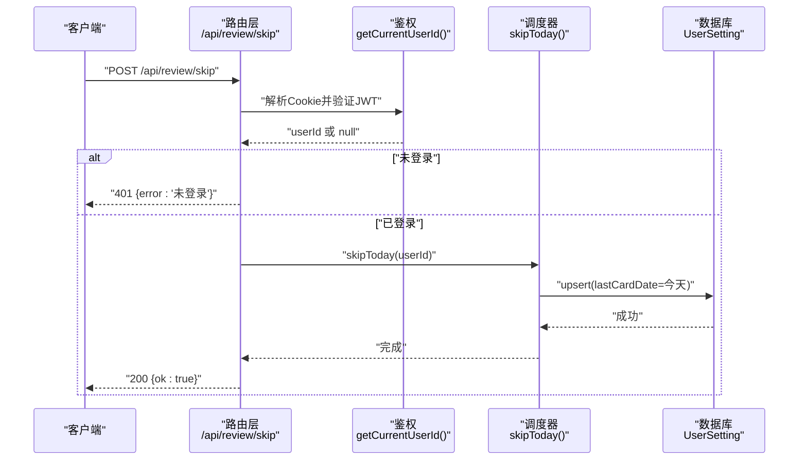
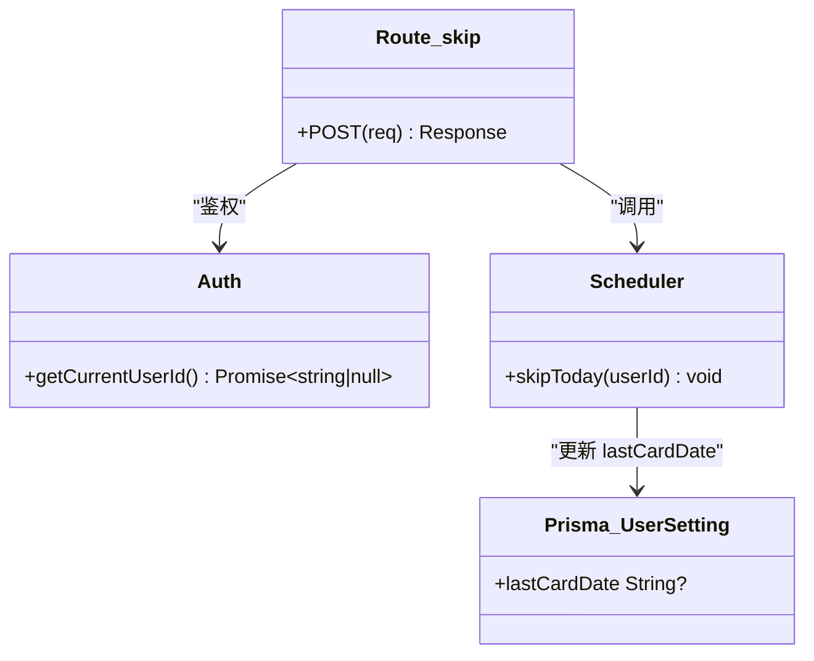

# 跳过题目接口

<cite>
**本文引用的文件**
- [app/api/review/skip/route.ts](file://app/api/review/skip/route.ts)
- [lib/review-scheduler.ts](file://lib/review-scheduler.ts)
- [prisma/schema.prisma](file://prisma/schema.prisma)
- [lib/auth.ts](file://lib/auth.ts)
- [app/api/review/today/route.ts](file://app/api/review/today/route.ts)
- [app/api/review/settings/route.ts](file://app/api/review/settings/route.ts)
</cite>

## 目录
1. [简介](#简介)
2. [项目结构](#项目结构)
3. [核心组件](#核心组件)
4. [架构总览](#架构总览)
5. [详细组件分析](#详细组件分析)
6. [依赖关系分析](#依赖关系分析)
7. [性能与一致性](#性能与一致性)
8. [故障排查指南](#故障排查指南)
9. [结论](#结论)
10. [附录：API 定义与示例](#附录api-定义与示例)

## 简介
本章节面向“心芽”项目的复习模块，聚焦于“跳过今日复习卡片”的接口设计与实现。该接口用于用户主动跳过当日弹出的复习提示（卡片），其业务影响是：当天不再再次弹出复习卡片，但不改变任何题目的间隔重复算法状态（如下次复习时间、连续正确次数等）。

## 项目结构
与“跳过题目接口”直接相关的代码位于以下位置：
- API 路由：app/api/review/skip/route.ts
- 调度逻辑：lib/review-scheduler.ts
- 认证工具：lib/auth.ts
- 数据模型：prisma/schema.prisma
- 相关联动：app/api/review/today/route.ts（获取今日卡片时更新 lastCardDate）
- 设置联动：app/api/review/settings/route.ts（开启复习功能时重置 lastCardDate）

图示来源
- [app/api/review/skip/route.ts:1-20](file://app/api/review/skip/route.ts#L1-L20)
- [lib/auth.ts:33-43](file://lib/auth.ts#L33-L43)
- [lib/review-scheduler.ts:217-224](file://lib/review-scheduler.ts#L217-L224)
- [prisma/schema.prisma:186-194](file://prisma/schema.prisma#L186-L194)

章节来源
- [app/api/review/skip/route.ts:1-20](file://app/api/review/skip/route.ts#L1-L20)
- [lib/review-scheduler.ts:217-224](file://lib/review-scheduler.ts#L217-L224)
- [prisma/schema.prisma:186-194](file://prisma/schema.prisma#L186-L194)
- [lib/auth.ts:33-43](file://lib/auth.ts#L33-L43)

## 核心组件
- 路由层：负责鉴权、调用调度器并返回统一响应。
- 调度器：提供 skipToday 方法，仅更新用户设置的 lastCardDate，不触碰复习记录或间隔重复参数。
- 数据模型：UserSetting 中的 lastCardDate 字段控制“今天是否已弹过卡片”。

章节来源
- [app/api/review/skip/route.ts:5-19](file://app/api/review/skip/route.ts#L5-L19)
- [lib/review-scheduler.ts:217-224](file://lib/review-scheduler.ts#L217-L224)
- [prisma/schema.prisma:186-194](file://prisma/schema.prisma#L186-L194)

## 架构总览
跳过操作的整体流程如下：
- 客户端发起 POST /api/review/skip
- 服务端校验登录态，提取 userId
- 调用调度器的 skipToday(userId)
- 调度器将当前日期写入 UserSetting.lastCardDate
- 返回成功响应

图示来源
- [app/api/review/skip/route.ts:5-19](file://app/api/review/skip/route.ts#L5-L19)
- [lib/auth.ts:33-43](file://lib/auth.ts#L33-L43)
- [lib/review-scheduler.ts:217-224](file://lib/review-scheduler.ts#L217-L224)
- [prisma/schema.prisma:186-194](file://prisma/schema.prisma#L186-L194)

## 详细组件分析

### 路由层：POST /api/review/skip
- 职责
  - 从 Cookie 中解析 JWT，获取当前用户 ID
  - 若未登录，返回 401
  - 调用 skipToday(userId)
  - 返回统一成功体 { ok: true }
- 错误处理
  - 捕获异常并返回 500，附带错误信息

章节来源
- [app/api/review/skip/route.ts:5-19](file://app/api/review/skip/route.ts#L5-L19)
- [lib/auth.ts:33-43](file://lib/auth.ts#L33-L43)

### 调度器：skipToday(userId)
- 行为
  - 计算当天日期字符串
  - 使用 upsert 将 UserSetting.lastCardDate 设置为今天
  - 若无对应设置则创建一条新记录
- 副作用
  - 仅影响“今日是否已弹出卡片”的状态
  - 不影响任何 QuizRecord 或间隔重复参数

章节来源
- [lib/review-scheduler.ts:217-224](file://lib/review-scheduler.ts#L217-L224)
- [prisma/schema.prisma:186-194](file://prisma/schema.prisma#L186-L194)

### 数据模型：UserSetting
- 关键字段
  - reviewEnabled：是否启用复习功能
  - lastCardDate：上次弹出复习卡片的日期（YYYY-MM-DD）
  - lastQuestionId：最近一次弹出的题目ID（由“获取今日卡片”接口维护）
- 与跳过的关系
  - 跳过即把 lastCardDate 设为今天，从而阻止“获取今日卡片”在同一天再次返回卡片

章节来源
- [prisma/schema.prisma:186-194](file://prisma/schema.prisma#L186-L194)

### 联动逻辑：获取今日卡片与设置开关
- 获取今日卡片
  - 若 lastCardDate 等于今天，则不再返回卡片
  - 首次展示后会将 lastCardDate 和 lastQuestionId 更新为今天
- 设置开关
  - 当从关闭变为开启时，会重置 lastCardDate 为 null，以便次日可正常弹出卡片

章节来源
- [lib/review-scheduler.ts:44-53](file://lib/review-scheduler.ts#L44-L53)
- [app/api/review/today/route.ts:108-113](file://app/api/review/today/route.ts#L108-L113)
- [app/api/review/settings/route.ts:46-54](file://app/api/review/settings/route.ts#L46-L54)

## 依赖关系分析
- 路由层依赖鉴权与调度器
- 调度器依赖 Prisma 访问数据库
- 数据模型通过 Prisma Schema 定义

图示来源
- [app/api/review/skip/route.ts:5-19](file://app/api/review/skip/route.ts#L5-L19)
- [lib/auth.ts:33-43](file://lib/auth.ts#L33-L43)
- [lib/review-scheduler.ts:217-224](file://lib/review-scheduler.ts#L217-L224)
- [prisma/schema.prisma:186-194](file://prisma/schema.prisma#L186-L194)

## 性能与一致性
- 单次 upsert 操作，开销极小
- 无事务需求，但建议在高并发场景下确保幂等性（同一天多次跳过结果一致）
- 对数据库索引的影响：UserSetting 以 userId 唯一键定位，查询/更新均为 O(1)

[本节为通用指导，无需源码引用]

## 故障排查指南
- 401 未登录
  - 检查 Cookie 中 token 是否存在且有效
  - 确认鉴权中间件是否正确注入 Cookie
- 500 跳过失败
  - 查看服务端日志 "[ReviewSkip]" 输出
  - 检查数据库连接与权限
- 跳过无效（仍弹出卡片）
  - 确认 lastCardDate 是否被更新为今天
  - 确认“获取今日卡片”逻辑是否读取了最新的 lastCardDate
  - 检查是否在设置中关闭了复习功能（reviewEnabled=false）

章节来源
- [app/api/review/skip/route.ts:15-18](file://app/api/review/skip/route.ts#L15-L18)
- [lib/review-scheduler.ts:44-53](file://lib/review-scheduler.ts#L44-L53)
- [app/api/review/settings/route.ts:46-54](file://app/api/review/settings/route.ts#L46-L54)

## 结论
“跳过题目接口”是一个轻量级、幂等的控制入口，仅通过更新 UserSetting.lastCardDate 来抑制当日复习卡片的再次弹出。它不改变任何复习记录或间隔重复算法参数，因此不会影响题目的下次复习时间与学习统计。

[本节为总结，无需源码引用]

## 附录：API 定义与示例

### 接口概览
- 路径：POST /api/review/skip
- 用途：跳过今日复习卡片，使当天不再再次弹出
- 鉴权：需要登录态（Cookie 中的 JWT）

### 请求头
- Content-Type: application/json（可选，因无请求体）

### 请求体
- 无

### 成功响应
- 状态码：200
- 响应体：{ ok: true }

### 失败响应
- 401 未登录
  - 响应体：{ error: "未登录" }
- 500 服务器错误
  - 响应体：{ error: "跳过失败" }

### 调用示例
- cURL
  - curl -X POST https://your-domain/api/review/skip -H "Cookie: xinya_token=YOUR_TOKEN"
- JavaScript fetch
  - fetch("/api/review/skip", { method: "POST", credentials: "include" })
    .then(r => r.json())
    .then(console.log)

### 业务规则与影响说明
- 业务规则
  - 仅在“获取今日卡片”逻辑生效前有效；一旦今天已弹出过卡片，再次跳过不会产生额外效果
  - 同一用户在同一天多次调用，结果为幂等（lastCardDate 始终为今天）
- 对复习计划的影响
  - 仅影响“是否弹出卡片”，不改变任何题目的 nextReviewAt、streak 等间隔重复参数
  - 不会新增或修改 QuizRecord 记录
- 对间隔重复算法的调整机制
  - 跳过操作不调用提交答案逻辑，因此不会触发间隔重复算法的重新计算
- 数据存储与统计
  - 仅更新 UserSetting.lastCardDate
  - 不产生新的 ReviewCallLog 或其他审计记录
  - 不影响答题准确率、连续天数等统计指标

章节来源
- [app/api/review/skip/route.ts:5-19](file://app/api/review/skip/route.ts#L5-L19)
- [lib/review-scheduler.ts:217-224](file://lib/review-scheduler.ts#L217-L224)
- [lib/review-scheduler.ts:44-53](file://lib/review-scheduler.ts#L44-L53)
- [prisma/schema.prisma:186-194](file://prisma/schema.prisma#L186-L194)