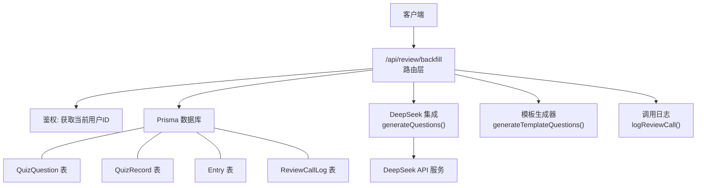
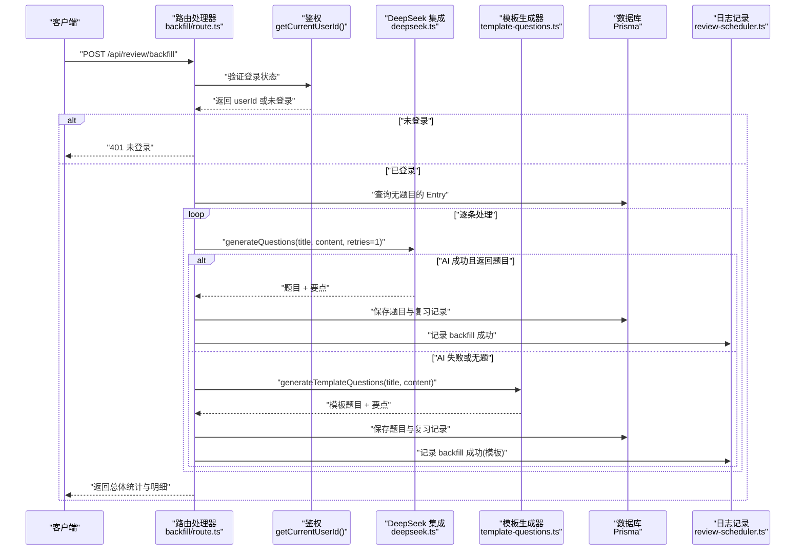
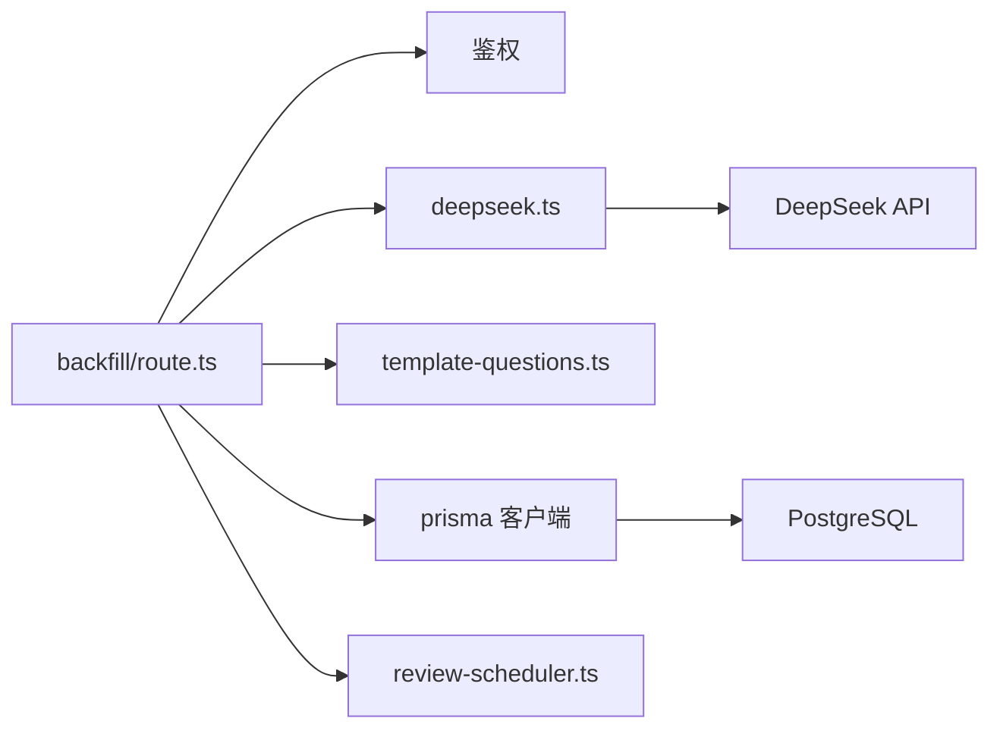

# 题目填充接口

<cite>
**本文引用的文件**   
- [app/api/review/backfill/route.ts](file://app/api/review/backfill/route.ts)
- [lib/deepseek.ts](file://lib/deepseek.ts)
- [lib/template-questions.ts](file://lib/template-questions.ts)
- [lib/review-scheduler.ts](file://lib/review-scheduler.ts)
- [prisma/schema.prisma](file://prisma/schema.prisma)
</cite>

## 目录
1. [简介](#简介)
2. [项目结构](#项目结构)
3. [核心组件](#核心组件)
4. [架构总览](#架构总览)
5. [详细组件分析](#详细组件分析)
6. [依赖关系分析](#依赖关系分析)
7. [性能与并发控制](#性能与并发控制)
8. [配置选项与调优建议](#配置选项与调优建议)
9. [故障排查指南](#故障排查指南)
10. [结论](#结论)

## 简介
本文件为心芽项目的“题目填充接口”提供完整 API 文档，聚焦于 POST /api/review/backfill 的批量题目生成功能。该接口用于对历史心得进行批量补生成题目：优先调用 DeepSeek AI 生成题目与要点总结；若 AI 失败或返回空结果，则降级到模板策略生成基础题目。接口会记录每次生成的日志，并持久化题目与复习记录，便于后续复习调度与质量评估。

## 项目结构
与本题目填充接口相关的代码主要分布在以下位置：
- 路由层：处理 HTTP 请求、鉴权、批量遍历与落库
- AI 集成层：封装 DeepSeek API 调用、重试与超时控制
- 模板层：AI 不可用时生成保底题目与要点
- 调度与日志：记录调用日志、清理旧日志、辅助复习流程
- 数据模型：题目、答题记录、调用日志等 Prisma 模型定义

图表来源
- [app/api/review/backfill/route.ts:1-114](file://app/api/review/backfill/route.ts#L1-L114)
- [lib/deepseek.ts:1-115](file://lib/deepseek.ts#L1-L115)
- [lib/template-questions.ts:1-66](file://lib/template-questions.ts#L1-L66)
- [lib/review-scheduler.ts:1-225](file://lib/review-scheduler.ts#L1-L225)
- [prisma/schema.prisma:150-209](file://prisma/schema.prisma#L150-L209)

章节来源
- [app/api/review/backfill/route.ts:1-114](file://app/api/review/backfill/route.ts#L1-L114)
- [lib/deepseek.ts:1-115](file://lib/deepseek.ts#L1-L115)
- [lib/template-questions.ts:1-66](file://lib/template-questions.ts#L1-L66)
- [lib/review-scheduler.ts:1-225](file://lib/review-scheduler.ts#L1-L225)
- [prisma/schema.prisma:150-209](file://prisma/schema.prisma#L150-L209)

## 核心组件
- 路由处理器（POST /api/review/backfill）
  - 鉴权后查询当前用户所有尚未出题的心得条目
  - 逐个条目尝试 AI 生成题目，失败或无题时回退到模板策略
  - 将题目与复习记录写入数据库，并记录调用日志
- DeepSeek 集成
  - 构造提示词，限制题干长度、题型适配、答案格式与解析要求
  - 带超时与最大重试次数，容错提取 JSON 并规范化字段
- 模板生成器
  - 当 AI 不可用时，基于标题与内容生成基础题目与要点摘要
- 调度与日志
  - 记录每次生成步骤、成功与否、题目数量与错误信息
  - 自动清理超过阈值的旧日志，避免无限增长

章节来源
- [app/api/review/backfill/route.ts:1-114](file://app/api/review/backfill/route.ts#L1-L114)
- [lib/deepseek.ts:1-115](file://lib/deepseek.ts#L1-L115)
- [lib/template-questions.ts:1-66](file://lib/template-questions.ts#L1-L66)
- [lib/review-scheduler.ts:1-225](file://lib/review-scheduler.ts#L1-L225)

## 架构总览
下图展示了从请求进入到落库与日志记录的端到端流程。

图表来源
- [app/api/review/backfill/route.ts:1-114](file://app/api/review/backfill/route.ts#L1-L114)
- [lib/deepseek.ts:1-115](file://lib/deepseek.ts#L1-L115)
- [lib/template-questions.ts:1-66](file://lib/template-questions.ts#L1-L66)
- [lib/review-scheduler.ts:1-225](file://lib/review-scheduler.ts#L1-L225)

## 详细组件分析

### 接口定义：POST /api/review/backfill
- 功能概述
  - 批量为当前用户所有没有题目的历史心得生成题目
  - 优先使用 DeepSeek AI 生成题目与要点；失败或无题时降级到模板策略
  - 将生成的题目与复习记录写入数据库，并记录调用日志
- 鉴权
  - 通过鉴权中间件获取当前用户 ID；未登录返回 401
- 输入参数
  - 请求体：无需额外参数（由鉴权上下文确定用户）
- 输出响应
  - 成功时返回：
    - ok: true
    - total: 待处理的条目总数
    - success: 成功处理的条目数
    - failed: 失败的条目数
    - results: 每个条目的处理结果数组，包含 entryId、title、status、questionCount
  - 未登录时返回：
    - error: "未登录"，HTTP 401
  - 整体异常时返回：
    - error: "补生成失败"，HTTP 500
- 处理流程
  - 查询当前用户所有 quizQuestions 为空的心得条目
  - 对每个条目：
    - 调用 DeepSeek 生成题目与要点
    - 若 AI 返回题目为空，则调用模板生成器
    - 保存题目与复习记录，设置下次复习时间为次日
    - 记录调用日志（成功/失败、题目数量）
- 错误处理
  - 单个条目处理异常不影响其他条目，累计失败计数
  - 外层 try/catch 捕获全局异常并返回 500

章节来源
- [app/api/review/backfill/route.ts:1-114](file://app/api/review/backfill/route.ts#L1-L114)

### DeepSeek 集成：generateQuestions
- 功能概述
  - 根据心得标题与内容生成题目与要点总结
  - 支持最大重试次数与超时控制
- 关键行为
  - 提示词约束：
    - 题干长度限制
    - 题型自动适配（单选/多选/判断）
    - 选项数量与答案索引规范
    - 解析需引用原文重点
    - 同时生成要点总结（keyPoints），字数限制
  - 网络请求：
    - 使用 Bearer Token 认证
    - 30 秒超时
    - 最大重试次数（默认 1）
  - 响应解析：
    - 正则提取 JSON 块
    - 规范化字段类型与长度
- 返回值
  - keyPoints: 要点总结字符串
  - questions: 题目数组，包含 question、type、options、answer、explanation

章节来源
- [lib/deepseek.ts:1-115](file://lib/deepseek.ts#L1-L115)

### 模板生成器：generateTemplateQuestions
- 功能概述
  - 在 DeepSeek 不可用或返回空结果时，作为降级方案生成基础题目
- 关键行为
  - 生成要点摘要（100 字以内）
  - 生成两道基础题目：
    - 核心观点（单选）
    - 内容理解（判断）
- 适用场景
  - 快速兜底，确保每条心得至少具备可复习的题目

章节来源
- [lib/template-questions.ts:1-66](file://lib/template-questions.ts#L1-L66)

### 调用日志与进度跟踪：logReviewCall
- 功能概述
  - 记录每次生成调用的步骤、成功与否、题目数量与错误信息
  - 保留最近固定数量的日志，自动清理旧日志
- 关键字段
  - userId、entryId、step、success、questionCount、errorMsg
- 用途
  - 问题定位与审计
  - 进度跟踪与成功率统计

章节来源
- [lib/review-scheduler.ts:1-225](file://lib/review-scheduler.ts#L1-L225)

### 数据模型与关系
- QuizQuestion
  - 存储题目文本、题型、选项、答案、解析、角度序号等
- QuizRecord
  - 存储用户对某道题的答题记录、正确性、下次复习时间、连续正确次数等
- ReviewCallLog
  - 存储生成调用日志，便于追踪与排障
- 关系
  - Entry 与 QuizQuestion 一对多
  - User 与 QuizRecord 一对多
  - QuizQuestion 与 QuizRecord 一对多

章节来源
- [prisma/schema.prisma:150-209](file://prisma/schema.prisma#L150-L209)

## 依赖关系分析
- 路由层依赖
  - 鉴权模块：获取当前用户 ID
  - Prisma：读写 Entry、QuizQuestion、QuizRecord、ReviewCallLog
  - DeepSeek 集成：生成题目与要点
  - 模板生成器：降级策略
  - 调度与日志：记录调用日志
- 外部依赖
  - DeepSeek API：在线生成题目
- 内部耦合
  - 路由层与数据模型强耦合（直接操作 Prisma）
  - 生成逻辑与日志记录解耦（通过函数调用）

图表来源
- [app/api/review/backfill/route.ts:1-114](file://app/api/review/backfill/route.ts#L1-L114)
- [lib/deepseek.ts:1-115](file://lib/deepseek.ts#L1-L115)
- [lib/template-questions.ts:1-66](file://lib/template-questions.ts#L1-L66)
- [lib/review-scheduler.ts:1-225](file://lib/review-scheduler.ts#L1-L225)
- [prisma/schema.prisma:150-209](file://prisma/schema.prisma#L150-L209)

## 性能与并发控制
- 当前实现
  - 串行处理：对每个条目顺序执行 AI 生成与落库
  - 单条超时：30 秒
  - 单条重试：最多一次
- 并发控制现状
  - 未实现并发控制，全部串行执行
- 潜在风险
  - 大量条目时，接口耗时较长
  - 外部 API 抖动可能导致整体失败率上升
- 优化建议
  - 引入任务队列与并发度限制（如限流、分片）
  - 增加指数退避重试与熔断机制
  - 批处理提交（事务或批量写入）减少 IO 开销
  - 异步回调或轮询进度接口替代同步等待

[本节为通用性能讨论，不直接分析具体文件]

## 配置选项与调优建议
- 环境变量
  - DEEPSEEK_API_KEY：DeepSeek API 密钥
  - DATABASE_URL：数据库连接串
- 生成策略
  - 重试次数：默认 1 次，可根据稳定性调整
  - 超时时间：默认 30 秒，可按网络状况调整
  - 温度与令牌上限：temperature 0.7，max_tokens 1000
- 题目质量规则
  - 题干长度限制
  - 题型自适应与选项数量规范
  - 答案索引格式与解析引用原文
- 日志与监控
  - 保留最近固定数量的调用日志
  - 关注失败率与平均耗时指标

章节来源
- [lib/deepseek.ts:1-115](file://lib/deepseek.ts#L1-L115)
- [lib/review-scheduler.ts:1-225](file://lib/review-scheduler.ts#L1-L225)

## 故障排查指南
- 常见问题
  - 未登录：检查鉴权中间件与请求头
  - DeepSeek 返回非 JSON：查看日志中的 No JSON in response 错误
  - API 错误码：查看日志中的 API error 状态码
  - 超时：检查网络与超时配置
  - 模板降级：确认 AI 是否返回空题目
- 排查步骤
  - 查看 ReviewCallLog 日志，定位失败条目与错误信息
  - 核对 DEEPSEEK_API_KEY 是否正确
  - 检查数据库连接与写入权限
  - 观察日志中超时与重试情况
- 恢复建议
  - 针对失败条目单独重试
  - 调整重试次数与超时阈值
  - 必要时启用更严格的模板策略

章节来源
- [lib/review-scheduler.ts:1-225](file://lib/review-scheduler.ts#L1-L225)
- [lib/deepseek.ts:1-115](file://lib/deepseek.ts#L1-L115)
- [app/api/review/backfill/route.ts:1-114](file://app/api/review/backfill/route.ts#L1-L114)

## 结论
POST /api/review/backfill 提供了稳定可靠的批量题目生成能力，结合 DeepSeek AI 与模板降级策略，确保历史心得能够持续产出可复习的题目。通过调用日志与数据模型支撑，系统具备良好的可观测性与可维护性。建议在大规模场景下引入并发控制、任务队列与更完善的监控告警，以提升吞吐与稳定性。