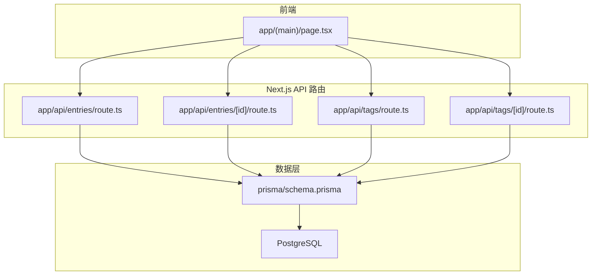
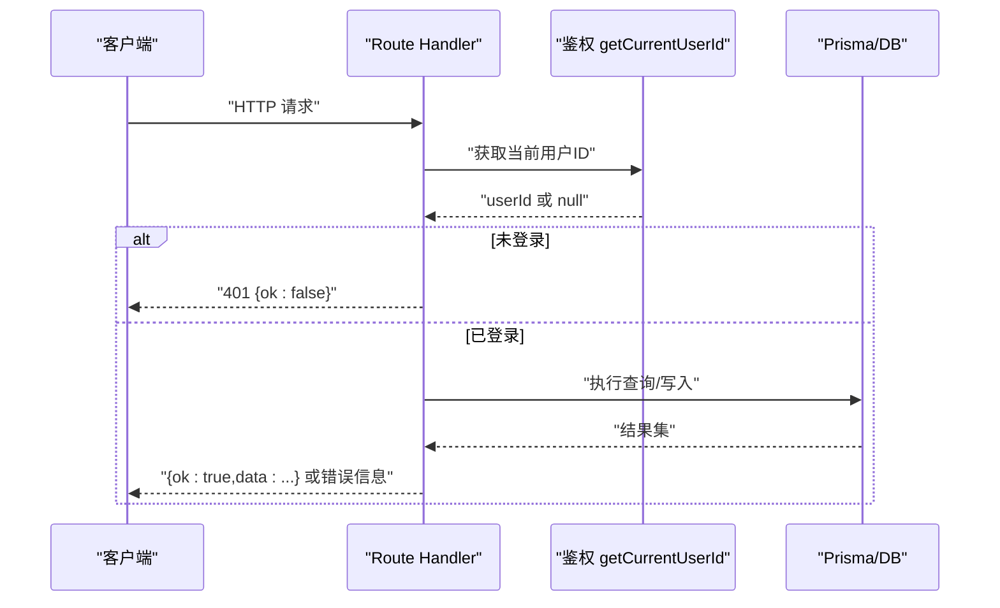
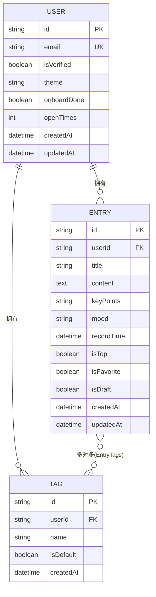
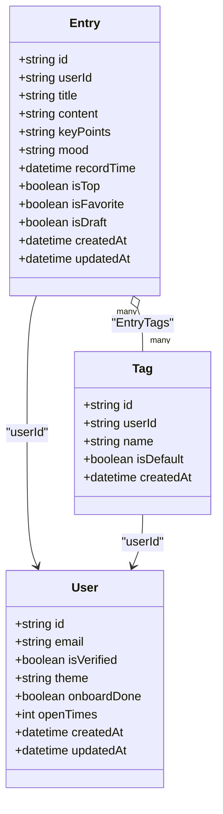
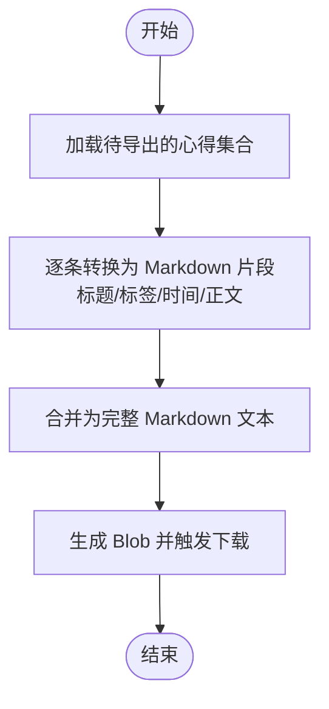

# 心得管理API

<cite>
**本文引用的文件**   
- [app/api/entries/route.ts](file://app/api/entries/route.ts)
- [app/api/entries/[id]/route.ts](file://app/api/entries/[id]/route.ts)
- [app/api/tags/route.ts](file://app/api/tags/route.ts)
- [app/api/tags/[id]/route.ts](file://app/api/tags/[id]/route.ts)
- [prisma/schema.prisma](file://prisma/schema.prisma)
- [types/index.ts](file://types/index.ts)
- [doc/心芽富文本文字编辑规范.md](file://doc/心芽富文本文字编辑规范.md)
- [lib/export-utils.ts](file://lib/export-utils.ts)
- [app/(main)/page.tsx](file://app/(main)/page.tsx)
</cite>

## 目录
1. [简介](#简介)
2. [项目结构](#项目结构)
3. [核心组件](#核心组件)
4. [架构总览](#架构总览)
5. [详细接口说明](#详细接口说明)
6. [依赖关系分析](#依赖关系分析)
7. [性能与批量操作建议](#性能与批量操作建议)
8. [富文本存储与Markdown转换](#富文本存储与markdown转换)
9. [故障排查指南](#故障排查指南)
10. [结论](#结论)

## 简介
本文件为“心芽”项目的“心得管理”模块提供完整的 API 接口文档，覆盖心得的创建、查询（列表与详情）、更新、删除等 CRUD 能力，并补充标签管理接口。同时给出数据模型定义、搜索与筛选参数说明、批量操作建议以及富文本存储格式与 Markdown 导出处理说明。

## 项目结构
与心得管理相关的后端实现采用 Next.js App Router 的 Route Handlers，数据库使用 Prisma + PostgreSQL，类型定义位于 types 目录。

图表来源
- [app/(main)/page.tsx](file://app/(main)/page.tsx)
- [app/api/entries/route.ts](file://app/api/entries/route.ts)
- [app/api/entries/[id]/route.ts](file://app/api/entries/[id]/route.ts)
- [app/api/tags/route.ts](file://app/api/tags/route.ts)
- [app/api/tags/[id]/route.ts](file://app/api/tags/[id]/route.ts)
- [prisma/schema.prisma](file://prisma/schema.prisma)

章节来源
- [app/api/entries/route.ts](file://app/api/entries/route.ts)
- [app/api/entries/[id]/route.ts](file://app/api/entries/[id]/route.ts)
- [app/api/tags/route.ts](file://app/api/tags/route.ts)
- [app/api/tags/[id]/route.ts](file://app/api/tags/[id]/route.ts)
- [prisma/schema.prisma](file://prisma/schema.prisma)
- [app/(main)/page.tsx](file://app/(main)/page.tsx)

## 核心组件
- 心得实体 Entry：包含标题、内容、心情、记录时间、置顶/收藏/草稿标记等字段，并与标签多对多关联。
- 标签实体 Tag：用户维度唯一名称，支持默认标签。
- 类型定义：EntryCard、EntryDetail、TagItem、ApiResponse 等用于前后端契约。

章节来源
- [prisma/schema.prisma](file://prisma/schema.prisma)
- [types/index.ts](file://types/index.ts)

## 架构总览
- 认证鉴权：所有接口通过统一方法获取当前用户 ID，未登录返回 401。
- 数据访问：Prisma Client 直接访问数据库，按条件构建 where 子句进行过滤、分页与排序。
- 响应格式：统一 ApiResponse 结构 { ok, data?, error? }。

图表来源
- [app/api/entries/route.ts](file://app/api/entries/route.ts)
- [app/api/entries/[id]/route.ts](file://app/api/entries/[id]/route.ts)
- [app/api/tags/route.ts](file://app/api/tags/route.ts)
- [app/api/tags/[id]/route.ts](file://app/api/tags/[id]/route.ts)

## 详细接口说明

### 通用约定
- 认证：所有接口需携带有效会话/令牌以通过鉴权；未认证返回 401。
- 响应体：统一结构
  - ok: boolean
  - data?: any
  - error?: string
- 分页：GET /api/entries 支持 page、limit；limit 上限为 1000。
- 日期范围：from/to 为 ISO 字符串，to 包含当天结束时刻。

章节来源
- [app/api/entries/route.ts](file://app/api/entries/route.ts)
- [types/index.ts](file://types/index.ts)

### 标签管理

#### 获取标签列表
- 方法：GET
- 路径：/api/tags
- 鉴权：需要
- 响应 data：数组，每项包含 id、name、isDefault、entryCount

章节来源
- [app/api/tags/route.ts](file://app/api/tags/route.ts)

#### 创建标签
- 方法：POST
- 路径：/api/tags
- 请求体：{ name: string }
- 校验：name 非空且长度不超过 20；同用户下 name 唯一
- 响应 data：新建的标签对象

章节来源
- [app/api/tags/route.ts](file://app/api/tags/route.ts)

#### 重命名标签
- 方法：PATCH
- 路径：/api/tags/[id]
- 请求体：{ name: string }
- 校验：name 非空；同用户下 name 唯一
- 响应 data：更新后的标签对象

章节来源
- [app/api/tags/[id]/route.ts](file://app/api/tags/[id]/route.ts)

#### 删除标签
- 方法：DELETE
- 路径：/api/tags/[id]
- 行为：若为默认标签则拒绝；否则将该标签从关联心得中移除，并将这些心得补上用户的默认标签（若存在）
- 响应：成功返回 { ok: true }

章节来源
- [app/api/tags/[id]/route.ts](file://app/api/tags/[id]/route.ts)

### 心得管理

#### 获取心得列表
- 方法：GET
- 路径：/api/entries
- 查询参数：
  - search: 关键词，模糊匹配标题或内容（不区分大小写）
  - favorite: "true"/"false"，是否仅收藏
  - tagId: 按标签过滤
  - from: 起始日期（含），ISO 字符串
  - to: 结束日期（含），ISO 字符串
  - page: 页码，默认 1
  - limit: 每页条数，默认 20，最大 1000
- 排序：置顶优先，其次按记录时间倒序
- 响应 data：
  - entries: 列表项，包含 id、title、contentPreview、tags、mood、recordTime、isTop、isFavorite、isDraft
  - total: 总数
  - page、limit

章节来源
- [app/api/entries/route.ts](file://app/api/entries/route.ts)

#### 创建心得
- 方法：POST
- 路径：/api/entries
- 请求体：
  - title: string（必填，去除首尾空白后非空）
  - content: string（可选，富文本 HTML）
  - mood: MoodType | null（可选）
  - tagIds: string[]（可选；为空时自动绑定该用户的默认标签）
  - isDraft: boolean（可选）
- 响应 data：新建的心得对象，包含 tags 列表

章节来源
- [app/api/entries/route.ts](file://app/api/entries/route.ts)

#### 获取心得详情
- 方法：GET
- 路径：/api/entries/[id]
- 响应 data：
  - 基础字段：id、title、content、contentPreview、tags、mood、recordTime、isTop、isFavorite、isDraft

章节来源
- [app/api/entries/[id]/route.ts](file://app/api/entries/[id]/route.ts)

#### 更新心得
- 方法：PUT
- 路径：/api/entries/[id]
- 请求体：
  - title: string（必填，去除首尾空白后非空）
  - content: string（可选）
  - mood: MoodType | null（可选）
  - tagIds: string[]（可选；为空时自动绑定默认标签）
  - isDraft: boolean（可选）
- 响应 data：更新后的心得对象，包含 tags 列表

章节来源
- [app/api/entries/[id]/route.ts](file://app/api/entries/[id]/route.ts)

#### 部分更新（置顶/收藏）
- 方法：PATCH
- 路径：/api/entries/[id]
- 请求体：允许字段 isTop、isFavorite（布尔值）
- 响应 data：更新后的心得对象，包含 tags 列表

章节来源
- [app/api/entries/[id]/route.ts](file://app/api/entries/[id]/route.ts)

#### 删除心得
- 方法：DELETE
- 路径：/api/entries/[id]
- 响应：成功返回 { ok: true }

章节来源
- [app/api/entries/[id]/route.ts](file://app/api/entries/[id]/route.ts)

### 数据模型定义

图表来源
- [prisma/schema.prisma](file://prisma/schema.prisma)

字段说明（精选）
- Entry
  - id: 主键
  - userId: 所属用户
  - title: 标题
  - content: 正文（HTML 富文本）
  - keyPoints: AI 生成的要点（可选）
  - mood: 心情标记（枚举之一或空）
  - recordTime: 记录时间
  - isTop/isFavorite/isDraft: 状态位
  - createdAt/updatedAt: 审计时间
- Tag
  - id: 主键
  - userId: 所属用户
  - name: 标签名（同用户唯一）
  - isDefault: 是否为默认标签
  - createdAt: 创建时间

章节来源
- [prisma/schema.prisma](file://prisma/schema.prisma)
- [types/index.ts](file://types/index.ts)

### 搜索与筛选
- 关键词搜索：search 参数对标题与内容进行不区分大小写的模糊匹配
- 收藏筛选：favorite=true 仅返回收藏条目
- 标签筛选：tagId 指定标签 ID
- 时间范围：from/to 限定记录时间区间（to 包含当天）
- 分页：page、limit

章节来源
- [app/api/entries/route.ts](file://app/api/entries/route.ts)

## 依赖关系分析

图表来源
- [prisma/schema.prisma](file://prisma/schema.prisma)

## 性能与批量操作建议

- 分页与限制
  - 列表接口已内置 skip/take 分页，limit 上限 1000，避免一次性拉取过多数据。
  - 建议在 UI 侧做增量加载（如滚动到底部再加载下一页）。

- 索引利用
  - 数据库对 userId+recordTime、userId+isTop、userId+isFavorite、userId+isDraft 建有复合索引，可提升常见筛选与排序性能。

- 预生成异步任务
  - 创建非草稿心得时会异步触发题目预生成与记录，不会阻塞响应。

- 批量操作现状与建议
  - 当前未提供批量更新/删除接口。
  - 如需批量修改标签或状态，可在服务端增加事务性批量接口，或使用循环调用现有单条接口并在客户端控制并发度（例如每次 5~10 个并行请求），以避免瞬时压力过大。
  - 对于大批量删除，建议分批提交，结合限流与重试机制。

章节来源
- [app/api/entries/route.ts](file://app/api/entries/route.ts)
- [app/api/entries/[id]/route.ts](file://app/api/entries/[id]/route.ts)
- [prisma/schema.prisma](file://prisma/schema.prisma)

## 富文本存储与Markdown转换

- 存储格式
  - 心得正文 content 字段存储为 HTML 富文本，由前端 contentEditable + execCommand 方案生成。
  - 列表与预览会剥离 HTML 标签生成纯文本摘要。

- 编辑器规范
  - 支持加粗、斜体、无序列表、文字颜色、字数统计等。
  - 列表样式需在展示侧补充 CSS，确保 ul/ol/li 正确渲染。
  - 粘贴外部内容建议转为纯文本插入，避免引入复杂样式。

- Markdown 导出
  - 提供将多条心得导出为 Markdown 的工具函数，将每条心得拼接为二级标题、标签行、时间与正文。
  - 导出流程在前端完成，下载为文本文件。

图表来源
- [lib/export-utils.ts](file://lib/export-utils.ts)

章节来源
- [doc/心芽富文本文字编辑规范.md](file://doc/心芽富文本文字编辑规范.md)
- [lib/export-utils.ts](file://lib/export-utils.ts)

## 故障排查指南

- 401 未授权
  - 检查会话/令牌是否正确携带，鉴权中间件是否生效。
- 400 参数校验失败
  - 标题为空、标签名为空或重复、标签名超长等场景会返回错误信息。
- 404 资源不存在
  - 心得或标签不存在时返回相应提示。
- 列表为空或数据异常
  - 确认筛选条件（search/favorite/tagId/from/to）是否正确；检查分页参数是否合理。
- 富文本显示异常
  - 确认展示侧是否补充了 ul/ol/li 等样式；粘贴外部内容是否被清洗为纯文本。

章节来源
- [app/api/entries/route.ts](file://app/api/entries/route.ts)
- [app/api/entries/[id]/route.ts](file://app/api/entries/[id]/route.ts)
- [app/api/tags/route.ts](file://app/api/tags/route.ts)
- [app/api/tags/[id]/route.ts](file://app/api/tags/[id]/route.ts)

## 结论
本 API 文档覆盖了心得与标签的核心 CRUD 能力，明确了数据模型、筛选与分页策略、富文本存储与导出方式，并提供了性能优化与批量操作的实践建议。后续如需扩展批量接口，建议在服务端引入事务与批处理逻辑，以提升一致性与吞吐表现。