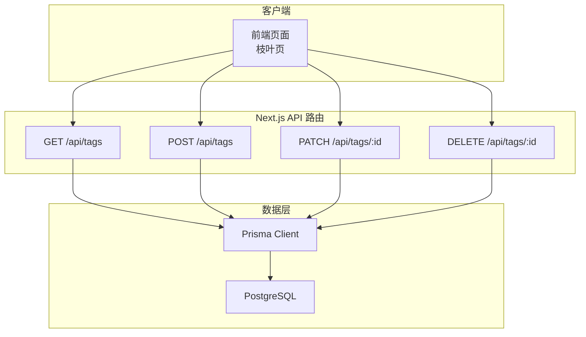
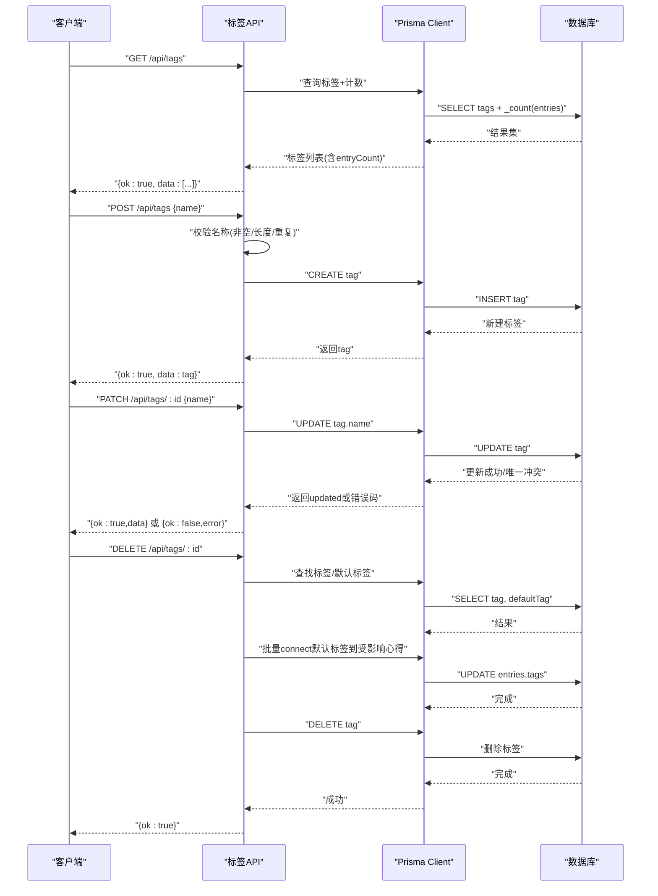
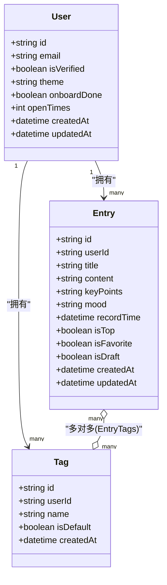

# 标签管理API

<cite>
**本文引用的文件**
- [app/api/tags/route.ts](file://app/api/tags/route.ts)
- [app/api/tags/[id]/route.ts](file://app/api/tags/[id]/route.ts)
- [prisma/schema.prisma](file://prisma/schema.prisma)
- [app/api/entries/route.ts](file://app/api/entries/route.ts)
- [app/(main)/leaf/page.tsx](file://app/(main)/leaf/page.tsx)
</cite>

## 目录
1. [简介](#简介)
2. [项目结构](#项目结构)
3. [核心组件](#核心组件)
4. [架构总览](#架构总览)
5. [详细接口说明](#详细接口说明)
6. [依赖关系分析](#依赖关系分析)
7. [性能与扩展建议](#性能与扩展建议)
8. [故障排查指南](#故障排查指南)
9. [结论](#结论)

## 简介
本文件为心芽项目的“标签管理”模块提供完整的 API 文档，覆盖标签的增删改查、与心得的关联关系、默认标签与自定义标签的处理差异，以及当前已实现的统计字段。同时明确尚未实现的功能（如搜索与自动补全、分类与层级管理）及后续扩展建议。

## 项目结构
标签相关后端路由位于 Next.js App Router 的 /api/tags 下，数据模型定义在 Prisma Schema 中，并与心得 Entry 建立多对多关系。前端通过调用这些 API 完成标签列表展示、创建、重命名与删除等操作。

图示来源
- [app/api/tags/route.ts:1-46](file://app/api/tags/route.ts#L1-L46)
- [app/api/tags/[id]/route.ts:1-62](file://app/api/tags/[id]/route.ts#L1-L62)
- [prisma/schema.prisma:57-69](file://prisma/schema.prisma#L57-L69)

章节来源
- [app/api/tags/route.ts:1-46](file://app/api/tags/route.ts#L1-L46)
- [app/api/tags/[id]/route.ts:1-62](file://app/api/tags/[id]/route.ts#L1-L62)
- [prisma/schema.prisma:57-69](file://prisma/schema.prisma#L57-L69)

## 核心组件
- 标签模型 Tag：包含 id、userId、name、isDefault、createdAt，并通过唯一约束保证同一用户下标签名不重复。
- 心得模型 Entry：与 Tag 通过多对多关系 EntryTags 关联，支持按标签筛选心得。
- 标签 API：
  - GET /api/tags：获取当前用户的标签列表，附带每个标签关联的心得数量。
  - POST /api/tags：创建新标签，校验名称非空且长度限制，并检查重复。
  - PATCH /api/tags/:id：重命名标签，处理唯一性冲突。
  - DELETE /api/tags/:id：删除标签；若存在默认标签，则将被删除标签关联但无默认标签的心得补充默认标签后再删除。

章节来源
- [prisma/schema.prisma:57-69](file://prisma/schema.prisma#L57-L69)
- [app/api/tags/route.ts:1-46](file://app/api/tags/route.ts#L1-L46)
- [app/api/tags/[id]/route.ts:1-62](file://app/api/tags/[id]/route.ts#L1-L62)

## 架构总览
标签管理与心得系统的数据流如下：

图示来源
- [app/api/tags/route.ts:1-46](file://app/api/tags/route.ts#L1-L46)
- [app/api/tags/[id]/route.ts:1-62](file://app/api/tags/[id]/route.ts#L1-L62)
- [prisma/schema.prisma:57-69](file://prisma/schema.prisma#L57-L69)

## 详细接口说明

### 通用约定
- 认证：所有接口均要求登录态，未登录返回 401。
- 响应体统一格式：
  - ok: boolean
  - data?: any
  - error?: string
- 状态码：
  - 200：成功
  - 400：参数错误或业务校验失败
  - 401：未认证
  - 404：资源不存在
  - 500：服务端异常

### 获取标签列表
- 方法：GET
- 路径：/api/tags
- 功能：返回当前用户的所有标签，并按“默认标签优先、名称升序”排序，附带每个标签关联的心得数量 entryCount。
- 请求参数：无
- 响应示例字段：
  - id: string
  - name: string
  - isDefault: boolean
  - entryCount: number
- 行为说明：
  - 使用 include 聚合计算每个标签关联的 Entry 数量。
  - 默认排序：isDefault 降序，name 升序。

章节来源
- [app/api/tags/route.ts:6-25](file://app/api/tags/route.ts#L6-L25)
- [prisma/schema.prisma:57-69](file://prisma/schema.prisma#L57-L69)

### 创建标签
- 方法：POST
- 路径：/api/tags
- 功能：为当前用户创建新标签。
- 请求体：
  - name: string（必填，去除首尾空白后长度不超过20）
- 校验规则：
  - 名称不能为空
  - 名称长度上限20
  - 同用户下名称不可重复
- 响应：
  - 成功：返回新建的标签对象
  - 失败：返回具体错误信息（如“该标签已存在”、“标签名最多20个字”等）

章节来源
- [app/api/tags/route.ts:27-46](file://app/api/tags/route.ts#L27-L46)

### 重命名标签
- 方法：PATCH
- 路径：/api/tags/:id
- 功能：修改指定标签的名称。
- 路径参数：
  - id: string（标签ID）
- 请求体：
  - name: string（必填，去除首尾空白）
- 校验规则：
  - 名称不能为空
  - 同用户下名称不可重复（由数据库唯一约束触发）
- 响应：
  - 成功：返回更新后的标签对象
  - 失败：若唯一冲突返回“标签名已存在”，其他错误返回“操作失败”

章节来源
- [app/api/tags/[id]/route.ts:35-61](file://app/api/tags/[id]/route.ts#L35-L61)

### 删除标签
- 方法：DELETE
- 路径：/api/tags/:id
- 功能：删除指定标签。
- 路径参数：
  - id: string（标签ID）
- 前置条件：
  - 仅可删除自定义标签（isDefault=false），默认标签不可删除
  - 若存在默认标签，则在删除前将“仅被该标签关联且未包含默认标签”的心得连接上默认标签，确保心得至少保留一个标签
- 响应：
  - 成功：{ ok: true }
  - 失败：未找到标签、默认标签不可删除等

章节来源
- [app/api/tags/[id]/route.ts:5-34](file://app/api/tags/[id]/route.ts#L5-L34)

### 标签与心得的关联关系
- 关系类型：多对多（Entry ↔ Tag）
- 关系名：EntryTags
- 使用方式：
  - 创建心得时，若未选择任何标签，则自动连接默认标签（若存在）。
  - 删除标签时，受影响的心得会被补充默认标签以避免“无标签”状态。
  - 可按标签筛选心得（见下方“按标签筛选心得”接口）。

章节来源
- [prisma/schema.prisma:33-55](file://prisma/schema.prisma#L33-L55)
- [prisma/schema.prisma:57-69](file://prisma/schema.prisma#L57-L69)
- [app/api/entries/route.ts:65-106](file://app/api/entries/route.ts#L65-L106)

### 按标签筛选心得（与标签联动）
- 方法：GET
- 路径：/api/entries?tagId=...
- 功能：根据传入的 tagId 过滤心得列表，支持分页与其他筛选条件。
- 查询参数：
  - tagId: string（可选）
  - page: number（默认1）
  - limit: number（默认20，最大1000）
  - search: string（可选，标题/内容模糊匹配）
  - favorite: boolean（可选）
  - from/to: string（可选，日期范围）
- 响应：
  - data.entries: 心得数组（包含 tags 简略信息）
  - data.total: 总数
  - data.page, data.limit: 分页信息

章节来源
- [app/api/entries/route.ts:7-63](file://app/api/entries/route.ts#L7-L63)

### 标签统计与使用频率
- 当前能力：
  - 获取标签列表时，返回每个标签的 entryCount（关联心得数量），可用于统计与可视化（如标签云大小）。
- 注意：
  - 当前未提供独立的“标签使用频率趋势”或“时间维度统计”接口。如需更细粒度统计，可在现有 GET /api/tags 基础上扩展返回更多指标。

章节来源
- [app/api/tags/route.ts:10-24](file://app/api/tags/route.ts#L10-L24)

### 默认标签与自定义标签的区别
- 默认标签：
  - isDefault=true，用于兜底归类心得，不可删除。
  - 创建心得时若无显式标签，则自动连接默认标签。
- 自定义标签：
  - isDefault=false，可自由创建、重命名、删除。
  - 删除时会进行“回退至默认标签”的保护逻辑。

章节来源
- [prisma/schema.prisma:57-69](file://prisma/schema.prisma#L57-L69)
- [app/api/entries/route.ts:76-80](file://app/api/entries/route.ts#L76-L80)
- [app/api/tags/[id]/route.ts:11-34](file://app/api/tags/[id]/route.ts#L11-L34)

### 标签搜索与自动补全
- 现状：
  - 后端未提供专门的“标签搜索/自动补全”接口。
  - 前端在枝叶页加载全部标签后，在本地进行名称过滤以实现搜索体验。
- 建议：
  - 新增 GET /api/tags/search?keyword=... 接口，返回匹配的标签列表（可限制条数），以提升大数据量下的性能与体验。

章节来源
- [app/(main)/leaf/page.tsx:82-130](file://app/(main)/leaf/page.tsx#L82-L130)

### 标签分类与层级管理
- 现状：
  - 数据模型与 API 均未实现标签的分类与层级（父子关系）。
- 建议：
  - 在 Tag 模型中增加 parentId 字段以支持树形结构。
  - 新增接口：
    - 获取分类树：GET /api/tags/tree
    - 创建子标签：POST /api/tags（携带 parentId）
    - 移动/重排：PATCH /api/tags/:id（携带新的 parentId 或排序权重）
  - 调整删除逻辑：级联或提示影响范围。

[本节为概念性扩展建议，不直接分析具体代码文件]

## 依赖关系分析

图示来源
- [prisma/schema.prisma:10-31](file://prisma/schema.prisma#L10-L31)
- [prisma/schema.prisma:33-55](file://prisma/schema.prisma#L33-L55)
- [prisma/schema.prisma:57-69](file://prisma/schema.prisma#L57-L69)

章节来源
- [prisma/schema.prisma:10-31](file://prisma/schema.prisma#L10-L31)
- [prisma/schema.prisma:33-55](file://prisma/schema.prisma#L33-L55)
- [prisma/schema.prisma:57-69](file://prisma/schema.prisma#L57-L69)

## 性能与扩展建议
- 标签列表：
  - 当前通过 include 聚合计算 entryCount，适合中小规模数据。当标签数量较大时，可考虑缓存热点标签的计数或使用物化视图。
- 删除标签：
  - 删除前批量 connect 默认标签可能产生较多写操作。可评估是否采用异步任务队列分批处理，避免长事务阻塞。
- 搜索与自动补全：
  - 建议在后端实现基于关键词的模糊匹配接口，并可结合索引优化（如 pg_trgm）提升性能。
- 分类与层级：
  - 引入 parentId 后，建议在查询时提供扁平化与树形两种返回模式，并在前端按需渲染。

[本节为通用性能建议，不直接分析具体代码文件]

## 故障排查指南
- 401 未认证：
  - 确认请求携带有效的会话/令牌，后端会先校验用户身份。
- 400 参数错误：
  - 创建/重命名标签时，检查名称是否为空、长度是否超过20、是否重复。
  - 删除默认标签会返回“默认标签不可删除”。
- 404 资源不存在：
  - 删除/重命名时，若标签不存在会返回未找到。
- 500 服务异常：
  - 重命名时若发生未知错误（非唯一冲突），返回“操作失败”。

章节来源
- [app/api/tags/route.ts:27-46](file://app/api/tags/route.ts#L27-L46)
- [app/api/tags/[id]/route.ts:35-61](file://app/api/tags/[id]/route.ts#L35-L61)

## 结论
当前标签管理 API 已完整覆盖基础的增删改查与与心得的关联逻辑，并提供基础的使用统计（entryCount）。默认标签作为兜底机制，保障心得始终具备至少一个标签。搜索与自动补全、分类与层级管理等高级特性尚未在后端实现，可通过新增接口与模型扩展逐步完善。