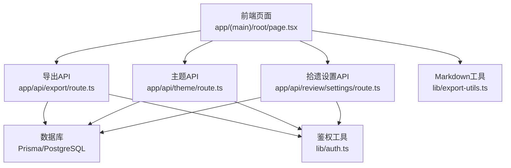
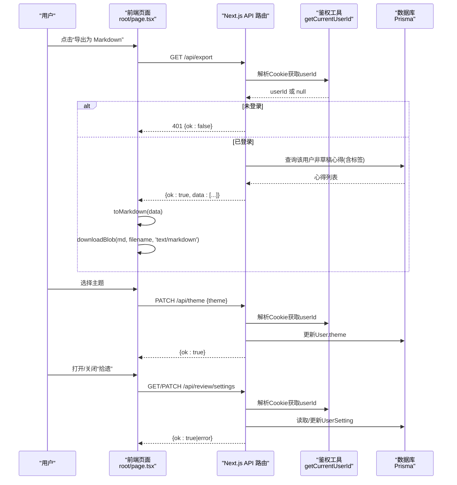
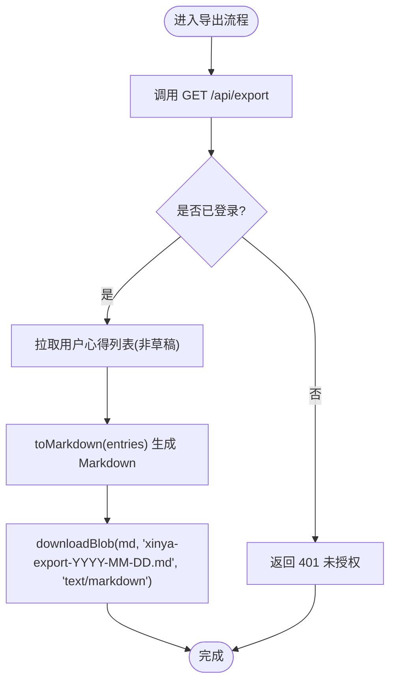
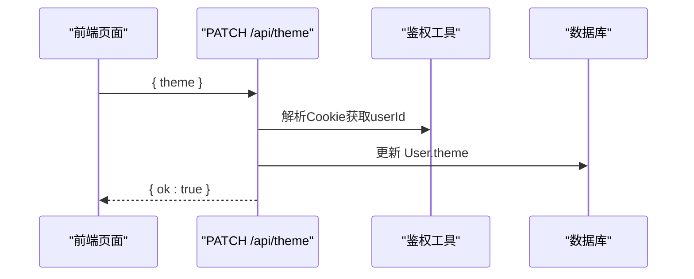
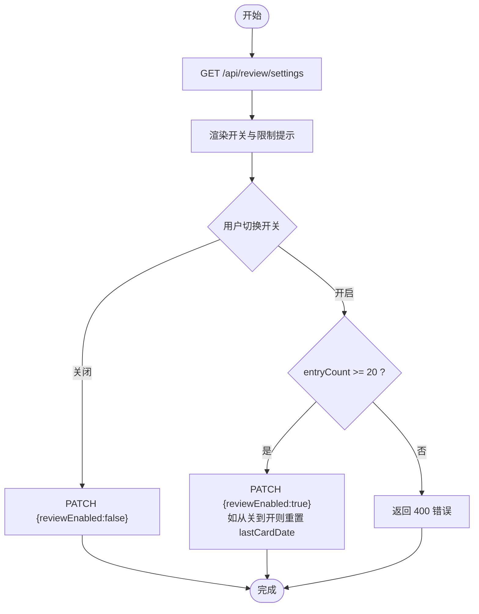
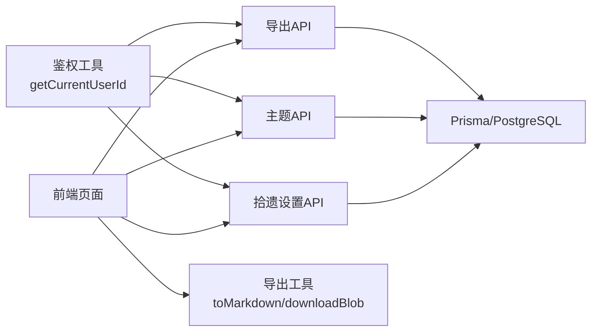

# 系统管理API

<cite>
**本文引用的文件**
- [app/api/export/route.ts](file://app/api/export/route.ts)
- [lib/export-utils.ts](file://lib/export-utils.ts)
- [app/(main)/root/page.tsx](file://app/(main)/root/page.tsx)
- [app/api/theme/route.ts](file://app/api/theme/route.ts)
- [prisma/schema.prisma](file://prisma/schema.prisma)
- [lib/auth.ts](file://lib/auth.ts)
- [app/api/review/settings/route.ts](file://app/api/review/settings/route.ts)
- [doc/新芽dev-framework.md](file://doc/新芽dev-framework.md)
</cite>

## 目录
1. [简介](#简介)
2. [项目结构](#项目结构)
3. [核心组件](#核心组件)
4. [架构总览](#架构总览)
5. [详细组件分析](#详细组件分析)
6. [依赖分析](#依赖分析)
7. [性能考虑](#性能考虑)
8. [故障排查指南](#故障排查指南)
9. [结论](#结论)
10. [附录](#附录)

## 简介
本文件为心芽项目的“系统管理”相关 API 接口文档，聚焦以下能力：
- 数据导出：后端导出 JSON、前端生成 Markdown 并下载
- 主题切换：配置管理与持久化存储机制
- 用户偏好与系统设置：以“拾遗”开关为例的偏好管理
- 文件上传下载：当前实现基于浏览器端 Blob 下载；未提供服务端上传接口
- 监控与健康检查：应用运行即健康（无专用健康检查路由）
- 版本管理与更新检查：前端内置变更日志展示，未提供服务端版本/更新检查接口

说明：
- 所有需要鉴权的接口均通过 Cookie 中的 JWT 进行身份校验。
- 涉及数据库读写使用 Prisma Client，模型定义见 schema.prisma。

## 项目结构
与系统管理相关的代码主要分布在以下位置：
- API 路由：app/api/*
- 工具函数：lib/export-utils.ts
- 前端页面调用：app/(main)/root/page.tsx
- 数据模型：prisma/schema.prisma
- 鉴权工具：lib/auth.ts
- 设计参考：doc/新芽dev-framework.md

图示来源
- [app/(main)/root/page.tsx](file://app/(main)/root/page.tsx)
- [app/api/export/route.ts](file://app/api/export/route.ts)
- [app/api/theme/route.ts](file://app/api/theme/route.ts)
- [app/api/review/settings/route.ts](file://app/api/review/settings/route.ts)
- [lib/export-utils.ts](file://lib/export-utils.ts)
- [lib/auth.ts](file://lib/auth.ts)
- [prisma/schema.prisma](file://prisma/schema.prisma)

章节来源
- [doc/新芽dev-framework.md](file://doc/新芽dev-framework.md)

## 核心组件
- 导出服务
  - 后端导出：GET /api/export，返回当前用户的非草稿心得列表（含标签名等字段）。
  - 前端导出：调用后端接口后，使用 toMarkdown 将数据转换为 Markdown，并通过 downloadBlob 触发浏览器下载。
- 主题服务
  - PATCH /api/theme：接收 theme 值，校验枚举范围后写入 User.theme，实现主题持久化。
- 用户偏好与系统设置
  - GET/PATCH /api/review/settings：获取或更新“拾遗”功能开关，包含开启条件校验（累计心得≥20条），以及从关闭到开启时重置 lastCardDate 的逻辑。
- 鉴权
  - getCurrentUserId：从 Cookie 中读取 token 并解析出 userId，供各受保护接口使用。
- 数据模型
  - User：包含 theme、onboardDone、openTimes 等用户级配置。
  - UserSetting：包含 reviewEnabled、lastCardDate、lastQuestionId 等偏好与状态。

章节来源
- [app/api/export/route.ts](file://app/api/export/route.ts)
- [lib/export-utils.ts](file://lib/export-utils.ts)
- [app/(main)/root/page.tsx](file://app/(main)/root/page.tsx)
- [app/api/theme/route.ts](file://app/api/theme/route.ts)
- [app/api/review/settings/route.ts](file://app/api/review/settings/route.ts)
- [lib/auth.ts](file://lib/auth.ts)
- [prisma/schema.prisma](file://prisma/schema.prisma)

## 架构总览
下图展示了系统管理相关接口的端到端流程：前端发起请求，后端进行鉴权与业务处理，必要时读写数据库，最终返回结构化响应。

图示来源
- [app/(main)/root/page.tsx](file://app/(main)/root/page.tsx)
- [app/api/export/route.ts](file://app/api/export/route.ts)
- [app/api/theme/route.ts](file://app/api/theme/route.ts)
- [app/api/review/settings/route.ts](file://app/api/review/settings/route.ts)
- [lib/auth.ts](file://lib/auth.ts)
- [prisma/schema.prisma](file://prisma/schema.prisma)

## 详细组件分析

### 数据导出接口（JSON + Markdown）
- 接口定义
  - GET /api/export
  - 鉴权：需要登录（Cookie 携带 JWT）
  - 返回：{ ok: boolean, data: ExportEntry[] }
  - 字段说明：id、title、content、tags(name[])、mood、recordTime、createdAt、isTop、isFavorite
- 前端处理
  - 调用 /api/export 获取 data
  - 使用 toMarkdown(entries) 生成 Markdown 文本
  - 使用 downloadBlob(content, filename, 'text/markdown') 触发浏览器下载
- 复杂度与性能
  - 查询复杂度 O(n)，n 为用户非草稿心得数量
  - 建议对大数据量场景增加分页或流式导出（当前未实现）
- 错误处理
  - 未登录：返回 401
  - 其他异常：由 NextResponse 默认处理

图示来源
- [app/api/export/route.ts](file://app/api/export/route.ts)
- [lib/export-utils.ts](file://lib/export-utils.ts)
- [app/(main)/root/page.tsx](file://app/(main)/root/page.tsx)

章节来源
- [app/api/export/route.ts](file://app/api/export/route.ts)
- [lib/export-utils.ts](file://lib/export-utils.ts)
- [app/(main)/root/page.tsx](file://app/(main)/root/page.tsx)

### 主题切换接口（配置管理与持久化）
- 接口定义
  - PATCH /api/theme
  - 请求体：{ theme: string }，允许值：spring | summer | autumn | winter | night
  - 鉴权：需要登录
  - 返回：{ ok: boolean } 或 { ok: false, error: "无效主题" }
- 持久化
  - 将 theme 写入 User 表对应字段
- 前端交互
  - 选择主题后立即本地应用，同时异步保存至服务器
  - 保存成功后显示“✓ 已切换”提示

图示来源
- [app/api/theme/route.ts](file://app/api/theme/route.ts)
- [lib/auth.ts](file://lib/auth.ts)
- [prisma/schema.prisma](file://prisma/schema.prisma)
- [app/(main)/root/page.tsx](file://app/(main)/root/page.tsx)

章节来源
- [app/api/theme/route.ts](file://app/api/theme/route.ts)
- [app/(main)/root/page.tsx](file://app/(main)/root/page.tsx)
- [prisma/schema.prisma](file://prisma/schema.prisma)

### 用户偏好与系统设置（以“拾遗”开关为例）
- 接口定义
  - GET /api/review/settings
    - 返回：{ ok: true, data: { reviewEnabled: boolean, entryCount: number } }
  - PATCH /api/review/settings
    - 请求体：{ reviewEnabled: boolean }
    - 规则：若开启且 entryCount < 20，返回 400 错误
    - 行为：当从关闭变为开启时，重置 lastCardDate
- 数据模型
  - UserSetting.reviewEnabled、lastCardDate、lastQuestionId
- 前端交互
  - 根据 entryCount 控制是否可开启
  - 切换后刷新本地状态

图示来源
- [app/api/review/settings/route.ts](file://app/api/review/settings/route.ts)
- [prisma/schema.prisma](file://prisma/schema.prisma)
- [app/(main)/root/page.tsx](file://app/(main)/root/page.tsx)

章节来源
- [app/api/review/settings/route.ts](file://app/api/review/settings/route.ts)
- [prisma/schema.prisma](file://prisma/schema.prisma)
- [app/(main)/root/page.tsx](file://app/(main)/root/page.tsx)

### 文件上传与下载
- 下载
  - 当前实现：前端通过 Blob 与 a.download 触发下载（Markdown 导出）
  - 适用场景：小体积文本导出
- 上传
  - 当前仓库未提供文件上传 API 路由
  - 如需支持图片/附件上传，需新增服务端路由与存储策略（对象存储或本地磁盘），并增加类型、大小、白名单校验

章节来源
- [lib/export-utils.ts](file://lib/export-utils.ts)
- [app/(main)/root/page.tsx](file://app/(main)/root/page.tsx)

### 系统监控与健康检查
- 现状
  - 未提供专用健康检查路由
  - 应用运行即视为健康（Next.js 默认静态资源与服务可用）
- 建议
  - 可新增 /api/health 返回简单状态码与时间戳，便于探针探测

[本节为通用建议，不直接分析具体文件]

### 版本管理与更新检查
- 现状
  - 前端内置 CHANGELOGS 列表用于展示版本更新信息
  - 未提供服务端版本/更新检查接口
- 建议
  - 可新增 /api/version 返回当前版本号与最新可用版本，配合前端提示升级

章节来源
- [app/(main)/root/page.tsx](file://app/(main)/root/page.tsx)

## 依赖分析
- 鉴权依赖
  - 所有受保护接口通过 getCurrentUserId 从 Cookie 中解析 JWT，失败则返回 401
- 数据库依赖
  - 导出：Entry 与 Tag 关联查询
  - 主题：User.theme 更新
  - 拾遗设置：UserSetting.upsert 与计数统计
- 前端依赖
  - 导出：toMarkdown、downloadBlob
  - 主题：立即本地应用并异步保存
  - 拾遗：根据 entryCount 控制开关

图示来源
- [lib/auth.ts](file://lib/auth.ts)
- [app/api/export/route.ts](file://app/api/export/route.ts)
- [app/api/theme/route.ts](file://app/api/theme/route.ts)
- [app/api/review/settings/route.ts](file://app/api/review/settings/route.ts)
- [lib/export-utils.ts](file://lib/export-utils.ts)
- [app/(main)/root/page.tsx](file://app/(main)/root/page.tsx)
- [prisma/schema.prisma](file://prisma/schema.prisma)

章节来源
- [lib/auth.ts](file://lib/auth.ts)
- [prisma/schema.prisma](file://prisma/schema.prisma)

## 性能考虑
- 导出接口
  - 全量导出在数据量大时可能较慢，建议后续引入分页、增量导出或后台任务+通知下载
- 主题切换
  - 单次更新开销极小，注意并发更新时的幂等性（当前按 userId 唯一键更新，天然幂等）
- 拾遗设置
  - 计数统计 count(*) 开销较低，但频繁切换时可缓存 entryCount 于前端

[本节为通用建议，不直接分析具体文件]

## 故障排查指南
- 401 未登录
  - 检查 Cookie 是否存在且有效（JWT 未过期）
  - 确认 getCurrentUserId 能正确解析出 userId
- 400 参数错误
  - 主题值不在允许集合内
  - 拾遗开启但 entryCount < 20
- 500 服务器错误
  - 查看控制台日志输出（例如 ReviewSettings 的错误日志）
  - 检查数据库连接与权限

章节来源
- [lib/auth.ts](file://lib/auth.ts)
- [app/api/theme/route.ts](file://app/api/theme/route.ts)
- [app/api/review/settings/route.ts](file://app/api/review/settings/route.ts)

## 结论
- 系统管理相关能力已覆盖数据导出、主题持久化与用户偏好设置
- 当前未实现文件上传、健康检查与版本/更新检查的服务端接口
- 建议在后续迭代中补充：
  - 文件上传与存储安全策略
  - 健康检查与监控指标
  - 版本信息与更新检查接口
  - 导出性能优化（分页/增量/异步）

[本节为总结，不直接分析具体文件]

## 附录
- API 清单（节选）
  - GET /api/export
  - PATCH /api/theme
  - GET /api/review/settings
  - PATCH /api/review/settings

章节来源
- [doc/新芽dev-framework.md](file://doc/新芽dev-framework.md)