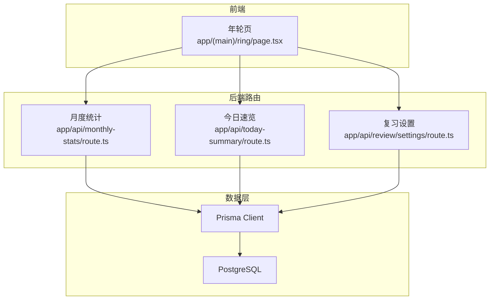
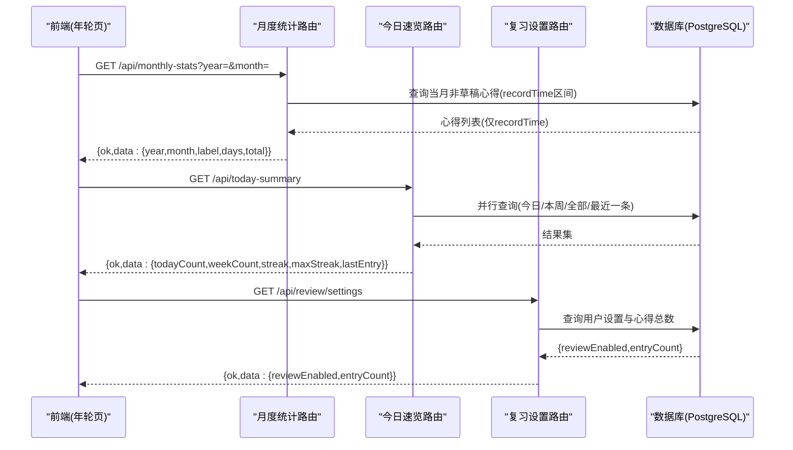
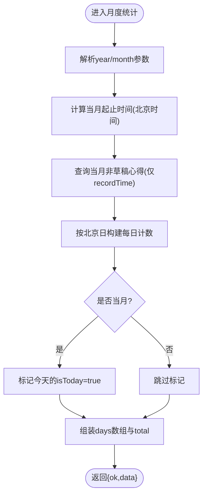
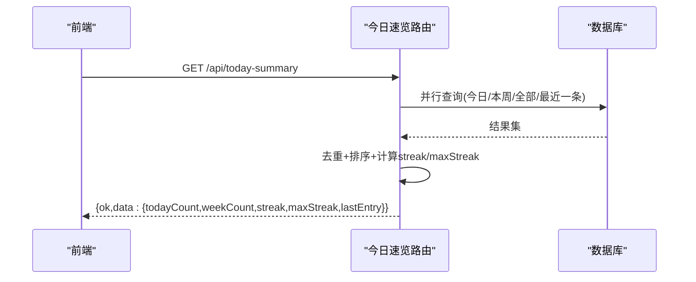
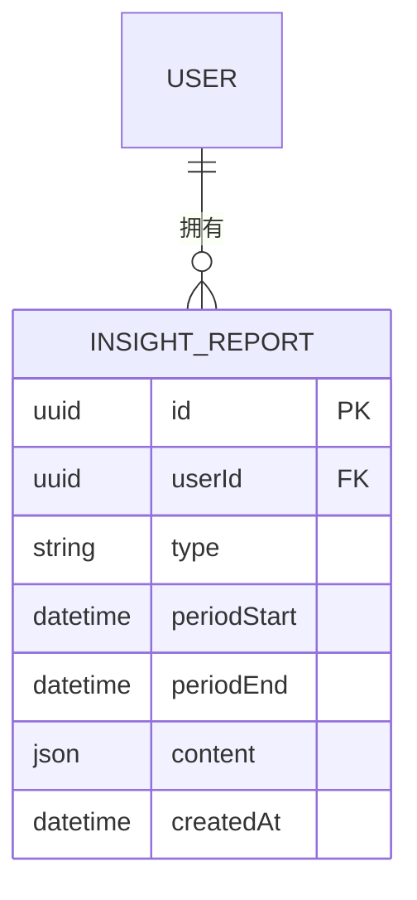
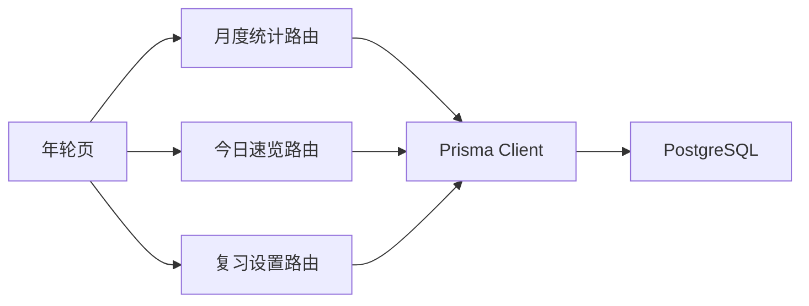

# 统计分析API

<cite>
**本文引用的文件**   
- [app/api/monthly-stats/route.ts](file://app/api/monthly-stats/route.ts)
- [app/api/today-summary/route.ts](file://app/api/today-summary/route.ts)
- [prisma/schema.prisma](file://prisma/schema.prisma)
- [lib/review-scheduler.ts](file://lib/review-scheduler.ts)
- [app/api/review/settings/route.ts](file://app/api/review/settings/route.ts)
- [app/(main)/ring/page.tsx](file://app/(main)/ring/page.tsx)
</cite>

## 目录
1. [简介](#简介)
2. [项目结构](#项目结构)
3. [核心组件](#核心组件)
4. [架构总览](#架构总览)
5. [详细组件分析](#详细组件分析)
6. [依赖分析](#依赖分析)
7. [性能考虑](#性能考虑)
8. [故障排查指南](#故障排查指南)
9. [结论](#结论)
10. [附录](#附录)

## 简介
本文件为心芽项目的“统计分析系统”提供面向前端的 API 接口文档，覆盖以下能力：
- 月度统计数据获取：学习天数、心得数量、日均篇数等指标的计算与返回格式。
- 今日速览接口：数据结构与实时计算逻辑（连续记录、周/日统计、最近一条心得）。
- 成长洞察报告：生成时机、存储模型与查看方式说明。
- 数据可视化图表的数据格式规范：热力图、趋势图等所需字段约定。
- 缓存策略与性能优化方案：基于数据库索引与并发查询的优化建议。
- 自定义统计维度与时间范围：通过查询参数实现按年/月筛选，并给出扩展建议。

## 项目结构
统计分析相关的前端页面与后端路由分布如下：
- 前端展示：年轮页（热力图）位于 app/(main)/ring/page.tsx，调用月度统计接口。
- 后端接口：
  - 月度统计：app/api/monthly-stats/route.ts
  - 今日速览：app/api/today-summary/route.ts
  - 复习设置（用于累计篇数等）：app/api/review/settings/route.ts
- 数据模型：prisma/schema.prisma 定义了 Entry、Tag、InsightReport 等核心实体。

**图示来源**
- [app/(main)/ring/page.tsx](file://app/(main)/ring/page.tsx)
- [app/api/monthly-stats/route.ts](file://app/api/monthly-stats/route.ts)
- [app/api/today-summary/route.ts](file://app/api/today-summary/route.ts)
- [app/api/review/settings/route.ts](file://app/api/review/settings/route.ts)
- [prisma/schema.prisma](file://prisma/schema.prisma)

**章节来源**
- [app/(main)/ring/page.tsx](file://app/(main)/ring/page.tsx)
- [app/api/monthly-stats/route.ts](file://app/api/monthly-stats/route.ts)
- [app/api/today-summary/route.ts](file://app/api/today-summary/route.ts)
- [app/api/review/settings/route.ts](file://app/api/review/settings/route.ts)
- [prisma/schema.prisma](file://prisma/schema.prisma)

## 核心组件
- 月度统计接口：按北京时间自然月聚合非草稿心得，输出每日计数、当月总数、标签与日期标识等。
- 今日速览接口：并行查询当日、本周、历史数据，计算连续记录与最长连续记录，返回最近一条心得摘要。
- 复习设置接口：返回累计心得数与拾遗开关状态，供前端展示“累计篇数”等辅助信息。

**章节来源**
- [app/api/monthly-stats/route.ts](file://app/api/monthly-stats/route.ts)
- [app/api/today-summary/route.ts](file://app/api/today-summary/route.ts)
- [app/api/review/settings/route.ts](file://app/api/review/settings/route.ts)

## 架构总览
下图展示了从前端到数据库的关键调用路径与数据流向。

**图示来源**
- [app/(main)/ring/page.tsx](file://app/(main)/ring/page.tsx)
- [app/api/monthly-stats/route.ts](file://app/api/monthly-stats/route.ts)
- [app/api/today-summary/route.ts](file://app/api/today-summary/route.ts)
- [app/api/review/settings/route.ts](file://app/api/review/settings/route.ts)
- [prisma/schema.prisma](file://prisma/schema.prisma)

## 详细组件分析

### 月度统计数据接口
- 接口地址：GET /api/monthly-stats
- 认证要求：需要登录态（未登录返回未认证错误）
- 查询参数
  - year: 可选，整数，默认当前北京时间的年
  - month: 可选，整数，默认当前北京时间的月
- 返回结构
  - ok: boolean
  - data:
    - year: number
    - month: number
    - label: string，如“2026年1月”
    - days: Array<{ day: number; count: number; isToday: boolean }>
      - day: 1..N（当月天数）
      - count: 当天非草稿心得数
      - isToday: 是否为今天（仅当月时生效）
    - total: number，当月非草稿心得总数
- 计算规则
  - 时间基准：统一使用北京时间（Asia/Shanghai），以 UTC+8 边界划分自然日。
  - 统计范围：当月第一天至下个月第一天的左闭右开区间。
  - 过滤条件：isDraft=false；仅统计非草稿心得。
  - 每日计数：将每条心得的 recordTime 转换为北京时间的日，累加到对应 day。
  - 标记今天：若请求月份等于当前北京月份，则把当天的 isToday 置为 true。
- 前端使用示例
  - 年轮页在切换年月时调用该接口，渲染热力图与统计卡片（本月篇数、记录天数、日均篇数）。

**图示来源**
- [app/api/monthly-stats/route.ts](file://app/api/monthly-stats/route.ts)

**章节来源**
- [app/api/monthly-stats/route.ts](file://app/api/monthly-stats/route.ts)
- [app/(main)/ring/page.tsx](file://app/(main)/ring/page.tsx)

### 今日速览接口
- 接口地址：GET /api/today-summary
- 认证要求：需要登录态（未登录返回未认证错误）
- 返回结构
  - ok: boolean
  - data:
    - todayCount: number，当日非草稿心得数
    - weekCount: number，本周（周一为起始）非草稿心得数
    - streak: number，最近有效连续记录天数（必须包含今天或昨天）
    - maxStreak: number，历史最长连续记录天数
    - lastEntry: object|null，最近一条非草稿心得（含title等字段）
- 计算规则
  - 时间基准：统一使用北京时间。
  - 周起始：以周一为本周第一天。
  - 并行查询：同时拉取今日、本周、全部心得与最近一条心得，减少往返延迟。
  - 连续记录：
    - 去重并按日期倒序排序，遍历计算连续段。
    - 最近连续段需从“今天或昨天”开始才视为有效，否则streak为0。
    - 历史最长连续段在所有断点处更新最大值。
- 前端使用示例
  - 根系页或首页展示“今日篇数、本周篇数、连续记录、历史最长连续、最近一条心得”。

**图示来源**
- [app/api/today-summary/route.ts](file://app/api/today-summary/route.ts)

**章节来源**
- [app/api/today-summary/route.ts](file://app/api/today-summary/route.ts)

### 复习设置接口（累计篇数等）
- 接口地址：GET /api/review/settings
- 认证要求：需要登录态
- 返回结构
  - ok: boolean
  - data:
    - reviewEnabled: boolean，是否开启“拾遗”功能
    - entryCount: number，用户累计心得数
- 用途
  - 年轮页展示“累计篇数”，并根据开关状态控制拾遗入口可用性。

**章节来源**
- [app/api/review/settings/route.ts](file://app/api/review/settings/route.ts)
- [app/(main)/ring/page.tsx](file://app/(main)/ring/page.tsx)

### 成长洞察报告
- 生成时机
  - 每周一次：每周一早6点生成上周报告
  - 每月一次：每月1日早6点生成上月报告
- 存储模型
  - InsightReport 表包含 userId、type（如“weekly”、“monthly”）、periodStart、periodEnd、content(Json)、createdAt 等字段。
  - 唯一约束：同一用户同类型+同周期起点不可重复。
- 查看入口
  - 在“根系页”查看已生成的洞察报告。
- 内容模板
  - content 字段为 JSON，可包含标题、关键指标、趋势摘要、标签分布、建议等结构化内容。
  - 具体字段由业务侧定义，前端按模板渲染。

**图示来源**
- [prisma/schema.prisma](file://prisma/schema.prisma)

**章节来源**
- [prisma/schema.prisma](file://prisma/schema.prisma)

### 数据可视化图表的数据格式规范
- 热力图（GitHub风格）
  - 数据来源：月度统计接口的 days 数组
  - 字段约定：
    - day: number，1..N
    - count: number，当天心得数
    - isToday: boolean，是否今天
  - 颜色档位（前端映射）：
    - 0篇：空白/灰框
    - 1篇：浅绿
    - 2篇：中绿
    - 3篇及以上：深绿
  - 交互：点击格子显示悬浮提示“X日 · Y 篇心得”，不跳转页面。
- 趋势图（周/月折线）
  - 数据来源：可复用月度统计的 days 序列，或扩展新增“按周聚合”的接口。
  - 字段约定：
    - x: 时间轴（日期字符串或序号）
    - y: 数值（心得数）
  - 建议：如需周粒度，可在后端新增按周聚合接口，或在前端对 days 进行合并。

**章节来源**
- [app/api/monthly-stats/route.ts](file://app/api/monthly-stats/route.ts)
- [app/(main)/ring/page.tsx](file://app/(main)/ring/page.tsx)

### 自定义统计维度与时间范围
- 现有支持
  - 月度统计：通过 year、month 参数选择任意自然月。
  - 今日速览：固定为“今日/本周/历史全量”的组合视图。
- 扩展建议
  - 新增“自定义时间范围”查询参数：
    - startDate: 起始日期（YYYY-MM-DD）
    - endDate: 结束日期（YYYY-MM-DD）
  - 新增“维度聚合”参数：
    - groupBy: daily | weekly | monthly
  - 返回结构可扩展：
    - series: [{ date, value }] 用于趋势图
    - tags: [{ name, count }] 用于标签分布
  - 注意：所有时间边界均按北京时间处理，避免跨日误差。

[本节为概念性扩展建议，不直接分析具体文件]

## 依赖分析
- 模块耦合
  - 月度统计与今日速览均依赖 Prisma Client 访问 PostgreSQL。
  - 今日速览采用 Promise.all 并行查询，降低整体响应时间。
  - 年轮页前端依赖月度统计与复习设置两个接口完成展示。
- 外部依赖
  - DeepSeek 题目生成与复习调度属于“复习”子系统，与统计分析无直接耦合，但共享 Entry/Tag 数据源。

**图示来源**
- [app/api/monthly-stats/route.ts](file://app/api/monthly-stats/route.ts)
- [app/api/today-summary/route.ts](file://app/api/today-summary/route.ts)
- [app/api/review/settings/route.ts](file://app/api/review/settings/route.ts)
- [app/(main)/ring/page.tsx](file://app/(main)/ring/page.tsx)
- [prisma/schema.prisma](file://prisma/schema.prisma)

**章节来源**
- [app/api/monthly-stats/route.ts](file://app/api/monthly-stats/route.ts)
- [app/api/today-summary/route.ts](file://app/api/today-summary/route.ts)
- [app/api/review/settings/route.ts](file://app/api/review/settings/route.ts)
- [app/(main)/ring/page.tsx](file://app/(main)/ring/page.tsx)
- [prisma/schema.prisma](file://prisma/schema.prisma)

## 性能考虑
- 数据库索引
  - Entry 表已建立多组索引，包括按 userId+recordTime、userId+isTop、userId+isFavorite、userId+isDraft 等，有利于快速过滤与排序。
- 查询优化
  - 今日速览使用 Promise.all 并行查询，显著降低 I/O 等待。
  - 月度统计仅 select recordTime，减少数据传输体积。
- 时间处理
  - 统一使用北京时间工具函数，避免跨时区导致的边界误差。
- 缓存策略建议
  - 短期缓存：对热门月份（如当月）增加内存级缓存（TTL 5~10分钟），降低重复查询压力。
  - 长期缓存：对历史月份可引入 Redis 或对象存储缓存，结合 ETag/Last-Modified 机制。
  - 增量更新：当有新心得写入时，异步刷新对应月份的缓存条目。
- 前端优化
  - 分页/懒加载：对于超长历史月份，可按周或按月分段加载。
  - 防抖与节流：切换年月时避免频繁请求。

**章节来源**
- [prisma/schema.prisma](file://prisma/schema.prisma)
- [app/api/today-summary/route.ts](file://app/api/today-summary/route.ts)
- [app/api/monthly-stats/route.ts](file://app/api/monthly-stats/route.ts)

## 故障排查指南
- 未登录错误
  - 现象：返回未认证错误（401）。
  - 排查：确认会话/鉴权中间件是否正确注入 userId。
- 数据为空
  - 现象：月度统计 days 全为 0，或今日速览 todayCount=0。
  - 排查：检查 recordTime 是否在目标时间范围内；确认 isDraft=false 过滤是否符合预期。
- 连续记录异常
  - 现象：streak 或 maxStreak 不符合预期。
  - 排查：确认日期去重与排序逻辑；验证“今天/昨天”起始判定与相邻日期差值计算。
- 性能问题
  - 现象：接口响应慢。
  - 排查：观察数据库慢查询日志；确认索引命中；评估是否引入缓存。

**章节来源**
- [app/api/monthly-stats/route.ts](file://app/api/monthly-stats/route.ts)
- [app/api/today-summary/route.ts](file://app/api/today-summary/route.ts)

## 结论
- 月度统计与今日速览接口已具备稳定的数据计算与返回结构，满足热力图与速览展示需求。
- 成长洞察报告的存储模型与生成时机明确，便于后续接入 AI 分析与模板渲染。
- 建议在现有基础上补充“自定义时间范围与维度聚合”的查询能力，并引入多级缓存以提升性能。

## 附录
- 术语
  - 心得：用户记录的笔记/文章，对应 Entry 实体。
  - 拾遗：复习提醒功能，通过复习设置接口控制开关。
- 参考
  - 设计文档中对年轮页的规则与空状态文案有详细说明，可作为前端实现的依据。