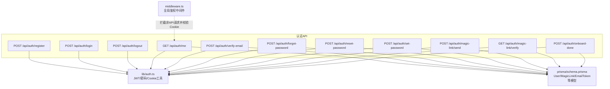
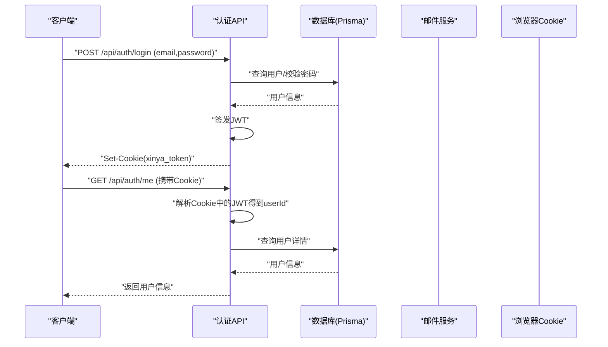
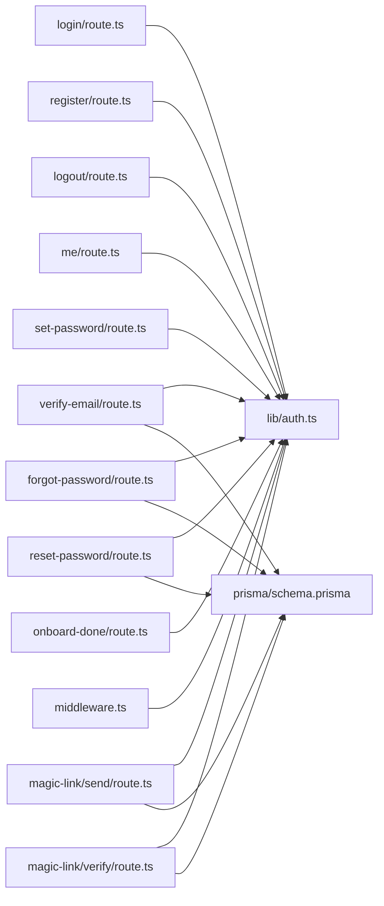

# 认证API

<cite>
**本文引用的文件**   
- [app/api/auth/login/route.ts](file://app/api/auth/login/route.ts)
- [app/api/auth/register/route.ts](file://app/api/auth/register/route.ts)
- [app/api/auth/logout/route.ts](file://app/api/auth/logout/route.ts)
- [app/api/auth/me/route.ts](file://app/api/auth/me/route.ts)
- [app/api/auth/verify-email/route.ts](file://app/api/auth/verify-email/route.ts)
- [app/api/auth/forgot-password/route.ts](file://app/api/auth/forgot-password/route.ts)
- [app/api/auth/reset-password/route.ts](file://app/api/auth/reset-password/route.ts)
- [app/api/auth/set-password/route.ts](file://app/api/auth/set-password/route.ts)
- [app/api/auth/magic-link/send/route.ts](file://app/api/auth/magic-link/send/route.ts)
- [app/api/auth/magic-link/verify/route.ts](file://app/api/auth/magic-link/verify/route.ts)
- [app/api/auth/onboard-done/route.ts](file://app/api/auth/onboard-done/route.ts)
- [lib/auth.ts](file://lib/auth.ts)
- [middleware.ts](file://middleware.ts)
- [lib/utils.ts](file://lib/utils.ts)
- [prisma/schema.prisma](file://prisma/schema.prisma)
</cite>

## 目录
1. [简介](#简介)
2. [项目结构](#项目结构)
3. [核心组件](#核心组件)
4. [架构总览](#架构总览)
5. [详细接口说明](#详细接口说明)
6. [依赖分析](#依赖分析)
7. [性能与安全考虑](#性能与安全考虑)
8. [故障排查指南](#故障排查指南)
9. [结论](#结论)
10. [附录：客户端集成与最佳实践](#附录客户端集成与最佳实践)

## 简介
本文件为心芽项目的认证系统提供完整的RESTful API文档，覆盖用户注册、登录、登出、获取当前用户信息、邮箱验证码验证、密码重置、首次设置密码、Magic Link无密码登录以及引导完成标记等能力。同时包含JWT令牌管理机制、中间件鉴权策略、数据模型关系及客户端集成建议。

## 项目结构
认证相关API采用Next.js App Router的Route Handlers组织，位于 app/api/auth 目录下；通用认证逻辑集中在 lib/auth.ts；全局路由中间件在 middleware.ts；数据库模型定义在 prisma/schema.prisma。

图表来源
- [app/api/auth/register/route.ts:1-56](file://app/api/auth/register/route.ts#L1-L56)
- [app/api/auth/login/route.ts:1-39](file://app/api/auth/login/route.ts#L1-L39)
- [app/api/auth/logout/route.ts:1-10](file://app/api/auth/logout/route.ts#L1-L10)
- [app/api/auth/me/route.ts:1-18](file://app/api/auth/me/route.ts#L1-L18)
- [app/api/auth/verify-email/route.ts:1-38](file://app/api/auth/verify-email/route.ts#L1-L38)
- [app/api/auth/forgot-password/route.ts:1-34](file://app/api/auth/forgot-password/route.ts#L1-L34)
- [app/api/auth/reset-password/route.ts:1-31](file://app/api/auth/reset-password/route.ts#L1-L31)
- [app/api/auth/set-password/route.ts:1-27](file://app/api/auth/set-password/route.ts#L1-L27)
- [app/api/auth/magic-link/send/route.ts:1-47](file://app/api/auth/magic-link/send/route.ts#L1-L47)
- [app/api/auth/magic-link/verify/route.ts:1-70](file://app/api/auth/magic-link/verify/route.ts#L1-L70)
- [app/api/auth/onboard-done/route.ts:1-18](file://app/api/auth/onboard-done/route.ts#L1-L18)
- [lib/auth.ts:1-56](file://lib/auth.ts#L1-L56)
- [middleware.ts:1-29](file://middleware.ts#L1-L29)
- [prisma/schema.prisma:1-209](file://prisma/schema.prisma#L1-L209)

章节来源
- [app/api/auth/register/route.ts:1-56](file://app/api/auth/register/route.ts#L1-L56)
- [app/api/auth/login/route.ts:1-39](file://app/api/auth/login/route.ts#L1-L39)
- [app/api/auth/logout/route.ts:1-10](file://app/api/auth/logout/route.ts#L1-L10)
- [app/api/auth/me/route.ts:1-18](file://app/api/auth/me/route.ts#L1-L18)
- [app/api/auth/verify-email/route.ts:1-38](file://app/api/auth/verify-email/route.ts#L1-L38)
- [app/api/auth/forgot-password/route.ts:1-34](file://app/api/auth/forgot-password/route.ts#L1-L34)
- [app/api/auth/reset-password/route.ts:1-31](file://app/api/auth/reset-password/route.ts#L1-L31)
- [app/api/auth/set-password/route.ts:1-27](file://app/api/auth/set-password/route.ts#L1-L27)
- [app/api/auth/magic-link/send/route.ts:1-47](file://app/api/auth/magic-link/send/route.ts#L1-L47)
- [app/api/auth/magic-link/verify/route.ts:1-70](file://app/api/auth/magic-link/verify/route.ts#L1-L70)
- [app/api/auth/onboard-done/route.ts:1-18](file://app/api/auth/onboard-done/route.ts#L1-L18)
- [lib/auth.ts:1-56](file://lib/auth.ts#L1-L56)
- [middleware.ts:1-29](file://middleware.ts#L1-L29)
- [prisma/schema.prisma:1-209](file://prisma/schema.prisma#L1-L209)

## 核心组件
- JWT与Cookie管理
  - 生成/验证JWT、从Cookie读取当前用户ID、Cookie配置（名称、有效期、SameSite、Path等）。
- 密码处理
  - 密码哈希与校验。
- 全局中间件
  - 对非API页面进行登录态检查，未登录时重定向至登录页。
- 数据模型
  - User、EmailToken、MagicLink 等用于存储用户、验证码/重置令牌、Magic Link令牌。

章节来源
- [lib/auth.ts:1-56](file://lib/auth.ts#L1-L56)
- [middleware.ts:1-29](file://middleware.ts#L1-L29)
- [prisma/schema.prisma:10-31](file://prisma/schema.prisma#L10-L31)
- [prisma/schema.prisma:124-148](file://prisma/schema.prisma#L124-L148)

## 架构总览
认证流程围绕“凭据/链接 -> 服务端校验 -> 签发JWT到Cookie -> 后续请求携带Cookie”的模式展开。所有受保护资源通过中间件或接口内部校验Cookie中的JWT来识别用户身份。

图表来源
- [app/api/auth/login/route.ts:1-39](file://app/api/auth/login/route.ts#L1-L39)
- [app/api/auth/me/route.ts:1-18](file://app/api/auth/me/route.ts#L1-L18)
- [lib/auth.ts:1-56](file://lib/auth.ts#L1-L56)

## 详细接口说明

### 通用约定
- 内容类型：application/json
- 成功响应体统一包含 ok 字段；部分接口使用 data 包裹业务数据
- 错误响应体包含 error 字段
- 状态码遵循HTTP语义，具体见各接口

### 注册
- 方法：POST
- 路径：/api/auth/register
- 请求体
  - email: string，必填，邮箱格式校验
  - password: string，必填，长度至少6位
- 响应
  - 成功：{ ok: true, data: { userId: string } }
  - 失败：{ ok: false, error: string }
- 状态码
  - 200：成功
  - 400：参数缺失/格式错误/已注册
  - 500：服务器错误
- 行为说明
  - 若邮箱已存在但未验证，允许更新密码并重新发送验证码
  - 自动创建默认标签“随笔”
  - 生成6位验证码，有效期10分钟，写入 EmailToken
  - 发送邮件验证码

章节来源
- [app/api/auth/register/route.ts:1-56](file://app/api/auth/register/route.ts#L1-L56)
- [lib/utils.ts:1-9](file://lib/utils.ts#L1-L9)
- [prisma/schema.prisma:124-136](file://prisma/schema.prisma#L124-L136)

### 登录
- 方法：POST
- 路径：/api/auth/login
- 请求体
  - email: string，必填
  - password: string，必填
- 响应
  - 成功：{ ok: true, data: { onboardDone: boolean, theme: string } }
  - 失败：{ error: string }
- 状态码
  - 200：成功
  - 401：邮箱或密码错误 / 邮箱未验证（附带 needVerify 与 userId）
  - 500：服务器错误
- 行为说明
  - 校验邮箱是否存在且已验证
  - 校验密码
  - 签发JWT并写入Cookie（名称 xinya_token，有效期30天）
  - 增加 openTimes 计数

章节来源
- [app/api/auth/login/route.ts:1-39](file://app/api/auth/login/route.ts#L1-L39)
- [lib/auth.ts:18-43](file://lib/auth.ts#L18-L43)

### 登出
- 方法：POST
- 路径：/api/auth/logout
- 请求体：无
- 响应：{ ok: true }
- 状态码
  - 200：成功
- 行为说明
  - 删除Cookie中的xinya_token

章节来源
- [app/api/auth/logout/route.ts:1-10](file://app/api/auth/logout/route.ts#L1-L10)
- [lib/auth.ts:45-55](file://lib/auth.ts#L45-L55)

### 获取当前用户信息
- 方法：GET
- 路径：/api/auth/me
- 请求头：需携带Cookie xinya_token
- 响应
  - 成功：{ ok: true, data: { id, email, theme, onboardDone, openTimes } }
  - 失败：{ ok: false }
- 状态码
  - 200：成功
  - 401：未登录或令牌无效
- 行为说明
  - 从Cookie解析JWT获取userId，再查询用户信息

章节来源
- [app/api/auth/me/route.ts:1-18](file://app/api/auth/me/route.ts#L1-L18)
- [lib/auth.ts:32-43](file://lib/auth.ts#L32-L43)

### 邮箱验证码验证
- 方法：POST
- 路径：/api/auth/verify-email
- 请求体
  - userId: string，必填
  - code: string，必填，6位验证码
- 响应
  - 成功：{ ok: true }
  - 失败：{ ok: false, error: string }
- 状态码
  - 200：成功
  - 400：参数缺失/验证码不正确/已过期
  - 500：服务器错误
- 行为说明
  - 校验验证码有效性（未使用、未过期）
  - 标记验证码已使用
  - 标记用户已验证
  - 自动登录并设置Cookie

章节来源
- [app/api/auth/verify-email/route.ts:1-38](file://app/api/auth/verify-email/route.ts#L1-L38)
- [prisma/schema.prisma:124-136](file://prisma/schema.prisma#L124-L136)

### 忘记密码（发送重置邮件）
- 方法：POST
- 路径：/api/auth/forgot-password
- 请求体
  - email: string，必填
- 响应
  - 成功：{ ok: true }
  - 失败：{ ok: false, error: string }
- 状态码
  - 200：成功
  - 400：参数缺失
  - 500：服务器错误
- 行为说明
  - 不泄露用户是否存在
  - 生成一次性重置令牌，有效期30分钟，写入 EmailToken
  - 发送邮件包含重置链接

章节来源
- [app/api/auth/forgot-password/route.ts:1-34](file://app/api/auth/forgot-password/route.ts#L1-L34)
- [lib/utils.ts:6-9](file://lib/utils.ts#L6-L9)
- [prisma/schema.prisma:124-136](file://prisma/schema.prisma#L124-L136)

### 重置密码
- 方法：POST
- 路径：/api/auth/reset-password
- 请求体
  - token: string，必填，重置令牌
  - password: string，必填，长度至少6位
- 响应
  - 成功：{ ok: true }
  - 失败：{ ok: false, error: string }
- 状态码
  - 200：成功
  - 400：参数缺失/链接无效或已使用/已过期/密码过短
  - 500：服务器错误
- 行为说明
  - 校验重置令牌类型、是否已用、是否过期
  - 更新用户密码哈希，并将令牌标记为已使用

章节来源
- [app/api/auth/reset-password/route.ts:1-31](file://app/api/auth/reset-password/route.ts#L1-L31)
- [prisma/schema.prisma:124-136](file://prisma/schema.prisma#L124-L136)

### 设置密码（登录后）
- 方法：POST
- 路径：/api/auth/set-password
- 请求体
  - password: string，必填，长度至少6位
- 响应
  - 成功：{ ok: true }
  - 失败：{ error: string }
- 状态码
  - 200：成功
  - 400：参数缺失/密码过短
  - 401：未登录
  - 500：服务器错误
- 行为说明
  - 需要有效登录态（Cookie中JWT）
  - 更新用户密码哈希

章节来源
- [app/api/auth/set-password/route.ts:1-27](file://app/api/auth/set-password/route.ts#L1-L27)
- [lib/auth.ts:32-43](file://lib/auth.ts#L32-L43)

### Magic Link 发送
- 方法：POST
- 路径：/api/auth/magic-link/send
- 请求体
  - email: string，必填，邮箱格式校验
- 响应
  - 成功：{ ok: true, data: { email: string } }
  - 失败：{ ok: false, error: string }
- 状态码
  - 200：成功
  - 400：参数缺失/邮箱格式错误
  - 500：服务器错误
- 行为说明
  - 生成一次性随机token，有效期15分钟，写入 MagicLink
  - 清理该邮箱旧token
  - 构建Magic Link URL并发送邮件
  - 区分新用户/老用户以调整邮件文案

章节来源
- [app/api/auth/magic-link/send/route.ts:1-47](file://app/api/auth/magic-link/send/route.ts#L1-L47)
- [prisma/schema.prisma:138-148](file://prisma/schema.prisma#L138-L148)

### Magic Link 验证
- 方法：GET
- 路径：/api/auth/magic-link/verify?token=xxx
- 查询参数
  - token: string，必填
- 响应
  - 成功：重定向到应用首页或引导页，并设置Cookie
  - 失败：重定向到登录页并附带错误提示
- 状态码
  - 302：重定向
- 行为说明
  - 校验token存在、未使用、未过期
  - 新用户：自动创建账号并设置已验证，创建默认标签
  - 老用户：如未验证则自动验证
  - 签发JWT并设置Cookie，记录openTimes

章节来源
- [app/api/auth/magic-link/verify/route.ts:1-70](file://app/api/auth/magic-link/verify/route.ts#L1-L70)
- [lib/auth.ts:18-43](file://lib/auth.ts#L18-L43)
- [prisma/schema.prisma:138-148](file://prisma/schema.prisma#L138-L148)

### 引导完成标记
- 方法：POST
- 路径：/api/auth/onboard-done
- 请求体：无
- 响应
  - 成功：{ ok: true }
  - 失败：{ ok: false }
- 状态码
  - 200：成功
  - 401：未登录
- 行为说明
  - 测试账号（特定域名）始终不标记完成，每次登录走引导
  - 普通用户标记onboardDone为true

章节来源
- [app/api/auth/onboard-done/route.ts:1-18](file://app/api/auth/onboard-done/route.ts#L1-L18)

## 依赖分析
- 模块耦合
  - 所有认证API均依赖 lib/auth.ts 提供的JWT与Cookie工具
  - 涉及邮箱验证码/重置/Magic Link的接口依赖数据库模型 EmailToken 与 MagicLink
  - 全局中间件基于Cookie进行页面级鉴权
- 外部依赖
  - Prisma ORM访问PostgreSQL
  - 邮件服务（发送邮件验证码、重置链接、Magic Link）
  - bcryptjs 用于密码哈希
  - jsonwebtoken 用于JWT签发与校验

图表来源
- [lib/auth.ts:1-56](file://lib/auth.ts#L1-L56)
- [app/api/auth/login/route.ts:1-39](file://app/api/auth/login/route.ts#L1-L39)
- [app/api/auth/register/route.ts:1-56](file://app/api/auth/register/route.ts#L1-L56)
- [app/api/auth/logout/route.ts:1-10](file://app/api/auth/logout/route.ts#L1-L10)
- [app/api/auth/me/route.ts:1-18](file://app/api/auth/me/route.ts#L1-L18)
- [app/api/auth/verify-email/route.ts:1-38](file://app/api/auth/verify-email/route.ts#L1-L38)
- [app/api/auth/forgot-password/route.ts:1-34](file://app/api/auth/forgot-password/route.ts#L1-L34)
- [app/api/auth/reset-password/route.ts:1-31](file://app/api/auth/reset-password/route.ts#L1-L31)
- [app/api/auth/set-password/route.ts:1-27](file://app/api/auth/set-password/route.ts#L1-L27)
- [app/api/auth/magic-link/send/route.ts:1-47](file://app/api/auth/magic-link/send/route.ts#L1-L47)
- [app/api/auth/magic-link/verify/route.ts:1-70](file://app/api/auth/magic-link/verify/route.ts#L1-L70)
- [app/api/auth/onboard-done/route.ts:1-18](file://app/api/auth/onboard-done/route.ts#L1-L18)
- [middleware.ts:1-29](file://middleware.ts#L1-L29)
- [prisma/schema.prisma:124-148](file://prisma/schema.prisma#L124-L148)

章节来源
- [lib/auth.ts:1-56](file://lib/auth.ts#L1-L56)
- [middleware.ts:1-29](file://middleware.ts#L1-L29)
- [prisma/schema.prisma:124-148](file://prisma/schema.prisma#L124-L148)

## 性能与安全考虑
- 性能
  - 登录/注册/验证等接口包含一次或多次数据库读写，注意索引优化（EmailToken.token、MagicLink.token、MagicLink.email已有索引）
  - 避免重复发送验证码/重置链接，服务端会清理旧令牌
- 安全
  - 密码使用bcryptjs加盐哈希，强度固定
  - JWT有效期30天，HttpOnly Cookie降低XSS风险
  - 验证码/重置令牌具备过期时间与一次性使用标记
  - 中间件仅对页面路由做登录态检查，API层仍需自行校验（如 me、set-password）

[本节为通用指导，无需代码引用]

## 故障排查指南
- 常见错误
  - 401 未登录或令牌无效：检查Cookie是否携带、是否被浏览器策略拦截（跨域/第三方Cookie）
  - 400 参数缺失/格式错误：确认请求体字段与校验规则
  - 500 服务器错误：查看服务端日志，定位数据库或邮件服务异常
- 调试建议
  - 打印Cookie名称与值（开发环境），确认签名与有效期
  - 检查环境变量：JWT_SECRET、NEXT_PUBLIC_BASE_URL/NEXT_PUBLIC_APP_URL
  - 核对数据库连接与表结构是否与schema一致

章节来源
- [app/api/auth/login/route.ts:34-37](file://app/api/auth/login/route.ts#L34-L37)
- [app/api/auth/register/route.ts:51-54](file://app/api/auth/register/route.ts#L51-L54)
- [app/api/auth/verify-email/route.ts:33-36](file://app/api/auth/verify-email/route.ts#L33-L36)
- [app/api/auth/forgot-password/route.ts:29-32](file://app/api/auth/forgot-password/route.ts#L29-L32)
- [app/api/auth/reset-password/route.ts:26-29](file://app/api/auth/reset-password/route.ts#L26-L29)
- [app/api/auth/set-password/route.ts:22-25](file://app/api/auth/set-password/route.ts#L22-L25)
- [app/api/auth/magic-link/send/route.ts:42-45](file://app/api/auth/magic-link/send/route.ts#L42-L45)
- [app/api/auth/magic-link/verify/route.ts:65-68](file://app/api/auth/magic-link/verify/route.ts#L65-L68)

## 结论
本认证体系通过“邮箱+密码 + 验证码/重置链接 + Magic Link”的多通道方式满足多样化登录场景，结合JWT与Cookie实现会话管理，并通过中间件与接口内双重校验保障资源访问安全。建议在生产环境启用HTTPS、严格SameSite策略与更严格的Cookie安全选项，并对敏感操作引入二次确认与速率限制。

[本节为总结性内容，无需代码引用]

## 附录：客户端集成与最佳实践

- 会话管理
  - 登录成功后服务端会设置名为 xinya_token 的HttpOnly Cookie，后续请求自动携带
  - 登出调用 /api/auth/logout 后应清除本地状态并重定向
- 跨域与Cookie
  - 确保前端与后端同域或使用正确的跨域配置；如需跨域，请保证服务端允许携带凭证
  - 第三方Cookie策略可能影响移动端或嵌入场景，建议优先同域部署
- 错误处理
  - 针对401未登录，跳转登录页或触发静默刷新
  - 针对400参数错误，展示友好提示并保留输入
- 安全性
  - 不要在前端明文保存密码或JWT
  - 生产环境务必配置强JWT密钥与HTTPS
- 示例流程（文字描述）
  - 注册：提交邮箱与密码 -> 收到验证码 -> 调用验证接口 -> 自动登录
  - 登录：提交邮箱与密码 -> 设置Cookie -> 拉取当前用户信息
  - 忘记密码：提交邮箱 -> 点击邮件链接 -> 重置密码 -> 重新登录
  - Magic Link：提交邮箱 -> 点击邮件链接 -> 自动登录并进入首页或引导页

[本节为概念性指导，无需代码引用]