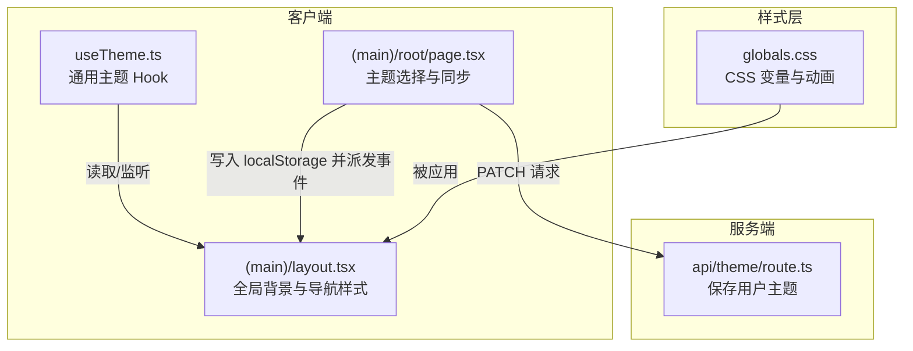
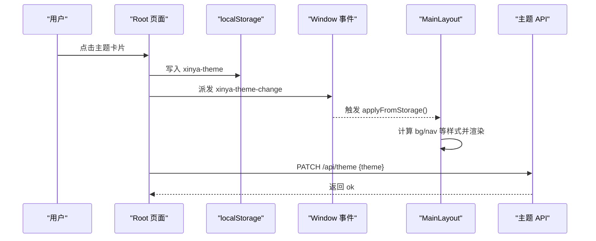
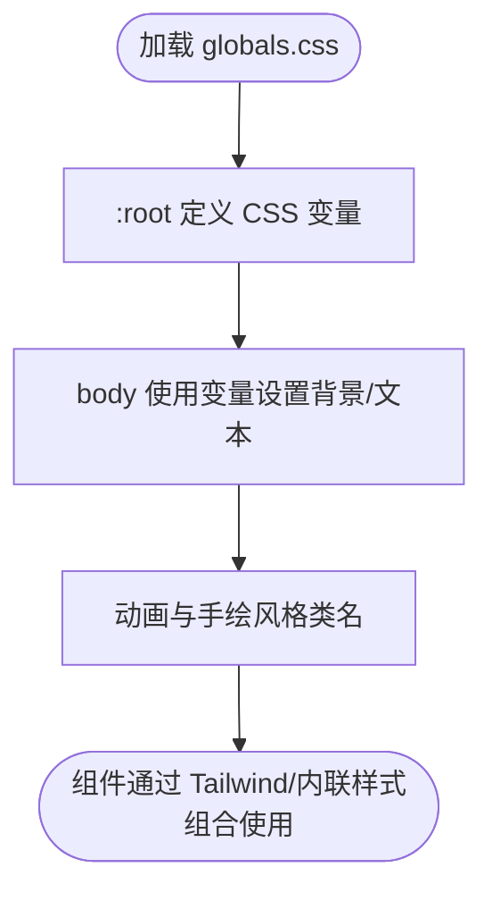
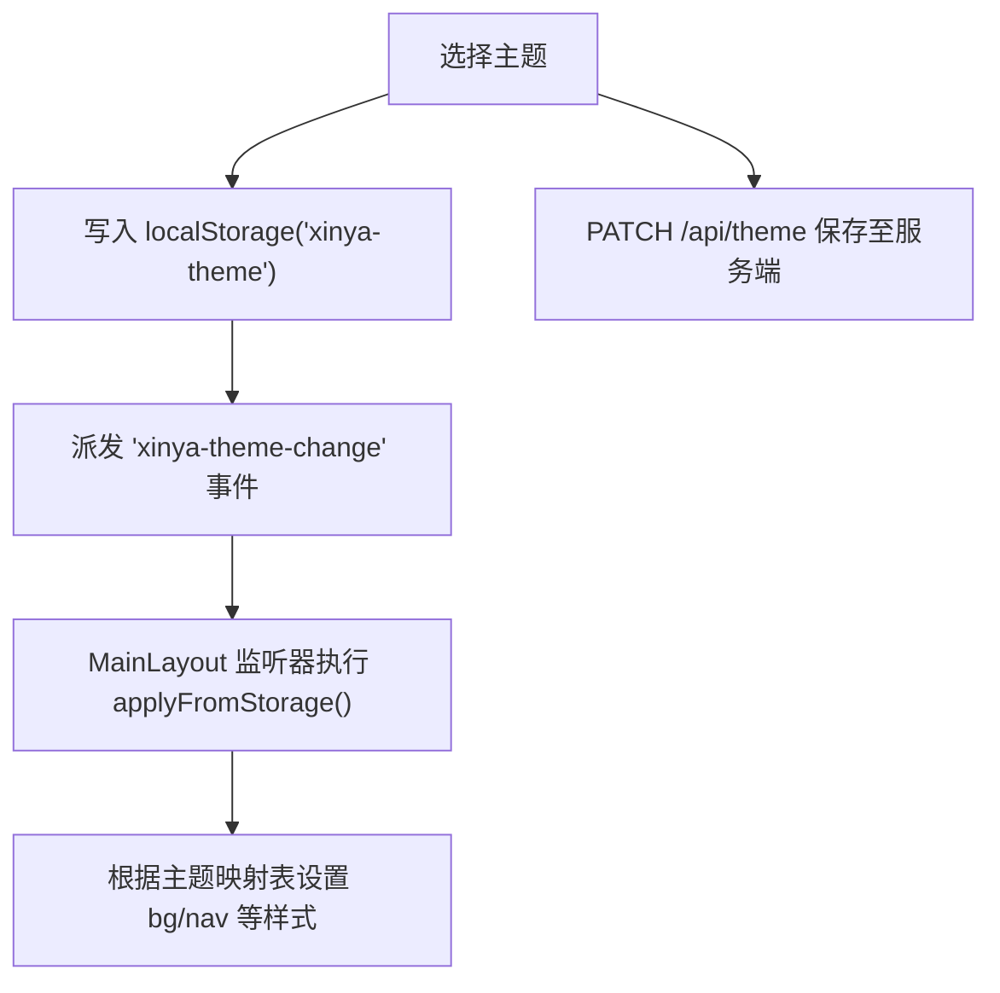
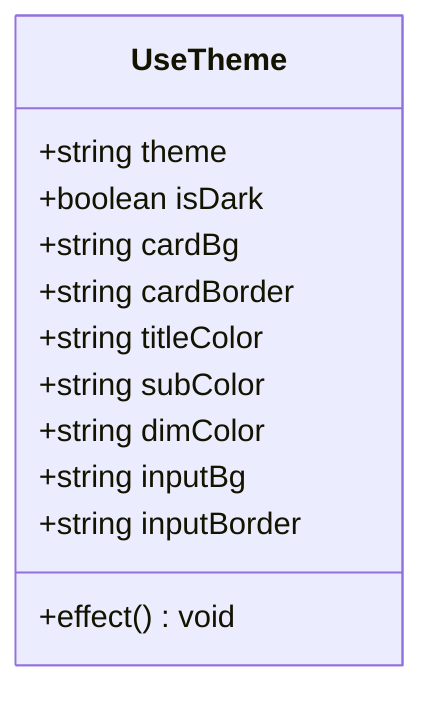
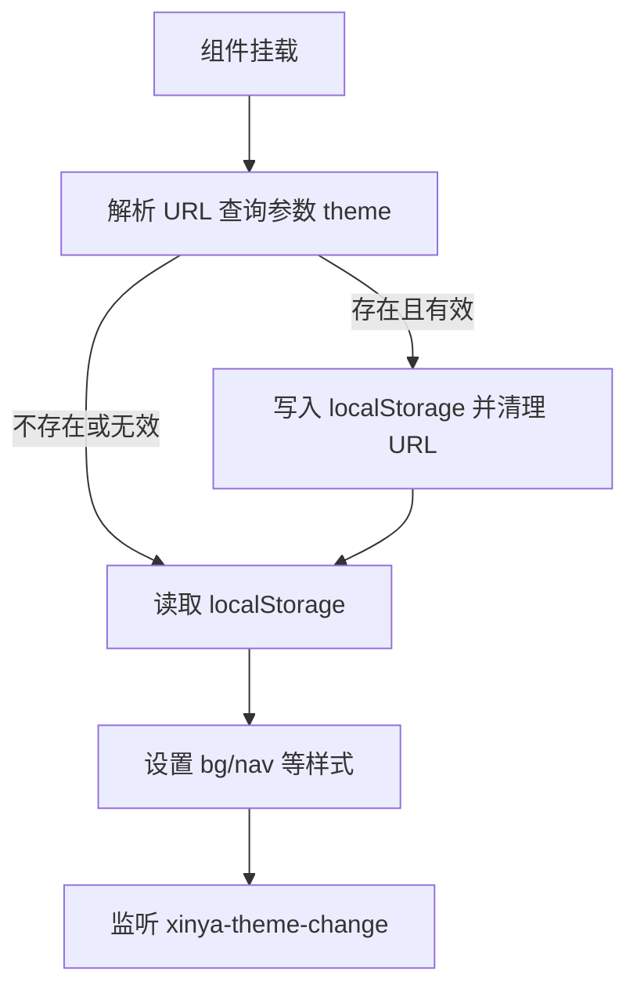
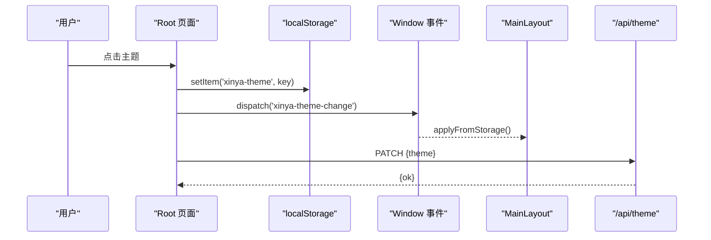
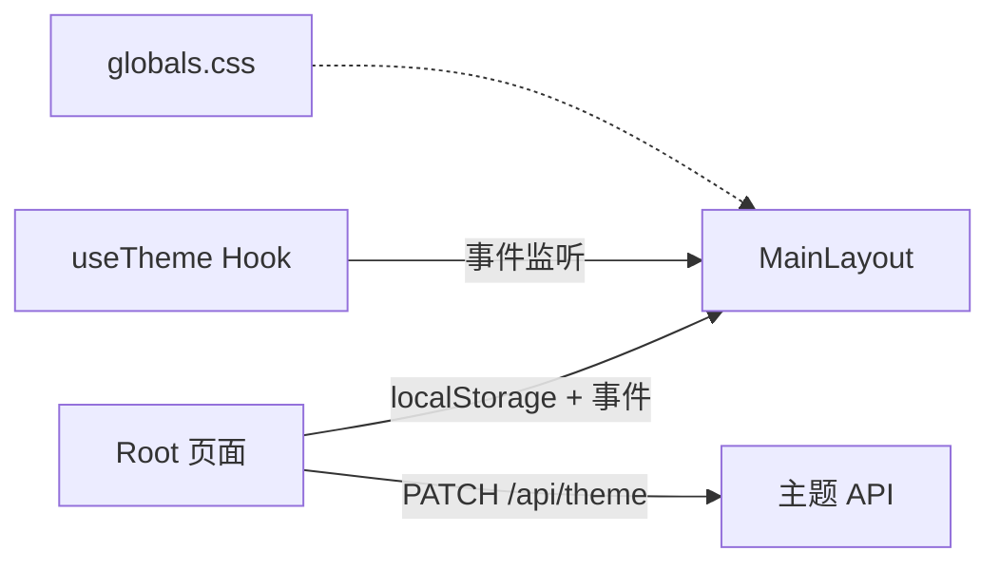

# 主题系统

<cite>
**本文引用的文件**   
- [app/globals.css](file://app/globals.css)
- [lib/useTheme.ts](file://lib/useTheme.ts)
- [app/(main)/layout.tsx](file://app/(main)/layout.tsx)
- [app/api/theme/route.ts](file://app/api/theme/route.ts)
- [app/(main)/root/page.tsx](file://app/(main)/root/page.tsx)
- [doc/暗色系修改经验总结.md](file://doc/暗色系修改经验总结.md)
</cite>

## 目录
1. [简介](#简介)
2. [项目结构](#项目结构)
3. [核心组件](#核心组件)
4. [架构总览](#架构总览)
5. [详细组件分析](#详细组件分析)
6. [依赖关系分析](#依赖关系分析)
7. [性能考虑](#性能考虑)
8. [故障排查指南](#故障排查指南)
9. [结论](#结论)
10. [附录](#附录)

## 简介
本技术文档围绕心芽的主题系统，系统性梳理其实现机制与最佳实践。重点覆盖：
- CSS 变量系统的定义、继承与覆盖规则
- 动态主题切换方案（含 localStorage 持久化与浏览器兼容性）
- 暗色/亮色模式自动检测与用户偏好处理
- 主题扩展机制（自定义主题开发与集成方法）
- 渲染优化策略（CSS-in-JS 使用与重绘优化）
- 调试工具与开发预览能力
- 可访问性与对比度检查建议

## 项目结构
主题相关代码分布在客户端 Hook、布局层、页面交互与后端 API 中，形成“前端状态 + 事件总线 + 服务端持久化”的闭环。

图表来源
- [lib/useTheme.ts:1-29](file://lib/useTheme.ts#L1-L29)
- [app/(main)/layout.tsx:1-81](file://app/(main)/layout.tsx#L1-L81)
- [app/(main)/root/page.tsx:57-171](file://app/(main)/root/page.tsx#L57-L171)
- [app/api/theme/route.ts:1-15](file://app/api/theme/route.ts#L1-L15)
- [app/globals.css:1-79](file://app/globals.css#L1-L79)

章节来源
- [lib/useTheme.ts:1-29](file://lib/useTheme.ts#L1-L29)
- [app/(main)/layout.tsx:1-81](file://app/(main)/layout.tsx#L1-L81)
- [app/(main)/root/page.tsx:57-171](file://app/(main)/root/page.tsx#L57-L171)
- [app/api/theme/route.ts:1-15](file://app/api/theme/route.ts#L1-L15)
- [app/globals.css:1-79](file://app/globals.css#L1-L79)

## 核心组件
- useTheme Hook：提供当前主题、是否暗色及常用颜色值；通过 window 事件与 localStorage 同步多组件状态。
- MainLayout：负责全局背景与底部导航的主题样式，支持 URL 参数初始化与事件驱动更新。
- Root 页面：提供主题选择 UI，调用后端接口持久化主题，并通过事件通知其他组件刷新。
- 主题 API：校验并保存用户主题到数据库。
- 全局样式：定义基础 CSS 变量与动画，作为主题视觉基线。

章节来源
- [lib/useTheme.ts:1-29](file://lib/useTheme.ts#L1-L29)
- [app/(main)/layout.tsx:1-81](file://app/(main)/layout.tsx#L1-L81)
- [app/(main)/root/page.tsx:57-171](file://app/(main)/root/page.tsx#L57-L171)
- [app/api/theme/route.ts:1-15](file://app/api/theme/route.ts#L1-L15)
- [app/globals.css:1-79](file://app/globals.css#L1-L79)

## 架构总览
主题系统采用“事件驱动 + 本地持久化 + 服务端同步”的架构：
- 数据源：localStorage 键 xinya-theme 为权威本地状态；服务端 user.theme 为权威远程状态。
- 传播方式：window 自定义事件 xinya-theme-change 用于跨组件同步。
- 初始化路径：URL 查询参数 theme 优先，其次 localStorage，最后默认 spring。
- 持久化路径：Root 页面选择主题后，立即写 localStorage 并派发事件，同时异步 PATCH 到服务端。

图表来源
- [app/(main)/root/page.tsx:57-171](file://app/(main)/root/page.tsx#L57-L171)
- [app/(main)/layout.tsx:36-59](file://app/(main)/layout.tsx#L36-L59)
- [app/api/theme/route.ts:5-14](file://app/api/theme/route.ts#L5-L14)

## 详细组件分析

### CSS 变量系统与样式基线
- 根级变量定义在 :root，包含主色、背景、文本、边框等语义化变量，供全局样式引用。
- 全局 body 使用这些变量设置背景与文本色，确保整体一致性。
- 动画与手绘风格类名集中管理，便于复用与统一调优。

图表来源
- [app/globals.css:1-79](file://app/globals.css#L1-L79)

章节来源
- [app/globals.css:1-79](file://app/globals.css#L1-L79)

### 动态主题切换与持久化
- 初始化优先级：URL 查询参数 theme → localStorage → 默认 spring。
- 事件同步：任何一处写入 xinya-theme 后派发 xinya-theme-change，所有订阅者（如 layout、useTheme）重新读取并更新。
- 服务端同步：Root 页面在切换时发起 PATCH 请求，将主题保存到用户资料。

图表来源
- [app/(main)/root/page.tsx:57-171](file://app/(main)/root/page.tsx#L57-L171)
- [app/(main)/layout.tsx:36-59](file://app/(main)/layout.tsx#L36-L59)
- [app/api/theme/route.ts:5-14](file://app/api/theme/route.ts#L5-L14)

章节来源
- [app/(main)/root/page.tsx:57-171](file://app/(main)/root/page.tsx#L57-L171)
- [app/(main)/layout.tsx:36-59](file://app/(main)/layout.tsx#L36-L59)
- [app/api/theme/route.ts:5-14](file://app/api/theme/route.ts#L5-L14)

### useTheme Hook 设计
- 职责：维护当前主题与派生颜色（卡片背景、边框、标题/副标题/弱化文字、输入框背景与边框）。
- 同步：挂载时从 localStorage 读取，并监听 xinya-theme-change 事件进行增量更新。
- 输出：向组件暴露 isDark 与一组可直接使用的颜色值，降低业务组件对主题细节的耦合。

图表来源
- [lib/useTheme.ts:1-29](file://lib/useTheme.ts#L1-L29)

章节来源
- [lib/useTheme.ts:1-29](file://lib/useTheme.ts#L1-L29)

### MainLayout 主题应用
- 主题映射表：按主题 key 映射背景、导航背景、导航边框、激活/非激活色。
- 初始化流程：
  - 若 URL 带 theme 且合法，则写入 localStorage 并清理 URL 参数。
  - 从 localStorage 读取主题 key，设置全局背景与导航样式。
  - 监听 xinya-theme-change 事件以响应跨组件切换。
- SSR 注意事项：初始值使用默认亮色，避免 hydration mismatch。

图表来源
- [app/(main)/layout.tsx:36-59](file://app/(main)/layout.tsx#L36-L59)

章节来源
- [app/(main)/layout.tsx:1-81](file://app/(main)/layout.tsx#L1-L81)

### Root 页面主题选择与服务端同步
- 本地优先：先更新本地状态与 UI，再异步保存服务端。
- 事件广播：写入 localStorage 后立即派发事件，保证布局与其他组件即时生效。
- 服务端校验：API 仅接受预设主题集合，非法值将被拒绝。

图表来源
- [app/(main)/root/page.tsx:57-171](file://app/(main)/root/page.tsx#L57-L171)
- [app/(main)/layout.tsx:36-59](file://app/(main)/layout.tsx#L36-L59)
- [app/api/theme/route.ts:5-14](file://app/api/theme/route.ts#L5-L14)

章节来源
- [app/(main)/root/page.tsx:57-171](file://app/(main)/root/page.tsx#L57-L171)
- [app/api/theme/route.ts:5-14](file://app/api/theme/route.ts#L5-L14)

### 暗色/亮色自动检测与用户偏好
- 现状：当前实现未内置系统主题监听（如 prefers-color-scheme），而是以用户显式选择为准。
- 建议方案：
  - 首次进入时读取系统偏好，若无本地存储则据此初始化。
  - 后续以用户显式选择覆盖系统偏好。
  - 提供“跟随系统”开关，并在系统主题变化时实时同步。
- 兼容性：
  - 使用 window.matchMedia('(prefers-color-scheme: dark)') 监听系统主题变化。
  - 降级策略：不支持 matchMedia 的环境回退到默认亮色。

章节来源
- [doc/暗色系修改经验总结.md:82-153](file://doc/暗色系修改经验总结.md#L82-L153)

### 主题扩展机制（自定义主题）
- 新增主题步骤：
  1) 在服务端路由允许的集合中添加新主题 key。
  2) 在 MainLayout 的主题映射表中补充对应颜色值（背景、导航、边框、激活/非激活色）。
  3) 在 Root 页面的主题列表中添加展示项（标签、描述、预览色）。
  4) 如需全局 CSS 变量参与，可在 :root 中增加变量或在组件中使用条件样式。
- 约定：
  - 主题 key 需保持唯一且稳定。
  - 颜色值需满足可读性要求（见可访问性部分）。

章节来源
- [app/api/theme/route.ts:5-14](file://app/api/theme/route.ts#L5-L14)
- [app/(main)/layout.tsx:5-28](file://app/(main)/layout.tsx#L5-L28)
- [app/(main)/root/page.tsx:26-29](file://app/(main)/root/page.tsx#L26-L29)

### 渲染优化策略（CSS-in-JS 与重绘优化）
- 当前策略：
  - 使用 React style 直接注入关键样式（背景、边框、过渡），减少额外 DOM 层级。
  - 通过 transition 平滑过渡，避免闪烁。
- 进一步优化建议：
  - 将频繁变化的样式收敛到最小节点，避免大面积重排。
  - 使用 will-change 谨慎优化动画元素。
  - 合并多次 setState，避免抖动。
  - 对于复杂主题，可引入 CSS 变量在 JS 侧只更新变量值，由浏览器批量合成。

章节来源
- [app/(main)/layout.tsx:67-81](file://app/(main)/layout.tsx#L67-L81)

### 调试工具与开发预览
- 快速预览：
  - 通过 URL 参数 ?theme=night 或 ?theme=spring 快速切换并持久化到 localStorage。
- 控制台验证：
  - 读取 localStorage 中的主题键。
  - 手动派发 xinya-theme-change 事件验证监听器是否生效。
- 常见问题定位：
  - 参考“四层验证法”，逐层确认数据、逻辑、DOM、事件链路。

章节来源
- [app/(main)/layout.tsx:36-59](file://app/(main)/layout.tsx#L36-L59)
- [doc/暗色系修改经验总结.md:157-210](file://doc/暗色系修改经验总结.md#L157-L210)

### 可访问性与对比度检查
- 建议：
  - 文本与背景的对比度至少达到 WCAG AA（4.5:1），大文本 3:1。
  - 暗色模式下避免纯白文字与高饱和强调色，降低视觉疲劳。
  - 为焦点态提供清晰可见的 outline。
- 自动化：
  - 在构建阶段引入对比度检查插件，拦截不合规配色。
  - 在 Storybook 或可视化测试中加入主题快照，辅助回归。

## 依赖关系分析
- 组件耦合：
  - Root 页面与 MainLayout 通过 localStorage 与 window 事件解耦，低耦合高内聚。
  - useTheme Hook 提供抽象的颜色派生，降低业务组件对主题实现的感知。
- 外部依赖：
  - Next.js App Router 与 React Hooks 生命周期。
  - localStorage/sessionStorage 用于本地持久化与临时标记。
  - 服务端 Prisma 与认证中间件保障主题安全保存。

图表来源
- [app/(main)/root/page.tsx:57-171](file://app/(main)/root/page.tsx#L57-L171)
- [app/(main)/layout.tsx:36-59](file://app/(main)/layout.tsx#L36-L59)
- [lib/useTheme.ts:1-29](file://lib/useTheme.ts#L1-L29)
- [app/api/theme/route.ts:5-14](file://app/api/theme/route.ts#L5-L14)
- [app/globals.css:1-79](file://app/globals.css#L1-L79)

章节来源
- [app/(main)/root/page.tsx:57-171](file://app/(main)/root/page.tsx#L57-L171)
- [app/(main)/layout.tsx:36-59](file://app/(main)/layout.tsx#L36-L59)
- [lib/useTheme.ts:1-29](file://lib/useTheme.ts#L1-L29)
- [app/api/theme/route.ts:5-14](file://app/api/theme/route.ts#L5-L14)
- [app/globals.css:1-79](file://app/globals.css#L1-L79)

## 性能考虑
- 避免在 SSR 阶段读取 localStorage，防止 hydration mismatch。
- 使用 transition 平滑过渡，减少 FOUC 观感。
- 将主题映射表置于模块顶层，避免重复创建对象。
- 事件监听仅在必要时注册，并在卸载时移除，防止内存泄漏。
- 对频繁更新的样式尽量集中在单一容器节点，减少重排范围。

## 故障排查指南
- 现象：切换暗色后刷新，背景恢复亮色但子组件仍暗色。
- 根因：SSR hydration 不一致导致初始背景无法正确覆盖。
- 解决要点：
  - useState 初始值使用默认亮色，不在初始化阶段读取 localStorage。
  - 所有主题逻辑放入 useEffect，仅在客户端执行。
  - 监听 xinya-theme-change 事件，确保跨组件一致。
- 验证步骤：
  - 检查 localStorage 中的主题键。
  - 检查 computedStyle 的实际背景色。
  - 手动派发事件验证监听器是否生效。

章节来源
- [doc/暗色系修改经验总结.md:82-153](file://doc/暗色系修改经验总结.md#L82-L153)
- [doc/暗色系修改经验总结.md:157-210](file://doc/暗色系修改经验总结.md#L157-L210)

## 结论
心芽主题系统以“事件驱动 + 本地持久化 + 服务端同步”为核心，兼顾了用户体验与可维护性。通过合理的初始化顺序、清晰的映射表与统一的 Hook 抽象，实现了跨组件一致的视觉表现。建议在后续迭代中补充系统主题自动检测、对比度自动化检查与更完善的主题扩展规范，进一步提升可访问性与可扩展性。

## 附录
- 主题键集合（服务端校验）：spring、summer、autumn、winter、night
- 本地存储键：xinya-theme
- 事件名称：xinya-theme-change
- URL 参数：?theme={key}（仅用于初始化与调试）