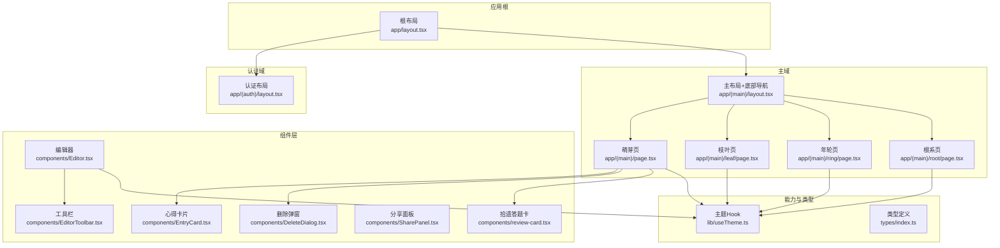
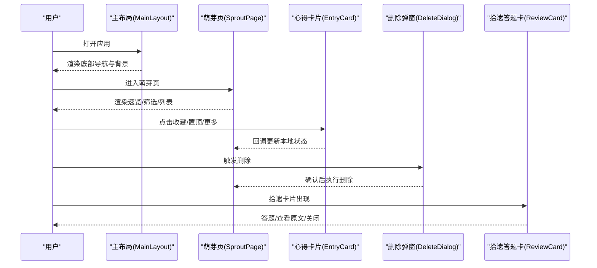
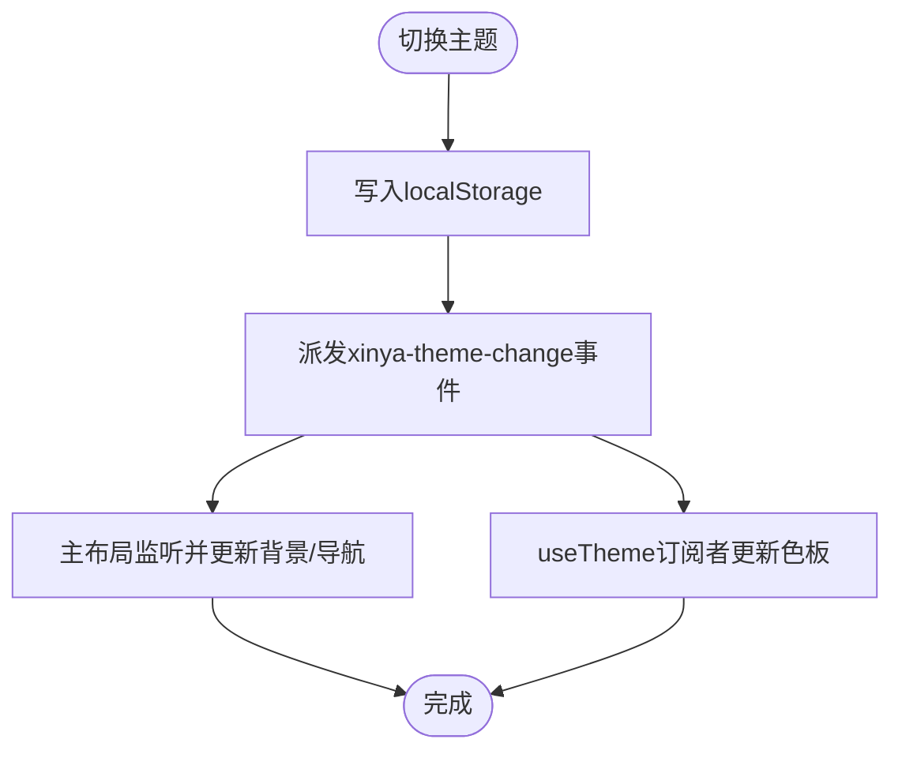
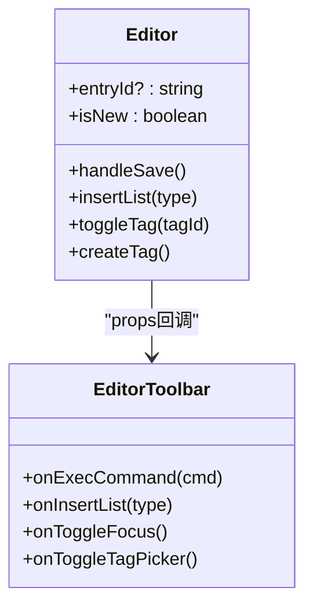
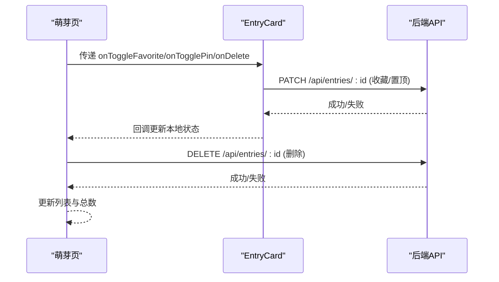
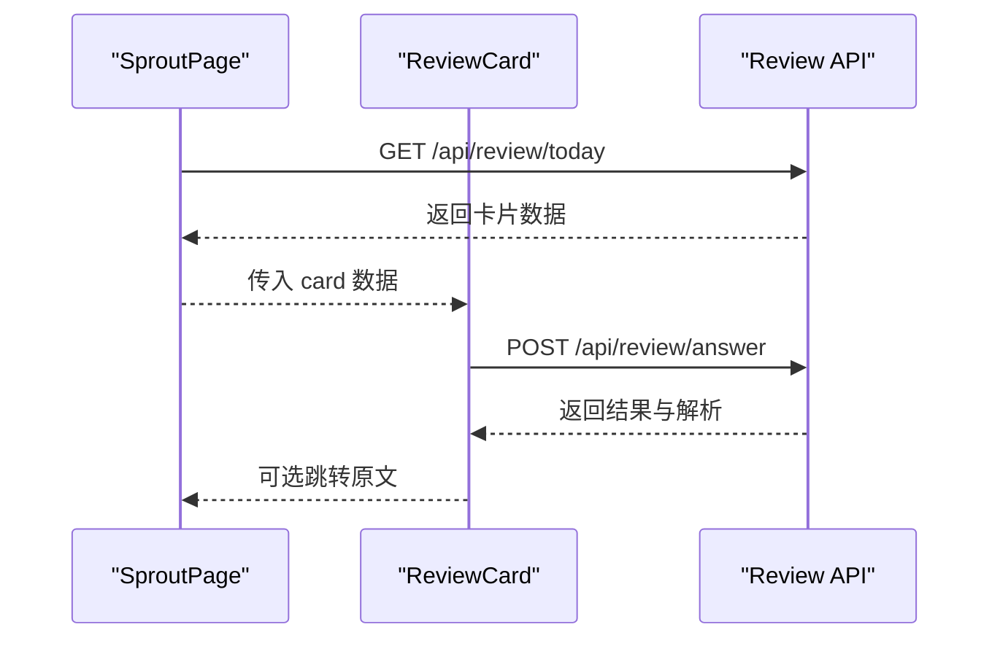
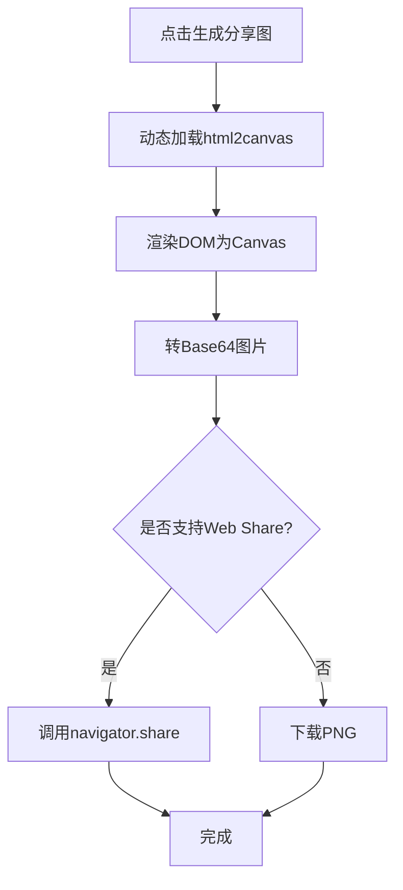
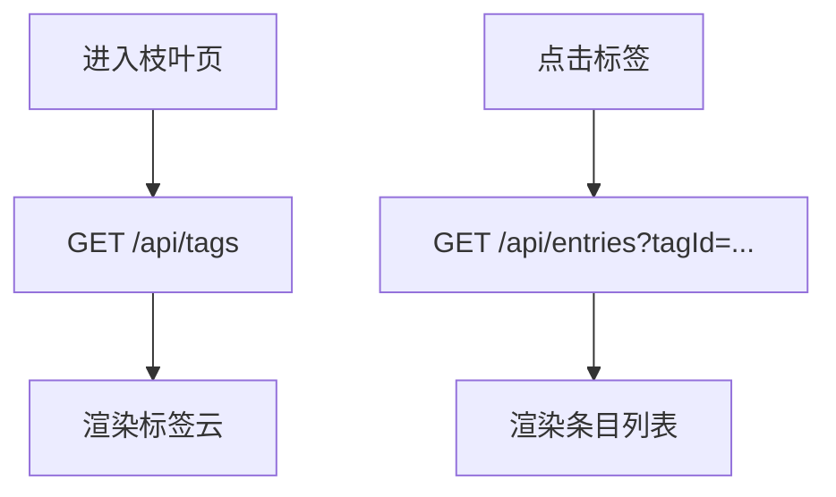
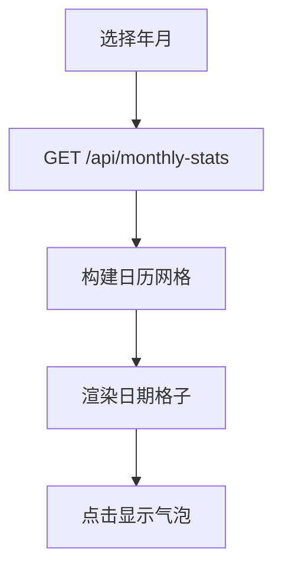
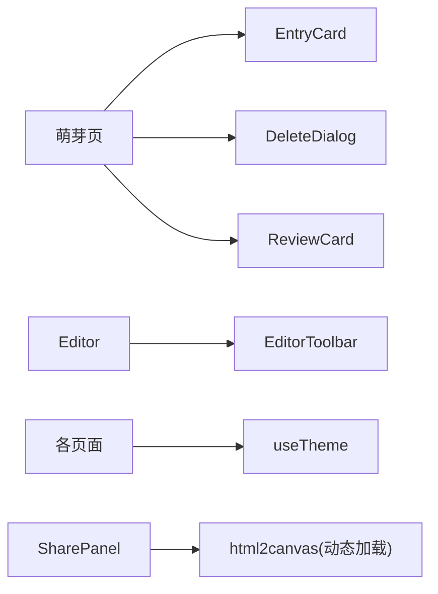

# 前端组件架构

<cite>
**本文引用的文件**   
- [app/layout.tsx](file://app/layout.tsx)
- [app/(auth)/layout.tsx](file://app/(auth)/layout.tsx)
- [app/(main)/layout.tsx](file://app/(main)/layout.tsx)
- [app/(main)/page.tsx](file://app/(main)/page.tsx)
- [app/(main)/leaf/page.tsx](file://app/(main)/leaf/page.tsx)
- [app/(main)/ring/page.tsx](file://app/(main)/ring/page.tsx)
- [app/(main)/root/page.tsx](file://app/(main)/root/page.tsx)
- [components/Editor.tsx](file://components/Editor.tsx)
- [components/EditorToolbar.tsx](file://components/EditorToolbar.tsx)
- [components/EntryCard.tsx](file://components/EntryCard.tsx)
- [components/DeleteDialog.tsx](file://components/DeleteDialog.tsx)
- [components/SharePanel.tsx](file://components/SharePanel.tsx)
- [components/review-card.tsx](file://components/review-card.tsx)
- [lib/useTheme.ts](file://lib/useTheme.ts)
- [types/index.ts](file://types/index.ts)
</cite>

## 目录
1. [引言](#引言)
2. [项目结构](#项目结构)
3. [核心组件](#核心组件)
4. [架构总览](#架构总览)
5. [详细组件分析](#详细组件分析)
6. [依赖关系分析](#依赖关系分析)
7. [性能与可维护性](#性能与可维护性)
8. [故障排查指南](#故障排查指南)
9. [结论](#结论)
10. [附录](#附录)

## 引言
本设计文档面向心芽的前端组件架构，聚焦于 React 组件的层次结构与组织原则、状态管理模式（局部与全局）、主题系统实现机制、响应式设计与跨设备兼容、组件通信与事件处理、测试策略与性能优化、以及可复用性与扩展机制。文档以代码级事实为依据，辅以可视化图示，帮助读者快速理解并高效参与后续迭代。

## 项目结构
本项目基于 Next.js App Router，采用“页面即路由”的组织方式：
- app 目录下按功能域划分页面与布局，如 (auth)、(main) 等；
- components 目录存放可复用的业务与 UI 组件；
- lib 提供通用能力（如 useTheme）；
- types 集中定义类型契约。

图表来源
- [app/layout.tsx:1-43](file://app/layout.tsx#L1-L43)
- [app/(auth)/layout.tsx:1-18](file://app/(auth)/layout.tsx#L1-L18)
- [app/(main)/layout.tsx:1-173](file://app/(main)/layout.tsx#L1-L173)
- [app/(main)/page.tsx:1-405](file://app/(main)/page.tsx#L1-L405)
- [app/(main)/leaf/page.tsx:1-253](file://app/(main)/leaf/page.tsx#L1-L253)
- [app/(main)/ring/page.tsx:1-338](file://app/(main)/ring/page.tsx#L1-L338)
- [app/(main)/root/page.tsx:1-718](file://app/(main)/root/page.tsx#L1-L718)
- [components/Editor.tsx:1-192](file://components/Editor.tsx#L1-L192)
- [components/EditorToolbar.tsx:1-78](file://components/EditorToolbar.tsx#L1-L78)
- [components/EntryCard.tsx:1-138](file://components/EntryCard.tsx#L1-L138)
- [components/DeleteDialog.tsx:1-45](file://components/DeleteDialog.tsx#L1-L45)
- [components/SharePanel.tsx:1-295](file://components/SharePanel.tsx#L1-L295)
- [components/review-card.tsx:1-321](file://components/review-card.tsx#L1-L321)
- [lib/useTheme.ts:1-30](file://lib/useTheme.ts#L1-L30)
- [types/index.ts:1-48](file://types/index.ts#L1-L48)

章节来源
- [app/layout.tsx:1-43](file://app/layout.tsx#L1-L43)
- [app/(main)/layout.tsx:1-173](file://app/(main)/layout.tsx#L1-L173)
- [app/(main)/page.tsx:1-405](file://app/(main)/page.tsx#L1-L405)
- [app/(main)/leaf/page.tsx:1-253](file://app/(main)/leaf/page.tsx#L1-L253)
- [app/(main)/ring/page.tsx:1-338](file://app/(main)/ring/page.tsx#L1-L338)
- [app/(main)/root/page.tsx:1-718](file://app/(main)/root/page.tsx#L1-L718)

## 核心组件
- 页面组件
  - 萌芽页：列表、搜索、筛选、分页、收藏/置顶、删除、拾遗卡片入口。
  - 枝叶页：标签云、按标签筛选、返回时恢复选中标签。
  - 年轮页：月度热力图、月份切换、统计指标。
  - 根系页：账号信息、主题切换、标签管理、拾遗开关、学习画像、数据导出、版本日志。
- 业务组件
  - 编辑器：富文本编辑、心情选择、标签选择/新建、保存/加载、字数统计、专注模式。
  - 心得卡片：展示标题、预览、标签、心情、时间，支持收藏、置顶、删除。
  - 拾遗答题卡：概念翻转、要点回顾、单选/多选/判断作答、结果反馈与回看。
  - 分享面板：动态加载截图库、生成图片、分享或下载。
- UI 组件
  - 编辑器工具栏：加粗/斜体/下划线、列表、颜色选择器、标签/专注模式切换、字符计数。
  - 删除弹窗：二次确认、加载态。

章节来源
- [components/Editor.tsx:1-192](file://components/Editor.tsx#L1-L192)
- [components/EditorToolbar.tsx:1-78](file://components/EditorToolbar.tsx#L1-L78)
- [components/EntryCard.tsx:1-138](file://components/EntryCard.tsx#L1-L138)
- [components/DeleteDialog.tsx:1-45](file://components/DeleteDialog.tsx#L1-L45)
- [components/SharePanel.tsx:1-295](file://components/SharePanel.tsx#L1-L295)
- [components/review-card.tsx:1-321](file://components/review-card.tsx#L1-L321)
- [app/(main)/page.tsx:1-405](file://app/(main)/page.tsx#L1-L405)
- [app/(main)/leaf/page.tsx:1-253](file://app/(main)/leaf/page.tsx#L1-L253)
- [app/(main)/ring/page.tsx:1-338](file://app/(main)/ring/page.tsx#L1-L338)
- [app/(main)/root/page.tsx:1-718](file://app/(main)/root/page.tsx#L1-L718)

## 架构总览
整体采用“布局 + 页面 + 组件”的分层：
- 根布局负责站点元信息、全局 Toast、PWA 配置与视口设置；
- 认证布局统一登录注册风格；
- 主布局承载底部导航与主题初始化；
- 页面组件聚合业务逻辑与数据获取；
- 业务组件封装领域行为；
- UI 组件保持纯展示与交互最小化。

图表来源
- [app/(main)/layout.tsx:1-173](file://app/(main)/layout.tsx#L1-L173)
- [app/(main)/page.tsx:1-405](file://app/(main)/page.tsx#L1-L405)
- [components/EntryCard.tsx:1-138](file://components/EntryCard.tsx#L1-L138)
- [components/DeleteDialog.tsx:1-45](file://components/DeleteDialog.tsx#L1-L45)
- [components/review-card.tsx:1-321](file://components/review-card.tsx#L1-L321)

## 详细组件分析

### 主题系统与全局状态共享
- 主题存储与同步
  - 使用 localStorage 持久化主题键；
  - 通过自定义事件 xinya-theme-change 在多个组件间同步主题变化；
  - 主布局在客户端初始化主题，并从 URL 参数读取一次后清理；
  - useTheme Hook 暴露 isDark 及常用色板，供各组件消费。
- 主题切换流程
  - 根系页发起切换，写入 localStorage 并派发事件；
  - 主布局监听事件，刷新背景与导航样式；
  - 其他组件通过 useTheme 自动响应。

图表来源
- [app/(main)/root/page.tsx:154-171](file://app/(main)/root/page.tsx#L154-L171)
- [app/(main)/layout.tsx:36-59](file://app/(main)/layout.tsx#L36-L59)
- [lib/useTheme.ts:1-30](file://lib/useTheme.ts#L1-L30)

章节来源
- [lib/useTheme.ts:1-30](file://lib/useTheme.ts#L1-L30)
- [app/(main)/layout.tsx:1-173](file://app/(main)/layout.tsx#L1-L173)
- [app/(main)/root/page.tsx:105-171](file://app/(main)/root/page.tsx#L105-L171)

### 编辑器与工具栏
- 编辑器职责
  - 内容加载/保存、心情选择、标签选择/创建、字数统计、专注模式；
  - 通过 contentEditable 与 document.execCommand 实现基础富文本；
  - 粘贴时仅插入纯文本，避免样式污染。
- 工具栏职责
  - 格式化命令、列表插入、颜色选择器、标签/专注模式切换、字符计数；
  - 通过 props 回调与父组件解耦。

图表来源
- [components/Editor.tsx:1-192](file://components/Editor.tsx#L1-L192)
- [components/EditorToolbar.tsx:1-78](file://components/EditorToolbar.tsx#L1-L78)

章节来源
- [components/Editor.tsx:1-192](file://components/Editor.tsx#L1-L192)
- [components/EditorToolbar.tsx:1-78](file://components/EditorToolbar.tsx#L1-L78)

### 列表与卡片交互
- 萌芽页
  - 负责列表加载、分页、搜索、筛选、收藏/置顶、删除；
  - 将操作回调传递给 EntryCard，卡片内部再调用 API 并回滚失败状态。
- 心得卡片
  - 展示标题、预览、标签、心情、时间；
  - 右上角收藏按钮、更多菜单（置顶/删除）。

图表来源
- [app/(main)/page.tsx:148-194](file://app/(main)/page.tsx#L148-L194)
- [components/EntryCard.tsx:48-106](file://components/EntryCard.tsx#L48-L106)

章节来源
- [app/(main)/page.tsx:1-405](file://app/(main)/page.tsx#L1-L405)
- [components/EntryCard.tsx:1-138](file://components/EntryCard.tsx#L1-L138)

### 拾遗答题卡
- 流程
  - 正面显示概念名，翻转到背面展示要点；
  - 开始答题，支持单选/多选/判断；
  - 提交后给出正确/错误反馈与解析，支持回看选项详情。
- 数据流
  - 从 /api/review/today 获取卡片；
  - 提交答案到 /api/review/answer；
  - 可选择查看原文跳转至详情页。

图表来源
- [app/(main)/page.tsx:80-91](file://app/(main)/page.tsx#L80-L91)
- [components/review-card.tsx:32-53](file://components/review-card.tsx#L32-L53)

章节来源
- [components/review-card.tsx:1-321](file://components/review-card.tsx#L1-L321)
- [app/(main)/page.tsx:80-91](file://app/(main)/page.tsx#L80-L91)

### 分享面板
- 能力
  - 动态加载 html2canvas；
  - 将指定区域渲染为图片；
  - 优先使用 Web Share API，否则降级为下载。
- 关键点
  - 截图区域独立渲染，不受外部样式影响；
  - 根据主题计算背景色，保证暗/亮主题一致输出。

图表来源
- [components/SharePanel.tsx:44-99](file://components/SharePanel.tsx#L44-L99)

章节来源
- [components/SharePanel.tsx:1-295](file://components/SharePanel.tsx#L1-L295)

### 标签云与按标签筛选
- 枝叶页
  - 加载所有标签并按使用量排序；
  - 支持搜索过滤；
  - 点击标签加载对应条目列表，URL 携带 tagId 以便从详情页返回时恢复。

图表来源
- [app/(main)/leaf/page.tsx:82-125](file://app/(main)/leaf/page.tsx#L82-L125)

章节来源
- [app/(main)/leaf/page.tsx:1-253](file://app/(main)/leaf/page.tsx#L1-L253)

### 年轮热力图
- 功能
  - 按月展示记录密度，支持前后月切换；
  - 当日高亮，悬停提示当天篇数；
  - 展示本月篇数、记录天数、日均篇数与累计篇数。
- 数据
  - 从 /api/monthly-stats 获取当月数据；
  - 从 /api/review/settings 获取累计篇数。

图表来源
- [app/(main)/ring/page.tsx:59-79](file://app/(main)/ring/page.tsx#L59-L79)
- [app/(main)/ring/page.tsx:94-128](file://app/(main)/ring/page.tsx#L94-L128)

章节来源
- [app/(main)/ring/page.tsx:1-338](file://app/(main)/ring/page.tsx#L1-L338)

### 根系页（设置中心）
- 功能
  - 主题切换（写 localStorage 并派发事件）；
  - 标签增删改；
  - 拾遗开关与学习画像；
  - 导出 Markdown；
  - 版本日志与退出登录。
- 主题联动
  - 切换后立即生效，并通过事件通知主布局与其他订阅者。

章节来源
- [app/(main)/root/page.tsx:154-171](file://app/(main)/root/page.tsx#L154-L171)
- [app/(main)/root/page.tsx:105-171](file://app/(main)/root/page.tsx#L105-L171)

## 依赖关系分析
- 组件耦合
  - 页面组件与业务组件通过 props 和回调解耦；
  - 主题通过 Hook 与事件总线（window 事件）松耦合；
  - 富文本编辑器与工具栏通过命令式回调协作。
- 外部依赖
  - react-hot-toast 用于消息提示；
  - lucide-react 图标库；
  - html2canvas 按需动态加载。

图表来源
- [app/(main)/page.tsx:1-405](file://app/(main)/page.tsx#L1-L405)
- [components/EntryCard.tsx:1-138](file://components/EntryCard.tsx#L1-L138)
- [components/DeleteDialog.tsx:1-45](file://components/DeleteDialog.tsx#L1-L45)
- [components/review-card.tsx:1-321](file://components/review-card.tsx#L1-L321)
- [components/Editor.tsx:1-192](file://components/Editor.tsx#L1-L192)
- [components/EditorToolbar.tsx:1-78](file://components/EditorToolbar.tsx#L1-L78)
- [lib/useTheme.ts:1-30](file://lib/useTheme.ts#L1-L30)
- [components/SharePanel.tsx:1-295](file://components/SharePanel.tsx#L1-L295)

章节来源
- [app/(main)/page.tsx:1-405](file://app/(main)/page.tsx#L1-L405)
- [components/EntryCard.tsx:1-138](file://components/EntryCard.tsx#L1-L138)
- [components/DeleteDialog.tsx:1-45](file://components/DeleteDialog.tsx#L1-L45)
- [components/review-card.tsx:1-321](file://components/review-card.tsx#L1-L321)
- [components/Editor.tsx:1-192](file://components/Editor.tsx#L1-L192)
- [components/EditorToolbar.tsx:1-78](file://components/EditorToolbar.tsx#L1-L78)
- [lib/useTheme.ts:1-30](file://lib/useTheme.ts#L1-L30)
- [components/SharePanel.tsx:1-295](file://components/SharePanel.tsx#L1-L295)

## 性能与可维护性
- 渲染与交互
  - 列表分页加载，避免一次性渲染大量节点；
  - 富文本输入时仅统计纯文本长度，减少重排；
  - 截图模块按需动态加载，降低首屏体积。
- 主题切换
  - 使用 CSS transition 平滑过渡背景与边框；
  - 通过事件广播避免重复请求与状态不一致。
- 可维护性
  - 类型集中在 types/index.ts，便于前后端契约对齐；
  - 组件职责单一，UI 与业务分离，利于单元测试与回归。

[本节为通用指导，不直接分析具体文件]

## 故障排查指南
- 主题未生效
  - 检查 localStorage 中 xinya-theme 值是否正确；
  - 确认主布局与 useTheme 是否监听 xinya-theme-change 事件。
- 富文本格式异常
  - 确认粘贴拦截仅插入纯文本；
  - 检查 execCommand 兼容性。
- 截图失败
  - 检查网络是否能访问 CDN；
  - 确认截图区域 DOM 存在且尺寸合理。
- 列表加载失败
  - 检查 API 返回结构是否符合 ApiResponse 约定；
  - 关注 toast 提示的错误信息。

章节来源
- [app/(main)/layout.tsx:36-59](file://app/(main)/layout.tsx#L36-L59)
- [lib/useTheme.ts:1-30](file://lib/useTheme.ts#L1-L30)
- [components/Editor.tsx:64-67](file://components/Editor.tsx#L64-L67)
- [components/SharePanel.tsx:44-72](file://components/SharePanel.tsx#L44-L72)
- [app/(main)/page.tsx:94-121](file://app/(main)/page.tsx#L94-L121)

## 结论
心芽前端采用清晰的布局-页面-组件分层，结合轻量全局主题与事件总线，实现了良好的可维护性与可扩展性。页面组件聚焦业务编排，业务组件封装领域行为，UI 组件保持简洁。通过分页、按需加载与平滑主题切换等手段，兼顾了性能与体验。建议在后续迭代中继续完善类型约束、错误边界与自动化测试，进一步提升稳定性与开发效率。

[本节为总结性内容，不直接分析具体文件]

## 附录
- 关键类型契约
  - MoodType、ThemeType、EntryCard、EntryDetail、TagItem、TodaySummary、ApiResponse 等定义位于 types/index.ts，贯穿前后端数据交换与组件 Props 校验。

章节来源
- [types/index.ts:1-48](file://types/index.ts#L1-L48)