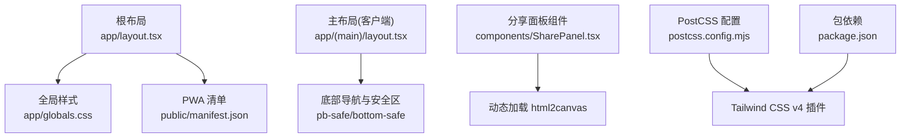
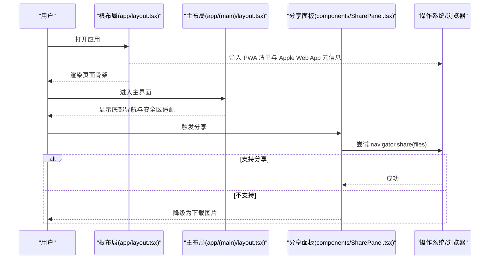
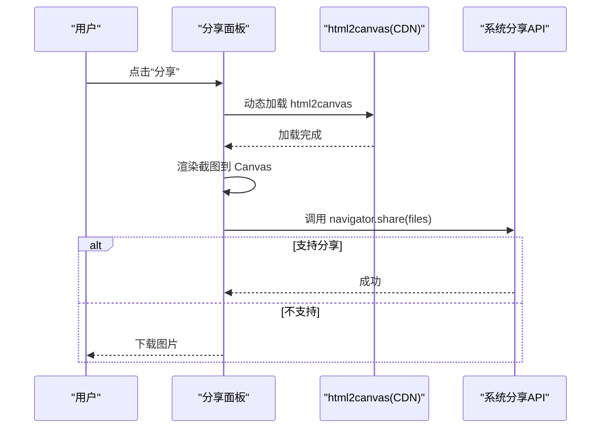
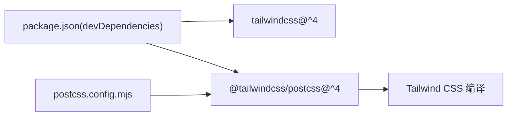

# 响应式设计

<cite>
**本文引用的文件**   
- [app/layout.tsx](file://app/layout.tsx)
- [app/globals.css](file://app/globals.css)
- [postcss.config.mjs](file://postcss.config.mjs)
- [package.json](file://package.json)
- [public/manifest.json](file://public/manifest.json)
- [app/(main)/layout.tsx](file://app/(main)/layout.tsx)
- [components/SharePanel.tsx](file://components/SharePanel.tsx)
</cite>

## 目录
1. [简介](#简介)
2. [项目结构](#项目结构)
3. [核心组件](#核心组件)
4. [架构总览](#架构总览)
5. [详细组件分析](#详细组件分析)
6. [依赖分析](#依赖分析)
7. [性能考虑](#性能考虑)
8. [故障排查指南](#故障排查指南)
9. [结论](#结论)
10. [附录](#附录)

## 简介
本文件围绕“心芽”的响应式设计与移动端优先策略，系统梳理断点与布局适配、交互优化、PWA 支持、离线体验、跨设备测试与兼容性处理，以及图片与资源加载、渲染优化等实践。文档以代码仓库为依据，结合 Tailwind CSS v4（通过 PostCSS 插件）的使用方式，给出可落地的实现建议与图示说明。

## 项目结构
本项目采用 Next.js App Router 组织页面与布局，全局样式与动画在根样式中集中管理；移动端底部安全区域、主题色与字体等基础样式统一配置；PWA 清单与图标在 public 目录下声明；主应用布局包含底部导航与安全区适配；分享面板提供截图与分享能力。

图表来源
- [app/layout.tsx:1-43](file://app/layout.tsx#L1-L43)
- [app/globals.css:1-79](file://app/globals.css#L1-L79)
- [public/manifest.json:1-25](file://public/manifest.json#L1-L25)
- [app/(main)/layout.tsx:67-173](file://app/(main)/layout.tsx#L67-L173)
- [components/SharePanel.tsx:1-127](file://components/SharePanel.tsx#L1-L127)
- [postcss.config.mjs:1-8](file://postcss.config.mjs#L1-L8)
- [package.json:26-38](file://package.json#L26-L38)

章节来源
- [app/layout.tsx:1-43](file://app/layout.tsx#L1-L43)
- [app/globals.css:1-79](file://app/globals.css#L1-L79)
- [public/manifest.json:1-25](file://public/manifest.json#L1-L25)
- [app/(main)/layout.tsx:67-173](file://app/(main)/layout.tsx#L67-L173)
- [components/SharePanel.tsx:1-127](file://components/SharePanel.tsx#L1-L127)
- [postcss.config.mjs:1-8](file://postcss.config.mjs#L1-L8)
- [package.json:26-38](file://package.json#L26-L38)

## 核心组件
- 根布局与视口：设置语言、标题、描述、PWA manifest、Apple Web App 元信息，并配置 viewport 为 device-width、initialScale=1、viewportFit=cover，确保移动端正确缩放与安全区覆盖。
- 全局样式与动效：引入 Tailwind CSS，定义品牌色变量、字体、手绘风格圆角、关键帧动画与常用动画类，同时提供移动端底部安全区辅助类。
- 主布局与底部导航：使用固定底部导航栏，结合安全区类避免被系统手势条遮挡；内容区域预留底部空间，保证滚动不被遮挡。
- 分享面板：按需动态加载 html2canvas，生成分享图，优先调用原生分享 API，不支持时降级下载图片。

章节来源
- [app/layout.tsx:1-43](file://app/layout.tsx#L1-L43)
- [app/globals.css:1-79](file://app/globals.css#L1-L79)
- [app/(main)/layout.tsx:67-173](file://app/(main)/layout.tsx#L67-L173)
- [components/SharePanel.tsx:1-127](file://components/SharePanel.tsx#L1-L127)

## 架构总览
从“移动端优先”的角度，整体架构强调：
- 视口与安全区：通过 viewport 与 env(safe-area-inset-bottom) 保障全面屏与刘海屏下的可用性。
- 样式体系：Tailwind CSS v4 作为原子化样式引擎，配合自定义 CSS 变量与动画类，形成一致的设计语言。
- 交互层：底部导航常驻、中央新建按钮突出、点击反馈与轻量动画提升操作感知。
- PWA：通过 manifest 与 Apple Web App 元信息，支持添加到主屏幕与独立窗口运行。

图表来源
- [app/layout.tsx:1-43](file://app/layout.tsx#L1-L43)
- [app/(main)/layout.tsx:67-173](file://app/(main)/layout.tsx#L67-L173)
- [components/SharePanel.tsx:1-127](file://components/SharePanel.tsx#L1-L127)

## 详细组件分析

### 移动端优先与断点策略
- 视口与安全区
  - 使用 viewport 的 width=device-width、initialScale=1、viewportFit=cover，确保移动端按设备宽度渲染且覆盖安全区。
  - 通过 .pb-safe 与 .bottom-safe 将 env(safe-area-inset-bottom) 应用于内边距与定位，避免底部导航被系统手势条遮挡。
- 断点与工具类
  - 项目使用 Tailwind CSS v4，并通过 @tailwindcss/postcss 集成。v4 默认断点与 v3 保持一致（sm/md/lg/xl/xxl），可直接沿用 sm、md、lg 等前缀进行响应式控制。
  - 建议在需要分屏或平板/桌面优化的场景下，使用 md: 与 lg: 前缀调整间距、字号、网格列数与导航形态。
- 布局适配
  - 列表与卡片：在小屏使用单列流式布局，在大屏使用多列网格或弹性布局，合理分配留白与行高。
  - 导航：小屏使用底部固定导航，大屏可考虑侧边或顶部导航，保持主要操作入口一致。

章节来源
- [app/layout.tsx:21-25](file://app/layout.tsx#L21-L25)
- [app/globals.css:76-79](file://app/globals.css#L76-L79)
- [postcss.config.mjs:1-8](file://postcss.config.mjs#L1-L8)
- [package.json:26-38](file://package.json#L26-L38)

### 触摸友好的交互设计
- 点击区域与反馈
  - 底部导航按钮具备足够的触控面积与视觉反馈（active:scale 缩放、颜色切换）。
  - 新增按钮采用大尺寸圆形悬浮按钮，便于单手操作。
- 手势与反馈
  - 轻触反馈通过 CSS transition 与 transform 实现，避免复杂手势带来的学习成本。
  - 收藏、展开等状态变化配合轻量动画（如弹跳、淡入上移），增强操作确认感。
- 无障碍与可读性
  - 图标按钮附带 aria-hidden 属性，文本标签清晰可见，满足基本可访问性要求。

章节来源
- [app/(main)/layout.tsx:83-168](file://app/(main)/layout.tsx#L83-L168)
- [app/globals.css:63-68](file://app/globals.css#L63-L68)

### 不同屏幕尺寸的布局调整策略
- 网格系统与弹性布局
  - 小屏：单列流式布局，卡片全宽展示，减少横向滚动。
  - 中屏（md+）：双列或三列网格，提高信息密度。
  - 大屏（lg+）：四列及以上，增加侧边信息与快捷操作。
- 流式布局与自适应间距
  - 使用相对单位与 Tailwind 间距工具类，在不同断点下调整 padding/margin，保持呼吸感。
- 导航与操作区
  - 小屏：底部固定导航 + 中央新建按钮。
  - 大屏：可保留底部导航或迁移至侧边/顶部，但需保持“新建”入口一致性。

[本节为概念性说明，不直接分析具体文件]

### PWA 支持与离线体验优化
- 清单与图标
  - manifest.json 定义了名称、短名、启动路径、显示模式、背景与主题色、方向与图标集，支持添加到主屏幕与独立窗口运行。
- Apple Web App
  - 根布局中配置 appleWebApp 元信息，启用全屏能力与状态栏样式。
- 离线缓存建议
  - 当前未显式注册 Service Worker。可在构建阶段生成 SW 或使用框架提供的 PWA 插件，对静态资源与关键页面进行缓存，以提升弱网与离线体验。
- 首屏与安装引导
  - 通过 Toaster 提示与合适的文案引导用户“添加到主屏幕”，提升 PWA 使用率。

章节来源
- [public/manifest.json:1-25](file://public/manifest.json#L1-L25)
- [app/layout.tsx:5-19](file://app/layout.tsx#L5-L19)
- [app/layout.tsx:32-38](file://app/layout.tsx#L32-L38)

### 分享与截图流程（移动端优先）
- 动态加载 html2canvas，避免首屏阻塞。
- 优先调用 navigator.share 传递图片文件，失败则降级为下载 PNG。
- 截图区域固定宽度与高分辨率 scale，确保分享图清晰度。

图表来源
- [components/SharePanel.tsx:1-127](file://components/SharePanel.tsx#L1-L127)

## 依赖分析
- Tailwind CSS v4 与 PostCSS 集成
  - package.json 中 devDependencies 包含 tailwindcss 与 @tailwindcss/postcss。
  - postcss.config.mjs 启用 @tailwindcss/postcss 插件，实现 Tailwind 编译。
- 运行时依赖
  - react、react-dom、next 等构成前端运行时。
  - lucide-react 用于图标库。
  - react-hot-toast 用于全局提示。

图表来源
- [package.json:26-38](file://package.json#L26-L38)
- [postcss.config.mjs:1-8](file://postcss.config.mjs#L1-L8)

章节来源
- [package.json:26-38](file://package.json#L26-L38)
- [postcss.config.mjs:1-8](file://postcss.config.mjs#L1-L8)

## 性能考虑
- 图片与媒体
  - 分享图使用 scale=2 提升清晰度，但需注意内存占用；建议在移动端限制最大宽高或分块渲染。
  - 图标使用 SVG，体积小且可缩放，适合多分辨率设备。
- 资源加载
  - html2canvas 按需动态加载，避免首屏阻塞。
  - 字体使用 next/font 自动优化（参考 README），减少 FOIT/FOUT。
- 渲染优化
  - 动画尽量使用 transform 与 opacity，利用 GPU 加速。
  - 避免在滚动容器中执行重排重绘，必要时使用 will-change 或 requestAnimationFrame。
- 网络与缓存
  - 静态资源开启强缓存；关键页面与服务端渲染结合，缩短首屏时间。
  - 后续可引入 Service Worker 缓存静态资源与 API 响应，提升离线体验。

[本节为通用指导，不直接分析具体文件]

## 故障排查指南
- 底部导航被系统手势条遮挡
  - 检查是否使用了 .pb-safe 或 .bottom-safe 类，确认 env(safe-area-inset-bottom) 生效。
- 分享功能不可用
  - 确认浏览器是否支持 navigator.share；在不支持的设备上会回退到下载图片。
  - 若动态加载 html2canvas 失败，检查网络与 CORS 策略。
- PWA 无法添加到主屏幕
  - 检查 manifest.json 的路径与图标是否存在；确认站点已启用 HTTPS。
  - 在 iOS Safari 中，需在根布局中配置 appleWebApp 元信息。

章节来源
- [app/globals.css:76-79](file://app/globals.css#L76-L79)
- [components/SharePanel.tsx:74-99](file://components/SharePanel.tsx#L74-L99)
- [public/manifest.json:1-25](file://public/manifest.json#L1-L25)
- [app/layout.tsx:9-18](file://app/layout.tsx#L9-L18)

## 结论
本项目在移动端优先方面已具备良好基础：正确的视口与安全区适配、统一的样式与动画体系、清晰的底部导航与操作反馈、以及 PWA 清单与 Apple Web App 元信息。后续可在以下方面持续优化：
- 完善 Tailwind 响应式断点的应用，细化 md/lg 下的布局差异。
- 引入 Service Worker 与缓存策略，提升离线与弱网体验。
- 进一步优化分享截图的性能与兼容性，降低大图渲染开销。
- 补充更多无障碍细节与键盘导航支持，提升可访问性。

[本节为总结性内容，不直接分析具体文件]

## 附录
- 术语
  - 断点：用于区分不同屏幕尺寸的阈值，如 sm、md、lg。
  - 安全区：现代移动设备的刘海、圆角与底部手势条所在区域。
  - PWA：渐进式 Web 应用，支持离线、添加到主屏幕与独立窗口运行。
- 相关规范参考
  - 小程序设计规范与交互约定可作为 UI 与交互设计的补充参考。

[本节为概念性说明，不直接分析具体文件]