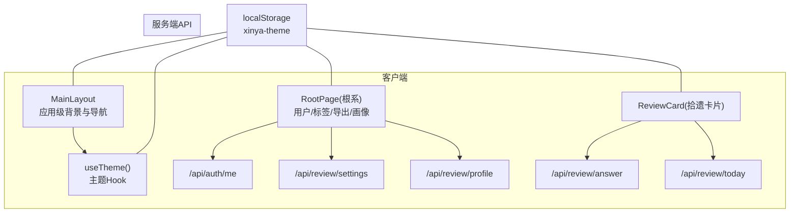
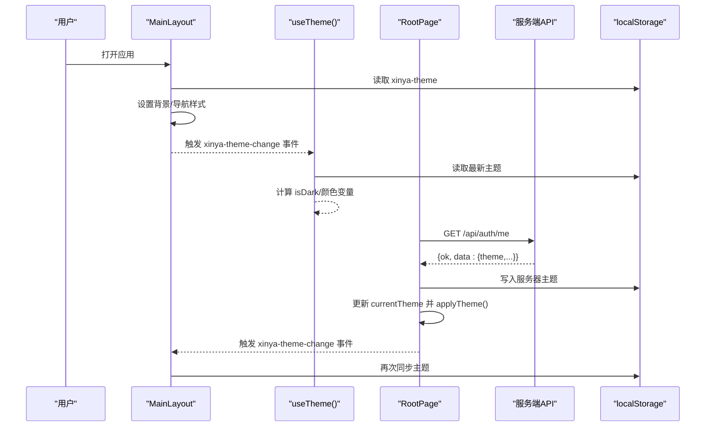
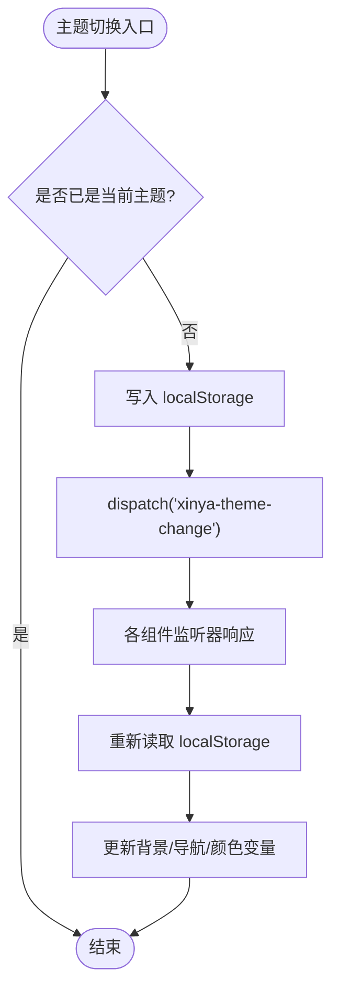
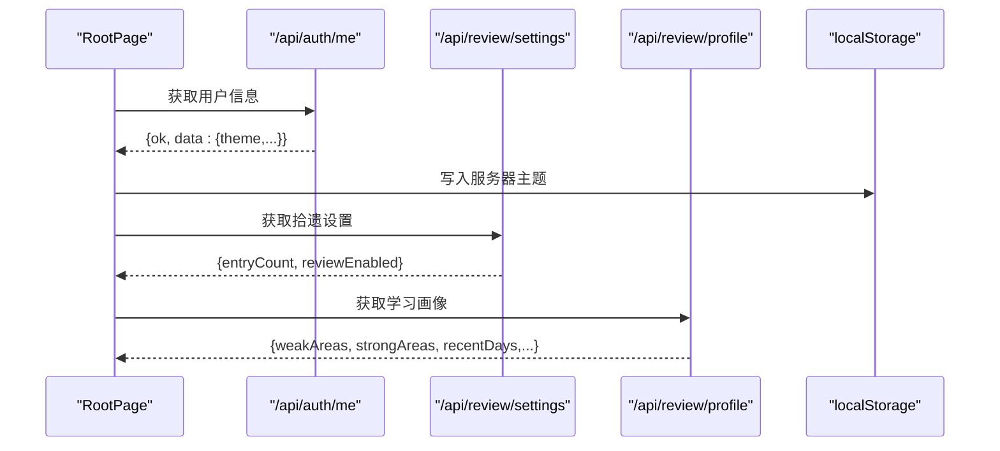
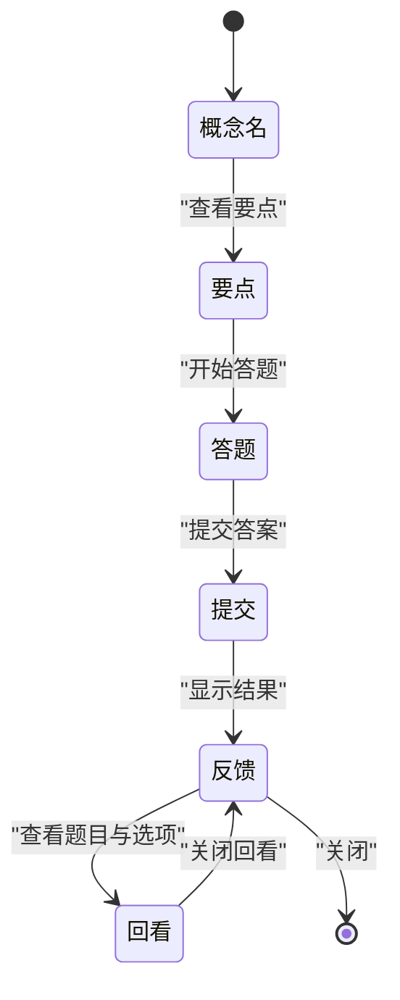
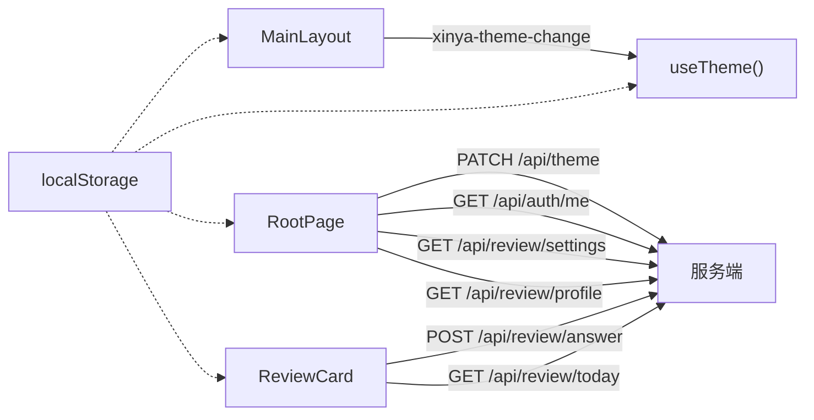

# 状态管理模式

<cite>
**本文引用的文件**   
- [app/(main)/layout.tsx](file://app/(main)/layout.tsx)
- [lib/useTheme.ts](file://lib/useTheme.ts)
- [app/(main)/root/page.tsx](file://app/(main)/root/page.tsx)
- [components/review-card.tsx](file://components/review-card.tsx)
- [app/api/auth/me/route.ts](file://app/api/auth/me/route.ts)
- [app/api/review/today/route.ts](file://app/api/review/today/route.ts)
- [app/api/review/answer/route.ts](file://app/api/review/answer/route.ts)
- [app/api/review/profile/route.ts](file://app/api/review/profile/route.ts)
- [doc/暗色系修改经验总结.md](file://doc/暗色系修改经验总结.md)
</cite>

## 目录
1. [引言](#引言)
2. [项目结构](#项目结构)
3. [核心组件](#核心组件)
4. [架构总览](#架构总览)
5. [详细组件分析](#详细组件分析)
6. [依赖分析](#依赖分析)
7. [性能考虑](#性能考虑)
8. [故障排查指南](#故障排查指南)
9. [结论](#结论)
10. [附录](#附录)

## 引言
本文件系统化梳理心芽前端的状态管理模式，聚焦以下主题：
- React Hooks 使用模式：useState、useEffect 与自定义 Hook 的设计原则
- 全局状态管理策略：基于事件与轻量 Hook 的“去中心化”方案（未引入 Context API）
- 本地存储与服务端状态的同步机制：localStorage 持久化 + 服务端覆盖 + 一致性保证
- 异步状态处理模式：加载态、错误处理与重试建议
- 状态持久化与用户偏好设置：主题、拾遗开关等
- 调试与开发期监控：日志、断点与可视化检查清单
- 测试方法与 Mock 数据策略：组件与 Hook 的可测性设计

## 项目结构
本项目采用 Next.js App Router，页面与布局均为客户端组件（"use client"），通过浏览器事件与 localStorage 实现跨组件的主题同步；业务数据通过 fetch 调用后端 API 路由。

图表来源
- [app/(main)/layout.tsx:1-173](file://app/(main)/layout.tsx#L1-L173)
- [lib/useTheme.ts:1-30](file://lib/useTheme.ts#L1-L30)
- [app/(main)/root/page.tsx:1-718](file://app/(main)/root/page.tsx#L1-L718)
- [components/review-card.tsx:1-321](file://components/review-card.tsx#L1-L321)
- [app/api/auth/me/route.ts:1-17](file://app/api/auth/me/route.ts#L1-L17)
- [app/api/review/today/route.ts:1-49](file://app/api/review/today/route.ts#L1-L49)
- [app/api/review/answer/route.ts](file://app/api/review/answer/route.ts)
- [app/api/review/profile/route.ts:1-178](file://app/api/review/profile/route.ts#L1-L178)

章节来源
- [app/(main)/layout.tsx:1-173](file://app/(main)/layout.tsx#L1-L173)
- [lib/useTheme.ts:1-30](file://lib/useTheme.ts#L1-L30)
- [app/(main)/root/page.tsx:1-718](file://app/(main)/root/page.tsx#L1-L718)
- [components/review-card.tsx:1-321](file://components/review-card.tsx#L1-L321)

## 核心组件
- MainLayout（应用级布局）
  - 职责：维护应用背景色、底部导航高亮、主题初始化与 URL 参数注入
  - 关键模式：在 useEffect 中读取 localStorage 并监听 window 事件，避免 SSR hydration 不一致
- useTheme（主题 Hook）
  - 职责：封装主题读取、计算衍生样式值、订阅主题变更事件
  - 关键模式：纯客户端初始化，返回 isDark 与常用颜色变量，供子组件复用
- RootPage（根系页）
  - 职责：用户信息、标签管理、密码设置、拾遗开关、学习画像、数据导出
  - 关键模式：挂载时并行拉取多组数据，优先以服务端主题覆盖本地缓存
- ReviewCard（拾遗答题卡片）
  - 职责：展示题目、提交答案、显示解析与回看
  - 关键模式：本地选择态 + 提交后结果态，直接读取 localStorage 判断主题

章节来源
- [app/(main)/layout.tsx:1-173](file://app/(main)/layout.tsx#L1-L173)
- [lib/useTheme.ts:1-30](file://lib/useTheme.ts#L1-L30)
- [app/(main)/root/page.tsx:1-718](file://app/(main)/root/page.tsx#L1-L718)
- [components/review-card.tsx:1-321](file://components/review-card.tsx#L1-L321)

## 架构总览
整体采用“事件总线 + localStorage + 组件内状态”的去中心化方案，未引入 Context API。主题作为跨组件共享的最小全局状态，通过 window 事件广播，配合 localStorage 持久化，确保刷新一致性与跨组件同步。

图表来源
- [app/(main)/layout.tsx:36-59](file://app/(main)/layout.tsx#L36-L59)
- [lib/useTheme.ts:7-17](file://lib/useTheme.ts#L7-L17)
- [app/(main)/root/page.tsx:105-143](file://app/(main)/root/page.tsx#L105-L143)
- [app/api/auth/me/route.ts:1-17](file://app/api/auth/me/route.ts#L1-L17)

## 详细组件分析

### 主题系统（MainLayout + useTheme）
- 初始化顺序
  - MainLayout 在 useEffect 中从 localStorage 读取主题，必要时清理 URL 中的 theme 参数，避免重复生效
  - useTheme 同样在 useEffect 中读取 localStorage，并注册 xinya-theme-change 监听器
- 切换流程
  - RootPage 调用 changeTheme -> applyTheme -> 写入 localStorage -> dispatch 事件
  - MainLayout 与 useTheme 收到事件后重新读取并更新 UI
- SSR 注意事项
  - 所有涉及 window/localStorage 的逻辑均放在 useEffect 中执行，避免 hydration mismatch

图表来源
- [app/(main)/root/page.tsx:154-171](file://app/(main)/root/page.tsx#L154-L171)
- [app/(main)/layout.tsx:36-59](file://app/(main)/layout.tsx#L36-L59)
- [lib/useTheme.ts:7-17](file://lib/useTheme.ts#L7-L17)

章节来源
- [app/(main)/layout.tsx:1-173](file://app/(main)/layout.tsx#L1-L173)
- [lib/useTheme.ts:1-30](file://lib/useTheme.ts#L1-L30)
- [app/(main)/root/page.tsx:154-171](file://app/(main)/root/page.tsx#L154-L171)

### 用户信息与主题覆盖（RootPage）
- 挂载阶段并行请求
  - 获取当前用户信息（含服务端主题）
  - 获取拾遗设置（entryCount、reviewEnabled）
  - 获取学习画像（弱项/强项、近5日答题）
- 优先级策略
  - 若服务端存在主题，则覆盖 localStorage 与当前主题，保证多设备一致性
- 标签与导出
  - 标签增删改查与列表即时更新
  - 导出为 Markdown 并下载

图表来源
- [app/(main)/root/page.tsx:105-143](file://app/(main)/root/page.tsx#L105-L143)
- [app/api/auth/me/route.ts:1-17](file://app/api/auth/me/route.ts#L1-L17)
- [app/api/review/profile/route.ts:1-178](file://app/api/review/profile/route.ts#L1-L178)

章节来源
- [app/(main)/root/page.tsx:105-143](file://app/(main)/root/page.tsx#L105-L143)
- [app/api/auth/me/route.ts:1-17](file://app/api/auth/me/route.ts#L1-L17)
- [app/api/review/profile/route.ts:1-178](file://app/api/review/profile/route.ts#L1-L178)

### 拾遗答题流程（ReviewCard）
- 交互状态机
  - 正面概念名 -> 背面要点 -> 答题 -> 提交 -> 反馈/回看
- 主题读取
  - 渲染时直接读取 localStorage 或 DOM class 决定明暗配色
- 提交与解析
  - 提交答案到 /api/review/answer，成功后显示正确/错误与解析

图表来源
- [components/review-card.tsx:22-321](file://components/review-card.tsx#L22-L321)
- [app/api/review/answer/route.ts](file://app/api/review/answer/route.ts)

章节来源
- [components/review-card.tsx:1-321](file://components/review-card.tsx#L1-L321)

## 依赖分析
- 组件耦合
  - MainLayout 与 useTheme 通过 window 事件解耦，降低直接依赖
  - RootPage 与 ReviewCard 各自独立，仅通过 API 路由交互
- 外部依赖
  - 浏览器 API：localStorage、window.addEventListener/dispatchEvent
  - Next.js 路由：useRouter、usePathname
  - 网络层：原生 fetch
- 潜在循环依赖
  - 无直接模块循环；主题同步通过事件驱动，避免双向引用

图表来源
- [app/(main)/layout.tsx:36-59](file://app/(main)/layout.tsx#L36-L59)
- [lib/useTheme.ts:7-17](file://lib/useTheme.ts#L7-L17)
- [app/(main)/root/page.tsx:105-143](file://app/(main)/root/page.tsx#L105-L143)
- [components/review-card.tsx:32-48](file://components/review-card.tsx#L32-L48)

章节来源
- [app/(main)/layout.tsx:1-173](file://app/(main)/layout.tsx#L1-L173)
- [lib/useTheme.ts:1-30](file://lib/useTheme.ts#L1-L30)
- [app/(main)/root/page.tsx:1-718](file://app/(main)/root/page.tsx#L1-L718)
- [components/review-card.tsx:1-321](file://components/review-card.tsx#L1-L321)

## 性能考虑
- 减少不必要的重渲染
  - 将主题相关逻辑集中在 MainLayout 与 useTheme，避免每个组件重复读取 localStorage
  - 使用空依赖数组的 useEffect 仅在挂载时执行一次
- 合并请求与乐观更新
  - RootPage 在挂载时并行发起多个请求，缩短首屏等待时间
  - 主题切换先写本地再发请求，提升交互响应
- 避免 SSR hydration 差异
  - 不在 useState 初始值中读取 localStorage，统一在 useEffect 中处理
- 事件监听优化
  - 在组件卸载时移除事件监听，防止内存泄漏

[本节为通用指导，不直接分析具体文件]

## 故障排查指南
- 主题刷新失效（SSR hydration mismatch）
  - 现象：F5 刷新后背景恢复亮色，但子组件仍保持暗色
  - 根因：在组件初始化时读取 localStorage 导致 SSR 与客户端期望不一致
  - 解决：将 localStorage 读取与主题应用放入 useEffect，并使用默认亮色作为初始值
- 检查清单
  - 确认 localStorage 中主题键值是否正确
  - 确认未在 IIFE 中读取 localStorage
  - 确认 useEffect 依赖数组不包含频繁变化变量
  - 确认事件监听器已正确注册与移除
- 定位方法
  - 控制台打印 localStorage 值
  - 在 applyFromStorage 处打断点，观察执行时机
  - 验证 window 事件是否被派发与接收

章节来源
- [doc/暗色系修改经验总结.md:1-238](file://doc/暗色系修改经验总结.md#L1-L238)
- [app/(main)/layout.tsx:36-59](file://app/(main)/layout.tsx#L36-L59)

## 结论
本项目采用轻量、可维护的前端状态管理模式：
- 以 localStorage 为单一事实源，结合 window 事件实现跨组件同步
- 通过自定义 Hook 抽象主题逻辑，提高复用性与可测试性
- 在服务端覆盖本地偏好，保障多端一致性
- 遵循 SSR 安全实践，避免 hydration mismatch
未来可在需要时引入 Context API 或状态库，以支撑更复杂的全局状态与跨层级传递。

[本节为总结性内容，不直接分析具体文件]

## 附录

### React Hooks 使用模式与设计原则
- useState
  - 用于组件内局部状态（如表单输入、选中项、加载态）
  - 初始值应为稳定且可在 SSR 下渲染的值
- useEffect
  - 副作用集中在此：读取 localStorage、发起网络请求、注册事件监听
  - 依赖数组尽量为空或使用稳定标识符，避免频繁触发
- 自定义 Hook
  - 将跨组件共享逻辑抽离（如 useTheme），返回派生值与操作方法
  - 内部负责资源清理（移除事件监听、定时器）

章节来源
- [lib/useTheme.ts:1-30](file://lib/useTheme.ts#L1-L30)
- [app/(main)/layout.tsx:36-59](file://app/(main)/layout.tsx#L36-L59)

### 全局状态管理策略（Context API 的使用场景与性能）
- 现状：未使用 Context API，采用事件+localStorage 的轻量方案
- 何时引入 Context
  - 当需要在深层嵌套组件间共享状态，且不希望逐层透传 props
  - 当需要组合多个状态片段并提供统一的读写接口
- 性能注意
  - 避免在高频更新的 context 值上包裹过多消费者
  - 拆分 context 粒度，按领域划分（如主题、用户、拾遗）

[本节为通用指导，不直接分析具体文件]

### 本地存储与服务端状态同步机制
- 同步策略
  - 启动时优先读取本地，随后用服务端覆盖（主题、用户信息）
  - 用户操作先写本地，再异步同步至服务端
- 一致性保证
  - 服务端作为权威来源，登录后可覆盖本地偏好
  - 事件驱动确保多标签页/窗口间实时同步

章节来源
- [app/(main)/root/page.tsx:105-143](file://app/(main)/root/page.tsx#L105-L143)
- [app/api/auth/me/route.ts:1-17](file://app/api/auth/me/route.ts#L1-L17)

### 异步状态处理模式
- 加载状态
  - 使用 loading 标志位控制按钮禁用与提示文案
- 错误处理
  - 捕获异常并给出友好提示，避免白屏
- 重试机制（建议）
  - 对幂等请求增加指数退避重试
  - 区分网络错误与业务错误，提供不同提示与操作

章节来源
- [components/review-card.tsx:32-48](file://components/review-card.tsx#L32-L48)
- [app/(main)/root/page.tsx:268-283](file://app/(main)/root/page.tsx#L268-L283)

### 状态持久化与用户偏好设置
- 主题：localStorage 键 xinya-theme，支持 spring/night
- 拾遗开关：由服务端保存，前端根据返回结果更新本地 UI
- 其他偏好（语言、字体大小）可按相同模式扩展

章节来源
- [lib/useTheme.ts:1-30](file://lib/useTheme.ts#L1-L30)
- [app/(main)/root/page.tsx:125-143](file://app/(main)/root/page.tsx#L125-L143)

### 状态调试工具与开发期监控
- 控制台检查
  - 打印 localStorage 值与事件派发情况
- 断点调试
  - 在 applyFromStorage、useEffect 初始化处打断点
- 可视化检查清单
  - 参考文档中的四层验证法与通用检查清单

章节来源
- [doc/暗色系修改经验总结.md:157-222](file://doc/暗色系修改经验总结.md#L157-L222)

### 测试方法与 Mock 数据策略
- 组件测试
  - 使用 React Testing Library 模拟用户交互（点击、输入）
  - 使用 jest.fn() 与 @testing-library/user-event 模拟 fetch 与路由跳转
- Hook 测试
  - 使用 renderHook 测试 useTheme 的行为与事件订阅
- Mock 数据
  - 为 API 返回构造最小可用对象（ok、data）
  - 针对错误分支构造失败响应，验证错误处理路径

[本节为通用指导，不直接分析具体文件]