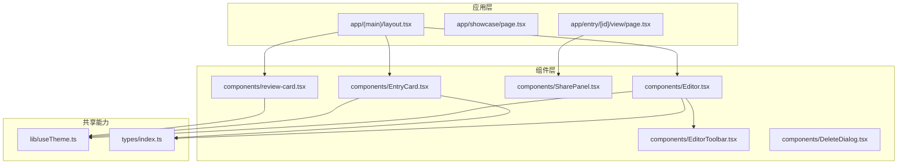
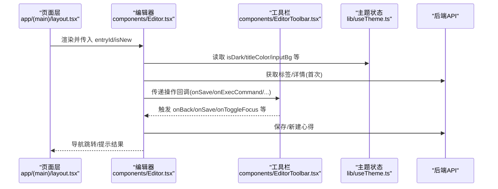
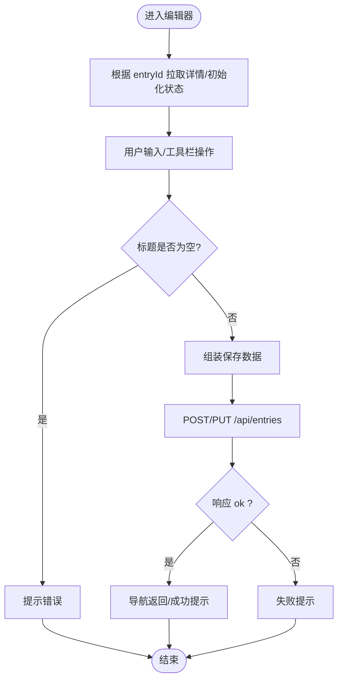
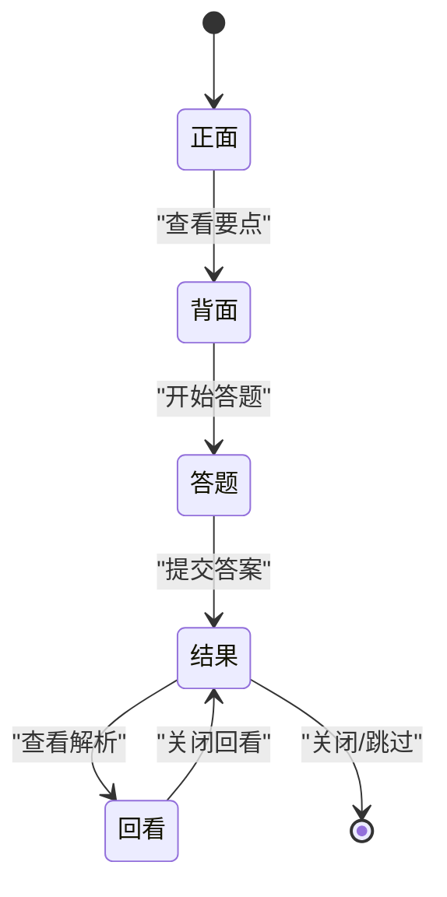
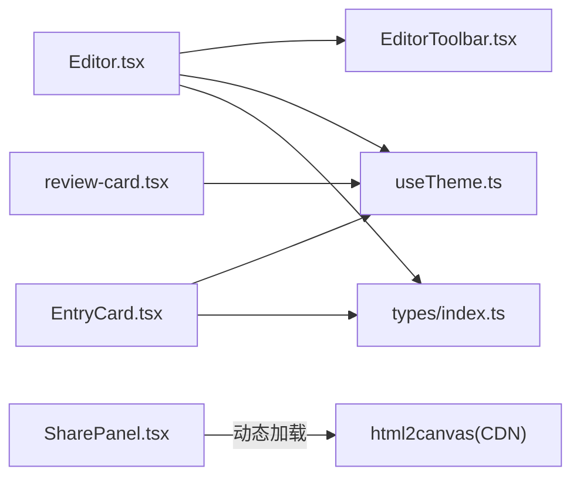

# 组件库组织

<cite>
**本文引用的文件**
- [package.json](file://package.json)
- [README.md](file://README.md)
- [components/Editor.tsx](file://components/Editor.tsx)
- [components/EditorToolbar.tsx](file://components/EditorToolbar.tsx)
- [components/DeleteDialog.tsx](file://components/DeleteDialog.tsx)
- [components/EntryCard.tsx](file://components/EntryCard.tsx)
- [components/SharePanel.tsx](file://components/SharePanel.tsx)
- [components/review-card.tsx](file://components/review-card.tsx)
- [lib/useTheme.ts](file://lib/useTheme.ts)
- [types/index.ts](file://types/index.ts)
- [app/(main)/layout.tsx](file://app/(main)/layout.tsx)
- [app/showcase/page.tsx](file://app/showcase/page.tsx)
- [app/entry/[id]/view/page.tsx](file://app/entry/[id]/view/page.tsx)
- [doc/新芽dev-framework.md](file://doc/新芽dev-framework.md)
- [doc/心芽各页面标题行高对齐规范.md](file://doc/心芽各页面标题行高对齐规范.md)
</cite>

## 目录
1. [引言](#引言)
2. [项目结构](#项目结构)
3. [核心组件](#核心组件)
4. [架构总览](#架构总览)
5. [详细组件分析](#详细组件分析)
6. [依赖关系分析](#依赖关系分析)
7. [性能与打包优化](#性能与打包优化)
8. [测试策略与框架搭建](#测试策略与框架搭建)
9. [版本管理与向后兼容](#版本管理与向后兼容)
10. [文档与示例组织](#文档与示例组织)
11. [发布流程与依赖管理](#发布流程与依赖管理)
12. [故障排查指南](#故障排查指南)
13. [结论](#结论)

## 引言
本文件面向“心芽”项目的组件库组织，聚焦于：
- 组件目录的组织原则与命名规范
- 公共组件与业务组件的区分标准、通用性与复用性
- 组件间通信模式（父子、兄弟、跨层级）
- 版本管理与向后兼容性保证
- 文档生成与示例代码组织
- 导入优化与打包策略
- 单元测试与集成测试框架搭建
- 发布流程与依赖管理策略

目标读者包括前端开发者、技术负责人与产品工程师。

## 项目结构
当前仓库采用 Next.js App Router 的前端工程结构，组件集中在 components 目录，类型定义在 types，主题状态在 lib，页面与路由在 app，设计/开发规范在 doc。

图表来源
- [app/(main)/layout.tsx](file://app/(main)/layout.tsx#L104-L172)
- [app/showcase/page.tsx:225-277](file://app/showcase/page.tsx#L225-L277)
- [app/entry/[id]/view/page.tsx](file://app/entry/[id]/view/page.tsx#L212-L244)
- [components/Editor.tsx:1-192](file://components/Editor.tsx#L1-L192)
- [components/EditorToolbar.tsx:1-78](file://components/EditorToolbar.tsx#L1-L78)
- [components/EntryCard.tsx:1-138](file://components/EntryCard.tsx#L1-L138)
- [components/DeleteDialog.tsx:1-45](file://components/DeleteDialog.tsx#L1-L45)
- [components/SharePanel.tsx:1-295](file://components/SharePanel.tsx#L1-L295)
- [components/review-card.tsx:1-321](file://components/review-card.tsx#L1-L321)
- [lib/useTheme.ts:1-30](file://lib/useTheme.ts#L1-L30)
- [types/index.ts:1-48](file://types/index.ts#L1-L48)

章节来源
- [package.json:1-40](file://package.json#L1-L40)
- [README.md:1-37](file://README.md#L1-L37)

## 核心组件
- Editor：富文本编辑主容器，负责数据加载、保存、标签选择、心情标记、字数统计、专注模式等。
- EditorToolbar：编辑器工具栏，提供加粗、斜体、下划线、列表、颜色选择、标签面板开关、专注模式切换等。
- EntryCard：心得卡片展示，支持收藏、置顶、删除入口、标签与心情展示。
- DeleteDialog：删除确认弹窗，统一二次确认交互。
- SharePanel：截图分享面板，动态加载 html2canvas，生成图片并支持系统分享或下载。
- review-card：复习卡片，支持单选/多选/判断题型，提交答案后反馈与解析回看。

章节来源
- [components/Editor.tsx:1-192](file://components/Editor.tsx#L1-L192)
- [components/EditorToolbar.tsx:1-78](file://components/EditorToolbar.tsx#L1-L78)
- [components/EntryCard.tsx:1-138](file://components/EntryCard.tsx#L1-L138)
- [components/DeleteDialog.tsx:1-45](file://components/DeleteDialog.tsx#L1-L45)
- [components/SharePanel.tsx:1-295](file://components/SharePanel.tsx#L1-L295)
- [components/review-card.tsx:1-321](file://components/review-card.tsx#L1-L321)

## 架构总览
组件层通过 props 进行单向数据流传递；主题状态通过 useTheme 钩子全局共享；部分功能通过事件回调向父级或页面层上报；第三方库按需动态加载以减少首屏体积。

图表来源
- [app/(main)/layout.tsx](file://app/(main)/layout.tsx#L104-L172)
- [components/Editor.tsx:1-192](file://components/Editor.tsx#L1-L192)
- [components/EditorToolbar.tsx:1-78](file://components/EditorToolbar.tsx#L1-L78)
- [lib/useTheme.ts:1-30](file://lib/useTheme.ts#L1-L30)

## 详细组件分析

### 编辑器与工具栏（Editor + EditorToolbar）
- 职责划分
  - Editor：业务编排（数据请求、状态聚合、保存逻辑）、内容区控制、标签与心情管理。
  - EditorToolbar：纯 UI 交互，仅暴露回调，不持有业务状态。
- 通信模式
  - 父子通信：Editor 通过 props 将命令函数传递给 EditorToolbar，Toolbar 通过回调通知 Editor。
  - 主题共享：两者均消费 useTheme 提供的主题变量。
- 关键流程
  - 初始化：根据 entryId 拉取详情，填充标题、富文本、心情与标签。
  - 保存：校验标题非空，构造请求体，调用 API，成功后导航。
  - 工具栏：执行 execCommand、插入列表、打开颜色选择器、切换标签面板与专注模式。

图表来源
- [components/Editor.tsx:1-192](file://components/Editor.tsx#L1-L192)
- [components/EditorToolbar.tsx:1-78](file://components/EditorToolbar.tsx#L1-L78)

章节来源
- [components/Editor.tsx:1-192](file://components/Editor.tsx#L1-L192)
- [components/EditorToolbar.tsx:1-78](file://components/EditorToolbar.tsx#L1-L78)
- [lib/useTheme.ts:1-30](file://lib/useTheme.ts#L1-L30)

### 心得卡片（EntryCard）
- 职责：展示单条心得摘要，提供收藏、置顶、删除入口，点击跳转详情页。
- 通信：通过回调 onToggleFavorite/onTogglePin/onDelete 与父级同步状态；内部发起 PATCH 更新收藏态。
- 主题适配：使用 useTheme 提供的颜色变量。

章节来源
- [components/EntryCard.tsx:1-138](file://components/EntryCard.tsx#L1-L138)
- [lib/useTheme.ts:1-30](file://lib/useTheme.ts#L1-L30)

### 删除确认弹窗（DeleteDialog）
- 职责：统一的删除二次确认，避免误删。
- 通信：open 控制显隐，onConfirm/onCancel 由父级处理后续逻辑。
- 可访问性：居中遮罩、键盘友好按钮布局。

章节来源
- [components/DeleteDialog.tsx:1-45](file://components/DeleteDialog.tsx#L1-L45)

### 截图分享面板（SharePanel）
- 职责：将指定区域渲染为图片，支持系统分享或下载。
- 关键点：动态加载 html2canvas，避免首屏冗余；捕获时按主题色设置背景；移动端优先走 Web Share API，降级为下载。
- 通信：接收 entry 信息，关闭回调 onClose。

章节来源
- [components/SharePanel.tsx:1-295](file://components/SharePanel.tsx#L1-L295)
- [app/entry/[id]/view/page.tsx](file://app/entry/[id]/view/page.tsx#L212-L244)

### 复习卡片（review-card）
- 职责：呈现概念要点与题目，支持单选/多选/判断，提交后给出正确率与解析。
- 通信：onClose/onSkip 由父级控制生命周期；提交答案到 /api/review/answer。
- 状态机：正面→背面→答题→结果→回看。

图表来源
- [components/review-card.tsx:1-321](file://components/review-card.tsx#L1-L321)

章节来源
- [components/review-card.tsx:1-321](file://components/review-card.tsx#L1-L321)

## 依赖关系分析
- 组件内聚与耦合
  - Editor 与 EditorToolbar 强耦合（命令式交互），但通过回调解耦具体实现。
  - EntryCard、DeleteDialog、SharePanel、review-card 相对独立，适合在不同页面复用。
- 外部依赖
  - lucide-react：图标库。
  - react-hot-toast：轻量提示。
  - html2canvas：按需动态加载，减少包体。
- 主题与类型
  - useTheme 提供全局主题变量，被多个组件消费。
  - types/index.ts 定义通用数据结构，提升一致性。

图表来源
- [components/Editor.tsx:1-192](file://components/Editor.tsx#L1-L192)
- [components/EditorToolbar.tsx:1-78](file://components/EditorToolbar.tsx#L1-L78)
- [components/EntryCard.tsx:1-138](file://components/EntryCard.tsx#L1-L138)
- [components/SharePanel.tsx:1-295](file://components/SharePanel.tsx#L1-L295)
- [components/review-card.tsx:1-321](file://components/review-card.tsx#L1-L321)
- [lib/useTheme.ts:1-30](file://lib/useTheme.ts#L1-L30)
- [types/index.ts:1-48](file://types/index.ts#L1-L48)

章节来源
- [package.json:1-40](file://package.json#L1-L40)
- [types/index.ts:1-48](file://types/index.ts#L1-L48)

## 性能与打包优化
- 动态加载重型库
  - SharePanel 通过脚本注入方式按需加载 html2canvas，降低首屏体积。
- 主题与样式
  - 使用 Tailwind CSS 原子类，配合 useTheme 的颜色变量，避免重复样式。
- 路由与页面拆分
  - 基于 Next.js App Router 的路由分割，天然具备按需加载能力。
- 建议
  - 对大型第三方库继续采用动态 import 或 CDN 引入。
  - 对长列表使用虚拟滚动（如未来扩展）。
  - 图片资源使用 next/image 或 CDN 缓存。

[本节为通用指导，无需源码引用]

## 测试策略与框架搭建
- 单元测试
  - 推荐 Jest + React Testing Library，覆盖组件渲染、交互与边界条件。
  - 用例参考：
    - Editor 保存流程：标题为空应阻止提交并提示。
    - EntryCard 收藏切换：点击后回调与本地状态一致。
    - DeleteDialog 显隐与确认取消行为。
    - SharePanel 动态加载失败时的错误提示。
- 集成测试
  - 推荐 Playwright/Cypress，模拟完整用户路径：登录 → 创建心得 → 标签选择 → 保存 → 查看详情 → 分享截图。
- 接口契约
  - 基于 types/index.ts 的 ApiResponse 与实体类型，确保前后端数据一致性。
- 持续集成
  - 在 CI 中运行 lint、test、build，阻断不合格提交。

[本节为通用指导，无需源码引用]

## 版本管理与向后兼容
- 语义化版本
  - 遵循 SemVer，变更公开 Props/API 时升级次版本号，破坏性变更升级主版本号。
- 向后兼容策略
  - 新增可选 Props 保持默认值，废弃字段保留一段时间并提供迁移提示。
  - 对外暴露的类型在 types/index.ts 中集中维护，避免散乱定义。
- 变更日志
  - 建议在根目录或 doc 中维护 CHANGELOG，记录重要修复与特性。

[本节为通用指导，无需源码引用]

## 文档与示例组织
- 设计规范
  - 页面标题行高对齐规范已在 doc 中沉淀，便于多页面视觉一致性。
- 示例页面
  - showcase 页面可作为组件演示与风格指南的载体，集中展示常用组件用法。
- 文档生成
  - 建议引入 Storybook 或自建示例页，结合 TypeScript 自动补全与类型约束。

章节来源
- [doc/心芽各页面标题行高对齐规范.md:1-154](file://doc/心芽各页面标题行高对齐规范.md#L1-L154)
- [app/showcase/page.tsx:225-277](file://app/showcase/page.tsx#L225-L277)

## 发布流程与依赖管理
- 构建与启动
  - 使用 package.json 中的脚本进行开发、构建与启动。
- 部署
  - 服务器从 Gitee 拉取代码，执行构建并通过 PM2 重启服务。
- 依赖管理
  - 锁定依赖版本，定期审计安全漏洞。
  - 第三方库尽量使用稳定版本，避免频繁升级带来的回归风险。

章节来源
- [package.json:1-40](file://package.json#L1-L40)
- [doc/新电脑快速安装心芽程序Prompt.md:1-53](file://doc/新电脑快速安装心芽程序Prompt.md#L1-L53)

## 故障排查指南
- SSR Hydration 问题
  - 主题初始化需放在客户端 useEffect 中，避免服务端与客户端 DOM 不一致导致闪烁或样式错乱。
- 截图分享失败
  - 检查网络是否允许加载 CDN 脚本；移动端浏览器是否支持 Web Share API；必要时降级为下载。
- 富文本粘贴异常
  - 粘贴时剥离样式，仅保留文本或使用白名单净化策略。

章节来源
- [doc/暗色系修改经验总结.md:48-178](file://doc/暗色系修改经验总结.md#L48-L178)
- [components/SharePanel.tsx:1-295](file://components/SharePanel.tsx#L1-L295)
- [components/Editor.tsx:1-192](file://components/Editor.tsx#L1-L192)

## 结论
本项目组件组织清晰，职责明确，采用“页面编排 + 组件复用 + 主题共享”的模式，具备良好的可扩展性与可维护性。建议后续引入更完善的测试体系与文档站点，持续优化动态加载与包体体积，完善版本与变更管理流程，进一步提升团队协作效率与交付质量。