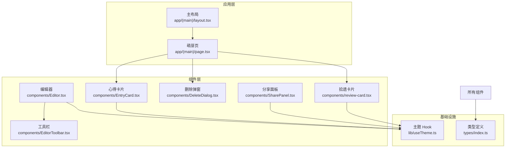
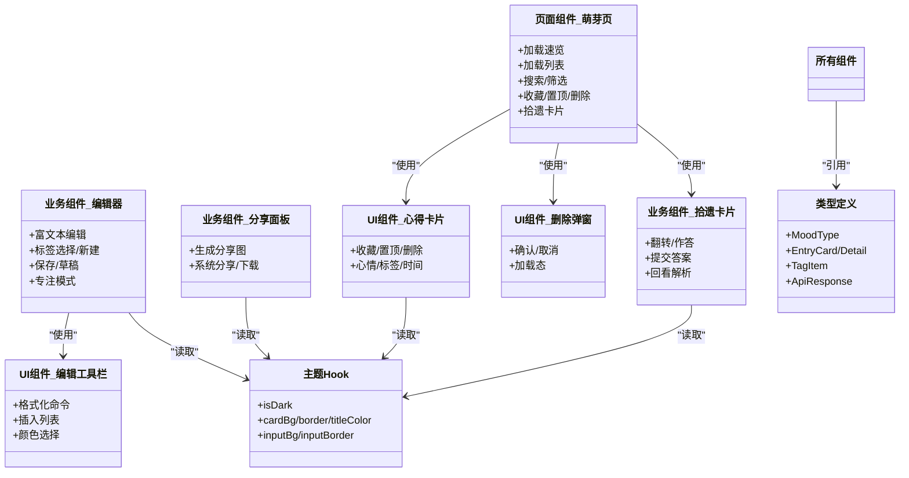
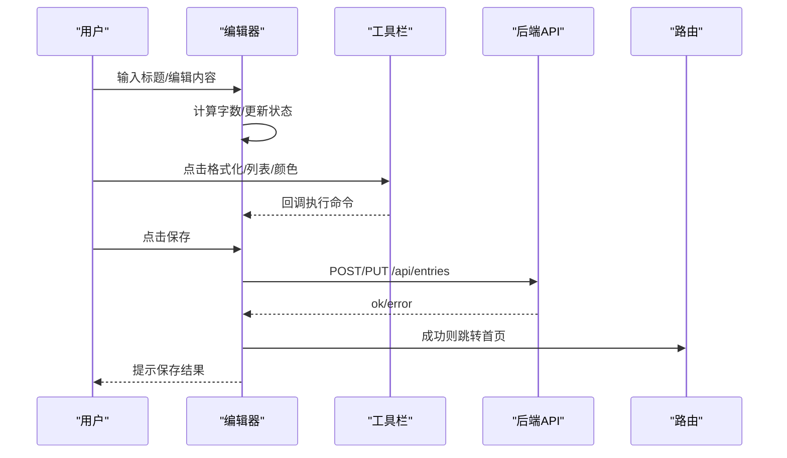
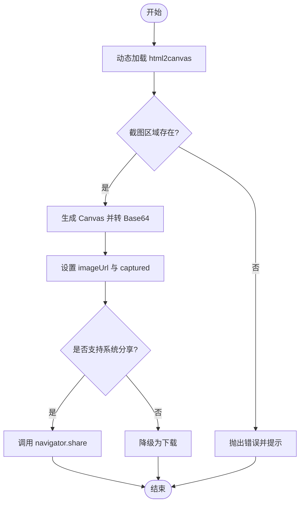
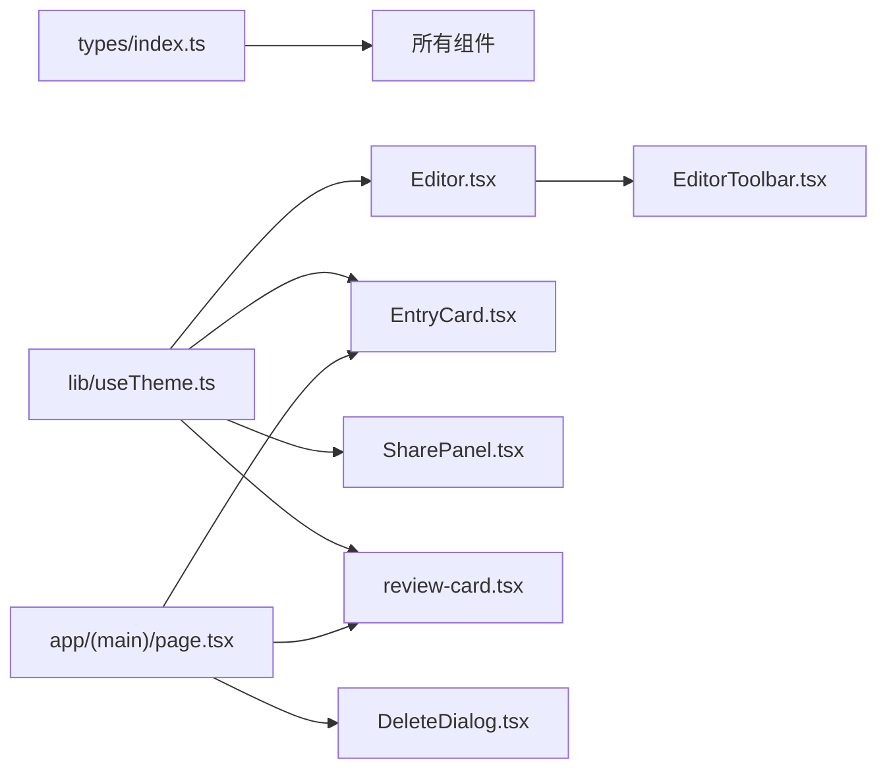

# 组件设计原则

<cite>
**本文引用的文件**
- [components/Editor.tsx](file://components/Editor.tsx)
- [components/EditorToolbar.tsx](file://components/EditorToolbar.tsx)
- [components/EntryCard.tsx](file://components/EntryCard.tsx)
- [components/DeleteDialog.tsx](file://components/DeleteDialog.tsx)
- [components/SharePanel.tsx](file://components/SharePanel.tsx)
- [components/review-card.tsx](file://components/review-card.tsx)
- [types/index.ts](file://types/index.ts)
- [lib/useTheme.ts](file://lib/useTheme.ts)
- [app/(main)/layout.tsx](file://app/(main)/layout.tsx)
- [app/(main)/page.tsx](file://app/(main)/page.tsx)
- [doc/新芽dev-framework.md](file://doc/新芽dev-framework.md)
- [doc/心芽各页面标题行高对齐规范.md](file://doc/心芽各页面标题行高对齐规范.md)
</cite>

## 目录
1. [引言](#引言)
2. [项目结构](#项目结构)
3. [核心组件](#核心组件)
4. [架构总览](#架构总览)
5. [详细组件分析](#详细组件分析)
6. [依赖关系分析](#依赖关系分析)
7. [性能考量](#性能考量)
8. [故障排查指南](#故障排查指南)
9. [结论](#结论)
10. [附录](#附录)

## 引言
本文件面向“心芽”项目的 React 组件设计与实现，系统化阐述组件分类体系、Props 接口规范、状态管理策略、事件与回调设计、可访问性与国际化支持、测试策略与性能优化、样式组织与主题适配等关键原则。文档以现有代码为依据，提炼出可复用的设计规范与实践建议，帮助团队在后续迭代中保持一致性、可维护性与可扩展性。

## 项目结构
本项目采用 Next.js App Router 的客户端组件（"use client"）模式，业务页面位于 app 目录，通用 UI 与业务组件集中在 components 目录，类型定义集中于 types，主题能力通过 lib/useTheme 提供，布局与全局导航由 layout 统一管理。

图表来源
- [app/(main)/layout.tsx:30-173](file://app/(main)/layout.tsx#L30-L173)
- [app/(main)/page.tsx:1-405](file://app/(main)/page.tsx#L1-L405)
- [components/Editor.tsx:1-192](file://components/Editor.tsx#L1-L192)
- [components/EditorToolbar.tsx:1-78](file://components/EditorToolbar.tsx#L1-L78)
- [components/EntryCard.tsx:1-138](file://components/EntryCard.tsx#L1-L138)
- [components/DeleteDialog.tsx:1-45](file://components/DeleteDialog.tsx#L1-L45)
- [components/SharePanel.tsx:1-295](file://components/SharePanel.tsx#L1-L295)
- [components/review-card.tsx:1-321](file://components/review-card.tsx#L1-L321)
- [types/index.ts:1-48](file://types/index.ts#L1-L48)
- [lib/useTheme.ts:1-30](file://lib/useTheme.ts#L1-L30)

章节来源
- [app/(main)/layout.tsx:30-173](file://app/(main)/layout.tsx#L30-L173)
- [app/(main)/page.tsx:1-405](file://app/(main)/page.tsx#L1-L405)
- [components/Editor.tsx:1-192](file://components/Editor.tsx#L1-L192)
- [components/EditorToolbar.tsx:1-78](file://components/EditorToolbar.tsx#L1-L78)
- [components/EntryCard.tsx:1-138](file://components/EntryCard.tsx#L1-L138)
- [components/DeleteDialog.tsx:1-45](file://components/DeleteDialog.tsx#L1-L45)
- [components/SharePanel.tsx:1-295](file://components/SharePanel.tsx#L1-L295)
- [components/review-card.tsx:1-321](file://components/review-card.tsx#L1-L321)
- [types/index.ts:1-48](file://types/index.ts#L1-L48)
- [lib/useTheme.ts:1-30](file://lib/useTheme.ts#L1-L30)

## 核心组件
- 页面组件：负责路由级组合、数据加载与页面级状态，如萌芽页聚合列表、筛选、速览与拾遗卡片。
- 业务组件：封装具体业务交互与展示，如编辑器、分享面板、拾遗答题卡片。
- UI 组件：纯展示与基础交互，如删除确认弹窗、编辑工具栏、心得卡片。

职责划分
- 页面组件：编排子组件、处理跨子组件的状态提升、统一错误提示与用户反馈。
- 业务组件：承载领域逻辑（富文本编辑、截图分享、复习答题），对外暴露最小 Props 接口。
- UI 组件：无副作用或最小副作用，仅渲染与触发回调，便于复用与测试。

章节来源
- [app/(main)/page.tsx:1-405](file://app/(main)/page.tsx#L1-L405)
- [components/Editor.tsx:1-192](file://components/Editor.tsx#L1-L192)
- [components/SharePanel.tsx:1-295](file://components/SharePanel.tsx#L1-L295)
- [components/review-card.tsx:1-321](file://components/review-card.tsx#L1-L321)
- [components/DeleteDialog.tsx:1-45](file://components/DeleteDialog.tsx#L1-L45)
- [components/EditorToolbar.tsx:1-78](file://components/EditorToolbar.tsx#L1-L78)
- [components/EntryCard.tsx:1-138](file://components/EntryCard.tsx#L1-L138)

## 架构总览
整体采用“页面编排 + 业务组件 + 轻量 UI 组件”的分层结构，配合统一的类型系统与主题 Hook，形成清晰的依赖边界与稳定的扩展点。

图表来源
- [app/(main)/page.tsx:1-405](file://app/(main)/page.tsx#L1-L405)
- [components/Editor.tsx:1-192](file://components/Editor.tsx#L1-L192)
- [components/EditorToolbar.tsx:1-78](file://components/EditorToolbar.tsx#L1-L78)
- [components/EntryCard.tsx:1-138](file://components/EntryCard.tsx#L1-L138)
- [components/DeleteDialog.tsx:1-45](file://components/DeleteDialog.tsx#L1-L45)
- [components/SharePanel.tsx:1-295](file://components/SharePanel.tsx#L1-L295)
- [components/review-card.tsx:1-321](file://components/review-card.tsx#L1-L321)
- [types/index.ts:1-48](file://types/index.ts#L1-L48)
- [lib/useTheme.ts:1-30](file://lib/useTheme.ts#L1-L30)

## 详细组件分析

### 编辑器组件（Editor）
- 职责：富文本编辑、标签管理、心情选择、保存流程、专注模式。
- 状态管理：局部状态为主（标题、内容、心情、标签、保存态、字数统计、焦点模式），通过 ref 持有 DOM 引用进行富文本操作。
- 受控与非受控混合：标题为受控输入；富文本区域为非受控 contentEditable，通过 onInput 同步字数统计。
- 事件与回调：将工具栏操作（加粗、斜体、下划线、列表、颜色）通过回调传递给工具栏；保存时调用 API 并路由跳转。
- 可访问性：占位符通过 data-placeholder 与 CSS 伪元素实现；按钮具备语义化结构与键盘可操作。
- 国际化：当前文案硬编码中文，未引入 i18n 库；建议在类型层增加语言键映射，逐步抽离文案。
- 主题适配：通过 useTheme 获取 isDark、titleColor、inputBg、inputBorder 等变量，动态设置背景与边框。
- 性能：避免频繁重绘，仅在必要处更新状态；粘贴时阻止默认行为并插入纯文本，减少富文本污染。

图表来源
- [components/Editor.tsx:1-192](file://components/Editor.tsx#L1-L192)
- [components/EditorToolbar.tsx:1-78](file://components/EditorToolbar.tsx#L1-L78)

章节来源
- [components/Editor.tsx:1-192](file://components/Editor.tsx#L1-L192)
- [components/EditorToolbar.tsx:1-78](file://components/EditorToolbar.tsx#L1-L78)

### 编辑工具栏（EditorToolbar）
- 职责：提供富文本格式化、列表插入、标签开关、专注模式切换、保存入口与字数显示。
- 事件设计：通过回调 onExecCommand/onInsertList 将命令下发给父组件，保持工具栏无副作用。
- 主题适配：根据 isDark 调整背景、边框与图标颜色。
- 可访问性：按钮具备明确语义与 hover/focus 态，颜色选择器通过定位弹出。

章节来源
- [components/EditorToolbar.tsx:1-78](file://components/EditorToolbar.tsx#L1-L78)

### 心得卡片（EntryCard）
- 职责：展示单条心得的标题、预览、标签、心情、时间，并提供收藏、置顶、删除等快捷操作。
- 状态管理：本地菜单展开状态；收藏/置顶/删除通过回调交由页面组件协调。
- 事件与回调：onToggleFavorite/onTogglePin/onDelete 由页面组件实现乐观更新与网络请求。
- 主题适配：根据 isDark 切换卡片背景、边框与文字色。
- 可访问性：按钮具备 aria-hidden 控制装饰性 SVG，主要交互可通过键盘完成。

章节来源
- [components/EntryCard.tsx:1-138](file://components/EntryCard.tsx#L1-L138)

### 删除弹窗（DeleteDialog）
- 职责：二次确认删除，支持 loading 态与可选标题展示。
- 状态管理：open 控制显隐，loading 控制按钮禁用。
- 事件与回调：onConfirm/onCancel 由上层决定实际删除逻辑。
- 可访问性：模态框层级固定，遮罩点击关闭，按钮具备清晰语义。

章节来源
- [components/DeleteDialog.tsx:1-45](file://components/DeleteDialog.tsx#L1-L45)

### 分享面板（SharePanel）
- 职责：将心得内容渲染为图片，支持系统分享或下载。
- 状态管理：capturing/captured/imageUrl/error 控制流程；ref 指向截图区域。
- 异步流程：动态加载 html2canvas，生成 canvas 后转 base64，再转为 File 对象进行分享或下载。
- 主题适配：截图背景与文字颜色跟随 isDark。
- 可访问性：图片 alt 描述、关闭按钮语义清晰。

图表来源
- [components/SharePanel.tsx:1-295](file://components/SharePanel.tsx#L1-L295)

章节来源
- [components/SharePanel.tsx:1-295](file://components/SharePanel.tsx#L1-L295)

### 拾遗卡片（ReviewCard）
- 职责：呈现概念要点与题目，支持单选/多选/判断，提交后展示结果与解析，并可回看选项。
- 状态管理：flipped/answering/submitted/result/loading/showReview 等多阶段状态。
- 事件与回调：toggleOption 控制选中项；handleSubmit 提交答案；onClose/onSkip 由页面控制。
- 主题适配：根据 isDark 切换卡片背景、边框与文字色。
- 可访问性：选项按钮具备键盘操作与视觉反馈，关闭按钮语义清晰。

章节来源
- [components/review-card.tsx:1-321](file://components/review-card.tsx#L1-L321)

### 页面编排（萌芽页）
- 职责：聚合今日速览、心得列表、筛选与搜索、收藏/置顶/删除、拾遗卡片。
- 状态管理：列表分页、加载态、筛选条件、删除目标、拾遗卡片显隐。
- 事件与回调：对 EntryCard 的收藏/置顶/删除进行乐观更新与网络请求；删除通过 DeleteDialog 二次确认。
- 主题适配：通过 useTheme 获取主题变量，统一页面风格。
- 可访问性：搜索/筛选按钮具备语义化结构，空状态与加载状态友好提示。

章节来源
- [app/(main)/page.tsx:1-405](file://app/(main)/page.tsx#L1-L405)

## 依赖关系分析
- 组件耦合度：页面组件与业务组件之间通过 Props 与回调解耦；UI 组件尽量无副作用，降低耦合。
- 直接依赖：
  - 编辑器依赖工具栏与主题 Hook。
  - 卡片、分享面板、拾遗卡片依赖主题 Hook。
  - 页面编排依赖多个 UI 与业务组件。
- 间接依赖：类型定义被多处引用，保证数据结构一致性。
- 外部集成：html2canvas 动态加载；Next.js 路由与 fetch API。

图表来源
- [types/index.ts:1-48](file://types/index.ts#L1-L48)
- [lib/useTheme.ts:1-30](file://lib/useTheme.ts#L1-L30)
- [components/Editor.tsx:1-192](file://components/Editor.tsx#L1-L192)
- [components/EditorToolbar.tsx:1-78](file://components/EditorToolbar.tsx#L1-L78)
- [components/EntryCard.tsx:1-138](file://components/EntryCard.tsx#L1-L138)
- [components/DeleteDialog.tsx:1-45](file://components/DeleteDialog.tsx#L1-L45)
- [components/SharePanel.tsx:1-295](file://components/SharePanel.tsx#L1-L295)
- [components/review-card.tsx:1-321](file://components/review-card.tsx#L1-L321)
- [app/(main)/page.tsx:1-405](file://app/(main)/page.tsx#L1-L405)

章节来源
- [types/index.ts:1-48](file://types/index.ts#L1-L48)
- [lib/useTheme.ts:1-30](file://lib/useTheme.ts#L1-L30)
- [components/Editor.tsx:1-192](file://components/Editor.tsx#L1-L192)
- [components/EditorToolbar.tsx:1-78](file://components/EditorToolbar.tsx#L1-L78)
- [components/EntryCard.tsx:1-138](file://components/EntryCard.tsx#L1-L138)
- [components/DeleteDialog.tsx:1-45](file://components/DeleteDialog.tsx#L1-L45)
- [components/SharePanel.tsx:1-295](file://components/SharePanel.tsx#L1-L295)
- [components/review-card.tsx:1-321](file://components/review-card.tsx#L1-L321)
- [app/(main)/page.tsx:1-405](file://app/(main)/page.tsx#L1-L405)

## 性能考量
- 富文本编辑：避免在每次输入时全量重算，仅更新字数统计；粘贴时插入纯文本，减少格式污染导致的重排。
- 截图分享：按需动态加载第三方库，避免首屏阻塞；生成图片时使用合理 scale 与窗口尺寸，平衡清晰度与内存占用。
- 列表渲染：分页加载与增量追加，减少一次性渲染大量节点；对长列表考虑虚拟滚动（未来优化）。
- 主题切换：使用过渡动画平滑切换背景与边框，避免 FOUC；布局层通过 useEffect 读取 localStorage，确保 SSR hydration 一致。
- 事件节流：高频操作（如输入、滚动）可考虑防抖/节流，降低重渲染频率。

[本节为通用指导，不直接分析具体文件]

## 故障排查指南
- 主题刷新失效（SSR Hydration 不一致）：
  - 现象：切换暗色后刷新，背景恢复亮色，但子组件仍为暗色。
  - 根因：SSR 阶段无法访问 window，useState 初始值依赖 localStorage 导致 hydration mismatch。
  - 解决：在布局中使用 useEffect 读取 localStorage 并更新状态；必要时在 head 内联脚本提前设置背景色，消除闪烁。
- 富文本粘贴异常：
  - 现象：粘贴带样式的 HTML 导致格式混乱。
  - 解决：拦截 paste 事件，插入纯文本；限制 execCommand 的使用范围。
- 截图失败：
  - 现象：html2canvas 加载失败或截图区域不存在。
  - 解决：增加错误分支与重试提示；确保 captureRef 已挂载且可见。
- 删除操作失败：
  - 现象：网络异常导致前端状态与后端不一致。
  - 解决：采用乐观更新+回滚机制；统一错误提示与重试入口。

章节来源
- [doc/暗色系修改经验总结.md](file://doc/暗色系修改经验总结.md)
- [components/Editor.tsx:1-192](file://components/Editor.tsx#L1-L192)
- [components/SharePanel.tsx:1-295](file://components/SharePanel.tsx#L1-L295)
- [app/(main)/page.tsx:1-405](file://app/(main)/page.tsx#L1-L405)

## 结论
“心芽”的组件体系遵循清晰的职责分层与最小 Props 接口原则，结合类型系统与主题 Hook，实现了良好的可维护性与可扩展性。富文本编辑、截图分享与拾遗答题等业务组件在状态管理与事件设计上表现稳健。后续可在可访问性增强、国际化支持与性能优化方面持续完善，进一步提升用户体验与工程效率。

[本节为总结性内容，不直接分析具体文件]

## 附录

### Props 接口设计规范
- 类型定义：
  - 使用 TypeScript interface/type 明确 Props 字段与可选性，避免 any。
  - 公共类型集中存放于 types/index.ts，如 MoodType、EntryCard、TagItem、ApiResponse 等。
- 默认值处理：
  - 对可选字段提供合理的默认值（如 isDark=false、title=""），确保组件在无传入时仍可安全渲染。
- 验证机制：
  - 在组件内部进行必要的前端校验（如必填字段、长度限制），并在保存前统一提示。
  - 对于复杂表单，建议引入运行时校验库（如 zod/yup）以提升健壮性。

章节来源
- [types/index.ts:1-48](file://types/index.ts#L1-L48)
- [components/DeleteDialog.tsx:1-45](file://components/DeleteDialog.tsx#L1-L45)
- [components/EntryCard.tsx:1-138](file://components/EntryCard.tsx#L1-L138)
- [components/Editor.tsx:1-192](file://components/Editor.tsx#L1-L192)

### 状态管理策略
- 局部状态：适用于组件内部短期状态（如菜单展开、加载态、选中项）。
- 受控组件：输入类组件优先受控，保证状态与视图一致。
- 非受控组件：富文本区域使用 ref 与 contentEditable，减少不必要的重渲染。
- 状态提升：跨组件共享状态（如收藏/置顶）提升到页面组件，通过回调传递。

章节来源
- [app/(main)/page.tsx:1-405](file://app/(main)/page.tsx#L1-L405)
- [components/Editor.tsx:1-192](file://components/Editor.tsx#L1-L192)
- [components/EntryCard.tsx:1-138](file://components/EntryCard.tsx#L1-L138)

### 事件处理与回调设计
- 命名约定：onXxx 表示回调，参数最小化且具名，避免隐式 this。
- 幂等性：回调应具备幂等特性，防止重复触发导致状态异常。
- 错误处理：网络请求失败时提供回滚与用户提示，保证体验连贯。

章节来源
- [components/EntryCard.tsx:1-138](file://components/EntryCard.tsx#L1-L138)
- [components/Editor.tsx:1-192](file://components/Editor.tsx#L1-L192)
- [components/review-card.tsx:1-321](file://components/review-card.tsx#L1-L321)

### 可访问性与国际化
- 可访问性：
  - 按钮与链接具备语义化标签；装饰性 SVG 使用 aria-hidden。
  - 模态框具备关闭按钮与遮罩点击关闭；键盘可操作。
- 国际化：
  - 当前文案硬编码中文，建议引入 i18n 库（如 next-intl），将文案抽离至资源文件，并通过 key 映射到组件。

章节来源
- [components/DeleteDialog.tsx:1-45](file://components/DeleteDialog.tsx#L1-L45)
- [components/EntryCard.tsx:1-138](file://components/EntryCard.tsx#L1-L138)
- [components/SharePanel.tsx:1-295](file://components/SharePanel.tsx#L1-L295)
- [components/review-card.tsx:1-321](file://components/review-card.tsx#L1-L321)

### 测试策略
- 单元测试：对 UI 组件进行快照与交互测试（如按钮点击、菜单展开）。
- 集成测试：对业务组件进行端到端流程测试（如编辑器保存、分享面板生成图片）。
- 边界用例：参考开发框架中的基线与边界测试表，覆盖空状态、网络异常、超长输入等场景。

章节来源
- [doc/新芽dev-framework.md:378-419](file://doc/新芽dev-framework.md#L378-L419)

### 样式组织与主题适配
- 样式组织：
  - 使用 Tailwind CSS 快速构建，辅以少量 inline style 用于动态主题变量。
  - 统一标题行高与间距规范，避免页面切换时的跳动。
- 主题适配：
  - 通过 useTheme 提供 isDark 与常用颜色变量，组件按需消费。
  - 布局层在 useEffect 中读取 localStorage 并应用主题，避免 SSR hydration 不一致。

章节来源
- [lib/useTheme.ts:1-30](file://lib/useTheme.ts#L1-L30)
- [app/(main)/layout.tsx:30-173](file://app/(main)/layout.tsx#L30-L173)
- [doc/心芽各页面标题行高对齐规范.md:1-154](file://doc/心芽各页面标题行高对齐规范.md#L1-L154)