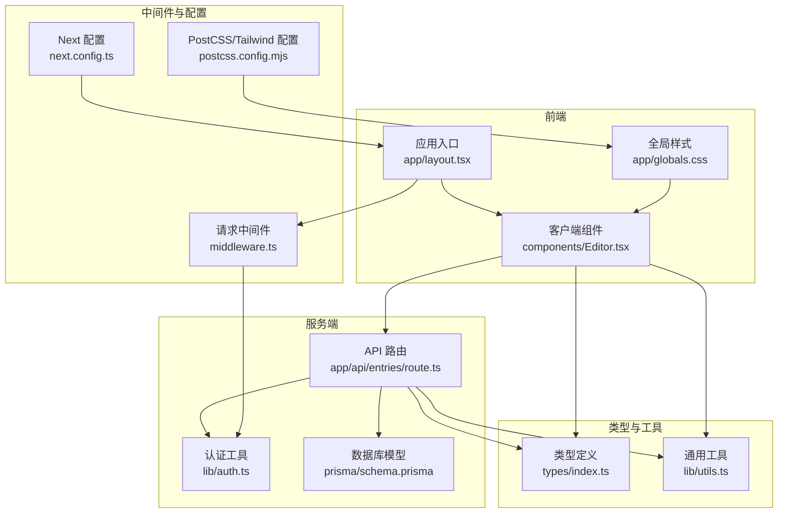
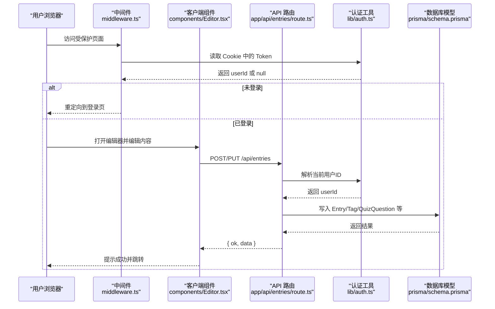
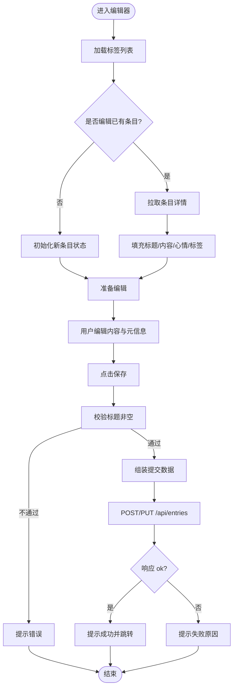
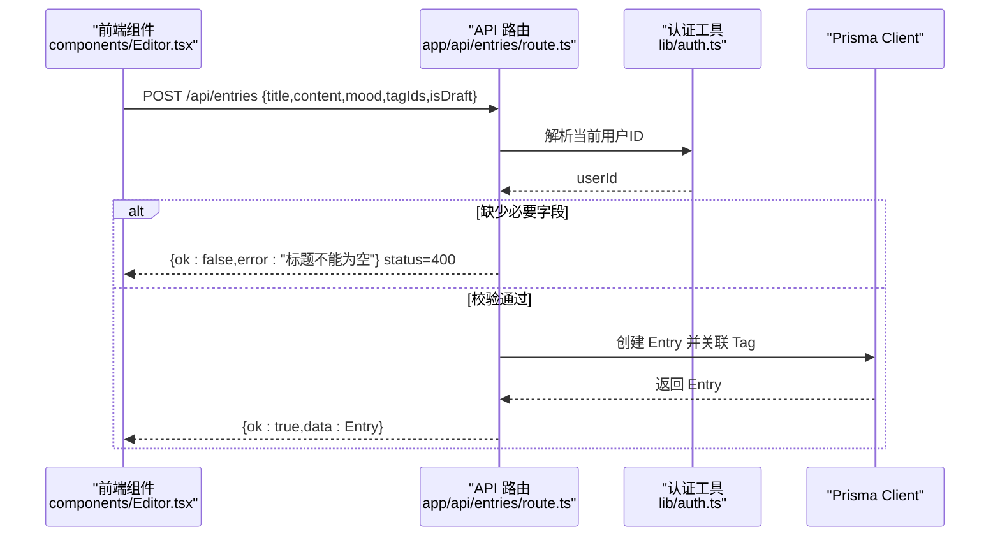
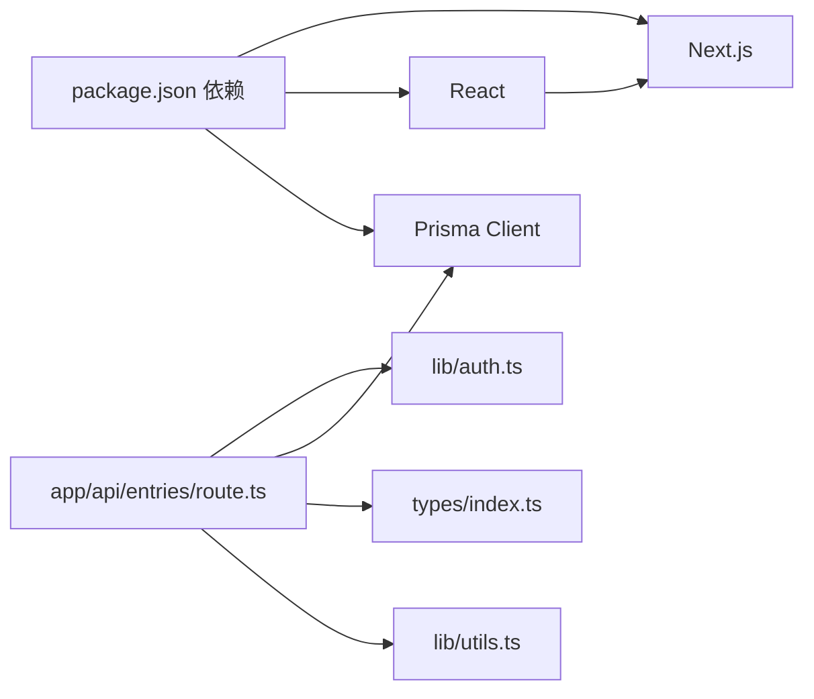

# 代码规范与质量

<cite>
**本文引用的文件**
- [tsconfig.json](file://tsconfig.json)
- [eslint.config.mjs](file://eslint.config.mjs)
- [package.json](file://package.json)
- [next.config.ts](file://next.config.ts)
- [postcss.config.mjs](file://postcss.config.mjs)
- [types/index.ts](file://types/index.ts)
- [components/Editor.tsx](file://components/Editor.tsx)
- [app/globals.css](file://app/globals.css)
- [lib/utils.ts](file://lib/utils.ts)
- [middleware.ts](file://middleware.ts)
- [app/api/entries/route.ts](file://app/api/entries/route.ts)
- [prisma/schema.prisma](file://prisma/schema.prisma)
- [lib/auth.ts](file://lib/auth.ts)
</cite>

## 目录
1. [引言](#引言)
2. [项目结构](#项目结构)
3. [核心组件](#核心组件)
4. [架构总览](#架构总览)
5. [详细组件分析](#详细组件分析)
6. [依赖分析](#依赖分析)
7. [性能考虑](#性能考虑)
8. [故障排查指南](#故障排查指南)
9. [结论](#结论)
10. [附录](#附录)

## 引言
本规范面向心芽项目的开发与维护，目标是统一 TypeScript、ESLint、Prettier（建议）、CSS/Tailwind CSS、React 组件与 API 接口的设计与实现标准，提升代码可读性、可维护性与运行稳定性。文档同时给出可视化图示与最佳实践路径，帮助不同技术背景的团队成员快速上手并保持一致的开发体验。

## 项目结构
本项目采用 Next.js App Router 组织页面与 API，结合 Prisma 进行数据建模，使用 Tailwind CSS v4 进行样式构建，并通过 ESLint 提供基础类型与 Web Vitals 检查。



图表来源
- [app/layout.tsx](file://app/layout.tsx)
- [app/globals.css](file://app/globals.css)
- [components/Editor.tsx](file://components/Editor.tsx)
- [middleware.ts](file://middleware.ts)
- [next.config.ts](file://next.config.ts)
- [postcss.config.mjs](file://postcss.config.mjs)
- [app/api/entries/route.ts](file://app/api/entries/route.ts)
- [lib/auth.ts](file://lib/auth.ts)
- [prisma/schema.prisma](file://prisma/schema.prisma)
- [types/index.ts](file://types/index.ts)
- [lib/utils.ts](file://lib/utils.ts)

章节来源
- [tsconfig.json:1-35](file://tsconfig.json#L1-L35)
- [eslint.config.mjs:1-19](file://eslint.config.mjs#L1-L19)
- [package.json:1-40](file://package.json#L1-L40)
- [next.config.ts:1-8](file://next.config.ts#L1-L8)
- [postcss.config.mjs:1-8](file://postcss.config.mjs#L1-L8)

## 核心组件
- 类型系统
  - 统一在 types/index.ts 中声明领域类型与 API 响应结构，确保前后端契约一致。
  - 推荐：所有跨层共享的类型均放在 types 目录，避免重复定义；对枚举值使用字面量联合类型。
- 客户端编辑器组件
  - components/Editor.tsx 作为富文本编辑与保存的核心 UI，负责标题、心情、标签选择、内容输入与保存交互。
  - 通过 fetch 调用 /api/entries 完成新建与更新，统一返回 ApiResponse<T> 结构。
- 工具函数
  - lib/utils.ts 提供验证码、Token、HTML 清洗、日期格式化、连续天数计算等通用能力。
- 认证与鉴权
  - lib/auth.ts 提供密码哈希、JWT 签发与校验、从 Cookie 获取当前用户 ID 的辅助方法。
  - middleware.ts 基于 Cookie 进行路由级鉴权，未登录访问受保护页面时重定向至登录页。
- 数据模型
  - prisma/schema.prisma 定义了用户、心得、标签、分享、AI 洞察、成长日志、邮件令牌、魔法链接、测验题目与记录、用户设置、复习调用日志等实体及索引策略。

章节来源
- [types/index.ts:1-48](file://types/index.ts#L1-L48)
- [components/Editor.tsx:1-192](file://components/Editor.tsx#L1-L192)
- [lib/utils.ts:1-59](file://lib/utils.ts#L1-L59)
- [lib/auth.ts:1-56](file://lib/auth.ts#L1-L56)
- [middleware.ts:1-29](file://middleware.ts#L1-L29)
- [prisma/schema.prisma:1-209](file://prisma/schema.prisma#L1-L209)

## 架构总览
下图展示了从浏览器到服务端 API 再到数据库的关键流程，以及中间件与认证的作用点。



图表来源
- [middleware.ts:1-29](file://middleware.ts#L1-L29)
- [components/Editor.tsx:1-192](file://components/Editor.tsx#L1-L192)
- [app/api/entries/route.ts:1-163](file://app/api/entries/route.ts#L1-L163)
- [lib/auth.ts:1-56](file://lib/auth.ts#L1-L56)
- [prisma/schema.prisma:1-209](file://prisma/schema.prisma#L1-L209)

## 详细组件分析

### TypeScript 配置与模块导入导出规范
- 编译目标与特性
  - 目标 ES2017，启用严格模式、isolatedModules、增量编译、JSON 模块支持、JS 混编与 JSX React 自动注入。
  - 路径别名 @/* 映射到项目根目录，便于统一导入。
- 模块导入导出
  - 优先使用具名导出，减少默认导出的滥用；组件文件以默认导出为主，工具函数以具名导出为主。
  - 使用 @/* 路径别名引用同层资源，避免相对路径层级混乱。
- 类型定义
  - 将领域模型与 API 响应结构集中定义于 types/index.ts，并在组件与服务端路由中复用，保证前后端一致性。
  - 对可选字段使用 ?，对可能为空的值使用联合类型 | null，避免 any。

章节来源
- [tsconfig.json:1-35](file://tsconfig.json#L1-L35)
- [types/index.ts:1-48](file://types/index.ts#L1-L48)

### ESLint 规则与自定义检查
- 基线规则
  - 使用 eslint-config-next 提供的 core-web-vitals 与 typescript 规则集，覆盖性能指标与类型安全相关检查。
- 忽略策略
  - 通过 globalIgnores 忽略 .next、out、build、next-env.d.ts 等生成产物，避免误报。
- 扩展建议
  - 建议引入 Prettier 与 eslint-plugin-prettier 进行格式与风格统一（当前仓库未包含，可作为后续改进）。
  - 针对业务逻辑增加自定义规则（如禁止直接操作 DOM、强制使用统一错误处理封装等）。

章节来源
- [eslint.config.mjs:1-19](file://eslint.config.mjs#L1-L19)
- [package.json:26-38](file://package.json#L26-L38)

### 代码格式化与编辑器集成（Prettier 建议）
- 建议配置要点
  - 单引号、尾逗号、行宽 100、分号按需开启、缩进 2 空格、换行符 LF。
  - 与 ESLint 集成，避免规则冲突。
- 编辑器集成
  - VS Code 推荐安装 Prettier 插件，开启保存时自动格式化；TypeScript 与 React 语法高亮与诊断由 TS 与 ESLint 提供。
- 当前状态
  - 仓库未包含 Prettier 配置文件，可在后续迭代中补充。

[本节为通用建议，不直接分析具体文件]

### CSS/Tailwind CSS 命名约定与样式组织
- 全局变量与主题
  - app/globals.css 定义 CSS 变量用于主色、背景、文字、边框等，配合 useTheme 动态切换明暗主题。
- 动画与手绘风格
  - 定义多组关键帧动画与便捷类名，统一动效风格；提供手绘风圆角类名增强视觉一致性。
- Tailwind 集成
  - 通过 postcss.config.mjs 引入 @tailwindcss/postcss，遵循 Tailwind v4 的导入方式。
- 命名约定
  - 语义化类名优先，组合式使用 Tailwind 原子类；复杂样式抽取为全局类，保持组件内 className 简洁。

章节来源
- [app/globals.css:1-79](file://app/globals.css#L1-L79)
- [postcss.config.mjs:1-8](file://postcss.config.mjs#L1-L8)

### React 组件开发规范（以 Editor 为例）
- 文件结构与职责
  - 组件文件位于 components 目录，单一职责，UI 与业务逻辑分离；通过 hooks 管理状态，通过工具函数处理纯逻辑。
- Props 定义
  - 使用独立 interface 描述 Props，明确必填与可选字段，避免隐式 any。
- 事件处理
  - 使用 useCallback 包裹高频回调，避免不必要的重渲染；对粘贴行为做白名单处理，仅插入纯文本。
- 副作用与初始化
  - 使用 useEffect 加载标签列表与详情数据，注意去重与防抖；通过 ref 标记初始化状态，避免重复请求。
- 保存流程
  - 统一调用 /api/entries，根据 isNew 决定 POST 或 PUT；统一处理成功与失败提示，最后导航回首页。
- 可访问性与用户体验
  - 焦点模式隐藏多余控件，底部固定保存按钮；占位符与空态提示清晰可见。



图表来源
- [components/Editor.tsx:1-192](file://components/Editor.tsx#L1-L192)

章节来源
- [components/Editor.tsx:1-192](file://components/Editor.tsx#L1-L192)

### API 接口设计与错误处理模式
- 路由设计
  - 使用 Next.js Route Handlers，按功能域划分目录（如 entries、auth、tags 等），每个路由文件对应一个 RESTful 端点。
- 认证与鉴权
  - 所有需要认证的接口通过 getCurrentUserId 解析 Cookie 中的 JWT，未登录返回 401。
- 请求参数与分页
  - 查询参数统一从 URL 解析，分页参数限制上限防止过大查询；搜索条件支持模糊匹配与时间范围过滤。
- 响应结构
  - 统一返回 { ok, data?, error? } 结构，便于前端统一处理成功与失败分支。
- 错误处理
  - 服务端对缺失字段进行校验并返回 400；网络异常与未知错误捕获后返回统一错误消息；异步任务（如预生成题目）不阻塞主响应。
- 幂等与健壮性
  - 对创建与更新分别使用 POST 与 PUT；对关联关系使用 connect 批量连接，避免 N+1 问题。



图表来源
- [app/api/entries/route.ts:1-163](file://app/api/entries/route.ts#L1-L163)
- [lib/auth.ts:1-56](file://lib/auth.ts#L1-L56)

章节来源
- [app/api/entries/route.ts:1-163](file://app/api/entries/route.ts#L1-L163)
- [types/index.ts:42-48](file://types/index.ts#L42-L48)

### 数据库模型与索引策略
- 实体关系
  - User 与 Entry、Tag、Share、InsightReport、AiInsight、GrowthLog、EmailToken、UserSetting、QuizRecord、ReviewCallLog 存在一对多关系；Entry 与 QuizQuestion 一对多；QuizRecord 与 QuizQuestion 多对一。
- 索引优化
  - 针对常用查询维度建立复合索引，如 (userId, recordTime)、(userId, isTop)、(userId, isFavorite)、(userId, isDraft)、(userId, nextReviewAt) 等，提升列表与筛选性能。
- 唯一约束
  - 邮箱唯一、标签名称在用户维度唯一、分享 token 唯一、邮件令牌唯一等，保障数据一致性。

```mermaid
erDiagram
USER ||--o{ ENTRY : "拥有"
USER ||--o{ TAG : "拥有"
USER ||--o{ SHARE : "拥有"
USER ||--o{ INSIGHT_REPORT : "拥有"
USER ||--o{ AI_INSIGHT : "拥有"
USER ||--o{ GROWTH_LOG : "拥有"
USER ||--o{ EMAIL_TOKEN : "拥有"
USER ||--o{ QUIZ_RECORD : "拥有"
USER ||--o{ REVIEW_CALL_LOG : "拥有"
USER ||--o| USER_SETTING : "一对一"
ENTRY ||--o{ TAG : "多对多(EntryTags)" }
ENTRY ||--o{ QUIZ_QUESTION : "拥有"
QUIZ_QUESTION ||--o{ QUIZ_RECORD : "拥有"
```

图表来源
- [prisma/schema.prisma:1-209](file://prisma/schema.prisma#L1-L209)

章节来源
- [prisma/schema.prisma:1-209](file://prisma/schema.prisma#L1-L209)

## 依赖分析
- 运行时依赖
  - Next.js、React、Prisma Client、bcryptjs、jsonwebtoken、nodemailer、lucide-react、react-hot-toast。
- 开发依赖
  - TypeScript、ESLint、eslint-config-next、Tailwind CSS v4、@tailwindcss/postcss、各类 @types。
- 脚本命令
  - dev/build/start/lint/db:deploy/postinstall 等，覆盖开发、构建、部署与数据库迁移。



图表来源
- [package.json:1-40](file://package.json#L1-L40)
- [lib/auth.ts:1-56](file://lib/auth.ts#L1-L56)
- [app/api/entries/route.ts:1-163](file://app/api/entries/route.ts#L1-L163)
- [lib/utils.ts:1-59](file://lib/utils.ts#L1-L59)
- [types/index.ts:1-48](file://types/index.ts#L1-L48)

章节来源
- [package.json:1-40](file://package.json#L1-L40)

## 性能考虑
- 查询优化
  - 使用 Promise.all 并行执行 findMany 与 count，降低首屏等待时间；合理设置 limit 上限，避免大结果集拖慢响应。
- 索引利用
  - 充分利用 Prisma 定义的复合索引，减少全表扫描；对高频筛选字段建立索引。
- 前端渲染
  - 使用 contentEditable 与原生 execCommand 简化富文本操作，避免重型编辑器库带来的体积与复杂度；按需懒加载标签列表与详情数据。
- 异步任务
  - 预生成题目采用异步触发，不阻塞主响应；失败通过日志记录与重试机制兜底。

[本节为通用指导，不直接分析具体文件]

## 故障排查指南
- 未登录被重定向
  - 检查 Cookie 中是否存在 xinya_token；确认中间件 matcher 是否正确放行静态资源与 API。
- 接口返回 401
  - 确认 getCurrentUserId 是否能正确解析 Cookie 与 JWT；检查 JWT_SECRET 与环境变量配置。
- 保存失败
  - 查看前端 toast 提示与后端返回的 error 字段；检查必填字段校验与数据库约束。
- 富文本粘贴异常
  - 确认粘贴处理器仅插入纯文本，避免 HTML 污染；检查 contentEditable 的 placeholder 与样式。
- 标签未生效
  - 检查标签创建与选择的本地状态更新；确认 API 返回的 tagIds 是否正确连接。

章节来源
- [middleware.ts:1-29](file://middleware.ts#L1-L29)
- [lib/auth.ts:1-56](file://lib/auth.ts#L1-L56)
- [components/Editor.tsx:1-192](file://components/Editor.tsx#L1-L192)
- [app/api/entries/route.ts:1-163](file://app/api/entries/route.ts#L1-L163)

## 结论
本规范围绕 TypeScript 类型与模块、ESLint 规则、CSS/Tailwind 样式组织、React 组件实践与 API 接口设计展开，结合现有代码结构与依赖关系，提供了可落地的最佳实践与可视化说明。建议在后续迭代中补充 Prettier 配置与更多自定义 ESLint 规则，持续完善文档注释与测试覆盖，进一步提升工程化水平与团队协作效率。

## 附录
- 环境变量与安全
  - JWT_SECRET 应通过环境变量注入，生产环境务必更换默认值；Cookie 的 secure 与 sameSite 需根据部署域名与协议调整。
- 构建与部署
  - 使用 ecosystem.config.js 与 deploy.sh 进行进程管理与部署；postinstall 自动生成 Prisma Client，确保类型同步。
- 文档注释规范（建议）
  - 公共函数与接口使用 JSDoc 标注参数、返回值与异常；组件 Props 使用 TSDoc 描述用途与示例；API 路由使用注释说明请求体与响应结构。

[本节为通用建议，不直接分析具体文件]