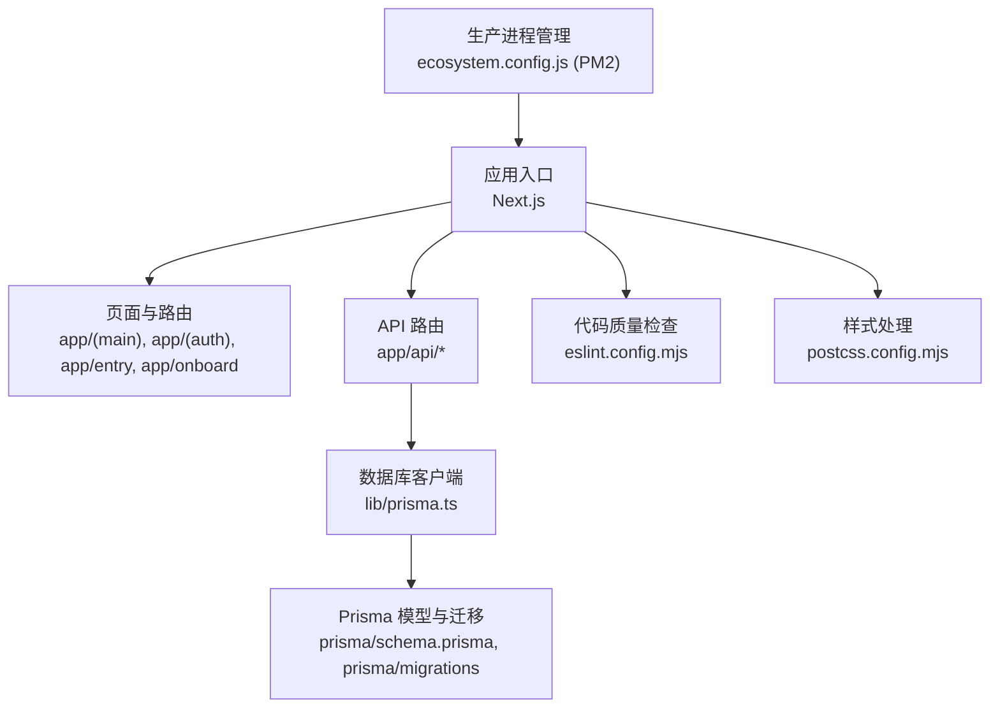
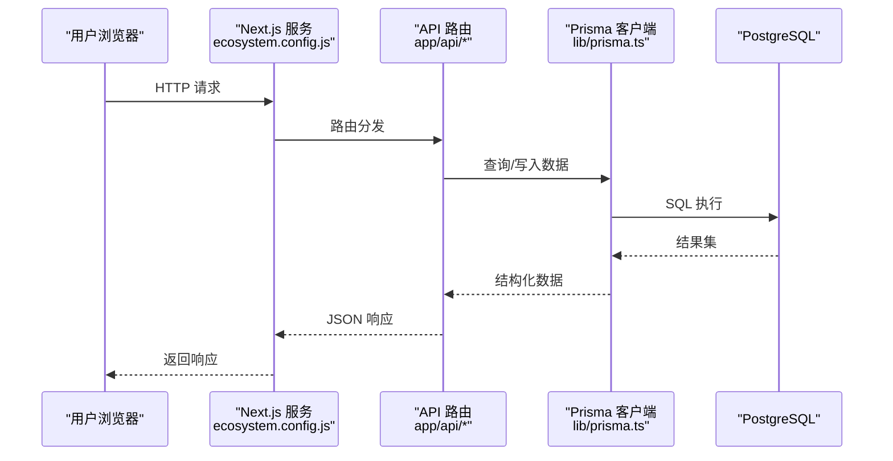
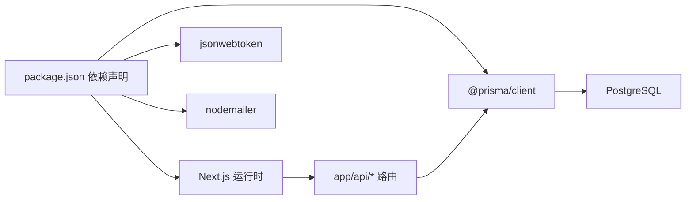

# 开发工作流

<cite>
**本文引用的文件**
- [README.md](file://README.md)
- [package.json](file://package.json)
- [.gitignore](file://.gitignore)
- [ecosystem.config.js](file://ecosystem.config.js)
- [next.config.ts](file://next.config.ts)
- [eslint.config.mjs](file://eslint.config.mjs)
- [postcss.config.mjs](file://postcss.config.mjs)
- [prisma/schema.prisma](file://prisma/schema.prisma)
- [lib/prisma.ts](file://lib/prisma.ts)
- [app/api/today-summary/route.ts](file://app/api/today-summary/route.ts)
- [doc/新电脑程序转移主人提醒.md](file://doc/新电脑程序转移主人提醒.md)
</cite>

## 目录
1. [简介](#简介)
2. [项目结构](#项目结构)
3. [核心组件](#核心组件)
4. [架构总览](#架构总览)
5. [详细组件分析](#详细组件分析)
6. [依赖分析](#依赖分析)
7. [性能考虑](#性能考虑)
8. [故障排查指南](#故障排查指南)
9. [结论](#结论)
10. [附录](#附录)

## 简介
本文件为心芽项目的完整开发工作流程说明，覆盖分支管理、提交规范、Pull Request 流程、本地开发与调试、数据库迁移与版本控制、构建打包优化、持续集成与自动化测试、性能监控与日志收集等。目标是让团队成员在统一规范下高效协作，降低沟通成本与出错概率。

## 项目结构
本项目基于 Next.js App Router，采用前后端一体化工程组织方式：
- 前端页面与路由位于 app 目录，API 路由位于 app/api 目录
- 共享逻辑与工具位于 lib 目录
- 数据模型与迁移位于 prisma 目录
- 部署与运行配置包括 ecosystem.config.js（PM2）、next.config.ts、eslint.config.mjs、postcss.config.mjs
- 环境变量与敏感信息通过 .env* 管理，并在 .gitignore 中排除

图示来源
- [next.config.ts:1-8](file://next.config.ts#L1-L8)
- [eslint.config.mjs:1-19](file://eslint.config.mjs#L1-L19)
- [postcss.config.mjs:1-8](file://postcss.config.mjs#L1-L8)
- [ecosystem.config.js:1-15](file://ecosystem.config.js#L1-L15)
- [lib/prisma.ts:1-13](file://lib/prisma.ts#L1-L13)
- [prisma/schema.prisma:1-209](file://prisma/schema.prisma#L1-L209)

章节来源
- [README.md:1-37](file://README.md#L1-L37)
- [package.json:1-40](file://package.json#L1-L40)
- [.gitignore:1-21](file://.gitignore#L1-L21)

## 核心组件
- 开发脚本与生命周期
  - 开发：npm run dev
  - 构建：npm run build
  - 启动：npm run start
  - 代码检查：npm run lint
  - 数据库迁移部署：npm run db:deploy
  - 安装后钩子：生成 Prisma Client（postinstall）
- 运行时与环境
  - 生产进程由 PM2 管理（ecosystem.config.js），监听端口 3000
  - 环境变量通过 .env* 注入，敏感文件已加入 .gitignore
- 数据库与模型
  - 使用 Prisma + PostgreSQL，模型定义于 prisma/schema.prisma
  - 客户端实例化与日志级别控制位于 lib/prisma.ts

章节来源
- [package.json:5-12](file://package.json#L5-L12)
- [ecosystem.config.js:1-15](file://ecosystem.config.js#L1-L15)
- [.gitignore:6-13](file://.gitignore#L6-L13)
- [prisma/schema.prisma:1-209](file://prisma/schema.prisma#L1-L209)
- [lib/prisma.ts:1-13](file://lib/prisma.ts#L1-L13)

## 架构总览
下图展示从浏览器到 API 路由、再到数据库的调用链路，以及 PM2 在生产环境中的角色。

图示来源
- [ecosystem.config.js:1-15](file://ecosystem.config.js#L1-L15)
- [lib/prisma.ts:1-13](file://lib/prisma.ts#L1-L13)
- [app/api/today-summary/route.ts:98-117](file://app/api/today-summary/route.ts#L98-L117)

## 详细组件分析

### Git 分支管理策略
- 主分支
  - main：稳定可发布分支，仅接受来自功能分支的合并
- 功能分支
  - 命名：feature/<描述>（例如 feature/user-auth）
  - 从 main 拉取最新代码，完成后发起 PR 合并回 main
- 发布分支
  - 命名：release/vX.Y.Z
  - 用于预发布验证与回归测试，修复后打 tag 并合并至 main 与 release 分支
- 热修复分支
  - 命名：hotfix/<描述>（例如 hotfix/login-crash）
  - 从 main 或对应 release 分支拉取，修复后合并回 main 并同步至 release

建议规则
- 所有变更必须通过 Pull Request 合并，禁止直接推送 main
- 合并前需通过自动化检查（lint、类型检查、基础测试）
- 重要变更需在 PR 描述中说明影响范围与回滚方案

### 提交信息与 Commitizen 配置
- 提交格式建议遵循 Conventional Commits：
  - feat: 新功能
  - fix: 修复缺陷
  - docs: 文档更新
  - style: 代码风格（不影响逻辑）
  - refactor: 重构
  - perf: 性能优化
  - test: 测试相关
  - chore: 构建/工具链变更
- 当前仓库未包含 Commitizen 配置文件；建议在根目录添加 .cz-config.js 或 package.json 中配置 cz-cli，以统一提交模板与校验

注意
- 提交信息应简洁明确，必要时在正文补充动机与影响面
- 避免将敏感信息（密钥、密码）放入提交历史

### Pull Request 创建与审查流程
- 创建 PR
  - 选择目标分支为 main（或 release/vX.Y.Z）
  - 填写变更摘要、关联 Issue、影响范围、自测步骤
- 审查清单
  - 代码可读性与一致性
  - 是否引入新的安全或隐私风险
  - 是否覆盖关键路径的边界条件
  - 是否与现有 API 兼容（向后兼容优先）
  - 是否更新必要文档与注释
- 自动化检查
  - ESLint 静态检查（eslint.config.mjs）
  - TypeScript 类型检查（由 next build 触发）
  - 单元测试与集成测试（建议新增 npm test 脚本）
- 合并要求
  - 至少一名维护者批准
  - CI 全部通过
  - 无冲突且通过本地验证

### 本地开发服务器启动与调试
- 前置准备
  - 安装 Node.js v20.x LTS
  - 克隆仓库并安装依赖
  - 准备 .env 文件（参考 doc/新电脑程序转移主人提醒.md）
- 启动开发服务器
  - 使用 npm run dev 启动，默认监听 3000 端口
- 调试建议
  - 使用浏览器开发者工具进行前端调试
  - 后端 API 可通过 Next.js 内置日志输出定位问题
  - 数据库连接异常时，检查 DATABASE_URL 与网络连通性

章节来源
- [README.md:3-17](file://README.md#L3-L17)
- [doc/新电脑程序转移主人提醒.md:108-126](file://doc/新电脑程序转移主人提醒.md#L108-L126)

### 数据库迁移管理与版本控制
- 模型与迁移
  - 数据模型定义于 prisma/schema.prisma
  - 迁移文件位于 prisma/migrations，按时间戳命名
- 本地开发
  - 安装依赖后自动执行 prisma generate（postinstall）
  - 本地可使用 SQLite 或远程 PostgreSQL，确保 DATABASE_URL 正确
- 生产部署
  - 使用 npm run db:deploy 执行 prisma migrate deploy
  - 迁移失败时需回滚并修复后再重试
- 版本控制策略
  - schema.prisma 与 migrations 目录纳入版本控制
  - 每次模型变更需生成对应迁移并提交
  - 禁止手动修改 migration_lock.toml

章节来源
- [package.json:10-11](file://package.json#L10-L11)
- [prisma/schema.prisma:1-209](file://prisma/schema.prisma#L1-L209)
- [lib/prisma.ts:1-13](file://lib/prisma.ts#L1-L13)

### 构建与打包配置优化
- Next.js 构建
  - 使用 npm run build 生成生产产物
  - 可在 next.config.ts 中启用图片优化、字体优化、缓存策略等
- 代码质量
  - ESLint 配置位于 eslint.config.mjs，建议开启严格规则
- 样式处理
  - PostCSS 插件 @tailwindcss/postcss 已在 postcss.config.mjs 中启用
- 生产进程管理
  - PM2 配置位于 ecosystem.config.js，设置实例数、内存上限、自动重启等

章节来源
- [next.config.ts:1-8](file://next.config.ts#L1-L8)
- [eslint.config.mjs:1-19](file://eslint.config.mjs#L1-L19)
- [postcss.config.mjs:1-8](file://postcss.config.mjs#L1-L8)
- [ecosystem.config.js:1-15](file://ecosystem.config.js#L1-L15)

### 持续集成与自动化测试集成（示例）
- 推荐流水线阶段
  - 安装依赖：npm ci
  - 代码检查：npm run lint
  - 类型检查与构建：npm run build
  - 数据库迁移（可选）：npm run db:deploy（指向测试库）
  - 运行测试：npm test（建议新增 Jest/Vitest 配置）
- 触发条件
  - 推送至 main 或 release/* 分支
  - 打开或更新 Pull Request
- 缓存与加速
  - 缓存 node_modules 与 Next.js 构建缓存目录以提升速度

注意
- 当前仓库未包含 CI 配置文件与测试脚本，建议按需添加 GitHub Actions 或 GitLab CI 配置

### 性能监控与日志收集
- 应用日志
  - 开发环境下 Prisma 客户端会输出 query/error/warn 日志，生产环境仅输出 error
  - PM2 提供集中式日志查看与管理（pm2 logs xinya）
- 性能指标
  - 建议接入 APM（如 Sentry、OpenTelemetry）采集错误与慢请求
  - 对热点 API（如 today-summary）增加耗时统计与告警
- 资源限制
  - PM2 配置 max_memory_restart 防止内存泄漏导致崩溃
  - 合理设置实例数与 CPU 绑定，避免单点瓶颈

章节来源
- [lib/prisma.ts:1-13](file://lib/prisma.ts#L1-L13)
- [ecosystem.config.js:1-15](file://ecosystem.config.js#L1-L15)
- [app/api/today-summary/route.ts:98-117](file://app/api/today-summary/route.ts#L98-L117)

## 依赖分析
- 运行时依赖
  - Next.js、React、Prisma Client、JSON Web Token、邮件发送等
- 开发依赖
  - ESLint、TypeScript、Tailwind CSS、PostCSS 插件
- 关键关系
  - 应用通过 lib/prisma.ts 访问数据库
  - API 路由调用 Prisma Client 完成数据读写
  - PM2 负责生产进程管理与日志收集

图示来源
- [package.json:13-38](file://package.json#L13-L38)
- [lib/prisma.ts:1-13](file://lib/prisma.ts#L1-L13)

章节来源
- [package.json:1-40](file://package.json#L1-L40)

## 性能考虑
- 构建优化
  - 启用 Next.js 图片与字体优化，减少首屏加载时间
  - 合理使用动态导入与懒加载，降低包体积
- 数据库优化
  - 根据查询模式建立索引（schema.prisma 中已有部分索引）
  - 避免 N+1 查询，使用 include/select 精准获取字段
- 进程与资源
  - PM2 实例数与内存上限按服务器规格调整
  - 定期清理日志与临时文件，避免磁盘占满

## 故障排查指南
- 常见问题
  - 环境变量缺失：确认 .env 文件存在且包含必要键值
  - 数据库连接失败：检查 DATABASE_URL、网络可达性与权限
  - 构建失败：查看 ESLint 与 TypeScript 报错，逐步修复
  - 生产无法启动：检查 PM2 日志与端口占用情况
- 日志定位
  - 使用 pm2 logs xinya 查看运行日志
  - 开发环境关注 Prisma 输出的 query/error/warn 日志
- 回滚策略
  - 数据库迁移失败时，先回滚到上一个可用状态，再修复迁移脚本

章节来源
- [ecosystem.config.js:1-15](file://ecosystem.config.js#L1-L15)
- [lib/prisma.ts:1-13](file://lib/prisma.ts#L1-L13)

## 结论
通过统一的分支策略、提交规范、PR 审查流程与自动化检查，结合完善的本地开发、数据库迁移、构建打包与生产运维配置，心芽项目能够在保证质量的前提下持续提升交付效率。建议后续补充测试与 CI 配置，进一步完善质量保障体系。

## 附录
- 快速上手
  - 参考 README.md 与 doc/新电脑程序转移主人提醒.md 完成环境搭建与本地验证
- 常用命令
  - 开发：npm run dev
  - 构建：npm run build
  - 启动：npm run start
  - 检查：npm run lint
  - 迁移部署：npm run db:deploy

章节来源
- [README.md:3-17](file://README.md#L3-L17)
- [doc/新电脑程序转移主人提醒.md:108-126](file://doc/新电脑程序转移主人提醒.md#L108-L126)