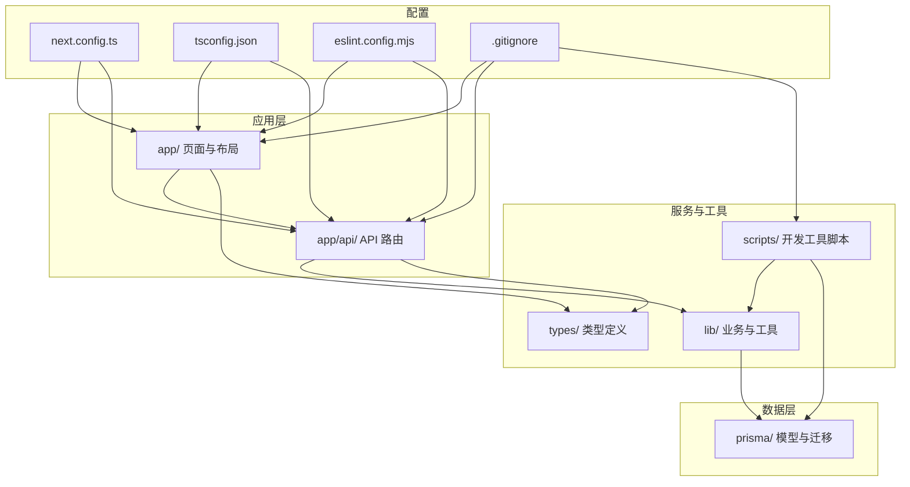
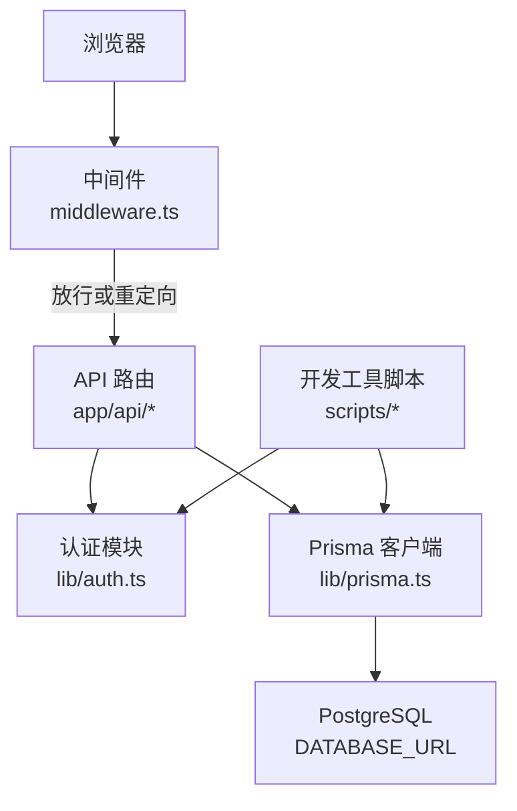
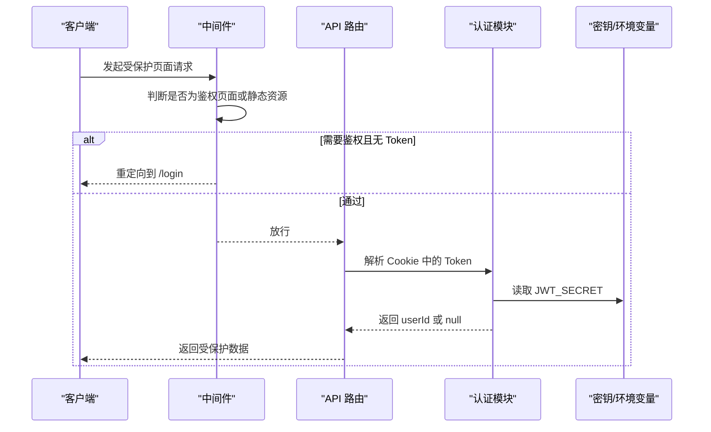
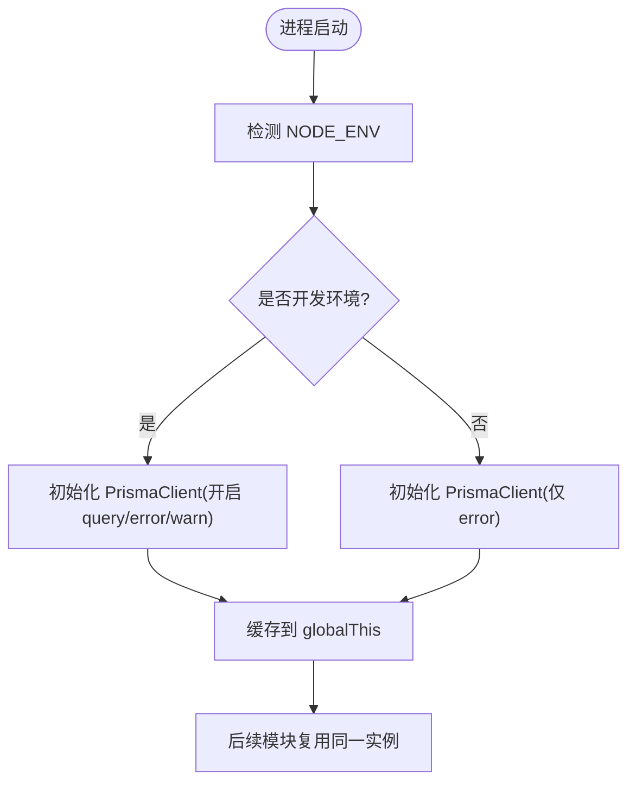
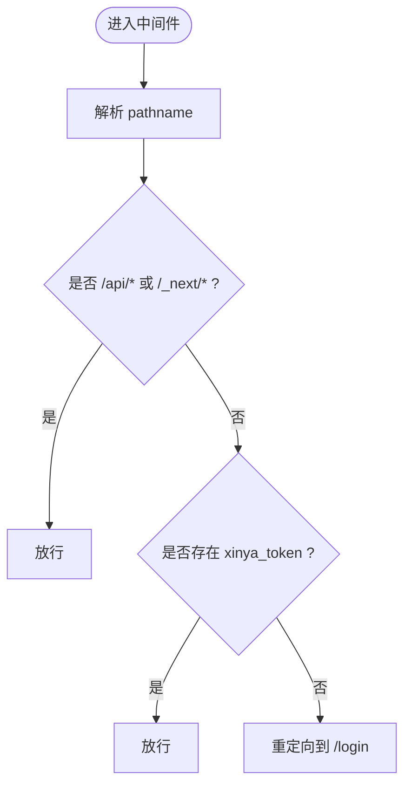
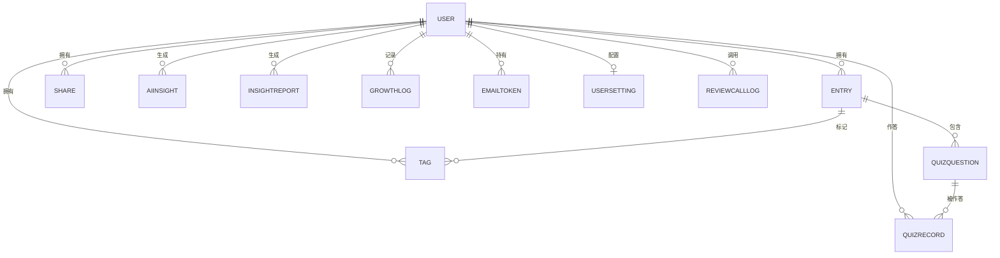
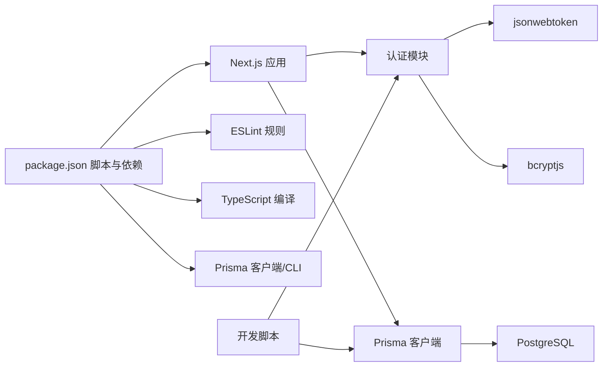

# 开发指南

<cite>
**本文引用的文件**   
- [README.md](file://README.md)
- [package.json](file://package.json)
- [tsconfig.json](file://tsconfig.json)
- [eslint.config.mjs](file://eslint.config.mjs)
- [.gitignore](file://.gitignore)
- [AGENTS.md](file://AGENTS.md)
- [CLAUDE.md](file://CLAUDE.md)
- [next.config.ts](file://next.config.ts)
- [middleware.ts](file://middleware.ts)
- [lib/auth.ts](file://lib/auth.ts)
- [lib/prisma.ts](file://lib/prisma.ts)
- [types/index.ts](file://types/index.ts)
- [prisma/schema.prisma](file://prisma/schema.prisma)
- [scripts/backfill-questions.ts](file://scripts/backfill-questions.ts)
- [scripts/create-guest-accounts.js](file://scripts/create-guest-accounts.js)
- [scripts/create-migration.js](file://scripts/create-migration.js)
- [scripts/regenerate-all-summaries.ts](file://scripts/regenerate-all-summaries.ts)
</cite>

## 更新摘要
**所做更改**   
- 更新了 Git 工作流部分，反映 scripts 目录现在被版本控制跟踪
- 新增了开发工具脚本章节，详细介绍 scripts 目录中的各种工具脚本
- 更新了项目结构图，包含 scripts 目录
- 增强了新功能开发流程，包含脚本开发和测试要求

## 目录
1. [简介](#简介)
2. [项目结构](#项目结构)
3. [核心组件](#核心组件)
4. [架构总览](#架构总览)
5. [详细组件分析](#详细组件分析)
6. [依赖分析](#依赖分析)
7. [性能考虑](#性能考虑)
8. [故障排查指南](#故障排查指南)
9. [结论](#结论)
10. [附录](#附录)

## 简介
本指南面向心芽项目的开发者，覆盖从环境搭建、IDE与代码规范配置，到 TypeScript 类型实践、ESLint 规则、Git 工作流、新功能开发流程、测试编写、性能分析与调试技巧、常见问题排查以及贡献规范等全链路内容。目标是帮助新成员快速上手并高质量地参与迭代。

## 项目结构
本项目基于 Next.js App Router，采用前后端一体化工程：
- 前端页面与布局位于 app 目录，按路由分组组织
- API 路由位于 app/api，按功能域划分
- 共享逻辑与工具在 lib 目录
- **开发工具脚本位于 scripts 目录，现已被 Git 版本控制跟踪**
- 数据库模型与迁移在 prisma 目录
- 全局类型定义在 types 目录
- 构建与运行脚本在 package.json



**图表来源**
- [next.config.ts:1-8](file://next.config.ts#L1-L8)
- [tsconfig.json:1-35](file://tsconfig.json#L1-L35)
- [eslint.config.mjs:1-19](file://eslint.config.mjs#L1-L19)
- [.gitignore:1-20](file://.gitignore#L1-L20)

**章节来源**
- [README.md:1-37](file://README.md#L1-L37)
- [package.json:1-40](file://package.json#L1-L40)

## 核心组件
- 认证与安全
  - JWT 签发与校验、Cookie 设置、密码哈希与验证集中在认证模块中，供 API 路由复用。
- 数据库访问
  - Prisma Client 单例化，开发环境开启查询日志，生产仅记录错误。
- 中间件鉴权
  - 对非静态资源与非 API 路径进行登录态检查，未登录重定向至登录页。
- 类型系统
  - 统一的前端类型定义，包括心情、主题、卡片、详情、标签、今日速览与通用响应结构。
- **开发工具脚本**
  - 提供批量数据处理、用户创建、数据库迁移等实用工具脚本，现已被版本控制跟踪便于协作。

**章节来源**
- [lib/auth.ts:1-56](file://lib/auth.ts#L1-L56)
- [lib/prisma.ts:1-14](file://lib/prisma.ts#L1-L14)
- [middleware.ts:1-29](file://middleware.ts#L1-L29)
- [types/index.ts:1-48](file://types/index.ts#L1-L48)

## 架构总览
Next.js 作为运行时承载页面渲染与 API 处理；中间件负责请求级鉴权；API 路由调用认证与数据库服务；Prisma 连接 PostgreSQL；全局类型保障前后端契约一致性；**开发工具脚本提供数据管理和维护支持**。



**图表来源**
- [middleware.ts:1-29](file://middleware.ts#L1-L29)
- [lib/auth.ts:1-56](file://lib/auth.ts#L1-L56)
- [lib/prisma.ts:1-14](file://lib/prisma.ts#L1-L14)
- [prisma/schema.prisma:1-209](file://prisma/schema.prisma#L1-L209)

## 详细组件分析

### 认证与安全（JWT + Cookie）
- 职责
  - 密码哈希与校验
  - JWT 签发与校验
  - 从请求上下文获取当前用户 ID
  - Cookie 配置（名称、过期时间、安全属性）
- 关键要点
  - 使用 bcrypt 进行密码哈希，强度固定为 12
  - JWT 有效期 30 天，密钥来自环境变量
  - Cookie httpOnly 提升安全性，sameSite 设为 lax，path 为根路径
  - getCurrentUserId 封装了从 cookies 读取 token 并解析的完整流程



**图表来源**
- [middleware.ts:1-29](file://middleware.ts#L1-L29)
- [lib/auth.ts:1-56](file://lib/auth.ts#L1-L56)

**章节来源**
- [lib/auth.ts:1-56](file://lib/auth.ts#L1-L56)
- [middleware.ts:1-29](file://middleware.ts#L1-L29)

### 数据库访问（Prisma 单例）
- 职责
  - 初始化 PrismaClient 并注入日志级别
  - 在非生产环境下缓存实例，避免热重载重复创建
- 关键要点
  - 开发环境输出 query/error/warn，便于定位慢查询与异常
  - 生产环境仅输出 error，减少日志开销
  - 通过环境变量 DATABASE_URL 连接 PostgreSQL



**图表来源**
- [lib/prisma.ts:1-14](file://lib/prisma.ts#L1-L14)

**章节来源**
- [lib/prisma.ts:1-14](file://lib/prisma.ts#L1-L14)

### 中间件鉴权流程
- 职责
  - 过滤静态资源与 API 路径
  - 白名单鉴权页面直接放行
  - 其他页面若无 xinya_token 则重定向登录
- 关键要点
  - matcher 排除静态资源与 favicon 等
  - 鉴权页面集合包含登录、注册、邮箱验证、忘记密码、重置密码、引导页与展示页



**图表来源**
- [middleware.ts:1-29](file://middleware.ts#L1-L29)

**章节来源**
- [middleware.ts:1-29](file://middleware.ts#L1-L29)

### 类型系统与契约
- 职责
  - 统一定义心情、主题、卡片、详情、标签、今日速览与通用响应结构
- 关键要点
  - 列表项与详情页分离，前者精简字段，后者包含富文本内容
  - ApiResponse 提供统一的 ok/data/error 结构，便于前端消费

```mermaid
classDiagram
class EntryCard {
+string id
+string title
+string contentPreview
+TagItem[] tags
+MoodType mood
+string recordTime
+boolean isTop
+boolean isFavorite
+boolean isDraft
}
class EntryDetail {
+string content
}
class TagItem {
+string id
+string name
+boolean isDefault
+number entryCount
}
class TodaySummary {
+number todayCount
+number weekCount
+number streak
+number maxStreak
+{title : string} lastEntry
}
class ApiResponse~T~ {
+boolean ok
+T data
+string error
}
EntryDetail --|> EntryCard : "扩展"
```

**图表来源**
- [types/index.ts:1-48](file://types/index.ts#L1-L48)

**章节来源**
- [types/index.ts:1-48](file://types/index.ts#L1-L48)

### 数据库模型概览
- 核心实体
  - User、Entry、Tag、Share、AiInsight、InsightReport、GrowthLog、EmailToken、MagicLink、QuizQuestion、QuizRecord、UserSetting、ReviewCallLog
- 关系与索引
  - 多对一/一对多关系清晰，常用查询字段建立索引以提升性能
  - 唯一约束保证业务键不重复（如 email、token、userId+name 等）



**图表来源**
- [prisma/schema.prisma:1-209](file://prisma/schema.prisma#L1-L209)

**章节来源**
- [prisma/schema.prisma:1-209](file://prisma/schema.prisma#L1-L209)

### 开发工具脚本（新增）
**更新** 由于 .gitignore 配置更新，scripts 目录现已被 Git 版本控制跟踪，所有开发工具脚本都纳入团队协作范围。

#### 脚本概览
- **backfill-questions.ts**: 补生成心得的题目和要点总结，支持 AI 生成和模板降级
- **create-guest-accounts.js**: 批量创建测试用访客账户
- **create-migration.js**: 生成数据库迁移文件
- **regenerate-all-summaries.ts**: 批量重新生成所有心得的 AI 总结和题目

#### 脚本特性
- **版本控制集成**: 所有脚本现可被 Git 跟踪，便于团队协作和代码审查
- **错误处理**: 完善的异常处理和日志输出
- **数据一致性**: 确保数据操作的原子性和完整性
- **API 集成**: 支持 DeepSeek AI 服务进行智能内容生成

#### 使用示例
```bash
# 补生成缺失的题目和要点
npx tsx scripts/backfill-questions.ts

# 批量创建测试账户
node scripts/create-guest-accounts.js

# 生成数据库迁移
node scripts/create-migration.js

# 重新生成所有心得的 AI 总结
npx tsx scripts/regenerate-all-summaries.ts
```

**章节来源**
- [scripts/backfill-questions.ts:1-261](file://scripts/backfill-questions.ts#L1-L261)
- [scripts/create-guest-accounts.js:1-59](file://scripts/create-guest-accounts.js#L1-L59)
- [scripts/create-migration.js:1-122](file://scripts/create-migration.js#L1-L122)
- [scripts/regenerate-all-summaries.ts:1-179](file://scripts/regenerate-all-summaries.ts#L1-L179)

## 依赖分析
- 运行时依赖
  - next、react/react-dom 用于页面与交互
  - @prisma/client 与 prisma 用于数据库访问与迁移
  - bcryptjs、jsonwebtoken 用于密码与令牌
  - nodemailer 用于邮件发送
  - lucide-react 图标库、react-hot-toast 提示
- 开发依赖
  - eslint、eslint-config-next 提供代码质量规则
  - tailwindcss 与 @tailwindcss/postcss 样式方案
  - typescript 与各类 @types 提供类型支持



**图表来源**
- [package.json:1-40](file://package.json#L1-L40)

**章节来源**
- [package.json:1-40](file://package.json#L1-L40)

## 性能考虑
- 数据库
  - 利用现有索引（如按 userId 与时间排序）优化高频查询
  - 按需 select 字段，避免拉取大字段（如富文本）
- 应用层
  - 中间件仅做必要判断，避免复杂计算
  - 将耗时操作（如邮件发送、AI 分析）异步化或队列化
- 构建与运行
  - 生产环境关闭多余日志，减少 I/O 开销
  - 合理使用增量编译与缓存策略
- **脚本优化**
  - 批量处理时添加适当的延迟避免 API 限流
  - 使用事务确保数据一致性
  - 实现断点续传和错误恢复机制

[本节为通用建议，无需源码引用]

## 故障排查指南
- 无法启动或端口占用
  - 确认 3000 端口未被占用，必要时更换端口
- 数据库连接失败
  - 检查 DATABASE_URL 是否正确，PostgreSQL 服务是否运行
  - 查看 Prisma 日志（开发模式已开启 query/error/warn）
- 鉴权失败或频繁跳转登录
  - 检查 Cookie 是否携带 xinya_token，域名与 SameSite 设置是否符合预期
  - 确认 JWT_SECRET 一致且未过期
- 邮件发送失败
  - 核对 SMTP 服务器、端口、授权码与账号配置
- 构建失败
  - 清理 .next 与 node_modules 后重装依赖，重新生成 Prisma Client
- **脚本执行问题**
  - 确认环境变量配置正确（特别是 API 密钥）
  - 检查网络连接和 API 服务可用性
  - 查看详细的错误日志输出

**章节来源**
- [lib/prisma.ts:1-14](file://lib/prisma.ts#L1-L14)
- [lib/auth.ts:1-56](file://lib/auth.ts#L1-L56)
- [middleware.ts:1-29](file://middleware.ts#L1-L29)

## 结论
本指南梳理了心芽项目的开发环境与工程规范，明确了认证、数据库、中间件与类型系统的职责边界与实践要点。**随着 scripts 目录纳入版本控制，团队协作效率得到进一步提升**。遵循本文档的流程与规范，可显著提升协作效率与代码质量。

[本节为总结性内容，无需源码引用]

## 附录

### 开发环境搭建
- 前置要求
  - Node.js 与包管理器（npm/yarn/pnpm/bun 任选其一）
  - PostgreSQL 数据库服务
- 安装与启动
  - 克隆仓库并安装依赖
  - 生成 Prisma Client
  - 启动开发服务器并在浏览器访问本地地址
- 环境变量
  - 复制模板并填写真实值（数据库连接、JWT 密钥、SMTP 等）
  - 注意 .env 系列文件已被 .gitignore 排除，切勿提交

**章节来源**
- [README.md:1-37](file://README.md#L1-L37)
- [package.json:1-40](file://package.json#L1-L40)
- [.gitignore:1-20](file://.gitignore#L1-L20)

### IDE 与编辑器配置
- 推荐插件
  - ESLint、Prettier（可选）、Tailwind CSS IntelliSense、Prisma VS Code Extension
- 保存时自动格式化与修复
  - 启用保存时运行 ESLint 修复
  - 若使用 Prettier，确保与 ESLint 规则兼容
- 调试
  - 使用浏览器开发者工具调试前端
  - 使用 Next.js DevTools 与 Network 面板观察请求
  - 后端可在 API 路由内添加断点调试
  - **脚本调试可使用 Node.js 调试器或控制台日志**

[本节为通用建议，无需源码引用]

### TypeScript 配置与类型最佳实践
- tsconfig 要点
  - 严格模式开启，目标 ES2017，模块解析为 bundler
  - 路径别名 @/* 指向项目根目录
  - include 覆盖 .next 生成的类型，exclude node_modules
- 类型实践
  - 优先使用 interface 描述对象结构，type 用于联合与映射
  - 对外暴露的类型集中放在 types 目录，保持契约稳定
  - 对第三方库使用 @types 声明，避免 any

**章节来源**
- [tsconfig.json:1-35](file://tsconfig.json#L1-L35)
- [types/index.ts:1-48](file://types/index.ts#L1-L48)

### ESLint 规则与自定义
- 规则来源
  - 继承 next/core-web-vitals 与 next/typescript 两套规则集
- 忽略策略
  - 通过 globalIgnores 覆盖默认忽略，保留 .next、out、build 与 next-env.d.ts 不被检查
- 自定义建议
  - 新增规则时尽量以插件形式引入，保持可读性与可维护性
  - 结合编辑器实现保存时自动修复

**章节来源**
- [eslint.config.mjs:1-19](file://eslint.config.mjs#L1-L19)

### Git 工作流与提交规范
**更新** 由于 .gitignore 配置更新，scripts 目录现已被版本控制跟踪。

- 分支策略
  - main 为主分支，feature/* 用于功能开发，hotfix/* 用于紧急修复
- 提交信息
  - 使用约定式提交格式：type(scope): subject
  - type 示例：feat、fix、docs、style、refactor、test、chore
- **脚本管理**
  - 所有开发工具脚本现需遵循相同的代码规范和提交标准
  - 脚本变更应包含详细的变更说明和使用示例
  - 重要脚本应添加相应的单元测试
- 双平台同步
  - 远程 origin 指向 GitHub，gitee 指向 Gitee
  - 推送时需分别推送到两个远程仓库

**章节来源**
- [.gitignore:1-20](file://.gitignore#L1-L20)

### 新功能开发流程与代码审查标准
**更新** 新增脚本开发和测试要求。

- 开发流程
  - 从 main 拉取最新代码，创建 feature 分支
  - 完成功能开发与自测，更新相关文档与类型
  - **如需开发工具脚本，遵循脚本开发规范并进行充分测试**
  - 提交变更并推送远端，发起 Pull Request
- 审查标准
  - 代码风格符合 ESLint 规则
  - 新增/修改类型需同步更新 types 与接口契约
  - 涉及鉴权与权限控制的路径需补充中间件或守卫
  - 数据库变更需附带迁移与回滚说明
  - 性能敏感路径需提供压测或监控指标
  - **脚本需包含完整的错误处理和日志输出**
  - **脚本变更需说明影响范围和回滚方案**

[本节为通用建议，无需源码引用]

### 单元测试与集成测试指南
**更新** 增加脚本测试要求。

- 单元与组件测试
  - 针对纯函数与工具方法编写用例，覆盖边界条件
  - 组件测试关注渲染结果与交互行为
- API 集成测试
  - 模拟数据库与外部服务（如邮件），验证端到端流程
  - 使用事务或测试数据库隔离数据
- **脚本测试**
  - 为脚本的关键逻辑编写单元测试
  - 模拟数据库操作和外部 API 调用
  - 测试错误处理和异常情况
- 持续集成
  - 在 CI 中执行 lint、类型检查与测试套件

[本节为通用建议，无需源码引用]

### 性能分析与调试技巧
- 前端
  - React Profiler 分析渲染瓶颈
  - Lighthouse 评估性能与可访问性
- 后端
  - 开启 Prisma 查询日志定位慢查询
  - 使用浏览器 Network 面板分析请求耗时与体积
- 线上
  - 结合 PM2 日志与错误上报系统进行问题追踪
- **脚本调试**
  - 使用 console.log 和结构化日志输出
  - 实现进度跟踪和错误统计
  - 支持断点续传和重试机制

**章节来源**
- [lib/prisma.ts:1-14](file://lib/prisma.ts#L1-L14)

### 贡献代码的参与指南与规范要求
**更新** 增加脚本贡献要求。

- 行为准则
  - 尊重他人，友善沟通，遵守社区规范
- 贡献方式
  - 报告 Bug、提出改进建议、完善文档
  - 提交代码前确保通过 lint 与类型检查
  - **脚本贡献需包含完整的使用说明和测试用例**
- 合规要求
  - 不提交敏感信息（密钥、凭据等）
  - 遵循提交信息与分支命名规范
  - **脚本变更需考虑向后兼容性和数据安全**

[本节为通用建议，无需源码引用]

### 参考与提示
- Next.js 版本差异提示
  - 请阅读 AGENTS.md 中的注意事项，遵循官方文档的最新约定

**章节来源**
- [AGENTS.md:1-6](file://AGENTS.md#L1-L6)
- [CLAUDE.md:1-2](file://CLAUDE.md#L1-L2)