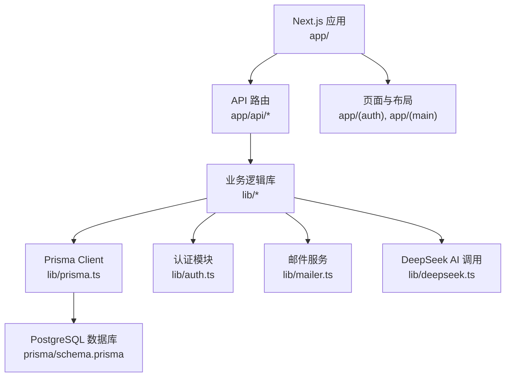
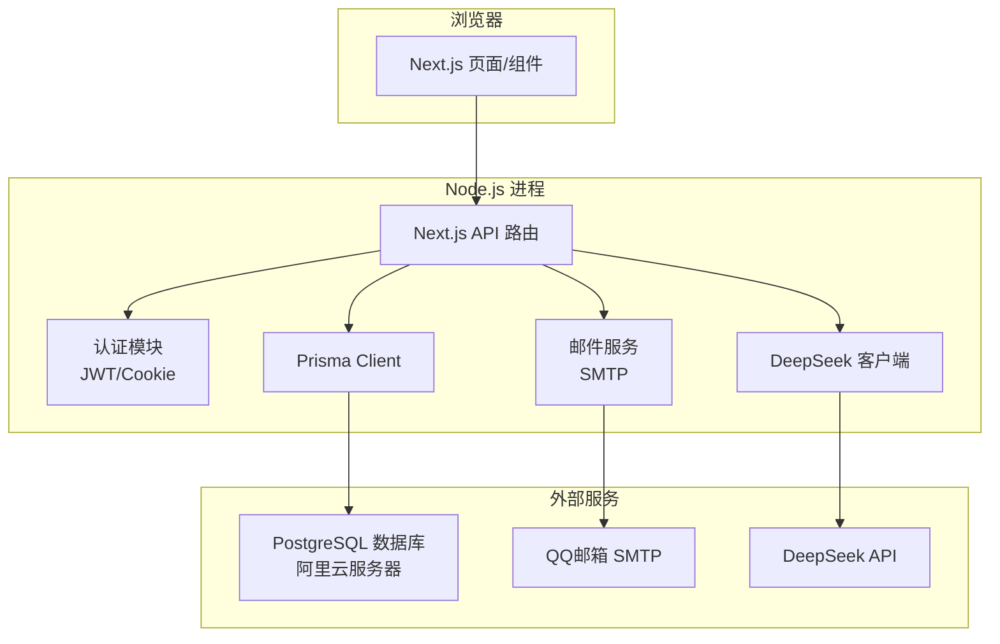
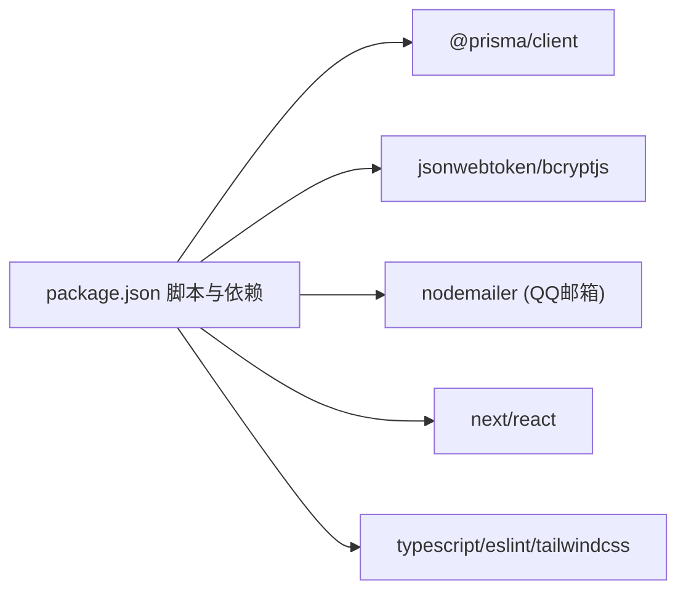

# 开发环境搭建

<cite>
**本文引用的文件**   
- [README.md](file://README.md)
- [package.json](file://package.json)
- [.gitignore](file://.gitignore)
- [prisma/schema.prisma](file://prisma/schema.prisma)
- [lib/prisma.ts](file://lib/prisma.ts)
- [lib/auth.ts](file://lib/auth.ts)
- [lib/mailer.ts](file://lib/mailer.ts)
- [lib/deepseek.ts](file://lib/deepseek.ts)
- [deploy.sh](file://deploy.sh)
- [ecosystem.config.js](file://ecosystem.config.js)
- [doc/新电脑快速安装心芽程序Prompt.md](file://doc/新电脑快速安装心芽程序Prompt.md)
- [doc/新电脑程序转移主人提醒.md](file://doc/新电脑程序转移主人提醒.md)
</cite>

## 更新摘要
**变更内容**   
- 新增快速安装Prompt章节，提供AI助手自动环境配置方案
- 新增程序转移完整清单，涵盖换电脑时的环境迁移步骤
- 更新双平台Git仓库配置说明（GitHub + Gitee）
- 简化本地开发环境要求，明确不需要本地PostgreSQL数据库
- 新增阿里云服务器部署相关配置说明

## 目录
1. [简介](#简介)
2. [快速安装指南](#快速安装指南)
3. [项目结构](#项目结构)
4. [核心组件](#核心组件)
5. [架构总览](#架构总览)
6. [详细组件分析](#详细组件分析)
7. [依赖分析](#依赖分析)
8. [性能考虑](#性能考虑)
9. [故障排查指南](#故障排查指南)
10. [结论](#结论)
11. [附录](#附录)

## 简介
本指南面向心芽项目的本地开发与调试，覆盖 Node.js、PostgreSQL 的安装与配置，完整依赖安装流程（npm/yarn），环境变量与安全密钥管理，IDE 推荐配置与调试器设置，Git 仓库克隆与初始化步骤，常见问题排查，以及基于 Docker 的开发环境选项。目标是让开发者在最短时间获得可运行的本地环境，并安全地管理敏感信息。

**更新** 新增了基于AI助手的快速安装方案和完整的程序转移清单，大幅简化环境搭建流程。

## 快速安装指南

### AI助手自动安装（推荐）
对于新电脑环境，推荐使用Qoder AI助手进行自动化环境配置：

1. **基础软件安装**
   - 安装 Node.js v20.x LTS（与服务器版本一致）
   - 安装 Git
   - 安装 Qoder AI编程助手

2. **代码克隆与远程配置**
   ```bash
   git clone https://github.com/kangkang919/xinya 'D:\Project Qoder\xinya'
   cd 'D:\Project Qoder\xinya'
   git remote add gitee https://gitee.com/kangkang919/xinya.git
   ```

3. **使用Prompt自动配置**
   将以下Prompt复制给Qoder，它会自动完成剩余的环境配置：

   ```
   我是心芽项目的开发者，刚换了新电脑（Windows 11）。请帮我完成以下工作：

   ### 1. 了解项目
   请先阅读以下文档，全面了解项目：
   - D:\Project Qoder\xinya\doc\心芽项目资料索引.md（项目总览）
   - D:\Project Qoder\xinya\doc\新芽dev-framework.md（开发范式，最高执行标准）
   - D:\Project Qoder\xinya\doc\新电脑程序转移主人提醒.md（环境配置清单）

   ### 2. 确认环境
   - Node.js 版本：需要 v20.x LTS（与服务器一致）。如未安装请提醒我安装：https://nodejs.org
   - Git：确认已安装。如未安装：https://git-scm.com
   - 不需要 Python、不需要本地 PostgreSQL 数据库

   ### 3. 初始化本地开发环境
   项目代码已在 D:\Project Qoder\xinya\ 下（从 GitHub clone 的完整代码，含 .git）。请执行：
   1. 在 D:\Project Qoder\xinya\ 下运行 npm install 安装依赖
   2. 运行 npx prisma generate 生成 Prisma Client
   3. 确认 .env 文件存在且配置正确（数据库连接指向本地或测试环境）
   4. 运行 npm run dev 启动开发服务器，确认 http://localhost:3000 可访问

   ### 4. 确认双平台 Git 配置
   项目采用 GitHub + Gitee 双平台同步：
   - GitHub 仓库：https://github.com/kangkang919/xinya（远程名：origin）
   - Gitee 仓库：https://gitee.com/kangkang919/xinya.git（远程名：gitee）
   - 连接方式：HTTPS（账号密码）
   - 请执行 git remote -v 确认两个远程仓库都已配置
   - 如缺少 gitee 远程，执行：git remote add gitee https://gitee.com/kangkang919/xinya.git

   ### 5. 项目技术栈概要
   - Next.js 16.2.9 + React 19 + TypeScript 5
   - Prisma 6 + PostgreSQL 13（数据库在阿里云服务器，本地不装）
   - Tailwind CSS 4
   - Node.js 20.x LTS
   - 部署目标：阿里云 ECS（47.100.106.213），PM2 管理
   - 服务器从 Gitee 拉取代码

   ### 6. 工作流程
   - 本地修改代码 → git push origin main（推 GitHub）→ git push gitee main（推 Gitee）
   - 服务器部署：git fetch gitee && git reset --hard gitee/main && npm run build && pm2 restart xinya
   - 所有文档在 doc/ 文件夹下
   - 开发范式文档（新芽dev-framework.md）是最高执行标准，任何需求变更需先对照此文档

   请开始执行，每一步完成后告诉我结果。
   ```

**章节来源**   
- [doc/新电脑快速安装心芽程序Prompt.md:1-78](file://doc/新电脑快速安装心芽程序Prompt.md#L1-L78)

### 手动安装流程
如果不使用AI助手，可以按照以下步骤手动配置：

#### 必需软件
- **Node.js v20.x LTS** — https://nodejs.org（选 LTS 版本，与服务器 v20.20.2 一致）
- **Git** — https://git-scm.com
- **Qoder** — AI 编程助手（可选，用于辅助开发）

#### 不需要安装的软件
- ❌ Python（项目不需要）
- ❌ PostgreSQL（数据库在服务器上，本地不装）
- ❌ VS Code（Qoder 内置编辑器可替代，如习惯用 VS Code 可自行安装）

**章节来源**   
- [doc/新电脑程序转移主人提醒.md:7-18](file://doc/新电脑程序转移主人提醒.md#L7-L18)

## 项目结构
本项目为 Next.js 应用，使用 Prisma 作为数据库 ORM，数据源为 PostgreSQL；认证采用 JWT + Cookie；邮件发送使用 Nodemailer；AI 能力通过 DeepSeek API 调用。关键入口与脚本定义位于 package.json，数据库模型与迁移位于 prisma 目录，运行时依赖的环境变量由 .env 系列文件提供。



图表来源
- [package.json:1-40](file://package.json#L1-L40)
- [prisma/schema.prisma:1-209](file://prisma/schema.prisma#L1-L209)
- [lib/prisma.ts:1-14](file://lib/prisma.ts#L1-L14)
- [lib/auth.ts:1-56](file://lib/auth.ts#L1-L56)
- [lib/mailer.ts:1-86](file://lib/mailer.ts#L1-L86)
- [lib/deepseek.ts:1-115](file://lib/deepseek.ts#L1-L115)

章节来源
- [README.md:1-37](file://README.md#L1-L37)
- [package.json:1-40](file://package.json#L1-L40)

## 核心组件
- 运行与构建脚本：包含开发、构建、启动、代码检查、数据库迁移与 Prisma 客户端生成等命令。
- 数据库连接：Prisma 通过环境变量读取数据库连接字符串，并在开发环境下输出查询日志。
- 认证模块：JWT 签名与校验、Cookie 配置、密码哈希与验证。
- 邮件服务：基于 SMTP 的验证码、魔法链接与重置密码邮件发送。
- AI 集成：调用 DeepSeek API 生成复习题目与要点总结。

章节来源
- [package.json:1-40](file://package.json#L1-L40)
- [lib/prisma.ts:1-14](file://lib/prisma.ts#L1-L14)
- [lib/auth.ts:1-56](file://lib/auth.ts#L1-L56)
- [lib/mailer.ts:1-86](file://lib/mailer.ts#L1-L86)
- [lib/deepseek.ts:1-115](file://lib/deepseek.ts#L1-L115)

## 架构总览
下图展示了开发环境中的主要组件交互：前端页面与 API 路由通过 lib 层访问数据库、发送邮件、调用 AI 接口，并通过 JWT 完成鉴权。



图表来源
- [lib/prisma.ts:1-14](file://lib/prisma.ts#L1-L14)
- [lib/auth.ts:1-56](file://lib/auth.ts#L1-L56)
- [lib/mailer.ts:1-86](file://lib/mailer.ts#L1-L86)
- [lib/deepseek.ts:1-115](file://lib/deepseek.ts#L1-L115)
- [prisma/schema.prisma:1-209](file://prisma/schema.prisma#L1-L209)

## 详细组件分析

### 环境与依赖安装
- Node.js 版本要求：v20.x LTS（与服务器版本 v20.20.2 保持一致）
- 包管理器：支持 npm、yarn、pnpm、bun（见 README 中示例命令）
- 安装依赖：在项目根目录执行对应包管理器的安装命令
- 生成 Prisma 客户端：postinstall 钩子会在安装后自动执行 prisma generate，也可手动执行
- 数据库迁移：使用提供的脚本命令执行迁移部署

**更新** 明确了Node.js版本要求和包管理器兼容性。

章节来源
- [README.md:1-37](file://README.md#L1-L37)
- [package.json:1-40](file://package.json#L1-L40)

### 数据库安装与配置（PostgreSQL）
**重要更新** 本地开发不需要安装PostgreSQL数据库！

- 数据库位置：阿里云ECS服务器（47.100.106.213）
- 数据库类型：PostgreSQL 13.23
- 数据库名：xinya_db
- 用户名：xinya
- 连接方式：通过环境变量DATABASE_URL连接到远程数据库
- 本地开发：直接连接服务器数据库进行测试

章节来源
- [prisma/schema.prisma:1-209](file://prisma/schema.prisma#L1-L209)
- [lib/prisma.ts:1-14](file://lib/prisma.ts#L1-L14)
- [package.json:1-40](file://package.json#L1-L40)
- [doc/新电脑程序转移主人提醒.md:45-51](file://doc/新电脑程序转移主人提醒.md#L45-L51)

### 环境变量与安全密钥管理
- 环境变量文件：.env、.env.local、.env.production 被 .gitignore 排除，避免泄露
- 必需环境变量（示例说明，非代码片段）：
  - DATABASE_URL：PostgreSQL 连接字符串（指向阿里云服务器）
  - JWT_SECRET：JWT 签名密钥（生产环境必须替换默认值）
  - SMTP_USER / SMTP_PASS：QQ邮箱账号与授权码（用于验证码、魔法链接、重置密码）
  - NEXT_PUBLIC_BASE_URL / NEXT_PUBLIC_APP_URL：应用基础地址（用于生成链接）
  - DEEPSEEK_API_KEY：AI 接口密钥（可选）
- 安全建议：
  - 仅将 .env.local 加入本地忽略列表，不要提交到版本控制
  - 生产环境使用平台级密钥管理服务或容器编排的 Secret 注入
  - 定期轮换密钥，避免硬编码默认值进入生产

**更新** 明确了QQ邮箱SMTP配置和阿里云服务器数据库连接。

章节来源
- [.gitignore:1-21](file://.gitignore#L1-L21)
- [lib/auth.ts:1-56](file://lib/auth.ts#L1-L56)
- [lib/mailer.ts:1-86](file://lib/mailer.ts#L1-L86)
- [lib/deepseek.ts:1-115](file://lib/deepseek.ts#L1-L115)
- [doc/新电脑程序转移主人提醒.md:53-62](file://doc/新电脑程序转移主人提醒.md#L53-L62)

### IDE 推荐配置与调试器设置
- VS Code 扩展建议：
  - ESLint：统一代码风格与静态检查
  - Tailwind CSS IntelliSense：样式补全与提示
  - Prisma：数据库模型与查询智能提示
  - Prettier：代码格式化（可选）
  - Error Lens：行内错误提示
- 调试器设置：
  - 使用 Next.js 内置调试模式（如 --inspect 参数）配合 VS Code 的 Node.js 调试配置
  - 断点建议设置在 API 路由与 lib 层的关键函数处（认证、邮件、AI 调用）
  - 环境变量加载顺序：确保 .env.local 优先于 .env，避免覆盖

章节来源
- [package.json:1-40](file://package.json#L1-L40)
- [.gitignore:1-21](file://.gitignore#L1-L21)

### Git 仓库克隆与初始化
**重要更新** 项目采用GitHub + Gitee双平台同步策略：

- 克隆仓库：从GitHub拉取代码到本地
- 添加Gitee远程：`git remote add gitee https://gitee.com/kangkang919/xinya.git`
- 安装依赖：执行包管理器安装命令
- 生成 Prisma 客户端：postinstall 会自动执行，必要时可手动触发
- 执行数据库迁移：确保本地数据库已就绪并执行迁移
- 启动开发服务器：运行开发命令并访问本地站点

**双平台推送流程：**
- 本地修改代码 → `git push origin main`（推GitHub）→ `git push gitee main`（推Gitee）
- 服务器部署：`git fetch gitee && git reset --hard gitee/main && npm run build && pm2 restart xinya`

章节来源
- [README.md:1-37](file://README.md#L1-L37)
- [package.json:1-40](file://package.json#L1-L40)
- [doc/新电脑程序转移主人提醒.md:66-82](file://doc/新电脑程序转移主人提醒.md#L66-L82)

### 常见环境问题与解决方案
- 端口占用：若 3000 端口被占用，修改端口或释放占用进程
- 数据库连接失败：检查 DATABASE_URL 格式、网络可达性与权限
- 邮件发送失败：确认 QQ邮箱 SMTP 服务器、端口、SSL/TLS 与授权码有效
- AI 调用超时或无 JSON：检查网络、代理与 API Key，关注重试与解析逻辑
- 构建失败：清理缓存目录并重新安装依赖
- Git推送失败：检查GitHub PAT令牌是否过期，重新生成Fine-grained tokens

**更新** 新增了Git推送问题和QQ邮箱SMTP配置问题的解决方案。

章节来源
- [lib/mailer.ts:1-86](file://lib/mailer.ts#L1-L86)
- [lib/deepseek.ts:1-115](file://lib/deepseek.ts#L1-L115)
- [lib/prisma.ts:1-14](file://lib/prisma.ts#L1-L14)
- [doc/新电脑程序转移主人提醒.md:24-34](file://doc/新电脑程序转移主人提醒.md#L24-L34)

### Docker 容器化开发环境选项
- 目标：在容器中运行 Node.js 应用与 PostgreSQL，便于跨平台一致体验
- 基本思路：
  - 使用官方 Node.js 镜像作为应用容器
  - 使用官方 PostgreSQL 镜像作为数据库容器
  - 通过 docker-compose 编排两个服务，共享网络与卷
  - 将 .env.local 挂载到应用容器，注入环境变量
- 注意事项：
  - 数据库持久化：将数据库数据目录映射到宿主机卷
  - 环境变量：DATABASE_URL、JWT_SECRET、SMTP_*、NEXT_PUBLIC_*、DEEPSEEK_API_KEY 等
  - 迁移与生成：在容器启动前执行 prisma generate 与 prisma migrate deploy
  - 开发热重载：将源码目录挂载到容器，启用 Next.js 开发模式

[本节为概念性指导，不直接分析具体文件]

## 依赖分析
- 运行时依赖：
  - @prisma/client：数据库客户端
  - bcryptjs：密码哈希
  - dotenv：环境变量加载（按需）
  - jsonwebtoken：JWT 签发与校验
  - next/react/react-dom：框架与渲染
  - nodemailer：邮件发送（QQ邮箱SMTP）
  - lucide-react/react-hot-toast：UI 与提示
- 开发依赖：
  - typescript、eslint、tailwindcss、@types/*：类型、检查与样式
- 脚本与生命周期：
  - postinstall：自动生成 Prisma 客户端
  - db:deploy：执行数据库迁移



图表来源
- [package.json:1-40](file://package.json#L1-L40)

章节来源
- [package.json:1-40](file://package.json#L1-L40)

## 性能考虑
- 数据库连接池：Prisma 默认连接池适用于大多数场景，可根据并发调整池大小
- 日志级别：开发环境开启 query/error/warn 日志有助于定位问题，生产环境建议仅保留 error
- 外部 API 超时与重试：AI 调用具备超时与重试机制，需合理设置超时时间与最大重试次数
- 构建优化：合理使用 Next.js 的字体与资源优化策略，减少首屏负载

章节来源
- [lib/prisma.ts:1-14](file://lib/prisma.ts#L1-L14)
- [lib/deepseek.ts:1-115](file://lib/deepseek.ts#L1-L115)

## 故障排查指南
- 认证相关：
  - 检查 JWT_SECRET 是否一致且未泄露
  - 确认 Cookie 配置（httpOnly、secure、sameSite）符合部署环境
- 邮件相关：
  - 核对 QQ邮箱 SMTP_USER/SMTP_PASS 与服务器端口/SSL 设置
  - 查看邮件模板与主题是否正确拼接
  - 确认QQ邮箱授权码未失效
- AI 相关：
  - 检查 DEEPSEEK_API_KEY 有效性
  - 关注响应体是否为合法 JSON，必要时增加容错与降级逻辑
- 数据库相关：
  - 验证 DATABASE_URL 格式与权限
  - 确认迁移状态与 schema 一致性
  - 检查阿里云服务器数据库连接是否正常
- Git相关：
  - 检查GitHub PAT令牌有效期
  - 确认双平台远程仓库配置正确
  - 验证网络连接和代理设置

**更新** 新增了QQ邮箱授权码、阿里云服务器连接和Git令牌相关的故障排查。

章节来源
- [lib/auth.ts:1-56](file://lib/auth.ts#L1-L56)
- [lib/mailer.ts:1-86](file://lib/mailer.ts#L1-L86)
- [lib/deepseek.ts:1-115](file://lib/deepseek.ts#L1-L115)
- [lib/prisma.ts:1-14](file://lib/prisma.ts#L1-L14)
- [doc/新电脑程序转移主人提醒.md:145-154](file://doc/新电脑程序转移主人提醒.md#L145-L154)

## 结论
按照本指南完成 Node.js、PostgreSQL 安装与环境变量配置后，即可快速启动心芽项目的本地开发环境。建议在团队内统一环境变量命名与密钥管理方式，结合 Docker 提升环境一致性，并通过完善的日志与监控保障稳定性。

**更新** 推荐使用AI助手快速安装方案，可以大幅简化新环境的搭建流程，提高开发效率。

## 附录

### 一键部署脚本参考
- 脚本功能：安装依赖、生成 Prisma 客户端、执行迁移、构建与 PM2 启动
- 适用场景：服务器端自动化部署流程
- 部署目标：阿里云ECS服务器（47.100.106.213）

**更新** 明确了部署目标和服务器信息。

章节来源
- [deploy.sh:1-37](file://deploy.sh#L1-L37)
- [ecosystem.config.js:1-15](file://ecosystem.config.js#L1-L15)

### 程序转移完整清单
换电脑前后，请逐项核对以下清单：

#### 必需软件安装
- [ ] Node.js v20.x LTS
- [ ] Git
- [ ] Qoder AI编程助手

#### 账号和密钥配置
- [ ] GitHub账号和PAT令牌
- [ ] Gitee账号配置
- [ ] 阿里云ECS服务器访问权限
- [ ] QQ邮箱SMTP授权码
- [ ] DeepSeek API Key（如需要）

#### 代码仓库配置
- [ ] GitHub仓库克隆
- [ ] Gitee远程仓库添加
- [ ] 双平台推送配置

#### 环境变量配置
- [ ] .env文件创建和配置
- [ ] 数据库连接字符串
- [ ] JWT密钥
- [ ] SMTP配置
- [ ] 其他必要环境变量

**章节来源**   
- [doc/新电脑程序转移主人提醒.md:1-175](file://doc/新电脑程序转移主人提醒.md#L1-L175)

### 项目文档位置
所有项目文档在 `doc/` 文件夹下，包括：
- 心芽项目资料索引.md：项目总览，快速了解全貌
- 新芽dev-framework.md：开发范式，最高执行标准
- 暗色系修改经验总结.md：暗色主题调试经验
- 邮箱登录系统方案介绍.md：三种登录方式的完整实现方案
- 新电脑快速安装心芽程序Prompt.md：新电脑 Qoder 初始化 Prompt
- 新电脑程序转移主人提醒.md：换电脑核对清单
- 邀请码.md：15个预生成测试账号
- 心芽小程序设计框架v2.0.md：产品设计框架（历史版本）
- 心芽富文本文字编辑规范.md：富文本功能边界与实现规范
- 心芽各页面标题行高对齐规范.md：多页面标题对齐方案
- .env.production.备份：生产环境变量备份（含真实密钥）

**章节来源**   
- [doc/新电脑程序转移主人提醒.md:158-175](file://doc/新电脑程序转移主人提醒.md#L158-L175)