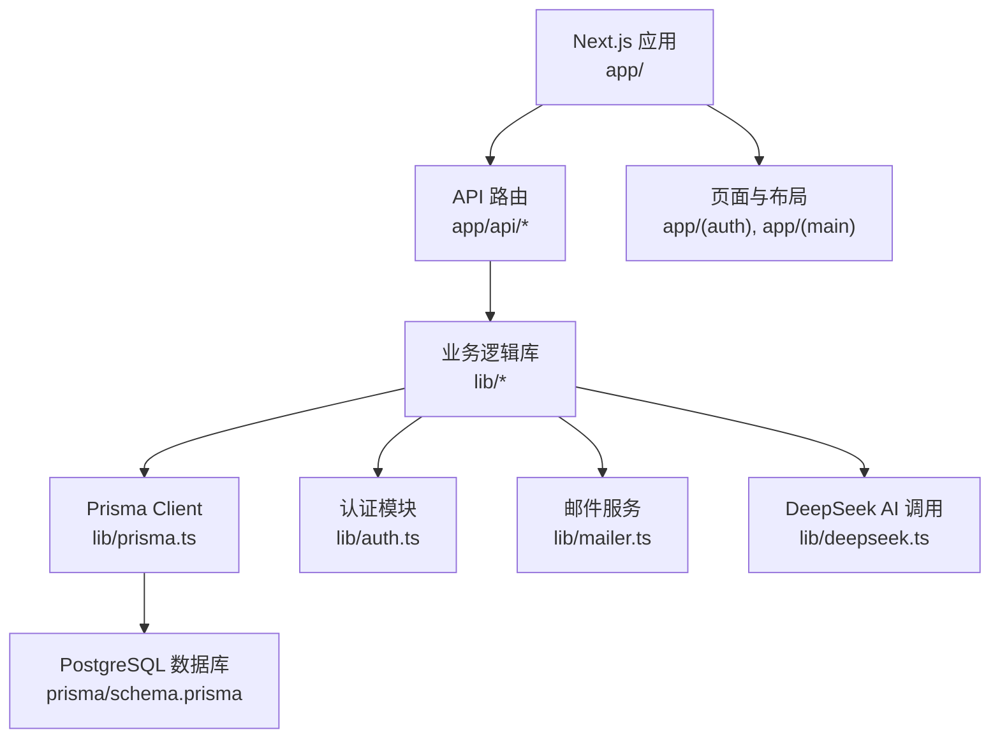
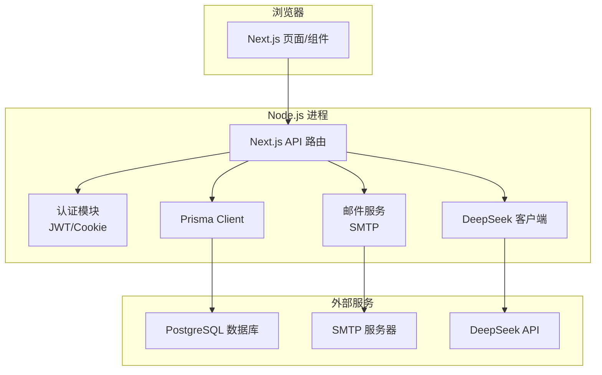
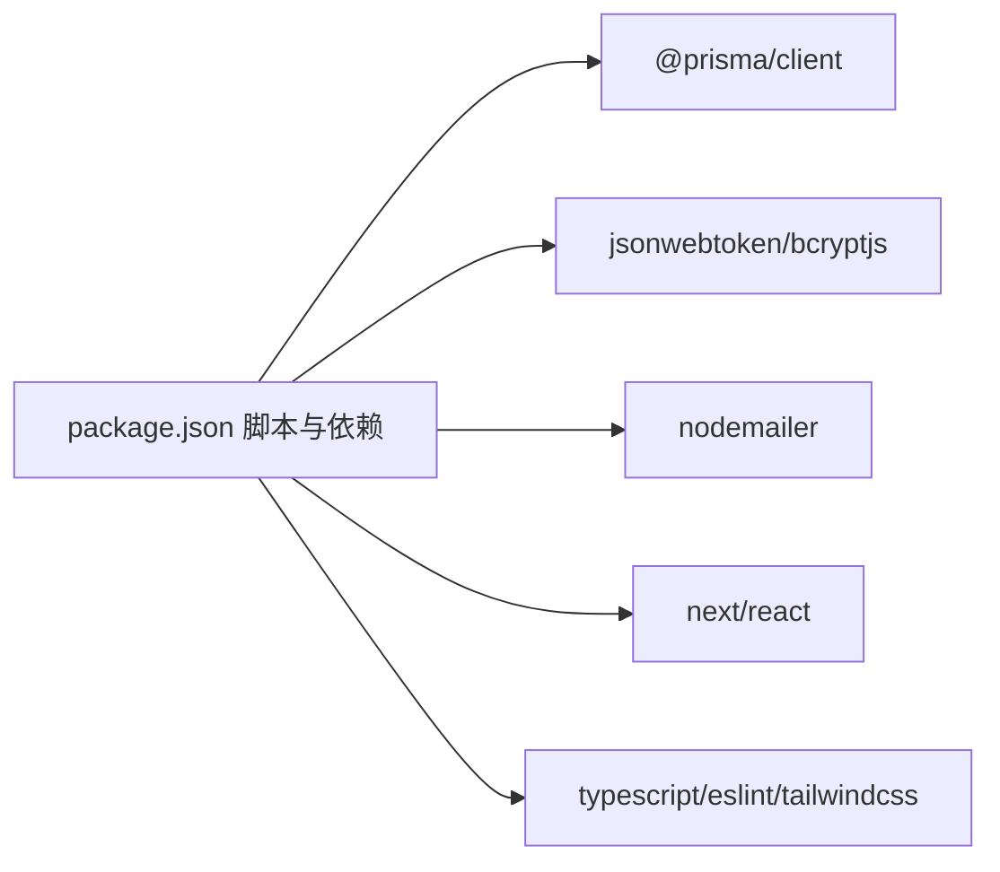

# 开发环境搭建

<cite>
**本文引用的文件**   
- [README.md](file://README.md)
- [package.json](file://package.json)
- [.gitignore](file://.gitignore)
- [prisma/schema.prisma](file://prisma/schema.prisma)
- [lib/prisma.ts](file://lib/prisma.ts)
- [lib/auth.ts](file://lib/auth.ts)
- [lib/mailer.ts](file://lib/mailer.ts)
- [lib/deepseek.ts](file://lib/deepseek.ts)
- [deploy.sh](file://deploy.sh)
</cite>

## 目录
1. [简介](#简介)
2. [项目结构](#项目结构)
3. [核心组件](#核心组件)
4. [架构总览](#架构总览)
5. [详细组件分析](#详细组件分析)
6. [依赖分析](#依赖分析)
7. [性能考虑](#性能考虑)
8. [故障排查指南](#故障排查指南)
9. [结论](#结论)
10. [附录](#附录)

## 简介
本指南面向心芽项目的本地开发与调试，覆盖 Node.js、PostgreSQL 的安装与配置，完整依赖安装流程（npm/yarn），环境变量与安全密钥管理，IDE 推荐配置与调试器设置，Git 仓库克隆与初始化步骤，常见问题排查，以及基于 Docker 的开发环境选项。目标是让开发者在最短时间获得可运行的本地环境，并安全地管理敏感信息。

## 项目结构
本项目为 Next.js 应用，使用 Prisma 作为数据库 ORM，数据源为 PostgreSQL；认证采用 JWT + Cookie；邮件发送使用 Nodemailer；AI 能力通过 DeepSeek API 调用。关键入口与脚本定义位于 package.json，数据库模型与迁移位于 prisma 目录，运行时依赖的环境变量由 .env 系列文件提供。

图表来源
- [package.json:1-40](file://package.json#L1-L40)
- [prisma/schema.prisma:1-209](file://prisma/schema.prisma#L1-L209)
- [lib/prisma.ts:1-14](file://lib/prisma.ts#L1-L14)
- [lib/auth.ts:1-56](file://lib/auth.ts#L1-L56)
- [lib/mailer.ts:1-86](file://lib/mailer.ts#L1-L86)
- [lib/deepseek.ts:1-115](file://lib/deepseek.ts#L1-L115)

章节来源
- [README.md:1-37](file://README.md#L1-L37)
- [package.json:1-40](file://package.json#L1-L40)

## 核心组件
- 运行与构建脚本：包含开发、构建、启动、代码检查、数据库迁移与 Prisma 客户端生成等命令。
- 数据库连接：Prisma 通过环境变量读取数据库连接字符串，并在开发环境下输出查询日志。
- 认证模块：JWT 签名与校验、Cookie 配置、密码哈希与验证。
- 邮件服务：基于 SMTP 的验证码、魔法链接与重置密码邮件发送。
- AI 集成：调用 DeepSeek API 生成复习题目与要点总结。

章节来源
- [package.json:1-40](file://package.json#L1-L40)
- [lib/prisma.ts:1-14](file://lib/prisma.ts#L1-L14)
- [lib/auth.ts:1-56](file://lib/auth.ts#L1-L56)
- [lib/mailer.ts:1-86](file://lib/mailer.ts#L1-L86)
- [lib/deepseek.ts:1-115](file://lib/deepseek.ts#L1-L115)

## 架构总览
下图展示了开发环境中的主要组件交互：前端页面与 API 路由通过 lib 层访问数据库、发送邮件、调用 AI 接口，并通过 JWT 完成鉴权。

图表来源
- [lib/prisma.ts:1-14](file://lib/prisma.ts#L1-L14)
- [lib/auth.ts:1-56](file://lib/auth.ts#L1-L56)
- [lib/mailer.ts:1-86](file://lib/mailer.ts#L1-L86)
- [lib/deepseek.ts:1-115](file://lib/deepseek.ts#L1-L115)
- [prisma/schema.prisma:1-209](file://prisma/schema.prisma#L1-L209)

## 详细组件分析

### 环境与依赖安装
- Node.js 版本要求：请根据包管理器与依赖引擎要求选择合适版本（参考依赖声明）。
- 包管理器：支持 npm、yarn、pnpm、bun（见 README 中示例命令）。
- 安装依赖：在项目根目录执行对应包管理器的安装命令。
- 生成 Prisma 客户端：postinstall 钩子会在安装后自动执行 prisma generate，也可手动执行。
- 数据库迁移：使用提供的脚本命令执行迁移部署。

章节来源
- [README.md:1-37](file://README.md#L1-L37)
- [package.json:1-40](file://package.json#L1-L40)

### 数据库安装与配置（PostgreSQL）
- 安装 PostgreSQL 服务并确保可本地访问。
- 创建数据库与用户（建议为开发环境准备独立用户与数据库）。
- 配置连接字符串：将数据库连接信息写入环境变量 DATABASE_URL，供 Prisma 使用。
- 初始化数据库：执行迁移以创建表结构与初始数据。

章节来源
- [prisma/schema.prisma:1-209](file://prisma/schema.prisma#L1-L209)
- [lib/prisma.ts:1-14](file://lib/prisma.ts#L1-L14)
- [package.json:1-40](file://package.json#L1-L40)

### 环境变量与安全密钥管理
- 环境变量文件：.env、.env.local、.env.production 被 .gitignore 排除，避免泄露。
- 必需环境变量（示例说明，非代码片段）：
  - DATABASE_URL：PostgreSQL 连接字符串
  - JWT_SECRET：JWT 签名密钥（生产环境必须替换默认值）
  - SMTP_USER / SMTP_PASS：邮箱账号与授权码（用于验证码、魔法链接、重置密码）
  - NEXT_PUBLIC_BASE_URL / NEXT_PUBLIC_APP_URL：应用基础地址（用于生成链接）
  - DEEPSEEK_API_KEY：AI 接口密钥
- 安全建议：
  - 仅将 .env.local 加入本地忽略列表，不要提交到版本控制
  - 生产环境使用平台级密钥管理服务或容器编排的 Secret 注入
  - 定期轮换密钥，避免硬编码默认值进入生产

章节来源
- [.gitignore:1-21](file://.gitignore#L1-L21)
- [lib/auth.ts:1-56](file://lib/auth.ts#L1-L56)
- [lib/mailer.ts:1-86](file://lib/mailer.ts#L1-L86)
- [lib/deepseek.ts:1-115](file://lib/deepseek.ts#L1-L115)

### IDE 推荐配置与调试器设置
- VS Code 扩展建议：
  - ESLint：统一代码风格与静态检查
  - Tailwind CSS IntelliSense：样式补全与提示
  - Prisma：数据库模型与查询智能提示
  - Prettier：代码格式化（可选）
  - Error Lens：行内错误提示
- 调试器设置：
  - 使用 Next.js 内置调试模式（如 --inspect 参数）配合 VS Code 的 Node.js 调试配置
  - 断点建议设置在 API 路由与 lib 层的关键函数处（认证、邮件、AI 调用）
  - 环境变量加载顺序：确保 .env.local 优先于 .env，避免覆盖

章节来源
- [package.json:1-40](file://package.json#L1-L40)
- [.gitignore:1-21](file://.gitignore#L1-L21)

### Git 仓库克隆与初始化
- 克隆仓库：从远程仓库拉取代码到本地。
- 安装依赖：执行包管理器安装命令。
- 生成 Prisma 客户端：postinstall 会自动执行，必要时可手动触发。
- 执行数据库迁移：确保本地数据库已就绪并执行迁移。
- 启动开发服务器：运行开发命令并访问本地站点。

章节来源
- [README.md:1-37](file://README.md#L1-L37)
- [package.json:1-40](file://package.json#L1-L40)

### 常见环境问题与解决方案
- 端口占用：若 3000 端口被占用，修改端口或释放占用进程。
- 数据库连接失败：检查 DATABASE_URL 格式、网络可达性与权限。
- 邮件发送失败：确认 SMTP 服务器、端口、SSL/TLS 与授权码有效。
- AI 调用超时或无 JSON：检查网络、代理与 API Key，关注重试与解析逻辑。
- 构建失败：清理缓存目录并重新安装依赖。

章节来源
- [lib/mailer.ts:1-86](file://lib/mailer.ts#L1-L86)
- [lib/deepseek.ts:1-115](file://lib/deepseek.ts#L1-L115)
- [lib/prisma.ts:1-14](file://lib/prisma.ts#L1-L14)

### Docker 容器化开发环境选项
- 目标：在容器中运行 Node.js 应用与 PostgreSQL，便于跨平台一致体验。
- 基本思路：
  - 使用官方 Node.js 镜像作为应用容器
  - 使用官方 PostgreSQL 镜像作为数据库容器
  - 通过 docker-compose 编排两个服务，共享网络与卷
  - 将 .env.local 挂载到应用容器，注入环境变量
- 注意事项：
  - 数据库持久化：将数据库数据目录映射到宿主机卷
  - 环境变量：DATABASE_URL、JWT_SECRET、SMTP_*、NEXT_PUBLIC_*、DEEPSEEK_API_KEY 等
  - 迁移与生成：在容器启动前执行 prisma generate 与 prisma migrate deploy
  - 开发热重载：将源码目录挂载到容器，启用 Next.js 开发模式

[本节为概念性指导，不直接分析具体文件]

## 依赖分析
- 运行时依赖：
  - @prisma/client：数据库客户端
  - bcryptjs：密码哈希
  - dotenv：环境变量加载（按需）
  - jsonwebtoken：JWT 签发与校验
  - next/react/react-dom：框架与渲染
  - nodemailer：邮件发送
  - lucide-react/react-hot-toast：UI 与提示
- 开发依赖：
  - typescript、eslint、tailwindcss、@types/*：类型、检查与样式
- 脚本与生命周期：
  - postinstall：自动生成 Prisma 客户端
  - db:deploy：执行数据库迁移

图表来源
- [package.json:1-40](file://package.json#L1-L40)

章节来源
- [package.json:1-40](file://package.json#L1-L40)

## 性能考虑
- 数据库连接池：Prisma 默认连接池适用于大多数场景，可根据并发调整池大小。
- 日志级别：开发环境开启 query/error/warn 日志有助于定位问题，生产环境建议仅保留 error。
- 外部 API 超时与重试：AI 调用具备超时与重试机制，需合理设置超时时间与最大重试次数。
- 构建优化：合理使用 Next.js 的字体与资源优化策略，减少首屏负载。

章节来源
- [lib/prisma.ts:1-14](file://lib/prisma.ts#L1-L14)
- [lib/deepseek.ts:1-115](file://lib/deepseek.ts#L1-L115)

## 故障排查指南
- 认证相关：
  - 检查 JWT_SECRET 是否一致且未泄露
  - 确认 Cookie 配置（httpOnly、secure、sameSite）符合部署环境
- 邮件相关：
  - 核对 SMTP_USER/SMTP_PASS 与服务器端口/SSL 设置
  - 查看邮件模板与主题是否正确拼接
- AI 相关：
  - 检查 DEEPSEEK_API_KEY 有效性
  - 关注响应体是否为合法 JSON，必要时增加容错与降级逻辑
- 数据库相关：
  - 验证 DATABASE_URL 格式与权限
  - 确认迁移状态与 schema 一致性

章节来源
- [lib/auth.ts:1-56](file://lib/auth.ts#L1-L56)
- [lib/mailer.ts:1-86](file://lib/mailer.ts#L1-L86)
- [lib/deepseek.ts:1-115](file://lib/deepseek.ts#L1-L115)
- [lib/prisma.ts:1-14](file://lib/prisma.ts#L1-L14)

## 结论
按照本指南完成 Node.js、PostgreSQL 安装与环境变量配置后，即可快速启动心芽项目的本地开发环境。建议在团队内统一环境变量命名与密钥管理方式，结合 Docker 提升环境一致性，并通过完善的日志与监控保障稳定性。

## 附录

### 一键部署脚本参考
- 脚本功能：安装依赖、生成 Prisma 客户端、执行迁移、构建与 PM2 启动。
- 适用场景：服务器端自动化部署流程。

章节来源
- [deploy.sh:1-37](file://deploy.sh#L1-L37)