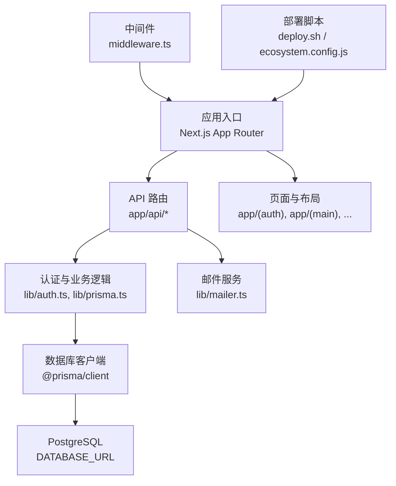
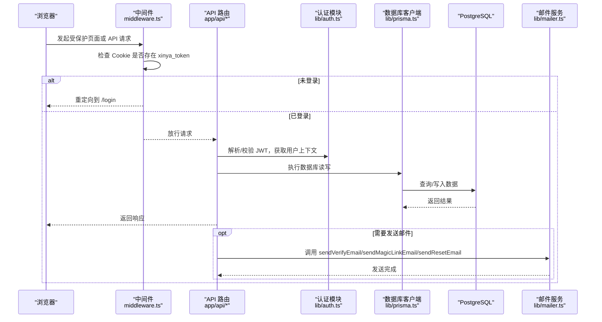
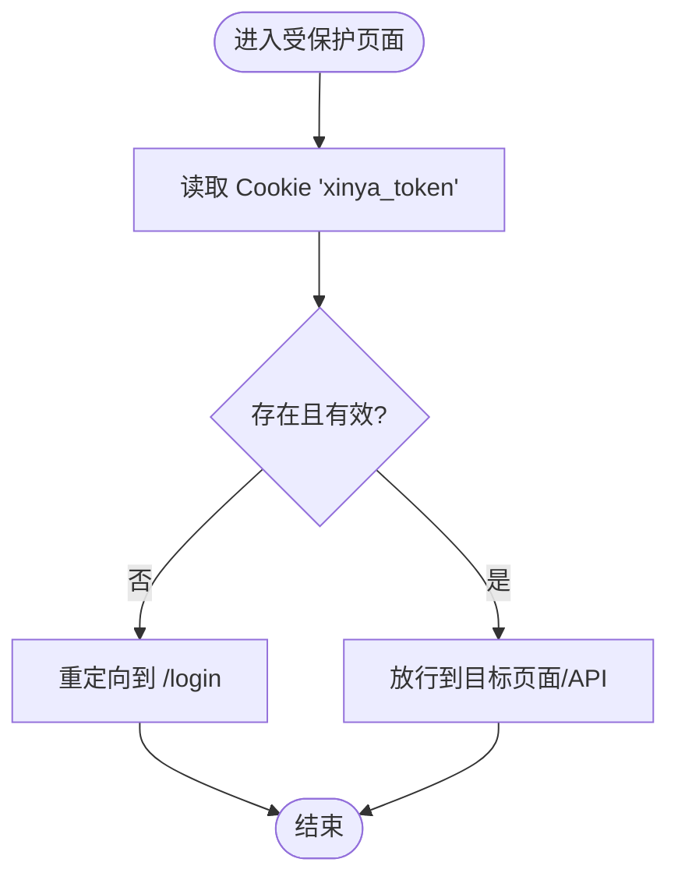
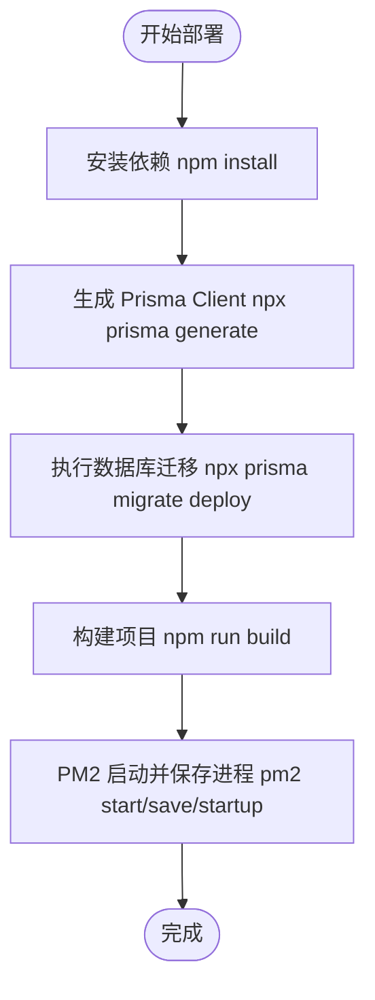
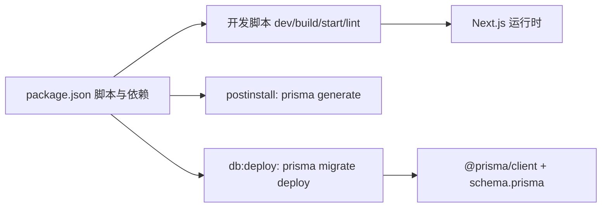

# 开发环境设置指南

<cite>
**本文引用的文件**   
- [README.md](file://README.md)
- [package.json](file://package.json)
- [next.config.ts](file://next.config.ts)
- [tsconfig.json](file://tsconfig.json)
- [.gitignore](file://.gitignore)
- [prisma/schema.prisma](file://prisma/schema.prisma)
- [lib/prisma.ts](file://lib/prisma.ts)
- [middleware.ts](file://middleware.ts)
- [ecosystem.config.js](file://ecosystem.config.js)
- [deploy.sh](file://deploy.sh)
- [lib/auth.ts](file://lib/auth.ts)
- [lib/mailer.ts](file://lib/mailer.ts)
- [doc/新电脑快速安装心芽程序Prompt.md](file://doc/新电脑快速安装心芽程序Prompt.md)
</cite>

## 目录
1. [简介](#简介)
2. [项目结构](#项目结构)
3. [核心组件](#核心组件)
4. [架构总览](#架构总览)
5. [详细组件分析](#详细组件分析)
6. [依赖分析](#依赖分析)
7. [性能考虑](#性能考虑)
8. [故障排查指南](#故障排查指南)
9. [结论](#结论)
10. [附录](#附录)

## 简介
本指南面向首次参与“心芽”项目的开发者，目标是帮助你在本地快速搭建可运行的开发环境，并理解项目的关键配置与运行流程。项目基于 Next.js（App Router）、React、TypeScript、Prisma 与 PostgreSQL，采用 PM2 在服务器部署。

## 项目结构
- 前端页面与路由：app 目录下按功能域组织页面与布局
- API 路由：app/api 下实现认证、条目、标签、导出、复习等接口
- 共享逻辑：lib 提供数据库客户端、认证、邮件发送、主题等工具
- 数据模型：prisma/schema.prisma 定义 Prisma 模型与关系
- 中间件：middleware.ts 负责访问控制与重定向
- 部署脚本：deploy.sh 与 ecosystem.config.js 用于生产环境一键部署



图表来源
- [next.config.ts:1-8](file://next.config.ts#L1-L8)
- [middleware.ts:1-29](file://middleware.ts#L1-L29)
- [lib/prisma.ts:1-14](file://lib/prisma.ts#L1-L14)
- [lib/auth.ts:1-56](file://lib/auth.ts#L1-L56)
- [lib/mailer.ts:1-86](file://lib/mailer.ts#L1-L86)
- [deploy.sh:1-37](file://deploy.sh#L1-L37)
- [ecosystem.config.js:1-15](file://ecosystem.config.js#L1-L15)

章节来源
- [README.md:1-37](file://README.md#L1-L37)
- [package.json:1-40](file://package.json#L1-L40)
- [next.config.ts:1-8](file://next.config.ts#L1-L8)
- [tsconfig.json:1-35](file://tsconfig.json#L1-L35)
- [.gitignore:1-20](file://.gitignore#L1-L20)

## 核心组件
- 运行时与脚本
  - 开发/构建/启动命令由 package.json 的 scripts 管理，包含 Prisma 生成与迁移部署
- 数据库连接
  - Prisma 通过环境变量 DATABASE_URL 连接 PostgreSQL；开发模式开启 query/error/warn 日志
- 认证与安全
  - JWT 签名与验证、Cookie 配置、密码哈希与校验集中在 lib/auth.ts
- 邮件服务
  - 使用 Nodemailer 通过 QQ SMTP 发送验证码、Magic Link、重置密码邮件
- 访问控制
  - middleware.ts 对非公开路径进行登录态检查，未登录时重定向到登录页

章节来源
- [package.json:5-12](file://package.json#L5-L12)
- [prisma/schema.prisma:5-8](file://prisma/schema.prisma#L5-L8)
- [lib/prisma.ts:7-14](file://lib/prisma.ts#L7-L14)
- [lib/auth.ts:1-56](file://lib/auth.ts#L1-L56)
- [lib/mailer.ts:1-86](file://lib/mailer.ts#L1-L86)
- [middleware.ts:4-24](file://middleware.ts#L4-L24)

## 架构总览
下图展示了从浏览器请求到后端处理的关键路径：中间件鉴权 → API 路由 → 认证/业务逻辑 → 数据库与邮件服务。



图表来源
- [middleware.ts:4-24](file://middleware.ts#L4-L24)
- [lib/auth.ts:18-43](file://lib/auth.ts#L18-L43)
- [lib/prisma.ts:7-14](file://lib/prisma.ts#L7-L14)
- [lib/mailer.ts:14-85](file://lib/mailer.ts#L14-L85)

## 详细组件分析

### 环境变量与密钥
- 必需的环境变量
  - DATABASE_URL：指向 PostgreSQL 实例的连接串
  - JWT_SECRET：JWT 签名密钥（生产环境必须替换）
  - SMTP_USER / SMTP_PASS：QQ 邮箱账号与授权码
- 安全建议
  - 将 .env 加入 .gitignore，避免泄露
  - 生产环境务必设置强随机 JWT_SECRET，并启用 HTTPS 以配合 secure Cookie

章节来源
- [.gitignore:6-9](file://.gitignore#L6-L9)
- [lib/auth.ts:5-6](file://lib/auth.ts#L5-L6)
- [lib/mailer.ts:8-11](file://lib/mailer.ts#L8-L11)
- [prisma/schema.prisma:5-8](file://prisma/schema.prisma#L5-L8)

### 数据库与迁移
- 数据模型
  - 用户、条目、标签、分享、AI 洞察、成长记录、邮件令牌、魔法链接、测验题目与记录、用户设置、复习调用日志等
- 索引与约束
  - 针对常用查询字段建立索引，提升列表与筛选性能
- 开发与生产差异
  - 开发模式开启详细 SQL 日志，便于调试

```mermaid
erDiagram
USER {
string id PK
string email UK
boolean isVerified
string theme
boolean onboardDone
int openTimes
datetime createdAt
datetime updatedAt
}
ENTRY {
string id PK
string userId FK
string title
text content
string keyPoints
string mood
datetime recordTime
boolean isTop
boolean isFavorite
boolean isDraft
datetime createdAt
datetime updatedAt
}
TAG {
string id PK
string userId FK
string name
boolean isDefault
datetime createdAt
}
SHARE {
string id PK
string userId FK
string token UK
datetime expiresAt
string scope
string[] tagIds
boolean isActive
datetime createdAt
}
AI_INSIGHT {
string id PK
string userId FK
string content
int triggerCount
boolean isRead
datetime createdAt
}
INSIGHT_REPORT {
string id PK
string userId FK
string type
datetime periodStart
datetime periodEnd
json content
datetime createdAt
}
GROWTH_LOG {
string id PK
string userId FK
string version
string title
string content
datetime logDate
datetime createdAt
}
EMAIL_TOKEN {
string id PK
string userId FK
string token UK
string type
datetime expiresAt
boolean used
datetime createdAt
}
MAGIC_LINK {
string id PK
string email
string token UK
datetime expiresAt
boolean used
datetime createdAt
}
QUIZ_QUESTION {
string id PK
string entryId FK
string question
string type
json options
json answer
string explanation
int angle
datetime createdAt
}
QUIZ_RECORD {
string id PK
string userId FK
string questionId FK
string entryId FK
boolean correct
json userAnswer
int answerCount
datetime answeredAt
datetime nextReviewAt
int streak
}
USER_SETTING {
string id PK
string userId FK UK
boolean reviewEnabled
string lastCardDate
string lastQuestionId
}
REVIEW_CALL_LOG {
string id PK
string userId FK
string entryId FK
string step
boolean success
int questionCount
string errorMsg
datetime createdAt
}
USER ||--o{ ENTRY : "拥有"
USER ||--o{ TAG : "创建"
USER ||--o{ SHARE : "创建"
USER ||--o{ AI_INSIGHT : "生成"
USER ||--o{ INSIGHT_REPORT : "生成"
USER ||--o{ GROWTH_LOG : "记录"
USER ||--o{ EMAIL_TOKEN : "持有"
USER ||--o{ QUIZ_RECORD : "作答"
USER ||--o{ REVIEW_CALL_LOG : "产生"
ENTRY ||--o{ QUIZ_QUESTION : "包含"
TAG ||--o{ ENTRY : "标记"
```

图表来源
- [prisma/schema.prisma:10-209](file://prisma/schema.prisma#L10-L209)

章节来源
- [prisma/schema.prisma:10-209](file://prisma/schema.prisma#L10-L209)
- [lib/prisma.ts:7-14](file://lib/prisma.ts#L7-L14)

### 认证与中间件
- 认证流程
  - 登录成功后签发 JWT 并写入 Cookie
  - 后续请求携带 Cookie，服务端解析并校验
- 中间件策略
  - 对非公开路径进行鉴权，未登录则重定向至登录页
  - 静态资源与 API 路径直接放行



图表来源
- [middleware.ts:4-24](file://middleware.ts#L4-L24)
- [lib/auth.ts:18-43](file://lib/auth.ts#L18-L43)

章节来源
- [middleware.ts:4-24](file://middleware.ts#L4-L24)
- [lib/auth.ts:18-43](file://lib/auth.ts#L18-L43)

### 邮件服务
- 功能范围
  - 发送邮箱验证码、Magic Link 登录/注册、重置密码邮件
- 配置要点
  - 使用 QQ SMTP，需正确配置 SMTP_USER 与 SMTP_PASS（授权码）

章节来源
- [lib/mailer.ts:1-86](file://lib/mailer.ts#L1-L86)

### 部署与环境初始化
- 本地开发
  - 安装依赖后，生成 Prisma Client，确保 .env 配置正确，启动开发服务器
- 服务器部署
  - 一键脚本依次执行：安装依赖、生成 Client、迁移数据库、构建、PM2 启动与开机自启



图表来源
- [deploy.sh:8-30](file://deploy.sh#L8-L30)
- [ecosystem.config.js:1-15](file://ecosystem.config.js#L1-L15)

章节来源
- [deploy.sh:1-37](file://deploy.sh#L1-L37)
- [ecosystem.config.js:1-15](file://ecosystem.config.js#L1-L15)

## 依赖分析
- 运行时依赖
  - Next.js、React、Prisma Client、bcryptjs、jsonwebtoken、nodemailer、dotenv 等
- 开发依赖
  - TypeScript、Tailwind CSS、ESLint、类型声明等
- 脚本与生命周期
  - postinstall 自动生成 Prisma Client，db:deploy 执行迁移部署



图表来源
- [package.json:5-12](file://package.json#L5-L12)
- [package.json:13-25](file://package.json#L13-L25)
- [package.json:26-38](file://package.json#L26-L38)
- [prisma/schema.prisma:1-8](file://prisma/schema.prisma#L1-L8)

章节来源
- [package.json:1-40](file://package.json#L1-L40)
- [prisma/schema.prisma:1-8](file://prisma/schema.prisma#L1-L8)

## 性能考虑
- 数据库索引
  - 针对高频查询字段建立索引，减少全表扫描
- 日志级别
  - 生产环境关闭详细 SQL 日志，降低 I/O 开销
- 构建优化
  - 合理拆分页面与组件，按需加载，减少首屏体积
- 会话与缓存
  - 合理使用 Cookie 有效期与 SameSite 策略，结合反向代理缓存静态资源

[本节为通用指导，不直接分析具体文件]

## 故障排查指南
- 无法访问受保护页面
  - 检查是否缺少 xinya_token Cookie，确认中间件重定向逻辑
- 数据库连接失败
  - 核对 DATABASE_URL 格式与网络可达性，确认迁移是否成功执行
- 邮件发送失败
  - 检查 SMTP_USER/SMTP_PASS 是否正确，确认防火墙允许 465 端口出站
- 构建或启动异常
  - 清理 .next 与 node_modules 后重新安装依赖，查看控制台错误信息

章节来源
- [middleware.ts:4-24](file://middleware.ts#L4-L24)
- [lib/prisma.ts:7-14](file://lib/prisma.ts#L7-L14)
- [lib/mailer.ts:1-86](file://lib/mailer.ts#L1-L86)

## 结论
按照本指南完成环境准备与基础配置后，即可在本地运行与调试“心芽”。在生产环境部署时，请严格管理环境变量与密钥，并按脚本顺序执行迁移与构建，确保服务稳定上线。

## 附录
- 新电脑快速上手提示
  - 参考文档中的“新电脑快速安装心芽程序 Prompt”，了解推荐的 Node.js 版本、Git 双仓库同步方式与自动化初始化步骤

章节来源
- [doc/新电脑快速安装心芽程序Prompt.md:1-78](file://doc/新电脑快速安装心芽程序Prompt.md#L1-L78)