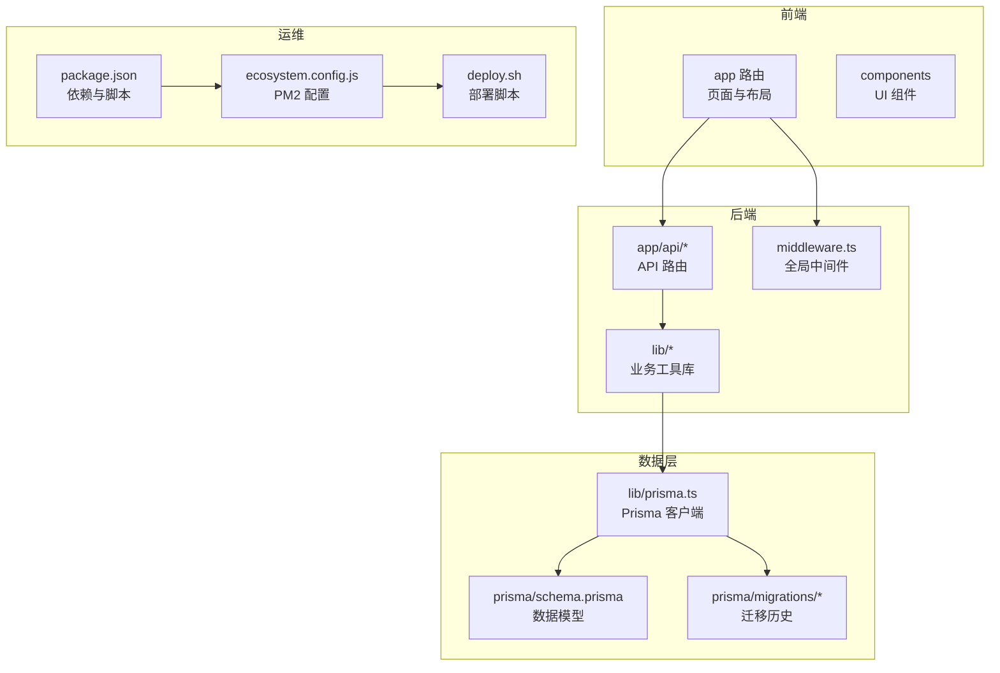
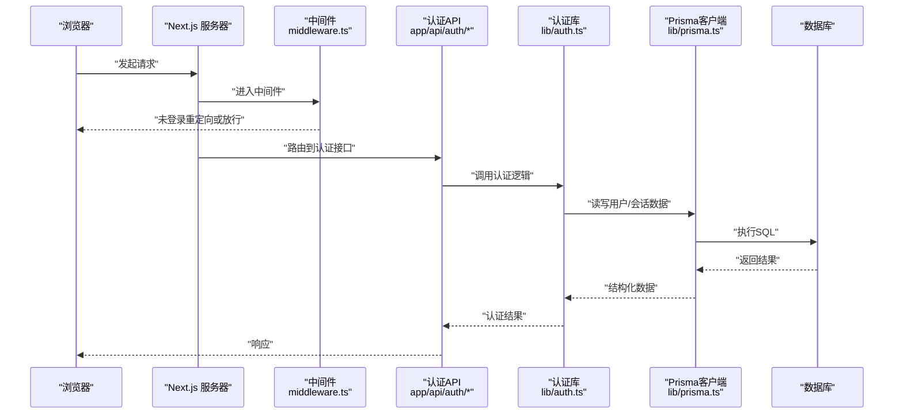
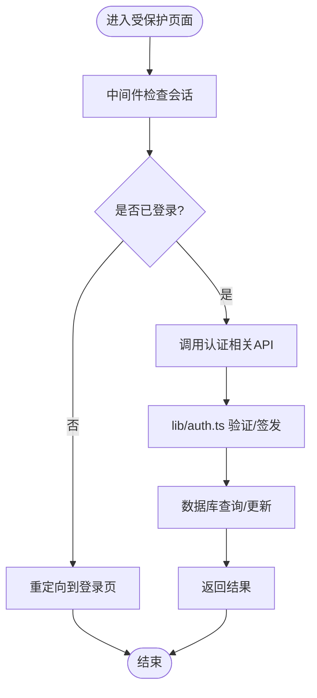
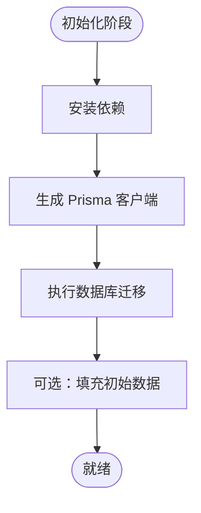

# 换电脑迁移Prompt

<cite>
**本文引用的文件**   
- [package.json](file://package.json)
- [next.config.ts](file://next.config.ts)
- [ecosystem.config.js](file://ecosystem.config.js)
- [deploy.sh](file://deploy.sh)
- [prisma/schema.prisma](file://prisma/schema.prisma)
- [lib/prisma.ts](file://lib/prisma.ts)
- [middleware.ts](file://middleware.ts)
- [app/layout.tsx](file://app/layout.tsx)
- [app/(auth)/layout.tsx](file://app/(auth)/layout.tsx)
- [app/api/auth/login/route.ts](file://app/api/auth/login/route.ts)
- [app/api/auth/register/route.ts](file://app/api/auth/register/route.ts)
- [app/api/auth/me/route.ts](file://app/api/auth/me/route.ts)
- [lib/auth.ts](file://lib/auth.ts)
- [lib/mailer.ts](file://lib/mailer.ts)
- [lib/deepseek.ts](file://lib/deepseek.ts)
- [lib/export-utils.ts](file://lib/export-utils.ts)
- [scripts/create-guest-accounts.js](file://scripts/create-guest-accounts.js)
- [doc/新电脑快速安装心芽程序Prompt.md](file://doc/新电脑快速安装心芽程序Prompt.md)
</cite>

## 目录
1. [简介](#简介)
2. [项目结构](#项目结构)
3. [核心组件](#核心组件)
4. [架构总览](#架构总览)
5. [详细组件分析](#详细组件分析)
6. [依赖关系分析](#依赖关系分析)
7. [性能与稳定性考虑](#性能与稳定性考虑)
8. [故障排查指南](#故障排查指南)
9. [结论](#结论)
10. [附录：迁移清单与命令速查](#附录迁移清单与命令速查)

## 简介
本文件面向“换电脑迁移”场景，提供从旧设备到新设备的完整迁移方案。内容覆盖环境准备、代码拉取、依赖安装、数据库初始化、环境变量配置、本地开发运行、构建与部署、数据备份与恢复、常见问题定位等。目标是让开发者在最短时间完成迁移并稳定运行。

## 项目结构
本项目为 Next.js 应用，采用 App Router 组织页面与 API 路由，使用 Prisma 管理数据库模型与迁移，通过 PM2 进行进程管理，并提供一键部署脚本。关键目录说明：
- app：页面与 API 路由（Auth、Entries、Review、Tags、Theme 等）
- components：前端通用组件
- lib：服务端工具库（认证、邮件、导出、AI 调用、Prisma 客户端等）
- prisma：数据库 Schema 与迁移
- scripts：辅助脚本（如创建访客账号、生成迁移、批量处理）
- doc：文档与提示词

图表来源
- [package.json](file://package.json)
- [next.config.ts](file://next.config.ts)
- [ecosystem.config.js](file://ecosystem.config.js)
- [deploy.sh](file://deploy.sh)
- [prisma/schema.prisma](file://prisma/schema.prisma)
- [lib/prisma.ts](file://lib/prisma.ts)
- [middleware.ts](file://middleware.ts)
- [app/layout.tsx](file://app/layout.tsx)

章节来源
- [package.json](file://package.json)
- [next.config.ts](file://next.config.ts)
- [ecosystem.config.js](file://ecosystem.config.js)
- [deploy.sh](file://deploy.sh)
- [prisma/schema.prisma](file://prisma/schema.prisma)
- [lib/prisma.ts](file://lib/prisma.ts)
- [middleware.ts](file://middleware.ts)
- [app/layout.tsx](file://app/layout.tsx)

## 核心组件
- 认证与会话
  - 登录、注册、获取当前用户等 API 位于 app/api/auth 下，配合 lib/auth.ts 实现认证逻辑。
  - 全局中间件 middleware.ts 用于鉴权拦截与路由保护。
- 数据访问
  - 统一通过 lib/prisma.ts 暴露的 Prisma 客户端访问数据库，Schema 定义于 prisma/schema.prisma。
- 外部服务集成
  - 邮件发送：lib/mailer.ts
  - AI 能力：lib/deepseek.ts
  - 数据导出：lib/export-utils.ts
- 部署与运维
  - PM2 进程管理：ecosystem.config.js
  - 一键部署：deploy.sh
  - 依赖与脚本：package.json

章节来源
- [app/api/auth/login/route.ts](file://app/api/auth/login/route.ts)
- [app/api/auth/register/route.ts](file://app/api/auth/register/route.ts)
- [app/api/auth/me/route.ts](file://app/api/auth/me/route.ts)
- [lib/auth.ts](file://lib/auth.ts)
- [middleware.ts](file://middleware.ts)
- [lib/prisma.ts](file://lib/prisma.ts)
- [prisma/schema.prisma](file://prisma/schema.prisma)
- [lib/mailer.ts](file://lib/mailer.ts)
- [lib/deepseek.ts](file://lib/deepseek.ts)
- [lib/export-utils.ts](file://lib/export-utils.ts)
- [ecosystem.config.js](file://ecosystem.config.js)
- [deploy.sh](file://deploy.sh)
- [package.json](file://package.json)

## 架构总览
下图展示从浏览器到数据库的关键请求路径，以及迁移过程中需要关注的配置点。

图表来源
- [middleware.ts](file://middleware.ts)
- [app/api/auth/login/route.ts](file://app/api/auth/login/route.ts)
- [app/api/auth/register/route.ts](file://app/api/auth/register/route.ts)
- [app/api/auth/me/route.ts](file://app/api/auth/me/route.ts)
- [lib/auth.ts](file://lib/auth.ts)
- [lib/prisma.ts](file://lib/prisma.ts)
- [prisma/schema.prisma](file://prisma/schema.prisma)

## 详细组件分析

### 认证与会话流程
- 登录/注册/获取当前用户等接口由 app/api/auth 下的路由实现，内部调用 lib/auth.ts 完成校验与令牌签发。
- 全局中间件 middleware.ts 对受保护路由进行鉴权拦截，未登录时重定向至登录页。
- 建议在新电脑上确保以下环境变量正确配置：JWT 密钥、Cookie 域名与安全策略、数据库连接串等。

图表来源
- [middleware.ts](file://middleware.ts)
- [app/api/auth/login/route.ts](file://app/api/auth/login/route.ts)
- [app/api/auth/register/route.ts](file://app/api/auth/register/route.ts)
- [app/api/auth/me/route.ts](file://app/api/auth/me/route.ts)
- [lib/auth.ts](file://lib/auth.ts)
- [prisma/schema.prisma](file://prisma/schema.prisma)

章节来源
- [middleware.ts](file://middleware.ts)
- [app/api/auth/login/route.ts](file://app/api/auth/login/route.ts)
- [app/api/auth/register/route.ts](file://app/api/auth/register/route.ts)
- [app/api/auth/me/route.ts](file://app/api/auth/me/route.ts)
- [lib/auth.ts](file://lib/auth.ts)

### 数据访问与迁移
- 数据模型定义在 prisma/schema.prisma，所有变更需通过迁移脚本同步到数据库。
- 运行时通过 lib/prisma.ts 获取 Prisma 客户端，避免重复连接。
- 迁移步骤要点：
  - 拉取最新代码与依赖
  - 执行数据库迁移与生成客户端
  - 必要时执行种子或初始化脚本

图表来源
- [prisma/schema.prisma](file://prisma/schema.prisma)
- [lib/prisma.ts](file://lib/prisma.ts)
- [package.json](file://package.json)

章节来源
- [prisma/schema.prisma](file://prisma/schema.prisma)
- [lib/prisma.ts](file://lib/prisma.ts)
- [package.json](file://package.json)

### 外部服务集成
- 邮件服务：lib/mailer.ts 负责发送邮件，需在环境变量中配置 SMTP 信息。
- AI 能力：lib/deepseek.ts 封装对外部大模型的调用，需配置对应密钥与端点。
- 数据导出：lib/export-utils.ts 提供导出功能，注意输出格式与体积控制。

章节来源
- [lib/mailer.ts](file://lib/mailer.ts)
- [lib/deepseek.ts](file://lib/deepseek.ts)
- [lib/export-utils.ts](file://lib/export-utils.ts)

### 部署与进程管理
- PM2 配置：ecosystem.config.js 定义应用名称、实例数、日志与重启策略。
- 部署脚本：deploy.sh 自动化拉取代码、安装依赖、构建与重启服务。
- 建议在目标服务器提前安装 Node.js、包管理器与 PM2，并确保端口与防火墙开放。

章节来源
- [ecosystem.config.js](file://ecosystem.config.js)
- [deploy.sh](file://deploy.sh)
- [package.json](file://package.json)

## 依赖关系分析
- 应用入口与构建配置：package.json、next.config.ts
- 全局中间件：middleware.ts
- 认证链路：app/api/auth/* → lib/auth.ts → lib/prisma.ts → prisma/schema.prisma
- 运维链路：ecosystem.config.js → deploy.sh → package.json 脚本

图表来源
- [package.json](file://package.json)
- [next.config.ts](file://next.config.ts)
- [middleware.ts](file://middleware.ts)
- [app/api/auth/login/route.ts](file://app/api/auth/login/route.ts)
- [lib/auth.ts](file://lib/auth.ts)
- [lib/prisma.ts](file://lib/prisma.ts)
- [prisma/schema.prisma](file://prisma/schema.prisma)
- [ecosystem.config.js](file://ecosystem.config.js)
- [deploy.sh](file://deploy.sh)

## 性能与稳定性考虑
- 数据库连接复用：通过 lib/prisma.ts 单例客户端减少连接开销。
- 构建缓存：利用 Next.js 构建缓存与增量编译提升本地与 CI 速度。
- 进程管理：PM2 自动重启与日志轮转保障服务可用性。
- 外部依赖限流：对邮件与 AI 调用增加重试与超时控制，避免雪崩。

[本节为通用指导，不直接分析具体文件]

## 故障排查指南
- 无法登录或会话丢失
  - 检查 JWT 与 Cookie 相关环境变量是否一致；确认域名与跨域设置。
  - 查看中间件与认证接口的错误日志。
- 数据库连接失败
  - 核对数据库连接串、网络可达性与权限。
  - 确认迁移是否成功执行，客户端是否生成。
- 邮件/AI 调用失败
  - 校验 SMTP 与 AI 服务密钥、端点与配额。
  - 关注超时与重试策略。
- 部署失败
  - 检查 Node.js 版本与包管理器一致性。
  - 查看 PM2 日志与构建输出。

章节来源
- [middleware.ts](file://middleware.ts)
- [app/api/auth/login/route.ts](file://app/api/auth/login/route.ts)
- [lib/prisma.ts](file://lib/prisma.ts)
- [lib/mailer.ts](file://lib/mailer.ts)
- [lib/deepseek.ts](file://lib/deepseek.ts)
- [ecosystem.config.js](file://ecosystem.config.js)
- [deploy.sh](file://deploy.sh)

## 结论
换电脑迁移的核心在于“环境一致、配置完备、数据可用”。按照本文的步骤完成依赖安装、数据库初始化、环境变量配置与本地运行验证，即可快速在新设备上恢复开发。生产环境则结合 PM2 与部署脚本实现自动化上线。

[本节为总结性内容，不直接分析具体文件]

## 附录：迁移清单与命令速查
- 前置条件
  - 安装 Node.js 与包管理器（npm/yarn/pnpm），保持与项目要求一致
  - 安装数据库客户端或远程连接工具
  - 安装 PM2（如需本地调试进程管理）
- 代码与依赖
  - 克隆仓库并切换到目标分支
  - 安装依赖
- 数据库
  - 生成 Prisma 客户端
  - 执行数据库迁移
  - 可选：运行种子或初始化脚本
- 环境变量
  - 复制示例配置并填写数据库、JWT、邮件、AI 等必要项
- 本地运行
  - 启动开发服务器并访问首页与登录页验证
- 构建与部署
  - 执行构建
  - 使用 PM2 启动或运行部署脚本
- 参考文档
  - 新电脑快速安装心芽程序提示词

章节来源
- [doc/新电脑快速安装心芽程序Prompt.md](file://doc/新电脑快速安装心芽程序Prompt.md)
- [package.json](file://package.json)
- [ecosystem.config.js](file://ecosystem.config.js)
- [deploy.sh](file://deploy.sh)
- [prisma/schema.prisma](file://prisma/schema.prisma)
- [lib/prisma.ts](file://lib/prisma.ts)
- [lib/mailer.ts](file://lib/mailer.ts)
- [lib/deepseek.ts](file://lib/deepseek.ts)