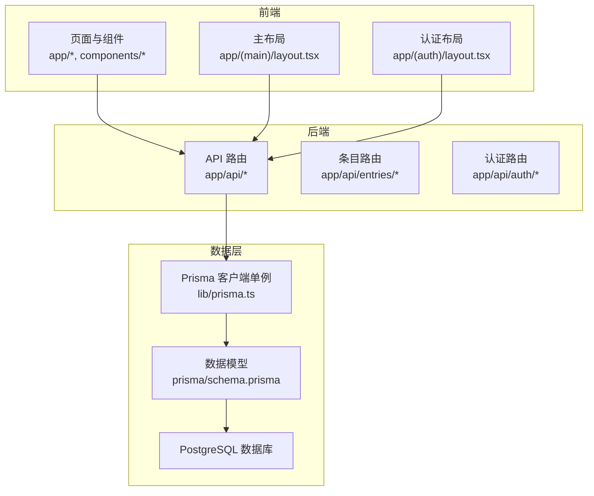
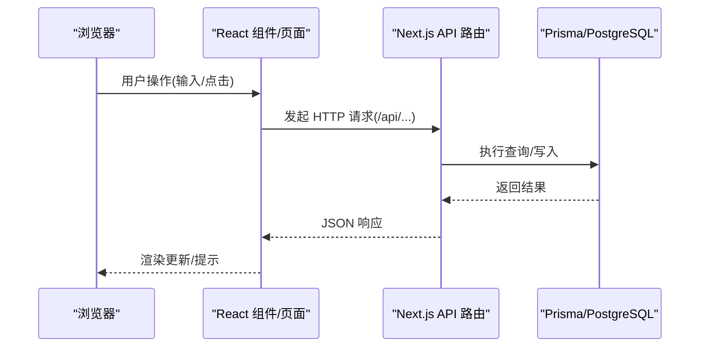
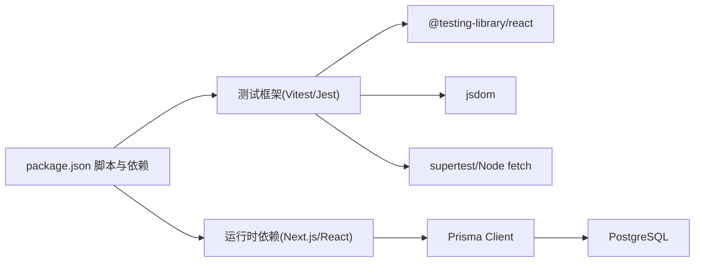

# 测试指南

<cite>
**本文引用的文件**
- [package.json](file://package.json)
- [README.md](file://README.md)
- [prisma/schema.prisma](file://prisma/schema.prisma)
- [lib/prisma.ts](file://lib/prisma.ts)
- [components/Editor.tsx](file://components/Editor.tsx)
- [app/api/auth/login/route.ts](file://app/api/auth/login/route.ts)
- [app/api/entries/route.ts](file://app/api/entries/route.ts)
- [app/api/entries/[id]/route.ts](file://app/api/entries/[id]/route.ts)
- [app/(main)/layout.tsx](file://app/(main)/layout.tsx)
- [app/(auth)/layout.tsx](file://app/(auth)/layout.tsx)
- [middleware.ts](file://middleware.ts)
</cite>

## 目录
1. [简介](#简介)
2. [项目结构](#项目结构)
3. [核心组件](#核心组件)
4. [架构总览](#架构总览)
5. [详细组件分析](#详细组件分析)
6. [依赖分析](#依赖分析)
7. [性能考虑](#性能考虑)
8. [故障排查指南](#故障排查指南)
9. [结论](#结论)
10. [附录](#附录)

## 简介
本指南面向心芽项目的测试体系建设，覆盖单元测试、集成测试、端到端测试、数据库与数据管理、覆盖率与报告、以及性能与压力测试。目标是帮助团队在现有 Next.js + Prisma + PostgreSQL 技术栈上快速落地可维护、可复现、可扩展的测试方案。

## 项目结构
当前仓库为 Next.js App Router 应用，后端 API 位于 app/api 下，前端页面与布局位于 app 目录，数据库模型定义于 prisma/schema.prisma，Prisma 客户端单例封装于 lib/prisma.ts。

图示来源
- [app/(main)/layout.tsx](file://app/(main)/layout.tsx)
- [app/(auth)/layout.tsx](file://app/(auth)/layout.tsx)
- [app/api/entries/route.ts](file://app/api/entries/route.ts)
- [app/api/auth/login/route.ts](file://app/api/auth/login/route.ts)
- [lib/prisma.ts](file://lib/prisma.ts)
- [prisma/schema.prisma](file://prisma/schema.prisma)

章节来源
- [README.md:1-37](file://README.md#L1-L37)
- [package.json:1-40](file://package.json#L1-L40)

## 核心组件
- 前端组件：以 React 函数组件为主，包含富文本编辑器等交互组件（如 Editor）。
- 后端 API：基于 Next.js Route Handlers，提供认证、条目、标签、统计等接口。
- 数据访问：通过 Prisma Client 单例访问 PostgreSQL。

章节来源
- [components/Editor.tsx:32-69](file://components/Editor.tsx#L32-L69)
- [lib/prisma.ts:1-13](file://lib/prisma.ts#L1-L13)
- [prisma/schema.prisma:1-209](file://prisma/schema.prisma#L1-L209)

## 架构总览
下图展示从浏览器到数据库的关键调用路径，便于理解测试边界与 Mock 点。

图示来源
- [components/Editor.tsx:32-69](file://components/Editor.tsx#L32-L69)
- [app/api/entries/route.ts](file://app/api/entries/route.ts)
- [app/api/entries/[id]/route.ts](file://app/api/entries/[id]/route.ts)
- [lib/prisma.ts:1-13](file://lib/prisma.ts#L1-L13)
- [prisma/schema.prisma:1-209](file://prisma/schema.prisma#L1-L209)

## 详细组件分析

### 单元测试框架选择与配置（Jest 或 Vitest）
- 建议优先使用 Vitest，因其与 Vite/Next 生态兼容性好、启动快；若团队更熟悉 Jest，也可选用 Jest + @testing-library/react。
- 安装与脚本
  - 在 package.json 中添加测试脚本与依赖（示例命令参考）：
    - npm install -D vitest @testing-library/react @testing-library/jest-dom jsdom
    - 或在 scripts 中增加 "test": "vitest", "test:ui": "vitest --ui"
- 基础配置要点
  - 指定运行环境为 jsdom（模拟浏览器 DOM）
  - 引入 @testing-library/jest-dom 的断言扩展
  - 设置全局变量（如 fetch、localStorage）以便组件测试
  - 针对 Next.js 的路由、环境变量进行最小化 Mock
- 运行方式
  - 开发模式：vitest
  - 生成覆盖率：vitest run --coverage

章节来源
- [package.json:1-40](file://package.json#L1-L40)

### React 组件测试策略（含用户交互与状态验证）
- 测试目标
  - 渲染正确性：组件是否按预期渲染结构与样式
  - 用户交互：点击、输入、粘贴等行为触发后状态变化
  - 副作用：网络请求、定时器、本地存储等外部依赖的隔离与验证
- 推荐实践
  - 使用 @testing-library/react 进行“以用户为中心”的断言
  - 对网络请求使用 fetch mock 或 MSW（Mock Service Worker）
  - 对第三方库（如 toast、主题）进行轻量 Mock
  - 将复杂逻辑下沉至纯函数并单独测试
- 示例关注点（不展示代码）
  - 富文本编辑器的内容长度计算、粘贴处理、初始化加载
  - 表单提交、错误提示、成功反馈
  - 列表渲染、筛选、分页等交互

章节来源
- [components/Editor.tsx:32-69](file://components/Editor.tsx#L32-L69)

### API 接口集成测试（含 Mock 数据与环境配置）
- 测试范围
  - 认证流程：登录、注册、登出、邮箱验证、重置密码等
  - 业务接口：条目 CRUD、标签管理、统计、导出等
- 环境与数据
  - 使用独立测试数据库（PostgreSQL），通过环境变量切换 DATABASE_URL
  - 使用 Prisma 迁移在测试前准备 schema，必要时使用夹具数据
- 请求与断言
  - 使用 supertest 或 Node 原生 fetch 发起请求
  - 校验状态码、响应体结构、错误信息
- 安全与鉴权
  - 对需要鉴权的接口构造有效 Token 或跳过鉴权中间件（根据测试策略）

章节来源
- [app/api/auth/login/route.ts](file://app/api/auth/login/route.ts)
- [app/api/entries/route.ts](file://app/api/entries/route.ts)
- [app/api/entries/[id]/route.ts](file://app/api/entries/[id]/route.ts)
- [lib/prisma.ts:1-13](file://lib/prisma.ts#L1-L13)
- [prisma/schema.prisma:1-209](file://prisma/schema.prisma#L1-L209)

### 前端路由与页面组件测试
- 路由测试
  - 使用 next-router-mock 或自定义 router context 模拟路由跳转与参数
  - 验证受保护路由的重定向行为（结合 middleware.ts）
- 页面组件
  - 渲染关键区块、导航、面包屑、空态与错误态
  - 组合多个子组件时，对子组件进行必要 Mock，聚焦页面级交互

章节来源
- [app/(main)/layout.tsx](file://app/(main)/layout.tsx)
- [app/(auth)/layout.tsx](file://app/(auth)/layout.tsx)
- [middleware.ts](file://middleware.ts)

### 数据库操作测试策略与测试数据管理
- 策略
  - 使用真实数据库（PostgreSQL）进行集成测试，保证与生产一致
  - 每个测试用例前后进行数据清理（事务回滚或显式删除）
- 数据管理
  - 使用 Prisma 迁移确保 schema 一致
  - 使用夹具（fixtures）或工厂方法生成稳定数据
  - 对时间敏感字段（recordTime、createdAt）使用可控时间源
- 注意事项
  - 避免跨用例共享可变状态
  - 并发测试需隔离连接与表空间

章节来源
- [lib/prisma.ts:1-13](file://lib/prisma.ts#L1-L13)
- [prisma/schema.prisma:1-209](file://prisma/schema.prisma#L1-L209)

### 端到端测试（E2E）工具选择与用例设计
- 工具建议
  - Playwright 或 Cypress，支持跨浏览器、UI 自动化、网络拦截
- 用例设计
  - 关键用户旅程：注册/登录 -> 创建条目 -> 标签管理 -> 查看统计 -> 导出
  - 异常路径：网络失败、权限不足、重复提交
  - 兼容性：移动端视口、暗色主题
- 环境
  - 启动 Next.js 服务，注入测试环境变量
  - 预置数据库与种子数据
  - 录制回放与截图/视频留存

[本节为概念性说明，无需源码引用]

### 测试覆盖率要求与报告生成
- 指标建议
  - 语句/分支/函数/行覆盖率均不低于 80%（可按模块逐步提升）
- 配置要点
  - 在测试框架中启用覆盖率收集（如 Vitest coverage）
  - 排除构建产物与类型声明
  - 生成 HTML 与 LCOV 报告，便于 CI 归档与阈值检查
- 持续集成
  - 在 PR 阶段强制覆盖率门禁，未达标则阻断合并

章节来源
- [package.json:1-40](file://package.json#L1-L40)

### 性能测试与压力测试
- 前端性能
  - 使用 Lighthouse CI 评估首屏、交互延迟、资源体积
  - 使用 React DevTools Profiler 定位重渲染热点
- 后端性能
  - 使用 k6 或 Artillery 对关键 API 进行压测（登录、条目列表、统计）
  - 监控数据库慢查询与索引命中情况
- 基准回归
  - 将关键场景纳入回归套件，CI 中对比历史基线

[本节为通用指导，无需源码引用]

## 依赖分析
下图展示测试相关依赖与运行时依赖的关系，明确测试边界与 Mock 点。

图示来源
- [package.json:1-40](file://package.json#L1-L40)
- [lib/prisma.ts:1-13](file://lib/prisma.ts#L1-L13)
- [prisma/schema.prisma:1-209](file://prisma/schema.prisma#L1-L209)

章节来源
- [package.json:1-40](file://package.json#L1-L40)

## 性能考虑
- 测试执行速度
  - 使用并行执行、按需加载、减少不必要的 DOM 渲染
  - 合理拆分测试套件，缩短反馈周期
- 资源占用
  - 控制并发数据库连接数，避免内存泄漏
  - 对大型快照或媒体资源进行惰性加载或替换
- 稳定性
  - 对随机性与时间相关逻辑使用确定性替代（固定时间、伪随机种子）

[本节为通用指导，无需源码引用]

## 故障排查指南
- 常见问题
  - 环境变量缺失：确保测试环境注入 DATABASE_URL、JWT 密钥等
  - 路由上下文缺失：在组件测试中提供 router context 或使用 mock
  - 鉴权失败：确认测试用 Token 或跳过鉴权中间件的策略
  - 数据库连接失败：检查端口、用户名、密码、SSL 参数
- 定位技巧
  - 开启 Prisma 日志（开发环境默认包含 query/error/warn）
  - 打印请求/响应体与错误堆栈
  - 缩小问题范围：先跑最小用例集，再逐步扩大

章节来源
- [lib/prisma.ts:1-13](file://lib/prisma.ts#L1-L13)

## 结论
通过分层测试（单元、集成、E2E）、稳定的数据管理与覆盖率门禁，心芽项目可在保持迭代速度的同时显著提升质量与可维护性。建议优先补齐核心 API 与关键页面的测试，逐步完善性能与回归体系。

## 附录
- 术语
  - 单元测试：对最小可测单元的验证
  - 集成测试：对模块间协作与外部依赖的验证
  - 端到端测试：对用户完整旅程的验证
- 参考文档
  - Next.js 官方文档与最佳实践
  - Prisma 测试指南与迁移管理
  - Testing Library 官方文档

[本节为补充说明，无需源码引用]