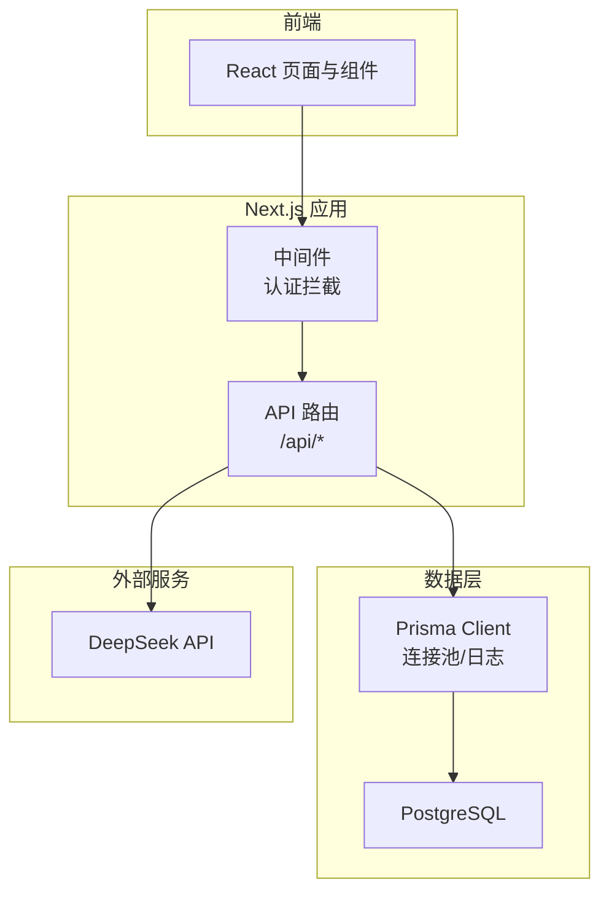
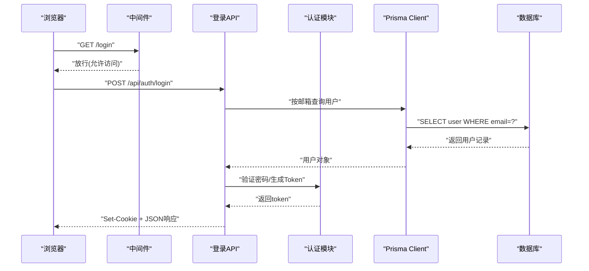
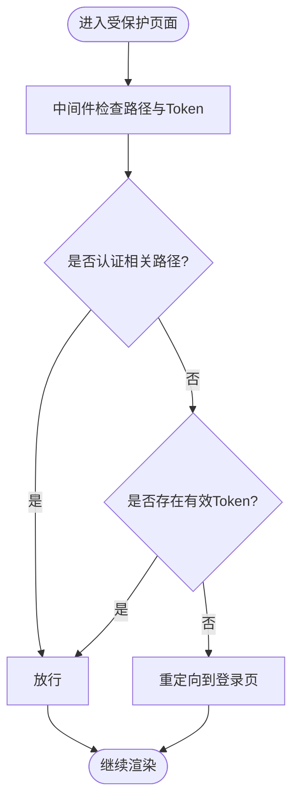
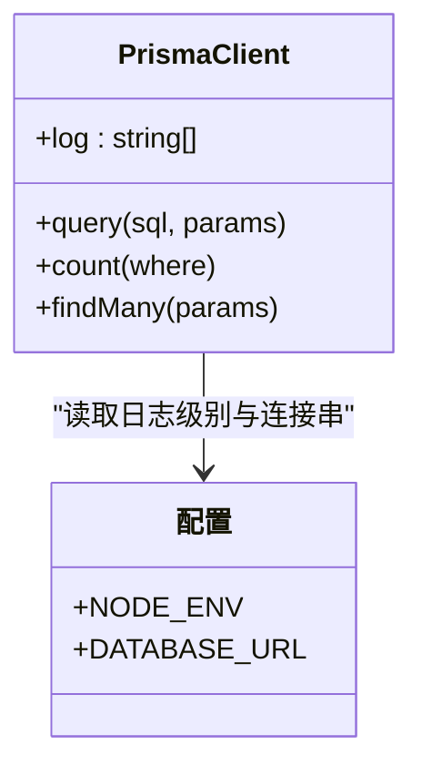
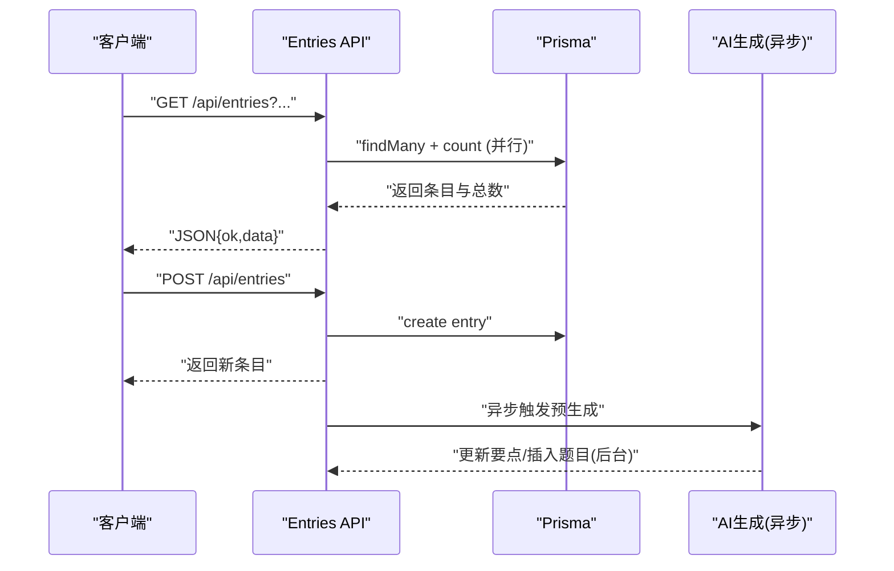
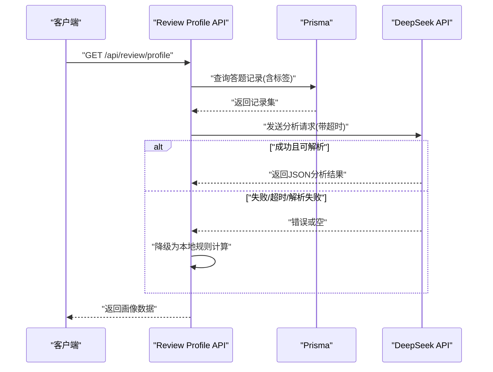
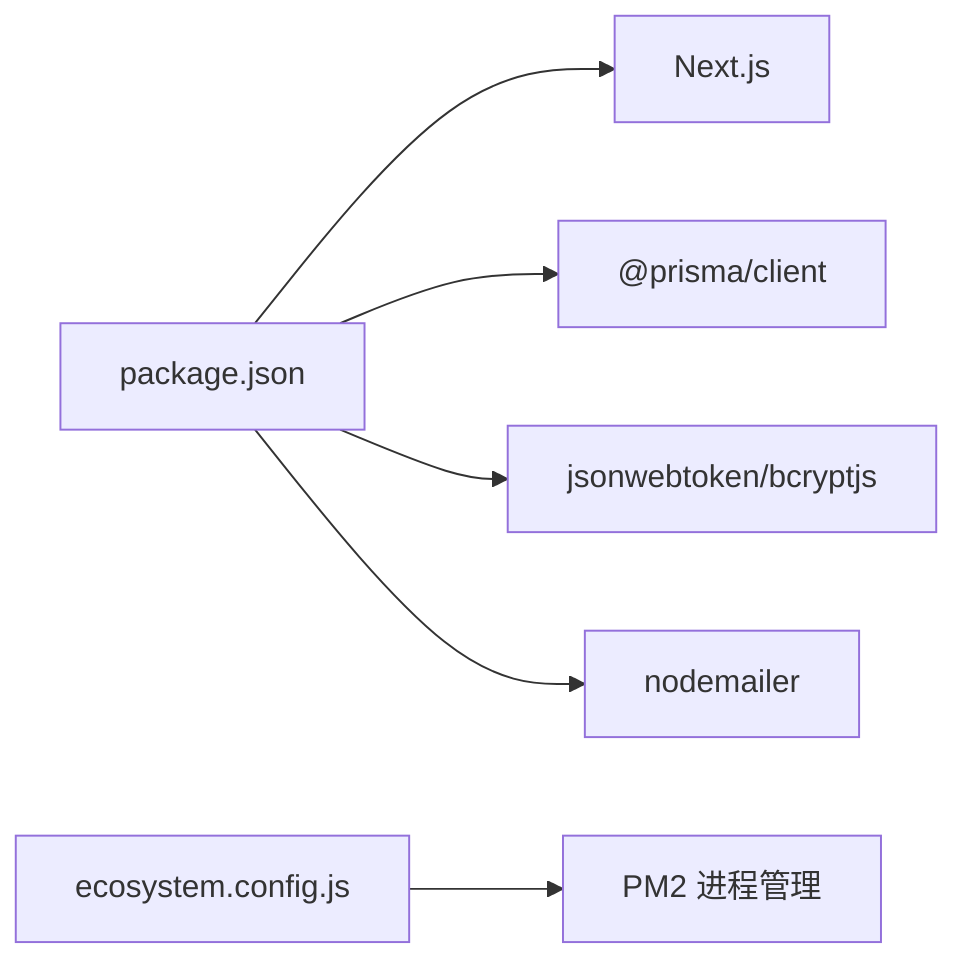

# 调试与故障排查

<cite>
**本文引用的文件**   
- [package.json](file://package.json)
- [next.config.ts](file://next.config.ts)
- [ecosystem.config.js](file://ecosystem.config.js)
- [middleware.ts](file://middleware.ts)
- [lib/prisma.ts](file://lib/prisma.ts)
- [lib/auth.ts](file://lib/auth.ts)
- [app/api/entries/route.ts](file://app/api/entries/route.ts)
- [app/api/review/profile/route.ts](file://app/api/review/profile/route.ts)
- [prisma/schema.prisma](file://prisma/schema.prisma)
</cite>

## 目录
1. [简介](#简介)
2. [项目结构](#项目结构)
3. [核心组件](#核心组件)
4. [架构总览](#架构总览)
5. [详细组件分析](#详细组件分析)
6. [依赖分析](#依赖分析)
7. [性能考虑](#性能考虑)
8. [故障排查指南](#故障排查指南)
9. [结论](#结论)
10. [附录](#附录)

## 简介
本指南面向心芽项目的开发与运维人员，聚焦于前后端联调、生产排障与性能优化。内容覆盖：
- 浏览器开发者工具高级技巧与 React DevTools 性能分析
- Node.js/Next.js 后端调试方法与日志分析
- Prisma 查询日志与慢查询定位
- API 接口调试与请求追踪
- 生产环境错误监控与异常上报配置建议
- 常见错误诊断与解决方案库
- 内存泄漏检测与性能瓶颈定位
- 网络请求与第三方服务集成问题排查

## 项目结构
本项目采用 Next.js App Router 组织页面与 API 路由，Prisma 作为数据访问层，JWT + Cookie 完成鉴权，Node 进程由 PM2 管理。

图表来源
- [middleware.ts:1-29](file://middleware.ts#L1-L29)
- [app/api/entries/route.ts:1-163](file://app/api/entries/route.ts#L1-L163)
- [lib/prisma.ts:1-14](file://lib/prisma.ts#L1-L14)
- [prisma/schema.prisma:1-209](file://prisma/schema.prisma#L1-L209)

章节来源
- [package.json:1-40](file://package.json#L1-L40)
- [next.config.ts:1-8](file://next.config.ts#L1-L8)
- [ecosystem.config.js:1-15](file://ecosystem.config.js#L1-L15)
- [middleware.ts:1-29](file://middleware.ts#L1-L29)

## 核心组件
- 认证与鉴权
  - JWT 签发与校验、Cookie 设置与读取、当前用户解析
- 数据库访问
  - Prisma Client 单例、开发/生产日志级别控制
- API 路由
  - 心得列表/创建、复习画像等关键接口
- 进程管理
  - PM2 启动参数与内存重启阈值

章节来源
- [lib/auth.ts:1-56](file://lib/auth.ts#L1-L56)
- [lib/prisma.ts:1-14](file://lib/prisma.ts#L1-L14)
- [app/api/entries/route.ts:1-163](file://app/api/entries/route.ts#L1-L163)
- [ecosystem.config.js:1-15](file://ecosystem.config.js#L1-L15)

## 架构总览
下图展示一次“登录”端到端的调用链，涵盖中间件、API、认证、数据库与响应返回。

图表来源
- [middleware.ts:1-29](file://middleware.ts#L1-L29)
- [app/api/entries/route.ts:1-163](file://app/api/entries/route.ts#L1-L163)
- [lib/auth.ts:1-56](file://lib/auth.ts#L1-L56)
- [lib/prisma.ts:1-14](file://lib/prisma.ts#L1-L14)

## 详细组件分析

### 认证与鉴权（JWT + Cookie）
- 职责
  - 密码加盐哈希与比对
  - JWT 签发与校验
  - 从请求中解析当前用户ID
  - Cookie 安全属性配置
- 关键点
  - 生产环境需替换默认密钥并启用 secure Cookie
  - 中间件对未携带有效 Token 的受保护路径进行重定向

图表来源
- [middleware.ts:1-29](file://middleware.ts#L1-L29)
- [lib/auth.ts:1-56](file://lib/auth.ts#L1-L56)

章节来源
- [lib/auth.ts:1-56](file://lib/auth.ts#L1-L56)
- [middleware.ts:1-29](file://middleware.ts#L1-L29)

### 数据库访问与日志（Prisma）
- 职责
  - 提供全局 PrismaClient 实例
  - 根据环境变量控制日志级别（开发开启 query/error/warn，生产仅 error）
- 关键点
  - 通过环境变量切换日志输出，便于本地调试与生产降噪
  - 结合索引设计可显著降低慢查询概率

图表来源
- [lib/prisma.ts:1-14](file://lib/prisma.ts#L1-L14)
- [prisma/schema.prisma:1-209](file://prisma/schema.prisma#L1-L209)

章节来源
- [lib/prisma.ts:1-14](file://lib/prisma.ts#L1-L14)
- [prisma/schema.prisma:1-209](file://prisma/schema.prisma#L1-L209)

### 心得列表与预生成（API 路由）
- 职责
  - 分页、筛选、排序获取心得列表
  - 新建心得后异步触发题目预生成
- 关键点
  - 使用 Promise.all 并行 count 与 findMany，减少往返延迟
  - 预生成走异步任务，不阻塞主响应；失败不影响写入成功
  - 包含标签关联查询，注意 include 带来的额外开销

图表来源
- [app/api/entries/route.ts:1-163](file://app/api/entries/route.ts#L1-L163)

章节来源
- [app/api/entries/route.ts:1-163](file://app/api/entries/route.ts#L1-L163)

### 学习画像与第三方服务（DeepSeek）
- 职责
  - 聚合答题记录，计算准确率、近N日趋势
  - 调用 DeepSeek 分析薄弱/优势领域，失败时降级为本地规则
- 关键点
  - 对外部 HTTP 请求设置超时与 AbortController
  - 非 2xx 或解析失败均走降级逻辑，保障可用性
  - 统计阶段避免 N+1 查询，尽量在数据库侧聚合

图表来源
- [app/api/review/profile/route.ts:1-179](file://app/api/review/profile/route.ts#L1-L179)

章节来源
- [app/api/review/profile/route.ts:1-179](file://app/api/review/profile/route.ts#L1-L179)

## 依赖分析
- 运行时依赖
  - Next.js、React、Prisma Client、bcryptjs、jsonwebtoken、nodemailer 等
- 开发依赖
  - TypeScript、ESLint、TailwindCSS 等
- 进程管理
  - PM2 以单实例运行，配置最大内存重启阈值

图表来源
- [package.json:1-40](file://package.json#L1-L40)
- [ecosystem.config.js:1-15](file://ecosystem.config.js#L1-L15)

章节来源
- [package.json:1-40](file://package.json#L1-L40)
- [ecosystem.config.js:1-15](file://ecosystem.config.js#L1-L15)

## 性能考虑
- 前端
  - 使用 React DevTools Profiler 捕获渲染热点，关注不必要的重渲染与深层子树更新
  - 利用 Network 面板的缓存策略与资源压缩情况，评估首屏与交互延迟
- 后端
  - 将高耗时操作（如 AI 生成）异步化，避免阻塞主响应
  - 使用 Promise.all 并发独立 I/O，减少整体 RTT
- 数据库
  - 充分利用现有复合索引（如按 userId 与时间/状态），避免全表扫描
  - 谨慎使用 include，必要时拆分查询或在应用层组装
- 进程
  - 合理设置 max_memory_restart，防止 OOM 导致频繁重启影响稳定性

[本节为通用指导，无需代码引用]

## 故障排查指南

### 浏览器开发者工具与 React DevTools
- 常用能力
  - Elements：查看 DOM 结构与样式生效情况
  - Sources：断点调试 JS，查看闭包变量与作用域
  - Console：过滤日志、保存日志、执行表达式
  - Network：查看请求/响应、重试、模拟弱网
  - Performance：录制帧率、识别长任务与布局抖动
  - Memory：堆快照对比，定位内存增长
- React DevTools
  - Components：检查 props/state 变化与组件树
  - Profiler：记录渲染耗时，定位重渲染原因
  - Hooks：查看自定义 Hook 的状态与副作用

[本节为通用指导，无需代码引用]

### Node.js 后端调试与日志分析
- 本地调试
  - 使用 next dev 启动，配合 VS Code 断点调试
  - 在 API 路由与业务函数入口/出口添加结构化日志（包含 userId、entryId、耗时等）
- 生产日志
  - 通过 PM2 logs 查看标准输出与错误输出
  - 结合环境变量控制 Prisma 日志级别，避免生产噪音
- 关键日志位置
  - API 路由中的 try/catch 块与关键步骤 console.log/console.error
  - Prisma 的 query/error/warn 日志（开发环境）

章节来源
- [app/api/entries/route.ts:1-163](file://app/api/entries/route.ts#L1-L163)
- [app/api/review/profile/route.ts:1-179](file://app/api/review/profile/route.ts#L1-L179)
- [lib/prisma.ts:1-14](file://lib/prisma.ts#L1-L14)

### 数据库查询性能优化与慢查询分析
- 启用 Prisma 查询日志
  - 开发环境已开启 query/error/warn，可直接观察 SQL 与耗时
- 慢查询定位
  - 关注无索引或低选择性条件导致的扫描
  - 检查 include 是否引发 N+1 或大对象传输
- 索引与查询模式
  - 优先使用已有复合索引（userId + 时间/状态）
  - 将高频过滤条件放入 where，避免在应用层做大量过滤

章节来源
- [lib/prisma.ts:1-14](file://lib/prisma.ts#L1-L14)
- [prisma/schema.prisma:1-209](file://prisma/schema.prisma#L1-L209)

### API 接口调试与请求追踪
- 推荐流程
  - 使用 Network 面板记录请求，复制 cURL 快速复现
  - 在 API 路由中添加请求 ID 与耗时埋点，统一日志格式
  - 对第三方调用增加超时与降级策略
- 典型场景
  - 登录失败：检查 Cookie 是否设置、Token 是否过期、中间件是否拦截
  - 列表加载慢：检查分页参数、include 字段、索引命中
  - 第三方调用失败：检查超时、鉴权、返回体结构

章节来源
- [middleware.ts:1-29](file://middleware.ts#L1-L29)
- [app/api/entries/route.ts:1-163](file://app/api/entries/route.ts#L1-L163)
- [app/api/review/profile/route.ts:1-179](file://app/api/review/profile/route.ts#L1-L179)

### 生产环境错误监控与异常上报
- 建议方案
  - 接入集中式日志系统（如 ELK/SLS），统一收集 stdout/stderr
  - 接入错误监控（如 Sentry），捕获未处理异常与边界错误
  - 为关键路径添加业务指标（成功率、P95/P99 耗时）
- 最小化改动
  - 在顶层 try/catch 中上报错误上下文（用户ID、请求ID、路由、参数摘要）
  - 对第三方调用增加错误分类与告警阈值

[本节为通用指导，无需代码引用]

### 常见错误诊断与解决方案库
- 登录失败
  - 现象：返回未登录或重定向至登录页
  - 排查：检查 Cookie 是否设置、Token 是否过期、中间件匹配器是否放行
  - 参考：中间件与认证模块
- 列表为空或过慢
  - 现象：entries 列表为空或加载缓慢
  - 排查：确认分页参数、where 条件、include 字段；检查索引命中
  - 参考：entries 路由与 Prisma 日志
- 第三方服务不可用
  - 现象：学习画像无法获取或返回空
  - 排查：检查超时、鉴权、返回体结构；确认降级逻辑是否生效
  - 参考：review profile 路由

章节来源
- [middleware.ts:1-29](file://middleware.ts#L1-L29)
- [lib/auth.ts:1-56](file://lib/auth.ts#L1-L56)
- [app/api/entries/route.ts:1-163](file://app/api/entries/route.ts#L1-L163)
- [app/api/review/profile/route.ts:1-179](file://app/api/review/profile/route.ts#L1-L179)

### 内存泄漏检测与性能瓶颈定位
- 前端
  - 使用 Memory 面板拍摄堆快照，对比两次快照查找持续增长的对象
  - 使用 Profiler 定位长时间运行的任务与过度渲染
- 后端
  - 使用 PM2 监控内存曲线，结合 max_memory_restart 阈值判断异常
  - 在关键路径打印内存占用（process.memoryUsage）辅助定位
- 数据库
  - 通过 Prisma 日志与数据库慢查询日志联合分析，定位锁等待与大事务

[本节为通用指导，无需代码引用]

### 网络请求与第三方服务集成排查
- 常见问题
  - 超时、鉴权失败、跨域、证书问题、返回体结构变更
- 排查步骤
  - 使用 Network 面板抓包，核对请求头与响应码
  - 在服务端增加超时与错误分类，记录失败原因与重试次数
  - 对关键依赖实现降级与熔断，避免雪崩

章节来源
- [app/api/review/profile/route.ts:1-179](file://app/api/review/profile/route.ts#L1-L179)

## 结论
通过合理的日志策略、完善的错误处理与性能观测手段，可以显著提升心芽项目的可维护性与稳定性。建议在生产环境完善错误监控与指标采集，持续优化数据库索引与查询模式，并对第三方服务引入超时、降级与告警机制。

[本节为总结性内容，无需代码引用]

## 附录
- 常用命令与环境
  - 开发：next dev
  - 构建：next build
  - 启动：next start
  - 部署迁移：prisma migrate deploy
  - 进程管理：PM2（见 ecosystem.config.js）

章节来源
- [package.json:1-40](file://package.json#L1-L40)
- [ecosystem.config.js:1-15](file://ecosystem.config.js#L1-L15)