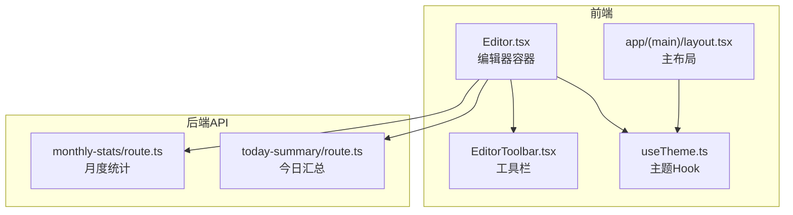
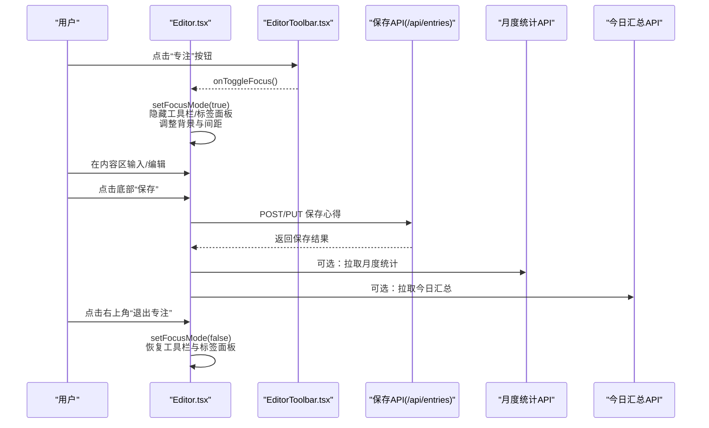
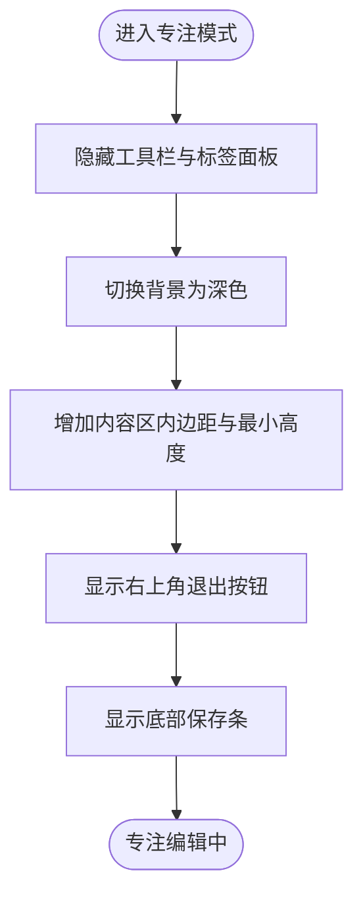
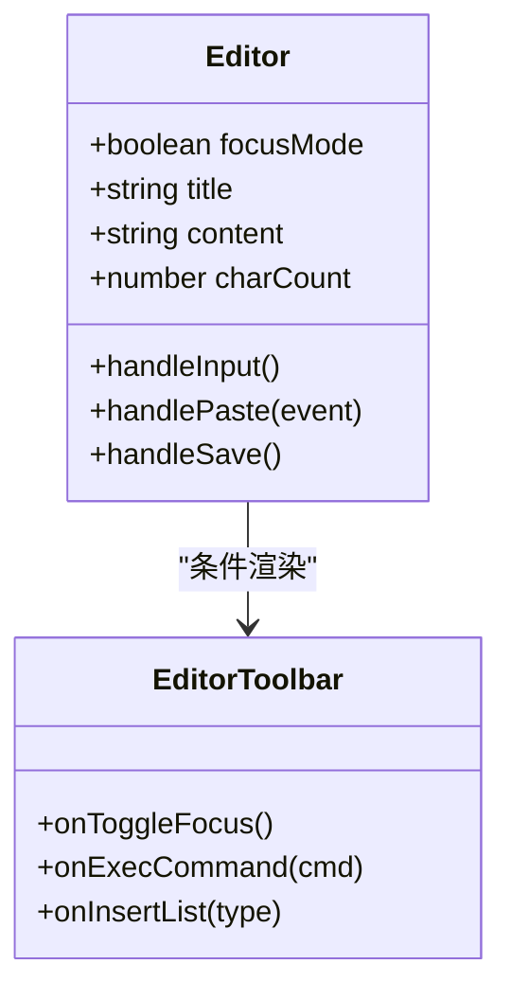
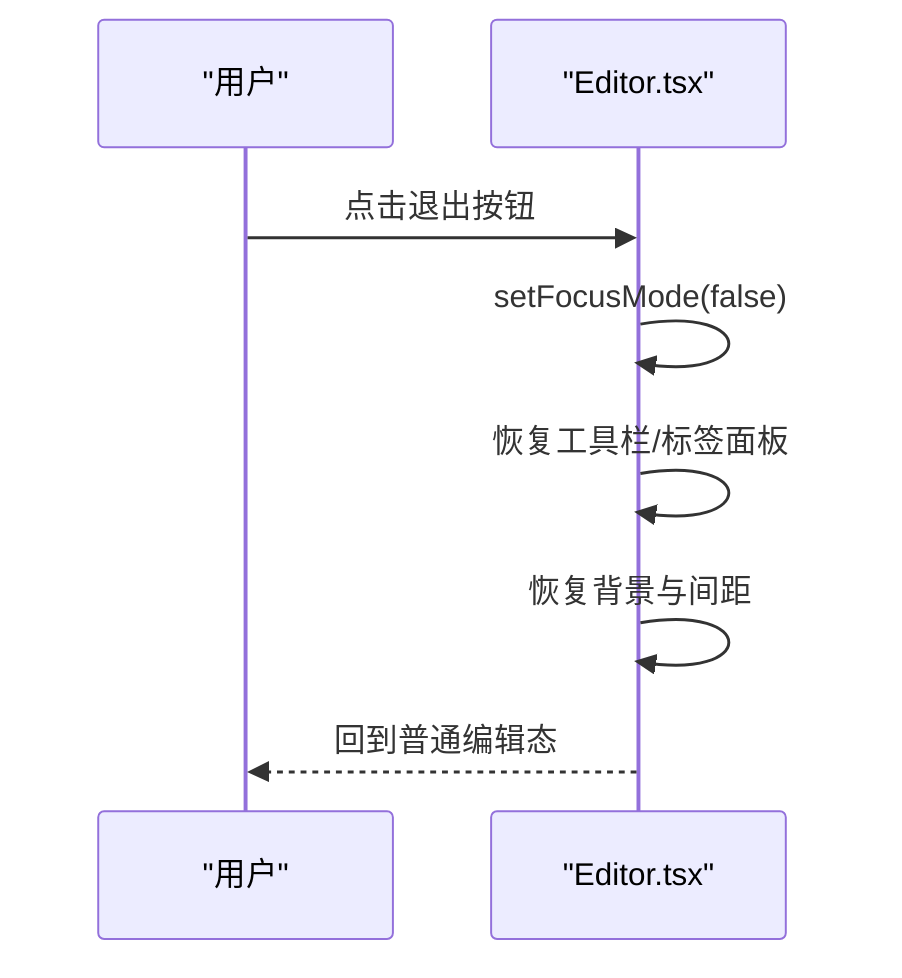
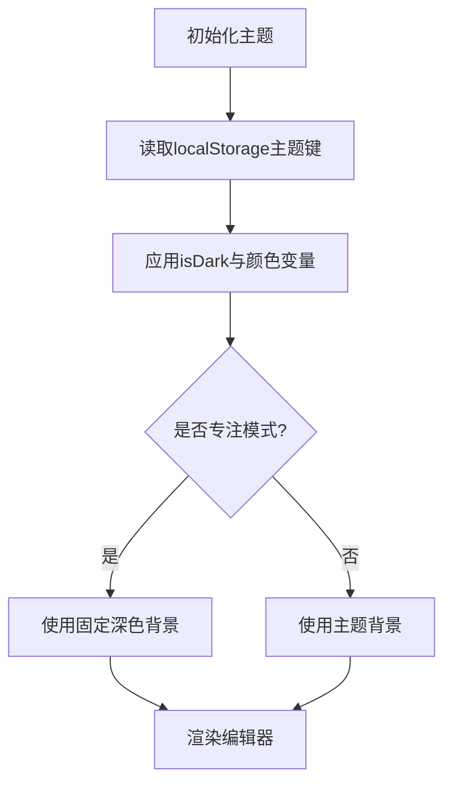
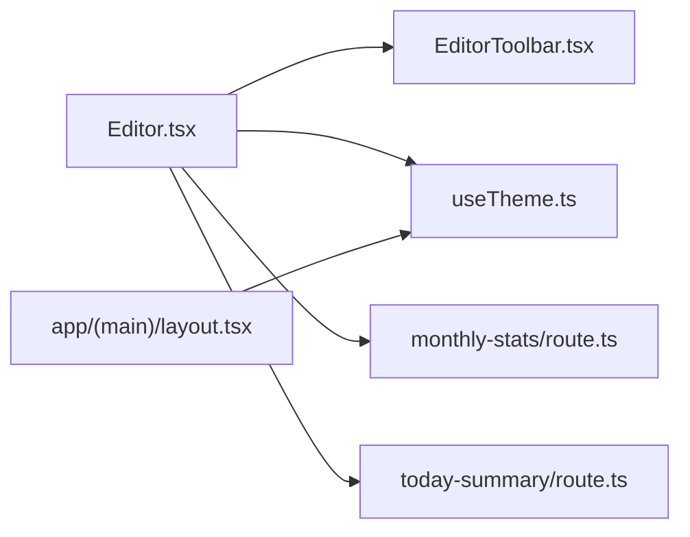

# 专注写作模式

<cite>
**本文引用的文件**
- [components/Editor.tsx](file://components/Editor.tsx)
- [components/EditorToolbar.tsx](file://components/EditorToolbar.tsx)
- [lib/useTheme.ts](file://lib/useTheme.ts)
- [app/(main)/layout.tsx](file://app/(main)/layout.tsx)
- [app/api/monthly-stats/route.ts](file://app/api/monthly-stats/route.ts)
- [app/api/today-summary/route.ts](file://app/api/today-summary/route.ts)
- [prisma/schema.prisma](file://prisma/schema.prisma)
</cite>

## 目录
1. [简介](#简介)
2. [项目结构](#项目结构)
3. [核心组件](#核心组件)
4. [架构总览](#架构总览)
5. [详细组件分析](#详细组件分析)
6. [依赖关系分析](#依赖关系分析)
7. [性能与体验优化](#性能与体验优化)
8. [故障排查指南](#故障排查指南)
9. [结论](#结论)
10. [附录](#附录)

## 简介
本文件面向“心芽”的专注写作模式，系统性梳理其焦点模式的 UI 切换逻辑、界面简化策略、全屏编辑体验的实现细节（工具栏隐藏与背景优化）、退出交互与状态恢复、键盘快捷键支持现状与扩展建议、主题适配与视觉优化方案、专注时长统计与记录方案，以及与其他编辑功能的兼容性与冲突处理。文档同时提供代码级流程图与时序图，帮助读者快速理解实现路径并指导后续迭代。

## 项目结构
专注写作模式的核心位于编辑器组件及其工具栏：
- 编辑器容器负责焦点模式开关、内容区渲染、保存流程与基础输入事件。
- 工具栏提供富文本操作、标签选择、字数统计与进入专注模式的入口。
- 主题系统通过 Hook 与布局层协同，确保在专注模式下获得一致的视觉体验。
- 统计相关 API 用于月度与今日汇总，可作为专注时长的数据源或展示层。

图表来源
- [components/Editor.tsx:1-192](file://components/Editor.tsx#L1-L192)
- [components/EditorToolbar.tsx:1-78](file://components/EditorToolbar.tsx#L1-L78)
- [lib/useTheme.ts:1-30](file://lib/useTheme.ts#L1-L30)
- [app/(main)/layout.tsx:44-81](file://app/(main)/layout.tsx#L44-L81)
- [app/api/monthly-stats/route.ts:1-96](file://app/api/monthly-stats/route.ts#L1-L96)
- [app/api/today-summary/route.ts:63-117](file://app/api/today-summary/route.ts#L63-L117)

章节来源
- [components/Editor.tsx:1-192](file://components/Editor.tsx#L1-L192)
- [components/EditorToolbar.tsx:1-78](file://components/EditorToolbar.tsx#L1-L78)
- [lib/useTheme.ts:1-30](file://lib/useTheme.ts#L1-L30)
- [app/(main)/layout.tsx:44-81](file://app/(main)/layout.tsx#L44-L81)

## 核心组件
- 编辑器容器（Editor）
  - 管理焦点模式状态、标题、正文内容、心情与标签、保存流程与字符计数。
  - 在焦点模式下隐藏工具栏与标签面板，调整背景色、内边距与最小高度，提升沉浸感。
  - 提供退出按钮与底部固定保存条，便于快速保存并退出专注模式。
- 工具栏（EditorToolbar）
  - 提供粗体、斜体、下划线、列表插入、颜色选择、标签选择与进入专注模式按钮。
  - 显示实时字数统计，保持与编辑器同步。
- 主题系统（useTheme + 主布局）
  - 通过 localStorage 持久化主题，并在页面挂载时应用；主布局监听主题变更事件以刷新全局背景。
  - 专注模式使用独立深色背景，避免受全局主题影响，保证阅读与书写对比度。

章节来源
- [components/Editor.tsx:22-192](file://components/Editor.tsx#L22-L192)
- [components/EditorToolbar.tsx:22-78](file://components/EditorToolbar.tsx#L22-L78)
- [lib/useTheme.ts:4-29](file://lib/useTheme.ts#L4-L29)
- [app/(main)/layout.tsx:44-81](file://app/(main)/layout.tsx#L44-L81)

## 架构总览
专注写作的交互由“编辑器容器”主导，工具栏作为辅助层，主题系统贯穿全局。统计 API 为后续专注时长与行为分析提供数据支撑。

图表来源
- [components/Editor.tsx:137-182](file://components/Editor.tsx#L137-L182)
- [components/EditorToolbar.tsx:59-61](file://components/EditorToolbar.tsx#L59-L61)
- [app/api/monthly-stats/route.ts:22-95](file://app/api/monthly-stats/route.ts#L22-L95)
- [app/api/today-summary/route.ts:63-117](file://app/api/today-summary/route.ts#L63-L117)

## 详细组件分析

### 焦点模式 UI 切换与界面简化策略
- 触发入口：工具栏中的“专注”按钮调用父组件的切换函数，将焦点模式置为 true。
- 界面简化：
  - 隐藏顶部工具栏与标签面板，减少干扰元素。
  - 增大内容区内边距与最小高度，提升沉浸式书写空间。
  - 背景切换为深色系，增强文字可读性。
- 退出交互：右上角半透明退出按钮，点击后恢复非专注态，还原工具栏与标签面板。
- 保存入口：底部渐变遮罩中放置“保存”按钮，便于在专注状态下快速保存。

图表来源
- [components/Editor.tsx:137-182](file://components/Editor.tsx#L137-L182)
- [components/EditorToolbar.tsx:59-61](file://components/EditorToolbar.tsx#L59-L61)

章节来源
- [components/Editor.tsx:137-182](file://components/Editor.tsx#L137-L182)
- [components/EditorToolbar.tsx:59-61](file://components/EditorToolbar.tsx#L59-L61)

### 全屏编辑体验的实现（工具栏隐藏与背景优化）
- 工具栏隐藏：通过条件渲染控制工具栏的显示与隐藏，仅在非专注模式下渲染。
- 背景优化：专注模式下使用固定深色背景，非专注模式根据主题 Hook 决定亮/暗背景。
- 字体与行高：专注模式下提高字号与行高，增强可读性；保留占位符提示以提升新手引导体验。
- 粘贴处理：统一纯文本粘贴，避免富文本样式污染内容。

图表来源
- [components/Editor.tsx:1-192](file://components/Editor.tsx#L1-L192)
- [components/EditorToolbar.tsx:1-78](file://components/EditorToolbar.tsx#L1-L78)

章节来源
- [components/Editor.tsx:64-71](file://components/Editor.tsx#L64-L71)
- [components/Editor.tsx:137-182](file://components/Editor.tsx#L137-L182)
- [components/EditorToolbar.tsx:41-78](file://components/EditorToolbar.tsx#L41-L78)

### 退出专注模式的交互设计与状态恢复
- 退出按钮：右上角半透明圆形按钮，点击后将焦点模式置为 false。
- 状态恢复：
  - 重新渲染工具栏与标签面板。
  - 恢复默认背景与内边距。
  - 移除底部保存条。
- 数据一致性：退出前可触发保存，确保内容不丢失。

图表来源
- [components/Editor.tsx:156-158](file://components/Editor.tsx#L156-L158)

章节来源
- [components/Editor.tsx:156-158](file://components/Editor.tsx#L156-L158)

### 专注模式下的键盘快捷键支持
- 当前实现：未内置全局快捷键监听器；富文本命令通过工具栏按钮触发（如加粗、斜体、下划线、列表）。
- 建议扩展：
  - 在专注模式下监听 Ctrl/Cmd + S 进行保存。
  - 监听 Ctrl/Cmd + B/I/U 执行对应富文本命令。
  - 监听 Escape 退出专注模式。
  - 注意与浏览器默认行为冲突的处理（如阻止默认滚动、防止重复保存）。

章节来源
- [components/EditorToolbar.tsx:52-61](file://components/EditorToolbar.tsx#L52-L61)
- [components/Editor.tsx:69-71](file://components/Editor.tsx#L69-L71)

### 专注模式的主题适配与视觉优化
- 主题系统：
  - useTheme Hook 从 localStorage 读取主题键，计算 isDark 与常用颜色变量。
  - 主布局监听主题变更事件，更新全局背景与导航样式。
- 专注模式适配：
  - 专注模式使用独立深色背景，不受全局主题影响，确保高对比度与低干扰。
  - 标题与正文颜色在专注模式下单独设置，保证可读性。
  - 工具栏在非专注模式下遵循主题变量，保持一致风格。

图表来源
- [lib/useTheme.ts:4-29](file://lib/useTheme.ts#L4-L29)
- [app/(main)/layout.tsx:44-81](file://app/(main)/layout.tsx#L44-L81)
- [components/Editor.tsx:137-158](file://components/Editor.tsx#L137-L158)

章节来源
- [lib/useTheme.ts:4-29](file://lib/useTheme.ts#L4-L29)
- [app/(main)/layout.tsx:44-81](file://app/(main)/layout.tsx#L44-L81)
- [components/Editor.tsx:137-158](file://components/Editor.tsx#L137-L158)

### 专注时长的统计与记录方案
- 现有数据源：
  - 今日汇总 API：返回当日篇数、周篇数、连续天数等指标。
  - 月度统计 API：按天聚合当月非草稿心得数量，可用于热力图与趋势分析。
- 专注时长记录建议：
  - 在专注模式进入与退出时记录时间戳，计算单次专注时长。
  - 将每次专注会话写入数据库（新增字段或新表），关联用户 ID 与心得 ID。
  - 结合月度/今日 API 展示累计时长、平均时长与趋势。
- 数据结构建议（概念性）：
  - SessionId、UserId、EntryId、StartTime、EndTime、Duration、Tags、Mood、IsDraft。
  - 索引：UserId、EntryId、StartTime。

章节来源
- [app/api/today-summary/route.ts:63-117](file://app/api/today-summary/route.ts#L63-L117)
- [app/api/monthly-stats/route.ts:22-95](file://app/api/monthly-stats/route.ts#L22-L95)
- [prisma/schema.prisma](file://prisma/schema.prisma)

### 专注写作的用户行为分析与改进建议
- 行为指标：
  - 专注次数、平均时长、最长连续专注、退出原因（保存/手动退出）。
  - 富文本命令使用频率（加粗、列表等）。
  - 标签与心情选择分布。
- 采集方式：
  - 前端埋点：专注开始/结束、保存、富文本命令、标签/心情选择。
  - 后端聚合：结合月度/今日 API 输出可视化报表。
- 改进建议：
  - 智能提醒：长时间无输入时提示保存或休息。
  - 渐进式简化：根据使用习惯逐步隐藏次要功能。
  - 个性化主题：在专注模式下允许微调背景与字体大小。

[本节为概念性内容，无需源码引用]

### 与其他编辑功能的兼容性与冲突处理
- 富文本命令兼容性：
  - 使用 document.execCommand 执行常见命令，需考虑浏览器差异与降级策略。
  - 列表插入存在自定义回退逻辑，确保在不同光标位置正确生成列表。
- 粘贴处理：
  - 统一纯文本粘贴，避免外部样式污染内容。
- 主题与布局：
  - 专注模式覆盖全局主题，避免导航与侧边栏干扰。
  - 主布局的主题变更事件不影响专注模式背景。
- 冲突处理：
  - 阻止工具栏按钮的默认鼠标行为，避免意外滚动或选中。
  - 保存流程防抖与错误提示，避免重复提交与网络异常导致的状态不一致。

章节来源
- [components/Editor.tsx:69-113](file://components/Editor.tsx#L69-L113)
- [components/Editor.tsx:64-67](file://components/Editor.tsx#L64-L67)
- [components/EditorToolbar.tsx:52-61](file://components/EditorToolbar.tsx#L52-L61)

## 依赖关系分析
- 组件耦合：
  - Editor 依赖 EditorToolbar 的工具能力，并通过 props 传递回调。
  - Editor 依赖 useTheme 获取主题变量，主布局也依赖 useTheme 同步全局背景。
- 外部依赖：
  - 统计 API 提供数据支撑，便于后续专注时长与行为分析。
  - 数据库 schema 定义心得、标签等实体，为新增专注会话表提供参照。

图表来源
- [components/Editor.tsx:1-192](file://components/Editor.tsx#L1-L192)
- [components/EditorToolbar.tsx:1-78](file://components/EditorToolbar.tsx#L1-L78)
- [lib/useTheme.ts:1-30](file://lib/useTheme.ts#L1-L30)
- [app/(main)/layout.tsx:44-81](file://app/(main)/layout.tsx#L44-L81)
- [app/api/monthly-stats/route.ts:1-96](file://app/api/monthly-stats/route.ts#L1-L96)
- [app/api/today-summary/route.ts:63-117](file://app/api/today-summary/route.ts#L63-L117)

章节来源
- [components/Editor.tsx:1-192](file://components/Editor.tsx#L1-L192)
- [components/EditorToolbar.tsx:1-78](file://components/EditorToolbar.tsx#L1-L78)
- [lib/useTheme.ts:1-30](file://lib/useTheme.ts#L1-L30)
- [app/(main)/layout.tsx:44-81](file://app/(main)/layout.tsx#L44-L81)
- [app/api/monthly-stats/route.ts:1-96](file://app/api/monthly-stats/route.ts#L1-L96)
- [app/api/today-summary/route.ts:63-117](file://app/api/today-summary/route.ts#L63-L117)

## 性能与体验优化
- 渲染优化：
  - 专注模式仅渲染必要元素，减少 DOM 节点与重绘。
  - 使用条件渲染隐藏工具栏与标签面板，降低初始渲染成本。
- 输入优化：
  - 字符计数基于 textContent 去空白，避免频繁解析 HTML。
  - 粘贴处理统一为纯文本，减少样式解析开销。
- 主题切换：
  - 主布局使用事件监听同步主题，避免全量刷新。
  - 专注模式独立背景，避免频繁切换导致的闪烁。

[本节为通用优化建议，无需源码引用]

## 故障排查指南
- 主题刷新失效：
  - 检查是否在 SSR 阶段读取 localStorage，应改为客户端 useEffect 初始化。
  - 确认主题变更事件是否正确派发与监听。
- 富文本命令异常：
  - 验证 execCommand 的返回值与浏览器兼容性。
  - 列表插入回退逻辑需确保光标位置与块级元素正确识别。
- 保存失败：
  - 检查网络请求与错误提示，避免重复提交。
  - 确认标题与内容非空校验。

章节来源
- [doc/暗色系修改经验总结.md:82-126](file://doc/暗色系修改经验总结.md#L82-L126)
- [components/Editor.tsx:115-124](file://components/Editor.tsx#L115-L124)
- [components/Editor.tsx:73-113](file://components/Editor.tsx#L73-L113)

## 结论
专注写作模式通过简洁的 UI 切换与沉浸式背景优化，显著提升了书写体验。当前实现已具备完整的焦点模式开关、工具栏隐藏、主题适配与保存流程。后续可在键盘快捷键、专注时长统计与行为分析方面进一步扩展，并结合月度/今日 API 构建更丰富的数据洞察。

[本节为总结性内容，无需源码引用]

## 附录
- 术语说明：
  - 专注模式：隐藏非必要 UI，聚焦内容编辑的模式。
  - 主题系统：基于 localStorage 的全局主题管理与应用。
  - 统计 API：提供月度与今日汇总数据的后端接口。

[本节为补充说明，无需源码引用]