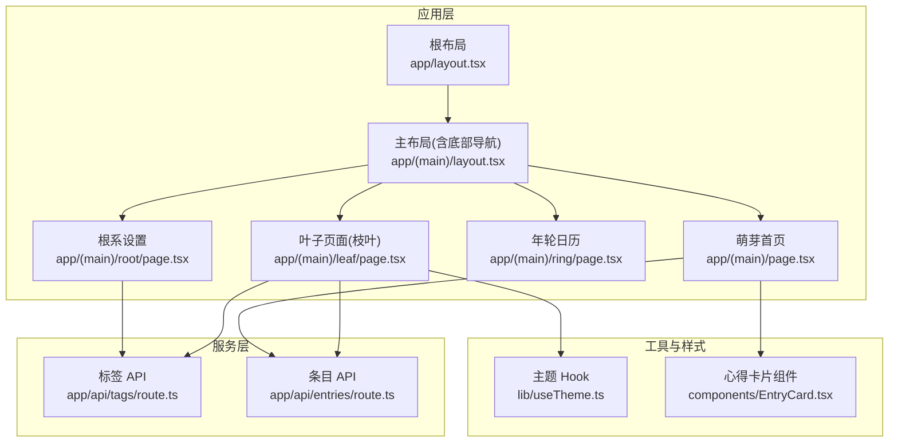
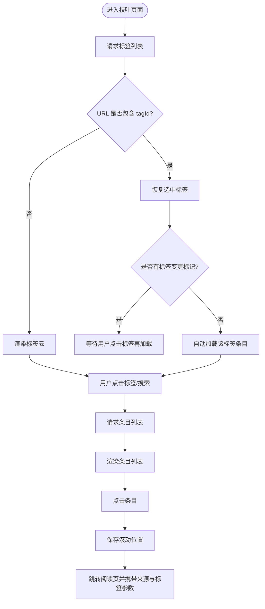
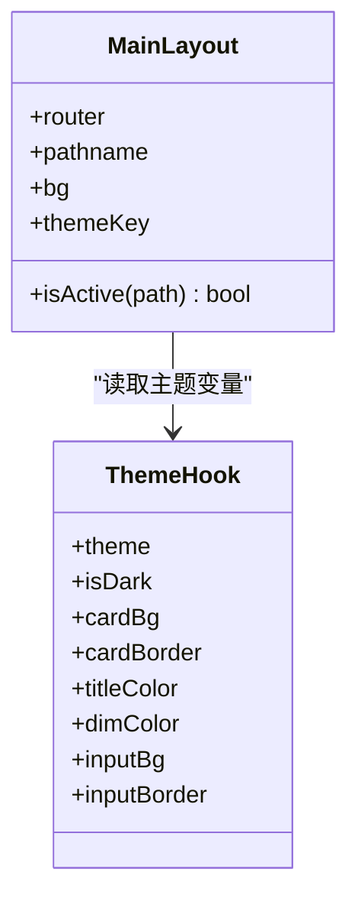
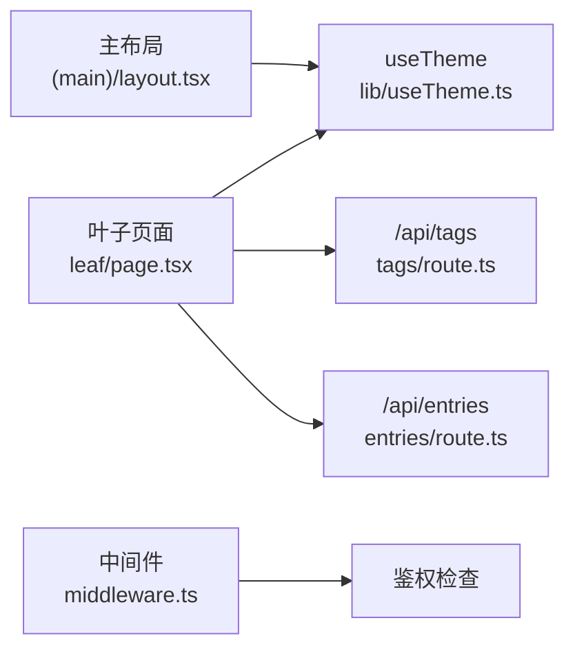

# 叶子页面导航增强

<cite>
**本文引用的文件列表**
- [app/(main)/leaf/page.tsx](file://app/(main)/leaf/page.tsx)
- [app/(main)/layout.tsx](file://app/(main)/layout.tsx)
- [app/layout.tsx](file://app/layout.tsx)
- [middleware.ts](file://middleware.ts)
- [app/(main)/page.tsx](file://app/(main)/page.tsx)
- [app/(main)/ring/page.tsx](file://app/(main)/ring/page.tsx)
- [app/(main)/root/page.tsx](file://app/(main)/root/page.tsx)
- [lib/useTheme.ts](file://lib/useTheme.ts)
- [components/EntryCard.tsx](file://components/EntryCard.tsx)
- [app/api/tags/route.ts](file://app/api/tags/route.ts)
- [app/api/entries/route.ts](file://app/api/entries/route.ts)
</cite>

## 目录
1. [简介](#简介)
2. [项目结构](#项目结构)
3. [核心组件](#核心组件)
4. [架构总览](#架构总览)
5. [详细组件分析](#详细组件分析)
6. [依赖关系分析](#依赖关系分析)
7. [性能考量](#性能考量)
8. [故障排查指南](#故障排查指南)
9. [结论](#结论)
10. [附录](#附录)

## 简介
本文件围绕“叶子页面（枝叶）”的导航增强进行系统化文档化，聚焦以下目标：
- 标签云与筛选体验优化
- 从编辑页返回后的滚动位置恢复
- URL 参数驱动的标签选择与数据加载
- 底部统一导航栏在各主模块中的行为一致性
- 主题切换对叶子页面的视觉影响

## 项目结构
本项目采用 Next.js App Router 组织页面与路由。主布局位于 app/(main)/layout.tsx，提供统一的底部导航；叶子页面位于 app/(main)/leaf/page.tsx，负责标签浏览与心得列表展示。根布局在 app/layout.tsx 中定义全局元信息与通知容器。中间件 middleware.ts 负责鉴权拦截。



图表来源
- [app/layout.tsx:1-43](file://app/layout.tsx#L1-L43)
- [app/(main)/layout.tsx:1-173](file://app/(main)/layout.tsx#L1-L173)
- [app/(main)/leaf/page.tsx:1-310](file://app/(main)/leaf/page.tsx#L1-L310)
- [app/(main)/page.tsx:1-405](file://app/(main)/page.tsx#L1-L405)
- [app/(main)/ring/page.tsx:1-338](file://app/(main)/ring/page.tsx#L1-L338)
- [app/(main)/root/page.tsx:1-718](file://app/(main)/root/page.tsx#L1-L718)
- [lib/useTheme.ts:1-30](file://lib/useTheme.ts#L1-L30)
- [components/EntryCard.tsx:1-138](file://components/EntryCard.tsx#L1-L138)
- [app/api/tags/route.ts:1-46](file://app/api/tags/route.ts#L1-L46)
- [app/api/entries/route.ts:1-163](file://app/api/entries/route.ts#L1-L163)

章节来源
- [app/layout.tsx:1-43](file://app/layout.tsx#L1-L43)
- [app/(main)/layout.tsx:1-173](file://app/(main)/layout.tsx#L1-L173)
- [app/(main)/leaf/page.tsx:1-310](file://app/(main)/leaf/page.tsx#L1-L310)

## 核心组件
- 叶子页面（枝叶）：实现标签云、搜索过滤、按标签加载心得列表、点击跳转至阅读页并携带来源与标签参数、滚动位置持久化与恢复。
- 主布局（底部导航）：提供萌芽、枝叶、新建、年轮、根系五个入口，当前路径高亮，支持主题色动态切换。
- 主题 Hook：集中管理明暗主题及常用颜色变量，供各页面复用。
- 条目卡片：用于萌芽页的心得展示，包含收藏、置顶、删除等交互。

章节来源
- [app/(main)/leaf/page.tsx:1-310](file://app/(main)/leaf/page.tsx#L1-L310)
- [app/(main)/layout.tsx:1-173](file://app/(main)/layout.tsx#L1-L173)
- [lib/useTheme.ts:1-30](file://lib/useTheme.ts#L1-L30)
- [components/EntryCard.tsx:1-138](file://components/EntryCard.tsx#L1-L138)

## 架构总览
叶子页面作为“枝叶”视图，承担标签浏览与条目筛选职责。其数据流如下：
- 初始化时请求标签列表，并按使用量排序
- 若 URL 存在 tagId，则尝试恢复选中标签并自动加载对应条目
- 用户点击标签或搜索后，更新本地状态并拉取条目
- 点击条目进入阅读页，同时保存滚动位置以便返回时恢复

```mermaid
sequenceDiagram
participant U as "用户"
participant L as "叶子页面<br/>app/(main)/leaf/page.tsx"
participant T as "标签API<br/>app/api/tags/route.ts"
participant E as "条目API<br/>app/api/entries/route.ts"
participant R as "路由/浏览器"
U->>L : 打开“枝叶”页面
L->>T : GET /api/tags
T-->>L : 返回标签列表
alt URL 含 tagId
L->>L : 解析 tagId 并选中标签
opt 标签有变更标记
L->>L : 不自动加载条目
else 未变更
L->>E : GET /api/entries?tagId=...&limit=50
E-->>L : 返回条目列表
end
end
U->>L : 点击标签
L->>E : GET /api/entries?tagId=...&limit=50
E-->>L : 返回条目列表
U->>L : 点击某条目
L->>R : router.push("/entry/{id}/view?from=leaf&tagId=...")
Note over L,R : 同时保存滚动位置到 sessionStorage
```

图表来源
- [app/(main)/leaf/page.tsx:1-310](file://app/(main)/leaf/page.tsx#L1-L310)
- [app/api/tags/route.ts:1-46](file://app/api/tags/route.ts#L1-L46)
- [app/api/entries/route.ts:1-163](file://app/api/entries/route.ts#L1-L163)

## 详细组件分析

### 叶子页面（枝叶）导航增强
- 标签云与搜索
  - 标签按 entryCount 降序排列，支持输入过滤
  - 根据使用量计算字号与权重，提升信息密度与可读性
- 标签选择与条目加载
  - 点击标签切换选中态，清空旧列表并重新拉取
  - 支持从 URL 恢复 tagId，结合 sessionStorage 的“标签变更”标记决定是否自动加载
- 滚动位置持久化
  - 监听滚动事件，节流写入 sessionStorage
  - 从编辑页返回时读取并恢复滚动位置
- 跳转与来源追踪
  - 点击条目跳转到阅读页，附带 from=leaf 与可选 tagId，便于上游上下文感知



图表来源
- [app/(main)/leaf/page.tsx:1-310](file://app/(main)/leaf/page.tsx#L1-L310)

章节来源
- [app/(main)/leaf/page.tsx:1-310](file://app/(main)/leaf/page.tsx#L1-L310)

### 底部导航与主题联动
- 导航项
  - 萌芽、枝叶、新建、年轮、根系五入口，当前路径高亮
  - 中央大按钮快速创建新条目
- 主题切换
  - 通过 URL 参数 theme 可临时覆盖主题，随后清理 URL
  - 监听 xinya-theme-change 事件同步主题状态
  - 背景、边框、激活色随主题变化平滑过渡



图表来源
- [app/(main)/layout.tsx:1-173](file://app/(main)/layout.tsx#L1-L173)
- [lib/useTheme.ts:1-30](file://lib/useTheme.ts#L1-L30)

章节来源
- [app/(main)/layout.tsx:1-173](file://app/(main)/layout.tsx#L1-L173)
- [lib/useTheme.ts:1-30](file://lib/useTheme.ts#L1-L30)

### 其他主模块导航一致性
- 萌芽页：提供搜索、收藏筛选、时间范围筛选，分页加载条目
- 年轮页：按月切换热力图，显示统计指标
- 根系页：账号、主题、标签管理、导出、拾遗开关、学习画像

章节来源
- [app/(main)/page.tsx:1-405](file://app/(main)/page.tsx#L1-L405)
- [app/(main)/ring/page.tsx:1-338](file://app/(main)/ring/page.tsx#L1-L338)
- [app/(main)/root/page.tsx:1-718](file://app/(main)/root/page.tsx#L1-L718)

## 依赖关系分析
- 叶子页面依赖
  - 主题 Hook：获取明暗主题与配色变量
  - 标签 API：获取标签列表与计数
  - 条目 API：按标签、搜索、时间范围等条件查询条目
- 主布局依赖
  - 路由与路径：控制导航高亮与跳转
  - 主题 Hook：驱动 UI 主题切换
- 鉴权中间件
  - 非公开页面需携带有效 token，否则重定向登录



图表来源
- [app/(main)/leaf/page.tsx:1-310](file://app/(main)/leaf/page.tsx#L1-L310)
- [lib/useTheme.ts:1-30](file://lib/useTheme.ts#L1-L30)
- [app/api/tags/route.ts:1-46](file://app/api/tags/route.ts#L1-L46)
- [app/api/entries/route.ts:1-163](file://app/api/entries/route.ts#L1-L163)
- [middleware.ts:1-29](file://middleware.ts#L1-L29)

章节来源
- [middleware.ts:1-29](file://middleware.ts#L1-L29)

## 性能考量
- 标签与条目请求分离：先拉取标签，再按需拉取条目，避免不必要的数据传输
- 列表分页与限制：默认 limit=50，减少首屏压力
- 滚动位置节流保存：降低频繁写入存储的性能损耗
- 主题切换平滑过渡：CSS transition 提升观感，避免闪烁

[本节为通用指导，无需源码引用]

## 故障排查指南
- 无法加载标签或条目
  - 检查鉴权中间件是否放行，确认 cookie 中存在有效 token
  - 查看网络面板是否返回 401 或业务错误码
- 从编辑页返回后滚动位置丢失
  - 确认 sessionStorage 中是否存在 leaf_scroll 键值
  - 检查是否在数据加载完成前执行了滚动恢复
- 标签变更后未自动刷新列表
  - 确认 sessionStorage 中 leaf_saved 的 tagChanged 标记是否正确设置与清除
- 主题切换无效
  - 检查 localStorage 中 xinya-theme 是否被正确写入
  - 确认 xinya-theme-change 事件是否触发并被监听

章节来源
- [middleware.ts:1-29](file://middleware.ts#L1-L29)
- [app/(main)/leaf/page.tsx:1-310](file://app/(main)/leaf/page.tsx#L1-L310)
- [lib/useTheme.ts:1-30](file://lib/useTheme.ts#L1-L30)

## 结论
通过对叶子页面的导航增强，用户在“枝叶”模块中获得更直观的标签浏览体验、更稳定的上下文恢复能力以及一致的底部导航与主题表现。整体架构清晰、依赖明确，具备良好的可扩展性与维护性。

[本节为总结性内容，无需源码引用]

## 附录
- 相关接口说明
  - GET /api/tags：返回当前用户的标签列表与条目计数
  - GET /api/entries：支持搜索、收藏、标签、时间范围、分页等筛选条件

章节来源
- [app/api/tags/route.ts:1-46](file://app/api/tags/route.ts#L1-L46)
- [app/api/entries/route.ts:1-163](file://app/api/entries/route.ts#L1-L163)