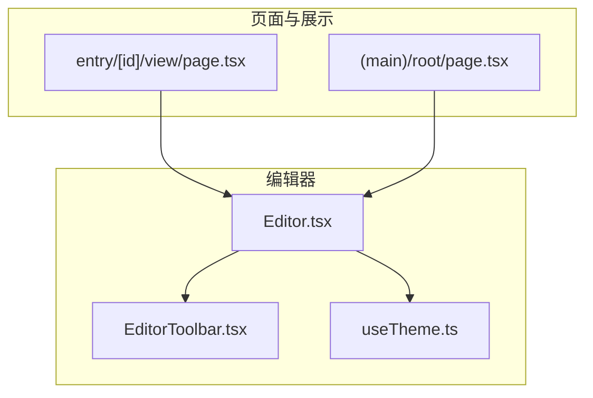
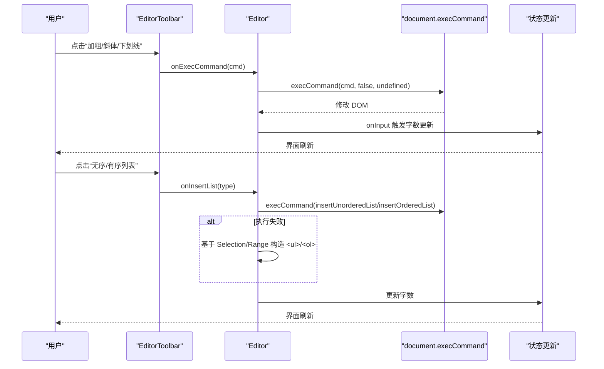
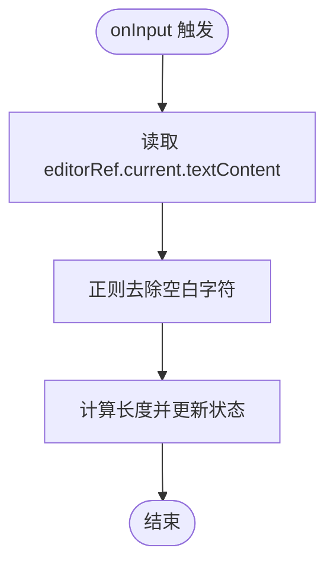
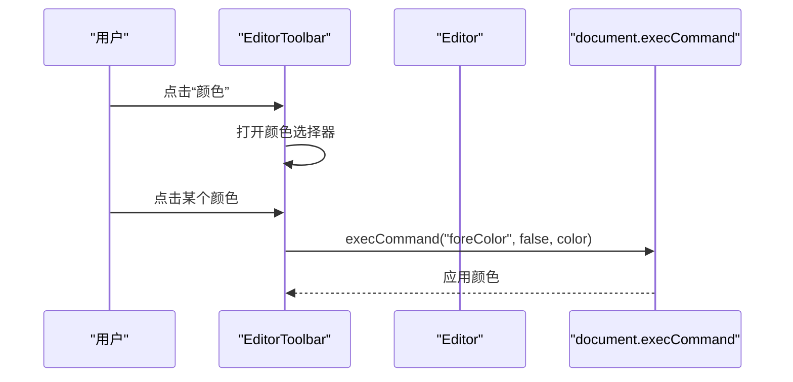
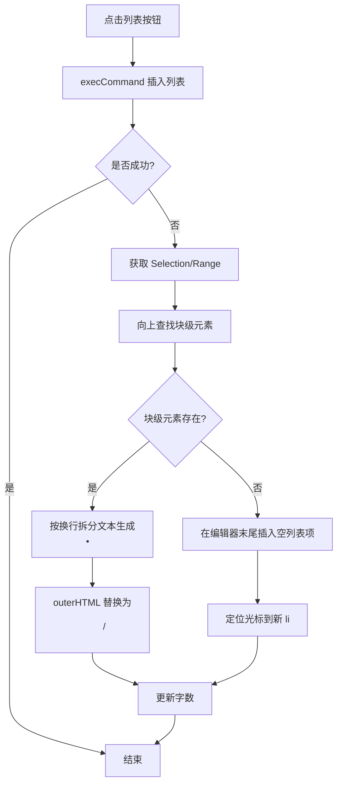
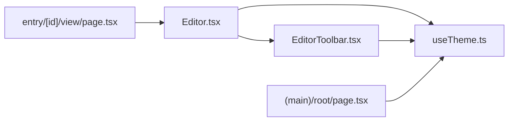

# 富文本编辑器

<cite>
**本文引用的文件**   
- [components/Editor.tsx](file://components/Editor.tsx)
- [components/EditorToolbar.tsx](file://components/EditorToolbar.tsx)
- [lib/useTheme.ts](file://lib/useTheme.ts)
- [doc/心芽富文本文字编辑规范.md](file://doc/心芽富文本文字编辑规范.md)
- [app/(main)/root/page.tsx](file://app/(main)/root/page.tsx)
- [app/entry/[id]/view/page.tsx](file://app/entry/[id]/view/page.tsx)
</cite>

## 目录
1. [简介](#简介)
2. [项目结构](#项目结构)
3. [核心组件](#核心组件)
4. [架构总览](#架构总览)
5. [详细组件分析](#详细组件分析)
6. [依赖关系分析](#依赖关系分析)
7. [性能与移动端适配](#性能与移动端适配)
8. [主题集成与样式定制](#主题集成与样式定制)
9. [故障排查指南](#故障排查指南)
10. [结论](#结论)

## 简介
本技术文档围绕“心芽”的富文本编辑器，系统性梳理其基于 contentEditable 的实现方案、DOM 操作与事件处理、状态管理、自定义工具栏（文本格式化、列表插入、粘贴处理）、焦点模式、字符计数与内容验证、移动端适配与性能优化策略、主题集成与样式定制，以及与 React 组件的状态同步和数据绑定。文档同时结合仓库中的实现与规范说明，帮助读者快速理解并扩展该编辑器。

## 项目结构
编辑器由两个核心客户端组件构成：
- Editor：承载正文编辑区、标题输入、标签选择、心情选择、保存逻辑、焦点模式等
- EditorToolbar：提供加粗、斜体、下划线、列表、颜色选择、标签面板开关、专注模式切换、字数统计等工具栏能力

图表来源
- [components/Editor.tsx:1-192](file://components/Editor.tsx#L1-L192)
- [components/EditorToolbar.tsx:1-78](file://components/EditorToolbar.tsx#L1-L78)
- [lib/useTheme.ts:1-29](file://lib/useTheme.ts#L1-L29)
- [app/entry/[id]/view/page.tsx:230-244](file://app/entry/[id]/view/page.tsx#L230-L244)
- [app/(main)/root/page.tsx:362-393](file://app/(main)/root/page.tsx#L362-L393)

章节来源
- [components/Editor.tsx:1-192](file://components/Editor.tsx#L1-L192)
- [components/EditorToolbar.tsx:1-78](file://components/EditorToolbar.tsx#L1-L78)
- [lib/useTheme.ts:1-29](file://lib/useTheme.ts#L1-L29)

## 核心组件
- Editor
  - 使用 useRef 获取 contentEditable 容器引用
  - 通过 onInput 计算纯文本字数（去除 HTML 标签与空白）
  - 监听 paste 事件，拦截并仅插入纯文本，避免外部格式污染
  - 封装 execCommand 调用，统一触发格式化命令
  - 自定义列表插入逻辑，兼容浏览器不支持或执行失败场景
  - 支持焦点模式（隐藏工具栏与标签面板，放大编辑区域）
  - 从 API 加载已有心得数据，初始化标题、内容、心情与标签
  - 保存时提交 title、content、mood、tagIds 等字段
- EditorToolbar
  - 提供加粗、斜体、下划线、无序/有序列表、文字颜色、标签面板、专注模式按钮
  - 颜色选择器以绝对定位弹出，点击色块直接应用 foreColor
  - 显示实时字数统计
  - 根据 isDark 动态调整背景、边框、图标颜色等

章节来源
- [components/Editor.tsx:60-113](file://components/Editor.tsx#L60-L113)
- [components/Editor.tsx:115-124](file://components/Editor.tsx#L115-L124)
- [components/EditorToolbar.tsx:51-73](file://components/EditorToolbar.tsx#L51-L73)

## 架构总览
编辑器采用“轻量级 DOM 驱动 + React 状态”的混合模式：
- 编辑区为原生 contentEditable，所有格式化通过 document.execCommand 完成
- React 负责 UI 状态（标题、心情、标签、焦点模式、保存中状态、字数等）
- 工具栏通过回调将用户操作下发到 Editor，再由 Editor 对 DOM 执行命令
- 主题通过 useTheme 暴露变量，Editor 与 EditorToolbar 均消费这些变量进行渲染

图表来源
- [components/EditorToolbar.tsx:51-73](file://components/EditorToolbar.tsx#L51-L73)
- [components/Editor.tsx:69-113](file://components/Editor.tsx#L69-L113)

## 详细组件分析

### 编辑器容器与 DOM 操作
- 使用 ref 指向 contentEditable 容器，避免在 React 受控模式下频繁覆盖 innerHTML 导致光标丢失
- 通过 onInput 读取 textContent 并过滤空白，得到纯文本字数
- 通过 onPaste 阻止默认行为，仅插入纯文本，避免粘贴带样式的 HTML 污染编辑器

图表来源
- [components/Editor.tsx:60-62](file://components/Editor.tsx#L60-L62)

章节来源
- [components/Editor.tsx:60-67](file://components/Editor.tsx#L60-L67)

### 文本格式化与颜色选择
- 工具栏按钮通过 onMouseDown 阻止默认行为，避免失去焦点后选区丢失
- 调用 handleExecCommand 执行 bold/italic/underline 等命令
- 颜色选择器点击色块后直接调用 foreColor 命令，无需额外状态

图表来源
- [components/EditorToolbar.tsx:51-73](file://components/EditorToolbar.tsx#L51-L73)
- [components/Editor.tsx:69-71](file://components/Editor.tsx#L69-L71)

章节来源
- [components/EditorToolbar.tsx:51-73](file://components/EditorToolbar.tsx#L51-L73)
- [components/Editor.tsx:69-71](file://components/Editor.tsx#L69-L71)

### 列表插入与兼容性处理
- 优先尝试 execCommand 插入列表；若返回失败，则基于当前 Selection/Range 向上查找块级元素，按行拆分生成 <ul>/<ol> 并替换 outerHTML
- 若无选中块，则在编辑器末尾追加空列表项，并将光标定位到新列表项内

图表来源
- [components/Editor.tsx:73-113](file://components/Editor.tsx#L73-L113)

章节来源
- [components/Editor.tsx:73-113](file://components/Editor.tsx#L73-L113)

### 粘贴处理
- 拦截 paste 事件，阻止默认行为
- 从剪贴板读取纯文本，再使用 insertText 命令插入，确保不引入外部样式

章节来源
- [components/Editor.tsx:64-67](file://components/Editor.tsx#L64-L67)

### 焦点模式与用户体验优化
- 进入焦点模式后隐藏工具栏与标签面板，增大编辑区域高度，并在右上角提供退出按钮
- 底部固定保存按钮便于单手操作
- 标题与正文分离，标题独立 input，避免富文本干扰

章节来源
- [components/Editor.tsx:138-182](file://components/Editor.tsx#L138-L182)

### 字符计数与内容验证
- 字数统计：每次 onInput 时读取 textContent，去除空白后计算长度
- 保存校验：标题为空时提示错误并中止保存

章节来源
- [components/Editor.tsx:60-62](file://components/Editor.tsx#L60-L62)
- [components/Editor.tsx:115-117](file://components/Editor.tsx#L115-L117)

### 与后端的数据交互
- 新建/编辑：POST /api/entries 或 PUT /api/entries/:id，提交 title、content、mood、tagIds
- 加载已有条目：GET /api/entries/:id，回填标题、内容、心情、标签
- 标签管理：GET /api/tags 拉取全部标签，POST /api/tags 创建新标签

章节来源
- [components/Editor.tsx:37-52](file://components/Editor.tsx#L37-L52)
- [components/Editor.tsx:115-135](file://components/Editor.tsx#L115-L135)

## 依赖关系分析
- Editor 依赖 EditorToolbar 提供工具栏交互
- Editor 与 EditorToolbar 共同依赖 useTheme 提供的主题变量（isDark、titleColor、inputBg、inputBorder 等）
- 视图页 entry/[id]/view/page.tsx 复用相同的列表样式规则，保证编辑与展示一致
- (main)/root/page.tsx 提供主题切换入口，通过全局事件同步主题状态

图表来源
- [components/Editor.tsx:1-192](file://components/Editor.tsx#L1-L192)
- [components/EditorToolbar.tsx:1-78](file://components/EditorToolbar.tsx#L1-L78)
- [lib/useTheme.ts:1-29](file://lib/useTheme.ts#L1-L29)
- [app/entry/[id]/view/page.tsx:230-244](file://app/entry/[id]/view/page.tsx#L230-L244)
- [app/(main)/root/page.tsx:362-393](file://app/(main)/root/page.tsx#L362-L393)

章节来源
- [components/Editor.tsx:1-192](file://components/Editor.tsx#L1-L192)
- [components/EditorToolbar.tsx:1-78](file://components/EditorToolbar.tsx#L1-L78)
- [lib/useTheme.ts:1-29](file://lib/useTheme.ts#L1-L29)
- [app/entry/[id]/view/page.tsx:230-244](file://app/entry/[id]/view/page.tsx#L230-L244)
- [app/(main)/root/page.tsx:362-393](file://app/(main)/root/page.tsx#L362-L393)

## 性能与移动端适配
- 性能要点
  - 使用 contentEditable 原生能力，避免重型富文本库带来的体积与复杂度
  - 字数统计仅在 onInput 时执行，且只做简单字符串处理，开销极低
  - 列表插入失败时的降级路径基于 Range/Selection，减少不必要的重排
- 移动端适配
  - 工具栏横向滚动（overflow-x-auto），按钮尺寸满足触摸友好
  - 焦点模式提升书写沉浸感，底部固定保存按钮便于单手操作
  - 列表样式在编辑与查看端保持一致，避免视觉差异

章节来源
- [components/EditorToolbar.tsx:51-62](file://components/EditorToolbar.tsx#L51-L62)
- [components/Editor.tsx:138-182](file://components/Editor.tsx#L138-L182)
- [app/entry/[id]/view/page.tsx:230-244](file://app/entry/[id]/view/page.tsx#L230-L244)

## 主题集成与样式定制
- 主题变量
  - useTheme 提供 isDark、titleColor、inputBg、inputBorder 等变量
  - Editor 与 EditorToolbar 根据 isDark 动态设置背景、边框、图标颜色
- 主题切换
  - 根页面提供主题选择，切换后通过自定义事件通知各组件同步更新
- 样式一致性
  - 编辑与查看端统一 ul/ol/li 样式，确保所见即所得

章节来源
- [lib/useTheme.ts:1-29](file://lib/useTheme.ts#L1-L29)
- [components/Editor.tsx:138-182](file://components/Editor.tsx#L138-L182)
- [components/EditorToolbar.tsx:26-31](file://components/EditorToolbar.tsx#L26-L31)
- [app/(main)/root/page.tsx:362-393](file://app/(main)/root/page.tsx#L362-L393)
- [app/entry/[id]/view/page.tsx:230-244](file://app/entry/[id]/view/page.tsx#L230-L244)

## 故障排查指南
- 常见问题与解决方案（参考规范文档）
  - execCommand 执行了但看不到效果：检查是否为 ul/ol/li 补充了 CSS 样式
  - 点击工具栏按钮后光标位置丢失：确保在执行命令后恢复编辑器焦点
  - 粘贴外部内容格式混乱：拦截 paste，仅插入纯文本
  - execCommand 废弃警告：在当前需求下仍为最实用方案，必要时可考虑基于 Selection/Range 的手动 DOM 操作
- 主题刷新失效问题
  - SSR hydration 导致的初始值不一致：避免在 useState 初始化时读取 localStorage，改用 useEffect 同步
  - 事件监听器未生效：确认 window 事件已正确注册与移除

章节来源
- [doc/心芽富文本文字编辑规范.md:192-214](file://doc/心芽富文本文字编辑规范.md#L192-L214)

## 结论
该富文本编辑器以 contentEditable 为核心，配合 React 状态管理与轻量工具栏，实现了简洁高效的编辑体验。通过统一的 execCommand 封装、粘贴净化、列表插入降级、焦点模式与主题变量，兼顾了功能完整性与用户体验。后续如需扩展复杂功能（如图片、表格、撤销重做增强），可在现有架构上平滑演进。