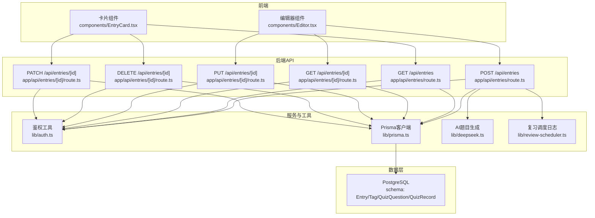
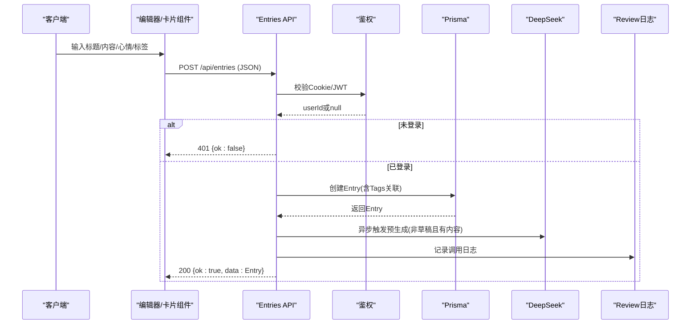
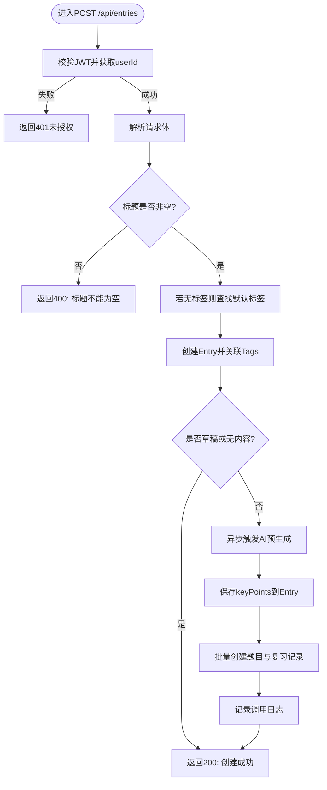
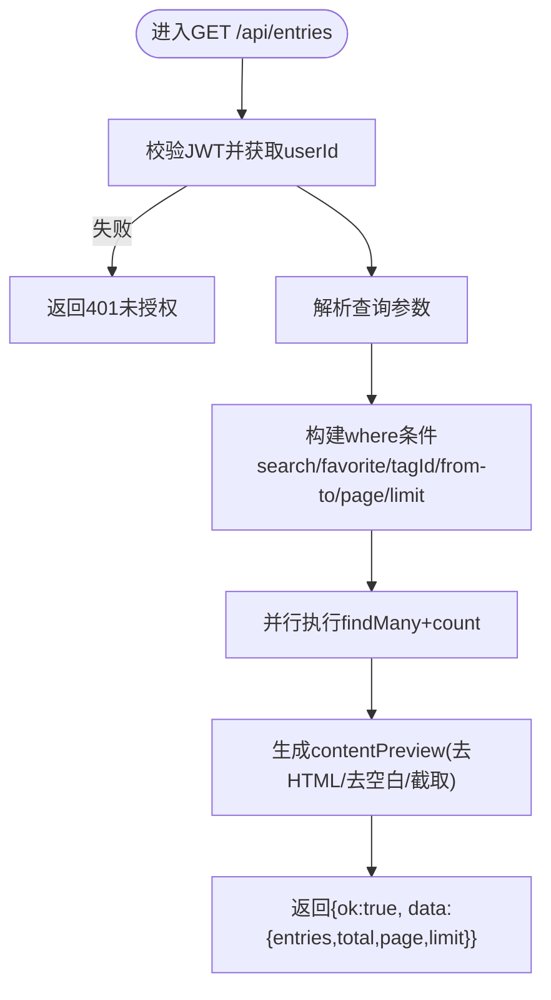
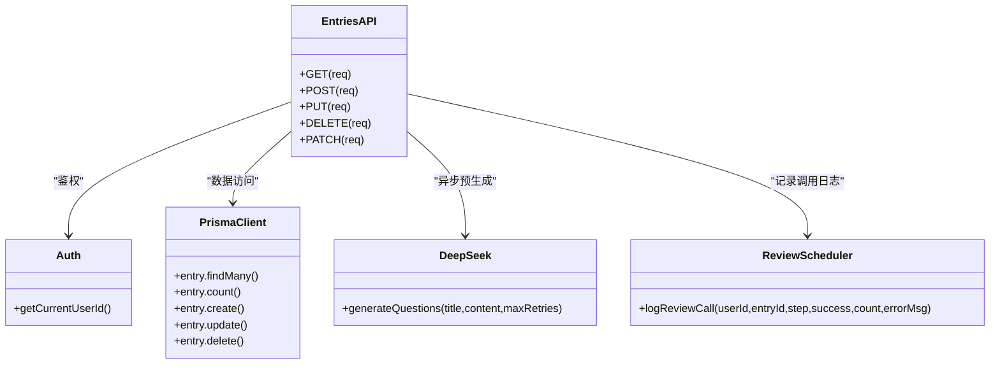

# 心得CRUD操作

<cite>
**本文引用的文件**
- [app/api/entries/route.ts](file://app/api/entries/route.ts)
- [app/api/entries/[id]/route.ts](file://app/api/entries/[id]/route.ts)
- [prisma/schema.prisma](file://prisma/schema.prisma)
- [lib/prisma.ts](file://lib/prisma.ts)
- [lib/auth.ts](file://lib/auth.ts)
- [types/index.ts](file://types/index.ts)
- [components/EntryCard.tsx](file://components/EntryCard.tsx)
- [components/Editor.tsx](file://components/Editor.tsx)
- [lib/deepseek.ts](file://lib/deepseek.ts)
- [lib/review-scheduler.ts](file://lib/review-scheduler.ts)
</cite>

## 目录
1. [简介](#简介)
2. [项目结构](#项目结构)
3. [核心组件](#核心组件)
4. [架构总览](#架构总览)
5. [详细组件分析](#详细组件分析)
6. [依赖关系分析](#依赖关系分析)
7. [性能考量](#性能考量)
8. [故障排查指南](#故障排查指南)
9. [结论](#结论)
10. [附录：API定义与示例](#附录api定义与示例)

## 简介
本文件为“心芽”应用的心得（Entry）模块的API文档，覆盖创建、查询、更新、删除等完整CRUD能力，并详细说明数据验证、内容处理、错误处理、权限控制、过滤与分页、以及AI预生成题目的异步流程。同时提供请求/响应示例与错误码说明，便于前后端协同开发与排障。

## 项目结构
心得相关API位于Next.js App Router的API路由中，使用Prisma作为ORM访问PostgreSQL数据库，鉴权通过JWT Cookie完成。前端通过客户端组件调用这些API进行增删改查与筛选。

图表来源
- [app/api/entries/route.ts:1-163](file://app/api/entries/route.ts#L1-L163)
- [app/api/entries/[id]/route.ts:1-95](file://app/api/entries/[id]/route.ts#L1-L95)
- [lib/auth.ts:1-56](file://lib/auth.ts#L1-L56)
- [lib/prisma.ts:1-14](file://lib/prisma.ts#L1-L14)
- [lib/deepseek.ts:1-115](file://lib/deepseek.ts#L1-L115)
- [lib/review-scheduler.ts:1-225](file://lib/review-scheduler.ts#L1-L225)
- [prisma/schema.prisma:33-69](file://prisma/schema.prisma#L33-L69)

章节来源
- [app/api/entries/route.ts:1-163](file://app/api/entries/route.ts#L1-L163)
- [app/api/entries/[id]/route.ts:1-95](file://app/api/entries/[id]/route.ts#L1-L95)
- [lib/auth.ts:1-56](file://lib/auth.ts#L1-L56)
- [lib/prisma.ts:1-14](file://lib/prisma.ts#L1-L14)
- [prisma/schema.prisma:33-69](file://prisma/schema.prisma#L33-L69)

## 核心组件
- 鉴权中间逻辑：从Cookie读取JWT并解析出userId，未登录返回401。
- 数据模型：Entry、Tag、QuizQuestion、QuizRecord等，包含索引优化与级联删除。
- AI预生成：非草稿且含内容的条目在创建后异步触发DeepSeek生成题目与要点，并记录调用日志。
- 列表查询：支持搜索、收藏、标签、时间范围、分页排序。
- 详情获取：按用户隔离，返回富文本与预览。
- 更新接口：全量更新与增量更新（置顶/收藏）。
- 删除接口：硬删除（当前实现），无软删除字段。

章节来源
- [lib/auth.ts:32-43](file://lib/auth.ts#L32-L43)
- [prisma/schema.prisma:33-69](file://prisma/schema.prisma#L33-L69)
- [app/api/entries/route.ts:66-106](file://app/api/entries/route.ts#L66-L106)
- [app/api/entries/route.ts:8-63](file://app/api/entries/route.ts#L8-L63)
- [app/api/entries/[id]/route.ts:34-94](file://app/api/entries/[id]/route.ts#L34-L94)

## 架构总览
下图展示了心得CRUD的关键调用链路与数据流向。

图表来源
- [app/api/entries/route.ts:66-106](file://app/api/entries/route.ts#L66-L106)
- [lib/auth.ts:32-43](file://lib/auth.ts#L32-L43)
- [lib/deepseek.ts:17-115](file://lib/deepseek.ts#L17-L115)
- [lib/review-scheduler.ts:4-29](file://lib/review-scheduler.ts#L4-L29)

## 详细组件分析

### 创建心得（POST /api/entries）
- 鉴权：必须携带有效JWT Cookie，否则返回401。
- 参数校验：
  - 必填：title（去除首尾空白后非空）。
  - 可选：content、mood、tagIds、isDraft。
- 默认标签：若未选择标签，则自动关联该用户的默认标签（isDefault=true）。
- 数据写入：
  - 新建Entry，并建立与Tag的多对多连接。
  - 返回包含tags的Entry对象。
- 异步预生成：
  - 仅当isDraft=false且content存在时触发。
  - 调用DeepSeek生成题目与要点；成功后将keyPoints写回Entry，并为每个问题创建QuizQuestion与QuizRecord，初始答错状态与下次复习时间为次日。
  - 无论成功与否均记录ReviewCallLog。
- 错误处理：
  - 未登录：401。
  - 标题为空：400，返回错误消息。
  - 其他异常：由框架统一处理，建议前端捕获提示。

图表来源
- [app/api/entries/route.ts:66-106](file://app/api/entries/route.ts#L66-L106)
- [app/api/entries/route.ts:109-161](file://app/api/entries/route.ts#L109-L161)
- [lib/deepseek.ts:17-115](file://lib/deepseek.ts#L17-L115)
- [lib/review-scheduler.ts:4-29](file://lib/review-scheduler.ts#L4-L29)

章节来源
- [app/api/entries/route.ts:66-106](file://app/api/entries/route.ts#L66-L106)
- [app/api/entries/route.ts:109-161](file://app/api/entries/route.ts#L109-L161)
- [lib/deepseek.ts:17-115](file://lib/deepseek.ts#L17-L115)
- [lib/review-scheduler.ts:4-29](file://lib/review-scheduler.ts#L4-L29)

### 查询心得列表（GET /api/entries）
- 鉴权：必须登录。
- 查询参数：
  - search：模糊匹配标题或内容（不区分大小写）。
  - favorite：true/false，仅返回收藏项。
  - tagId：按标签筛选。
  - from/to：按recordTime范围筛选（to包含当天结束）。
  - page：页码，最小为1。
  - limit：每页数量，限制在[1, 1000]。
- 返回结构：
  - entries：列表项，包含id、title、contentPreview（纯文本前80字）、tags、mood、recordTime、isTop、isFavorite、isDraft。
  - total：总数。
  - page、limit：分页信息。
- 排序：置顶优先，其次按记录时间倒序。
- 权限与过滤：
  - 强制按userId过滤，确保数据隔离。
  - 默认排除草稿（isDraft=false）。

图表来源
- [app/api/entries/route.ts:8-63](file://app/api/entries/route.ts#L8-L63)

章节来源
- [app/api/entries/route.ts:8-63](file://app/api/entries/route.ts#L8-L63)

### 查看单条心得（GET /api/entries/[id]）
- 鉴权：必须登录。
- 路径参数：id。
- 权限控制：仅允许访问属于当前userId的条目。
- 返回：
  - id、title、content（富文本）、contentPreview（纯文本前80字）、tags、mood、recordTime、isTop、isFavorite、isDraft。
- 未找到：返回404与错误消息。

章节来源
- [app/api/entries/[id]/route.ts:6-32](file://app/api/entries/[id]/route.ts#L6-L32)

### 更新心得（PUT /api/entries/[id]）
- 鉴权：必须登录。
- 参数校验：title必填（去除空白后非空）。
- 更新策略：
  - 全量更新：title、content、mood、isDraft。
  - 标签替换：使用set语义完全替换当前标签集合。
  - 若未选择标签，则自动关联默认标签。
- 返回：更新后的Entry（含tags）。
- 错误处理：
  - 未登录：401。
  - 标题为空：400。

章节来源
- [app/api/entries/[id]/route.ts:34-64](file://app/api/entries/[id]/route.ts#L34-L64)

### 部分更新（PATCH /api/entries/[id]）
- 用途：仅更新置顶/收藏状态。
- 白名单字段：isTop、isFavorite。
- 权限：仅允许更新当前用户拥有的条目。
- 返回：更新后的Entry（含tags）。

章节来源
- [app/api/entries/[id]/route.ts:76-94](file://app/api/entries/[id]/route.ts#L76-L94)

### 删除心得（DELETE /api/entries/[id]）
- 鉴权：必须登录。
- 行为：根据id与userId删除条目（硬删除）。
- 注意：当前未实现软删除字段，如需保留历史可考虑引入deletedAt并在查询中过滤。

章节来源
- [app/api/entries/[id]/route.ts:66-74](file://app/api/entries/[id]/route.ts#L66-L74)

### 前端交互与权限控制
- 编辑器组件负责创建与编辑，提交JSON至对应API，并根据响应提示结果。
- 卡片组件支持收藏切换与删除确认，收藏切换通过PATCH接口完成。
- 所有API调用均需携带Cookie中的JWT，未登录将被拒绝。

章节来源
- [components/Editor.tsx:115-124](file://components/Editor.tsx#L115-L124)
- [components/EntryCard.tsx:48-62](file://components/EntryCard.tsx#L48-L62)
- [lib/auth.ts:32-43](file://lib/auth.ts#L32-L43)

## 依赖关系分析
- 模块耦合：
  - Entries API强依赖鉴权与Prisma客户端。
  - 创建流程额外依赖AI生成与日志记录。
- 外部依赖：
  - DeepSeek API用于生成题目与要点。
  - PostgreSQL数据库存储业务数据。
- 潜在风险：
  - 外部AI服务超时或返回异常需重试与降级策略。
  - 大量并发创建可能触发AI限流，建议增加队列或退避。

图表来源
- [app/api/entries/route.ts:1-163](file://app/api/entries/route.ts#L1-L163)
- [app/api/entries/[id]/route.ts:1-95](file://app/api/entries/[id]/route.ts#L1-L95)
- [lib/auth.ts:1-56](file://lib/auth.ts#L1-L56)
- [lib/prisma.ts:1-14](file://lib/prisma.ts#L1-L14)
- [lib/deepseek.ts:1-115](file://lib/deepseek.ts#L1-L115)
- [lib/review-scheduler.ts:1-225](file://lib/review-scheduler.ts#L1-L225)

章节来源
- [app/api/entries/route.ts:1-163](file://app/api/entries/route.ts#L1-L163)
- [app/api/entries/[id]/route.ts:1-95](file://app/api/entries/[id]/route.ts#L1-L95)
- [lib/auth.ts:1-56](file://lib/auth.ts#L1-L56)
- [lib/prisma.ts:1-14](file://lib/prisma.ts#L1-L14)
- [lib/deepseek.ts:1-115](file://lib/deepseek.ts#L1-L115)
- [lib/review-scheduler.ts:1-225](file://lib/review-scheduler.ts#L1-L225)

## 性能考量
- 列表查询并行化：使用Promise.all并行执行findMany与count，降低RT。
- 索引优化：
  - Entry表针对userId+recordTime、userId+isTop、userId+isFavorite建立索引，提升常见查询效率。
- 分页与上限：
  - limit最大1000，避免一次性拉取过多数据。
- 预览生成：
  - contentPreview在前端渲染时也可计算，但后端已提供轻量版，减少前端负担。
- 异步任务：
  - AI预生成不阻塞主响应，避免影响用户体验。

章节来源
- [app/api/entries/route.ts:38-47](file://app/api/entries/route.ts#L38-L47)
- [prisma/schema.prisma:51-54](file://prisma/schema.prisma#L51-L54)

## 故障排查指南
- 401未授权：
  - 检查Cookie中是否存在有效的xinya_token，且JWT未过期。
- 400标题为空：
  - 前端需在保存前校验标题非空。
- 404未找到：
  - 确认传入的id存在且属于当前用户。
- AI预生成失败：
  - 查看ReviewCallLog记录，定位step与errorMsg。
  - 检查DeepSeek API Key与网络连通性。
- 标签未生效：
  - 确认tagIds是否为空数组或未传；若为空将尝试使用默认标签。

章节来源
- [app/api/entries/route.ts:66-106](file://app/api/entries/route.ts#L66-L106)
- [app/api/entries/[id]/route.ts:6-32](file://app/api/entries/[id]/route.ts#L6-L32)
- [lib/review-scheduler.ts:4-29](file://lib/review-scheduler.ts#L4-L29)

## 结论
心得CRUD接口实现了完整的鉴权、数据验证、内容处理与错误处理机制。列表查询具备灵活的筛选与分页能力，更新接口支持全量与增量两种模式。当前删除为硬删除，如需审计或恢复能力，建议引入软删除字段与相应查询过滤。AI预生成功能提升了复习体验，但应关注外部服务稳定性与限流策略。

## 附录：API定义与示例

### 通用约定
- 认证：通过Cookie中的JWT（名称：xinya_token）传递身份。
- 响应格式：
  - ok：布尔值，表示是否成功。
  - data：成功时的数据。
  - error：失败时的错误消息。
- 状态码：
  - 200：成功。
  - 400：请求参数错误。
  - 401：未登录或令牌无效。
  - 404：资源不存在。

章节来源
- [types/index.ts:42-47](file://types/index.ts#L42-L47)
- [lib/auth.ts:32-43](file://lib/auth.ts#L32-L43)

### GET /api/entries
- 功能：分页查询心得列表，支持搜索、收藏、标签、时间范围过滤。
- 查询参数：
  - search：字符串，模糊匹配标题或内容。
  - favorite：true/false。
  - tagId：字符串，标签ID。
  - from：ISO日期字符串，起始时间。
  - to：ISO日期字符串，结束时间（包含当天）。
  - page：整数，页码，最小1。
  - limit：整数，每页数量，范围[1, 1000]。
- 成功响应示例：
  - 200 { ok: true, data: { entries: [...], total: 123, page: 1, limit: 20 } }
- 错误响应示例：
  - 401 { ok: false }

章节来源
- [app/api/entries/route.ts:8-63](file://app/api/entries/route.ts#L8-L63)

### POST /api/entries
- 功能：创建心得。
- 请求体字段：
  - title：字符串，必填。
  - content：字符串，可选（富文本HTML）。
  - mood：枚举或null，可选。
  - tagIds：字符串数组，可选。
  - isDraft：布尔，可选。
- 成功响应示例：
  - 200 { ok: true, data: { id, title, content, tags:[...], mood, recordTime, isTop, isFavorite, isDraft } }
- 错误响应示例：
  - 400 { ok: false, error: "标题不能为空" }
  - 401 { ok: false }

章节来源
- [app/api/entries/route.ts:66-106](file://app/api/entries/route.ts#L66-L106)

### GET /api/entries/[id]
- 功能：获取单条心得详情。
- 路径参数：id（字符串）。
- 成功响应示例：
  - 200 { ok: true, data: { id, title, content, contentPreview, tags:[...], mood, recordTime, isTop, isFavorite, isDraft } }
- 错误响应示例：
  - 401 { ok: false }
  - 404 { ok: false, error: "未找到该心得" }

章节来源
- [app/api/entries/[id]/route.ts:6-32](file://app/api/entries/[id]/route.ts#L6-L32)

### PUT /api/entries/[id]
- 功能：全量更新心得。
- 路径参数：id（字符串）。
- 请求体字段：
  - title：字符串，必填。
  - content：字符串，可选。
  - mood：枚举或null，可选。
  - tagIds：字符串数组，可选（使用set语义替换）。
  - isDraft：布尔，可选。
- 成功响应示例：
  - 200 { ok: true, data: { ... } }
- 错误响应示例：
  - 400 { ok: false, error: "标题不能为空" }
  - 401 { ok: false }

章节来源
- [app/api/entries/[id]/route.ts:34-64](file://app/api/entries/[id]/route.ts#L34-L64)

### PATCH /api/entries/[id]
- 功能：部分更新（置顶/收藏）。
- 路径参数：id（字符串）。
- 请求体字段：
  - isTop：布尔，可选。
  - isFavorite：布尔，可选。
- 成功响应示例：
  - 200 { ok: true, data: { ... } }
- 错误响应示例：
  - 401 { ok: false }

章节来源
- [app/api/entries/[id]/route.ts:76-94](file://app/api/entries/[id]/route.ts#L76-L94)

### DELETE /api/entries/[id]
- 功能：删除心得（硬删除）。
- 路径参数：id（字符串）。
- 成功响应示例：
  - 200 { ok: true }
- 错误响应示例：
  - 401 { ok: false }

章节来源
- [app/api/entries/[id]/route.ts:66-74](file://app/api/entries/[id]/route.ts#L66-L74)

### 文件上传与图片处理
- 当前API未实现文件上传与图片处理。如需支持附件或图片，可在后续版本扩展Multipart表单上传与对象存储服务集成。

### 批量操作与搜索筛选
- 批量操作：当前未提供批量创建/更新/删除接口。可通过循环调用单条接口实现，但需注意幂等性与错误处理。
- 搜索筛选：
  - 支持关键词搜索（标题/内容）。
  - 支持收藏筛选、标签筛选、时间范围筛选。
  - 支持分页与排序（置顶优先、时间倒序）。

章节来源
- [app/api/entries/route.ts:8-63](file://app/api/entries/route.ts#L8-L63)