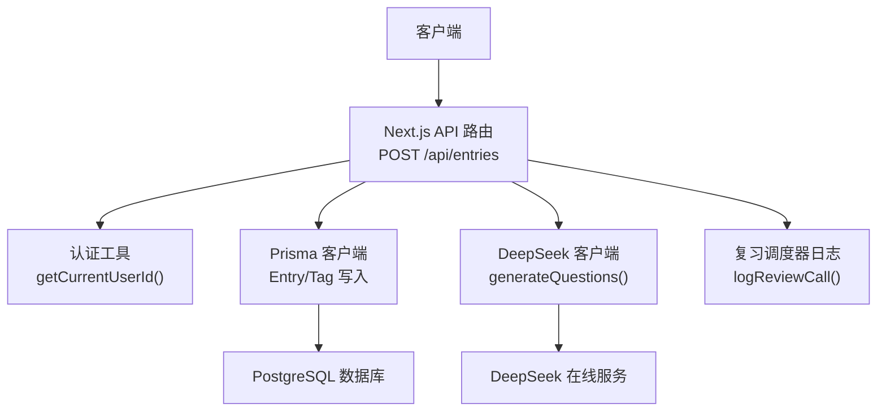
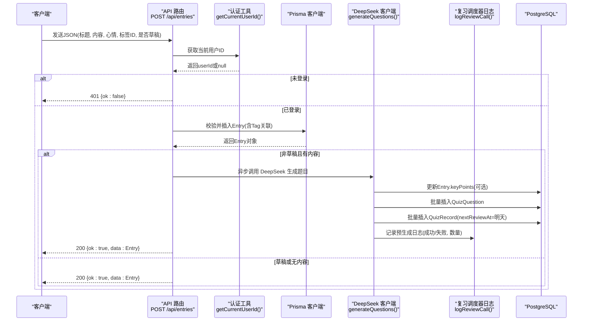
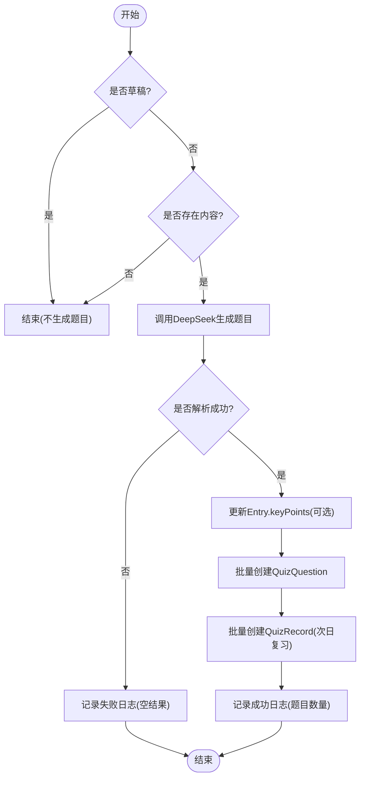
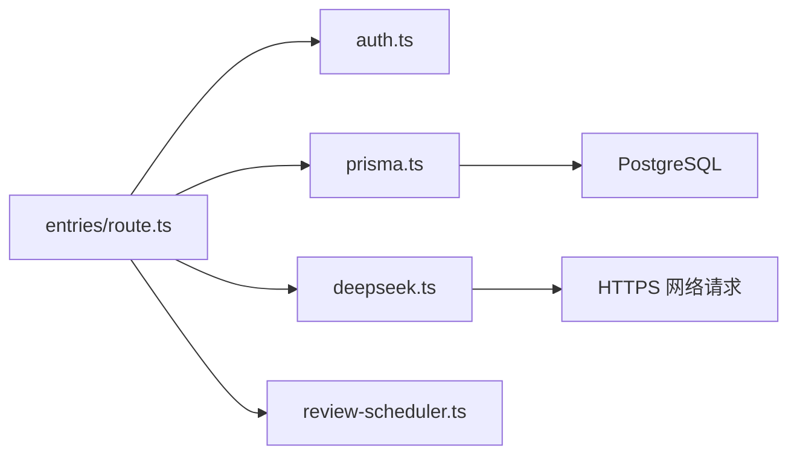

# 心得创建API

<cite>
**本文引用的文件**   
- [app/api/entries/route.ts](file://app/api/entries/route.ts)
- [lib/deepseek.ts](file://lib/deepseek.ts)
- [prisma/schema.prisma](file://prisma/schema.prisma)
- [lib/prisma.ts](file://lib/prisma.ts)
- [lib/auth.ts](file://lib/auth.ts)
- [lib/review-scheduler.ts](file://lib/review-scheduler.ts)
- [types/index.ts](file://types/index.ts)
</cite>

## 目录
1. [简介](#简介)
2. [项目结构](#项目结构)
3. [核心组件](#核心组件)
4. [架构总览](#架构总览)
5. [详细组件分析](#详细组件分析)
6. [依赖关系分析](#依赖关系分析)
7. [性能考量](#性能考量)
8. [故障排查指南](#故障排查指南)
9. [结论](#结论)
10. [附录：请求与响应示例](#附录请求与响应示例)

## 简介
本文件为“心芽”应用中“心得创建”相关API的权威文档，聚焦于 POST /api/entries 接口的实现细节。内容涵盖：
- 请求参数校验（标题、内容、心情、标签ID）
- 默认标签处理逻辑
- 草稿状态支持
- 异步预生成题目的机制（DeepSeek API调用、题目保存、复习记录创建）
- 数据验证规则、错误处理策略与性能优化建议
- 完整的请求与响应示例（成功与错误场景）

## 项目结构
该接口位于 Next.js App Router 的 API 路由中，使用 Prisma 进行数据库访问，结合认证中间件获取当前用户，并异步触发AI题目预生成流程。

图表来源
- [app/api/entries/route.ts:66-106](file://app/api/entries/route.ts#L66-L106)
- [lib/auth.ts:33-43](file://lib/auth.ts#L33-L43)
- [lib/prisma.ts:7-11](file://lib/prisma.ts#L7-L11)
- [lib/deepseek.ts:17-114](file://lib/deepseek.ts#L17-L114)
- [lib/review-scheduler.ts:5-29](file://lib/review-scheduler.ts#L5-L29)

章节来源
- [app/api/entries/route.ts:1-163](file://app/api/entries/route.ts#L1-L163)
- [lib/prisma.ts:1-14](file://lib/prisma.ts#L1-L14)

## 核心组件
- 认证与鉴权：从Cookie中解析JWT并提取userId，未登录返回401。
- 数据模型：Entry、Tag、QuizQuestion、QuizRecord、ReviewCallLog 等由Prisma Schema定义。
- 业务逻辑：
  - 新建心得：校验必填字段、处理默认标签、持久化Entry及多对多Tag关联。
  - 草稿模式：isDraft=true时不触发预生成题目。
  - 异步预生成：非草稿且存在内容时，后台调用DeepSeek生成题目与要点，落库并创建复习记录。
- 外部集成：DeepSeek聊天补全接口；本地模板降级方案（用于其他流程）。

章节来源
- [lib/auth.ts:33-43](file://lib/auth.ts#L33-L43)
- [prisma/schema.prisma:33-69](file://prisma/schema.prisma#L33-L69)
- [prisma/schema.prisma:150-209](file://prisma/schema.prisma#L150-L209)
- [app/api/entries/route.ts:66-161](file://app/api/entries/route.ts#L66-L161)

## 架构总览
下图展示了“心得创建”端到端的数据流与控制流，包括同步主路径与异步预生成子路径。

图表来源
- [app/api/entries/route.ts:66-161](file://app/api/entries/route.ts#L66-L161)
- [lib/deepseek.ts:17-114](file://lib/deepseek.ts#L17-L114)
- [lib/review-scheduler.ts:5-29](file://lib/review-scheduler.ts#L5-L29)
- [prisma/schema.prisma:33-69](file://prisma/schema.prisma#L33-L69)
- [prisma/schema.prisma:150-209](file://prisma/schema.prisma#L150-L209)

## 详细组件分析

### 1) 接口定义与权限控制
- 方法：POST
- 路径：/api/entries
- 鉴权：通过Cookie中的JWT令牌解析userId，未携带或无效则返回401。

章节来源
- [app/api/entries/route.ts:66-74](file://app/api/entries/route.ts#L66-L74)
- [lib/auth.ts:33-43](file://lib/auth.ts#L33-L43)

### 2) 请求体与参数校验
- 必填字段
  - title：去除首尾空白后不能为空，否则返回400并提示“标题不能为空”。
- 可选字段
  - content：富文本HTML字符串，可为空。
  - mood：心情枚举值之一，可为空。
  - tagIds：标签ID数组，可为空。
  - isDraft：布尔值，表示是否为草稿。
- 行为说明
  - 若tagIds为空且用户存在默认标签，则自动绑定默认标签。
  - 若isDraft为true，不会触发预生成题目。
  - 若content为空或isDraft为true，也不会触发预生成题目。

章节来源
- [app/api/entries/route.ts:70-80](file://app/api/entries/route.ts#L70-L80)
- [app/api/entries/route.ts:82-94](file://app/api/entries/route.ts#L82-L94)
- [app/api/entries/route.ts:96-103](file://app/api/entries/route.ts#L96-L103)

### 3) 默认标签处理逻辑
- 当tagIds为空时，查询当前用户的默认标签（isDefault=true），若存在则将其作为唯一标签关联到新建心得。
- 若无默认标签，则不关联任何标签。

章节来源
- [app/api/entries/route.ts:76-80](file://app/api/entries/route.ts#L76-L80)
- [prisma/schema.prisma:57-69](file://prisma/schema.prisma#L57-L69)

### 4) 草稿状态支持
- isDraft=true时：
  - 正常创建Entry，但不触发预生成题目。
  - 适合先保存再完善内容的场景。
- isDraft=false且content存在时：
  - 触发异步预生成题目流程。

章节来源
- [app/api/entries/route.ts:82-94](file://app/api/entries/route.ts#L82-L94)
- [app/api/entries/route.ts:96-103](file://app/api/entries/route.ts#L96-L103)

### 5) 异步预生成题目机制
- 触发条件：非草稿且content存在。
- 主要步骤：
  1) 调用DeepSeek生成题目与要点总结。
  2) 将keyPoints回写到Entry（可选）。
  3) 批量创建QuizQuestion（包含题干、题型、选项、答案、解析、角度序号）。
  4) 为每个题目创建QuizRecord，初始答错标记为false，nextReviewAt设置为次日，streak=0。
  5) 记录一次复习调用日志（pre-generate），包含成功与否、题目数量与错误信息。
- 超时与重试：
  - DeepSeek客户端内置30秒超时与最多一次重试（maxRetries=1）。
  - 若多次失败，返回空结果，但仍会记录日志。

章节来源
- [app/api/entries/route.ts:108-161](file://app/api/entries/route.ts#L108-L161)
- [lib/deepseek.ts:17-114](file://lib/deepseek.ts#L17-L114)
- [lib/review-scheduler.ts:5-29](file://lib/review-scheduler.ts#L5-L29)

#### 预生成流程图

图表来源
- [app/api/entries/route.ts:108-161](file://app/api/entries/route.ts#L108-L161)
- [lib/deepseek.ts:17-114](file://lib/deepseek.ts#L17-L114)
- [lib/review-scheduler.ts:5-29](file://lib/review-scheduler.ts#L5-L29)

### 6) 数据模型与约束
- Entry
  - 关键字段：title、content、keyPoints、mood、recordTime、isTop、isFavorite、isDraft。
  - 索引：按userId+recordTime、userId+isTop、userId+isFavorite、userId+isDraft建立索引，利于筛选与排序。
- Tag
  - 唯一约束：同一用户下name唯一。
- QuizQuestion
  - 字段：question、type、options(Json)、answer(Json)、explanation、angle。
- QuizRecord
  - 关键字段：correct、userAnswer(Json)、answerCount、answeredAt、nextReviewAt、streak。
  - 索引：userId+nextReviewAt、userId+questionId。
- ReviewCallLog
  - 记录复习调用过程（step、success、questionCount、errorMsg）。

章节来源
- [prisma/schema.prisma:33-69](file://prisma/schema.prisma#L33-L69)
- [prisma/schema.prisma:150-209](file://prisma/schema.prisma#L150-L209)

### 7) 错误处理与边界情况
- 未登录：返回401。
- 标题为空：返回400并附带错误消息。
- DeepSeek异常或超时：
  - 内部捕获并记录错误，最终返回空结果，不影响主流程返回200。
  - 通过ReviewCallLog记录失败原因（如“DeepSeek returned empty”）。
- 默认标签不存在：
  - 不关联标签，允许创建无标签心得。

章节来源
- [app/api/entries/route.ts:66-74](file://app/api/entries/route.ts#L66-L74)
- [app/api/entries/route.ts:73-74](file://app/api/entries/route.ts#L73-L74)
- [app/api/entries/route.ts:96-103](file://app/api/entries/route.ts#L96-L103)
- [lib/deepseek.ts:76-114](file://lib/deepseek.ts#L76-L114)
- [lib/review-scheduler.ts:5-29](file://lib/review-scheduler.ts#L5-L29)

### 8) 性能特性与优化建议
- 主流程非阻塞：预生成在后台执行，不阻塞HTTP响应。
- 并发写入：批量创建题目与复习记录，减少往返次数。
- 超时保护：DeepSeek调用设置30秒超时，避免长尾请求拖慢系统。
- 日志清理：ReviewCallLog仅保留最近30条，防止日志膨胀。
- 建议优化点：
  - 引入任务队列（如BullMQ/Redis）替代直接异步函数，提升可靠性与可观测性。
  - 增加幂等键（entryId + step）避免重复生成。
  - 对DeepSeek响应做更严格的Schema校验，提前失败快速反馈。
  - 对批量写入使用事务，保证一致性。

章节来源
- [app/api/entries/route.ts:96-103](file://app/api/entries/route.ts#L96-L103)
- [lib/deepseek.ts:54-74](file://lib/deepseek.ts#L54-L74)
- [lib/review-scheduler.ts:17-29](file://lib/review-scheduler.ts#L17-L29)

## 依赖关系分析
- 模块耦合
  - API路由依赖认证、Prisma、DeepSeek客户端与复习调度器日志。
  - DeepSeek客户端依赖环境变量（API Key与URL）。
  - 复习调度器日志依赖Prisma。
- 外部依赖
  - PostgreSQL（通过Prisma）
  - DeepSeek在线服务（REST API）

图表来源
- [app/api/entries/route.ts:1-6](file://app/api/entries/route.ts#L1-L6)
- [lib/auth.ts:1-56](file://lib/auth.ts#L1-L56)
- [lib/prisma.ts:1-14](file://lib/prisma.ts#L1-L14)
- [lib/deepseek.ts:1-115](file://lib/deepseek.ts#L1-L115)
- [lib/review-scheduler.ts:1-29](file://lib/review-scheduler.ts#L1-L29)

章节来源
- [app/api/entries/route.ts:1-6](file://app/api/entries/route.ts#L1-L6)
- [lib/auth.ts:1-56](file://lib/auth.ts#L1-L56)
- [lib/prisma.ts:1-14](file://lib/prisma.ts#L1-L14)
- [lib/deepseek.ts:1-115](file://lib/deepseek.ts#L1-L115)
- [lib/review-scheduler.ts:1-29](file://lib/review-scheduler.ts#L1-L29)

## 性能考量
- 主路径尽量短：仅完成必要校验与入库，耗时操作下沉至异步。
- 批量操作：题目与复习记录批量写入，降低数据库压力。
- 超时与重试：对外部AI服务设置超时与有限重试，避免雪崩。
- 日志限流：限制ReviewCallLog数量，避免无限增长。
- 索引利用：Entry与QuizRecord的常用查询字段均有索引，提高检索效率。

[本节为通用指导，无需具体文件引用]

## 故障排查指南
- 401未登录
  - 检查Cookie中是否携带xinya_token，以及JWT是否有效。
- 400标题为空
  - 确认前端提交前对title.trim()进行非空校验。
- 预生成失败
  - 查看ReviewCallLog中step="pre-generate"的记录，关注success与errorMsg。
  - 检查DEEPSEEK_API_KEY配置是否正确。
  - 观察DeepSeek客户端日志输出，定位超时或JSON解析失败。
- 默认标签未生效
  - 确认用户是否存在isDefault=true的Tag。

章节来源
- [app/api/entries/route.ts:66-74](file://app/api/entries/route.ts#L66-L74)
- [app/api/entries/route.ts:76-80](file://app/api/entries/route.ts#L76-L80)
- [lib/review-scheduler.ts:5-29](file://lib/review-scheduler.ts#L5-L29)
- [lib/deepseek.ts:76-114](file://lib/deepseek.ts#L76-L114)

## 结论
POST /api/entries 实现了稳健的心得创建流程：严格校验、灵活草稿、智能默认标签、以及非阻塞的AI预生成能力。通过完善的错误处理与日志追踪，系统在可用性、可维护性与扩展性方面具备良好基础。后续可通过任务队列、事务与更强校验进一步提升稳定性与一致性。

[本节为总结，无需具体文件引用]

## 附录：请求与响应示例

- 成功创建（非草稿，带标签）
  - 请求
    - 方法：POST
    - 路径：/api/entries
    - 头部：Cookie: xinya_token=<JWT>
    - 主体：
      - title: string（必填）
      - content: string（可选）
      - mood: "happy"|"sad"|"calm"|"excited"|"worried"（可选）
      - tagIds: string[]（可选）
      - isDraft: boolean（可选，默认false）
  - 响应
    - 状态码：200
    - 主体：{ ok: true, data: Entry }
    - Entry包含id、title、content、tags、mood、isDraft等字段。

- 成功创建（草稿）
  - 请求主体中 isDraft: true
  - 响应同上，但不会触发预生成题目。

- 错误：未登录
  - 状态码：401
  - 主体：{ ok: false }

- 错误：标题为空
  - 状态码：400
  - 主体：{ ok: false, error: "标题不能为空" }

- 错误：DeepSeek预生成失败（不影响主流程）
  - 主流程仍返回200，但ReviewCallLog中会记录step="pre-generate"、success=false与errorMsg。

章节来源
- [app/api/entries/route.ts:66-106](file://app/api/entries/route.ts#L66-L106)
- [app/api/entries/route.ts:108-161](file://app/api/entries/route.ts#L108-L161)
- [types/index.ts:1-48](file://types/index.ts#L1-L48)