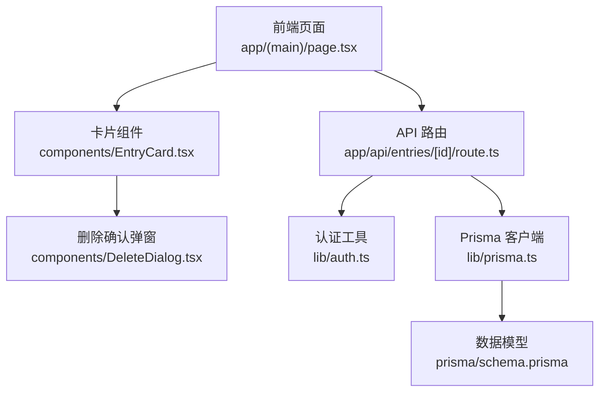
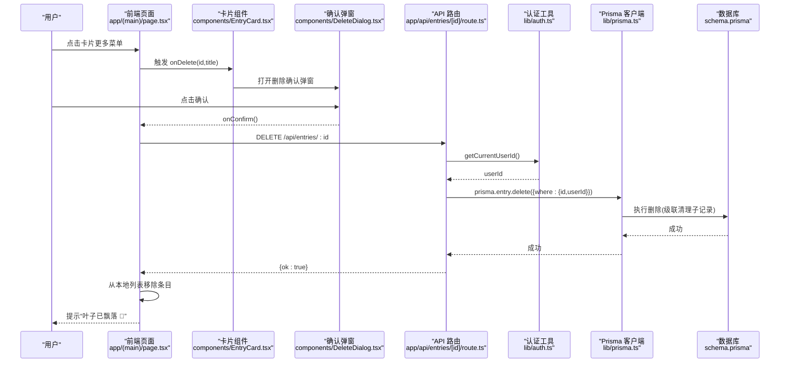
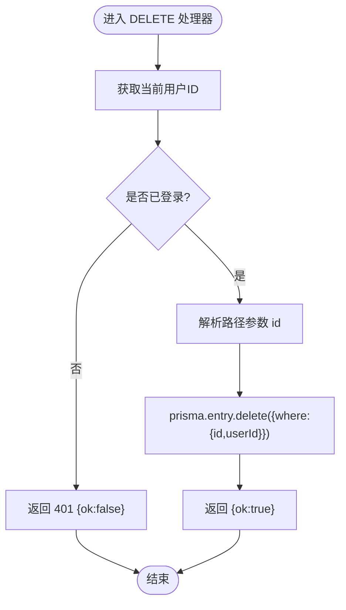
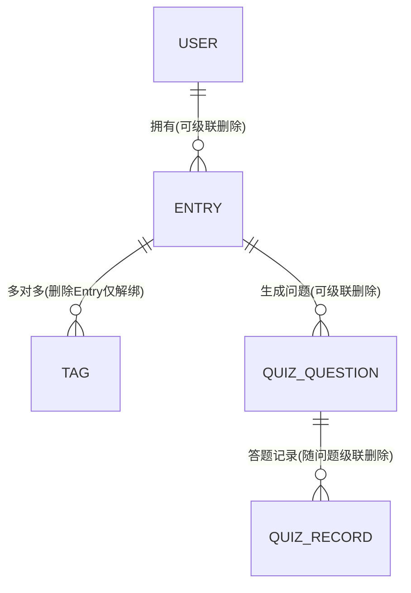
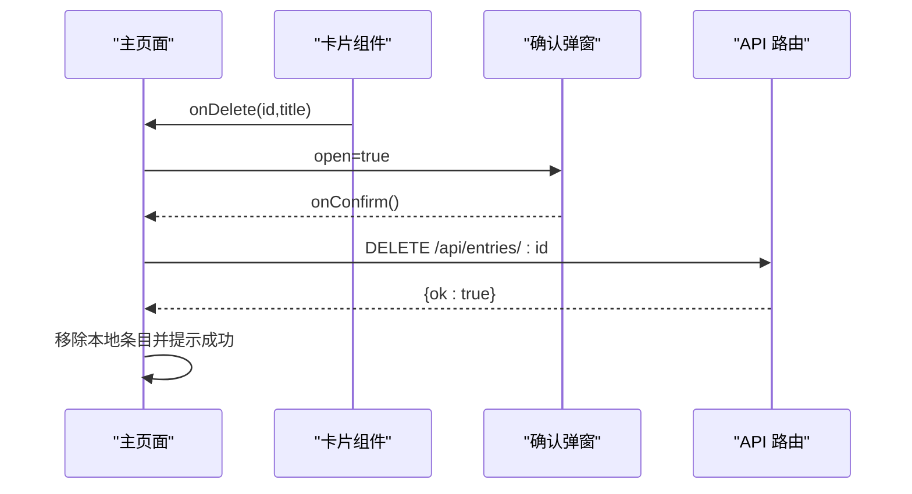
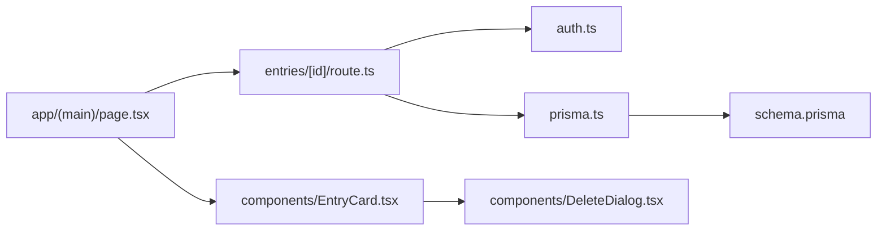

# 心得删除API

<cite>
**本文引用的文件**
- [app/api/entries/[id]/route.ts](file://app/api/entries/[id]/route.ts)
- [prisma/schema.prisma](file://prisma/schema.prisma)
- [lib/prisma.ts](file://lib/prisma.ts)
- [lib/auth.ts](file://lib/auth.ts)
- [components/DeleteDialog.tsx](file://components/DeleteDialog.tsx)
- [app/(main)/page.tsx](file://app/(main)/page.tsx)
- [components/EntryCard.tsx](file://components/EntryCard.tsx)
</cite>

## 目录
1. [简介](#简介)
2. [项目结构](#项目结构)
3. [核心组件](#核心组件)
4. [架构总览](#架构总览)
5. [详细组件分析](#详细组件分析)
6. [依赖关系分析](#依赖关系分析)
7. [性能与一致性考量](#性能与一致性考量)
8. [故障排查指南](#故障排查指南)
9. [结论](#结论)
10. [附录：请求与响应示例](#附录请求与响应示例)

## 简介
本文件围绕“DELETE /api/entries/[id]”接口，系统梳理其实现、权限校验、关联数据清理策略、不可逆性提示与前端交互流程。同时说明当前实现的硬删除特性、级联删除行为，以及批量删除的缺失与安全建议。

## 项目结构
该删除能力由以下部分协作完成：
- API 路由层：处理认证、参数解析、调用数据库删除
- 数据模型层：Prisma Schema 定义实体及关系约束（含级联）
- 认证工具：从 Cookie 中解析用户身份
- 前端交互：确认弹窗、调用删除接口、更新本地列表

图示来源
- [app/(main)/page.tsx](file://app/(main)/page.tsx)
- [components/EntryCard.tsx](file://components/EntryCard.tsx)
- [components/DeleteDialog.tsx](file://components/DeleteDialog.tsx)
- [app/api/entries/[id]/route.ts](file://app/api/entries/[id]/route.ts)
- [lib/auth.ts](file://lib/auth.ts)
- [lib/prisma.ts](file://lib/prisma.ts)
- [prisma/schema.prisma](file://prisma/schema.prisma)

章节来源
- [app/api/entries/[id]/route.ts:66-74](file://app/api/entries/[id]/route.ts#L66-L74)
- [lib/auth.ts:33-43](file://lib/auth.ts#L33-L43)
- [lib/prisma.ts:1-14](file://lib/prisma.ts#L1-L14)
- [prisma/schema.prisma:33-55](file://prisma/schema.prisma#L33-L55)
- [components/DeleteDialog.tsx:12-44](file://components/DeleteDialog.tsx#L12-L44)
- [app/(main)/page.tsx:148-168](file://app/(main)/page.tsx#L148-L168)
- [components/EntryCard.tsx:100-103](file://components/EntryCard.tsx#L100-L103)

## 核心组件
- API 路由 DELETE 处理器：校验登录态、按 id 与 userId 定位记录并执行删除，返回统一成功响应。
- Prisma 模型与关系：Entry 与 Tag、QuizQuestion 等存在多对一或一对多关系；User 到 Entry 为级联删除。
- 认证工具：从 Cookie 读取 token 并解析出 userId，用于资源归属校验。
- 前端删除流程：卡片菜单触发删除 -> 弹出确认对话框 -> 发起 DELETE 请求 -> 成功后移除本地条目并提示。

章节来源
- [app/api/entries/[id]/route.ts:66-74](file://app/api/entries/[id]/route.ts#L66-L74)
- [prisma/schema.prisma:33-55](file://prisma/schema.prisma#L33-L55)
- [lib/auth.ts:33-43](file://lib/auth.ts#L33-L43)
- [app/(main)/page.tsx:148-168](file://app/(main)/page.tsx#L148-L168)
- [components/EntryCard.tsx:100-103](file://components/EntryCard.tsx#L100-L103)

## 架构总览
下图展示一次删除操作的端到端时序，包括权限校验、数据库删除与前端状态更新。

图示来源
- [app/(main)/page.tsx:148-168](file://app/(main)/page.tsx#L148-L168)
- [components/EntryCard.tsx:100-103](file://components/EntryCard.tsx#L100-L103)
- [components/DeleteDialog.tsx:12-44](file://components/DeleteDialog.tsx#L12-L44)
- [app/api/entries/[id]/route.ts:66-74](file://app/api/entries/[id]/route.ts#L66-L74)
- [lib/auth.ts:33-43](file://lib/auth.ts#L33-L43)
- [lib/prisma.ts:1-14](file://lib/prisma.ts#L1-L14)
- [prisma/schema.prisma:33-55](file://prisma/schema.prisma#L33-L55)

## 详细组件分析

### 后端删除接口（DELETE /api/entries/[id]）
- 权限验证
  - 通过 Cookie 中的 token 解析 userId，未登录直接返回 401。
- 资源校验与删除
  - 使用 where: { id, userId } 确保只能删除自己的心得。
  - 调用 prisma.entry.delete 执行物理删除。
- 响应格式
  - 成功返回 { ok: true }。
  - 未登录返回 { ok: false }，状态码 401。
  - 若记录不存在或无权限，Prisma 会抛出异常，当前代码未显式捕获，将交由 Next.js 默认错误处理返回 5xx。

图示来源
- [app/api/entries/[id]/route.ts:66-74](file://app/api/entries/[id]/route.ts#L66-L74)
- [lib/auth.ts:33-43](file://lib/auth.ts#L33-L43)

章节来源
- [app/api/entries/[id]/route.ts:66-74](file://app/api/entries/[id]/route.ts#L66-L74)
- [lib/auth.ts:33-43](file://lib/auth.ts#L33-L43)

### 数据模型与级联删除策略
- 用户与心得
  - User 到 Entry 的关系配置了 onDelete: Cascade，删除用户时会级联删除其所有心得。
- 心得与标签
  - Entry 与 Tag 是多对多关系（通过 EntryTags），删除 Entry 时不会自动删除 Tag，但会解除关联。
- 心得与复习问题
  - QuizQuestion 对 Entry 设置了 onDelete: Cascade，删除心得会级联删除其生成的复习问题。
- 复习记录
  - QuizRecord 通过 questionId 指向 QuizQuestion，随 QuizQuestion 被级联删除。

图示来源
- [prisma/schema.prisma:33-55](file://prisma/schema.prisma#L33-L55)
- [prisma/schema.prisma:57-69](file://prisma/schema.prisma#L57-L69)
- [prisma/schema.prisma:150-165](file://prisma/schema.prisma#L150-L165)
- [prisma/schema.prisma:167-184](file://prisma/schema.prisma#L167-L184)

章节来源
- [prisma/schema.prisma:33-55](file://prisma/schema.prisma#L33-L55)
- [prisma/schema.prisma:57-69](file://prisma/schema.prisma#L57-L69)
- [prisma/schema.prisma:150-165](file://prisma/schema.prisma#L150-L165)
- [prisma/schema.prisma:167-184](file://prisma/schema.prisma#L167-L184)

### 软删除机制与数据恢复
- 当前实现为物理删除，未在 Entry 模型中添加 isDeleted 字段，也未在删除前进行逻辑标记。
- 因此不支持软删除，也不提供内置的数据恢复能力。如需恢复，需依赖数据库备份或事务回滚（仅在失败时）。

章节来源
- [prisma/schema.prisma:33-55](file://prisma/schema.prisma#L33-L55)
- [app/api/entries/[id]/route.ts:66-74](file://app/api/entries/[id]/route.ts#L66-L74)

### 删除前的权限验证与资源隔离
- 通过 JWT Cookie 解析 userId，并在删除条件中强制匹配 userId，避免越权删除他人心得。
- 未登录或 token 无效时返回 401。

章节来源
- [lib/auth.ts:33-43](file://lib/auth.ts#L33-L43)
- [app/api/entries/[id]/route.ts:66-74](file://app/api/entries/[id]/route.ts#L66-L74)

### 关联数据处理方式
- 标签（Tag）：删除心得不会删除标签，仅解除关联。
- 评论：当前模型未见 Comment 实体，不存在评论级联删除。
- 复习记录（QuizRecord）：随其父对象 QuizQuestion 被级联删除，而 QuizQuestion 又随 Entry 被级联删除。

章节来源
- [prisma/schema.prisma:33-55](file://prisma/schema.prisma#L33-L55)
- [prisma/schema.prisma:150-165](file://prisma/schema.prisma#L150-L165)
- [prisma/schema.prisma:167-184](file://prisma/schema.prisma#L167-L184)

### 不可逆性警告与用户体验
- 前端删除确认弹窗包含明确的不可逆提示：“一旦飘落，便无法追回。”
- 确认后才会发起删除请求，降低误删概率。

章节来源
- [components/DeleteDialog.tsx:27-29](file://components/DeleteDialog.tsx#L27-L29)

### 前端删除流程与状态同步
- 卡片组件提供“删除”入口，点击后打开确认弹窗。
- 主页面负责发起 DELETE 请求，成功后从本地数组移除对应条目并减少总数，同时给出成功提示。
- 失败时显示错误提示。

图示来源
- [components/EntryCard.tsx:100-103](file://components/EntryCard.tsx#L100-L103)
- [components/DeleteDialog.tsx:12-44](file://components/DeleteDialog.tsx#L12-L44)
- [app/(main)/page.tsx:148-168](file://app/(main)/page.tsx#L148-L168)
- [app/api/entries/[id]/route.ts:66-74](file://app/api/entries/[id]/route.ts#L66-L74)

章节来源
- [components/EntryCard.tsx:100-103](file://components/EntryCard.tsx#L100-L103)
- [components/DeleteDialog.tsx:12-44](file://components/DeleteDialog.tsx#L12-L44)
- [app/(main)/page.tsx:148-168](file://app/(main)/page.tsx#L148-L168)

### 批量删除的实现与安全考虑
- 当前仓库未提供批量删除接口或前端批量操作入口。
- 安全建议（如需实现）：
  - 增加幂等性与速率限制，防止滥用。
  - 服务端严格校验每个 id 的归属（userId），避免越权。
  - 使用事务保证一致性，失败则整体回滚。
  - 返回明细结果（成功/失败列表），便于前端反馈。

[本节为通用建议，不直接分析具体文件]

## 依赖关系分析
- 路由层依赖认证工具与 Prisma 客户端。
- Prisma 客户端基于环境变量连接数据库。
- 前端依赖 React 状态管理与 toast 提示库。

图示来源
- [app/api/entries/[id]/route.ts:1-4](file://app/api/entries/[id]/route.ts#L1-L4)
- [lib/auth.ts:1-56](file://lib/auth.ts#L1-L56)
- [lib/prisma.ts:1-14](file://lib/prisma.ts#L1-L14)
- [prisma/schema.prisma:1-209](file://prisma/schema.prisma#L1-L209)
- [app/(main)/page.tsx:1-200](file://app/(main)/page.tsx#L1-L200)
- [components/EntryCard.tsx:1-138](file://components/EntryCard.tsx#L1-L138)
- [components/DeleteDialog.tsx:1-45](file://components/DeleteDialog.tsx#L1-L45)

章节来源
- [app/api/entries/[id]/route.ts:1-4](file://app/api/entries/[id]/route.ts#L1-L4)
- [lib/auth.ts:1-56](file://lib/auth.ts#L1-L56)
- [lib/prisma.ts:1-14](file://lib/prisma.ts#L1-L14)
- [prisma/schema.prisma:1-209](file://prisma/schema.prisma#L1-L209)
- [app/(main)/page.tsx:1-200](file://app/(main)/page.tsx#L1-L200)
- [components/EntryCard.tsx:1-138](file://components/EntryCard.tsx#L1-L138)
- [components/DeleteDialog.tsx:1-45](file://components/DeleteDialog.tsx#L1-L45)

## 性能与一致性考量
- 删除操作为单条记录删除，复杂度低。
- 由于存在级联删除（如 QuizQuestion、QuizRecord），当一条心得关联大量问题时，删除可能涉及多条记录的级联清理，需注意数据库锁与耗时。
- 建议在高频场景下：
  - 监控慢查询日志。
  - 必要时引入异步任务或分片删除（谨慎评估一致性）。
  - 为常用查询字段建立索引（现有 schema 已有必要索引）。

[本节为通用指导，不直接分析具体文件]

## 故障排查指南
- 401 未授权
  - 检查 Cookie 中是否存在有效 token，且未被拦截或过期。
- 5xx 服务器错误
  - 当前删除接口未显式捕获 Prisma 异常，若记录不存在或数据库异常，可能返回 5xx。可在路由层增加 try/catch 并返回明确错误信息。
- 前端删除后列表未更新
  - 检查前端是否在成功回调中正确移除本地条目与更新计数。
- 关联数据残留
  - 确认 Prisma 关系与 onDelete 配置是否符合预期；当前 Entry 到 QuizQuestion 为级联删除，Tag 不会被删除。

章节来源
- [app/api/entries/[id]/route.ts:66-74](file://app/api/entries/[id]/route.ts#L66-L74)
- [app/(main)/page.tsx:148-168](file://app/(main)/page.tsx#L148-L168)
- [prisma/schema.prisma:33-55](file://prisma/schema.prisma#L33-L55)
- [prisma/schema.prisma:150-165](file://prisma/schema.prisma#L150-L165)

## 结论
- 当前 DELETE /api/entries/[id] 实现了基于用户身份的硬删除，具备基本的权限校验与级联清理（针对 QuizQuestion 及其记录）。
- 不支持软删除与数据恢复；删除不可逆，前端有明确提示。
- 未提供批量删除能力；如需扩展，应补充严格的权限校验、事务一致性与限流保护。

[本节为总结性内容，不直接分析具体文件]

## 附录：请求与响应示例

- 请求
  - 方法：DELETE
  - URL：/api/entries/{id}
  - 头部：Cookie: xinya_token={JWT}
  - 请求体：无

- 成功响应
  - 状态码：200
  - 响应体：{ "ok": true }

- 未授权
  - 状态码：401
  - 响应体：{ "ok": false }

- 其他错误
  - 状态码：5xx（当前未显式捕获异常）
  - 响应体：由框架默认错误处理返回

章节来源
- [app/api/entries/[id]/route.ts:66-74](file://app/api/entries/[id]/route.ts#L66-L74)
- [lib/auth.ts:33-43](file://lib/auth.ts#L33-L43)