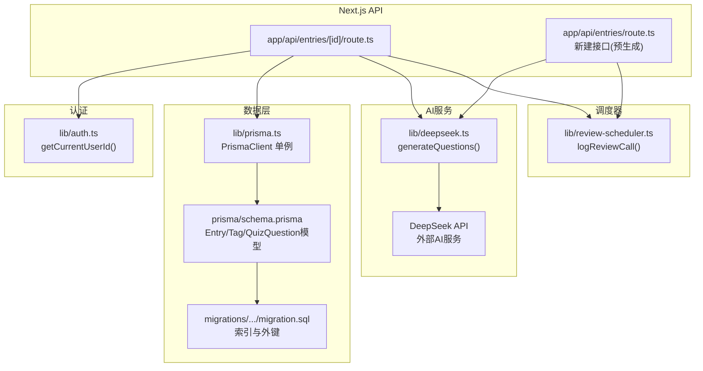
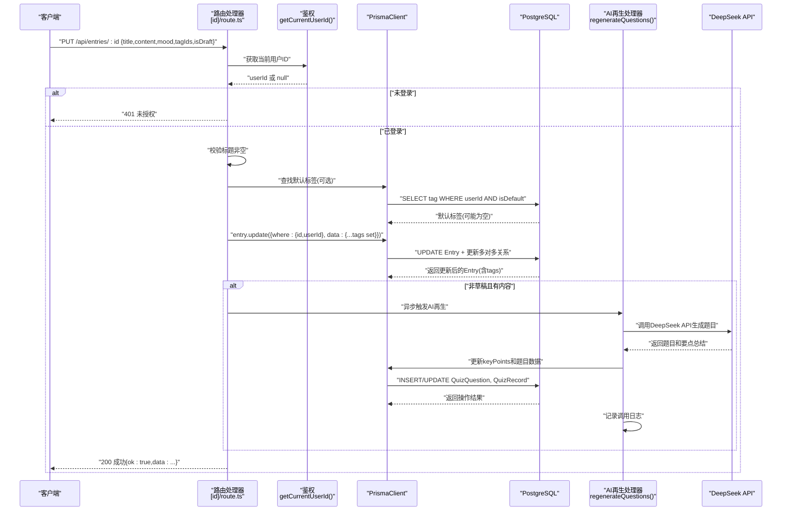
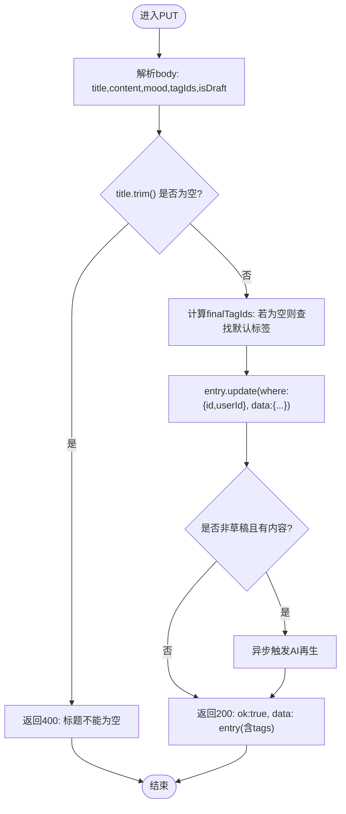
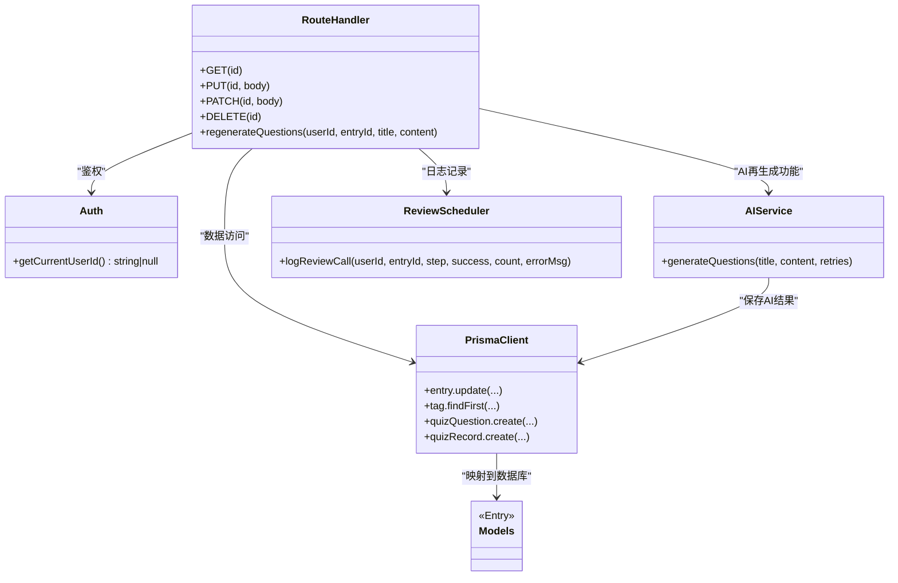

# 心得更新API

<cite>
**本文引用的文件**
- [app/api/entries/[id]/route.ts](file://app/api/entries/[id]/route.ts)
- [lib/auth.ts](file://lib/auth.ts)
- [prisma/schema.prisma](file://prisma/schema.prisma)
- [prisma/migrations/20260621_init/migration.sql](file://prisma/migrations/20260621_init/migration.sql)
- [lib/prisma.ts](file://lib/prisma.ts)
- [lib/deepseek.ts](file://lib/deepseek.ts)
- [lib/review-scheduler.ts](file://lib/review-scheduler.ts)
- [app/api/entries/route.ts](file://app/api/entries/route.ts)
</cite>

## 更新摘要
**变更内容**
- 新增异步AI再生成功能：编辑非草稿且包含内容的条目时自动触发AI重新生成题目和要点总结
- 增强PUT接口逻辑：在条目更新后检查条件并调用regenerateQuestions函数
- 集成DeepSeek AI服务：通过generateQuestions函数调用外部AI API生成复习题目
- 完善错误处理：异步操作失败不影响主流程，错误被捕获并记录日志

## 目录
1. [简介](#简介)
2. [项目结构](#项目结构)
3. [核心组件](#核心组件)
4. [架构总览](#架构总览)
5. [详细组件分析](#详细组件分析)
6. [依赖关系分析](#依赖关系分析)
7. [性能与并发特性](#性能与并发特性)
8. [故障排查指南](#故障排查指南)
9. [结论](#结论)
10. [附录：请求与响应示例](#附录请求与响应示例)

## 简介
本文件为"心芽"应用中"心得更新API"的权威技术文档，聚焦于 PUT /api/entries/[id] 接口的实现细节。内容涵盖：
- 增量更新逻辑与字段校验
- 权限控制（基于JWT Cookie）
- 标签关联更新策略（含默认标签回退）
- **新增**：异步AI再生成功能 - 编辑非草稿条目时自动重新生成题目和要点总结
- 草稿状态切换、置顶与收藏状态管理（通过 PATCH）
- 版本控制与数据一致性保障机制
- 完整的请求/响应示例与错误处理方案
- 并发更新的安全性与完整性说明

## 项目结构
该接口位于 Next.js App Router 的 API 路由中，使用 Prisma Client 访问 PostgreSQL 数据库，并通过 JWT Cookie 完成鉴权。**新增**了异步AI再生成功能，集成DeepSeek AI服务。

**图表来源**
- [app/api/entries/[id]/route.ts:1-168](file://app/api/entries/[id]/route.ts#L1-L168)
- [app/api/entries/route.ts:1-163](file://app/api/entries/route.ts#L1-L163)
- [lib/auth.ts:33-43](file://lib/auth.ts#L33-L43)
- [lib/deepseek.ts:1-115](file://lib/deepseek.ts#L1-L115)
- [lib/review-scheduler.ts:1-232](file://lib/review-scheduler.ts#L1-L232)
- [lib/prisma.ts:1-14](file://lib/prisma.ts#L1-L14)
- [prisma/schema.prisma:33-209](file://prisma/schema.prisma#L33-L209)

## 核心组件
- 路由处理器：负责解析参数、鉴权、校验输入、执行更新、返回结果
- **新增**：异步再生处理器：regenerateQuestions函数处理AI题目重新生成
- 鉴权模块：从 Cookie 中读取并验证 JWT，提取 userId
- **新增**：AI服务模块：DeepSeek API集成，生成复习题目和要点总结
- **新增**：日志记录模块：记录AI调用状态和结果
- 数据模型：Entry 与 Tag 的多对多关系，以及 QuizQuestion、QuizRecord 等复习相关模型
- 数据库连接：Prisma Client 单例，统一日志级别

**章节来源**
- [app/api/entries/[id]/route.ts:34-74](file://app/api/entries/[id]/route.ts#L34-L74)
- [app/api/entries/[id]/route.ts:107-167](file://app/api/entries/[id]/route.ts#L107-L167)
- [lib/auth.ts:33-43](file://lib/auth.ts#L33-L43)
- [lib/deepseek.ts:17-114](file://lib/deepseek.ts#L17-L114)
- [lib/review-scheduler.ts:5-29](file://lib/review-scheduler.ts#L5-L29)
- [prisma/schema.prisma:33-209](file://prisma/schema.prisma#L33-L209)
- [lib/prisma.ts:1-14](file://lib/prisma.ts#L1-L14)

## 架构总览
PUT /api/entries/[id] 的核心流程如下：**新增**异步AI再生成功能，在条目更新后根据条件触发。

**图表来源**
- [app/api/entries/[id]/route.ts:34-74](file://app/api/entries/[id]/route.ts#L34-L74)
- [app/api/entries/[id]/route.ts:107-167](file://app/api/entries/[id]/route.ts#L107-L167)
- [lib/deepseek.ts:17-114](file://lib/deepseek.ts#L17-L114)
- [lib/review-scheduler.ts:5-29](file://lib/review-scheduler.ts#L5-L29)

## 详细组件分析

### 1) 权限控制
- 所有写操作均调用 getCurrentUserId() 从 Cookie 中解析 JWT，若失败或未携带则返回 401。
- 所有数据库写入均附加 where.userId 条件，确保仅能修改自己的心得。

**章节来源**
- [app/api/entries/[id]/route.ts:36-38](file://app/api/entries/[id]/route.ts#L36-L38)
- [lib/auth.ts:33-43](file://lib/auth.ts#L33-L43)

### 2) 字段校验与增量更新
- 必填字段：title 必须非空（trim 后判断）。
- 可选字段：content、mood、isDraft、tagIds。
- 增量语义：
  - title 使用 trim 后覆盖；
  - content 直接覆盖；
  - mood 传入 null 时清空；
  - isDraft 使用 ?? false 提供默认值；
  - tags 使用 set 全量替换为最终列表（见下节）。

**章节来源**
- [app/api/entries/[id]/route.ts:40-43](file://app/api/entries/[id]/route.ts#L40-L43)
- [app/api/entries/[id]/route.ts:51-61](file://app/api/entries/[id]/route.ts#L51-L61)

### 3) 标签关联更新策略
- 若 tagIds 为空数组或未传，将尝试为用户查找 isDefault=true 的默认标签，存在则自动绑定一个默认标签。
- 最终通过 tags.set 进行全量替换，即本次提交即为最终标签集合。
- 返回结果包含 tags 的 id 与 name，便于前端渲染。

**图表来源**
- [app/api/entries/[id]/route.ts:40-74](file://app/api/entries/[id]/route.ts#L40-L74)
- [prisma/schema.prisma:57-69](file://prisma/schema.prisma#L57-L69)

**章节来源**
- [app/api/entries/[id]/route.ts:45-49](file://app/api/entries/[id]/route.ts#L45-L49)
- [app/api/entries/[id]/route.ts:51-61](file://app/api/entries/[id]/route.ts#L51-L61)
- [prisma/schema.prisma:57-69](file://prisma/schema.prisma#L57-L69)

### 4) **新增**：异步AI再生成功能
当用户编辑非草稿且包含内容的条目时，系统会自动触发AI重新生成题目和要点总结：

**触发条件**：
- `!isDraft`：条目不是草稿状态
- `content`：条目包含内容

**再生流程**：
1. 调用 `generateQuestions(title, content, 1)` 向DeepSeek API发送请求
2. 接收AI返回的题目数据和要点总结
3. 更新条目的 `keyPoints` 字段
4. 删除旧的题目和答题记录
5. 创建新的题目和初始答题记录
6. 记录调用日志到 `reviewCallLog` 表

**错误处理**：
- 异步操作失败不会影响主流程
- 错误被捕获并记录到控制台
- 调用日志会记录成功/失败状态

**章节来源**
- [app/api/entries/[id]/route.ts:65-71](file://app/api/entries/[id]/route.ts#L65-L71)
- [app/api/entries/[id]/route.ts:107-167](file://app/api/entries/[id]/route.ts#L107-L167)
- [lib/deepseek.ts:17-114](file://lib/deepseek.ts#L17-L114)
- [lib/review-scheduler.ts:5-29](file://lib/review-scheduler.ts#L5-L29)

### 5) 草稿状态切换、置顶与收藏
- 草稿切换：在 PUT 中通过 isDraft 字段切换；当 isDraft=false 且存在内容时，会在创建流程中触发异步预生成题目（参考新建接口行为），但 PUT 本身不触发该逻辑。
- **更新**：现在PUT接口在非草稿且有内容时会触发异步再生成功能
- 置顶/收藏：通过 PATCH /api/entries/[id] 支持部分更新，仅允许 isTop 与 isFavorite 两个白名单字段。

**章节来源**
- [app/api/entries/[id]/route.ts:56-58](file://app/api/entries/[id]/route.ts#L56-L58)
- [app/api/entries/[id]/route.ts:65-71](file://app/api/entries/[id]/route.ts#L65-L71)
- [app/api/entries/[id]/route.ts:76-94](file://app/api/entries/[id]/route.ts#L76-L94)

### 6) 内容版本控制与数据一致性
- 版本控制：Entry 模型未包含显式 version 字段，因此未实现乐观锁或版本号控制。
- **新增**：AI再生成功的数据一致性：
  - 题目生成失败时保留原有数据
  - 旧题目和答题记录在新生成前被清理
  - 调用日志记录每次AI调用的状态
- 一致性保障：
  - 数据库层面：update 操作原子性保证；多对多关系通过 _EntryTags 表维护，具备唯一约束与级联删除。
  - 应用层面：无重试/补偿逻辑；并发冲突由数据库事务原子性保护，但可能出现"后写覆盖前写"的竞态问题（见并发章节）。

**章节来源**
- [prisma/schema.prisma:33-55](file://prisma/schema.prisma#L33-L55)
- [prisma/migrations/20260621_init/migration.sql:86-113](file://prisma/migrations/20260621_init/migration.sql#L86-L113)
- [app/api/entries/[id]/route.ts:126-166](file://app/api/entries/[id]/route.ts#L126-L166)

### 7) **新增**：AI服务集成
系统集成了DeepSeek AI服务来生成复习题目：

**功能特性**：
- 智能题型选择：概念辨析→单选，关系匹配→多选，对比→判断
- 自动生成要点总结：1-2句核心内容概括
- 超时保护：30秒超时限制
- 重试机制：最多重试1次
- JSON格式解析：从AI响应中提取结构化数据

**数据结构**：
- `GeneratedResult`：包含 `keyPoints` 和 `questions` 数组
- `GeneratedQuestion`：包含题干、类型、选项、答案、解析

**章节来源**
- [lib/deepseek.ts:1-115](file://lib/deepseek.ts#L1-L115)

### 8) 错误处理
- 401 未授权：缺少有效 JWT 或解析失败。
- 400 参数错误：title 为空。
- 404 资源不存在：根据 id+userId 找不到对应心得（GET 场景明确返回，PUT/PATCH 若找不到会抛出数据库异常，建议上层捕获并返回 404）。
- **新增**：AI服务错误：
  - DeepSeek API调用失败：记录错误日志但不影响主流程
  - JSON解析失败：降级处理返回空结果
  - 网络超时：30秒超时后重试

**章节来源**
- [app/api/entries/[id]/route.ts:36-43](file://app/api/entries/[id]/route.ts#L36-L43)
- [app/api/entries/[id]/route.ts:11-15](file://app/api/entries/[id]/route.ts#L11-L15)
- [lib/deepseek.ts:76-114](file://lib/deepseek.ts#L76-L114)

## 依赖关系分析
- 路由处理器依赖：
  - 鉴权：getCurrentUserId()
  - 数据访问：prisma（PrismaClient 单例）
  - **新增**：AI服务：generateQuestions()
  - **新增**：日志记录：logReviewCall()
  - 模型定义：Entry、Tag、QuizQuestion、QuizRecord 及其关系
- 外部依赖：
  - PostgreSQL（通过 Prisma Provider）
  - JSON Web Token（用于鉴权）
  - **新增**：DeepSeek API（外部AI服务）

**图表来源**
- [app/api/entries/[id]/route.ts:1-168](file://app/api/entries/[id]/route.ts#L1-L168)
- [lib/auth.ts:33-43](file://lib/auth.ts#L33-L43)
- [lib/deepseek.ts:17-114](file://lib/deepseek.ts#L17-L114)
- [lib/review-scheduler.ts:5-29](file://lib/review-scheduler.ts#L5-L29)
- [lib/prisma.ts:1-14](file://lib/prisma.ts#L1-L14)
- [prisma/schema.prisma:33-209](file://prisma/schema.prisma#L33-L209)

**章节来源**
- [app/api/entries/[id]/route.ts:1-168](file://app/api/entries/[id]/route.ts#L1-L168)
- [lib/auth.ts:33-43](file://lib/auth.ts#L33-L43)
- [lib/deepseek.ts:17-114](file://lib/deepseek.ts#L17-L114)
- [lib/review-scheduler.ts:5-29](file://lib/review-scheduler.ts#L5-L29)
- [lib/prisma.ts:1-14](file://lib/prisma.ts#L1-L14)
- [prisma/schema.prisma:33-209](file://prisma/schema.prisma#L33-L209)

## 性能与并发特性
- 查询优化：
  - Entry 针对 userId+recordTime、userId+isTop、userId+isFavorite、userId+isDraft 建立复合索引，利于筛选与排序。
  - QuizQuestion 针对 entryId 建立索引，优化题目查询。
  - QuizRecord 针对 userId+nextReviewAt 建立索引，优化复习调度。
- 标签默认回退：
  - 当 tagIds 为空时额外查询一次默认标签，增加一次 IO。可在高频路径考虑缓存默认标签。
- **新增**：AI再生成功性能特性：
  - 异步执行：不阻塞主响应流程
  - 超时保护：30秒超时防止长时间等待
  - 重试机制：最多重试1次提高成功率
  - 批量操作：题目创建和记录插入采用循环方式
- 并发安全：
  - 当前未实现乐观锁（无 version 字段），高并发下可能出现"后写覆盖"。如需强一致，可引入 version 字段并在 update 时校验版本号，或在业务层加分布式锁。
  - **新增**：AI再生成功并发考虑：异步操作独立执行，多个并发更新可能触发多次AI调用，需注意API限流。
- 事务边界：
  - 单次 update 是原子的；若未来需要跨表变更，建议使用 prisma.$transaction 包裹。
  - **新增**：AI再生成功中的数据库操作未使用事务，可能存在部分成功的情况。

**章节来源**
- [prisma/schema.prisma:51-55](file://prisma/schema.prisma#L51-L55)
- [prisma/schema.prisma:164-184](file://prisma/schema.prisma#L164-L184)
- [app/api/entries/[id]/route.ts:45-49](file://app/api/entries/[id]/route.ts#L45-L49)
- [lib/deepseek.ts:56-72](file://lib/deepseek.ts#L56-L72)

## 故障排查指南
- 401 未授权
  - 检查 Cookie 是否携带 xinya_token，且未过期；确认服务端 JWT_SECRET 配置正确。
- 400 标题为空
  - 检查前端是否对 title 做了 trim 与非空校验。
- 404 资源不存在
  - 确认传入的 id 属于当前用户；GET 接口会明确返回 404，PUT/PATCH 若找不到记录会抛错，建议在上层捕获并转换为 404。
- 标签未生效
  - 确认 tagIds 中的标签是否存在且属于当前用户；若为空，检查是否存在默认标签。
- **新增**：AI再生成功故障排查：
  - 检查 DEEPSEEK_API_KEY 环境变量是否正确配置
  - 查看控制台日志中的 "[Regenerate]" 和 "[DeepSeek]" 标记
  - 检查 reviewCallLog 表中的调用记录
  - 确认网络连接正常，DeepSeek API可达
  - 检查条目是否为非草稿状态且包含内容

**章节来源**
- [app/api/entries/[id]/route.ts:36-43](file://app/api/entries/[id]/route.ts#L36-L43)
- [app/api/entries/[id]/route.ts:11-15](file://app/api/entries/[id]/route.ts#L11-L15)
- [app/api/entries/[id]/route.ts:45-49](file://app/api/entries/[id]/route.ts#L45-L49)
- [lib/deepseek.ts:76-114](file://lib/deepseek.ts#L76-L114)
- [lib/review-scheduler.ts:5-29](file://lib/review-scheduler.ts#L5-L29)

## 结论
PUT /api/entries/[id] 提供了简洁而实用的心得编辑能力：严格的标题校验、灵活的草稿切换、安全的标签全量替换与默认标签回退、**新增**的智能AI再生成功能、以及通过 PATCH 实现的置顶/收藏快速开关。系统通过数据库原子性与索引优化保证了基本的一致性与性能。异步AI再生成功能增强了用户体验，使编辑后的内容能够自动生成高质量的复习题目和要点总结。若需更强的并发安全与版本追踪，建议引入乐观锁（version）与事务封装。

## 附录：请求与响应示例

- 成功更新（PUT）
  - 请求
    - 方法：PUT
    - 路径：/api/entries/{id}
    - 头部：Cookie: xinya_token=...
    - 主体：
      - title: string（必填，非空）
      - content: string（可选）
      - mood: string|null（可选）
      - tagIds: string[]（可选，为空则回退默认标签）
      - isDraft: boolean（可选，默认false）
  - 响应
    - 状态码：200
    - 主体：
      - ok: true
      - data: 包含 id、title、content、mood、isDraft、tags（含 id/name）、recordTime 等字段
  - **新增**：后台异步操作
    - 如果条目是非草稿且包含内容，系统将异步触发AI再生成功能
    - 生成新的题目和要点总结，更新数据库
    - 记录调用日志到 reviewCallLog 表

- 参数错误（PUT）
  - 状态码：400
  - 主体：
    - ok: false
    - error: "标题不能为空"

- 未授权（PUT/PATCH）
  - 状态码：401
  - 主体：
    - ok: false

- 置顶/收藏切换（PATCH）
  - 请求
    - 方法：PATCH
    - 路径：/api/entries/{id}
    - 主体：
      - isTop?: boolean
      - isFavorite?: boolean
  - 响应
    - 状态码：200
    - 主体：
      - ok: true
      - data: 更新后的 entry（含 tags）

- 资源不存在（GET）
  - 状态码：404
  - 主体：
    - ok: false
    - error: "未找到该心得"

**章节来源**
- [app/api/entries/[id]/route.ts:34-74](file://app/api/entries/[id]/route.ts#L34-L74)
- [app/api/entries/[id]/route.ts:76-94](file://app/api/entries/[id]/route.ts#L76-L94)
- [app/api/entries/[id]/route.ts:11-15](file://app/api/entries/[id]/route.ts#L11-L15)
- [app/api/entries/[id]/route.ts:65-71](file://app/api/entries/[id]/route.ts#L65-L71)