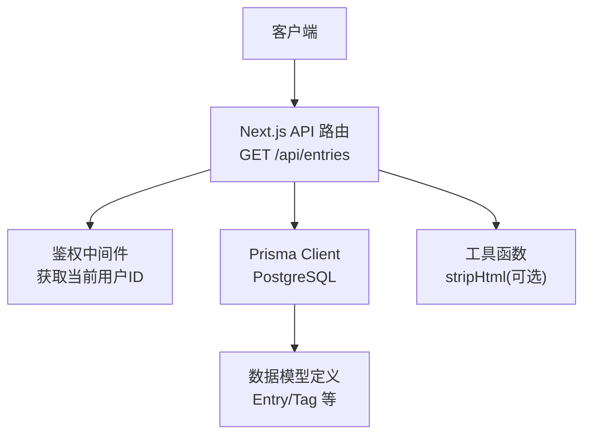
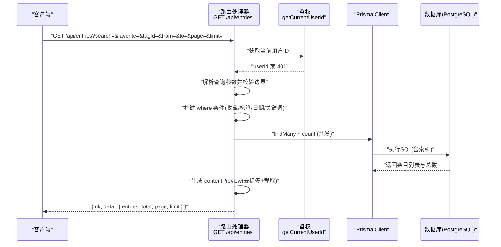
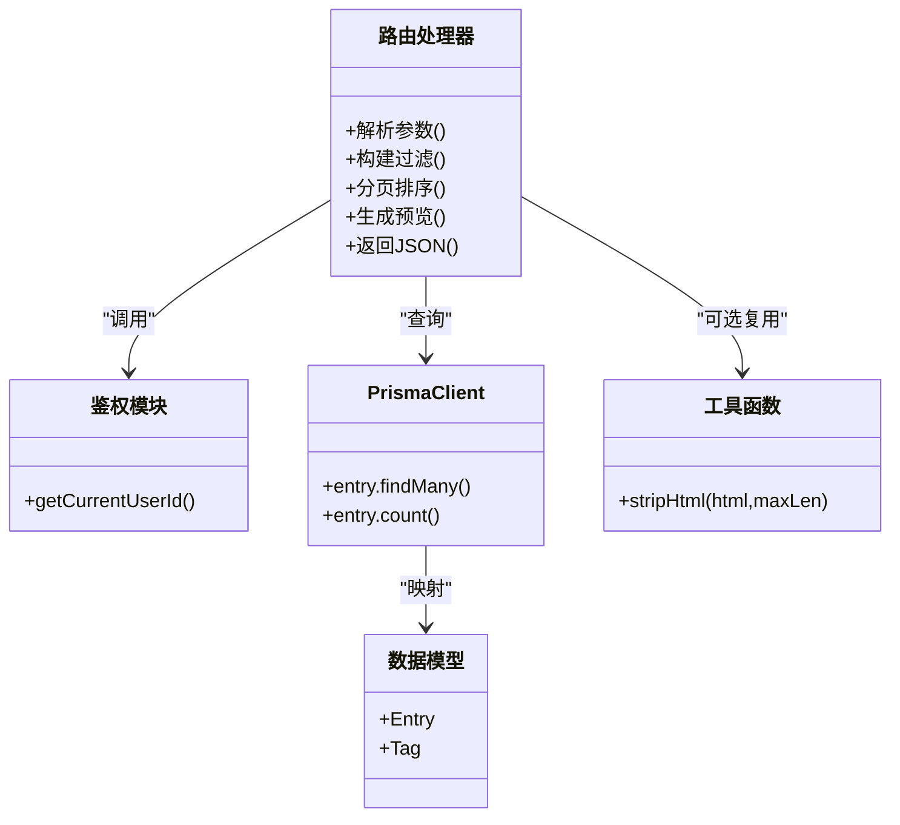

# 心得查询API

<cite>
**本文引用的文件**
- [app/api/entries/route.ts](file://app/api/entries/route.ts)
- [app/api/entries/[id]/route.ts](file://app/api/entries/[id]/route.ts)
- [prisma/schema.prisma](file://prisma/schema.prisma)
- [lib/utils.ts](file://lib/utils.ts)
- [doc/新芽dev-framework.md](file://doc/新芽dev-framework.md)
</cite>

## 目录
1. [简介](#简介)
2. [项目结构](#项目结构)
3. [核心组件](#核心组件)
4. [架构总览](#架构总览)
5. [详细组件分析](#详细组件分析)
6. [依赖分析](#依赖分析)
7. [性能考虑](#性能考虑)
8. [故障排查指南](#故障排查指南)
9. [结论](#结论)
10. [附录](#附录)

## 简介
本文件为“心芽”应用的心得查询 API 文档，聚焦于 GET /api/entries 接口的实现与使用。内容涵盖：
- 搜索过滤：关键词（标题/内容）、标签、日期范围、收藏状态
- 分页与排序：页码、每页数量、置顶优先与时间倒序
- 结果预览生成：HTML 标签去除与纯文本截取
- 参数校验与处理逻辑：模糊匹配、大小写不敏感
- 请求与响应示例：覆盖常见查询场景
- 性能优化与索引策略：数据库索引设计与查询优化建议

## 项目结构
该接口位于 Next.js App Router 的 API 路由中，数据模型由 Prisma 管理，预览生成逻辑在路由层直接实现，同时存在一个通用的 HTML 清理工具函数供复用。

图表来源
- [app/api/entries/route.ts:1-63](file://app/api/entries/route.ts#L1-L63)
- [prisma/schema.prisma:33-69](file://prisma/schema.prisma#L33-L69)
- [lib/utils.ts:11-15](file://lib/utils.ts#L11-L15)

章节来源
- [app/api/entries/route.ts:1-63](file://app/api/entries/route.ts#L1-L63)
- [prisma/schema.prisma:33-69](file://prisma/schema.prisma#L33-L69)
- [lib/utils.ts:11-15](file://lib/utils.ts#L11-L15)

## 核心组件
- 路由处理器：负责解析查询参数、构建过滤条件、执行分页与排序、生成预览并返回统一 JSON 结构
- 数据模型：Entry 与 Tag 的多对多关系，以及用于筛选和排序的字段
- 工具函数：提供统一的 HTML 标签去除与预览截取能力（可复用）

章节来源
- [app/api/entries/route.ts:1-63](file://app/api/entries/route.ts#L1-L63)
- [prisma/schema.prisma:33-69](file://prisma/schema.prisma#L33-L69)
- [lib/utils.ts:11-15](file://lib/utils.ts#L11-L15)

## 架构总览
下图展示了 GET /api/entries 的请求处理流程，包括鉴权、参数解析、过滤构建、并发查询、预览生成与响应封装。

图表来源
- [app/api/entries/route.ts:8-63](file://app/api/entries/route.ts#L8-L63)
- [prisma/schema.prisma:33-55](file://prisma/schema.prisma#L33-L55)

## 详细组件分析

### 接口定义与行为
- 方法：GET
- 路径：/api/entries
- 认证：需要登录态（未登录返回 401）
- 功能：按条件筛选、分页、排序，返回精简条目与总数

章节来源
- [app/api/entries/route.ts:7-10](file://app/api/entries/route.ts#L7-L10)
- [doc/新芽dev-framework.md:301-303](file://doc/新芽dev-framework.md#L301-L303)

### 查询参数说明与校验
- search：字符串，支持对 title 与 content 的模糊匹配，大小写不敏感
- favorite：布尔值，仅当值为 "true" 时启用收藏过滤
- tagId：字符串，按标签 ID 过滤（需与 Entry 关联的 Tag）
- from/to：ISO 日期字符串，包含起止日期；to 会包含当天全天
- page：正整数，默认 1
- limit：正整数，默认 20，最大限制 1000

校验与默认值：
- page 最小为 1
- limit 范围 [1, 1000]，超出则截断到边界
- 空字符串的 search/tagId 视为未设置

章节来源
- [app/api/entries/route.ts:12-20](file://app/api/entries/route.ts#L12-L20)

### 过滤条件构建
- 基础条件：限定 userId 且 isDraft=false
- 收藏过滤：favorite=true 时追加 isFavorite=true
- 标签过滤：通过 tags.some(id=tagId) 进行多对多过滤
- 日期范围：recordTime.gte(from) 与 recordTime.lt(to+1天)
- 关键词搜索：title 与 content 均支持 contains 且 insensitive

章节来源
- [app/api/entries/route.ts:21-36](file://app/api/entries/route.ts#L21-L36)

### 分页与排序
- 排序：isTop 降序优先，其次 recordTime 降序
- 分页：skip=(page-1)*limit，take=limit
- 计数：count(where) 用于计算 total

章节来源
- [app/api/entries/route.ts:38-47](file://app/api/entries/route.ts#L38-L47)

### 结果预览生成算法
- 步骤：
  1) 移除所有 HTML 标签
  2) 将连续空白替换为单个空格并 trim
  3) 截取前 80 个字符作为预览
- 注意：当前实现未使用通用工具函数 stripHtml，而是直接在路由内完成相同逻辑

章节来源
- [app/api/entries/route.ts:49-60](file://app/api/entries/route.ts#L49-L60)
- [lib/utils.ts:11-15](file://lib/utils.ts#L11-L15)

### 响应结构
- 成功响应：{ ok: true, data: { entries: [...], total, page, limit } }
- 失败响应（未登录）：{ ok: false }，HTTP 401

章节来源
- [app/api/entries/route.ts:8-10](file://app/api/entries/route.ts#L8-L10)
- [app/api/entries/route.ts:62](file://app/api/entries/route.ts#L62)

### 相关接口：单条详情
- GET /api/entries/[id]：返回单条心得详情，同样生成 contentPreview

章节来源
- [app/api/entries/[id]/route.ts:5-32](file://app/api/entries/[id]/route.ts#L5-L32)

## 依赖分析
- 外部依赖：
  - Next.js 运行时与路由系统
  - Prisma Client 与 PostgreSQL 数据库
- 内部依赖：
  - 鉴权模块：获取当前用户ID
  - 工具函数：stripHtml（可选复用）
  - 数据模型：Entry、Tag 及其关系

图表来源
- [app/api/entries/route.ts:1-63](file://app/api/entries/route.ts#L1-L63)
- [prisma/schema.prisma:33-69](file://prisma/schema.prisma#L33-L69)
- [lib/utils.ts:11-15](file://lib/utils.ts#L11-L15)

章节来源
- [app/api/entries/route.ts:1-63](file://app/api/entries/route.ts#L1-L63)
- [prisma/schema.prisma:33-69](file://prisma/schema.prisma#L33-L69)
- [lib/utils.ts:11-15](file://lib/utils.ts#L11-L15)

## 性能考虑
- 并发查询：findMany 与 count 并行执行，减少整体延迟
- 索引设计：
  - 复合索引 [userId, recordTime(sort: Desc)]：加速按用户和时间排序的分页查询
  - 复合索引 [userId, isTop]：加速置顶优先排序
  - 复合索引 [userId, isFavorite]：加速收藏过滤
  - 复合索引 [userId, isDraft]：加速草稿排除
- 标签过滤：tags.some(id=tagId) 走多对多关系，建议在关联表上建立合适索引以提升匹配效率
- 关键词搜索：contains + insensitive 可能触发全表扫描，若数据量增长，可考虑全文检索扩展或引入搜索引擎
- 预览生成：正则替换与截取为 O(n)，n 为 content 长度，通常开销较小；如内容极大，可考虑服务端缓存或预生成摘要

章节来源
- [app/api/entries/route.ts:38-47](file://app/api/entries/route.ts#L38-L47)
- [prisma/schema.prisma:51-55](file://prisma/schema.prisma#L51-L55)

## 故障排查指南
- 401 未登录：检查会话/Token 是否正确传递
- 无结果返回：确认 search/favorite/tagId/from/to 组合是否过于严格
- 分页异常：检查 page 与 limit 是否在合法范围内
- 预览为空：content 是否为空或仅含标签；确认正则替换逻辑是否生效
- 标签过滤无效：确认 tagId 是否存在且属于当前用户

章节来源
- [app/api/entries/route.ts:8-10](file://app/api/entries/route.ts#L8-L10)
- [app/api/entries/route.ts:12-20](file://app/api/entries/route.ts#L12-L20)
- [app/api/entries/route.ts:49-60](file://app/api/entries/route.ts#L49-L60)

## 结论
GET /api/entries 提供了完善的心得查询能力，支持关键词、标签、日期范围与收藏状态的灵活组合，配合合理的分页与排序策略，满足日常浏览与检索需求。通过并发查询与数据库索引优化，接口具备良好的性能表现。未来可在大数据量场景下引入全文检索以进一步提升关键词搜索效率。

## 附录

### 请求示例与响应示例

- 基本列表（默认分页）
  - 请求：GET /api/entries?page=1&limit=20
  - 响应：{ ok: true, data: { entries: [...], total, page: 1, limit: 20 } }

- 关键词搜索（大小写不敏感）
  - 请求：GET /api/entries?search=成长&page=1&limit=20
  - 响应：同上，entries 仅包含标题或内容包含“成长”的记录

- 收藏过滤
  - 请求：GET /api/entries?favorite=true&page=1&limit=20
  - 响应：同上，entries 仅包含收藏记录

- 标签过滤
  - 请求：GET /api/entries?tagId=<标签ID>&page=1&limit=20
  - 响应：同上，entries 仅包含带有指定标签的记录

- 日期范围过滤
  - 请求：GET /api/entries?from=2026-01-01&to=2026-01-31&page=1&limit=20
  - 响应：同上，entries 仅包含在该日期范围内的记录

- 组合查询
  - 请求：GET /api/entries?search=复盘&favorite=true&tagId=<标签ID>&from=2026-01-01&to=2026-01-31&page=1&limit=20
  - 响应：同上，entries 满足所有条件

- 分页与排序
  - 请求：GET /api/entries?page=2&limit=10
  - 响应：entries 为第 2 页，共 10 条；total 为总记录数；排序为先置顶后时间倒序

- 单条详情
  - 请求：GET /api/entries/<心得ID>
  - 响应：{ ok: true, data: { id, title, content, contentPreview, tags, mood, recordTime, isTop, isFavorite, isDraft } }

章节来源
- [app/api/entries/route.ts:7-63](file://app/api/entries/route.ts#L7-L63)
- [app/api/entries/[id]/route.ts:5-32](file://app/api/entries/[id]/route.ts#L5-L32)
- [doc/新芽dev-framework.md:642-646](file://doc/新芽dev-framework.md#L642-L646)
- [doc/新芽dev-framework.md:712](file://doc/新芽dev-framework.md#L712)