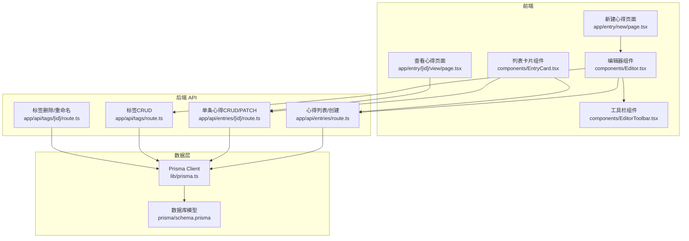
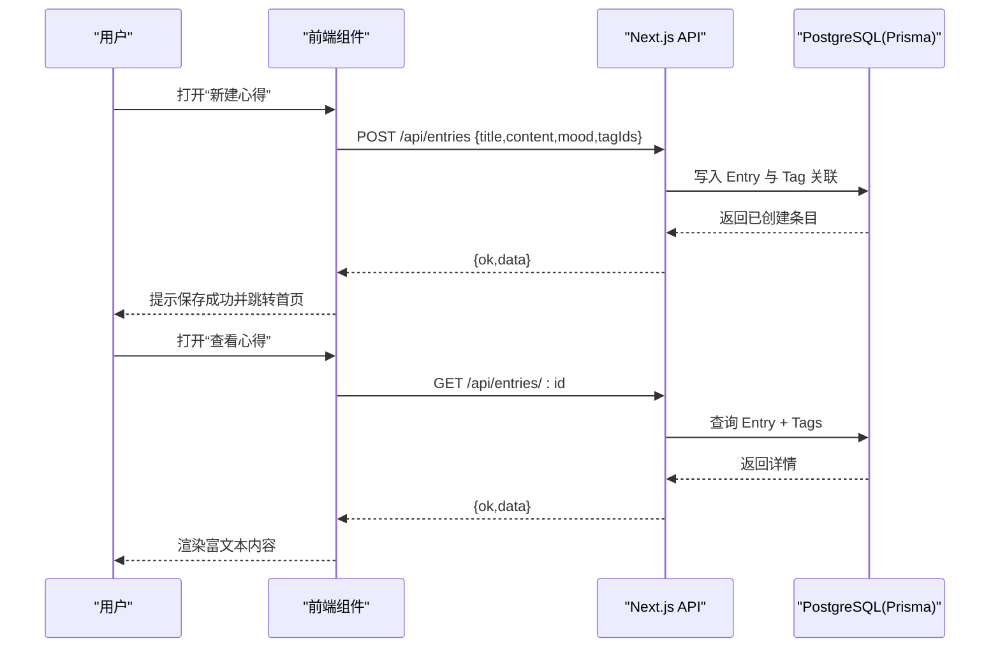
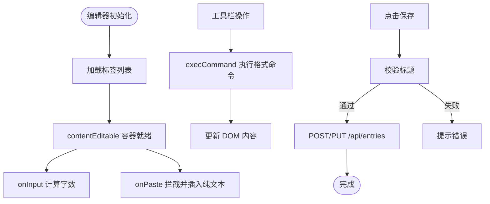
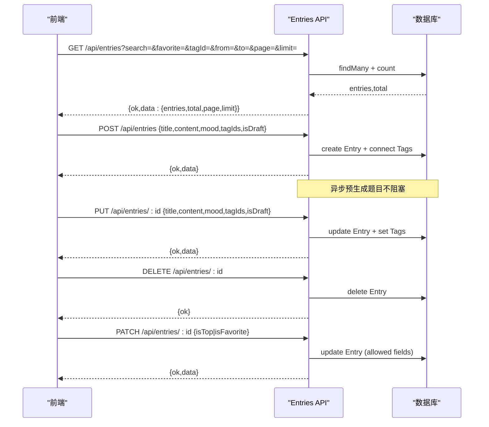
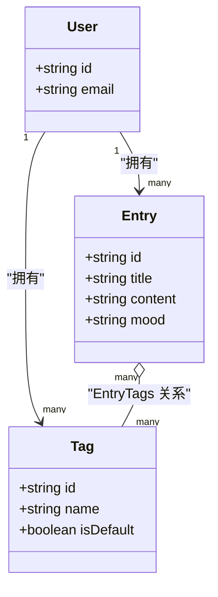
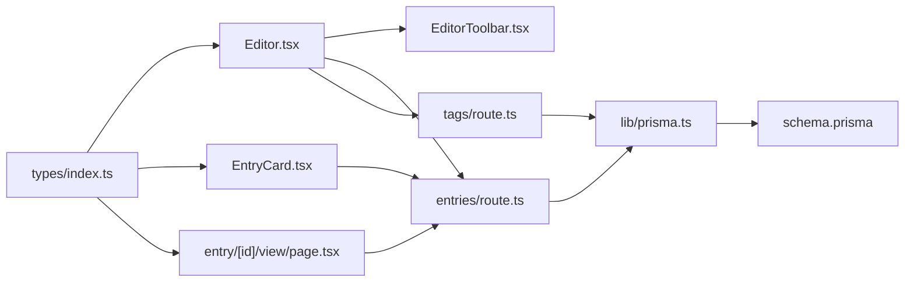

# 心得管理系统

<cite>
**本文引用的文件**
- [README.md](file://README.md)
- [Editor.tsx](file://components/Editor.tsx)
- [EditorToolbar.tsx](file://components/EditorToolbar.tsx)
- [EntryCard.tsx](file://components/EntryCard.tsx)
- [app/api/entries/route.ts](file://app/api/entries/route.ts)
- [app/api/entries/[id]/route.ts](file://app/api/entries/[id]/route.ts)
- [app/api/tags/route.ts](file://app/api/tags/route.ts)
- [app/api/tags/[id]/route.ts](file://app/api/tags/[id]/route.ts)
- [prisma/schema.prisma](file://prisma/schema.prisma)
- [types/index.ts](file://types/index.ts)
- [lib/prisma.ts](file://lib/prisma.ts)
- [app/entry/new/page.tsx](file://app/entry/new/page.tsx)
- [app/entry/[id]/view/page.tsx](file://app/entry/[id]/view/page.tsx)
</cite>

## 目录
1. [简介](#简介)
2. [项目结构](#项目结构)
3. [核心组件](#核心组件)
4. [架构总览](#架构总览)
5. [详细组件分析](#详细组件分析)
6. [依赖关系分析](#依赖关系分析)
7. [性能与可扩展性](#性能与可扩展性)
8. [故障排查指南](#故障排查指南)
9. [结论](#结论)
10. [附录：API 参考](#附录api-参考)

## 简介
本文件系统性地梳理“心芽”心得管理系统的实现，重点覆盖以下方面：
- 富文本编辑器架构：基于 contentEditable 的轻量实现、自定义工具栏能力、移动端适配策略。
- 心得 CRUD：创建、编辑、删除、查看的 API 与前端交互流程。
- 标签分类系统：默认标签与用户自定义标签的管理逻辑。
- 心情标记：数据结构与状态流转。
- 富文本格式化与样式定制方案。
- 文件上传与图片处理现状与建议。
- 搜索与筛选的实现策略。

## 项目结构
本项目采用 Next.js App Router 组织前后端代码，核心模块如下：
- 页面路由：入口页、新建心得、查看心得等。
- API 路由：心得与标签的增删改查接口。
- 组件层：编辑器、工具栏、卡片展示等。
- 数据模型：Prisma Schema 定义数据库结构。
- 类型定义：统一的前端类型约束。

图表来源
- [app/entry/new/page.tsx:1-5](file://app/entry/new/page.tsx#L1-L5)
- [components/Editor.tsx:1-192](file://components/Editor.tsx#L1-L192)
- [components/EditorToolbar.tsx:1-78](file://components/EditorToolbar.tsx#L1-L78)
- [components/EntryCard.tsx:1-138](file://components/EntryCard.tsx#L1-L138)
- [app/entry/[id]/view/page.tsx:1-245](file://app/entry/[id]/view/page.tsx#L1-L245)
- [app/api/entries/route.ts:1-163](file://app/api/entries/route.ts#L1-L163)
- [app/api/entries/[id]/route.ts:1-95](file://app/api/entries/[id]/route.ts#L1-L95)
- [app/api/tags/route.ts:1-46](file://app/api/tags/route.ts#L1-L46)
- [app/api/tags/[id]/route.ts:1-62](file://app/api/tags/[id]/route.ts#L1-L62)
- [lib/prisma.ts:1-14](file://lib/prisma.ts#L1-L14)
- [prisma/schema.prisma:1-209](file://prisma/schema.prisma#L1-L209)

章节来源
- [README.md:1-37](file://README.md#L1-L37)

## 核心组件
- 编辑器（Editor）
  - 使用 contentEditable 作为富文本容器，提供纯文本粘贴、字数统计、聚焦模式、标题输入、心情选择、标签选择与新建。
  - 通过 document.execCommand 执行加粗、斜体、下划线、插入有序/无序列表等操作；颜色选择器通过 foreColor 命令设置前景色。
  - 保存时提交 title、content（HTML）、mood、tagIds 到后端。
- 工具栏（EditorToolbar）
  - 提供返回、保存、富文本格式化工具、标签面板开关、专注模式切换、字数显示。
  - 颜色选择器以悬浮面板形式呈现，点击后调用 execCommand 设置选中内容颜色。
- 列表卡片（EntryCard）
  - 展示标题、预览、标签、心情、时间，支持收藏、置顶、删除操作。
  - 收藏/置顶通过 PATCH 接口更新 isFavorite/isTop。
- 查看页面（View Entry）
  - 加载详情并渲染 HTML 内容，提供返回、编辑、分享入口。
  - 为列表视图与详情视图分别定义 CSS 规则，保证 ul/ol/li/b/i/u 等元素一致表现。

章节来源
- [components/Editor.tsx:1-192](file://components/Editor.tsx#L1-L192)
- [components/EditorToolbar.tsx:1-78](file://components/EditorToolbar.tsx#L1-L78)
- [components/EntryCard.tsx:1-138](file://components/EntryCard.tsx#L1-L138)
- [app/entry/[id]/view/page.tsx:1-245](file://app/entry/[id]/view/page.tsx#L1-L245)

## 架构总览
整体采用前后端分离的 Next.js 应用：前端 React 组件负责交互与渲染，Next.js API Routes 提供 RESTful 接口，Prisma 客户端访问 PostgreSQL 数据库。

图表来源
- [components/Editor.tsx:115-124](file://components/Editor.tsx#L115-L124)
- [app/api/entries/route.ts:66-106](file://app/api/entries/route.ts#L66-L106)
- [app/api/entries/[id]/route.ts:6-32](file://app/api/entries/[id]/route.ts#L6-L32)
- [lib/prisma.ts:1-14](file://lib/prisma.ts#L1-L14)
- [prisma/schema.prisma:33-69](file://prisma/schema.prisma#L33-L69)

## 详细组件分析

### 富文本编辑器实现与移动端适配
- 编辑器容器
  - 使用 contentEditable 作为可编辑区域，配合 onInput 实时统计非空白字符数。
  - 通过 onPaste 拦截粘贴事件，仅插入纯文本，避免携带外部样式污染。
- 工具栏能力
  - 基础格式：加粗、斜体、下划线。
  - 列表：有序/无序列表，内置将多行文本转换为列表项的逻辑，提升输入效率。
  - 颜色：弹出颜色面板，调用 foreColor 设置前景色。
- 移动端适配
  - 工具栏横向滚动，按钮尺寸与间距适合触摸操作。
  - 专注模式下隐藏顶部工具栏，底部固定保存按钮，背景渐变过渡，减少干扰。
  - 字体大小、行高、内边距在焦点模式与普通模式间自适应。
- 样式定制
  - 编辑器内部 ul/ol/li 的缩进与间距通过 style 注入。
  - 查看页面针对 dangerouslySetInnerHTML 渲染的内容补充 list-style 与行内样式，确保一致性。

图表来源
- [components/Editor.tsx:60-124](file://components/Editor.tsx#L60-L124)
- [components/EditorToolbar.tsx:52-70](file://components/EditorToolbar.tsx#L52-L70)
- [app/entry/[id]/view/page.tsx:231-241](file://app/entry/[id]/view/page.tsx#L231-L241)

章节来源
- [components/Editor.tsx:1-192](file://components/Editor.tsx#L1-L192)
- [components/EditorToolbar.tsx:1-78](file://components/EditorToolbar.tsx#L1-L78)
- [app/entry/[id]/view/page.tsx:231-241](file://app/entry/[id]/view/page.tsx#L231-L241)

### 心得 CRUD 接口与交互
- 列表与创建
  - GET /api/entries：支持搜索、收藏过滤、标签过滤、日期范围、分页。返回条目列表与总数。
  - POST /api/entries：创建心得，若未选标签则自动连接默认标签；异步触发预生成题目（不阻塞响应）。
- 单条操作
  - GET /api/entries/:id：获取详情，包含 tags、mood、recordTime 等字段。
  - PUT /api/entries/:id：编辑心得，支持更新 title、content、mood、isDraft、tags。
  - DELETE /api/entries/:id：删除心得。
  - PATCH /api/entries/:id：部分更新，允许 isTop、isFavorite。
- 前端交互
  - 编辑器在新增或编辑时根据 entryId 决定请求路径与方法。
  - 列表卡片通过 PATCH 更新收藏/置顶状态，并在 UI 上即时反馈。

图表来源
- [app/api/entries/route.ts:8-63](file://app/api/entries/route.ts#L8-L63)
- [app/api/entries/route.ts:66-106](file://app/api/entries/route.ts#L66-L106)
- [app/api/entries/[id]/route.ts:6-32](file://app/api/entries/[id]/route.ts#L6-L32)
- [app/api/entries/[id]/route.ts:35-64](file://app/api/entries/[id]/route.ts#L35-L64)
- [app/api/entries/[id]/route.ts:66-95](file://app/api/entries/[id]/route.ts#L66-L95)

章节来源
- [app/api/entries/route.ts:1-163](file://app/api/entries/route.ts#L1-L163)
- [app/api/entries/[id]/route.ts:1-95](file://app/api/entries/[id]/route.ts#L1-L95)
- [components/EntryCard.tsx:48-62](file://components/EntryCard.tsx#L48-L62)

### 标签分类系统
- 数据模型
  - Tag 与 Entry 多对多关系，Tag 具备 isDefault 标识，唯一约束为 userId+name。
- 接口能力
  - GET /api/tags：按用户维度列出标签，附带每个标签关联的心得数量，默认标签优先排序。
  - POST /api/tags：创建标签，校验名称非空与长度限制，重复名称拒绝。
  - DELETE /api/tags/:id：删除标签前，若存在默认标签，则将使用该标签的心得补上默认标签，再删除目标标签。
  - PATCH /api/tags/:id：重命名标签，冲突时返回唯一约束错误。
- 前端集成
  - 编辑器侧拉取标签列表，支持勾选与新建，新建成功后立即加入本地列表并选中。

图表来源
- [prisma/schema.prisma:33-69](file://prisma/schema.prisma#L33-L69)
- [app/api/tags/route.ts:6-25](file://app/api/tags/route.ts#L6-L25)
- [app/api/tags/route.ts:28-46](file://app/api/tags/route.ts#L28-L46)
- [app/api/tags/[id]/route.ts:6-34](file://app/api/tags/[id]/route.ts#L6-L34)
- [app/api/tags/[id]/route.ts:36-62](file://app/api/tags/[id]/route.ts#L36-L62)

章节来源
- [app/api/tags/route.ts:1-46](file://app/api/tags/route.ts#L1-L46)
- [app/api/tags/[id]/route.ts:1-62](file://app/api/tags/[id]/route.ts#L1-L62)
- [prisma/schema.prisma:57-69](file://prisma/schema.prisma#L57-L69)

### 心情标记功能
- 数据结构
  - Entry.mood 为可选字符串，前端定义 MoodType 枚举，包括 happy、calm、excited、sad、worried。
- 交互逻辑
  - 编辑器中提供心情选择区，点击切换当前心情；保存时将 mood 提交至后端。
  - 列表卡片根据 mood 映射图标与颜色，便于快速识别。
- 存储与展示
  - 后端持久化 mood 字段；列表与详情页均返回 mood，前端据此渲染。

章节来源
- [types/index.ts:1-3](file://types/index.ts#L1-L3)
- [components/Editor.tsx:9-15](file://components/Editor.tsx#L9-L15)
- [components/EntryCard.tsx:24-30](file://components/EntryCard.tsx#L24-L30)
- [prisma/schema.prisma:33-55](file://prisma/schema.prisma#L33-L55)

### 富文本内容的格式化与样式定制
- 编辑器侧
  - 通过 execCommand 控制 bold/italic/underline/insertUnorderedList/insertOrderedList/foreColor。
  - 列表转换逻辑将多行文本转为 li 节点，提升输入体验。
  - 通过 style 注入 ul/ol/li 的缩进与间距。
- 展示侧
  - 查看页面使用 dangerouslySetInnerHTML 渲染 HTML，并通过 CSS 规范列表与行内样式，保证在不同主题下的可读性。

章节来源
- [components/Editor.tsx:69-113](file://components/Editor.tsx#L69-L113)
- [components/EditorToolbar.tsx:52-70](file://components/EditorToolbar.tsx#L52-L70)
- [app/entry/[id]/view/page.tsx:231-241](file://app/entry/[id]/view/page.tsx#L231-L241)

### 文件上传与图片处理
- 现状
  - 当前富文本基于 contentEditable 与 execCommand，未实现图片上传与附件处理。
  - 无专门的上传 API 与媒体资源表结构。
- 建议方案
  - 引入对象存储（如 S3/阿里云 OSS），前端拖拽/粘贴图片后先上传，再将  插入编辑器。
  - 后端增加媒体资源模型与上传接口，进行鉴权、大小与类型校验、压缩与转码。
  - 编辑器侧监听 paste 事件，解析 Base64 或 File 对象，调用上传接口并替换为远程 URL。

[本节为通用建议，不直接分析具体文件]

### 搜索与筛选策略
- 服务端筛选
  - 支持关键词模糊匹配（标题与内容），收藏过滤，标签过滤，日期范围过滤，分页参数。
  - 返回结果同时包含 tags 信息，便于前端展示。
- 前端交互
  - 列表页组合查询参数发起 GET 请求，根据返回的 total 与 page/limit 实现分页。
  - 标签筛选通过 tagId 参数传递，收藏筛选通过 favorite=true 传递。

章节来源
- [app/api/entries/route.ts:8-63](file://app/api/entries/route.ts#L8-L63)

## 依赖关系分析
- 组件耦合
  - Editor 依赖 EditorToolbar 与 useTheme；EntryCard 独立展示，通过回调与父级通信。
- API 与数据层
  - Entries 与 Tags 的 API 均依赖 Prisma Client，统一从 lib/prisma.ts 导出实例。
  - 数据模型集中在 prisma/schema.prisma，Entry 与 Tag 的多对多关系由 Prisma 维护。
- 类型约束
  - types/index.ts 定义了 MoodType、EntryCard、EntryDetail 等类型，统一前后端数据结构契约。

图表来源
- [components/Editor.tsx:1-192](file://components/Editor.tsx#L1-L192)
- [components/EditorToolbar.tsx:1-78](file://components/EditorToolbar.tsx#L1-L78)
- [components/EntryCard.tsx:1-138](file://components/EntryCard.tsx#L1-L138)
- [app/entry/[id]/view/page.tsx:1-245](file://app/entry/[id]/view/page.tsx#L1-L245)
- [app/api/entries/route.ts:1-163](file://app/api/entries/route.ts#L1-L163)
- [app/api/tags/route.ts:1-46](file://app/api/tags/route.ts#L1-L46)
- [lib/prisma.ts:1-14](file://lib/prisma.ts#L1-L14)
- [prisma/schema.prisma:1-209](file://prisma/schema.prisma#L1-L209)
- [types/index.ts:1-48](file://types/index.ts#L1-L48)

章节来源
- [lib/prisma.ts:1-14](file://lib/prisma.ts#L1-L14)
- [prisma/schema.prisma:1-209](file://prisma/schema.prisma#L1-L209)
- [types/index.ts:1-48](file://types/index.ts#L1-L48)

## 性能与可扩展性
- 列表查询优化
  - 使用 include 一次性加载 tags，避免 N+1 查询。
  - 通过索引（userId+recordTime、userId+isTop、userId+isFavorite、userId+isDraft）提升常见筛选与排序性能。
- 分页与限流
  - limit 上限限制为 1000，防止单次返回过大。
- 异步任务
  - 心得创建后异步预生成题目，不阻塞主响应，降低首屏延迟。
- 前端渲染
  - 列表页仅渲染纯文本预览，避免大段 HTML 带来的渲染开销。
- 可扩展点
  - 引入全文检索（如 PostgreSQL tsvector 或外部搜索引擎）以提升搜索性能。
  - 图片与附件上传需引入对象存储与 CDN，结合懒加载与缩略图策略。

章节来源
- [app/api/entries/route.ts:38-63](file://app/api/entries/route.ts#L38-L63)
- [prisma/schema.prisma:51-55](file://prisma/schema.prisma#L51-L55)
- [app/api/entries/route.ts:96-106](file://app/api/entries/route.ts#L96-L106)

## 故障排查指南
- 保存失败
  - 检查标题是否为空；确认网络连通性与鉴权是否通过。
  - 关注 toast 提示的错误信息，必要时查看浏览器控制台与服务器日志。
- 标签冲突
  - 创建或重命名标签时若出现“标签名已存在”，请修改名称或合并重复标签。
- 默认标签不可删除
  - 删除标签前会尝试为受影响的心得补上默认标签；若无默认标签，请先创建默认标签。
- 富文本样式异常
  - 检查编辑器与查看页面的 CSS 规则是否生效；确认粘贴行为是否被拦截为纯文本。
- 权限问题
  - 所有 API 均要求登录态，未认证将返回 401；请检查会话与中间件配置。

章节来源
- [app/api/entries/route.ts:66-75](file://app/api/entries/route.ts#L66-L75)
- [app/api/tags/route.ts:28-46](file://app/api/tags/route.ts#L28-L46)
- [app/api/tags/[id]/route.ts:6-34](file://app/api/tags/[id]/route.ts#L6-L34)
- [components/Editor.tsx:115-124](file://components/Editor.tsx#L115-L124)

## 结论
本系统以轻量富文本为核心，结合 Next.js API 与 Prisma 数据模型，实现了高效的心得记录、标签管理与心情标记。编辑器通过 contentEditable 与 execCommand 提供了必要的格式化能力，并在移动端进行了可用性优化。后续可在图片上传、全文检索与更丰富的样式定制方面持续演进。

## 附录：API 参考
- 心得
  - GET /api/entries
    - 查询参数：search、favorite、tagId、from、to、page、limit
    - 返回：{ ok, data: { entries, total, page, limit } }
  - POST /api/entries
    - 请求体：{ title, content, mood, tagIds, isDraft }
    - 返回：{ ok, data: Entry }
  - GET /api/entries/:id
    - 返回：{ ok, data: EntryDetail }
  - PUT /api/entries/:id
    - 请求体：{ title, content, mood, tagIds, isDraft }
    - 返回：{ ok, data: Entry }
  - DELETE /api/entries/:id
    - 返回：{ ok }
  - PATCH /api/entries/:id
    - 请求体：{ isTop?, isFavorite? }
    - 返回：{ ok, data: Entry }
- 标签
  - GET /api/tags
    - 返回：{ ok, data: TagItem[] }
  - POST /api/tags
    - 请求体：{ name }
    - 返回：{ ok, data: Tag }
  - DELETE /api/tags/:id
    - 返回：{ ok }
  - PATCH /api/tags/:id
    - 请求体：{ name }
    - 返回：{ ok, data: Tag }

章节来源
- [app/api/entries/route.ts:8-106](file://app/api/entries/route.ts#L8-L106)
- [app/api/entries/[id]/route.ts:6-95](file://app/api/entries/[id]/route.ts#L6-L95)
- [app/api/tags/route.ts:6-46](file://app/api/tags/route.ts#L6-L46)
- [app/api/tags/[id]/route.ts:6-62](file://app/api/tags/[id]/route.ts#L6-L62)