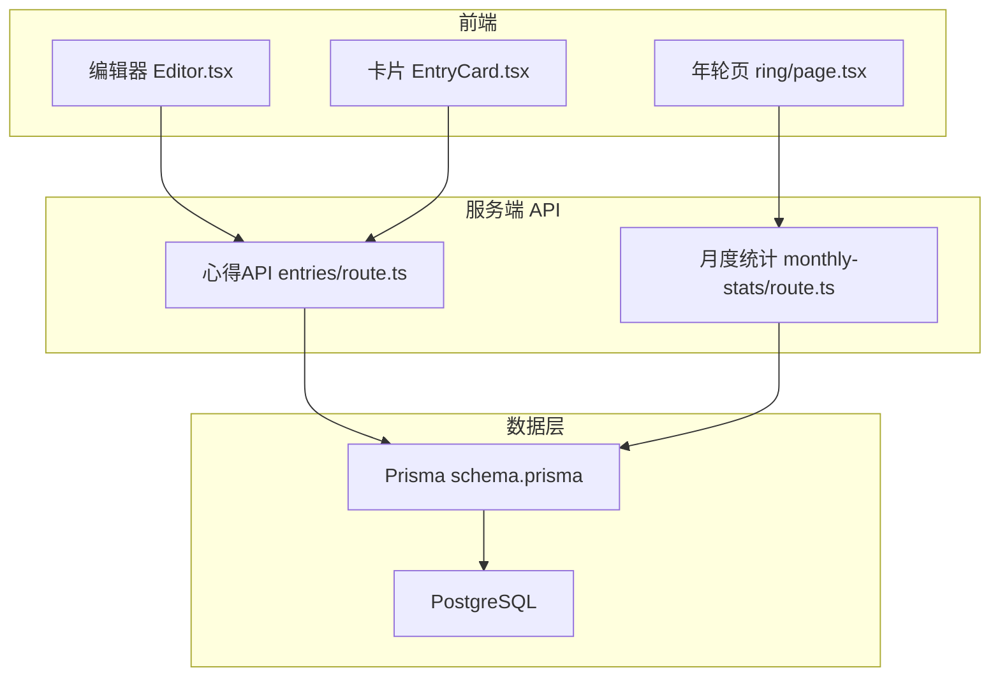
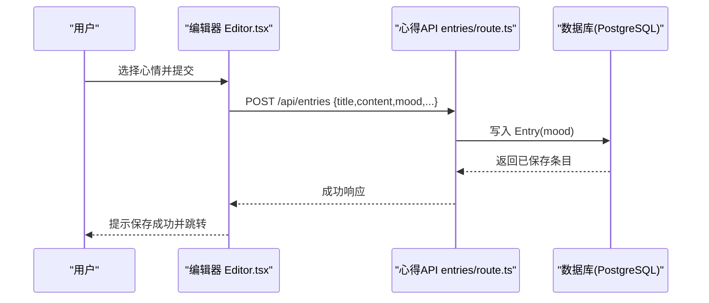
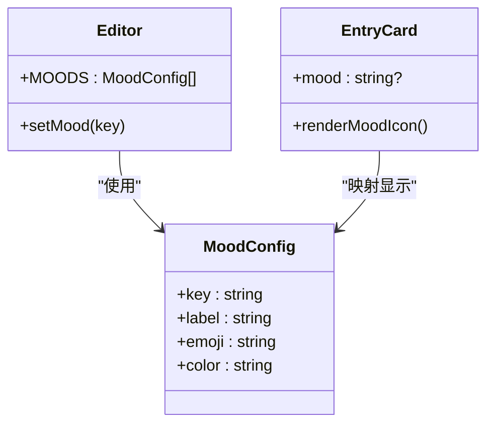
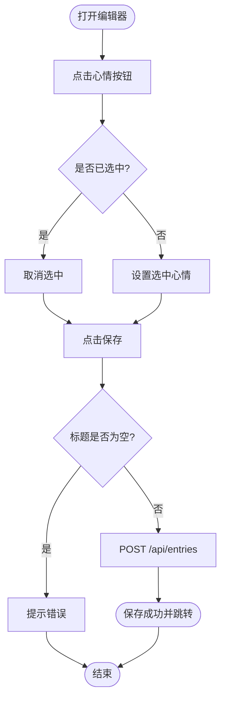
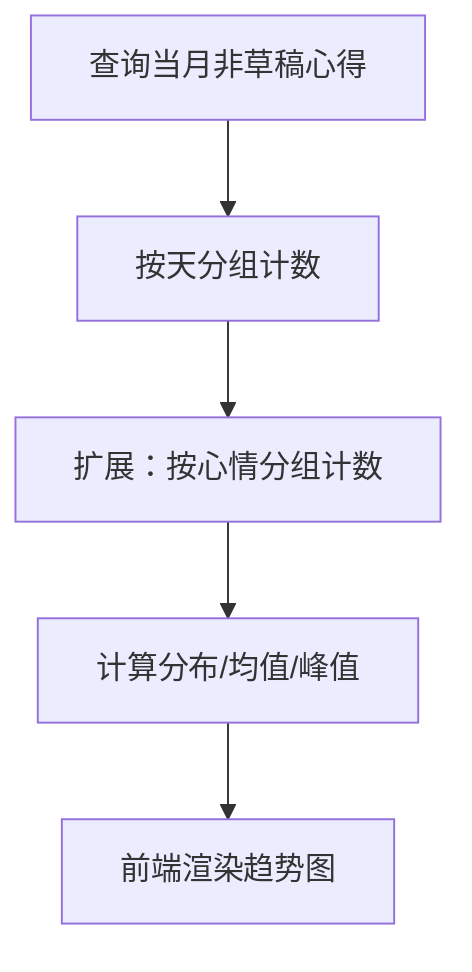
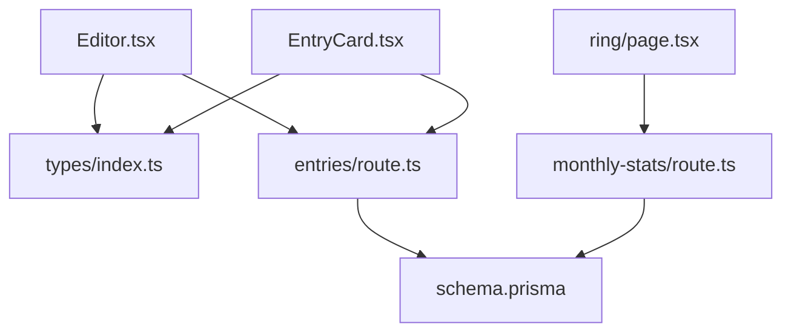

# 心情标记功能

<cite>
**本文引用的文件**   
- [schema.prisma](file://prisma/schema.prisma)
- [migration.sql](file://prisma/migrations/20260621_init/migration.sql)
- [index.ts](file://types/index.ts)
- [Editor.tsx](file://components/Editor.tsx)
- [route.ts（心得列表/创建）](file://app/api/entries/route.ts)
- [EntryCard.tsx](file://components/EntryCard.tsx)
- [page.tsx（年轮统计）](file://app/(main)/ring/page.tsx)
- [route.ts（月度统计）](file://app/api/monthly-stats/route.ts)
- [export-utils.ts](file://lib/export-utils.ts)
- [showcase/page.tsx](file://app/showcase/page.tsx)
</cite>

## 目录
1. [简介](#简介)
2. [项目结构](#项目结构)
3. [核心组件](#核心组件)
4. [架构总览](#架构总览)
5. [详细组件分析](#详细组件分析)
6. [依赖关系分析](#依赖关系分析)
7. [性能与扩展性](#性能与扩展性)
8. [故障排查指南](#故障排查指南)
9. [结论](#结论)
10. [附录](#附录)

## 简介
本文件围绕“心芽”的心情标记能力，系统性梳理其数据模型、预设心情定义与视觉表现、用户交互与状态管理、保存流程、统计与分析方案、趋势可视化设计、导出与分享，以及与AI复习系统的关联与应用场景。目标是帮助开发者与产品人员快速理解并在此基础上进行扩展与优化。

## 项目结构
心情标记贯穿前端编辑、后端持久化、展示卡片、统计页面与导出工具等模块：
- 前端编辑器提供心情选择与状态绑定
- 后端API负责接收并持久化心情字段
- 列表与详情渲染心情图标与颜色
- 统计页按天聚合记录数（可扩展为按心情维度）
- 导出工具将内容转为Markdown（可加入心情元信息）

图表来源
- [Editor.tsx:115-124](file://components/Editor.tsx#L115-L124)
- [route.ts（心得列表/创建）:66-106](file://app/api/entries/route.ts#L66-L106)
- [EntryCard.tsx:42-47](file://components/EntryCard.tsx#L42-L47)
- [page.tsx（年轮统计）:59-79](file://app/(main)/ring/page.tsx#L59-L79)
- [route.ts（月度统计）:22-51](file://app/api/monthly-stats/route.ts#L22-L51)
- [schema.prisma:33-55](file://prisma/schema.prisma#L33-L55)

章节来源
- [schema.prisma:33-55](file://prisma/schema.prisma#L33-L55)
- [migration.sql:14-27](file://prisma/migrations/20260621_init/migration.sql#L14-L27)
- [index.ts:1-18](file://types/index.ts#L1-L18)
- [Editor.tsx:9-15](file://components/Editor.tsx#L9-L15)
- [route.ts（心得列表/创建）:8-63](file://app/api/entries/route.ts#L8-L63)
- [EntryCard.tsx:42-47](file://components/EntryCard.tsx#L42-L47)
- [page.tsx（年轮统计）:1-338](file://app/(main)/ring/page.tsx#L1-L338)
- [route.ts（月度统计）:1-96](file://app/api/monthly-stats/route.ts#L1-L96)
- [export-utils.ts:1-30](file://lib/export-utils.ts#L1-L30)
- [showcase/page.tsx:14-20](file://app/showcase/page.tsx#L14-L20)

## 核心组件
- 数据模型：Entry.mood 字段用于存储心情键值；类型约束由前端类型系统保障。
- 预设心情：五种预设（开心、平静、兴奋、低落、忧虑），在编辑器与展示处统一配置。
- 交互逻辑：编辑器内点击切换选中心情，保存时随正文一并提交。
- 展示渲染：卡片根据 mood 映射到对应图标与配色。
- 统计与趋势：当前统计按天计数，可按心情维度扩展。
- 导出与分享：导出为 Markdown，可在后续版本中加入心情元信息。

章节来源
- [schema.prisma:33-55](file://prisma/schema.prisma#L33-L55)
- [index.ts:1-18](file://types/index.ts#L1-L18)
- [Editor.tsx:9-15](file://components/Editor.tsx#L9-L15)
- [EntryCard.tsx:42-47](file://components/EntryCard.tsx#L42-L47)

## 架构总览
心情标记的数据流从前端编辑器开始，经API写入数据库，再由列表与统计页面读取与呈现。

图表来源
- [Editor.tsx:115-124](file://components/Editor.tsx#L115-L124)
- [route.ts（心得列表/创建）:66-106](file://app/api/entries/route.ts#L66-L106)
- [schema.prisma:33-55](file://prisma/schema.prisma#L33-L55)

## 详细组件分析

### 数据模型与存储结构
- 实体：Entry
  - 关键字段：mood（可选字符串）、recordTime（记录时间）、isDraft（草稿标识）等
  - 索引：按 userId+recordTime 排序，便于时间轴与统计查询
- 迁移：数据库表包含 mood 列，类型为文本，允许为空
- 类型约束：前端 MoodType 限定为五种预设键值，避免非法值进入后端

复杂度与影响
- 查询复杂度：O(log N) 级别（基于索引的过滤与排序）
- 空间开销：mood 为短文本，对单条记录影响可忽略

章节来源
- [schema.prisma:33-55](file://prisma/schema.prisma#L33-L55)
- [migration.sql:14-27](file://prisma/migrations/20260621_init/migration.sql#L14-L27)
- [index.ts:1-18](file://types/index.ts#L1-L18)

### 预设心情定义与视觉表现
- 预设集合：happy、calm、excited、sad、worried
- 视觉元素：emoji、中文标签、主题色
- 一致性：编辑器与展示端使用相同配置，确保前后一致

图表来源
- [Editor.tsx:9-15](file://components/Editor.tsx#L9-L15)
- [EntryCard.tsx:42-47](file://components/EntryCard.tsx#L42-L47)
- [showcase/page.tsx:14-20](file://app/showcase/page.tsx#L14-L20)

章节来源
- [Editor.tsx:9-15](file://components/Editor.tsx#L9-L15)
- [EntryCard.tsx:42-47](file://components/EntryCard.tsx#L42-L47)
- [showcase/page.tsx:14-20](file://app/showcase/page.tsx#L14-L20)

### 心情选择交互与状态管理
- 交互流程：点击心情按钮切换选中态；再次点击取消；未选则不携带 mood 字段
- 状态管理：本地 state 维护 mood，保存时合并入请求体
- 错误处理：标题必填校验；网络异常捕获并提示

图表来源
- [Editor.tsx:115-124](file://components/Editor.tsx#L115-L124)
- [Editor.tsx:161-167](file://components/Editor.tsx#L161-L167)

章节来源
- [Editor.tsx:115-124](file://components/Editor.tsx#L115-L124)
- [Editor.tsx:161-167](file://components/Editor.tsx#L161-L167)

### 心情数据在心得保存时的处理方式
- 新建/更新：请求体包含 mood；后端写入 Entry.mood
- 默认标签：若未选择标签，自动补默认标签（不影响心情）
- 预览生成：列表接口返回 mood 字段供前端渲染

章节来源
- [route.ts（心得列表/创建）:66-106](file://app/api/entries/route.ts#L66-L106)
- [route.ts（心得列表/创建）:8-63](file://app/api/entries/route.ts#L8-L63)

### 心情统计与分析的实现方案
现状
- 现有统计按天聚合记录数，未直接按心情维度统计
- 可通过扩展月度统计接口，增加 mood 维度分组

建议实现
- 新增 mood 维度统计：按月或按周统计各心情出现次数
- 计算指标：心情分布占比、连续天数、峰值日期
- 缓存策略：对常用月份结果做短期缓存，降低重复查询压力

图表来源
- [route.ts（月度统计）:22-51](file://app/api/monthly-stats/route.ts#L22-L51)

章节来源
- [route.ts（月度统计）:22-51](file://app/api/monthly-stats/route.ts#L22-L51)

### 心情趋势图表的可视化设计方案
- 日历热力图：沿用年轮页的网格样式，按心情着色（如开心绿色、难过蓝色、忧虑灰色等）
- 折线/面积图：展示一周或一月内各心情频次变化
- 堆叠柱状图：多心情叠加对比，直观看出主导情绪
- 交互：悬停显示具体日期与数量；支持筛选心情维度

[此图为概念示意，无需代码来源]

### 心情数据的导出与分享
- 导出：当前导出为 Markdown，仅含标题、标签、时间与正文；可在导出前拼接心情元信息（如“心情：开心”）
- 分享：分享链接目前面向全部或按标签范围；未来可增加“仅分享带心情的心得”选项

章节来源
- [export-utils.ts:1-30](file://lib/export-utils.ts#L1-L30)

### 心情标记对AI复习系统的影响与应用场景
- 触发时机：非草稿心得保存后异步预生成题目（与心情无关）
- 潜在应用：
  - 以心情作为复习权重因子：低落/忧虑日期的内容提高复习优先级
  - 洞察报告维度：结合心情趋势生成个性化总结与建议
  - 题目生成提示词：在生成问题时可参考心情上下文，增强共情式引导

章节来源
- [route.ts（心得列表/创建）:96-161](file://app/api/entries/route.ts#L96-L161)

## 依赖关系分析
- 前端依赖：
  - 编辑器与卡片组件依赖 Mood 配置常量
  - 年轮页依赖月度统计API
- 后端依赖：
  - 心得API依赖 Prisma 与数据库
  - 月度统计API依赖 Prisma 与数据库
- 类型系统：
  - 前端类型约束 MoodType，保证前后端一致性

图表来源
- [Editor.tsx:9-15](file://components/Editor.tsx#L9-L15)
- [EntryCard.tsx:42-47](file://components/EntryCard.tsx#L42-L47)
- [index.ts:1-18](file://types/index.ts#L1-L18)
- [page.tsx（年轮统计）:59-79](file://app/(main)/ring/page.tsx#L59-L79)
- [route.ts（月度统计）:22-51](file://app/api/monthly-stats/route.ts#L22-L51)
- [route.ts（心得列表/创建）:8-63](file://app/api/entries/route.ts#L8-L63)
- [schema.prisma:33-55](file://prisma/schema.prisma#L33-L55)

章节来源
- [index.ts:1-18](file://types/index.ts#L1-L18)
- [route.ts（心得列表/创建）:8-63](file://app/api/entries/route.ts#L8-L63)
- [route.ts（月度统计）:22-51](file://app/api/monthly-stats/route.ts#L22-L51)
- [schema.prisma:33-55](file://prisma/schema.prisma#L33-L55)

## 性能与扩展性
- 查询优化：利用现有索引（userId+recordTime）提升时间范围查询效率
- 扩展点：
  - 在月度统计中增加 mood 分组，避免全量扫描（可考虑新增索引或物化视图）
  - 导出流程增加心情字段，保持向后兼容
- 前端渲染：心情图标与颜色通过常量映射，避免运行时解析开销

[本节为通用指导，无需代码来源]

## 故障排查指南
- 保存失败
  - 检查标题是否为空
  - 查看网络异常提示与后端返回码
- 心情未显示
  - 确认 Entry.mood 是否写入成功
  - 检查前端 Mood 配置与后端返回字段是否一致
- 统计异常
  - 核对月度统计的时间边界（北京时间）
  - 确认 isDraft=false 的过滤条件

章节来源
- [Editor.tsx:115-124](file://components/Editor.tsx#L115-L124)
- [route.ts（月度统计）:22-51](file://app/api/monthly-stats/route.ts#L22-L51)

## 结论
心情标记功能已在数据模型、交互与展示层面完成基础闭环。建议在统计与可视化方面进一步扩展 mood 维度，并结合AI复习系统引入心情权重与洞察，以提升个性化体验与学习成效。

[本节为总结，无需代码来源]

## 附录
- 预设心情清单（键值、标签、图标、颜色）
  - happy：开心，😊，暖橙色系
  - calm：平静，😌，绿色系
  - excited：兴奋，🤩，橙红色系
  - sad：低落，😔，蓝色系
  - worried：忧虑，😰，灰蓝系

章节来源
- [Editor.tsx:9-15](file://components/Editor.tsx#L9-L15)
- [showcase/page.tsx:14-20](file://app/showcase/page.tsx#L14-L20)