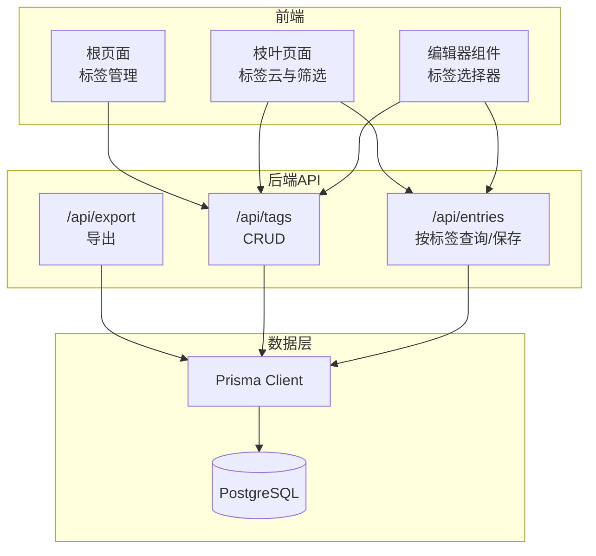
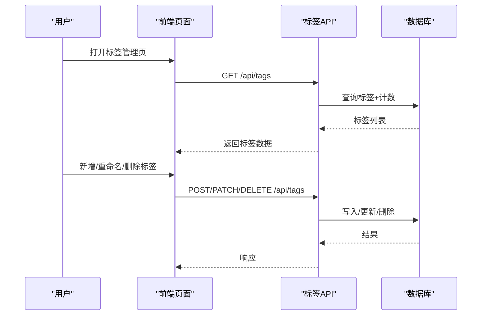
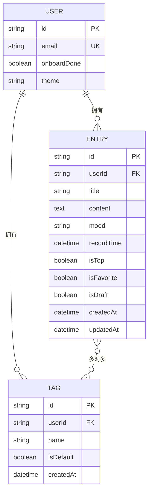
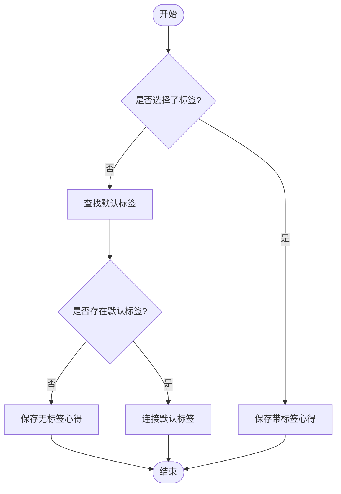
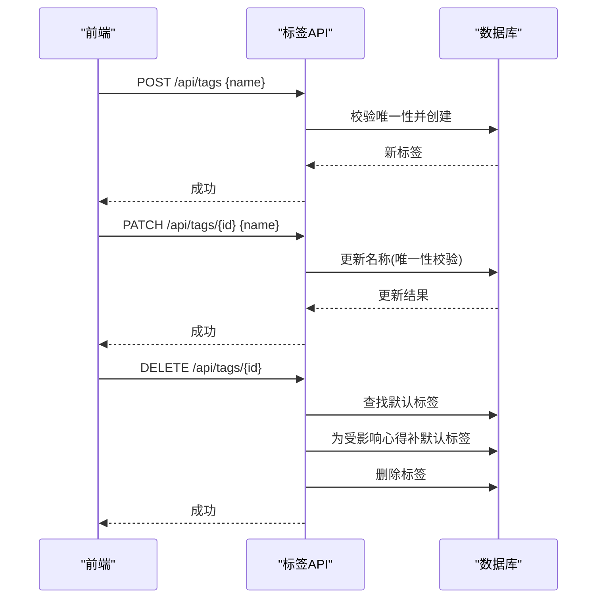
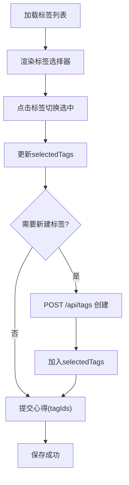
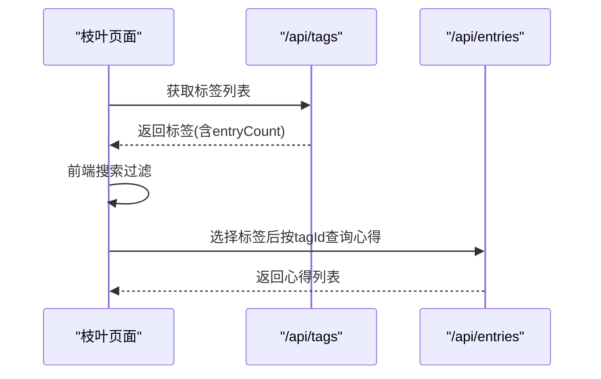
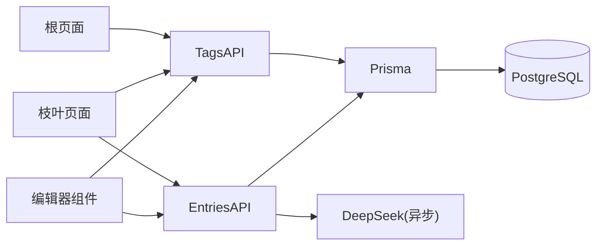

# 标签管理系统

<cite>
**本文引用的文件**   
- [prisma/schema.prisma](file://prisma/schema.prisma)
- [app/api/tags/route.ts](file://app/api/tags/route.ts)
- [app/api/tags/[id]/route.ts](file://app/api/tags/[id]/route.ts)
- [app/(main)/root/page.tsx](file://app/(main)/root/page.tsx)
- [app/(main)/leaf/page.tsx](file://app/(main)/leaf/page.tsx)
- [app/api/entries/route.ts](file://app/api/entries/route.ts)
- [components/Editor.tsx](file://components/Editor.tsx)
- [app/api/export/route.ts](file://app/api/export/route.ts)
- [lib/export-utils.ts](file://lib/export-utils.ts)
- [doc/心芽小程序设计框架v2.0.md](file://doc/心芽小程序设计框架v2.0.md)
</cite>

## 目录
1. [简介](#简介)
2. [项目结构](#项目结构)
3. [核心组件](#核心组件)
4. [架构总览](#架构总览)
5. [详细组件分析](#详细组件分析)
6. [依赖关系分析](#依赖关系分析)
7. [性能考量](#性能考量)
8. [故障排查指南](#故障排查指南)
9. [结论](#结论)
10. [附录](#附录)

## 简介
本文件为“心芽”标签管理系统的功能与实现文档，覆盖数据模型、默认标签与自定义标签的管理逻辑、创建/编辑/删除/关联操作、标签选择器 UI 与交互、搜索与过滤、导入导出方案、分类与层级扩展设计，以及标签在心得中的使用方式与性能优化策略。目标是帮助开发者与维护者快速理解并高效迭代标签系统。

## 项目结构
标签相关的前后端代码主要分布在以下位置：
- 数据库模型定义：prisma/schema.prisma
- 标签 API：app/api/tags/*
- 标签管理页面（根系）：app/(main)/root/page.tsx
- 标签浏览与筛选（枝叶）：app/(main)/leaf/page.tsx
- 心得与标签关联：app/api/entries/route.ts、components/Editor.tsx
- 导出能力：app/api/export/route.ts、lib/export-utils.ts
- 设计规范参考：doc/心芽小程序设计框架v2.0.md

图表来源
- [app/(main)/root/page.tsx](file://app/(main)/root/page.tsx)
- [app/(main)/leaf/page.tsx](file://app/(main)/leaf/page.tsx)
- [components/Editor.tsx](file://components/Editor.tsx)
- [app/api/tags/route.ts](file://app/api/tags/route.ts)
- [app/api/entries/route.ts](file://app/api/entries/route.ts)
- [app/api/export/route.ts](file://app/api/export/route.ts)
- [prisma/schema.prisma](file://prisma/schema.prisma)

章节来源
- [prisma/schema.prisma](file://prisma/schema.prisma)
- [app/api/tags/route.ts](file://app/api/tags/route.ts)
- [app/api/tags/[id]/route.ts](file://app/api/tags/[id]/route.ts)
- [app/(main)/root/page.tsx](file://app/(main)/root/page.tsx)
- [app/(main)/leaf/page.tsx](file://app/(main)/leaf/page.tsx)
- [app/api/entries/route.ts](file://app/api/entries/route.ts)
- [components/Editor.tsx](file://components/Editor.tsx)
- [app/api/export/route.ts](file://app/api/export/route.ts)
- [lib/export-utils.ts](file://lib/export-utils.ts)
- [doc/心芽小程序设计框架v2.0.md](file://doc/心芽小程序设计框架v2.0.md)

## 核心组件
- 数据模型
  - 用户 User：拥有多个 Tag 与 Entry。
  - 标签 Tag：属于用户，支持 isDefault 标记默认标签；与 Entry 多对多关联。
  - 心得 Entry：与 Tag 多对多关联，支持置顶、收藏、草稿等状态。
- 标签 API
  - GET /api/tags：返回当前用户的标签列表及每个标签的关联心得数量。
  - POST /api/tags：新建标签，校验名称非空与长度限制，重复名拒绝。
  - PATCH /api/tags/[id]：重命名标签，唯一性校验。
  - DELETE /api/tags/[id]：删除标签，若存在默认标签则自动将仅含该标签的心得补上默认标签。
- 前端页面
  - 根页面：展示标签列表，支持新增、重命名、删除，显示每标签下心得数。
  - 枝叶页面：标签云展示，支持搜索过滤，点击标签加载对应心得列表。
- 编辑器组件
  - 加载所有标签，支持多选/取消，提交时携带 tagIds。
- 心得 API
  - GET /api/entries?tagId=...：按标签筛选心得。
  - POST /api/entries：保存心得时若无标签则自动绑定默认标签。
  - PATCH /api/entries/[id]：更新心得时以 set 方式同步标签集合。
- 导出
  - 导出接口返回 Markdown 内容，包含标题、正文与标签信息。

章节来源
- [prisma/schema.prisma](file://prisma/schema.prisma)
- [app/api/tags/route.ts](file://app/api/tags/route.ts)
- [app/api/tags/[id]/route.ts](file://app/api/tags/[id]/route.ts)
- [app/(main)/root/page.tsx](file://app/(main)/root/page.tsx)
- [app/(main)/leaf/page.tsx](file://app/(main)/leaf/page.tsx)
- [components/Editor.tsx](file://components/Editor.tsx)
- [app/api/entries/route.ts](file://app/api/entries/route.ts)
- [app/api/export/route.ts](file://app/api/export/route.ts)
- [lib/export-utils.ts](file://lib/export-utils.ts)

## 架构总览
标签系统采用前后端分离的 Next.js 应用架构：前端通过 React 组件发起 fetch 请求调用服务端 API，服务端基于 Prisma 访问 PostgreSQL 数据库。标签与心得之间通过多对多关系维护，默认标签用于兜底归类与删除保护。

图表来源
- [app/(main)/root/page.tsx](file://app/(main)/root/page.tsx)
- [app/api/tags/route.ts](file://app/api/tags/route.ts)
- [app/api/tags/[id]/route.ts](file://app/api/tags/[id]/route.ts)
- [prisma/schema.prisma](file://prisma/schema.prisma)

## 详细组件分析

### 数据模型与数据库关系
- 字段要点
  - Tag：id、userId、name、isDefault、createdAt；唯一约束(userId, name)，索引(userId)。
  - Entry：id、userId、title、content、mood、recordTime、isTop、isFavorite、isDraft、createdAt、updatedAt；多对多 tags。
  - User：与 Tag、Entry 一对多关系。
- 关系说明
  - Entry 与 Tag 通过多对多关系连接，Prisma 自动生成中间表。
  - isDefault 用于标识默认标签，便于无标签时的兜底与删除保护。
- 复杂度与索引
  - 查询按 userId 过滤，已建立索引，适合大规模用户场景。
  - 标签计数通过 include _count 获取，避免额外聚合查询。

图表来源
- [prisma/schema.prisma](file://prisma/schema.prisma)

章节来源
- [prisma/schema.prisma](file://prisma/schema.prisma)

### 默认标签与用户自定义标签管理
- 默认标签
  - 创建心得时若未选择标签，后端自动关联默认标签。
  - 删除标签前，若存在默认标签且被删标签是唯一标签，则将心得补上默认标签。
  - 默认标签不可删除。
- 自定义标签
  - 支持创建、重命名、删除。
  - 名称唯一性校验（同用户），长度限制（最多20字）。
  - 删除后，仅移除该标签与心得的关联，不删除心得本身。

图表来源
- [app/api/entries/route.ts](file://app/api/entries/route.ts)

章节来源
- [app/api/entries/route.ts](file://app/api/entries/route.ts)
- [app/api/tags/[id]/route.ts](file://app/api/tags/[id]/route.ts)
- [doc/心芽小程序设计框架v2.0.md](file://doc/心芽小程序设计框架v2.0.md)

### 标签的创建、编辑、删除与关联
- 创建
  - 前端输入标签名，POST /api/tags 创建，后端校验非空与长度，重复名拒绝。
- 编辑
  - 前端进入编辑行，PATCH /api/tags/[id] 重命名，后端唯一性校验。
- 删除
  - 前端二次确认，DELETE /api/tags/[id] 删除，后端检查是否为默认标签，若是则拒绝；否则先为受影响心得补默认标签再删除。
- 关联
  - 编辑器组件加载标签列表，提交时携带 tagIds；保存或更新心得时以 set 方式同步标签集合。

图表来源
- [app/api/tags/route.ts](file://app/api/tags/route.ts)
- [app/api/tags/[id]/route.ts](file://app/api/tags/[id]/route.ts)
- [app/api/entries/route.ts](file://app/api/entries/route.ts)

章节来源
- [app/api/tags/route.ts](file://app/api/tags/route.ts)
- [app/api/tags/[id]/route.ts](file://app/api/tags/[id]/route.ts)
- [components/Editor.tsx](file://components/Editor.tsx)
- [app/api/entries/route.ts](file://app/api/entries/route.ts)

### 标签选择器的UI实现与交互逻辑
- 数据加载
  - 编辑器组件初始化时拉取 /api/tags 列表，缓存到本地状态。
- 选择与取消
  - 多选切换：选中时加入 selectedTags，取消时移除。
- 即时新建
  - 支持在编辑器内直接输入新标签名，触发创建流程后再加入选择。
- 提交
  - 保存心得时将 selectedTags 作为 tagIds 提交给后端。

图表来源
- [components/Editor.tsx](file://components/Editor.tsx)
- [app/api/tags/route.ts](file://app/api/tags/route.ts)
- [app/api/entries/route.ts](file://app/api/entries/route.ts)

章节来源
- [components/Editor.tsx](file://components/Editor.tsx)
- [app/api/tags/route.ts](file://app/api/tags/route.ts)
- [app/api/entries/route.ts](file://app/api/entries/route.ts)

### 标签的搜索与过滤
- 枝叶页面
  - 提供搜索框，前端根据输入过滤标签云（大小写不敏感）。
  - 点击标签后，调用 /api/entries?tagId=...&limit=50 加载对应心得列表。
- 根页面
  - 标签管理区域展示标签列表与计数，支持折叠展开。

图表来源
- [app/(main)/leaf/page.tsx](file://app/(main)/leaf/page.tsx)
- [app/api/tags/route.ts](file://app/api/tags/route.ts)
- [app/api/entries/route.ts](file://app/api/entries/route.ts)

章节来源
- [app/(main)/leaf/page.tsx](file://app/(main)/leaf/page.tsx)
- [app/api/entries/route.ts](file://app/api/entries/route.ts)

### 标签数据的导入导出方案
- 导出
  - 根页面提供“导出为 Markdown”按钮，调用 /api/export 接口，成功后下载 .md 文件。
  - 导出内容包含标题、正文与标签信息，便于备份与迁移。
- 导入
  - 当前仓库未提供导入接口与前端入口。可扩展方案：
    - 提供 /api/import 接口，接收 JSON 或 CSV，解析并批量创建标签与心得。
    - 前端增加导入按钮与文件选择器，支持预览与冲突处理（如重复标签合并策略）。

章节来源
- [app/(main)/root/page.tsx](file://app/(main)/root/page.tsx)
- [app/api/export/route.ts](file://app/api/export/route.ts)
- [lib/export-utils.ts](file://lib/export-utils.ts)

### 标签分类与层级管理的扩展设计
- 现状
  - 当前 Tag 模型无父级字段，不支持层级结构。
- 扩展建议
  - 在 Tag 中新增 parentId 字段，形成树形结构。
  - 新增排序字段 orderIndex，支持拖拽排序。
  - 前端在枝叶页面增加分组与折叠展示，支持按层级筛选。
  - 后端在查询与删除时递归处理子标签与关联心得。
  - 导入导出需支持层级序列化与还原。

[本节为概念性扩展设计，不直接分析具体文件]

### 标签在心得中的使用方式与性能优化策略
- 使用方式
  - 创建/编辑心得时选择标签；若无选择则自动绑定默认标签。
  - 浏览心得时可按标签筛选，支持分页与时间范围过滤。
- 性能优化
  - 查询优化：按 userId 过滤，利用索引；分页参数 limit 上限控制。
  - 计数优化：使用 include _count 减少聚合开销。
  - 前端缓存：编辑器组件缓存标签列表，减少重复请求。
  - 异步预生成：心得保存后异步生成题目，不阻塞主流程。

章节来源
- [app/api/entries/route.ts](file://app/api/entries/route.ts)
- [components/Editor.tsx](file://components/Editor.tsx)
- [app/(main)/leaf/page.tsx](file://app/(main)/leaf/page.tsx)

## 依赖关系分析
- 模块耦合
  - 前端页面依赖标签 API 与心得 API。
  - 标签 API 依赖 Prisma 与认证工具。
  - 心得 API 依赖标签与 AI 生成模块（异步）。
- 外部依赖
  - Prisma Client 与 PostgreSQL。
  - DeepSeek 接口用于预生成题目（异步）。

图表来源
- [app/(main)/root/page.tsx](file://app/(main)/root/page.tsx)
- [app/(main)/leaf/page.tsx](file://app/(main)/leaf/page.tsx)
- [components/Editor.tsx](file://components/Editor.tsx)
- [app/api/tags/route.ts](file://app/api/tags/route.ts)
- [app/api/entries/route.ts](file://app/api/entries/route.ts)
- [prisma/schema.prisma](file://prisma/schema.prisma)

章节来源
- [app/api/tags/route.ts](file://app/api/tags/route.ts)
- [app/api/entries/route.ts](file://app/api/entries/route.ts)
- [prisma/schema.prisma](file://prisma/schema.prisma)

## 性能考量
- 查询与索引
  - 标签与心得均按 userId 过滤，已有索引，适合高并发读取。
  - 标签计数使用 include _count，避免额外聚合。
- 分页与限流
  - 心得列表支持 page 与 limit，limit 上限控制防止大响应。
- 前端缓存
  - 编辑器组件缓存标签列表，减少重复网络请求。
- 异步任务
  - 心得保存后异步预生成题目，降低首屏延迟。

[本节提供通用指导，不直接分析具体文件]

## 故障排查指南
- 常见错误
  - 标签名重复：后端返回唯一性错误，前端提示“标签名已存在”。
  - 删除默认标签：后端拒绝删除，前端提示“默认标签不可删除”。
  - 未找到标签：删除或重命名时返回 404，前端提示“未找到标签”。
- 定位方法
  - 检查浏览器网络面板，查看请求与响应状态码。
  - 查看后端日志，确认 Prisma 异常码（如 P2002 表示唯一约束冲突）。
  - 验证数据库记录，确认 userId 与标签唯一性。

章节来源
- [app/api/tags/route.ts](file://app/api/tags/route.ts)
- [app/api/tags/[id]/route.ts](file://app/api/tags/[id]/route.ts)

## 结论
标签系统在数据模型、API 与前端交互方面形成了闭环：默认标签保障兜底归类，自定义标签满足个性化组织；删除保护与补默认标签机制确保数据一致性；枝叶页面的标签云与搜索提升检索效率；编辑器组件简化了标签选择与即时创建；导出能力支持数据备份。后续可考虑引入层级结构与导入功能，进一步提升组织能力与迁移便利性。

[本节为总结性内容，不直接分析具体文件]

## 附录
- 设计规范参考
  - 枝叶页规则：标签云气泡大小分级、“随笔”默认标签置底、删除补默认等。
- 相关文件路径
  - 数据模型：prisma/schema.prisma
  - 标签 API：app/api/tags/route.ts、app/api/tags/[id]/route.ts
  - 标签管理页面：app/(main)/root/page.tsx
  - 标签浏览页面：app/(main)/leaf/page.tsx
  - 心得与标签关联：app/api/entries/route.ts、components/Editor.tsx
  - 导出：app/api/export/route.ts、lib/export-utils.ts
  - 设计规范：doc/心芽小程序设计框架v2.0.md

章节来源
- [doc/心芽小程序设计框架v2.0.md](file://doc/心芽小程序设计框架v2.0.md)