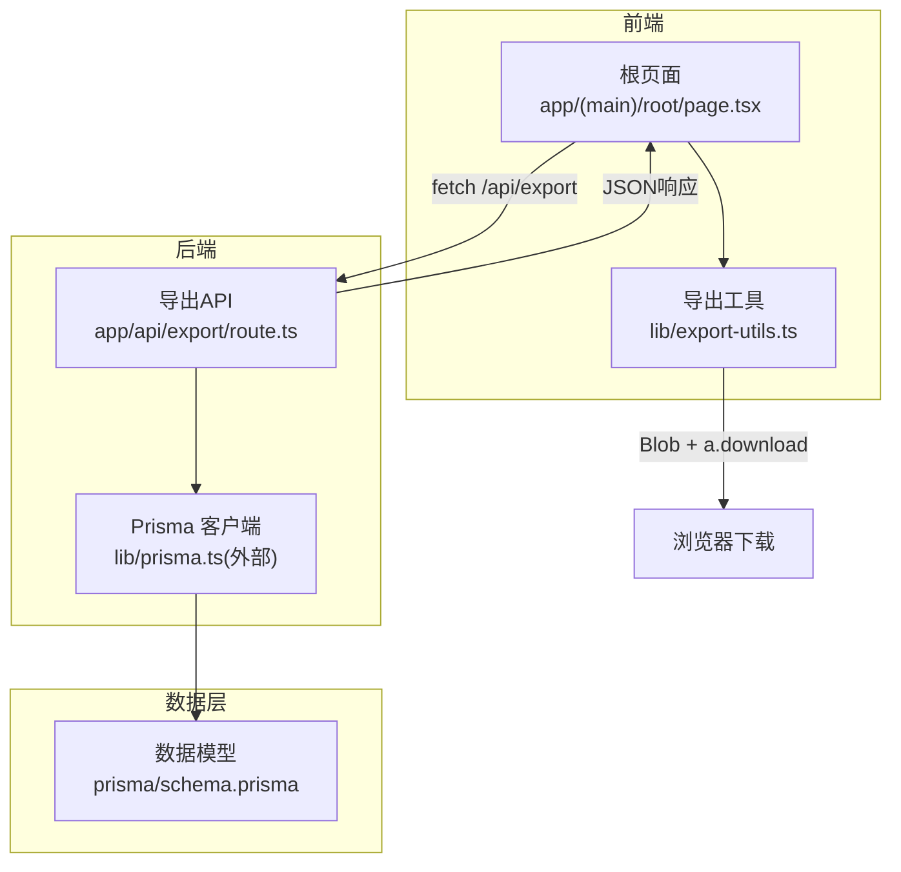
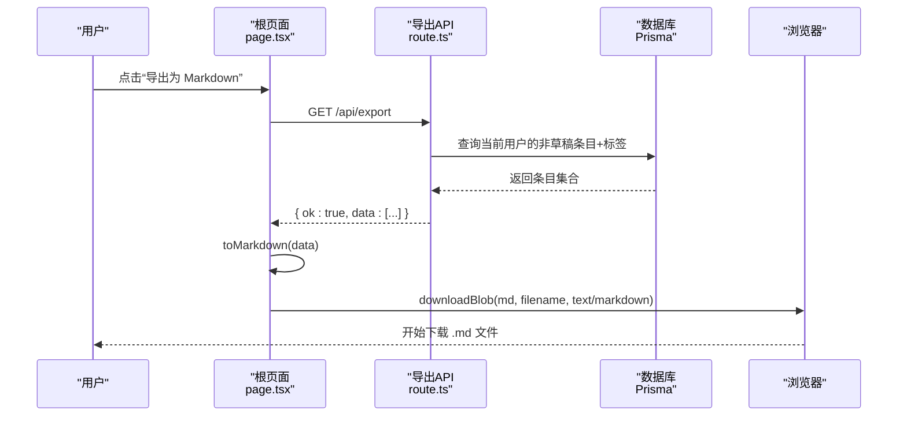
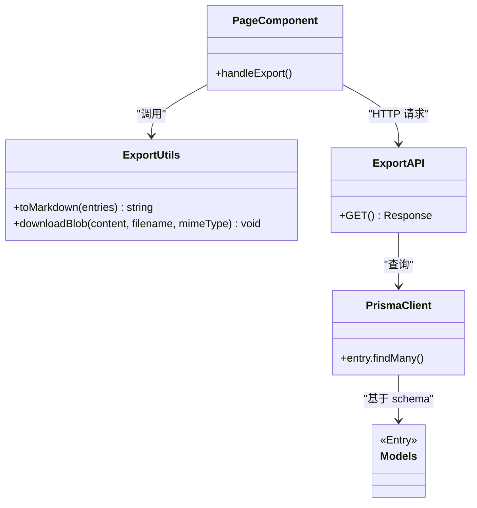

# 数据导出功能

<cite>
**本文引用的文件**
- [app/api/export/route.ts](file://app/api/export/route.ts)
- [lib/export-utils.ts](file://lib/export-utils.ts)
- [app/(main)/root/page.tsx](file://app/(main)/root/page.tsx)
- [prisma/schema.prisma](file://prisma/schema.prisma)
</cite>

## 目录
1. [简介](#简介)
2. [项目结构](#项目结构)
3. [核心组件](#核心组件)
4. [架构总览](#架构总览)
5. [详细组件分析](#详细组件分析)
6. [依赖关系分析](#依赖关系分析)
7. [性能与可扩展性](#性能与可扩展性)
8. [测试方法](#测试方法)
9. [故障排查指南](#故障排查指南)
10. [结论](#结论)

## 简介
本技术文档围绕“心芽”的数据导出能力，聚焦于 Markdown 格式导出的实现机制、数据到结构化文档的映射、浏览器端下载流程、自定义选项与配置、批量/增量导出策略、大文件处理优化以及完整性与一致性保障。文档同时提供端到端的流程图与类图，帮助读者快速理解从前端触发到后端查询、再到本地生成与下载的完整链路。

## 项目结构
导出功能涉及前后端协作：
- 前端页面负责触发导出、调用接口、将返回的结构化数据转换为 Markdown 并触发浏览器下载。
- 后端 API 负责鉴权、按用户筛选非草稿条目、组装导出数据并返回 JSON。
- 工具库提供 Markdown 转换与 Blob 下载通用能力。
- 数据库模型定义条目、标签等实体及其关系，为导出提供数据源。

图表来源
- [app/(main)/root/page.tsx:214-228](file://app/(main)/root/page.tsx#L214-L228)
- [app/api/export/route.ts:5-28](file://app/api/export/route.ts#L5-L28)
- [lib/export-utils.ts:8-29](file://lib/export-utils.ts#L8-L29)
- [prisma/schema.prisma:33-69](file://prisma/schema.prisma#L33-L69)

章节来源
- [app/(main)/root/page.tsx:214-228](file://app/(main)/root/page.tsx#L214-L228)
- [app/api/export/route.ts:5-28](file://app/api/export/route.ts#L5-L28)
- [lib/export-utils.ts:8-29](file://lib/export-utils.ts#L8-L29)
- [prisma/schema.prisma:33-69](file://prisma/schema.prisma#L33-L69)

## 核心组件
- 导出 API（服务端）
  - 职责：校验登录态；按当前用户查询非草稿条目；包含标签信息；按记录时间倒序；返回统一 JSON 结构。
  - 关键点：仅返回非草稿条目；包含 tags 名称列表；时间字段转为 ISO 字符串。
- 导出工具（前端）
  - toMarkdown：将结构化条目数组转换为 Markdown 文本，标题使用二级标题，标签以 # 前缀拼接，时间使用本地化格式化，条目间用分隔线分隔。
  - downloadBlob：创建 Blob，构造对象 URL，通过隐藏的 <a> 元素触发下载，完成后释放 URL。
- 前端页面（交互入口）
  - handleExport：点击按钮后调用 /api/export；解析 JSON；调用 toMarkdown 生成内容；调用 downloadBlob 触发下载；显示“已开始下载”提示。
- 数据模型（持久化）
  - Entry：包含标题、正文、心情、是否置顶/收藏/草稿、创建与更新时间等。
  - Tag：标签名称及所属用户，与 Entry 多对多关联。

章节来源
- [app/api/export/route.ts:5-28](file://app/api/export/route.ts#L5-L28)
- [lib/export-utils.ts:8-29](file://lib/export-utils.ts#L8-L29)
- [app/(main)/root/page.tsx:214-228](file://app/(main)/root/page.tsx#L214-L228)
- [prisma/schema.prisma:33-69](file://prisma/schema.prisma#L33-L69)

## 架构总览
下图展示了从用户点击“导出为 Markdown”到浏览器开始下载的完整时序。

图表来源
- [app/(main)/root/page.tsx:214-228](file://app/(main)/root/page.tsx#L214-L228)
- [app/api/export/route.ts:5-28](file://app/api/export/route.ts#L5-L28)
- [lib/export-utils.ts:8-29](file://lib/export-utils.ts#L8-L29)

## 详细组件分析

### 导出 API（app/api/export/route.ts）
- 鉴权：通过获取当前用户 ID，未登录直接返回 401。
- 数据读取：查询当前用户且 isDraft=false 的条目，包含 tags 的 id 和 name，按 recordTime 降序。
- 数据组装：将每条记录映射为轻量结构，包含 id、title、content、tags(name 列表)、mood、recordTime、createdAt、isTop、isFavorite。
- 响应：返回 { ok: true, data }。

潜在关注点
- 大数据量时一次性加载全部条目可能带来内存与网络开销。
- 未设置分页或游标，不适合超大规模导出。

章节来源
- [app/api/export/route.ts:5-28](file://app/api/export/route.ts#L5-L28)

### 导出工具（lib/export-utils.ts）
- toMarkdown(entries)
  - 输入：导出条目数组（含 title、content、tags、createdAt）。
  - 输出：Markdown 文本。
  - 规则：
    - 每个条目以二级标题作为标题行。
    - 标签以 #name 形式空格连接为一行。
    - 时间使用本地化格式化（年-月-日 时:分）。
    - 正文原样保留。
    - 条目之间以水平分割线分隔。
- downloadBlob(content, filename, mimeType)
  - 使用 Blob 包装内容，创建对象 URL，插入隐藏 <a> 并触发 click，随后移除节点并释放 URL。
  - MIME 类型由调用方传入，导出场景使用 text/markdown。

边界与兼容性
- 现代浏览器均支持 Blob 与 a.download。
- 超大文件可能导致内存峰值升高，建议结合流式或分片策略（见“性能与可扩展性”）。

章节来源
- [lib/export-utils.ts:8-29](file://lib/export-utils.ts#L8-L29)

### 前端交互（app/(main)/root/page.tsx）
- 触发逻辑：handleExport 在点击按钮时执行。
- 请求：GET /api/export。
- 成功分支：
  - 解析 JSON，取 data 作为 entries。
  - 生成文件名 xinya-export-YYYY-MM-DD.md。
  - 调用 toMarkdown(entries) 生成 Markdown。
  - 调用 downloadBlob(...) 触发下载。
  - 显示“已开始下载”提示并在 2 秒后消失。
- 失败分支：静默捕获异常，避免崩溃。

章节来源
- [app/(main)/root/page.tsx:214-228](file://app/(main)/root/page.tsx#L214-L228)
- [app/(main)/root/page.tsx:628-649](file://app/(main)/root/page.tsx#L628-L649)

### 数据模型与映射（prisma/schema.prisma）
- Entry 关键字段：id、userId、title、content、keyPoints、mood、recordTime、isTop、isFavorite、isDraft、createdAt、updatedAt。
- Tag 关键字段：id、userId、name、isDefault、createdAt。
- 关系：Entry 与 Tag 多对多（EntryTags），导出时只取 tag.name。

导出映射关系
- 数据库字段 → 导出结构体字段：
  - entry.title → ExportEntry.title
  - entry.content → ExportEntry.content
  - entry.tags[].name → ExportEntry.tags[].name
  - entry.createdAt → ExportEntry.createdAt（ISO 字符串）
- Markdown 渲染：
  - 二级标题 ← title
  - 标签行 ← tags 以 # 前缀拼接
  - 时间行 ← createdAt 本地化格式化
  - 正文 ← content 原样保留
  - 分隔线 ← 条目间以 --- 分隔

章节来源
- [prisma/schema.prisma:33-69](file://prisma/schema.prisma#L33-L69)
- [app/api/export/route.ts:9-25](file://app/api/export/route.ts#L9-L25)
- [lib/export-utils.ts:8-17](file://lib/export-utils.ts#L8-L17)

## 依赖关系分析
- 前端依赖
  - 页面组件依赖导出工具函数 toMarkdown 与 downloadBlob。
  - 页面发起 HTTP 请求至 /api/export。
- 后端依赖
  - API 依赖 Prisma 客户端与认证工具获取当前用户。
  - 查询 Entry 与 Tag 的关联数据。
- 数据依赖
  - 导出范围受 isDraft 过滤影响，仅导出已发布条目。

图表来源
- [app/(main)/root/page.tsx:214-228](file://app/(main)/root/page.tsx#L214-L228)
- [lib/export-utils.ts:8-29](file://lib/export-utils.ts#L8-L29)
- [app/api/export/route.ts:5-28](file://app/api/export/route.ts#L5-L28)
- [prisma/schema.prisma:33-69](file://prisma/schema.prisma#L33-L69)

章节来源
- [app/(main)/root/page.tsx:214-228](file://app/(main)/root/page.tsx#L214-L228)
- [app/api/export/route.ts:5-28](file://app/api/export/route.ts#L5-L28)
- [lib/export-utils.ts:8-29](file://lib/export-utils.ts#L8-L29)
- [prisma/schema.prisma:33-69](file://prisma/schema.prisma#L33-L69)

## 性能与可扩展性

### 大文件处理优化
- 服务端侧
  - 分页/游标导出：按 recordTime 分页，逐页返回，避免一次性加载全量数据。
  - 流式响应：在服务端构建流式响应体，边查边写，降低内存占用。
  - 压缩传输：启用 gzip/deflate 压缩，减少带宽占用。
  - 并发控制：限制同一用户并发导出任务数，防止资源耗尽。
- 客户端侧
  - 分块下载：将大文件拆分为多个 Blob 分块，逐个写入可下载链接或合并为最终文件。
  - 进度反馈：在下载过程中更新 UI 进度条与剩余大小提示。
  - 内存管理：及时释放中间对象 URL，避免内存泄漏。

### 批量导出与增量导出策略
- 批量导出
  - 服务端增加可选参数（如日期范围、标签过滤、置顶/收藏过滤），按需聚合数据。
  - 支持选择导出字段子集（如仅标题与正文），减少体积。
- 增量导出
  - 引入 lastExportedAt 标记（存储于用户设置或本地缓存），每次导出仅拉取该时间点之后的变更。
  - 服务端提供变更日志接口，客户端维护增量索引，合并生成最新 Markdown。

### 自定义选项与格式化配置
- 模板变量
  - 标题层级、标签行位置、时间格式、分隔符样式均可通过配置项切换。
- 内容过滤
  - 支持按标签、心情、是否置顶/收藏进行筛选。
- 输出格式
  - 除 Markdown 外，可扩展 JSON、CSV、ZIP 打包等多格式导出。

### 完整性与一致性保证
- 事务与快照
  - 对于跨表导出，使用数据库事务确保一致性快照。
- 幂等与去重
  - 增量导出基于时间戳或版本号，避免重复导入。
- 校验与回滚
  - 导出完成后进行基础校验（行数、必填字段），失败则回滚或重试。

[本节为通用指导，不直接分析具体文件]

## 测试方法
- 单元测试
  - 针对 toMarkdown：构造不同组合的 entries（空标签、长标题、特殊字符、HTML 内容），断言生成的 Markdown 结构与顺序。
  - 针对 downloadBlob：模拟浏览器环境，验证 Blob 创建、URL 生成与 a.download 行为。
- 集成测试
  - 调用 /api/export，验证鉴权失败返回 401；验证返回数据结构与字段；验证仅返回非草稿条目；验证 tags 名称正确。
- 端到端测试
  - 模拟用户点击导出按钮，检查网络请求、响应解析、文件下载触发与 UI 提示。
- 性能测试
  - 构造大量条目（例如 10k、100k），评估内存峰值、响应时间与文件大小。

章节来源
- [lib/export-utils.ts:8-29](file://lib/export-utils.ts#L8-L29)
- [app/api/export/route.ts:5-28](file://app/api/export/route.ts#L5-L28)
- [app/(main)/root/page.tsx:214-228](file://app/(main)/root/page.tsx#L214-L228)

## 故障排查指南
- 鉴权失败
  - 现象：返回 401 或未登录状态。
  - 排查：确认会话/令牌有效；检查 getCurrentUserId 实现。
- 数据为空
  - 现象：导出结果为空或仅有头部。
  - 排查：确认是否存在非草稿条目；检查 isDraft 过滤条件；核对 userId 是否正确。
- 标签缺失
  - 现象：导出条目无标签。
  - 排查：确认 include tags 查询是否生效；检查 Entry-Tags 关联数据。
- 下载未触发
  - 现象：点击导出无反应。
  - 排查：检查浏览器是否允许自动下载；确认 MIME 类型为 text/markdown；查看控制台错误。
- 大文件卡顿
  - 现象：导出耗时过长或页面卡顿。
  - 排查：评估数据量；考虑分页/流式导出；在前端增加进度反馈与分块处理。

章节来源
- [app/api/export/route.ts:5-28](file://app/api/export/route.ts#L5-L28)
- [lib/export-utils.ts:19-29](file://lib/export-utils.ts#L19-L29)
- [app/(main)/root/page.tsx:214-228](file://app/(main)/root/page.tsx#L214-L228)

## 结论
当前导出功能实现了从前端触发到后端查询、再到本地生成与下载的完整链路，具备清晰的职责划分与良好的扩展空间。建议在后续迭代中引入分页/流式导出、增量导出与更丰富的自定义选项，以提升在大体量数据下的性能与用户体验。同时完善测试覆盖与监控指标，确保导出数据的完整性与一致性。