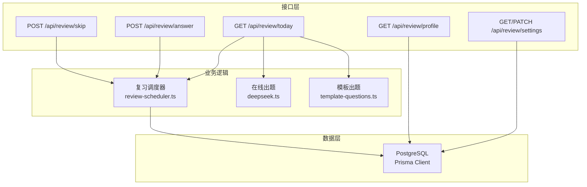
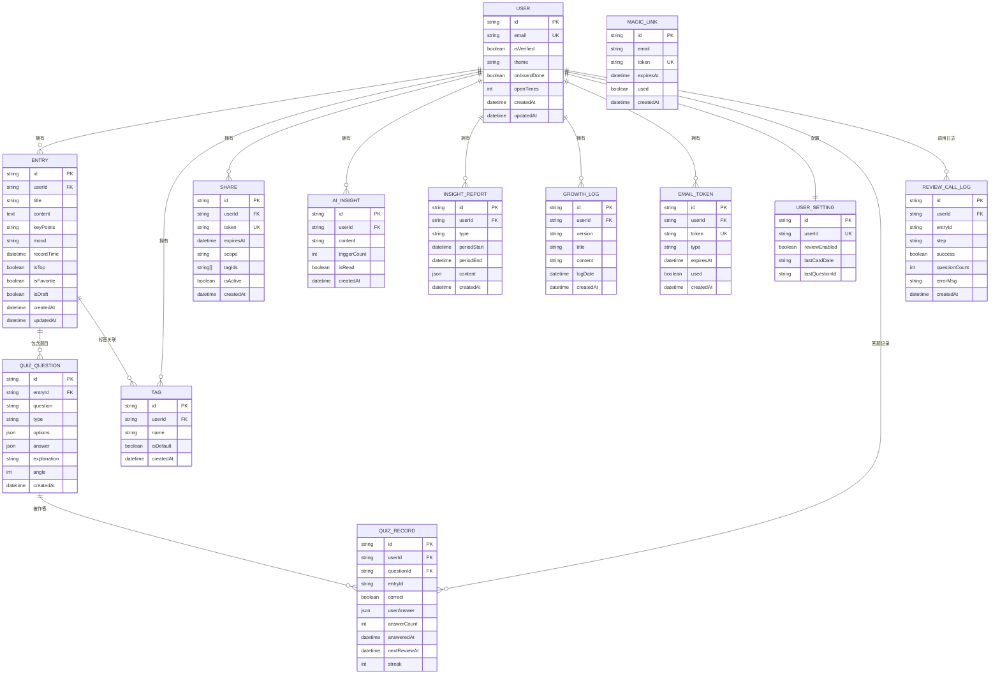
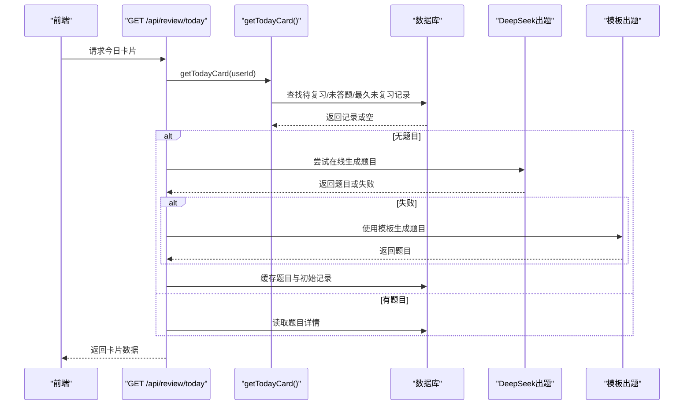
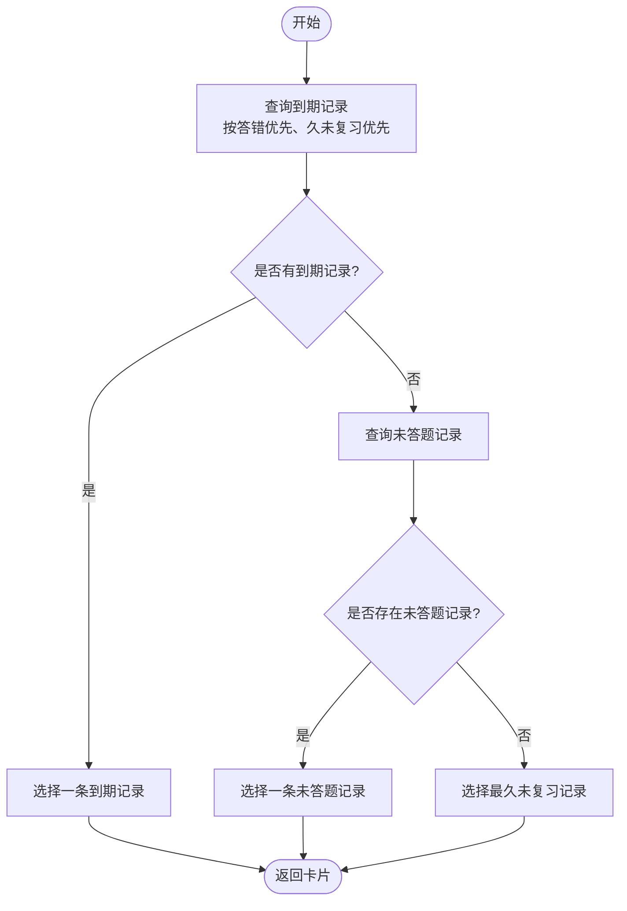
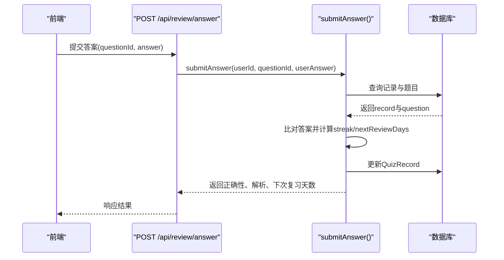
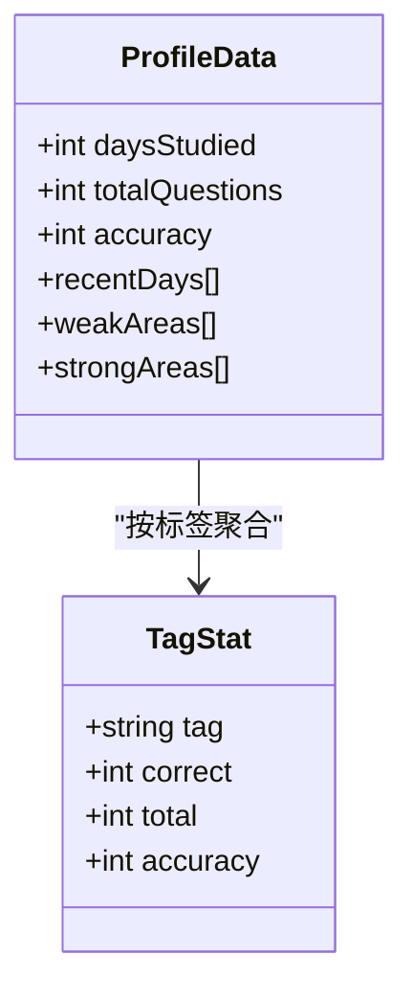
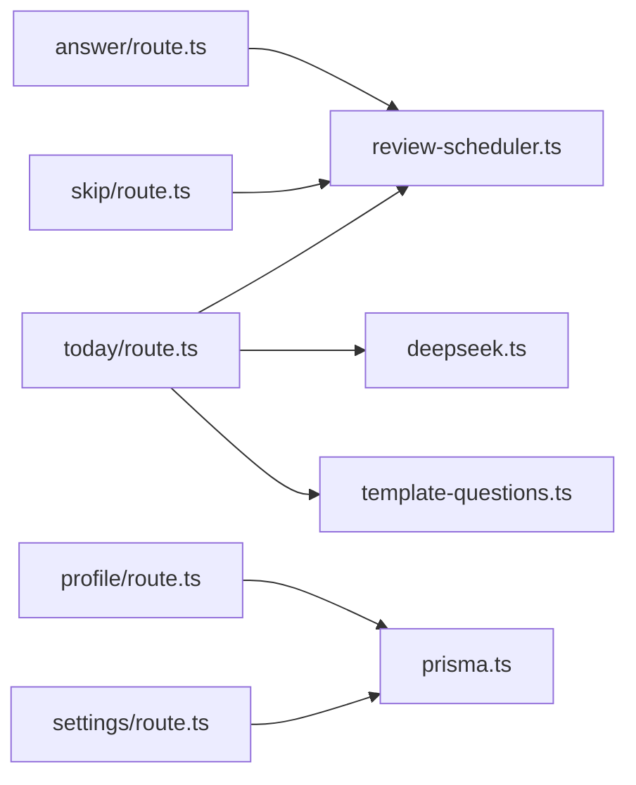

# 复习系统数据模型

<cite>
**本文引用的文件**   
- [prisma/schema.prisma](file://prisma/schema.prisma)
- [lib/review-scheduler.ts](file://lib/review-scheduler.ts)
- [app/api/review/today/route.ts](file://app/api/review/today/route.ts)
- [app/api/review/answer/route.ts](file://app/api/review/answer/route.ts)
- [app/api/review/skip/route.ts](file://app/api/review/skip/route.ts)
- [app/api/review/settings/route.ts](file://app/api/review/settings/route.ts)
- [app/api/review/profile/route.ts](file://app/api/review/profile/route.ts)
- [lib/template-questions.ts](file://lib/template-questions.ts)
- [lib/deepseek.ts](file://lib/deepseek.ts)
- [lib/prisma.ts](file://lib/prisma.ts)
</cite>

## 目录
1. [引言](#引言)
2. [项目结构](#项目结构)
3. [核心组件](#核心组件)
4. [架构总览](#架构总览)
5. [详细组件分析](#详细组件分析)
6. [依赖关系分析](#依赖关系分析)
7. [性能考虑](#性能考虑)
8. [故障排查指南](#故障排查指南)
9. [结论](#结论)
10. [附录](#附录)

## 引言
本文件面向心芽项目的AI复习系统，聚焦于数据模型与间隔重复算法的数据结构设计。重点说明以下方面：
- QuizQuestion 与 QuizRecord 两个核心表的设计与字段含义
- 题目类型（单选、多选、判断）的JSON格式约定
- 答题记录、复习计划与调度策略的数据依赖
- 复习进度追踪与效果评估的数据模型支撑
- 查询模式与性能优化建议

## 项目结构
复习系统相关代码主要分布在以下位置：
- 数据库模式定义：prisma/schema.prisma
- 复习调度与答案提交逻辑：lib/review-scheduler.ts
- 复习API路由：app/api/review/*
- 题目生成（在线与模板降级）：lib/deepseek.ts、lib/template-questions.ts
- 统计与画像：app/api/review/profile/route.ts

图表来源
- [prisma/schema.prisma](file://prisma/schema.prisma)
- [lib/review-scheduler.ts](file://lib/review-scheduler.ts)
- [app/api/review/today/route.ts](file://app/api/review/today/route.ts)
- [app/api/review/answer/route.ts](file://app/api/review/answer/route.ts)
- [app/api/review/skip/route.ts](file://app/api/review/skip/route.ts)
- [app/api/review/settings/route.ts](file://app/api/review/settings/route.ts)
- [app/api/review/profile/route.ts](file://app/api/review/profile/route.ts)
- [lib/deepseek.ts](file://lib/deepseek.ts)
- [lib/template-questions.ts](file://lib/template-questions.ts)

章节来源
- [prisma/schema.prisma](file://prisma/schema.prisma)
- [lib/review-scheduler.ts](file://lib/review-scheduler.ts)
- [app/api/review/today/route.ts](file://app/api/review/today/route.ts)
- [app/api/review/answer/route.ts](file://app/api/review/answer/route.ts)
- [app/api/review/skip/route.ts](file://app/api/review/skip/route.ts)
- [app/api/review/settings/route.ts](file://app/api/review/settings/route.ts)
- [app/api/review/profile/route.ts](file://app/api/review/profile/route.ts)
- [lib/deepseek.ts](file://lib/deepseek.ts)
- [lib/template-questions.ts](file://lib/template-questions.ts)

## 核心组件
本节聚焦复习系统的核心数据模型与关键流程。

### 数据模型概览（ER图）

图表来源
- [prisma/schema.prisma](file://prisma/schema.prisma)

章节来源
- [prisma/schema.prisma](file://prisma/schema.prisma)

### 核心表设计要点
- QuizQuestion
  - 作用：存储由AI或模板生成的题目元数据，包括题干、题型、选项、标准答案、解析、角度序号等。
  - 关键字段：question、type、options、answer、explanation、angle。
  - JSON字段：options为字符串数组；answer为数字索引数组，表示正确选项的索引集合。
  - 关系：属于Entry，被QuizRecord引用。

- QuizRecord
  - 作用：记录用户对某道题的每次作答结果与复习计划。
  - 关键字段：correct、userAnswer、answerCount、answeredAt、nextReviewAt、streak。
  - 时间字段：answeredAt为本次作答时间；nextReviewAt为下次复习时间。
  - 计数与连续：answerCount累计作答次数；streak表示连续答对的“指数间隔”级数。
  - 关系：属于User和Question，并携带entryId便于快速定位内容。

- UserSetting
  - 作用：用户复习开关与卡片展示控制。
  - 关键字段：reviewEnabled、lastCardDate、lastQuestionId。

- ReviewCallLog
  - 作用：记录题目生成链路（在线生成、缓存命中、模板降级等），用于可观测性与问题回溯。

章节来源
- [prisma/schema.prisma](file://prisma/schema.prisma)

## 架构总览
复习系统的关键流程包括：获取今日卡片、生成题目（在线或模板）、提交答案、更新复习计划、学习画像统计。

图表来源
- [app/api/review/today/route.ts](file://app/api/review/today/route.ts)
- [lib/review-scheduler.ts](file://lib/review-scheduler.ts)
- [lib/deepseek.ts](file://lib/deepseek.ts)
- [lib/template-questions.ts](file://lib/template-questions.ts)

## 详细组件分析

### 间隔重复算法的数据结构与实现
- 数据结构
  - QuizRecord.streak：连续答对次数，作为指数间隔的幂次。
  - QuizRecord.nextReviewAt：根据streak计算出的下次复习日期。
  - QuizRecord.answeredAt：最近一次作答时间，用于统计与排序。
  - QuizRecord.correct：本次作答是否正确。
  - QuizRecord.userAnswer：用户答案快照，便于复盘与统计。

- 复习计划计算
  - 若回答正确：streak+1，nextReviewDays=2^streak（即1→2→4→8…）。
  - 若回答错误：streak重置为0，nextReviewDays=1。
  - 新nextReviewAt = 当前时间 + nextReviewDays天。

- 调度优先级
  - 优先选择已到期且答错的记录。
  - 其次选择已到期但正确的记录。
  - 若无到期题，则优先选择尚未答题的记录。
  - 最后回退到最久未复习的记录。

图表来源
- [lib/review-scheduler.ts](file://lib/review-scheduler.ts)

章节来源
- [lib/review-scheduler.ts](file://lib/review-scheduler.ts)

### 题目类型与JSON格式设计
- 支持的题型
  - single：单选题，answer为单元素索引数组，如[0]。
  - multiple：多选题，answer为多元素索引数组，如[0,2]。
  - truefalse：判断题，options长度为2，answer为[0]或[1]。

- 字段约定
  - options：字符串数组，长度通常为4（单选/多选）或2（判断）。
  - answer：数字索引数组，表示正确选项在options中的位置。
  - explanation：解析文本，用于答题后反馈。
  - type：字符串枚举值，限定为single/multiple/truefalse。

- 生成来源
  - 在线生成：通过DeepSeek接口，返回结构化JSON。
  - 模板降级：当在线生成失败时，使用本地模板生成基础题目与要点总结。

章节来源
- [lib/deepseek.ts](file://lib/deepseek.ts)
- [lib/template-questions.ts](file://lib/template-questions.ts)

### 答题记录与复习计划更新
- 提交答案流程
  - 校验参数（questionId、answer）。
  - 匹配正确答案（比较userAnswer与标准answer的集合相等性）。
  - 计算streak与nextReviewDays，更新nextReviewAt。
  - 写入QuizRecord（correct、userAnswer、answerCount自增、answeredAt、streak）。

图表来源
- [app/api/review/answer/route.ts](file://app/api/review/answer/route.ts)
- [lib/review-scheduler.ts](file://lib/review-scheduler.ts)

章节来源
- [app/api/review/answer/route.ts](file://app/api/review/answer/route.ts)
- [lib/review-scheduler.ts](file://lib/review-scheduler.ts)

### 复习时间调度算法的数据依赖关系
- 输入依赖
  - UserSetting.reviewEnabled：是否开启拾遗功能。
  - UserSetting.lastCardDate：防止同一天重复弹出卡片。
  - QuizRecord.nextReviewAt：决定到期与优先级。
  - QuizRecord.answeredAt：用于未答题筛选与历史统计。

- 输出影响
  - 更新UserSetting.lastCardDate与lastQuestionId。
  - 更新QuizRecord.nextReviewAt与streak。
  - 写入ReviewCallLog以记录生成链路。

章节来源
- [app/api/review/today/route.ts](file://app/api/review/today/route.ts)
- [lib/review-scheduler.ts](file://lib/review-scheduler.ts)

### 复习进度追踪与效果评估的数据模型支持
- 学习画像统计
  - 学习天数：基于QuizRecord.answeredAt去重计数。
  - 总答题次数：聚合answerCount。
  - 正确率：按记录条数计算正确比例。
  - 近5日趋势：按answeredAt分组统计每日正确与总数。
  - 标签维度准确率：将题目关联至Entry与Tag，按标签聚合正确与总数。
  - 薄弱/优势领域：基于标签准确率阈值（<60%薄弱，≥80%掌握良好）进行划分，并可调用AI进行分析。

图表来源
- [app/api/review/profile/route.ts](file://app/api/review/profile/route.ts)

章节来源
- [app/api/review/profile/route.ts](file://app/api/review/profile/route.ts)

## 依赖关系分析
- 模块耦合
  - today路由依赖调度器与出题模块（在线/模板），并在必要时持久化题目与初始记录。
  - answer路由仅依赖调度器的答案提交逻辑。
  - profile路由直接聚合QuizRecord与Question/Entry/Tag数据进行统计。
  - settings路由管理UserSetting，控制复习开关与门槛。

- 外部依赖
  - DeepSeek在线出题：超时与重试机制，失败时降级到模板。
  - Prisma Client：统一数据库访问入口。

图表来源
- [app/api/review/today/route.ts](file://app/api/review/today/route.ts)
- [app/api/review/answer/route.ts](file://app/api/review/answer/route.ts)
- [app/api/review/profile/route.ts](file://app/api/review/profile/route.ts)
- [app/api/review/settings/route.ts](file://app/api/review/settings/route.ts)
- [app/api/review/skip/route.ts](file://app/api/review/skip/route.ts)
- [lib/review-scheduler.ts](file://lib/review-scheduler.ts)
- [lib/deepseek.ts](file://lib/deepseek.ts)
- [lib/template-questions.ts](file://lib/template-questions.ts)
- [lib/prisma.ts](file://lib/prisma.ts)

章节来源
- [app/api/review/today/route.ts](file://app/api/review/today/route.ts)
- [app/api/review/answer/route.ts](file://app/api/review/answer/route.ts)
- [app/api/review/profile/route.ts](file://app/api/review/profile/route.ts)
- [app/api/review/settings/route.ts](file://app/api/review/settings/route.ts)
- [app/api/review/skip/route.ts](file://app/api/review/skip/route.ts)
- [lib/review-scheduler.ts](file://lib/review-scheduler.ts)
- [lib/deepseek.ts](file://lib/deepseek.ts)
- [lib/template-questions.ts](file://lib/template-questions.ts)
- [lib/prisma.ts](file://lib/prisma.ts)

## 性能考虑
- 索引与查询优化
  - QuizRecord上已有userId+nextReviewAt与userId+questionId复合索引，适合按用户与到期时间、题目维度的高频查询。
  - Entry上针对userId与isTop/isFavorite/isDraft的索引有助于列表与筛选。
  - 建议在Profile统计中增加按answeredAt的索引，以提升按天聚合的性能。

- 批量与并行
  - 今日卡片生成路径中，先查到期与未答题，再按需生成题目，减少不必要的AI调用。
  - 在线出题设置超时与重试，避免长时间阻塞；失败时快速降级到模板。

- 存储与清理
  - ReviewCallLog保留最近30条，避免日志膨胀。
  - 题目生成成功后立即缓存，避免重复生成。

- 计算复杂度
  - 间隔重复计算为O(1)，主要开销在数据库查询与AI调用。
  - 画像统计为线性扫描records并按天/标签聚合，时间复杂度O(n)。

[本节为通用性能指导，不直接分析具体文件]

## 故障排查指南
- 常见问题
  - 未登录或权限不足：检查认证中间件与getCurrentUserId返回值。
  - 参数不完整：提交答案时需确保questionId与answer存在。
  - 题目不存在：确认questionId有效且属于当前用户。
  - 在线生成失败：查看ReviewCallLog.step是否为online-retry或template-fallback，并检查DeepSeek返回JSON是否合法。
  - 复习开关限制：开启复习需累计心得达到一定数量，否则返回错误。

- 日志与可观测性
  - ReviewCallLog记录step（pre-generate、cache-hit、online-retry、template-fallback）、success、questionCount与errorMsg，便于定位问题。
  - 控制台日志提供关键路径的调试信息（如生成题目数量、缓存命中情况）。

章节来源
- [app/api/review/answer/route.ts](file://app/api/review/answer/route.ts)
- [app/api/review/today/route.ts](file://app/api/review/today/route.ts)
- [app/api/review/settings/route.ts](file://app/api/review/settings/route.ts)
- [lib/review-scheduler.ts](file://lib/review-scheduler.ts)

## 结论
复习系统的数据模型围绕QuizQuestion与QuizRecord构建，结合UserSetting与ReviewCallLog形成完整的复习闭环。间隔重复算法通过streak与nextReviewAt驱动复习节奏，配合在线出题与模板降级保障可用性。统计与画像模块利用现有数据模型提供多维度的学习效果评估。整体架构清晰、扩展性强，具备较好的性能与可维护性。

[本节为总结性内容，不直接分析具体文件]

## 附录

### 查询模式指导
- 获取今日卡片
  - 条件：userId、nextReviewAt<=now、answeredAt为空或最久未复习。
  - 排序：答错优先、久未复习优先。
  - 参考路径：[app/api/review/today/route.ts](file://app/api/review/today/route.ts)、[lib/review-scheduler.ts](file://lib/review-scheduler.ts)

- 提交答案
  - 条件：userId、questionId、answer。
  - 操作：更新correct、userAnswer、answerCount、answeredAt、nextReviewAt、streak。
  - 参考路径：[app/api/review/answer/route.ts](file://app/api/review/answer/route.ts)、[lib/review-scheduler.ts](file://lib/review-scheduler.ts)

- 跳过今日卡片
  - 操作：更新UserSetting.lastCardDate为当天。
  - 参考路径：[app/api/review/skip/route.ts](file://app/api/review/skip/route.ts)、[lib/review-scheduler.ts](file://lib/review-scheduler.ts)

- 复习设置
  - 读取：UserSetting.reviewEnabled与Entry数量。
  - 更新：开启复习需满足门槛，从关闭变为开启时重置lastCardDate。
  - 参考路径：[app/api/review/settings/route.ts](file://app/api/review/settings/route.ts)

- 学习画像
  - 聚合：daysStudied、totalQuestions、accuracy、recentDays、tagStats。
  - 分析：按标签准确率阈值划分薄弱/优势领域，可选AI增强分析。
  - 参考路径：[app/api/review/profile/route.ts](file://app/api/review/profile/route.ts)

章节来源
- [app/api/review/today/route.ts](file://app/api/review/today/route.ts)
- [app/api/review/answer/route.ts](file://app/api/review/answer/route.ts)
- [app/api/review/skip/route.ts](file://app/api/review/skip/route.ts)
- [app/api/review/settings/route.ts](file://app/api/review/settings/route.ts)
- [app/api/review/profile/route.ts](file://app/api/review/profile/route.ts)
- [lib/review-scheduler.ts](file://lib/review-scheduler.ts)