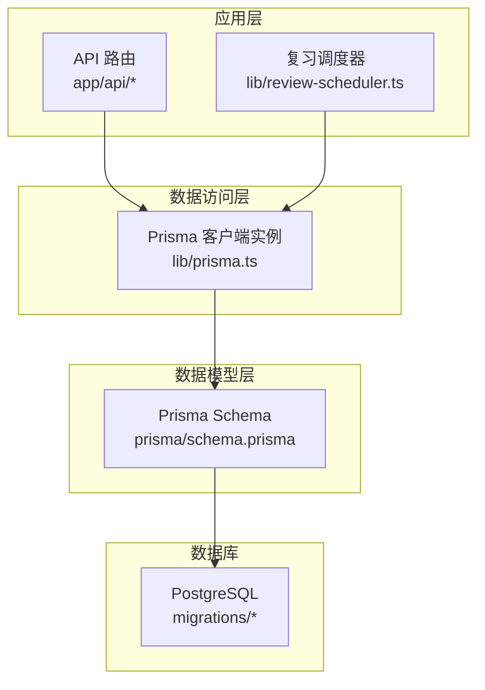
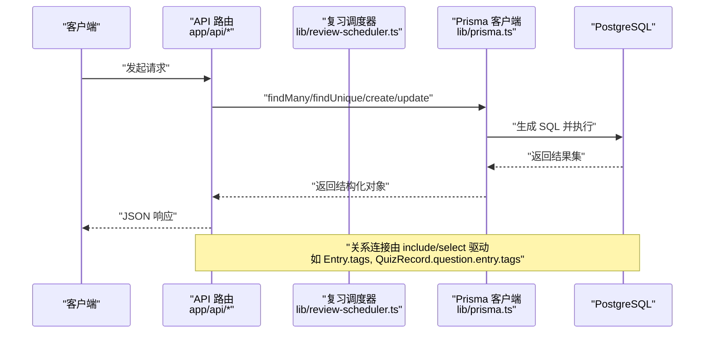
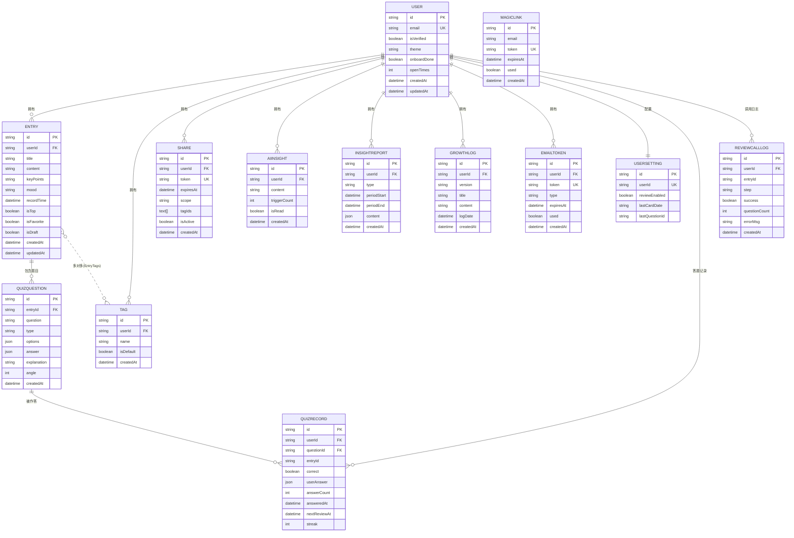
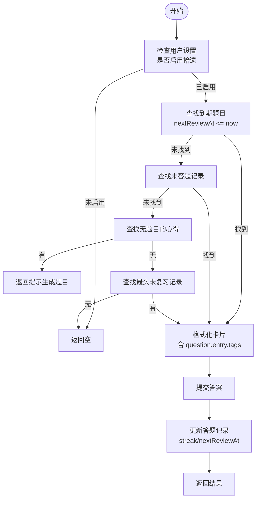
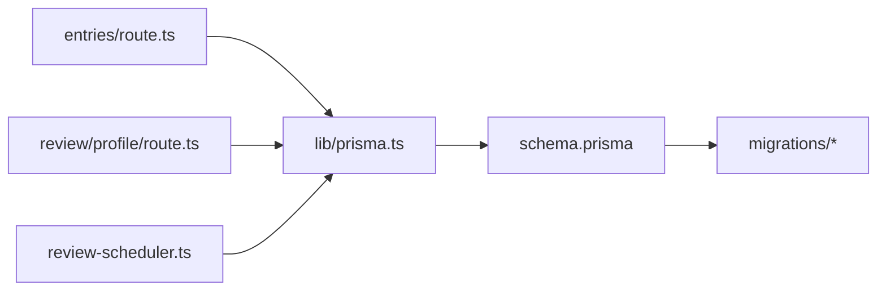

# 数据关系映射

<cite>
**本文引用的文件**   
- [prisma/schema.prisma](file://prisma/schema.prisma)
- [lib/prisma.ts](file://lib/prisma.ts)
- [app/api/entries/route.ts](file://app/api/entries/route.ts)
- [app/api/review/profile/route.ts](file://app/api/review/profile/route.ts)
- [lib/review-scheduler.ts](file://lib/review-scheduler.ts)
- [prisma/migrations/20260621_init/migration.sql](file://prisma/migrations/20260621_init/migration.sql)
</cite>

## 目录
1. [简介](#简介)
2. [项目结构](#项目结构)
3. [核心组件](#核心组件)
4. [架构总览](#架构总览)
5. [详细组件分析](#详细组件分析)
6. [依赖分析](#依赖分析)
7. [性能考虑](#性能考虑)
8. [故障排查指南](#故障排查指南)
9. [结论](#结论)
10. [附录：迁移与变更处理](#附录：迁移与变更处理)

## 简介
本文件围绕心芽项目的 Prisma ORM 数据模型，系统性梳理实体间关系（一对一、一对多、多对多）、外键约束与级联删除策略、复杂查询的连接方式与性能优化、反向引用配置与使用、最佳实践与常见陷阱，并给出可视化关系图与典型查询示例路径。目标是帮助开发者在理解现有实现的基础上，安全高效地进行扩展与维护。

## 项目结构
本项目采用 Next.js App Router + Prisma 的架构。数据库模型定义集中于 schema.prisma；Prisma Client 单例通过 lib/prisma.ts 暴露；业务 API 路由位于 app/api 下；复习调度逻辑位于 lib/review-scheduler.ts；数据库迁移脚本位于 prisma/migrations。

图表来源
- [lib/prisma.ts:1-14](file://lib/prisma.ts#L1-L14)
- [prisma/schema.prisma:1-209](file://prisma/schema.prisma#L1-L209)
- [prisma/migrations/20260621_init/migration.sql:1-114](file://prisma/migrations/20260621_init/migration.sql#L1-L114)

章节来源
- [lib/prisma.ts:1-14](file://lib/prisma.ts#L1-L14)
- [prisma/schema.prisma:1-209](file://prisma/schema.prisma#L1-L209)

## 核心组件
- 数据模型与关系定义：集中在 prisma/schema.prisma，涵盖用户、心得、标签、分享、AI洞察、成长日志、邮件令牌、魔法链接、测验题目与记录、用户设置、复习调用日志等实体及其关系。
- Prisma 客户端：lib/prisma.ts 提供全局单例，开发环境开启 query/error/warn 日志，生产仅 error。
- 关系查询示例：
  - 列表分页与关联字段裁剪：app/api/entries/route.ts
  - 深度嵌套 include 获取画像统计：app/api/review/profile/route.ts
  - 复习卡片选择与更新：lib/review-scheduler.ts

章节来源
- [prisma/schema.prisma:10-209](file://prisma/schema.prisma#L10-L209)
- [lib/prisma.ts:1-14](file://lib/prisma.ts#L1-L14)
- [app/api/entries/route.ts:1-163](file://app/api/entries/route.ts#L1-L163)
- [app/api/review/profile/route.ts:1-179](file://app/api/review/profile/route.ts#L1-L179)
- [lib/review-scheduler.ts:1-225](file://lib/review-scheduler.ts#L1-L225)

## 架构总览
下图展示从 API 到数据库的关系型数据流，以及关键关系连接点。

图表来源
- [app/api/entries/route.ts:38-47](file://app/api/entries/route.ts#L38-L47)
- [app/api/review/profile/route.ts:87-104](file://app/api/review/profile/route.ts#L87-L104)
- [lib/review-scheduler.ts:56-72](file://lib/review-scheduler.ts#L56-L72)
- [lib/prisma.ts:1-14](file://lib/prisma.ts#L1-L14)

## 详细组件分析

### 数据模型与关系概览
- 一对一
  - User ↔ UserSetting：User.settings 为可选的一对一关系，UserSetting.userId 唯一。
- 一对多
  - User → Entry、Tag、Share、AiInsight、InsightReport、GrowthLog、EmailToken、QuizRecord、ReviewCallLog
  - Entry → QuizQuestion
  - QuizQuestion → QuizRecord
- 多对多
  - Entry ↔ Tag：通过命名关系“EntryTags”建立中间表 _EntryTags。

图表来源
- [prisma/schema.prisma:10-209](file://prisma/schema.prisma#L10-L209)

章节来源
- [prisma/schema.prisma:10-209](file://prisma/schema.prisma#L10-L209)

### 一对一关系：User ↔ UserSetting
- 定义要点
  - User.settings 为可选一对一，UserSetting.userId 唯一，形成强一致的用户配置绑定。
- 反向引用
  - 通过 User.settings 可直接访问用户设置；反之通过 UserSetting.user 可回指用户。
- 典型用法
  - 读取用户设置：findUnique(UserSetting, where: { userId })
  - 写入或更新：upsert(UserSetting, where: { userId }, create: {...}, update: {...})
- 注意事项
  - 删除 User 时，UserSetting 随 onDelete: Cascade 级联删除。

章节来源
- [prisma/schema.prisma:186-194](file://prisma/schema.prisma#L186-L194)
- [lib/review-scheduler.ts:48-52](file://lib/review-scheduler.ts#L48-L52)

### 一对多关系：User → Entry / QuizQuestion → QuizRecord
- 定义要点
  - Entry.userId 指向 User.id，onDelete: Cascade。
  - QuizRecord.userId 指向 User.id，onDelete: Cascade。
  - QuizRecord.questionId 指向 QuizQuestion.id，onDelete: Cascade。
- 反向引用
  - User.entries、User.quizRecords、QuizQuestion.records 等数组属性用于反向遍历。
- 典型用法
  - 按用户筛选条目：where: { userId }
  - 获取答题详情及上下文：include: { question: { include: { entry: true } } }
- 注意事项
  - 删除用户会级联删除其所有 Entry、QuizRecord 等子资源。

章节来源
- [prisma/schema.prisma:33-55](file://prisma/schema.prisma#L33-L55)
- [prisma/schema.prisma:150-184](file://prisma/schema.prisma#L150-L184)
- [app/api/review/profile/route.ts:87-104](file://app/api/review/profile/route.ts#L87-L104)

### 多对多关系：Entry ↔ Tag（命名关系“EntryTags”）
- 定义要点
  - Entry.tags 与 Tag.entries 通过 @relation("EntryTags") 声明，Prisma 自动生成中间表 _EntryTags。
  - 中间表具备唯一索引 (A,B) 与 B 列索引，保证去重与查询效率。
- 反向引用
  - Entry.tags 与 Tag.entries 互为反向引用。
- 典型用法
  - 创建时连接标签：tags: { connect: [{ id }] }
  - 查询时包含标签：include: { tags: { select: { id, name } } }
  - 按标签过滤：where: { tags: { some: { id } } }
- 注意事项
  - 删除 Entry 或 Tag 时，中间表对应行随 onDelete: Cascade 清理。

章节来源
- [prisma/schema.prisma:33-69](file://prisma/schema.prisma#L33-L69)
- [app/api/entries/route.ts:76-94](file://app/api/entries/route.ts#L76-L94)
- [app/api/entries/route.ts:38-47](file://app/api/entries/route.ts#L38-L47)
- [prisma/migrations/20260621_init/migration.sql:86-114](file://prisma/migrations/20260621_init/migration.sql#L86-L114)

### 外键约束与级联删除
- 策略
  - 多数子表的外键均配置 onDelete: Cascade，确保父记录删除时自动清理子记录，避免孤儿数据。
- 影响范围
  - User 删除将级联删除 Entry、Tag、Share、AiInsight、InsightReport、GrowthLog、EmailToken、QuizRecord、ReviewCallLog、UserSetting。
  - Entry 删除将级联删除 QuizQuestion，进而级联删除 QuizRecord。
- 迁移体现
  - 迁移脚本中显式定义了各外键与 ON DELETE CASCADE。

章节来源
- [prisma/schema.prisma:47-134](file://prisma/schema.prisma#L47-L134)
- [prisma/migrations/20260621_init/migration.sql:105-114](file://prisma/migrations/20260621_init/migration.sql#L105-L114)

### 复杂查询的关系连接与性能优化
- 常用模式
  - include + select 组合：按需加载关联并裁剪字段，减少网络与序列化开销。
  - 条件过滤关联：where.tags.some(...) 进行多对多过滤。
  - 聚合计数：_count 统计关联数量。
- 示例路径
  - 列表分页+标签裁剪：[app/api/entries/route.ts:38-47](file://app/api/entries/route.ts#L38-L47)
  - 深度嵌套 include（QuizRecord → Question → Entry → Tags）：[app/api/review/profile/route.ts:87-104](file://app/api/review/profile/route.ts#L87-L104)
  - 标签计数：[app/api/tags/route.ts:11](file://app/api/tags/route.ts#L11)
- 索引建议
  - 已定义高频复合索引，如 Entry(userId, recordTime)、Entry(userId, isTop/favorite/draft)、Tag(userId)、AiInsight(userId, createdAt)、InsightReport(userId, type)、EmailToken(token) 等，有助于提升过滤与排序性能。

章节来源
- [app/api/entries/route.ts:38-47](file://app/api/entries/route.ts#L38-L47)
- [app/api/review/profile/route.ts:87-104](file://app/api/review/profile/route.ts#L87-L104)
- [app/api/tags/route.ts:11](file://app/api/tags/route.ts#L11)
- [prisma/schema.prisma:51-68](file://prisma/schema.prisma#L51-L68)
- [prisma/schema.prisma:94-110](file://prisma/schema.prisma#L94-L110)
- [prisma/schema.prisma:135](file://prisma/schema.prisma#L135)
- [prisma/migrations/20260621_init/migration.sql:90-104](file://prisma/migrations/20260621_init/migration.sql#L90-L104)

### 反向引用的配置与使用
- 配置方式
  - 在两端模型上声明 relation 后，Prisma 自动生成反向属性（如 User.entries、Entry.user）。
- 使用场景
  - 从父端遍历子端：user.entries
  - 从子端回查父端：entry.user
  - 多对多双向：entry.tags、tag.entries
- 注意事项
  - 大型集合遍历时注意分页与 select 裁剪，避免 N+1 与大数据量传输。

章节来源
- [prisma/schema.prisma:21-31](file://prisma/schema.prisma#L21-L31)
- [prisma/schema.prisma:47-69](file://prisma/schema.prisma#L47-L69)

### 关系查询最佳实践与常见陷阱
- 最佳实践
  - 始终使用 select 裁剪字段，尤其在大对象（content、options、answer 等 JSON）场景。
  - 优先使用 include 的 select 子句，避免拉取整条关联记录。
  - 利用已有索引字段进行 where 与 orderBy，减少全表扫描。
  - 批量操作时使用 connect/disconnect 或 set 管理多对多关系。
- 常见陷阱
  - 过度 include 导致 N+1 或大负载响应。
  - 未指定 select 导致序列化 JSON 字段过大。
  - 忽略级联删除的影响，误删父记录导致大量子数据丢失。
  - 多对多未使用 connect/set 而直接赋值，引发类型错误或无效更新。

章节来源
- [app/api/entries/route.ts:38-47](file://app/api/entries/route.ts#L38-L47)
- [app/api/entries/route.ts:76-94](file://app/api/entries/route.ts#L76-L94)
- [app/api/review/profile/route.ts:87-104](file://app/api/review/profile/route.ts#L87-L104)

### 复习调度中的关系查询流程
该流程展示了如何基于关系链选择待复习卡片，并在提交答案后更新记录。

图表来源
- [lib/review-scheduler.ts:44-144](file://lib/review-scheduler.ts#L44-L144)
- [lib/review-scheduler.ts:164-215](file://lib/review-scheduler.ts#L164-L215)

章节来源
- [lib/review-scheduler.ts:44-144](file://lib/review-scheduler.ts#L44-L144)
- [lib/review-scheduler.ts:164-215](file://lib/review-scheduler.ts#L164-L215)

## 依赖分析
- 模块耦合
  - API 路由依赖 Prisma 客户端实例，并通过 include/select 表达关系查询。
  - 复习调度器同样依赖 Prisma 客户端，贯穿 QuizRecord、QuizQuestion、Entry 的关系链。
- 外部依赖
  - Prisma Client 版本与引擎版本锁定于 package-lock.json，确保一致性。

图表来源
- [app/api/entries/route.ts:1-10](file://app/api/entries/route.ts#L1-L10)
- [app/api/review/profile/route.ts:1-10](file://app/api/review/profile/route.ts#L1-L10)
- [lib/review-scheduler.ts:1-5](file://lib/review-scheduler.ts#L1-L5)
- [lib/prisma.ts:1-14](file://lib/prisma.ts#L1-L14)
- [prisma/schema.prisma:1-8](file://prisma/schema.prisma#L1-L8)
- [prisma/migrations/20260621_init/migration.sql:1-10](file://prisma/migrations/20260621_init/migration.sql#L1-L10)

章节来源
- [app/api/entries/route.ts:1-10](file://app/api/entries/route.ts#L1-L10)
- [app/api/review/profile/route.ts:1-10](file://app/api/review/profile/route.ts#L1-L10)
- [lib/review-scheduler.ts:1-5](file://lib/review-scheduler.ts#L1-L5)
- [lib/prisma.ts:1-14](file://lib/prisma.ts#L1-L14)
- [prisma/schema.prisma:1-8](file://prisma/schema.prisma#L1-L8)
- [prisma/migrations/20260621_init/migration.sql:1-10](file://prisma/migrations/20260621_init/migration.sql#L1-L10)

## 性能考虑
- 查询裁剪
  - 使用 select 仅返回必要字段，尤其是大文本与 JSON 字段。
- 索引利用
  - 充分利用已有复合索引进行过滤与排序，例如 Entry(userId, recordTime)。
- 分页与限制
  - 列表接口使用 skip/take 控制页大小，避免一次性拉取过多数据。
- 关联加载
  - 仅在必要时 include 深层关联，避免不必要的跨表 JOIN。
- 并发查询
  - 使用 Promise.all 并行执行独立查询，降低整体延迟。

章节来源
- [app/api/entries/route.ts:38-47](file://app/api/entries/route.ts#L38-L47)
- [app/api/entries/route.ts:46](file://app/api/entries/route.ts#L46)
- [prisma/schema.prisma:51-55](file://prisma/schema.prisma#L51-L55)

## 故障排查指南
- 常见问题定位
  - 未登录或权限错误：检查 getCurrentUserId 返回值与路由守卫。
  - 关系为空：确认 include/select 是否正确，是否存在级联删除导致数据缺失。
  - 多对多连接失败：确认 connect 语法与标签 ID 有效性。
- 调试手段
  - 开发环境开启 Prisma 日志以观察生成的 SQL。
  - 针对复杂查询逐步缩小 include 层级，定位性能瓶颈。

章节来源
- [lib/prisma.ts:9-11](file://lib/prisma.ts#L9-L11)
- [app/api/entries/route.ts:66-74](file://app/api/entries/route.ts#L66-L74)
- [app/api/entries/route.ts:76-94](file://app/api/entries/route.ts#L76-L94)

## 结论
本项目在 Prisma 中清晰定义了用户、心得、标签、测验等核心实体的关系，广泛采用级联删除保障数据一致性，并通过 include/select 的组合实现高效的数据检索。建议在后续迭代中持续遵循“按需加载、精准裁剪、善用索引”的原则，谨慎处理级联删除带来的副作用，确保系统稳定与高性能。

## 附录：迁移与变更处理
- 关系变更步骤
  - 修改 schema.prisma 中的关系定义（新增/删除字段、调整 onDelete 策略、新增多对多关系等）。
  - 运行迁移命令生成并审查 SQL 变更，确保符合预期。
  - 在生产环境执行迁移前，备份数据库并进行灰度验证。
- 当前迁移要点
  - 初始化迁移已创建所有表、索引与外键，并明确 ON DELETE CASCADE 策略。
  - 多对多中间表 _EntryTags 具备唯一性与索引，保证数据完整性与查询效率。

章节来源
- [prisma/migrations/20260621_init/migration.sql:86-114](file://prisma/migrations/20260621_init/migration.sql#L86-L114)
- [prisma/migrations/20260621_init/migration.sql:90-104](file://prisma/migrations/20260621_init/migration.sql#L90-L104)
- [prisma/migrations/20260621_init/migration.sql:105-114](file://prisma/migrations/20260621_init/migration.sql#L105-L114)