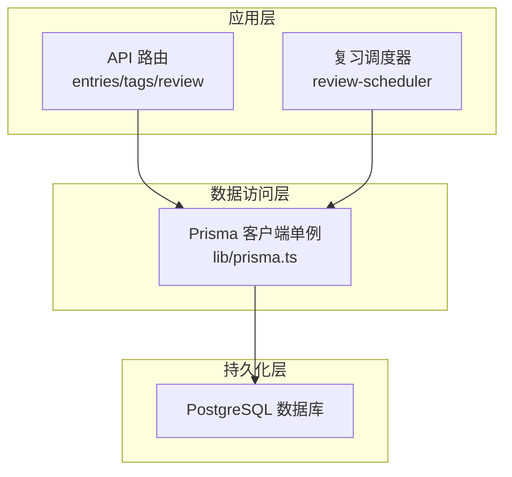
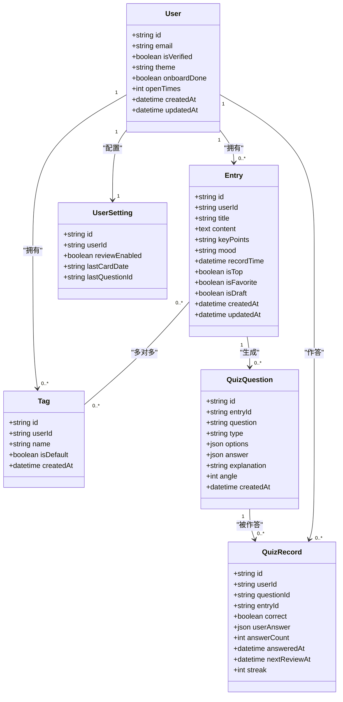
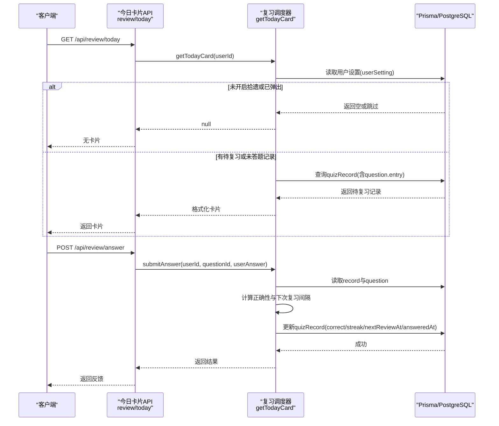
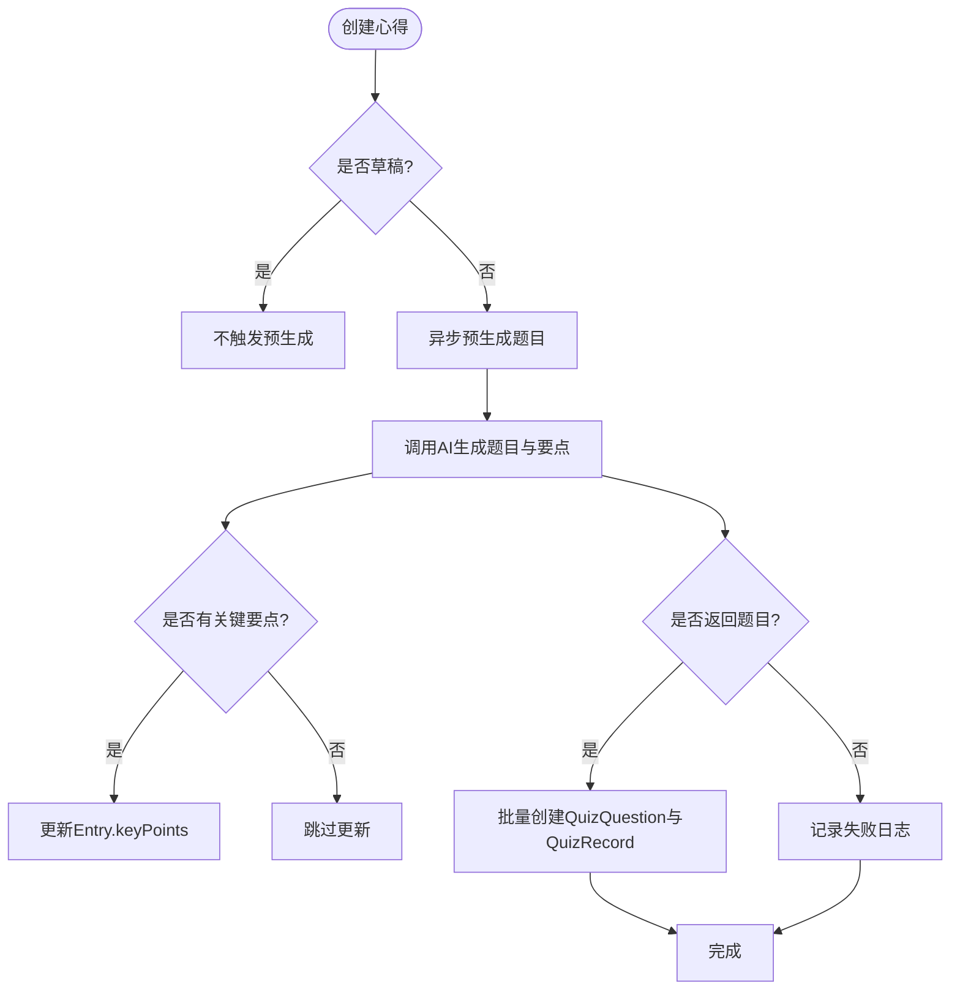
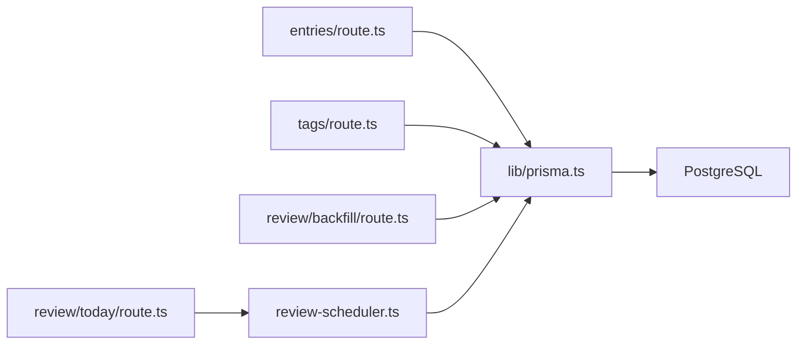

# 数据库设计

<cite>
**本文引用的文件**
- [prisma/schema.prisma](file://prisma/schema.prisma)
- [lib/prisma.ts](file://lib/prisma.ts)
- [prisma/migrations/20260621_init/migration.sql](file://prisma/migrations/20260621_init/migration.sql)
- [app/api/entries/route.ts](file://app/api/entries/route.ts)
- [app/api/tags/route.ts](file://app/api/tags/route.ts)
- [lib/review-scheduler.ts](file://lib/review-scheduler.ts)
- [app/api/review/today/route.ts](file://app/api/review/today/route.ts)
- [app/api/review/backfill/route.ts](file://app/api/review/backfill/route.ts)
- [app/api/review/profile/route.ts](file://app/api/review/profile/route.ts)
</cite>

## 目录
1. [引言](#引言)
2. [项目结构](#项目结构)
3. [核心组件](#核心组件)
4. [架构总览](#架构总览)
5. [详细组件分析](#详细组件分析)
6. [依赖关系分析](#依赖关系分析)
7. [性能与索引策略](#性能与索引策略)
8. [数据迁移与版本控制](#数据迁移与版本控制)
9. [数据访问模式与缓存策略](#数据访问模式与缓存策略)
10. [完整性约束与业务规则验证](#完整性约束与业务规则验证)
11. [监控与优化建议](#监控与优化建议)
12. [备份与恢复策略](#备份与恢复策略)
13. [结论](#结论)

## 引言
本文件为心芽项目的数据库设计文档，聚焦于基于 Prisma ORM 的数据模型设计与实现。文档覆盖 User、Entry、Tag、QuizQuestion、QuizRecord 等核心实体的关系定义、关联类型（一对一、一对多、多对多）、索引与查询优化、迁移管理与版本控制、数据访问模式与缓存策略、完整性约束与业务规则验证、性能监控与优化建议，以及备份与恢复策略。读者无需深入代码即可理解整体设计思路与实践要点。

## 项目结构
本项目采用 Next.js + Prisma 的架构：
- 数据模型与迁移位于 prisma 目录；
- 数据库客户端单例在 lib/prisma.ts 中导出；
- API 路由通过 app/api 暴露 REST 接口，使用 Prisma Client 进行读写；
- 复习调度逻辑集中在 lib/review-scheduler.ts。

图表来源
- [lib/prisma.ts:1-14](file://lib/prisma.ts#L1-L14)
- [app/api/entries/route.ts:1-163](file://app/api/entries/route.ts#L1-L163)
- [lib/review-scheduler.ts:1-225](file://lib/review-scheduler.ts#L1-L225)

章节来源
- [lib/prisma.ts:1-14](file://lib/prisma.ts#L1-L14)
- [prisma/schema.prisma:1-209](file://prisma/schema.prisma#L1-L209)

## 核心组件
本节概述核心实体及其职责：
- User：用户主实体，包含认证、偏好、统计等字段，并作为多个子实体的所有者。
- Entry：用户心得条目，支持置顶、收藏、草稿标记，并与 Tag 多对多关联，同时生成 QuizQuestion。
- Tag：标签，按用户维度唯一命名，用于组织 Entry。
- QuizQuestion：由 Entry 生成的题目，包含题型、选项、答案、解析及角度序号。
- QuizRecord：用户对题目的作答记录，维护正确性、答题次数、下次复习时间与连续正确天数。

章节来源
- [prisma/schema.prisma:10-31](file://prisma/schema.prisma#L10-L31)
- [prisma/schema.prisma:33-55](file://prisma/schema.prisma#L33-L55)
- [prisma/schema.prisma:57-69](file://prisma/schema.prisma#L57-L69)
- [prisma/schema.prisma:150-165](file://prisma/schema.prisma#L150-L165)
- [prisma/schema.prisma:167-184](file://prisma/schema.prisma#L167-L184)

## 架构总览
下图展示核心实体之间的关系与关键外键约束，体现一对一、一对多与多对多关系的落地方式。

```mermaid
erDiagram
USER {
string id PK
string email UK
boolean isVerified
string theme
boolean onboardDone
int openTimes
datetime createdAt
datetime updatedAt
}
ENTRY {
string id PK
string userId FK
string title
text content
string keyPoints
string mood
datetime recordTime
boolean isTop
boolean isFavorite
boolean isDraft
datetime createdAt
datetime updatedAt
}
TAG {
string id PK
string userId FK
string name
boolean isDefault
datetime createdAt
}
QUIZQUESTION {
string id PK
string entryId FK
string question
string type
json options
json answer
string explanation
int angle
datetime createdAt
}
QUIZRECORD {
string id PK
string userId FK
string questionId FK
string entryId
boolean correct
json userAnswer
int answerCount
datetime answeredAt
datetime nextReviewAt
int streak
}
USERSHARE {
string id PK
string userId FK
string token UK
datetime expiresAt
string scope
text[] tagIds
boolean isActive
datetime createdAt
}
AIINSIGHT {
string id PK
string userId FK
string content
int triggerCount
boolean isRead
datetime createdAt
}
INSIGHTREPORT {
string id PK
string userId FK
string type
datetime periodStart
datetime periodEnd
json content
datetime createdAt
}
GROWTHLOG {
string id PK
string userId FK
string version
string title
string content
datetime logDate
datetime createdAt
}
EMAILTOKEN {
string id PK
string userId FK
string token UK
string type
datetime expiresAt
boolean used
datetime createdAt
}
MAGICLINK {
string id PK
string email
string token UK
datetime expiresAt
boolean used
datetime createdAt
}
USERSETTING {
string id PK
string userId UK
boolean reviewEnabled
string lastCardDate
string lastQuestionId
}
REVIEWCALLLOG {
string id PK
string userId FK
string entryId
string step
boolean success
int questionCount
string errorMsg
datetime createdAt
}
USER ||--o{ ENTRY : "拥有"
USER ||--o{ TAG : "拥有"
USER ||--o{ USERSHARE : "拥有"
USER ||--o{ AIINSIGHT : "拥有"
USER ||--o{ INSIGHTREPORT : "拥有"
USER ||--o{ GROWTHLOG : "拥有"
USER ||--o{ EMAILTOKEN : "拥有"
USER ||--|| USERSETTING : "配置"
USER ||--o{ QUIZRECORD : "作答"
USER ||--o{ REVIEWCALLLOG : "调用日志"
ENTRY ||--o{ QUIZQUESTION : "生成"
ENTRY ||--o{ QUIZRECORD : "关联"
TAG ||--o{ ENTRY : "标记(多对多)"
QUIZQUESTION ||--o{ QUIZRECORD : "被作答"
```

图表来源
- [prisma/schema.prisma:10-31](file://prisma/schema.prisma#L10-L31)
- [prisma/schema.prisma:33-55](file://prisma/schema.prisma#L33-L55)
- [prisma/schema.prisma:57-69](file://prisma/schema.prisma#L57-L69)
- [prisma/schema.prisma:71-82](file://prisma/schema.prisma#L71-L82)
- [prisma/schema.prisma:84-95](file://prisma/schema.prisma#L84-L95)
- [prisma/schema.prisma:97-110](file://prisma/schema.prisma#L97-L110)
- [prisma/schema.prisma:112-122](file://prisma/schema.prisma#L112-L122)
- [prisma/schema.prisma:124-136](file://prisma/schema.prisma#L124-L136)
- [prisma/schema.prisma:138-148](file://prisma/schema.prisma#L138-L148)
- [prisma/schema.prisma:150-165](file://prisma/schema.prisma#L150-L165)
- [prisma/schema.prisma:167-184](file://prisma/schema.prisma#L167-L184)
- [prisma/schema.prisma:186-194](file://prisma/schema.prisma#L186-L194)
- [prisma/schema.prisma:196-209](file://prisma/schema.prisma#L196-L209)

## 详细组件分析

### 实体关系与关联类型
- 一对一
  - User 与 UserSetting：每个用户最多一个设置项，UserSetting.userId 唯一且外键指向 User.id。
- 一对多
  - User → Entry、Tag、Share、AiInsight、InsightReport、GrowthLog、EmailToken、QuizRecord、ReviewCallLog：删除用户时级联删除其所有子记录。
  - Entry → QuizQuestion：删除心得时级联删除其题目。
  - QuizQuestion → QuizRecord：删除题目时级联删除其作答记录。
- 多对多
  - Entry ↔ Tag：通过中间表 _EntryTags 实现，保证 A、B 组合唯一，并对 B 建立索引以加速反向查找。

章节来源
- [prisma/schema.prisma:186-194](file://prisma/schema.prisma#L186-L194)
- [prisma/schema.prisma:33-55](file://prisma/schema.prisma#L33-L55)
- [prisma/schema.prisma:57-69](file://prisma/schema.prisma#L57-L69)
- [prisma/schema.prisma:150-165](file://prisma/schema.prisma#L150-L165)
- [prisma/schema.prisma:167-184](file://prisma/schema.prisma#L167-L184)
- [prisma/migrations/20260621_init/migration.sql:86-114](file://prisma/migrations/20260621_init/migration.sql#L86-L114)

### 数据模型类图（核心）

图表来源
- [prisma/schema.prisma:10-31](file://prisma/schema.prisma#L10-L31)
- [prisma/schema.prisma:33-55](file://prisma/schema.prisma#L33-L55)
- [prisma/schema.prisma:57-69](file://prisma/schema.prisma#L57-L69)
- [prisma/schema.prisma:150-165](file://prisma/schema.prisma#L150-L165)
- [prisma/schema.prisma:167-184](file://prisma/schema.prisma#L167-L184)
- [prisma/schema.prisma:186-194](file://prisma/schema.prisma#L186-L194)

### 典型业务流程时序（今日卡片与答题）

图表来源
- [app/api/review/today/route.ts:1-49](file://app/api/review/today/route.ts#L1-L49)
- [lib/review-scheduler.ts:44-144](file://lib/review-scheduler.ts#L44-L144)
- [lib/review-scheduler.ts:164-215](file://lib/review-scheduler.ts#L164-L215)

### 复杂逻辑流程图（预生成题目与回补）

图表来源
- [app/api/entries/route.ts:96-161](file://app/api/entries/route.ts#L96-L161)
- [app/api/review/backfill/route.ts:70-113](file://app/api/review/backfill/route.ts#L70-L113)

章节来源
- [app/api/entries/route.ts:1-163](file://app/api/entries/route.ts#L1-L163)
- [app/api/review/backfill/route.ts:70-113](file://app/api/review/backfill/route.ts#L70-L113)
- [lib/review-scheduler.ts:1-225](file://lib/review-scheduler.ts#L1-L225)

## 依赖关系分析
- 模块耦合
  - API 路由仅依赖 Prisma 客户端与认证工具，保持薄控制器风格；
  - 复习调度器封装了复杂的查询与算法，降低 API 复杂度；
  - Prisma 客户端单例避免重复连接，提升并发性能。
- 外部依赖
  - PostgreSQL 作为持久化存储；
  - 可选的外部 AI 服务用于生成题目与要点（非数据库部分）。

图表来源
- [app/api/entries/route.ts:1-163](file://app/api/entries/route.ts#L1-L163)
- [app/api/tags/route.ts:1-46](file://app/api/tags/route.ts#L1-L46)
- [app/api/review/today/route.ts:1-49](file://app/api/review/today/route.ts#L1-L49)
- [app/api/review/backfill/route.ts:70-113](file://app/api/review/backfill/route.ts#L70-L113)
- [lib/review-scheduler.ts:1-225](file://lib/review-scheduler.ts#L1-L225)
- [lib/prisma.ts:1-14](file://lib/prisma.ts#L1-L14)

章节来源
- [lib/prisma.ts:1-14](file://lib/prisma.ts#L1-L14)
- [app/api/entries/route.ts:1-163](file://app/api/entries/route.ts#L1-L163)
- [app/api/tags/route.ts:1-46](file://app/api/tags/route.ts#L1-L46)
- [lib/review-scheduler.ts:1-225](file://lib/review-scheduler.ts#L1-L225)

## 性能与索引策略
- 现有索引
  - Entry：针对 (userId, recordTime DESC)、(userId, isTop)、(userId, isFavorite)、(userId, isDraft) 的组合索引，优化列表分页、筛选与排序。
  - Tag：(userId, name) 唯一索引与 (userId) 普通索引，保障标签唯一性与按用户检索效率。
  - AiInsight：(userId, createdAt DESC) 索引，优化时间倒序列表。
  - InsightReport：(userId, type, periodStart) 唯一索引与 (userId, type) 复合索引，确保周期报告唯一性与按类型聚合查询。
  - EmailToken：token 唯一与普通索引，加速令牌校验。
  - MagicLink：token 与 email 索引，加速登录流程。
  - 多对多中间表 _EntryTags：(A,B) 唯一与 B 索引，保障关系唯一与反向查找。
  - QuizRecord：(userId, nextReviewAt) 与 (userId, questionId) 索引，支撑“待复习”与“按题查记录”。
  - ReviewCallLog：(userId, createdAt) 索引，便于按时间查看调用历史。
- 查询优化建议
  - 列表分页：优先使用已有复合索引，避免全表扫描；必要时增加 (userId, isDraft, recordTime DESC) 以覆盖草稿过滤场景。
  - 搜索：当前使用 contains 模糊匹配，若数据量增长可考虑引入全文索引或搜索引擎。
  - 聚合统计：如月度统计、准确率等，建议在应用层做增量计算或使用物化视图。
  - JSON 字段：options/answer/userAnswer/content 等 JSON 字段查询应谨慎，必要时抽取结构化字段或建立表达式索引。

章节来源
- [prisma/schema.prisma:51-54](file://prisma/schema.prisma#L51-L54)
- [prisma/schema.prisma:67-68](file://prisma/schema.prisma#L67-L68)
- [prisma/schema.prisma:94](file://prisma/schema.prisma#L94)
- [prisma/schema.prisma:108-109](file://prisma/schema.prisma#L108-L109)
- [prisma/schema.prisma:135](file://prisma/schema.prisma#L135)
- [prisma/schema.prisma:146-147](file://prisma/schema.prisma#L146-L147)
- [prisma/schema.prisma:182-183](file://prisma/schema.prisma#L182-L183)
- [prisma/schema.prisma:208](file://prisma/schema.prisma#L208)
- [prisma/migrations/20260621_init/migration.sql:91-104](file://prisma/migrations/20260621_init/migration.sql#L91-L104)

## 数据迁移与版本控制
- 迁移管理
  - 使用 Prisma Migrate 管理数据库变更，迁移脚本位于 prisma/migrations；
  - 初始迁移包含所有表、索引与外键约束，确保环境一致性。
- 版本控制方法
  - 将 schema.prisma 与迁移目录纳入 Git 版本控制；
  - 每次变更先修改 schema，再执行 prisma migrate dev 生成新迁移，提交后在 CI/CD 中自动应用；
  - 生产环境建议使用 prisma migrate deploy 并在发布前进行回滚演练。

章节来源
- [prisma/migrations/20260621_init/migration.sql:1-114](file://prisma/migrations/20260621_init/migration.sql#L1-L114)
- [prisma/schema.prisma:1-8](file://prisma/schema.prisma#L1-L8)

## 数据访问模式与缓存策略
- 数据访问模式
  - 统一通过 Prisma Client 单例访问数据库，开发环境输出 query/error/warn 日志，生产仅 error；
  - API 路由遵循“薄控制器”原则，复杂逻辑下沉至服务层（如复习调度器）。
- 缓存策略
  - 当前未见显式缓存层（如 Redis），可通过以下方案增强：
    - 今日卡片结果短期缓存（TTL 数分钟），减少重复调度计算；
    - 热门标签与心得列表缓存；
    - 用户设置与统计指标缓存；
  - 注意缓存失效策略与一致性，尤其在写路径（创建/更新心得、答题）需同步失效相关缓存。

章节来源
- [lib/prisma.ts:1-14](file://lib/prisma.ts#L1-L14)
- [app/api/review/today/route.ts:1-49](file://app/api/review/today/route.ts#L1-L49)
- [lib/review-scheduler.ts:44-144](file://lib/review-scheduler.ts#L44-L144)

## 完整性约束与业务规则验证
- 完整性约束
  - 主键与唯一约束：User.email、Tag.user_id+name、Share.token、EmailToken.token、MagicLink.token、InsightReport.user_id+type+periodStart、UserSetting.user_id 唯一；
  - 外键与级联：多数子实体 onDelete=Cascade，保证用户删除时数据一致性；
  - 多对多唯一：_EntryTags(A,B) 唯一，防止重复关联。
- 业务规则验证
  - 标签名长度限制与重复检查在 API 层进行；
  - 心得标题必填校验；
  - 答题正确性判定与下次复习间隔计算在服务层完成；
  - 拾遗开关与每日弹窗去重通过 UserSetting.lastCardDate 控制。

章节来源
- [prisma/schema.prisma:12](file://prisma/schema.prisma#L12)
- [prisma/schema.prisma:67](file://prisma/schema.prisma#L67)
- [prisma/schema.prisma:74](file://prisma/schema.prisma#L74)
- [prisma/schema.prisma:127](file://prisma/schema.prisma#L127)
- [prisma/schema.prisma:141](file://prisma/schema.prisma#L141)
- [prisma/schema.prisma:108](file://prisma/schema.prisma#L108)
- [prisma/schema.prisma:188](file://prisma/schema.prisma#L188)
- [app/api/tags/route.ts:32-45](file://app/api/tags/route.ts#L32-L45)
- [app/api/entries/route.ts:70-74](file://app/api/entries/route.ts#L70-L74)
- [lib/review-scheduler.ts:164-215](file://lib/review-scheduler.ts#L164-L215)
- [lib/review-scheduler.ts:44-52](file://lib/review-scheduler.ts#L44-L52)

## 监控与优化建议
- 监控
  - 使用 ReviewCallLog 记录复习调用步骤、成功与否与问题数量，便于追踪异常；
  - 定期清理旧日志（保留最近 N 条），避免膨胀。
- 优化建议
  - 对高频查询路径补充覆盖索引（例如草稿列表）；
  - 对 JSON 字段中的热点属性考虑提取为独立列并建索引；
  - 对模糊搜索引入全文检索或搜索引擎；
  - 对统计类接口使用物化视图或定时任务预计算。

章节来源
- [prisma/schema.prisma:196-209](file://prisma/schema.prisma#L196-L209)
- [lib/review-scheduler.ts:5-29](file://lib/review-scheduler.ts#L5-L29)

## 备份与恢复策略
- 备份
  - 使用数据库原生备份工具（如 pg_dump）定期全量备份，并结合 WAL 归档实现近实时增量备份；
  - 备份文件加密存储并异地容灾。
- 恢复
  - 制定恢复演练计划，明确 RPO/RTO 目标；
  - 在预发环境验证恢复流程，确保迁移兼容与数据一致性。
- 注意事项
  - 备份窗口避开高峰时段；
  - 恢复后进行数据校验与关键业务回归测试。

[本节为通用指导，不涉及具体源码文件]

## 结论
本设计以 Prisma 为核心，围绕用户、心得、标签、题目与作答记录构建了清晰的关系模型，并通过合理的索引与级联约束保障查询性能与数据一致性。结合复习调度器的算法与日志机制，系统具备良好的可扩展性与可观测性。后续可在缓存、全文检索与统计预计算方面持续优化，以满足更大规模数据与更高并发需求。