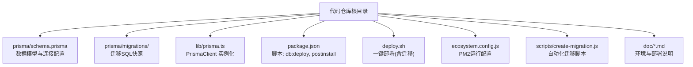
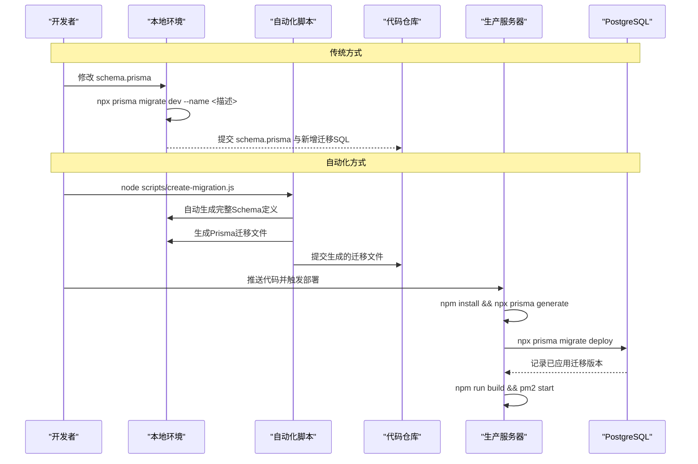
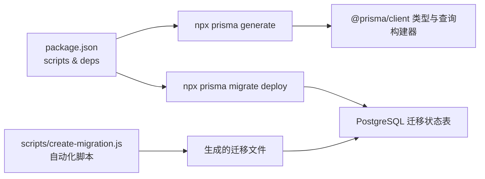

# 数据库迁移策略

<cite>
**本文引用的文件**   
- [prisma/schema.prisma](file://prisma/schema.prisma)
- [lib/prisma.ts](file://lib/prisma.ts)
- [package.json](file://package.json)
- [scripts/create-migration.js](file://scripts/create-migration.js)
- [scripts/create-guest-accounts.js](file://scripts/create-guest-accounts.js)
- [prisma/migrations/20260621_init/migration.sql](file://prisma/migrations/20260621_init/migration.sql)
- [prisma/migrations/migration_lock.toml](file://prisma/migrations/migration_lock.toml)
- [deploy.sh](file://deploy.sh)
- [ecosystem.config.js](file://ecosystem.config.js)
- [doc/新电脑程序转移主人提醒.md](file://doc/新电脑程序转移主人提醒.md)
- [doc/新芽dev-framework.md](file://doc/新芽dev-framework.md)
</cite>

## 更新摘要
**变更内容**   
- 新增自动化迁移脚本 create-migration.js，支持一键生成完整的PostgreSQL Schema定义和Prisma迁移文件
- 增强迁移创建流程，简化开发环境初始化过程
- 完善团队协作时的迁移管理最佳实践

## 目录
1. [引言](#引言)
2. [项目结构](#项目结构)
3. [核心组件](#核心组件)
4. [架构总览](#架构总览)
5. [详细组件分析](#详细组件分析)
6. [依赖关系分析](#依赖关系分析)
7. [性能与一致性考量](#性能与一致性考量)
8. [故障排查指南](#故障排查指南)
9. [结论](#结论)
10. [附录](#附录)

## 引言
本文件为心芽项目的数据库迁移策略文档，聚焦 Prisma Migrate 的工作流程、版本管理机制、迁移生成/应用/回滚过程、生产环境部署策略与风险控制、数据备份与恢复最佳实践、迁移过程中的数据一致性保证、团队协作冲突处理以及环境差异与配置管理。目标是让开发、测试与运维团队在本地、预发与生产环境中安全、可控地演进数据库结构。

**更新** 新增了自动化迁移脚本 create-migration.js，大幅简化了数据库迁移的创建流程，提高了开发效率。

## 项目结构
本项目采用 Next.js + Prisma（PostgreSQL）技术栈。Prisma 的模型定义位于 schema.prisma，迁移脚本由 Prisma 自动生成并保存在 prisma/migrations 下；生产部署通过 deploy.sh 执行构建与迁移。



**图表来源**
- [prisma/schema.prisma:1-209](file://prisma/schema.prisma#L1-L209)
- [prisma/migrations/20260621_init/migration.sql:1-114](file://prisma/migrations/20260621_init/migration.sql#L1-L114)
- [lib/prisma.ts:1-14](file://lib/prisma.ts#L1-L14)
- [package.json:1-40](file://package.json#L1-L40)
- [deploy.sh:1-37](file://deploy.sh#L1-L37)
- [ecosystem.config.js:1-15](file://ecosystem.config.js#L1-L15)
- [scripts/create-migration.js:1-122](file://scripts/create-migration.js#L1-L122)

章节来源
- [prisma/schema.prisma:1-209](file://prisma/schema.prisma#L1-L209)
- [package.json:1-40](file://package.json#L1-L40)
- [deploy.sh:1-37](file://deploy.sh#L1-L37)
- [ecosystem.config.js:1-15](file://ecosystem.config.js#L1-L15)
- [doc/新电脑程序转移主人提醒.md:90-175](file://doc/新电脑程序转移主人提醒.md#L90-L175)
- [doc/新芽dev-framework.md:580-779](file://doc/新芽dev-framework.md#L580-L779)

## 核心组件
- 数据模型与连接：schema.prisma 定义了 PostgreSQL 数据源与所有业务实体，包含索引、唯一约束与级联删除等语义。
- 客户端初始化：lib/prisma.ts 提供全局单例 PrismaClient，并在非生产环境开启 query/error/warn 日志。
- **新增** 自动化迁移脚本：scripts/create-migration.js 能够自动生成完整的PostgreSQL Schema定义和Prisma迁移文件，包含User、Entry、Tag等核心数据模型的表结构、外键约束、索引和唯一键。
- 迁移脚本：prisma/migrations 下的 SQL 文件由 Prisma 根据 schema 变更生成，作为不可变版本快照。
- 部署脚本：deploy.sh 在安装依赖、生成 Client 后执行迁移，再构建与启动服务。
- 运行配置：ecosystem.config.js 使用 PM2 以 production 模式运行 Next.js。

**章节来源**
- [prisma/schema.prisma:1-209](file://prisma/schema.prisma#L1-L209)
- [lib/prisma.ts:1-14](file://lib/prisma.ts#L1-L14)
- [scripts/create-migration.js:1-122](file://scripts/create-migration.js#L1-L122)
- [prisma/migrations/20260621_init/migration.sql:1-114](file://prisma/migrations/20260621_init/migration.sql#L1-L114)
- [deploy.sh:1-37](file://deploy.sh#L1-L37)
- [ecosystem.config.js:1-15](file://ecosystem.config.js#L1-L15)

## 架构总览
下图展示了从代码到数据库的迁移链路，包括本地开发与生产部署两条路径，以及新增的自动化迁移脚本支持。



**图表来源**
- [package.json:1-40](file://package.json#L1-L40)
- [deploy.sh:1-37](file://deploy.sh#L1-L37)
- [prisma/schema.prisma:1-209](file://prisma/schema.prisma#L1-L209)
- [scripts/create-migration.js:1-122](file://scripts/create-migration.js#L1-L122)

## 详细组件分析

### 数据模型与约束（schema.prisma）
- 数据源与提供者：PostgreSQL，连接字符串来自环境变量 DATABASE_URL。
- 模型与关系：User、Entry、Tag、Share、AiInsight、InsightReport、GrowthLog、EmailToken、MagicLink、QuizQuestion、QuizRecord、UserSetting、ReviewCallLog 等，包含外键、唯一约束、索引与级联删除。
- 迁移影响点：新增字段、索引、唯一约束或关系变更将驱动新的迁移文件生成。

章节来源
- [prisma/schema.prisma:1-209](file://prisma/schema.prisma#L1-L209)

### 客户端初始化（lib/prisma.ts）
- 全局单例：避免重复创建连接池，提升性能。
- 日志级别：开发环境输出 query/error/warn，生产仅 error，便于定位问题同时降低噪音。

章节来源
- [lib/prisma.ts:1-14](file://lib/prisma.ts#L1-L14)

### **新增** 自动化迁移脚本（scripts/create-migration.js）
- **功能特性**：
  - 自动生成完整的PostgreSQL Schema定义
  - 创建包含User、Entry、Tag等核心数据模型的表结构
  - 自动生成外键约束、索引和唯一键
  - 自动创建迁移目录和migration_lock.toml文件
- **支持的模型**：
  - User：用户信息表，包含邮箱验证、主题设置等字段
  - Entry：笔记条目表，支持置顶、收藏、草稿等功能
  - Tag：标签表，支持用户自定义标签
  - Share：分享表，支持权限控制和时间过期
  - AiInsight：AI洞察表，支持阅读状态跟踪
  - InsightReport：洞察报告表，支持JSONB格式内容
  - GrowthLog：成长日志表，支持版本管理
  - EmailToken：邮件令牌表，支持多种用途
  - _EntryTags：多对多关系中间表
- **自动化流程**：
  - 自动创建迁移目录结构
  - 生成完整的CREATE TABLE语句
  - 自动生成索引和约束定义
  - 创建外键关系和级联删除
  - 生成migration_lock.toml配置文件

**章节来源**
- [scripts/create-migration.js:1-122](file://scripts/create-migration.js#L1-L122)

### 迁移脚本与锁定（migrations 与 migration_lock.toml）
- 迁移SQL：每个迁移对应一个不可变的 SQL 文件，确保可重复应用。
- 锁定文件：migration_lock.toml 声明 provider=postgresql，用于校验目标数据库类型一致。

章节来源
- [prisma/migrations/20260621_init/migration.sql:1-114](file://prisma/migrations/20260621_init/migration.sql#L1-L114)
- [prisma/migrations/migration_lock.toml:1-3](file://prisma/migrations/migration_lock.toml#L1-L3)

### 脚本与自动化（package.json 与 deploy.sh）
- 脚本：
  - db:deploy -> prisma migrate deploy（生产应用迁移）
  - postinstall -> prisma generate（安装依赖后生成客户端）
- 部署流程：
  - 安装依赖
  - 生成 Prisma Client
  - 执行迁移
  - 构建
  - PM2 启动

章节来源
- [package.json:1-40](file://package.json#L1-L40)
- [deploy.sh:1-37](file://deploy.sh#L1-L37)
- [ecosystem.config.js:1-15](file://ecosystem.config.js#L1-L15)

### 环境配置（.env 与文档）
- 关键变量：DATABASE_URL、JWT_SECRET、SMTP_*、NEXT_PUBLIC_BASE_URL 等。
- 注意事项：.env 不入库，生产密钥需妥善保管；文档中提供了示例与备份位置提示。

章节来源
- [doc/新电脑程序转移主人提醒.md:90-175](file://doc/新电脑程序转移主人提醒.md#L90-L175)
- [doc/新芽dev-framework.md:580-779](file://doc/新芽dev-framework.md#L580-L779)

## 依赖关系分析
- 运行时依赖：@prisma/client 与 prisma CLI 版本一致，确保生成器与迁移行为匹配。
- 构建期依赖：postinstall 自动执行 prisma generate，保证客户端与 schema 同步。
- 部署期依赖：deploy.sh 顺序执行安装、生成、迁移、构建、启动，形成幂等流水线。



**图表来源**
- [package.json:1-40](file://package.json#L1-L40)
- [scripts/create-migration.js:1-122](file://scripts/create-migration.js#L1-L122)

章节来源
- [package.json:1-40](file://package.json#L1-L40)

## 性能与一致性考量
- 迁移原子性：Prisma 在同一事务内执行迁移语句，失败则整体回滚，保障一致性。
- 大表变更建议：
  - 新增非空列时提供默认值或分阶段推进（先允许为空，再回填，最后加非空约束）。
  - 重建索引与添加索引尽量在低峰期执行，必要时分批进行。
- 连接与日志：
  - 生产环境关闭冗余日志，减少 I/O 开销。
  - 合理设置数据库连接池大小，避免连接耗尽。
- 幂等部署：
  - migrate deploy 会跳过已应用的迁移，具备幂等特性，适合多次执行。
- **自动化脚本优化**：
  - 批量生成SQL语句，减少数据库交互次数
  - 预定义索引和约束，避免后续手动配置
  - 标准化表结构设计，提高一致性

[本节为通用指导，无需源码引用]

## 故障排查指南
- 常见错误与定位
  - 无法连接数据库：检查 DATABASE_URL 是否正确、网络连通性与权限。
  - 迁移失败：查看 Prisma 输出与数据库错误日志，确认 SQL 语法与约束冲突。
  - 版本不一致：确认 migration_lock.toml 的 provider 与目标库一致。
  - **新增** 自动化脚本错误：检查Node.js环境、文件权限和路径配置。
- 快速自检清单
  - 本地：npx prisma migrate dev --name <描述> 是否成功？
  - 自动化：node scripts/create-migration.js 是否成功生成迁移文件？
  - 构建：npm run build 是否通过？
  - 部署：deploy.sh 各步骤是否有报错？
- 日志与调试
  - 开发环境：lib/prisma.ts 已开启 query/error/warn，便于定位慢查询与异常。
  - 生产环境：pm2 logs xinya 查看应用日志；数据库侧查看慢查询与错误日志。
  - 脚本调试：在create-migration.js中添加console.log输出，追踪执行过程。
- 回滚策略
  - 若迁移导致严重问题，优先回滚数据库至最近稳定快照（见"数据备份与恢复"），再评估是否需要修正迁移脚本。
  - 对于自动化生成的迁移，保留原始schema.prisma以便重新生成。

**章节来源**
- [lib/prisma.ts:1-14](file://lib/prisma.ts#L1-L14)
- [deploy.sh:1-37](file://deploy.sh#L1-L37)
- [ecosystem.config.js:1-15](file://ecosystem.config.js#L1-L15)
- [scripts/create-migration.js:1-122](file://scripts/create-migration.js#L1-L122)

## 结论
通过 schema.prisma 驱动迁移、migrate dev 本地迭代、migrate deploy 生产落库、配合幂等部署脚本与环境隔离，心芽项目形成了可追溯、可回滚、可审计的数据库演进体系。**新增的自动化迁移脚本进一步简化了开发流程，提高了团队协作效率**。建议在团队中严格执行"先迁移、后合并"的流程，并对生产变更引入评审与灰度验证，确保数据安全与服务稳定。

[本节为总结，无需源码引用]

## 附录

### 一、迁移工作流程与版本管理
- 本地开发
  - 修改 schema.prisma
  - 执行 npx prisma migrate dev --name <描述>，生成并应用迁移，同时重置本地开发库（可选）
  - 提交 schema.prisma 与新增迁移SQL
- **新增** 自动化迁移
  - 执行 node scripts/create-migration.js 自动生成完整Schema定义
  - 自动生成包含所有核心数据模型的迁移文件
  - 提交生成的迁移文件和配置文件
- 生产部署
  - 拉取最新代码
  - 执行 npx prisma migrate deploy，按迁移历史顺序应用未执行的迁移
  - 构建并重启服务

**章节来源**
- [package.json:1-40](file://package.json#L1-L40)
- [deploy.sh:1-37](file://deploy.sh#L1-L37)
- [prisma/migrations/20260621_init/migration.sql:1-114](file://prisma/migrations/20260621_init/migration.sql#L1-L114)
- [scripts/create-migration.js:1-122](file://scripts/create-migration.js#L1-L122)

### 二、迁移文件的生成、应用与回滚
- 生成：基于 schema.prisma 的差异生成 SQL 文件，文件名带时间戳前缀，保证有序。
- **新增** 自动化生成：通过 create-migration.js 脚本批量生成完整的数据库Schema定义。
- 应用：migrate deploy 读取迁移历史，逐条执行未应用的迁移。
- 回滚：
  - 推荐做法：对生产数据库执行最近的稳定备份恢复，再修正迁移脚本重新发布。
  - 谨慎操作：尽量避免直接编辑已发布的迁移SQL；如需修复，应新增迁移而非覆盖历史。

**章节来源**
- [prisma/migrations/20260621_init/migration.sql:1-114](file://prisma/migrations/20260621_init/migration.sql#L1-L114)
- [prisma/migrations/migration_lock.toml:1-3](file://prisma/migrations/migration_lock.toml#L1-L3)
- [scripts/create-migration.js:1-122](file://scripts/create-migration.js#L1-L122)

### 三、生产环境部署策略与风险控制
- 部署顺序：安装依赖 → 生成 Client → 迁移 → 构建 → 启动
- 幂等性：migrate deploy 可重复执行，不会重复应用已存在的迁移
- 风险控制：
  - 变更前备份数据库
  - 先在预发环境验证
  - 选择低峰期执行
  - 准备回滚方案（快照恢复）
- **新增** 自动化脚本风险控制：
  - 在执行自动化脚本前备份现有迁移文件
  - 验证生成的SQL语法正确性
  - 在测试环境先行验证自动化脚本效果

**章节来源**
- [deploy.sh:1-37](file://deploy.sh#L1-L37)
- [ecosystem.config.js:1-15](file://ecosystem.config.js#L1-L15)
- [scripts/create-migration.js:1-122](file://scripts/create-migration.js#L1-L122)

### 四、数据备份与恢复最佳实践
- 备份策略
  - 定期全量备份 + 增量 WAL 归档（PostgreSQL 原生能力）
  - 备份对象：数据库逻辑导出或物理快照，保留多份副本并异地存储
- 恢复演练
  - 定期在预发环境演练恢复流程，验证 RTO/RPO
- 迁移前后
  - 重要迁移前强制备份
  - 变更后立即验证关键业务路径
- **新增** 自动化脚本备份
  - 执行自动化脚本前备份当前迁移文件
  - 保留原始schema.prisma以便重新生成

[本节为通用指导，无需源码引用]

### 五、迁移过程中的数据一致性保证
- 事务边界：Prisma 迁移在事务中执行，失败即回滚
- 约束先行：新增唯一/外键前确保数据满足约束，必要时分阶段推进
- 并发控制：迁移期间限制写入或采用蓝绿/金丝雀发布，降低冲突概率
- **新增** 自动化脚本一致性
  - 预定义的表结构和约束确保一致性
  - 标准化的命名约定避免冲突
  - 完整的索引定义保证查询性能

[本节为通用指导，无需源码引用]

### 六、团队协作与迁移冲突解决
- 分支策略：feature 分支独立开发，合并前确保本地迁移通过
- 冲突处理：
  - 多人同时修改 schema 产生多个迁移时，合并后统一执行 npx prisma migrate dev 以对齐状态
  - 若出现迁移顺序冲突，优先保持迁移文件不可变，通过新增迁移解决问题
  - **新增** 使用自动化脚本时，确保团队成员都使用相同版本的脚本
- 代码审查：PR 必须包含 schema 变更与对应迁移，CI 中执行迁移校验
- **新增** 自动化脚本协作规范：
  - 统一脚本版本，避免不同版本生成不同的Schema
  - 在团队文档中明确自动化脚本的使用场景
  - 定期同步脚本更新到所有团队成员

**章节来源**
- [scripts/create-migration.js:1-122](file://scripts/create-migration.js#L1-L122)

### 七、环境差异与配置管理
- 环境变量：DATABASE_URL 在各环境分别配置，禁止入库
- 锁定文件：migration_lock.toml 确保目标数据库类型一致
- 文档参考：项目文档中包含 .env 示例与部署要点
- **新增** 自动化脚本环境适配：
  - 脚本中的路径配置需要根据实际环境调整
  - 建议在脚本中使用相对路径或环境变量
  - 不同环境的迁移文件应保持相同的结构

**章节来源**
- [doc/新电脑程序转移主人提醒.md:90-175](file://doc/新电脑程序转移主人提醒.md#L90-L175)
- [doc/新芽dev-framework.md:580-779](file://doc/新芽dev-framework.md#L580-L779)
- [prisma/migrations/migration_lock.toml:1-3](file://prisma/migrations/migration_lock.toml#L1-L3)
- [scripts/create-migration.js:1-122](file://scripts/create-migration.js#L1-L122)

### 八、自动化迁移脚本使用指南

#### 基本使用方法
```bash
# 执行自动化迁移脚本
node scripts/create-migration.js

# 验证生成的迁移文件
ls -la prisma/migrations/20260621_init/

# 应用生成的迁移
npx prisma migrate deploy
```

#### 脚本功能特性
- **自动目录创建**：自动创建迁移目录结构
- **完整Schema生成**：生成包含所有核心数据表的完整SQL定义
- **约束完整性**：自动生成主键、外键、唯一约束和索引
- **关系映射**：正确处理表间关系和多对多关联
- **配置文件生成**：自动生成migration_lock.toml文件

#### 支持的数据库模型
- User（用户表）
- Entry（笔记表）
- Tag（标签表）
- Share（分享表）
- AiInsight（AI洞察表）
- InsightReport（洞察报告表）
- GrowthLog（成长日志表）
- EmailToken（邮件令牌表）
- _EntryTags（多对多关系表）

**章节来源**
- [scripts/create-migration.js:1-122](file://scripts/create-migration.js#L1-L122)