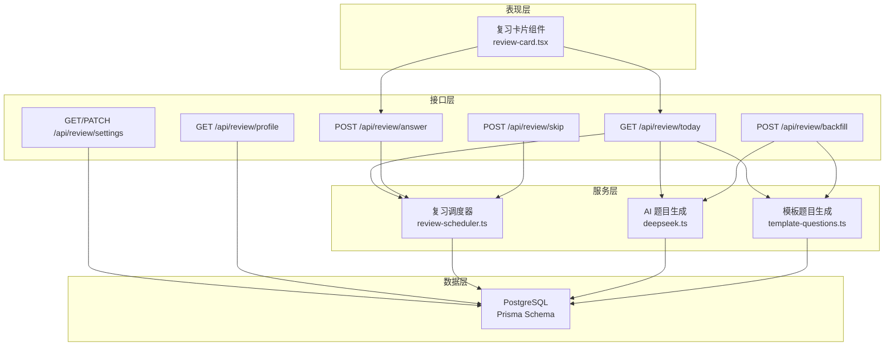
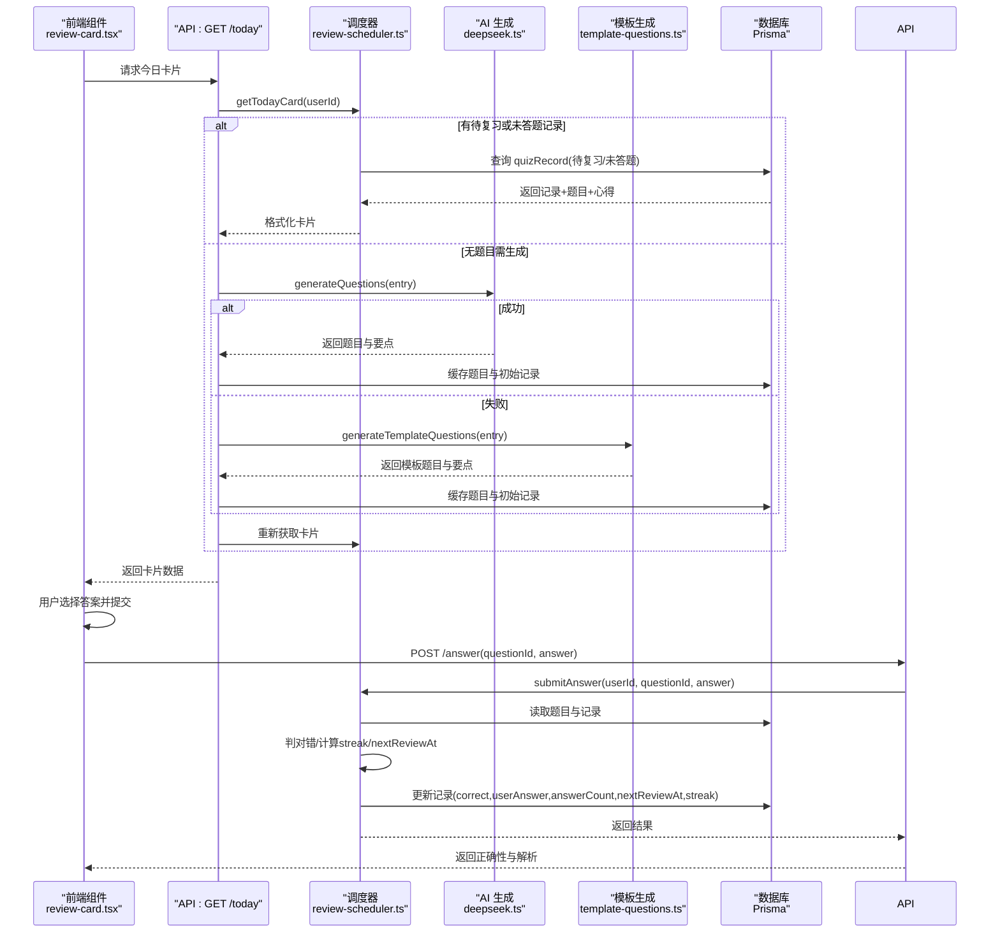
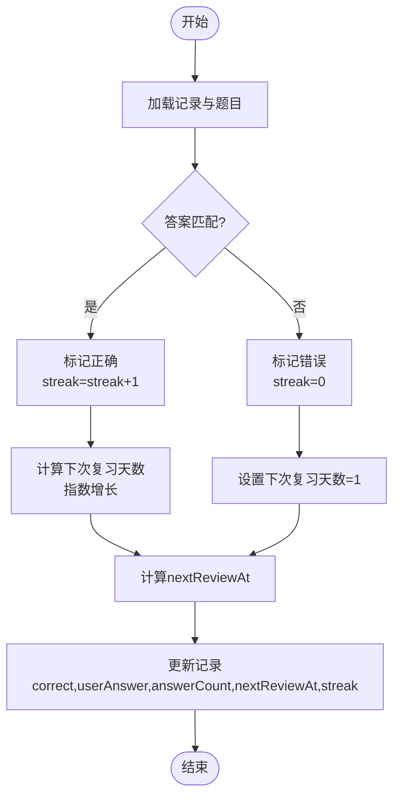
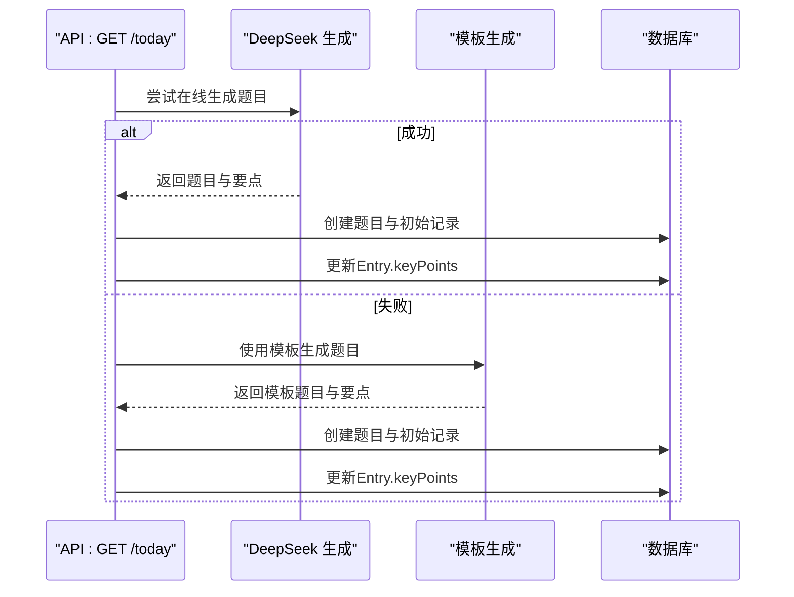
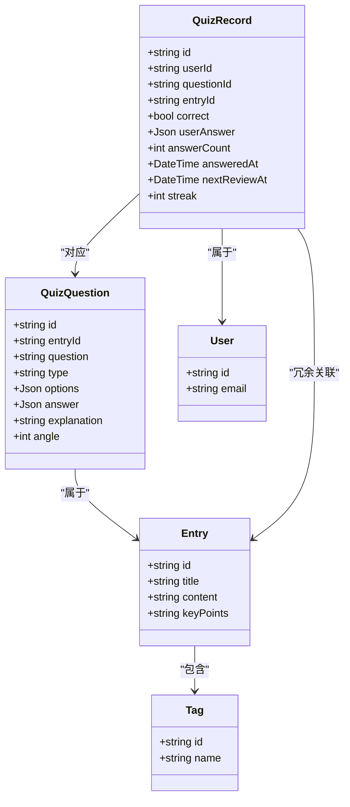

# 复习系统模型

<cite>
**本文引用的文件**
- [prisma/schema.prisma](file://prisma/schema.prisma)
- [lib/review-scheduler.ts](file://lib/review-scheduler.ts)
- [app/api/review/today/route.ts](file://app/api/review/today/route.ts)
- [app/api/review/answer/route.ts](file://app/api/review/answer/route.ts)
- [app/api/review/skip/route.ts](file://app/api/review/skip/route.ts)
- [app/api/review/settings/route.ts](file://app/api/review/settings/route.ts)
- [app/api/review/profile/route.ts](file://app/api/review/profile/route.ts)
- [lib/deepseek.ts](file://lib/deepseek.ts)
- [lib/template-questions.ts](file://lib/template-questions.ts)
- [components/review-card.tsx](file://components/review-card.tsx)
</cite>

## 目录
1. [引言](#引言)
2. [项目结构](#项目结构)
3. [核心组件](#核心组件)
4. [架构总览](#架构总览)
5. [详细组件分析](#详细组件分析)
6. [依赖关系分析](#依赖关系分析)
7. [性能与查询优化](#性能与查询优化)
8. [故障排查指南](#故障排查指南)
9. [结论](#结论)

## 引言
本文件为心芽项目的“复习系统”数据模型文档，聚焦于两个核心实体：题目 QuizQuestion 与答题记录 QuizRecord。文档将深入解释其设计理念、字段定义、业务逻辑与关联关系，覆盖 AI 生成题目、间隔重复算法、学习追踪等关键能力的数据支撑，并提供复习数据的查询优化策略与性能考量。

## 项目结构
复习系统涉及数据库模型定义、调度与算法实现、API 路由、前端交互组件以及 AI 生成与模板降级模块。整体组织如下：
- 数据模型：Prisma Schema 定义用户、心得、标签、题目、答题记录、设置与调用日志等实体及索引。
- 调度与算法：复习卡片选择、答案提交、间隔重复时间计算、跳过控制等。
- API 路由：今日卡片获取、答案提交、设置管理、学习画像统计、补生成等。
- 题目生成：在线 AI 生成与模板降级方案。
- 前端组件：复习卡片 UI 与交互流程。

图表来源
- [prisma/schema.prisma:150-184](file://prisma/schema.prisma#L150-L184)
- [lib/review-scheduler.ts:44-215](file://lib/review-scheduler.ts#L44-L215)
- [app/api/review/today/route.ts:43-122](file://app/api/review/today/route.ts#L43-L122)
- [app/api/review/answer/route.ts:5-29](file://app/api/review/answer/route.ts#L5-L29)
- [app/api/review/skip/route.ts:5-19](file://app/api/review/skip/route.ts#L5-L19)
- [app/api/review/settings/route.ts:5-61](file://app/api/review/settings/route.ts#L5-L61)
- [app/api/review/profile/route.ts:79-178](file://app/api/review/profile/route.ts#L79-L178)
- [lib/deepseek.ts:17-114](file://lib/deepseek.ts#L17-L114)
- [lib/template-questions.ts:35-65](file://lib/template-questions.ts#L35-L65)
- [components/review-card.tsx:32-48](file://components/review-card.tsx#L32-L48)

章节来源
- [prisma/schema.prisma:150-184](file://prisma/schema.prisma#L150-L184)
- [lib/review-scheduler.ts:44-215](file://lib/review-scheduler.ts#L44-L215)
- [app/api/review/today/route.ts:43-122](file://app/api/review/today/route.ts#L43-L122)
- [app/api/review/answer/route.ts:5-29](file://app/api/review/answer/route.ts#L5-L29)
- [app/api/review/skip/route.ts:5-19](file://app/api/review/skip/route.ts#L5-L19)
- [app/api/review/settings/route.ts:5-61](file://app/api/review/settings/route.ts#L5-L61)
- [app/api/review/profile/route.ts:79-178](file://app/api/review/profile/route.ts#L79-L178)
- [lib/deepseek.ts:17-114](file://lib/deepseek.ts#L17-L114)
- [lib/template-questions.ts:35-65](file://lib/template-questions.ts#L35-L65)
- [components/review-card.tsx:32-48](file://components/review-card.tsx#L32-L48)

## 核心组件
本节聚焦 QuizQuestion 与 QuizRecord 两个核心实体的设计要点、字段含义与业务逻辑。

- 题目模型（QuizQuestion）
  - 关键字段
    - question：题干文本
    - type：题型，支持单选、多选、判断
    - options：选项数组
    - answer：正确答案的选项索引数组
    - explanation：解析说明
    - angle：出题角度序号（用于排序或展示顺序）
  - 关联关系
    - 属于某条心得 Entry（通过 entryId）
    - 被多条答题记录 QuizRecord 引用（一对多）
  - 设计意图
    - 以 JSON 存储选项与答案，便于灵活适配不同题型
    - 保留解析与角度，支持教学反馈与题目排序

- 答题记录模型（QuizRecord）
  - 关键字段
    - correct：是否答对
    - userAnswer：用户所选答案（JSON）
    - answerCount：累计答题次数
    - answeredAt：最近一次作答时间
    - nextReviewAt：下次复习时间（间隔重复算法驱动）
    - streak：连续正确次数
  - 关联关系
    - 属于某用户 User（userId）
    - 对应某题目 QuizQuestion（questionId）
    - 同时冗余 entryId，便于快速定位到原始心得
  - 设计意图
    - 使用 nextReviewAt 作为间隔重复的核心调度键
    - 使用 streak 驱动指数退避式复习周期
    - 使用 answerCount 与 answeredAt 进行频率与活跃度分析

章节来源
- [prisma/schema.prisma:150-184](file://prisma/schema.prisma#L150-L184)

## 架构总览
复习系统采用“前端组件 + Next.js API 路由 + Prisma ORM + PostgreSQL”的分层架构。核心流程包括：
- 今日卡片获取：根据用户设置与待复习优先级返回一张卡片；若无题则触发 AI 生成或模板降级。
- 答案提交：校验答案、更新答题记录、计算下次复习时间与连续正确次数。
- 学习画像：按标签分组统计准确率，结合 AI 分析薄弱与优势领域。
- 设置与跳过：控制复习开关、每日弹出限制与重置状态。

图表来源
- [components/review-card.tsx:32-48](file://components/review-card.tsx#L32-L48)
- [app/api/review/today/route.ts:43-122](file://app/api/review/today/route.ts#L43-L122)
- [lib/review-scheduler.ts:44-215](file://lib/review-scheduler.ts#L44-L215)
- [lib/deepseek.ts:17-114](file://lib/deepseek.ts#L17-L114)
- [lib/template-questions.ts:35-65](file://lib/template-questions.ts#L35-L65)
- [app/api/review/answer/route.ts:5-29](file://app/api/review/answer/route.ts#L5-L29)

## 详细组件分析

### 题目模型 QuizQuestion 详解
- 字段语义
  - question：题干，要求简洁明确
  - type：题型枚举（单选、多选、判断），影响前端渲染与答案校验
  - options：选项列表，数量由题型决定
  - answer：正确答案索引数组，支持多选
  - explanation：解析，引用原文重点，辅助理解
  - angle：出题角度序号，用于排序或呈现顺序
- 数据结构复杂度
  - 题目对象为轻量结构体，JSON 字段在数据库中以 JSON 类型存储，读写开销低
- 关联关系
  - 与 Entry 一对多：一条心得可生成多道题目
  - 与 QuizRecord 一对多：一道题目可被多次作答
- 设计模式
  - 以 JSON 承载结构化内容，避免过多列导致 schema 膨胀
  - 保留解析与角度，兼顾教学与排序需求

章节来源
- [prisma/schema.prisma:150-165](file://prisma/schema.prisma#L150-L165)

### 答题记录模型 QuizRecord 详解
- 字段语义
  - correct：本次作答是否正确
  - userAnswer：用户答案（JSON），便于回溯与分析
  - answerCount：累计答题次数，反映练习频次
  - answeredAt：最近作答时间，用于活跃统计与去重天数
  - nextReviewAt：下次复习时间，间隔重复算法的关键调度键
  - streak：连续正确次数，驱动复习周期增长
- 关联关系
  - 与 User 多对一：每个用户的答题记录独立
  - 与 QuizQuestion 多对一：每条记录对应一道题目
  - 冗余 entryId：加速从记录到心得的导航
- 设计模式
  - 使用 nextReviewAt 与 streak 共同实现间隔重复
  - 使用 JSON 存储用户答案，保持灵活性

章节来源
- [prisma/schema.prisma:167-184](file://prisma/schema.prisma#L167-L184)

### 间隔重复算法与数据支持
- 核心逻辑
  - 若答对：streak 递增，下次复习天数按指数增长（如 1→2→4→8…）
  - 若答错：streak 归零，下次复习天数为 1 天
  - nextReviewAt = 当前日期 + 下次复习天数
- 数据支撑
  - streak 与 nextReviewAt 是算法的直接输入输出
  - answerCount 与 answeredAt 用于频率与活跃度分析
- 算法流程图

图表来源
- [lib/review-scheduler.ts:164-215](file://lib/review-scheduler.ts#L164-L215)

章节来源
- [lib/review-scheduler.ts:164-215](file://lib/review-scheduler.ts#L164-L215)

### 题目生成与缓存机制
- 在线生成（DeepSeek）
  - 根据心得标题与内容生成题目与要点总结
  - 超时与重试机制，失败时降级到模板
- 模板生成（Template）
  - 基于标题与内容长度生成基础题目与要点
- 缓存流程
  - 生成成功后写入 QuizQuestion 与初始 QuizRecord（默认未答、次日复习）
  - 同步保存 keyPoints 到 Entry，提升后续卡片体验

图表来源
- [app/api/review/today/route.ts:55-99](file://app/api/review/today/route.ts#L55-L99)
- [lib/deepseek.ts:17-114](file://lib/deepseek.ts#L17-L114)
- [lib/template-questions.ts:35-65](file://lib/template-questions.ts#L35-L65)

章节来源
- [app/api/review/today/route.ts:55-99](file://app/api/review/today/route.ts#L55-L99)
- [lib/deepseek.ts:17-114](file://lib/deepseek.ts#L17-L114)
- [lib/template-questions.ts:35-65](file://lib/template-questions.ts#L35-L65)

### 学习追踪与画像
- 维度
  - 学习天数：按 answeredAt 去重统计
  - 总答题次数与正确率：基于 answerCount 与 correct 汇总
  - 近五日趋势：按日聚合正确数与总数
  - 标签维度准确率：按 Entry.tags 分组统计
  - AI 分析：基于标签准确率识别薄弱与优势领域
- 数据来源
  - QuizRecord 与 Question.Entry.Tags 的多表关联查询

章节来源
- [app/api/review/profile/route.ts:79-178](file://app/api/review/profile/route.ts#L79-L178)

### 设置与跳过控制
- 设置项
  - reviewEnabled：是否开启复习拾遗
  - lastCardDate：防止同一天重复弹出卡片
  - lastQuestionId：最近展示的卡片题目 ID
- 规则
  - 开启复习需累计心得达到一定数量
  - 从关闭变为开启时重置 lastCardDate，确保立即生效

章节来源
- [app/api/review/settings/route.ts:5-61](file://app/api/review/settings/route.ts#L5-L61)
- [lib/review-scheduler.ts:217-224](file://lib/review-scheduler.ts#L217-L224)

## 依赖关系分析
- 组件耦合
  - 前端组件仅依赖 API 路由，不直接访问数据库
  - API 路由依赖调度器与生成模块，保持职责清晰
  - 调度器集中实现间隔重复与卡片选择逻辑，降低耦合
- 外部依赖
  - DeepSeek API：在线题目生成与学习画像分析
  - Prisma ORM：统一数据访问与类型安全
- 潜在循环依赖
  - 当前分层清晰，未见循环导入风险

图表来源
- [prisma/schema.prisma:10-136](file://prisma/schema.prisma#L10-L136)
- [prisma/schema.prisma:150-184](file://prisma/schema.prisma#L150-L184)

章节来源
- [prisma/schema.prisma:10-136](file://prisma/schema.prisma#L10-L136)
- [prisma/schema.prisma:150-184](file://prisma/schema.prisma#L150-L184)

## 性能与查询优化
- 索引设计
  - QuizRecord 上针对 userId 与 nextReviewAt 建立复合索引，优化“待复习”查询
  - QuizRecord 上针对 userId 与 questionId 建立索引，优化按题目检索
  - Entry 上针对 userId 与时间/标志位建立索引，提升筛选效率
- 查询策略
  - 优先使用 nextReviewAt <= now 的过滤条件，配合 orderBy 实现“答错优先、久未复习优先”
  - 使用 include 预加载关联数据，减少 N+1 查询
  - 对于学习画像，按 answeredAt 去重与 Map 聚合，避免重复计算
- 并发与事务
  - 答案提交为单记录更新，无需复杂事务；如需批量操作建议引入事务保证一致性
- 缓存与降级
  - 在线生成失败自动降级到模板，保障可用性
  - 记录调用日志并清理旧日志，控制存储规模

章节来源
- [prisma/schema.prisma:167-184](file://prisma/schema.prisma#L167-L184)
- [lib/review-scheduler.ts:44-144](file://lib/review-scheduler.ts#L44-L144)
- [app/api/review/profile/route.ts:110-158](file://app/api/review/profile/route.ts#L110-L158)

## 故障排查指南
- 常见问题
  - 未登录：API 返回 401，检查认证中间件与会话
  - 参数不完整：提交答案缺少 questionId 或 answer，返回 400
  - 题目不存在：submitAnswer 找不到记录，返回 404
  - 生成失败：DeepSeek 超时或响应异常，自动降级模板
- 日志与诊断
  - 使用 ReviewCallLog 记录生成步骤与结果，便于回溯
  - 控制台输出关键路径信息，辅助定位问题

章节来源
- [app/api/review/answer/route.ts:5-29](file://app/api/review/answer/route.ts#L5-L29)
- [lib/review-scheduler.ts:5-29](file://lib/review-scheduler.ts#L5-L29)
- [lib/deepseek.ts:76-114](file://lib/deepseek.ts#L76-L114)

## 结论
复习系统以 QuizQuestion 与 QuizRecord 为核心，围绕间隔重复算法构建高效的学习闭环。通过 JSON 字段与合理索引设计，系统在灵活性与性能之间取得平衡；在线生成与模板降级的组合策略保障了稳定性；学习画像与设置控制增强了用户体验与个性化。建议在后续迭代中持续优化索引与聚合查询，并考虑引入更精细的复习策略与可视化报表。